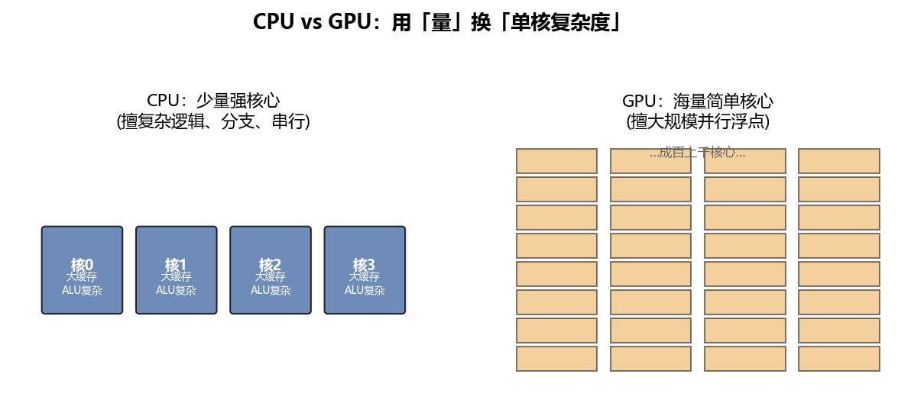
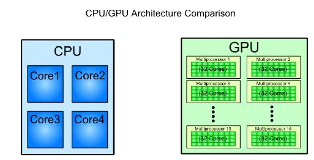
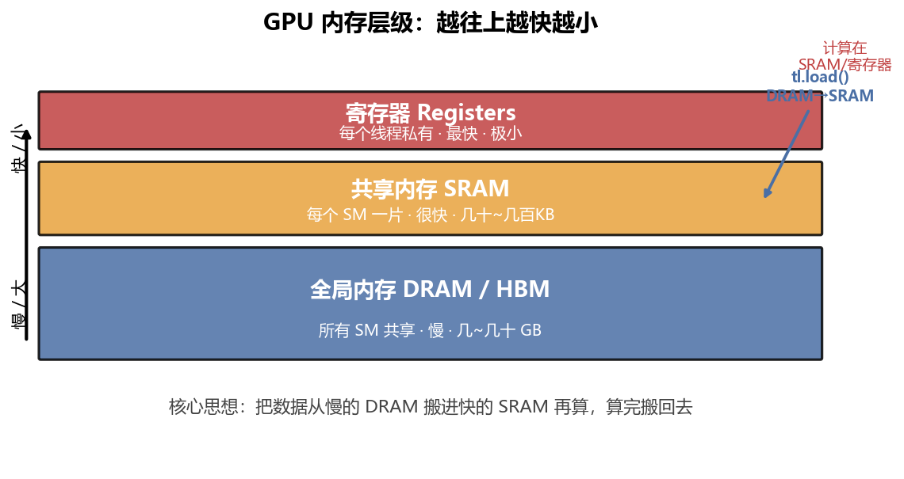
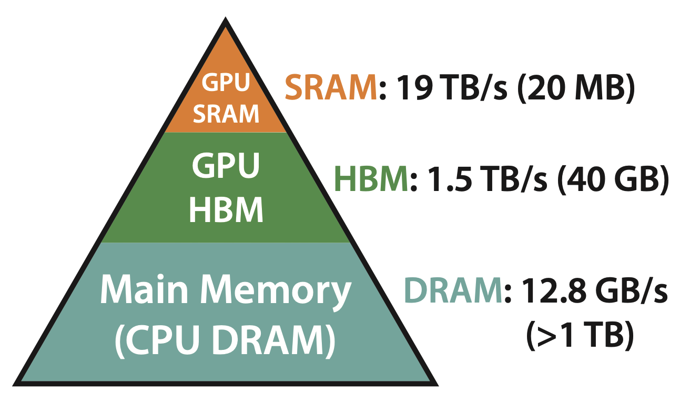
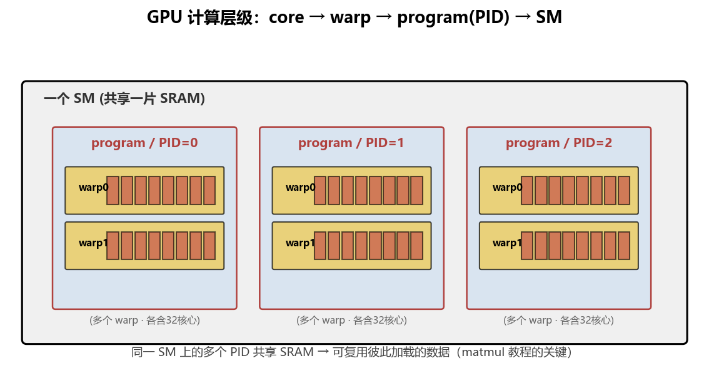
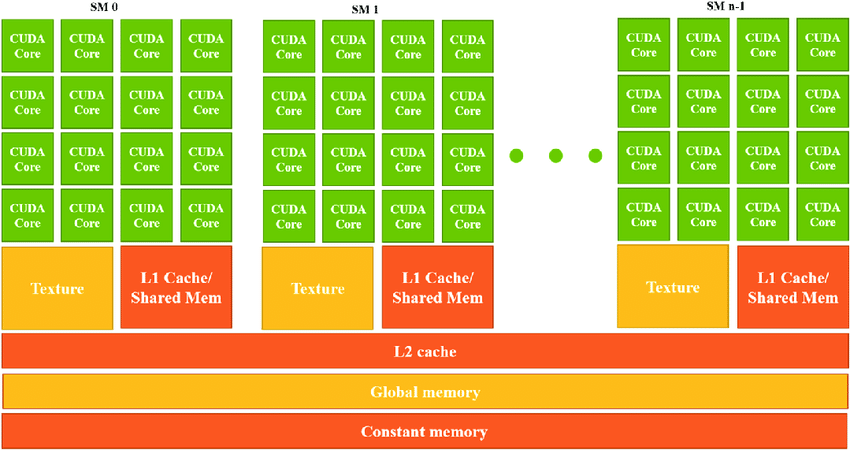

# GPU 架构基础

Triton 帮你屏蔽了大量底层细节，但你只要懂几件事，就能理解后面所有优化决策。这一章就讲这几件事。

## 1. CPU vs GPU：用"量"换"单核复杂度"



> 原仓库用的对比图(展示真实硬件布局)可作补充参照：



- **CPU**：少量（个位数到几十）、强大的核心。每个核心擅长复杂逻辑、分支判断、串行任务。
- **GPU**：海量（成百上千）、简单核心。每个核心一次只做一个浮点运算（FLOP），但**一起上**，对"把同一个运算在大量数据上重复执行"这类任务（矩阵乘、softmax）快得离谱。

## 2. 内存层级：越往上越快越小

这是**全书最重要的一张图**。后面每一章的优化都绕着它转。



> 原仓库的内存层级图(标注了 DRAM/L2/SM/L1/寄存器 等更细的真实层级)，作补充参照。注意真实 GPU 在 SRAM 和 DRAM 之间还有 L2、L1 缓存，本教程简化成"慢的 DRAM / 快的 SRAM"两层来抓主要矛盾：



三层（从下到上、从慢到快）：

| 层 | 位置 | 速度 | 容量 | 谁用 |
|----|------|------|------|------|
| **DRAM / HBM（全局内存）** | GPU 板载显存 | 慢 | 几~几十 GB | 所有 SM 共享。你的输入/输出张量都住这 |
| **SRAM（共享内存）** | 每个 SM 片上 | 快 | 几十~几百 KB | 该 SM 上的所有 program 共享 |
| **寄存器** | 每个线程私有 | 最快 | 极小 | 单个线程 |

**核心直觉（划重点）**：

- 计算要尽量在 SRAM / 寄存器上做；数据平时躺在慢的 DRAM 里，要用时 `tl.load` 搬进 SRAM，算完再 `tl.store` 搬回 DRAM。
- **`tl.load` / `tl.store`（内存搬运）比计算贵得多。** 优化内核 = 减少 DRAM 读写 + 把计算塞进 SRAM。

## 3. SM、program(PID)、warp、core 的层级关系



> 原仓库的 SM 结构图(展示一个 SM 内部的计算核、warp 调度器、SRAM 等真实组成)，作补充参照：



- **SM（Streaming Multiprocessor）**：GPU 里的"小处理器"。一个 GPU 有几十个 SM，每个 SM 自带一片 SRAM，能同时跑多个 program。
- **program / PID**：你写的内核的一次并行实例。整个数据被切成很多块，每个 program 处理一块，用 `tl.program_id()` 拿到自己的编号。**program 由 PID 区分，PID 是一串整数（元组）**，配合索引逻辑算出"我负责哪一块数据"。
- **warp**：最小的核心编组。Nvidia 上 **32 核为一个 warp**，AMD 上 64。**同一 warp 内所有核心必须做完全相同的运算**（这叫 SIMT，Single Instruction Multiple Threads——单指令多线程，即同一 warp 的线程在同一时刻执行同一条指令）。一个 program 里有多个 warp，数量通常由编译器或 autotune 决定（第 05 章会看到如何手动设、第 06 章会看到如何自动调）。
- **core（核心）**：最小计算单元，一次做一个 FLOP（FLoating-point OPeration，一次浮点运算）。

几条来自原仓库的关键提示：
- **每个 SM 上至少跑一个 program**，能跑多少个取决于 SRAM 够不够分：
  ```
  每 SM 上的 program 数 = SRAM 总量 // 每个 program 需要的 SRAM
  ```
  （这里先只看 SRAM 这一限制；实际还受寄存器限制——第 05 章 occupancy 会把两者都纳入，取较小的那个。）
- 如果**单个 program 需要的数据超过 SM 的 SRAM**，会直接报错（这就是为什么后面有的内核要分块循环，而不是一口气加载整行/整列）。
- **如果同一 SM 上不同 PID 加载相同数据，它们会共享而不是各加载一份**——这是 matmul 教程里"PID 重排"能提速的根本原因（[第 06 章](06-矩阵乘法.md)）。

## 4. 小结：三件事

1. **数据平时在慢的 DRAM，计算在快的 SRAM**，`tl.load`/`tl.store` 是搬运，**很贵**。
2. **每个 SM 有一片 SRAM，上面的 program 共享它**；同 SM 的 PID 加载相同数据会自动复用。
3. **单 program 数据超 SRAM 会报错**，所以遇到大维度要用循环分块。

有了这些，我们就可以写第一个内核了。→ [第 04 章：向量加法——第一个 Triton 内核](04-向量加法.md)

