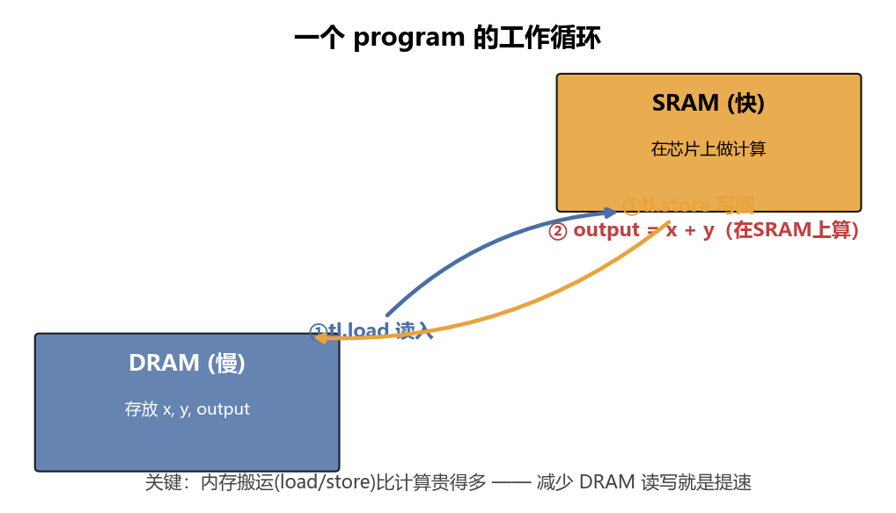
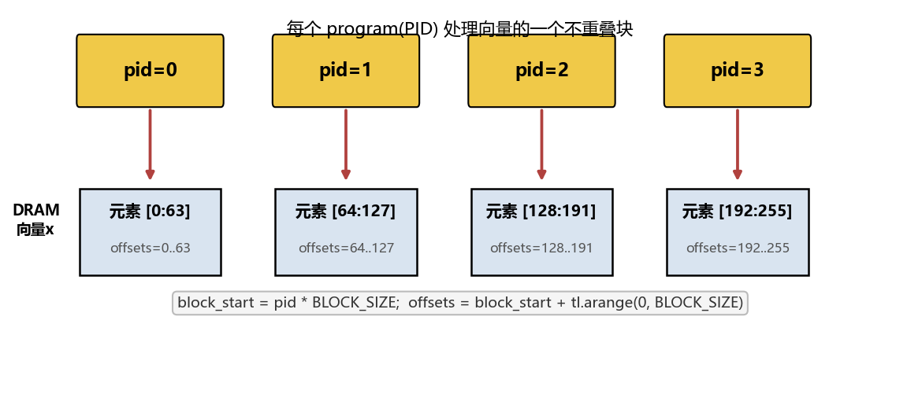
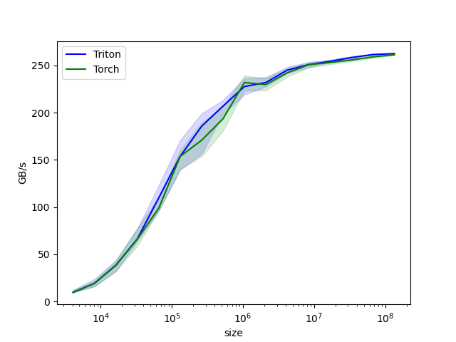

# 第 04 章：向量加法

> 原文件结构分 4 步，作者建议按 **Step1 单元测试 → Step2 wrapper → Step3 kernel → Step4 benchmark** 的顺序读。我们也这么走。

我们要实现最简单的内核：逐元素向量加法 `c = a + b`。但要用 Triton 的方式——让 GPU 上成百上千个 program 同时各算一块。

<details>
<summary>📒 本章对应源码（点击展开）—— 来源：04_vector_addition/vector_addition.py</summary>

```python
"""
In this document we'll implement basically the simplest possible Triton GPU Kernel, which does entry-wise
addition for vectors. 

What you'll learn:
- How to build a test to ensure your Triton kernels are numerically correct
- Basics of Triton kernels (syntax, pointers, launch grids, DRAM vs SRAM, etc)
- How to benchmark your Triton kernels against PyTorch

Recommended order to read the code in:
Step 1 - unit test
Step 2 - wrapper
Step 3 - kernel
Step 4 - benchmark

watch the accompanying YouTube video:
https://youtu.be/fYMS4IglLgg
see original triton documentation:
https://triton-lang.org/main/getting-started/tutorials/01-vector-add.html#sphx-glr-getting-started-tutorials-01-vector-add-py
"""
import torch
import triton
import triton.language as tl
DEVICE = torch.device(f'cuda:{torch.cuda.current_device()}')

######### Step 3 #########
# this `triton.jit` decorator tells Triton to compile this function into GPU code
@triton.jit # only a subset of python capabilities are useable within a triton kernel
def add_kernel(x_ptr, y_ptr, output_ptr, n_elements, BLOCK_SIZE: tl.constexpr): 
    """
    This entry-wise addition kernel is relativevly simple; it's designed to only
     take in vectors as input and does not support any kind of broadcasting

    Each torch.tensor object that gets passed into a Triton kernelis implicitly 
     converted into a pointer to its first element

    x_ptr:          pointer to first entry of input vector of shape (n_elements)
    y_ptr:          pointer to first entry of input vector of shape (n_elements)
    output_ptr:     pointer to first entry of output vector of shape (n_elements)
    n_elements:     size of our vectors
    BLOCK_SIZE:     number of elements each kernel instance should process; should be a power of 2
    
    tl.constexpr designates BLOCK_SIZE as a compile-time variable (rather than run-time), 
     meaning that every time a different value for BLOCK_SIZE is passed in you're actually 
     creating an entirely separate kernel. I may sometimes refer to arguments with this 
     designation as "meta-parameters"
    """
    # There are multiple "programs" processing data; a program is a unique instantiation of this kernel.
    # Programs can be defined along multiple dimensions (defined by your launch grid in the wrapper).
    # this op is 1D so axis=0 is the only option, but bigger operations later may define program_id as a tuple
    # here we identify which program we are:
    pid = tl.program_id(axis=0) 
        # Each program instance gets a unique ID along the specified axis
        # For example, for a vector of length 256 and BLOCK_SIZE=64:
        # pid=0 might processe elements [0:64]
        # pid=1 might processe elements [64:128]
        # pid=2 might processe elements [128:192]
        # pid=3 might processe elements [192:256]
        # I said "might" because the specific elements that get processed depend on the code below

    # herewe tell the program to process inputs that are offset from the initial data (^ described above)
    block_start = pid * BLOCK_SIZE

    # offsets is an array of int32 that act as pointers
    offsets = block_start + tl.arange(0, BLOCK_SIZE)
        # sticking with the above example, if pid=1 then offsets=[64, 65, 66, ...., 126, 127]

    # create a mask to guard memory operations against out-of-bounds accesses
    mask = offsets < n_elements
        # if we didn't do this AND n_elements were not a multiple of BLOCK_SIZE then
        #  the kernel might read entries that are actually part of some other tensor in memory
        #  and use them in calculations

    # here load x and y 
        # from (DRAM / VRAM / global GPU memory / high-bandwidth memory) which is slow to access
        # onto (SRAM / on-chip memory) which is much faster but very limited in size.
        # We store data not currently in-use on DRAM and do calculations on data that's in SRAM
    x = tl.load(x_ptr + offsets, mask=mask, other=None) # shape (BLOCK_SIZE)
    y = tl.load(y_ptr + offsets, mask=mask, other=None) # shape (BLOCK_SIZE)
        # The mask ensures we don't access memory beyond the vector's end.
        # `other` refers to what value to put in place of any masked-out values; it defaults
        #  to None (so we didn't have to actually write it here) but depending on the operation
        #  it may make more sense to use a value like 0.0 (we'll see this in a later tutorial)
        # Whenever you see a tl.load that is a memory operation which is expensive so we want to
        #  keep track of how many memory operations we do. We count them by the total number of
        #  entries being read/written to memory, in this case BLOCK_SIZE per kernel and 
        #  therefore n_elements in total across all running kernels for EACH of these two lines

    # here we perform the operation on SRAM
    # triton has its own internal definitions of all the basic ops that you'll need
    output = x + y
        # For the masked-out entries, None + None = None (really no operation happens at all).
        # Similar to keeping track of memory operations, we also keep track of floating point 
        #  operations (flops) using the shape of the blocks involved. Here this line does BLOCK_SIZE
        #  flops for each pid, meaning n_elements flops total


    # write back to DRAM, being sure to mask in order to avoid out-of-bounds accesses
    tl.store(output_ptr + offsets, output, mask=mask)
        # here is a memory write operation of size BLOCK_SIZE per pid and therefore n_elements 
        # in aggregate across all pids combined

######### Step 2 #########
def add(x: torch.Tensor, y: torch.Tensor):
    '''
    helper/wrapper function to 
        1) allocate the output tensor and 
        2) enque the above kernel with appropriate grid/block sizes
    
    This wrapper function does not connect us to pytorch's graph, meaning it does not
    support backpropogation. That (as well as a backward pass kernel) is for a future lesson
    '''
    # preallocating the output
    output = torch.empty_like(x)

    # Ensures all tensors are on the same GPU device
    # This is crucial because Triton kernels can't automatically move data between devices
    assert x.device == DEVICE and y.device == DEVICE and output.device == DEVICE,\
        f'DEVICE: {DEVICE}, x.device: {x.device}, y.device: {y.device}, output.device: {output.device}'
    
    # getting length of the vectors
    n_elements = output.numel() # .numel() returns total number of entries in tensor of any shape
 
    # grid defines the number of kernel instances that run in parallel
    # it can be either Tuple[int] or Callable(metaparameters) -> Tuple[int]
    # in this case, we use a 1D grid where the size is the number of blocks:
    grid = lambda meta: (triton.cdiv(n_elements, meta['BLOCK_SIZE']), ) 
        # so 'BLOCK_SIZE' is a parameter to be passed into meta() at compile-time, not runtime
        # triton.cdiv = (n_elements + (BLOCK_SIZE - 1)) // BLOCK_SIZE
        # then meta() returns a Tuple with the number of kernel programs we want to 
        #  instantiate at once which is a compile-time constant, meaning that if it
        #  changes Triton will actually create an entirely new kernel for that value
    
    # `triton.jit`'ed functionis can be indexed with a launch grid to obtain a callable GPU kernel
    add_kernel[grid](x, y, output, n_elements, BLOCK_SIZE=1024)
        # BLOCK_SIZE of 1024 is a heuristic choice
        # It's a power of 2 (efficient for memory access patterns)
        # It's large enough to hide memory latency
        # It's small enough to allow multiple blocks to run concurrently on a GPU
        # in a later lesson we'll learn better methods than heuristics
    
    # the kernel writes to the output in-place rather than having to return anything
    # once all the kernel programs have finished running then the output gets returned here
    return output

######### Step 1 #########
def test_add_kernel(size, atol=1e-3, rtol=1e-3, device=DEVICE):
    """
    Here is where we test the wrapper function and kernel that we wrote 
    above to ensure all our values are correct, using pytorch as the 
    correct answer to compare against
    """
    # create data
    torch.manual_seed(0)
    x = torch.rand(size, device=DEVICE)
    y = torch.rand(size, device=DEVICE)
    # run kernel & pytorch reference implementation
    z_tri = add(x, y)
    z_ref = x + y
    # compare
    torch.testing.assert_close(z_tri, z_ref, atol=atol, rtol=rtol)
    print("PASSED")

######### Step 4 #########
# Triton has a set of built-in utilities that make it easy for us to plot performance of custom ops.
# This decorator tells Triton that the below function is a benchmark and what benchmark conditions to run
@triton.testing.perf_report(
    triton.testing.Benchmark(
        x_names=['size'], # argument names to use as an x-axis for the plot
        x_vals=[2**i for i in range(12, 28, 1)], # different values of x_names to benchmark
        x_log = True, # makes x-axis logarithmic
        line_arg='provider', # title of the legend 
        line_vals=['triton', 'torch'], # designators of the different entries in the legend
        line_names=['Triton', 'Torch'], # names to visibly go in the legend
        styles=[('blue', '-'), ('green', '-')], # triton will be blue; pytorch will be green
        ylabel='GB/s', # label name for y-axis
        plot_name='vector-add-performance', # also used as file name for saving plot
        args={}, # we'll see how this is used in a later tutorial; need it even if it's empty
    )
)
def benchmark(size, provider):
    # creating our input data
    x = torch.rand(size, device=DEVICE, dtype=torch.float32)
    y = torch.rand(size, device=DEVICE, dtype=torch.float32)
    # each benchmark runs multiple times and quantiles tells matplotlib what confidence intervals to plot
    quantiles = [0.5, 0.05, 0.95]
    # defining which function this benchmark instance runs
    if provider == 'torch':
        ms, min_ms, max_ms = triton.testing.do_bench(lambda: x + y, quantiles=quantiles)
    if provider == 'triton':
        ms, min_ms, max_ms = triton.testing.do_bench(lambda: add(x, y), quantiles=quantiles)
    # turning the raw millisecond measurement into meaninful units
    gbps = lambda ms: 3 * x.numel() * x.element_size() * 1e-9 / (ms * 1e-3)
        # 3 = number of memory operations (2 reads + 1 write)
        # x.numel() = number of elements
        # x.element_size() = bytes per element (4 for float32, 2 for float16)
        # 1e-9 converts bytes to GB
        # 1e-3 converts milliseconds to seconds
    return gbps(ms), gbps(max_ms), gbps(min_ms)

if __name__ == "__main__":
    # always run unit-tests
    test_add_kernel(size=98432)

    # Only run benchmark if explicitly requested
    import sys
    if len(sys.argv) > 1 and sys.argv[1] == "--benchmark":
        benchmark.run(save_path='.', print_data=False)
```

</details>

---

## 先看全局：一个 program 怎么工作

一个 program（一次内核实例）的生命周期就三步，记牢它：



1. `tl.load`：把负责的那块数据从慢的 **DRAM** 搬进快的 **SRAM**。
2. 在 SRAM 上算 `output = x + y`。
3. `tl.store`：把结果从 SRAM 搬回 DRAM。

多个 program 各管一块、并行执行，合起来就是整个向量的加法。

---

## Step 1：单元测试——先定好"什么是对的"

```python
def test_add_kernel(size, atol=1e-3, rtol=1e-3, device=DEVICE):
    torch.manual_seed(0)
    x = torch.rand(size, device=DEVICE)
    y = torch.rand(size, device=DEVICE)
    z_tri = add(x, y)                       # 我们的 Triton 实现
    z_ref = x + y                           # PyTorch 作为"标准答案"
    torch.testing.assert_close(z_tri, z_ref, atol=atol, rtol=rtol)
    print("PASSED")
```

**做法**：固定随机种子造数据，用 PyTorch 的 `x + y` 当"标准答案"，再和我们的内核结果比，误差在容忍范围内就算过。

> **为什么需要容差、又怎么判定？** 浮点运算有误差（尤其累加顺序不同时，后面 matmul 章会因此放宽容差）。`assert_close` 不是判"完全相等"，而是判"差得够不够小"。它对**每一对**对应元素 `a`（你的结果 `z_tri[i]`）和 `b`（标准答案 `z_ref[i]`）算：
>
> ```
> 误差 = |a - b|
> 容忍线 = atol + rtol * |b|        ← 绝对容差 + 相对容差×基准值
> 若 误差 ≤ 容忍线  → 这一对算通过；所有元素都通过才算整体通过
> ```
>
> - **绝对容差 `atol`（absolute tolerance）**：一个固定的"地板"，和数值大小无关。即使 `b=0`，只要 `误差 ≤ atol` 也通过——它保证零附近的小数不会因相对容差失效。
> - **相对容差 `rtol`（relative tolerance）**：和基准值 `|b|` 成正比。数值越大，允许的误差也越大——因为浮点的"相对精度"是固定的（float32 约 7 位有效数字），数值本身大，绝对误差天然也大。
>
> **举例**（本教程默认 `atol=1e-3, rtol=1e-3`）：
> - 若 `b = 0.5`，容忍线 = `1e-3 + 1e-3 × 0.5 = 1.5e-3`。你的 `a` 只要落在 `0.5 ± 1.5e-3` 内就通过。
> - 若 `b = 100.0`，容忍线 = `1e-3 + 1e-3 × 100 = 0.101`。允许的绝对误差放大到约 0.1。
> - 若 `b = 0`，容忍线 = `1e-3 + 0 = 1e-3`。靠 `atol` 兜底，`a` 在 `±1e-3` 内即通过。
>
> 简记：**"绝对容差兜底零附近、相对容差按比例放大"，两者相加才是总容忍线**。后面各章会按算子误差大小调整这两个值（如 matmul 放到 `1e-2`）。

---

## Step 2：wrapper（包装函数）——CPU 侧的调度员

```python
def add(x: torch.Tensor, y: torch.Tensor):
    output = torch.empty_like(x)            # 1) 预分配输出张量（在 DRAM）
    assert x.device == y.device == output.device == DEVICE
    n_elements = output.numel()             # 向量长度

    grid = lambda meta: (triton.cdiv(n_elements, meta['BLOCK_SIZE']), )
    add_kernel[grid](x, y, output, n_elements, BLOCK_SIZE=1024)
    return output
```

wrapper 干两件事：**预分配输出** + **把内核排队上 GPU 跑**。

### 2.1 预分配输出
`torch.empty_like(x)` 在 DRAM 上开一块和 `x` 同样大小/类型的内存给 `output`。内核直接往里写，不需要返回值。

### 2.2 设备检查
Triton 内核**不会**自动在设备间搬数据。`x`、`y`、`output` 必须都在同一张 GPU 上，否则错乱。

### 2.3 launch grid（启动网格）——开多少个 program
```python
grid = lambda meta: (triton.cdiv(n_elements, meta['BLOCK_SIZE']), )
```
- `triton.cdiv(a, b)` = 向上取整除法 `(a + b - 1) // b`。比如 `cdiv(98432, 1024) = 97`。
- `meta['BLOCK_SIZE']` 是传给内核的编译期参数。`BLOCK_SIZE=1024` 意味着每个 program 处理 1024 个元素。
- 所以这个 grid 说："开 `ceil(向量长度 / 1024)` 个 program，沿一个维度并行。"

> **PID → 数据块映射**：每个 program 用自己的 PID 算出负责哪一块：
> 
> `pid=0` 管元素 `[0:64]`、`pid=1` 管 `[64:128]`……（这是 BLOCK_SIZE=64 的示意；本例是 1024。）

### 2.4 为什么 BLOCK_SIZE=1024？
启发式选择（heuristic），经验法则：
- 是 2 的幂 → 内存访问对齐、高效。
- 够大 → 一个块里算得多，能"掩盖"内存延迟（load 数据时 GPU 不闲着，顺手算别的）。
- 不太大 → 一块 SRAM 上能同时塞多个 block 并发跑。
> 后面章节会学自动调优（autotune），不用再猜。

### 2.5 这套写法不支持反向传播
wrapper 没接入 PyTorch 计算图，所以 `.backward()` 走不通。前向够用；反向是[第 08 章](08-LayerNorm.md)的事。

### 2.6 `add_kernel[grid](...)` 是什么语法？grid 的 1D / 2D / 3D
`@triton.jit` 装饰的函数，用 `[grid]` 索引后变成一个**可调用的 GPU 内核**，括号里传参数。grid 决定开几个 program、参数决定每个 program 干啥。

**grid 是什么**：一个元组，告诉 GPU "在哪些维度上开多少个 program"。维度数可以是 1、2 或 3，对应数据的"形状"。本质就是**把数据的并行维度铺成一个网格**，每个网格点是一个 program。

- **1D grid `(N,)`**：单维并行。向量加法这种一维数据用它：`grid = (cdiv(向量长度, BLOCK_SIZE),)`。
  ```
  PID 沿一维排列：  [0][1][2][3]... → 每个处理向量的一段
  ```
- **2D grid `(M, N)`**：两维并行。矩阵运算（matmul、softmax）用它：比如 `M` 行 `N` 列的输出，每个 program 算一个 `(行块, 列块)`。[第 05/06 章](05-融合Softmax.md)会见到。
  ```
  PID 排成二维：
  [ (0,0) (0,1) (0,2) ]      ← program_id(0) 取行号, program_id(1) 取列号
  [ (1,0) (1,1) (1,2) ]      内核里：pid_m = tl.program_id(0); pid_n = tl.program_id(1)
  [ (2,0) (2,1) (2,2) ]         再用 (pid_m, pid_n) 算出自己负责的块
  ```
- **3D grid `(B, H, N)`**：三维并行。更高维数据（如 batch×头×序列 的注意力，[第 09 章](09-FlashAttention.md)）用它。不过实际上常常**把几个维度合并**（如 batch×head 合成一维）退回成 2D grid，更紧凑——09 章就是这么干的。

> **关键**：grid 的维度数 = 内核里能调 `tl.program_id(axis=...)` 的 axis 范围。1D grid 只能 `program_id(0)`；2D 能取 `program_id(0)` 和 `program_id(1)`，分别对应两个并行维度。**怎么选维度数？看你的数据有几个"独立的并行方向"**：向量一个、矩阵两个、批×头×序列可拆三个（或合并）。

本教程向量加法是 1D，所以 grid 就一个数、内核里只 `program_id(axis=0)`。2D/3D 的实战到 softmax/matmul/attention 再见。

> （第 05 章会出现 `grid = (num_programs, 1, 1)` 这种"看起来是 3D、实际只用一维"的写法——那是 `.warmup()` 的版本限制逼出来的，不是真三维修补，那里会再讲。）

---

## Step 3：内核本体——每个 program 的指令

这是最关键的一段，逐行拆：

```python
@triton.jit                       # ← 装饰器：把这个 Python 函数编译成 GPU 代码
def add_kernel(x_ptr, y_ptr, output_ptr, n_elements, BLOCK_SIZE: tl.constexpr):
    pid = tl.program_id(axis=0)   # 我是第几个 program？
    block_start = pid * BLOCK_SIZE
    offsets = block_start + tl.arange(0, BLOCK_SIZE)
    mask = offsets < n_elements
    x = tl.load(x_ptr + offsets, mask=mask, other=None)
    y = tl.load(y_ptr + offsets, mask=mask, other=None)
    output = x + y
    tl.store(output_ptr + offsets, output, mask=mask)
```

### 3.1 `@triton.jit`
把这个函数**编译**成 GPU 代码。注意：编译后只有 Python 的**一个子集**能用（没有任意 Python 特性）。这就是"用 Python 写，但跑成 GPU 代码"的魔法所在。

### 3.2 参数与指针
```python
x_ptr, y_ptr, output_ptr, n_elements, BLOCK_SIZE: tl.constexpr
```
- **指针**：传进来的 `torch.Tensor` 会被**隐式转成指向其首元素的指针**。所以这里 `x_ptr` 是"向量 x 的第 0 个元素在哪"。
- **`n_elements`**：运行时才知道的值（向量多长），是普通参数。
- **`BLOCK_SIZE: tl.constexpr`**：**编译期常量**（meta-parameter）。意思是：这不是运行时变量，而是在编译时就定死的值。**每换一个不同的 BLOCK_SIZE，Triton 就为你编译一个全新的内核。**

> `constexpr` 的意义：编译器能据此做优化（比如展开循环、分配寄存器）。代价是不同值会生成不同内核，别在循环里频繁换它。

### 3.3 `tl.program_id(axis=0)`：拿自己的编号
```python
pid = tl.program_id(axis=0)
```
这个 op 是 1D 的，只有 `axis=0`。`pid` 是这个 program 的唯一编号。后面靠它算"我该处理哪块数据"。（多维 op 会有 `program_id(0)`、`program_id(1)`，[第 06/09 章](09-FlashAttention.md)会见到。）

### 3.4 算出我负责的元素位置
```python
block_start = pid * BLOCK_SIZE          # 这块的起点
offsets = block_start + tl.arange(0, BLOCK_SIZE)   # 这块所有元素的位置
```
- `tl.arange(0, BLOCK_SIZE)` 生成 `[0,1,2,...,BLOCK_SIZE-1]` 的 **int32 数组**，当指针增量用。
- 例：`pid=1, BLOCK_SIZE=64` → `offsets = [64,65,...,127]`。

### 3.5 mask：防越界（关键！）
```python
mask = offsets < n_elements
```
为什么必须 mask？因为 `BLOCK_SIZE` 常比实际数据大（向量长度不一定是 1024 的整数倍）。不 mask 的话，**内核可能读到内存里属于别的张量的数据**并拿去算，结果错乱、甚至崩。
> mask 是布尔数组，`offsets` 越界的那些位置是 `False`。

### 3.6 `tl.load`：DRAM → SRAM
```python
x = tl.load(x_ptr + offsets, mask=mask, other=None)   # 形状 (BLOCK_SIZE,)
y = tl.load(y_ptr + offsets, mask=mask, other=None)
```
- `x_ptr + offsets`：用指针 + 偏移定位到要读的那些元素。
- `mask`：被挡住（越界）的位置不读，避免越界访问。
- `other=None`：被 mask 挡住的位置填什么值。这里 `None` 表示该位置不加载、其值未定义；后续运算照常执行（SIMT 决定了同一 warp 的核心必须做相同运算，被 mask 的 lane 也会参与），但结果会在 `tl.store` 时被 mask 丢弃，不影响最终输出。某些场景填 `0.0` 或 `-inf` 更合适（[第 05 章](05-融合Softmax.md)会看到 `-inf`）。

> **开始数内存操作**：每次 `tl.load`/`tl.store` 都贵。这里两行 `load`，每个 program 读 `BLOCK_SIZE` 个 x 和 `BLOCK_SIZE` 个 y，所有 program 合起来读了 `n_elements` 个 x + `n_elements` 个 y。养成"数读写次数"的习惯，这是判断内核快慢的第一直觉。

### 3.7 在 SRAM 上算
```python
output = x + y    # 每个 program 算 BLOCK_SIZE 个 flops；全体合起来 n_elements flops
```
Triton 内置了所有基本运算。被 mask 的位置会照常参与运算（SIMT 下同一 warp 必须执行相同运算），但因为这些位置的输入值未定义、输出也会在 `tl.store` 时被 mask 丢弃，所以不影响最终结果。

### 3.8 `tl.store`：SRAM → DRAM
```python
tl.store(output_ptr + offsets, output, mask=mask)
```
把结果写回输出张量，同样要 mask 防越界。全体 program 合起来写了 `n_elements` 个 output。

> **本内核的内存账**：读 `2N`（x+y）+ 写 `1N`（output）= **`3N` 次内存操作**；`N` 次 flops。这是最朴素算子的下限，后面看 benchmark 怎么算带宽时就用它。

---

## Step 4：benchmark——和 PyTorch 比速度

```python
@triton.testing.perf_report(
    triton.testing.Benchmark(
        x_names=['size'], x_vals=[2**i for i in range(12, 28, 1)], x_log=True,
        line_arg='provider', line_vals=['triton', 'torch'], line_names=['Triton', 'Torch'],
        styles=[('blue', '-'), ('green', '-')], ylabel='GB/s',
        plot_name='vector-add-performance', args={},
    )
)
def benchmark(size, provider):
    x = torch.rand(size, device=DEVICE, dtype=torch.float32)
    y = torch.rand(size, device=DEVICE, dtype=torch.float32)
    quantiles = [0.5, 0.05, 0.95]
    if provider == 'torch':
        ms, min_ms, max_ms = triton.testing.do_bench(lambda: x + y, quantiles=quantiles)
    if provider == 'triton':
        ms, min_ms, max_ms = triton.testing.do_bench(lambda: add(x, y), quantiles=quantiles)
    gbps = lambda ms: 3 * x.numel() * x.element_size() * 1e-9 / (ms * 1e-3)
    return gbps(ms), gbps(max_ms), gbps(min_ms)
```

- `perf_report` + `Benchmark`：声明"x 轴是 size（从 2^12 到 2^28）"、"两条线是 triton vs torch"、"y 轴单位 GB/s"。
- `do_bench`：跑多次取分位数（`quantiles` 给置信区间）。
- **带宽公式 `gbps`**：
  ```
  带宽 = 3(读写次数) × 元素数 × 每元素字节数 × 1e-9(转GB) / (耗时ms × 1e-3(转秒))
  ```
  - `3` = 2 读（x,y）+ 1 写（output），正好是上面算的内存账。
  - `x.element_size()`：float32 是 4 字节。
  - 用带宽（GB/s）而非时间衡量，是因为向量加法是**内存受限**算子——瓶颈在搬运而非计算，所以看它吃满了多少带宽。

向量加法这种简单算子，带宽接近理论上限就是好内核——因为计算几乎没有，全在搬数据。

**作者实测结果（RTX 4060Ti，float32）**：



可以看到:在向量足够大时(图右侧)，Triton 实现和 PyTorch 几乎贴在一起，且都逼近该卡的显存带宽理论上限——说明这个内核已经是"内存搬运拉满"的状态，没有优化空间了。小尺寸时 Triton 略低，是启动开销占比大所致。

## 入口
```python
if __name__ == "__main__":
    test_add_kernel(size=98432)              # 先测正确性
    if len(sys.argv) > 1 and sys.argv[1] == "--benchmark":
        benchmark.run(save_path='.', print_data=False)   # 要图才跑 benchmark
```

---

## 本章学到的 Triton 原语清单

| 原语 | 作用 |
|------|------|
| `@triton.jit` | 把函数编译成 GPU 内核 |
| `tl.program_id(axis)` | 拿当前 program 的编号 |
| `tl.arange(start, end)` | 生成整数数组，常做指针偏移 |
| `tl.constexpr` | 标注编译期常量（meta-parameter） |
| `tl.load(ptr+offsets, mask, other)` | DRAM→SRAM 读，带防越界 |
| `tl.store(ptr+offsets, val, mask)` | SRAM→DRAM 写，带防越界 |
| `triton.cdiv(a,b)` | 向上取整除法 |
| `kernel[grid](...)` | 用启动网格调用编译后的内核 |
| `triton.testing.do_bench` / `perf_report` | 基准测试工具 |

## 小结

第一个内核虽简单，但它包含了 Triton 的**全部基础范式**：
1. 数据切块，每个 program 用 PID 认领一块。
2. `load` 进 SRAM → 算 → `store` 回 DRAM。
3. mask 防越界。
4. `constexpr` 区分编译期/运行期。
5. wrapper 算 grid、调内核、不管反向。

**记住那个三步循环图**。下一章我们用它解决一个真问题：为什么 softmax 要"融合"，以及怎么读 GPU 规格、算 occupancy。→ [第 05 章：融合 Softmax](05-融合Softmax.md)
