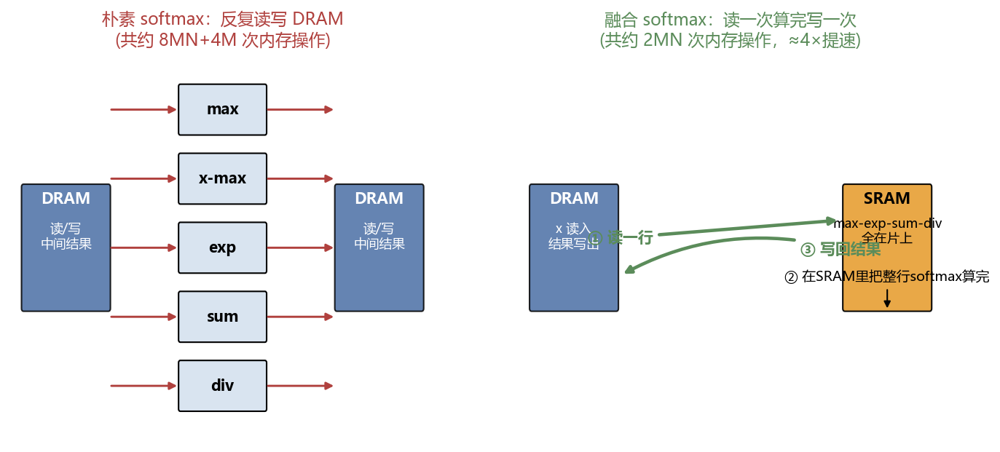
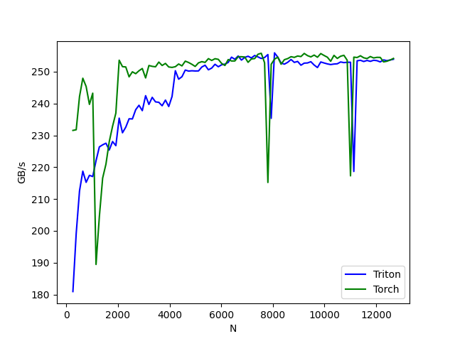

# 第 05 章：融合 Softmax——减少内存读写

> 对应原仓库 `05_fused_softmax/fused_softmax.py`。这章的核心思想贯穿 Triton 全程：**算子融合（fusion）= 把多步计算揉进一个内核，省掉中间结果在 DRAM 上来回搬运**。

读代码顺序：Step1 朴素实现 → Step2 单元测试 → Step3 wrapper → Step4 内核 → Step5 benchmark。

<details>
<summary>📒 本章对应源码（点击展开）—— 来源：05_fused_softmax/fused_softmax.py</summary>

```python
"""
This "fused softmax" kernel only works on matrices whose rows fit in the GPU's SRAM.

What you'll learn:
- The importance of reducing memory reads/writes
- How to fuse multiple operations into one kernel to reduce memory reads/writes
- How to fetch GPU specifications
- Some parts of the GPU architecture that you don't usually have to think about 
    when writing Triton kernels
- How to define meta-parameters using GPU-specific attributes and rough heuristics
- Pipeline parallelism & the weird way that for-loops work within GPU kernels
- How to choose the value of extra entries when masking

Recommended order to read the code in:
Step 1 - naive implementation
Step 2 - unit test
Step 3 - wrapper
Step 4 - kernel
Step 5 - benchmark

watch the accompanying YouTube video:
https://youtu.be/ftknUZDQCPc
see original triton documentation:
https://triton-lang.org/main/getting-started/tutorials/02-fused-softmax.html
"""
import torch
import triton
import triton.language as tl
DEVICE = torch.device(f'cuda:{torch.cuda.current_device()}')

######### Step 1 #########
# first we'll look at the naive implementation jic you need a refresher
def naive_softmax(x):
    '''
    Built for input of size (M,N)
    Safe softmax is when we subtract the maximum element in order to avoid numerical 
    overflows when doing .exp(); softmax is invariant to this shift
    '''
    # read MN elements, find their max along N, and write M elements (the maxes)
    x_max = x.max(dim=1)[0] 
        # pytorch actually outputs a tuple of (values, indices) so [0] grabs the values;
        # we ignored the indices when talking about memory writes above
    # read MN + M elements, subtraction is MN flops, and write MN elements
    z = x - x_max[:, None]
    # read MN elements and write MN elemnts
    numerator = torch.exp(z)
        # exp is actually a lot of flops per element but we're only worried about mem ops rn
    # read MN elements, do MN flops to find M sum values, and then write M elements
    denominator = numerator.sum(dim=1)
    # read MN + M elements, division is MN flops, then write MN elements
    out = numerator / denominator[:, None]

    # in total we did 8MN + 4M memory operations
    # (read 5MN + 2M elements; wrote 3MN + 2M elements)
    return out
"""
that's a whole lot of memory operations. we'd prefer to have a custom "fused" kernel that only 
reads x from DRAM once and does all the necessary computations on SRAM as opposed to repeatedly 
reading & writing to DRAM. that would give a ~4x speedup since 
(8MN + 4M)/2MN = 4 (ignoring the solo M term a la big O notation)

torch.jit.script flag and torch.compile actually aim to do this fusion automatically but can't 
pull it off quite as well as we're about to

our fused softmax kernel will work as follows:
each program (individual call of the kernel) loads a set of rows of the input matrix X which are
  strided by number of programs, softmaxes it and writes back the result to the output Y

note an important limitation of Triton is that each block must have a power-of-two number of
  elements, so we need to internally "pad" each row and guard the memory operations properly
"""

######### Step 4 #########
@triton.jit 
def _softmax_kernel(
    input_ptr, output_ptr,
    input_row_stride, output_row_stride,    # number of elements to skip when moving to next row
    n_rows, n_cols,                         # matrix dimensions
    BLOCK_SIZE: tl.constexpr,               # lowest power-of-2 greater than n_cols
    num_stages: tl.constexpr,
): 
    # the row that this program starts with is defined by the pid
    row_start = tl.program_id(0) 
    # then this gets the total number of parallel programs, which we'll use to know how large 
    #  of a step to make in our for loop once we finish the first row
    row_step = tl.num_programs(0) 
        # Each program processes rows strided by row_step 
        # (ex. if there are 4 programs, program 0 handles rows 0,4,8...)
    
    # whereas tl.arange() provides an array of values, tl.range() acts as an iterator
    for row_idx in tl.range(row_start, n_rows, row_step, num_stages=num_stages):
        # rather than actually implement each iteration of the for loop sequentially, triton can use
        #  num_stages to work on different interations of the for loop simultaneously. Of course
        #  only do this when the iterations don't depend on each other
        
        # the stride represents how much we need to increase the pointer to advance 1 row
        row_start_ptr = input_ptr + row_idx * input_row_stride
            # inyuiyively input_row_stride should be 1 as long as the input tensor is contiguous.
            #  but what if a non-contiguous view of a manipulated tensor were passed in? then
            #  input_row_stride matters

        # load the row into SRAM, using a mask since BLOCK_SIZE is > than n_cols if n_cols is not a power of 2
        col_offsets = tl.arange(0, BLOCK_SIZE) # we can fit each row in a single block
        input_ptrs = row_start_ptr + col_offsets
        mask = col_offsets < n_cols
        row = tl.load(input_ptrs, mask=mask, other=float('-inf')) 
            # we fill in masked out indices with -inf since that's the value that won't influence softmax

        # subtract maximum for numerical stability
        row_minus_max = row - tl.max(row, axis=0)
            # all the invalid -inf values remain -inf when we subtract the max
        # note that exponentiation in Triton is fast but approximate; later we'll learn an even faster alternative
        numerator = tl.exp(row_minus_max)
            # all the -inf values get set to 0 since exp(-inf)=0
        denominator = tl.sum(numerator, axis=0)
            # all the invalid 0 values do get summed but don't matter since they're 0
        softmax_output = numerator / denominator
            # all the invalid 0's are 0/sum and therefore remain 0

        # write output back to DRAM
        output_row_start_ptr = output_ptr + row_idx * output_row_stride
        tl.store(output_row_start_ptr + col_offsets, softmax_output, mask=mask)
            # using our mask we only store back the valid n_cols values

######### Step 3 #########
"""
before we create the wrapper function that enqueues the kernel and its meta-parameters, we're going to
 fetch the specifications of our GPU to help later when defining our meta-parameters such that they're 
 especially well suited (fast) to the specific GPU we're using
"""
# fetching a dictionary full of the GPU's specifications
properties = triton.runtime.driver.active.utils.get_device_properties(DEVICE.index)
# each Streaming Multi-processor (SM) is like a mini-processor that can run multiple programs
NUM_SM = properties["multiprocessor_count"] 
# registers are the fastest memory on the GPU
NUM_REGS = properties["max_num_regs"] 
    # each SM has a limited number of registers; 
    # programs share these registers, so using too many per program limits parallelism
# each SM has a dedicated pool of SRAM that it can access
# since there can be multiple programs per SM, those programs share the same SRAM
    # ^that will be very useful information later in the matmul tutorial
TOTAL_SRAM_PER_SM = properties["max_shared_mem"] 
# a warp is a group of threads that execute together
# a thread can be thought of as analagous to a single CPU core, but far more limited in the operations it can do
WARP_SIZE = properties["warpSize"]# usually 32 on nvidia GPUs and 64 on AMD

def softmax(x):
    '''
    helper/wrapper function to 
        1) allocate the output tensor and 
        2) enque the above kernel with appropriate grid/block sizes
    
    This wrapper function does not connect us to pytorch's graph, meaning it does not
    support backpropogation. That (as well as a backward pass kernel) is for a future lesson
    '''
    # this kernel is only built to support matrices; expanding that support is simple but for a later lesson
    assert x.ndim == 2
    n_rows, n_cols = x.shape

    # the block size is the smallest power of 2 greater than the number of columns in x
    BLOCK_SIZE = triton.next_power_of_2(n_cols)

    # a trick we can use is to ask the compiler to use more threads per row by
    #  increasing the number of warps (`num_warps`) over which each row is distributed.
    # for now these settings are just a heuristic
    # you will see in the next tutorial how to auto-tune this value in a more natural way
    #   so you don't have to come up with manual heuristics yourself
    num_warps = 4
    if BLOCK_SIZE >= 2048:
        num_warps = 8
    if BLOCK_SIZE >= 4096:
        num_warps = 16

    # Rather than executing all code within a kernel sequentially, the GPU can actually do multiple things at once.
    # This is called the number of software pipelining stages.
    # For example, with 2 stages we can have one do the operation while the other is loading the next operands 
    #  from DRAM into SRAM. With 3 we can have one do current operations, one load next operands, and one saving 
    #  previous operands.
    # Triton just needs the number of stages and it'll handle how to use them efficiently.
    # Here we use a simple heuristic of "if we've got a lot of memory, use 4. otherwise use 2"
    num_stages = 4 if TOTAL_SRAM_PER_SM > 200_000 else 2

    # allocate output
    y = torch.empty_like(x)

    # .warmup() pre-compiles kernel and tells us how many registers and how much shared memory it needs
    kernel = _softmax_kernel.warmup(x, y, # this warmup depends on the attributes of the input and output
                                    x.stride(0), y.stride(0), # see below
                                    n_rows, n_cols,
                                    BLOCK_SIZE=BLOCK_SIZE,
                                    num_stages=num_stages,
                                    num_warps=num_warps,
                                    grid=(1,))
    # x.stride() for each dimension tells us how many entries in memory a pointer needs to move forward in order
    #  to get to the next element of the tensor along the specified dimension. 
    # For any tensor x that is "contiguous", meaning ~cleanly/simply~ defined in memory and for a shape (M, N, K) 
    #  you can expect x.stride(0) == N*K, x.stride(1)==K, and x.stride(2)==1, or more generally 
    #  x.stride(-Z)==math.prod(x.shape[-Z:])
    # A tensor might be non-contiguous if, for example, it's been saved to memory using torch.view() or some similar
    #  operation that leaves the original data in place but messes with dimensions

    # here's the info that warmup process gave us
    kernel._init_handles()
    n_regs = kernel.n_regs
    sram_needed_per_program = kernel.metadata.shared 

    # and here's how we use that info to setup our kernel
    # register-based occupancy
    reg_occupancy = NUM_REGS // (n_regs * WARP_SIZE * num_warps)
        # each SM has NUM_REGS registers (eg 65536)
        # each program uses
            # n_regs per register thread (eg 32)
            # WARP_SIZE threads per warp (32 on Nvidia, 64 on AMD)
            # num_warps warps per program (4, 8, or 16 in our case with the aforementioned heuristic)
        # so each program needs n_regs * WARP_SIZE * num_warps registers total
        # therefore we can fit reg_occupancy programs per SM
        # ex. 65536 // (32 * 32 * 8) = 8 programs per SM (assuming num_warps=8)
    # shared memory-based occupancy
    sram_occupancy = TOTAL_SRAM_PER_SM // sram_needed_per_program
    # determines how many programs can run per SM based on register usage and shared memory usage
    programs_per_sm = min(reg_occupancy, sram_occupancy)
        # the former is the optimal allocation assuming we have more than enough SRAM
        # the latter is our limit on SRAM when splitting it equally among all SMs
    # then given our number of SMs, we calculate how many programs to run in total
    num_programs = min(NUM_SM * programs_per_sm, n_rows)
        # ofc we have another limit since we've got no need to surpass the n_rows in the matrix

    # grid configuration; each row gets its own program
    grid = (num_programs, 1, 1)
        # the extra 1's are usually not necessary if they're not being used
        # we use them here because the .warmup() we used earlier has a weird quirk in the way
        #  it's implemented that forces only 3D launch grids to be inputted once it's been used
        # in future lessons we don't use .warmup() so we'll not be required to do this again

    # And now we get to run the kernel with our heuristics-based launch grid
    kernel[grid](
        x, y,
        x.stride(0), y.stride(0),
        n_rows, n_cols,
        BLOCK_SIZE,
        num_stages
    )
    return y

######### Step 2 #########
def test_softmax_kernel(size: tuple, atol=1e-3, rtol=1e-3, device=DEVICE):
    """
    Here is where we test the wrapper function and kernel that we wrote 
    above to ensure all our values are correct, using pytorch as the 
    correct answer to compare against

    we'll use an irregular number of rows & cols to verify that our padding mechanism works
    """
    # create input data
    torch.manual_seed(0)
    assert type(size) is tuple and len(size) == 2
    x = torch.randn(size[0], size[1], device=DEVICE)
    # run kernel & pytorch reference implementation
    z_tri = softmax(x)
    z_ref = torch.softmax(x, axis=1)
        # notice our implementation doesn't give a choice for what axis to softmax along.
        # this is a common theme of custom GPU kernels; because pytorch has to write code that
        #  is more general, it is slower than it could be
    # compare
    torch.testing.assert_close(z_tri, z_ref, atol=atol, rtol=rtol)
    print("PASSED")

######### Step 5 #########
@triton.testing.perf_report(
    triton.testing.Benchmark(
        x_names=['N'],
        x_vals=[128 * i for i in range(2, 100)],
        line_arg='provider',
        line_vals=['triton', 'torch'],
        line_names=["Triton", "Torch"],
        styles=[('blue', '-'), ('green', '-')],
        ylabel="GB/s",
        plot_name="softmax-performance",
        args={'M': 4096} # values for function arguments not in x_names
    ))
def benchmark(M, N, provider):
    # making the input data
    x = torch.randn(M, N, device=DEVICE, dtype=torch.float32)

    # these two lines ensure more accurate benchmarks; i usually forget to use them but it's not a big deal
    stream = getattr(torch, DEVICE.type).Stream()
    getattr(torch, DEVICE.type).set_stream(stream)

    if provider == 'torch':
        ms = triton.testing.do_bench(lambda: torch.softmax(x, axis=-1))
    if provider == 'triton':
        ms = triton.testing.do_bench(lambda: softmax(x))
    gbps = lambda ms: 2 * x.numel() * x.element_size() * 1e-9 / (ms * 1e-3)
        # 2 = number of memory operations (1 read + 1 write)
        # x.numel() = number of elements
        # x.element_size() = bytes per element (4 for float32)
        # 1e-9 converts bytes to GB
        # 1e-3 converts milliseconds to seconds
    return gbps(ms)

if __name__ == "__main__":
    # always run unit-tests
    test_softmax_kernel(size=(1823, 781))

    # Only run benchmark if explicitly requested
    import sys
    if len(sys.argv) > 1 and sys.argv[1] == "--benchmark":
        benchmark.run(save_path='.', print_data=False)
```

</details>

---

## 1. 为什么"朴素 softmax"慢？数内存账

先看用 PyTorch 怎么写 softmax（safe softmax，减最大值防溢出）：

```python
def naive_softmax(x):                 # x 形状 (M, N)
    x_max = x.max(dim=1)[0]            # 读 MN，找每行最大，写 M 个最大值
    z = x - x_max[:, None]             # 读 MN+M，减法 MN flops，写 MN
    numerator = torch.exp(z)           # 读 MN，写 MN
    denominator = numerator.sum(dim=1) # 读 MN，算 MN flops，写 M 个和
    out = numerator / denominator[:, None]  # 读 MN+M，除法 MN flops，写 MN
    return out
```

**数内存操作**（M 行 N 列，忽略单独的 M 项）：

```
读: 5MN + 2M   写: 3MN + 2M   合计约 8MN + 4M 次内存操作
```

每一步都要把**整张矩阵**在 DRAM ↔ SRAM 之间搬一遍，搬了 4 趟！内存搬运比计算贵，这就是它慢的根源。

## 2. 融合：读一次、算完、写一次



融合 softmax：**每个 program 加载一行（或几行），在 SRAM 上把 max → 减 → exp → sum → 除 全部算完，再一次性写回**。内存账变成：

```
读: MN   写: MN   合计 2MN
```

`(8MN + 4M) / 2MN ≈ 4`，**理论约 4 倍提速**。这就是融合的全部价值。

> `torch.compile` / `torch.jit.script` 也想做这种融合，但定制内核做得更彻底——这也是为什么自己写内核仍然有意义。

## 3. 内核怎么设计

每个 program 处理**一行**：加载该行进 SRAM → 算 softmax → 写回。多行由多 program 并行处理，且**跨步（strided）分配**——不是 program0 处理 0,1,2 行，而是处理 0,4,8... 行（见下文 `row_step`）。

> 限制：本内核**只在整行能塞进一个 block 的 SRAM 时成立**（`BLOCK_SIZE ≥ N`）。行太长装不下时，需要更复杂的"沿 N 分块 + 在线 softmax"——那正是[第 09 章 Flash Attention](09-FlashAttention.md) 的主题。

### 3.1 2 的幂与 padding

Triton 要求每个 block 的元素数是 **2 的幂**。如果 `N=781`（不是 2 的幂），就取 `BLOCK_SIZE = next_power_of_2(781) = 1024`，多出来的位置用 mask 挡住、填 `-inf`。

```python
BLOCK_SIZE = triton.next_power_of_2(n_cols)
```

### 3.2 mask 该填什么值？——选 `-inf` 的妙处

```python
mask = col_offsets < n_cols
row = tl.load(input_ptrs, mask=mask, other=float('-inf'))
row_minus_max = row - tl.max(row, axis=0)   # -inf 减去 max 还是 -inf
numerator = tl.exp(row_minus_max)            # exp(-inf) = 0
denominator = tl.sum(numerator, axis=0)     # 0 不影响求和
softmax_output = numerator / denominator      # 0 / sum = 0
```

填 `-inf` 的链式好处：
- 减最大值后，越界位置仍是 `-inf`；
- `exp(-inf) = 0`，越界变 0；
- 求和时 0 不影响；
- 最后 0/sum = 0，写回时再 mask 掉这些位置即可。

**这是贯穿 softmax/attention 的关键技巧**：选一个"对后续运算无副作用"的填充值。换成 `0.0` 行不行？对 softmax 不行，因为 `exp(0)=1` 会污染求和。

### 3.3 内核主体（精简版）

```python
@triton.jit
def _softmax_kernel(input_ptr, output_ptr,
                    input_row_stride, output_row_stride,
                    n_rows, n_cols,
                    BLOCK_SIZE: tl.constexpr, num_stages: tl.constexpr):
    row_start = tl.program_id(0)               # 我从第几行开始
    row_step = tl.num_programs(0)              # 跨步 = 总 program 数
    for row_idx in tl.range(row_start, n_rows, row_step, num_stages=num_stages):
        row_start_ptr = input_ptr + row_idx * input_row_stride
        col_offsets = tl.arange(0, BLOCK_SIZE)
        mask = col_offsets < n_cols
        row = tl.load(row_start_ptr + col_offsets, mask=mask, other=float('-inf'))
        row_minus_max = row - tl.max(row, axis=0)
        numerator = tl.exp(row_minus_max)
        denominator = tl.sum(numerator, axis=0)
        softmax_output = numerator / denominator
        output_row_start_ptr = output_ptr + row_idx * output_row_stride
        tl.store(output_row_start_ptr + col_offsets, softmax_output, mask=mask)
```

#### `tl.num_programs(0)` 与跨步分配
`row_step = tl.num_programs(0)` = 第 0 轴开了几个 program。若有 4 个 program，则：
- program0 处理行 0,4,8,…
- program1 处理行 1,5,9,…
- ……

这样数据均匀分散到各 SM，避免某些 SM 被塞满而其他 SM 闲置（负载不均）。

#### `tl.range(..., num_stages=...)`：软件流水
注意这里用 `tl.range` 而不是 Python `range`。`num_stages` 让 Triton **同时处理多个循环迭代**——比如算当前行的同时，预读下一行进 SRAM。前提：**迭代之间互不依赖**（softmax 各行独立，满足）。
- 原始注释的比喻：2 级时一个算、一个读下一条；3 级时一个算、一个读、一个写上一条。

> `tl.range` 是迭代器，`tl.arange` 是生成数组——名字像但完全不同，别混。

## 4. wrapper：读 GPU 规格 + 算 occupancy

这是本章最"硬件味"的部分。wrapper 不再瞎猜 block 大小，而是**先查你这台 GPU 的规格**，再据此算出能塞多少 program。

### 4.1 查 GPU 规格
```python
properties = triton.runtime.driver.active.utils.get_device_properties(DEVICE.index)
NUM_SM = properties["multiprocessor_count"]          # SM 个数
NUM_REGS = properties["max_num_regs"]                 # 每个能用的寄存器上限
TOTAL_SRAM_PER_SM = properties["max_shared_mem"]      # 每个 SM 的 SRAM 总量
WARP_SIZE = properties["warpSize"]                    # 32(nvidia) / 64(amd)
```
> 此 API 路径随 Triton 版本可能变化（3.x 之后改过），若报错请查当前版本对应的接口。

### 4.2 warmup：问编译器"我的内核要多少寄存器和 SRAM"
```python
kernel = _softmax_kernel.warmup(
    x, y, x.stride(0), y.stride(0), n_rows, n_cols,
    BLOCK_SIZE=BLOCK_SIZE, num_stages=num_stages, num_warps=num_warps,
    grid=(1,))
kernel._init_handles()
n_regs = kernel.n_regs
sram_needed_per_program = kernel.metadata.shared
```
`warmup` 先编译一次内核（用 1 个 program 的假 grid），然后**报告它实际用了多少寄存器、多少 SRAM**。拿到这两个数，才能算"一个 SM 能塞几个 program"。

### 4.3 stride：判断张量是否连续
```python
x.stride(0), y.stride(0)
```
`stride(i)` = 沿第 i 维前进一个元素、指针要走多少步。对连续张量（shape `(M,N)`），`stride(0)==N, stride(1)==1`。
- 用 `torch.view()` 之类产生的**非连续视图**，stride 会不一样。softmax 内核要靠 stride 正确跳到下一行，所以必须传 stride 而不是假定连续。

### 4.4 occupancy（占用率）：一个 SM 能塞几个 program

先理清"一个 program 用多少寄存器"：一个 program 由 `num_warps` 个 warp 组成，每个 warp 有 `WARP_SIZE`(=32) 个线程，每个线程用 `n_regs` 个寄存器（`n_regs` 由上面 warmup 报告，是**每线程**的寄存器数）。所以单个 program 的寄存器总量 = `n_regs × WARP_SIZE × num_warps`。一个 SM 的寄存器总数 `NUM_REGS` 除以它，就是该 SM 能塞下的 program 数。

```python
reg_occupancy = NUM_REGS // (n_regs * WARP_SIZE * num_warps)
sram_occupancy = TOTAL_SRAM_PER_SM // sram_needed_per_program
programs_per_sm = min(reg_occupancy, sram_occupancy)
num_programs = min(NUM_SM * programs_per_sm, n_rows)
grid = (num_programs, 1, 1)
```

两类资源会限制并发数，取较小的那个（木桶效应）：
- **寄存器**：每个 program 用 `n_regs × WARP_SIZE × num_warps` 个寄存器。
  例（各数字含义）：`NUM_REGS=65536`，`n_regs=32`（每线程），`WARP_SIZE=32`，`num_warps=8` → `65536 // (32 × 32 × 8) = 8` 个 program/SM。
- **SRAM**：每个 program 用 `sram_needed_per_program`，能塞 `TOTAL_SRAM // 那个值` 个。

最终 program 总数 = `SM 数 × 每 SM 的 program 数`，但不能超过 `n_rows`（没那么多行可算）。grid 用这个数。

> 为什么 grid 是 `(num_programs, 1, 1)` 三元组？因为 `.warmup()` 有个实现怪癖：用过它之后只接受 3D grid。这是 Triton 当前版本的实现限制，不是通用规则；后续章节不用 warmup 就没这限制。

### 4.5 num_warps 的启发式
```python
num_warps = 4
if BLOCK_SIZE >= 2048: num_warps = 8
if BLOCK_SIZE >= 4096: num_warps = 16
```
块越大，让更多 warp（每个 warp 32 线程）分担一行，提高并行。下一章 matmul 会用 autotune 自动找这个值，不用手猜。

### 4.6 num_stages 的启发式
```python
num_stages = 4 if TOTAL_SRAM_PER_SM > 200_000 else 2
```
SRAM 充裕就用更多流水级（占用更多 SRAM 但更并行），紧张就少用。

## 5. 单元测试 & benchmark

测试用**不规则尺寸** `(1823, 781)`，专门验证 padding/mask 机制：

```python
def test_softmax_kernel(size: tuple, ...):
    x = torch.randn(size[0], size[1], device=DEVICE)
    z_tri = softmax(x)
    z_ref = torch.softmax(x, axis=1)
    torch.testing.assert_close(z_tri, z_ref, atol=1e-3, rtol=1e-3)
```

benchmark 的带宽公式里 `2` = 1 读 + 1 写（融合后只读写各一次）：
```python
gbps = lambda ms: 2 * x.numel() * x.element_size() * 1e-9 / (ms * 1e-3)
```

**作者实测结果（RTX 4060Ti，float32，M=4096 行固定，N 从 256 到 ~12800）**：



图中 Triton（蓝）明显高过 PyTorch（绿），且随列数 N 增大优势拉开——正是"融合省 DRAM 读写"的体现:PyTorch 的 8MN 内存操作被 Triton 压到 2MN，列越多省得越多。带宽没贴满理论上限，是因为 softmax 还有不少计算(逐元素 exp/sum)在吃时间。

## 本章学到的

| 概念 | 要点 |
|------|------|
| **算子融合** | 多步计算揉进一个内核，DRAM 读写从 8MN 降到 2MN |
| **填充值选择** | softmax 用 `-inf`，因 `exp(-inf)=0` 不污染求和 |
| **跨步分配** | `row_step = num_programs(0)`，行均匀分散到各 SM |
| **读 GPU 规格** | `get_device_properties` 拿 SM 数/寄存器/SRAM/warpSize |
| **warmup** | 预编译拿到内核实际寄存器/SRAM 用量 |
| **occupancy** | `min(寄存器占用, SRAM占用)` 决定每 SM 的 program 数 |
| **num_warps / num_stages** | 块大用更多 warp；SRAM 够用更多流水级 |
| **stride** | 处理非连续张量靠它跳行 |
| **`tl.range` vs `tl.arange`** | 前者是带流水级的迭代器，后者是生成数组 |

## 小结

到这你已能写"读一次算完写一次"的融合内核，并懂得查硬件规格来配置 grid。但**当一行装不进 SRAM 时怎么办？** Flash Attention 的在线 softmax 会回答。在那之前，接下来讲 GPU 上最重要的算子——矩阵乘，它将引入**自动调优**和**PID 重排**这两个重要概念。→ [第 06 章：矩阵乘法](06-矩阵乘法.md)
