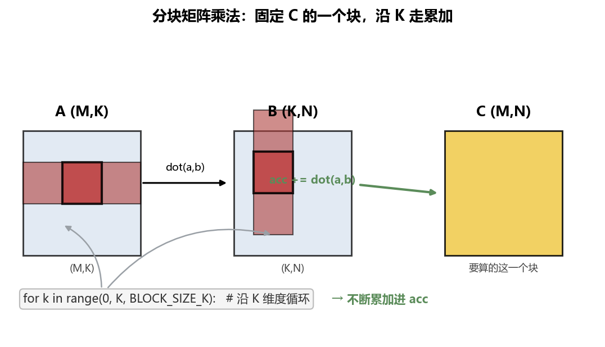
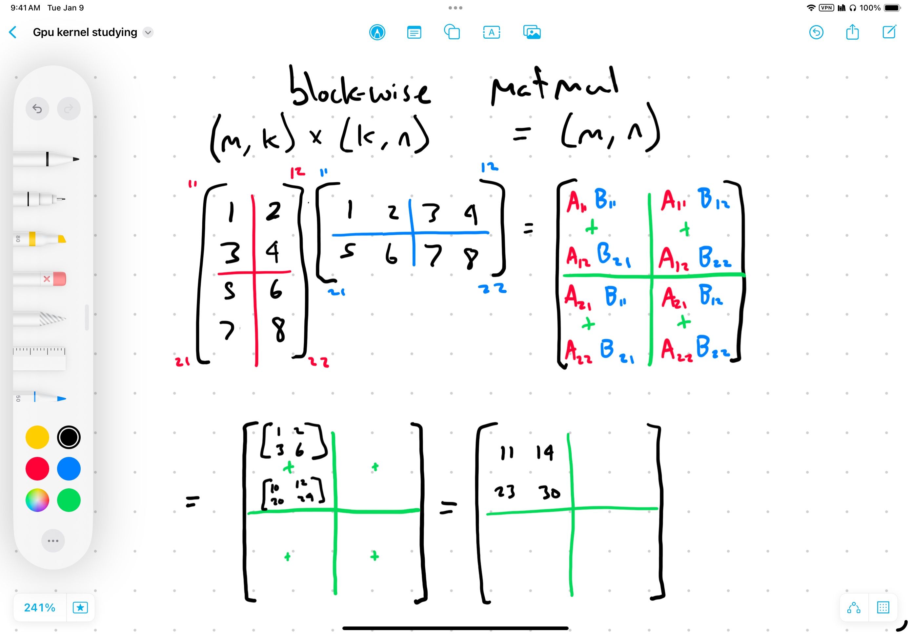
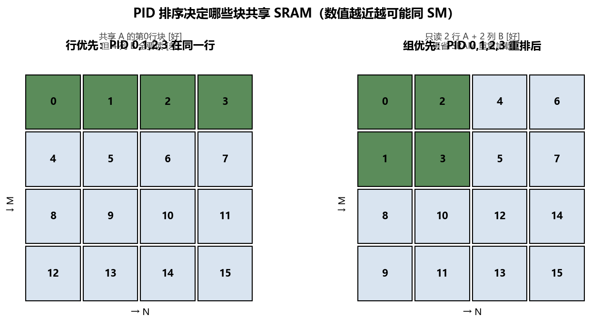
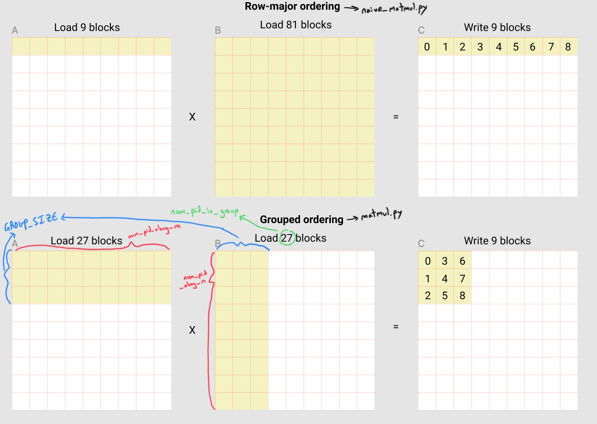
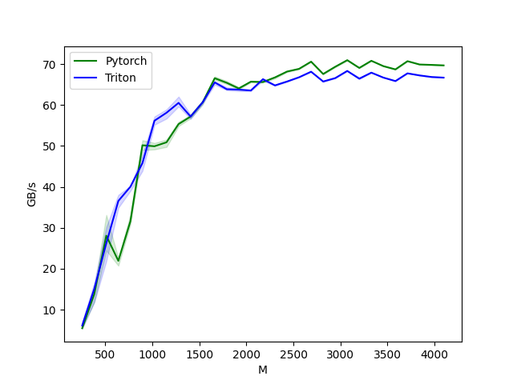

# 第 06 章：矩阵乘法——自动调优与程序重排

> 对应原仓库 `06_matmul/matmul.py`。这是**最关键的章节之一**：它引入两个 Triton 重要特性——**自动调优（autotune）** 和 **PID 重排（程序重排）**。后者是理解"为什么内核能比 PyTorch 还快"的钥匙。

读代码顺序：Step1 单元测试 → Step2 wrapper → Step3 内核 → Step4 benchmark。

<details>
<summary>📒 本章对应源码（点击展开）—— 来源：06_matmul/matmul.py</summary>

```python
"""
This matmul kernel can be a bit confusing but is very crucial to understand

 What you'll learn:
- Automatic performance tuning
- Program re-ordering for improved SRAM hit rate
- Multi-dimensional pointer arithmetic
- High precision data type accumulation
- using the Triton interpreter (kind of)

Recommended order to read the code in:
Step 1 - unit test
Step 2 - wrapper
Step 3 - kernel
Step 4 - benchmark

For matmul of A @ B = C of shapes (M, K) @ (K, N) = (M, N), the following
algorithm is numerically equivalent to what our code will output, but we'll
get to the answer in a different way
for m in range(0, M, BLOCK_SIE_M): # do in parallel
    for n in range(0, N, BLOCK_SIZE_N): # do in parallel
        acc = zeros((BLOCK_SIZE_M, BLOCK_SIZE_N), dtype=float32)
        for k in range(0, K, BLOCK_SIZE_K):
            a = A[m : m+BLOCK_SIZE_M, k : k+BLOCK_SIZE_K]
            b = B[k : k+BLOCK_SIZE_K, n : n+BLOCK_SIZE_N]
            acc += dot(a,b)
        C[m : m+BLOCK_SIZE_M, n : n+BLOCK_SIZE_N] = acc

see original
https://triton-lang.org/main/getting-started/tutorials/03-matrix-multiplication.html
"""
import torch
import triton
import triton.language as tl
DEVICE = torch.device(f'cuda:{torch.cuda.current_device()}')

######### Step 3 #########

# un-comment this to run a numpy emulation of Triton on CPU & be able to debug with print() statements
#import os
#os.environ["TRITON_INTERPRET"] = "1"

# autotuning is just setting up a bunch of different potential meta-parameters configurations that Triton will automatically
# choose from later based on which one performs best on our specific GPU. Triton will figure out for us which one to use. They're 
# all values chosen heuristically, but notice everything is a multiple of 32 in sticking w/ the number of threads in a warp.
autotune_configs = [
    triton.Config({'BLOCK_SIZE_M': 128, 'BLOCK_SIZE_N': 256, 'BLOCK_SIZE_K': 64, 'GROUP_SIZE': 8}, num_stages=3, num_warps=8),
    triton.Config({'BLOCK_SIZE_M': 64, 'BLOCK_SIZE_N': 256, 'BLOCK_SIZE_K': 32, 'GROUP_SIZE': 8}, num_stages=4, num_warps=4),
    triton.Config({'BLOCK_SIZE_M': 128, 'BLOCK_SIZE_N': 128, 'BLOCK_SIZE_K': 32, 'GROUP_SIZE': 8}, num_stages=4, num_warps=4),
    triton.Config({'BLOCK_SIZE_M': 128, 'BLOCK_SIZE_N': 64, 'BLOCK_SIZE_K': 32, 'GROUP_SIZE': 8}, num_stages=4, num_warps=4),
    triton.Config({'BLOCK_SIZE_M': 64, 'BLOCK_SIZE_N': 128, 'BLOCK_SIZE_K': 32, 'GROUP_SIZE': 8}, num_stages=4, num_warps=4),
    triton.Config({'BLOCK_SIZE_M': 128, 'BLOCK_SIZE_N': 32, 'BLOCK_SIZE_K': 32, 'GROUP_SIZE': 8}, num_stages=4, num_warps=4),
    triton.Config({'BLOCK_SIZE_M': 64, 'BLOCK_SIZE_N': 32, 'BLOCK_SIZE_K': 32, 'GROUP_SIZE': 8}, num_stages=5, num_warps=2),
    triton.Config({'BLOCK_SIZE_M': 32, 'BLOCK_SIZE_N': 64, 'BLOCK_SIZE_K': 32, 'GROUP_SIZE': 8}, num_stages=5, num_warps=2)
]
# `triton.jit`'ed functions can be auto-tuned by using the `triton.autotune` decorator which consumes
#   1) a list of `triton.Config` objects that define different configs of meta-parameters and compilation options
#   2) an auto-tuning *key* whose change in values will trigger a new evaluation of all the provided configs, meaning
#       that any time either M, N, or K changes with a new input, Triton will check which config is best all over again
@triton.autotune(configs = autotune_configs, key=['M', 'N', 'K'])
@triton.jit
def _matmul_kernel(
    a_ptr, b_ptr, c_ptr, 
    M, N, K, 
    stride_a_M, stride_a_K, 
    stride_b_K, stride_b_N, 
    stride_c_M, stride_c_N, 
    # meta-parameters
    BLOCK_SIZE_M: tl.constexpr, BLOCK_SIZE_N: tl.constexpr, BLOCK_SIZE_K: tl.constexpr,
    GROUP_SIZE: tl.constexpr, 
):
    """
    First we need to map each program id to the block of C it will compute. 
    Let's look at an example where
    M = N = K = 8,
    BLOCK_SIZE_M = BLOCK_SIZE_K = BLOCK_SIZE_N = 2
    A naive implementation might do something like
    [0,   1,  2,  3]
    [4,   5,  6,  7]
    [8,   9, 10, 11]
    [12, 13, 14, 15]
    where each of those PIDs corresponds to a 2x2 block of C (which is of size 8x8). 
    What parts of A and B do we need in order to compone one of them, say 0? 
    Let's look at how matmul works, where x's will denote the blocks in A and B that we need to use to create 
    the block of C corresponding to PID=0
        A           @       B           =       C
    [x, x, x, x]        [x, _, _, _]        [0, _, _, _]
    [_, _, _, _]        [x, _, _, _]        [_, _, _, _]
    [_, _, _, _]        [x, _, _, _]        [_, _, _, _]
    [_, _, _, _]        [x, _, _, _]        [_, _, _, _]
    So in order to create the 2x2 block of C that corresponds to PID=0, we need four 2x2 blocks from the top rows 
    of A and four 2x2 blocks from the first columns of B. 
    Note that rather than loading all 8 blocks into SRAM at the same time, we can iterate over the columns/rows 
    of A/B (respectively), doing a kind of mini matmul between two corresponding blocks and adding them together as we go.
        A           @       B
    [--------->]        [ | , _, _, _]
    [_, _, _, _]        [ | , _, _, _]
    [_, _, _, _]        [ | , _, _, _]
    [_, _, _, _]        [\|/, _, _, _]
    If this fact isn't intuitive, check out `./block_wise_matmul.png`
    Great, if we were to implement this algorithm as described it'd work. 
    However, it would not be nearly as fast as PyTorch's method, which implements something far more clever. 
    To see why, we need to think about our SRAM usage. 
    Notice that PIDs 0 through 3 all utilize the same row of blocks of A, and remember that we can have 
    multiple programs per SM all sharing the same pool of SRAM. 
    That means that rather than each of them loading that same row of blocks of A separately, leading to a bunch of 
    duplicates, once one PID loads a block of A along that row then the other 3 could just re-use it! 
    
    Luckily we do not have to ~explicitly~ tell Triton to do this; every time a PID runs tl.load() it'll first automatically
    check to see if that data already exists in SRAM thanks to some other PID sharing the same SM that got to it first.
    While we don't have to explicitly tell Triton to do this, we should think very carefully about helping Triton take 
    best advantage of this ability by manipulating the orderin gof the PIDs. 
    Importantly, PIDs get assigned to SMs IN ORDER!! 
    To re-state, the order of your PIDs determines which blocks of C get to share SRAM!!
    Let's look again at PIDs 0 through 3, specifically at which blocks of A and B they need to load:
    PID = 0
    [x, x, x, x]        [x, _, _, _]
    [_, _, _, _]        [x, _, _, _]
    [_, _, _, _]        [x, _, _, _]
    [_, _, _, _]        [x, _, _, _]
    PID = 1
    [x, x, x, x]        [_, x, _, _]
    [_, _, _, _]        [_, x, _, _]
    [_, _, _, _]        [_, x, _, _]
    [_, _, _, _]        [_, x, _, _]
    PID = 2
    [x, x, x, x]        [_, _, x, _]
    [_, _, _, _]        [_, _, x, _]
    [_, _, _, _]        [_, _, x, _]
    [_, _, _, _]        [_, _, x, _]
    PID = 3
    [x, x, x, x]        [_, _, _, x]
    [_, _, _, _]        [_, _, _, x]
    [_, _, _, _]        [_, _, _, x]
    [_, _, _, _]        [_, _, _, x]
    Notice that although they can all share the first row of blocks of A and therefore avoid loading the other three
    rows of blocks, they actually end up loading every single column of blocks of B. 
    Can we do better? 
    Can we get the same number of PIDs (and therefore the same number of blocks of C) to be constructed using fewer 
    total blocks of A and B? 
    Currently, with this method that we'll call "row-major ordering", we're loading:
        (1 row of blocks of A) + (4 columns of blocks of B) = 5 total rows/cols of blocks loaded to SRAM
    
    Well what if instead of putting PIDs 0 through 3 onto the same SM, we could put  PIDs 0, 1, 4, and 5 on the same SM?
    Taking a look at what PIDs 4 and 5 need to load:
    PID = 4
    [_, _, _, _]        [x, _, _, _]
    [x, x, x, x]        [x, _, _, _]
    [_, _, _, _]        [x, _, _, _]
    [_, _, _, _]        [x, _, _, _]
    PID = 5
    [_, _, _, _]        [_, x, _, _]
    [x, x, x, x]        [_, x, _, _]
    [_, _, _, _]        [_, x, _, _]
    [_, _, _, _]        [_, x, _, _]
    Now suddenly with this hypoethetical new setup, we would only need to load 
        (2 rows of blocks of A) + (2 columns of blocks of B) = 4 total rows/cols of blocks loaded to SRAM
    And yet we're still getting the same number of blocks of C as output! 
    This strategy is called "group-major ordering".
    The effect doesn't seem too huge with this tiny example, but as the number of blocks increases it becomes increasingly 
    effective at saving us from having to do so many duplicate loads of blocks of A and B onto different SMs. 
    
    However, remember that Triton loads blocks into SMs based on the order of PIDs, meaning that even though we'd love it
    if PIDs 0, 1, 4, and 5 all shared the same SRAM, in reality PIDs 3 and 4 are likely going to get in the way of 
    that happening. 
    So how do we ensure the blocks of C corresponding to PIDs 4 and 5 get loaded onto the same SM as 0 and 1? 
    We'll actually have to re-order our PIDs, meaning re-assign them to different blocks of C. 
    Remember our input launch grid is 1-dimensional (like all previous launch grids we've seen), meaning it 
    was defined by a tuple with only one entry. 
    It's our job once inside the kernel to take that 1D list of PIDs and morph them into the shape we desire. 
    I'll reiterate, the key thing to note here is that PIDs that are numerically closer together are more likely to 
    end up on the same SM, meaning that even though we said earlier it'd be great if 0, 1, 4, and 5 all
    shared SRAM, in reality according to our earlier "naive" launch grid, 0, 1, 2, and 3 are going to be grouped together.
    So what we need to do instead is move 2 and 3 such that they correspond to the blocks of C that we previously had
    assigned to 4 and 5. 
    Instead of explaining, check out this new visual ordering:
    [0,  2,  4,  6]
    [1,  3,  5,  7]
    [8, 10, 12, 14]
    [9, 11, 13, 15] 
    Now, 0 through 3 correspond to group-major ordering! Notice in this example we can visualize it as splitting our
    PIDs into "groups" demarcated by the dashed lines
    [0,  2, |  4,  6]
    [1,  3, |  5,  7]
    --------|--------
    [8, 10, | 12, 14]
    [9, 11, | 13, 15] 
    The size of these groups is defined by our "GROUP_SIZE" meta-parameter.
    To get this re-ordering of our PIDs we'll need to do some technically simple but surprisingly difficult to keep 
    track of math. 
    """
    # we start with a 1D launch grid that we will turn into a 2D grid with a complicated "group-wise" ordering
    PID = tl.program_id(axis=0) 
    # defining the size of groups
    num_PID_along_M = tl.cdiv(M, BLOCK_SIZE_M) # the number of blocks along M dimension
    num_PID_along_N = tl.cdiv(N, BLOCK_SIZE_N) # the number of blocks along N dimension
    num_PID_in_group = GROUP_SIZE * num_PID_along_N
    # figurinig out which group this PID is in
    group_id = PID // num_PID_in_group 
    # tells us which row to start at for this group
    first_PID_in_group_along_M = group_id * GROUP_SIZE 
    # this is usually equal to GROUP_SIZE; the alternative case happens when we're at edge of the tensor and 
    #  its dimensions don't cleanly divde into GROUP_SIZE # TODO is this true?
    group_size_adj = min(num_PID_along_M - first_PID_in_group_along_M, GROUP_SIZE) 
    # this is the bulk of the actual mapping of PIDs to group-major ordering
    PID_M = first_PID_in_group_along_M + ((PID % num_PID_in_group) % group_size_adj)
        # (PID % num_PID_in_group) puts the current program id into the context of a group
        # (first_PID_in_group_along_m + ...) shifts the PID into the correct group
        # (... % group_size_adj) removes the column component to get us onto the correct row
    PID_N = (PID % num_PID_in_group) // group_size_adj
        # (... // group_size_adj) removes the row component to get us onto the correct column
    
    # Now that the PID nightmare is done we can move onto the kernel code you're more used to seeing.

    # Let's create pointer vectors for the first group of blocks of the input matrices
    offsets_M = PID_M * BLOCK_SIZE_M + tl.arange(0, BLOCK_SIZE_M)
    offsets_N = PID_N * BLOCK_SIZE_N + tl.arange(0, BLOCK_SIZE_N)
    offsets_K = tl.arange(0, BLOCK_SIZE_K)
    # in previous lessons the blocks we loaded into SRAM were vectors; here they are matrices
    a_offsets = offsets_M[:, None] * stride_a_M + offsets_K[None, :] * stride_a_K
    b_offsets = offsets_K[:, None] * stride_b_K + offsets_N[None, :] * stride_b_N
    """
    [:, None] turns [m1,m2,m3] into [[m1],[m2],[m3]] 
    [None, :] turns [n1,n2,n3] into [[n1,n2,n3]]
    combining them gives the matrix
    [[m1n1, m1n2, m1n3],
     [m2n1, m2n2, m2n3],
     [m3n1, m3n2, m3n3]] 
    """

    # inputs tensors are fp16 but we accumulate into a block of fp32 values for higher accuracy (we'll revert later)
    accumulator = tl.zeros((BLOCK_SIZE_M, BLOCK_SIZE_N), dtype=tl.float32) # the full C is shape (M, N)
        # for a demonstration of why accumulation works, check out `./block_wise_matmul.png`
        
    # we'll iterate along the K dimension of both A and B to compute a single block of the C matrix
    for k in range(0, tl.cdiv(K, BLOCK_SIZE_K)):
        # out-of-bounds entries (along K) need to be masked out
        mask = offsets_K < K - k * BLOCK_SIZE_K
            # k * BLOCK_SIZE_K is the current starting index of offsets_k.
            # so this only really activates when k is within BLOCK_SIZE_K entries from K
            # meaning this gets triggered on the last iteration of the loop, and only if K is not a multiple of BLOCK_SIZE_K
        
        # Now we load blocks of A and B matrices. If multiple blocks in a group are on the same SM, 
        # they can share these loaded values, which reduces the number of expensive loads from DRAM
        a = tl.load(a_ptr + a_offsets, mask=mask[None, :], other=0.0) # shape (BLOCK_SIZE_M, BLOCK_SIZE_K)
        b = tl.load(b_ptr + b_offsets, mask=mask[:, None], other=0.0) # shape (BLOCK_SIZE_K, BLOCK_SIZE_N)
            # fill in any masked-out parts with 0.0's since they don't have any effect on the summation in the next step

        # we accumulate along the K dimension
        accumulator = tl.dot(a, b, acc=accumulator)
            # triton is weird with operation notation; this is actually a tiny matmul not a dot product
            #   shape (BLOCK_SIZE_M, BLOCK_SIZE_K) @ (BLOCK_SIZE_K, BLOCK_SIZE_N) = (BLOCK_SIZE_M, BLOCK_SIZE_N)
            # `acc` tells Triton to write the output of the matmul directly to accumulator, which is more efficient than
            #   accumulator += tl.dot(a, b)

        # advance the pointers to the next block along K
        a_offsets += BLOCK_SIZE_K * stride_a_K
        b_offsets += BLOCK_SIZE_K * stride_b_K
        """
        A visual representation of the accumulation movement for PID=0
            A           @       B
        [--------->]        [ | , _, _, _]
        [_, _, _, _]        [ | , _, _, _]
        [_, _, _, _]        [ | , _, _, _]
        [_, _, _, _]        [\|/, _, _, _]
        """

    # and now we reset the data type to the expected output
    accumulator = accumulator.to(tl.float16)

    # write back the block of the output matrix C with masks
    c_offsets = stride_c_M * offsets_M[:, None] + stride_c_N * offsets_N[None, :]
    c_mask = (offsets_M[:, None] < M) & (offsets_N[None, :] < N) # notice the 2D mask
    tl.store(c_ptr + c_offsets, accumulator, mask=c_mask) # shape (BLOCK_SIZE_M, BLOCK_SIZE_N)


######### Step 2 #########
def matmul(a, b):
    # check constraints
    assert a.ndim == b.ndim == 2, "only supports matrices, not vectors or tensors"
    assert a.shape[1] == b.shape[0], "incompatible dimensions"
    #assert a.is_contiguous() and b.is_contiguous, "input matrices must be contiguous"
    a, b = a.to(torch.float16), b.to(torch.float16)
    
    # get dimesion lengths
    (M, K), (_, N) = a.shape, b.shape

    # allocates output
    c = torch.empty((M, N), device=a.device, dtype=torch.float16)
    
    # cdiv(x, y) = (x + (y - 1)) // y
    # A naive (slow) launch grid might try to separate our axes of parallelizatio into 2 dimensions, one
    #  for cdiv(M, BLOCK_SIZE_M) and the other for cdiv(N, BLOCK_SIZE_N)
    # Here instead we use a 1D launch kernel defined by cdiv(M, BLOCK_SIZE_M) * cdiv(N, BLOCK_SIZE_N)
    # The reasoning behind this is explained inside the kernel
    grid = lambda meta: (triton.cdiv(M, meta['BLOCK_SIZE_M']) * triton.cdiv(N, meta['BLOCK_SIZE_N']), )
    _matmul_kernel[grid](
        a, b, c,
        M, N, K,
        a.stride(0), a.stride(1),
        b.stride(0), b.stride(1),
        c.stride(0), c.stride(1),
    )
    return c

######### Step 1 #########
def test_matmul_kernel(size: tuple, atol=1e-2, rtol=1e-1, device=DEVICE): # TODO does rtol=0 mean we don't use rtol?
    """
    Here is where we test the wrapper function and kernel that we wrote 
    above to ensure all our values are correct, using pytorch as the 
    correct answer to compare against

    We use higher tolerance values than previous tests because all the flop 
    accumulation can really compound when it comes to a matmul; even slight
    differences in the block size and launch grid ordering from what PyTorch 
    does can result in pretty sizeable discrepancies
    """
    # create input data
    torch.manual_seed(0)
    assert type(size) == tuple and len(size) == 2
    a = torch.randn((512, 512), device=DEVICE, dtype=torch.float16)
    b = torch.randn((512, 512), device=DEVICE, dtype=torch.float16)
    # run kernel & pytorch reference implementation
    c_tri = matmul(a, b)
    c_ref = torch.matmul(a, b)
    # compare
    torch.testing.assert_close(c_tri, c_ref, atol=atol, rtol=rtol)
    print("PASSED")

######### Step 4 #########
configs = [
    triton.testing.Benchmark(
        x_names = ["M", "N", "K"], # we can increase multiple dimensions simultaneously while benchmarking
        x_vals = [128 * i for i in range(2, 33)],
        line_arg = "provider", 
        line_vals = ["torch", "triton"],
        line_names = ["PyTorch", "Triton"],
        styles = [("green", "-"), ("blue", "-")],
        ylabel = "TFLOPS", 
        plot_name = "matmul-performance",
        args={},
    )
]
@triton.testing.perf_report(configs)
def benchmark(M, N, K, provider):
    a = torch.randn((M, K), device=DEVICE, dtype=torch.float16)
    b = torch.randn((K, N), device=DEVICE, dtype=torch.float16)
    quantiles = [0.5, 0.05, 0.95]
    if provider == 'torch':
        ms, min_ms, max_ms = triton.testing.do_bench(lambda: torch.matmul(a, b), quantiles=quantiles)
    if provider == 'triton':
        ms, min_ms, max_ms = triton.testing.do_bench(lambda: matmul(a, b), quantiles=quantiles)
    perf = lambda ms: 3 * M * N * K * 1e-12 / (ms * 1e-3)
        # 3 = number of memory operations (2 read + 1 write)
        # M * N * K = number of elements per memory op
        # 1e-12 converts flops to Teraflops
        # 1e-3 converts milliseconds to seconds
    return perf(ms), perf(max_ms), perf(min_ms)

if __name__ == "__main__":
    # always run unit-tests
    test_matmul_kernel(size=(1024, 1024))

    # Only run benchmark if explicitly requested
    import sys
    if len(sys.argv) > 1 and sys.argv[1] == "--benchmark":
        benchmark.run(save_path='.', print_data=False)
```

</details>

---

## 0. 分块矩阵乘法的基本算法

对 `A @ B = C`，形状 `(M,K) @ (K,N) = (M,N)`，我们的算法等价于：

```
for m in range(0, M, BLOCK_M):       # 并行
  for n in range(0, N, BLOCK_N):     # 并行
    acc = zeros((BLOCK_M, BLOCK_N))   # fp32 累加器
    for k in range(0, K, BLOCK_K):    # 串行累加
      a = A[m:m+BM, k:k+BK]
      b = B[k:k+BK, n:n+BN]
      acc += dot(a, b)
    C[m:m+BM, n:n+BN] = acc
```

- 外层两个循环并行（每个 `(m,n)` 块由一个 program 算）；
- 内层沿 K 循环累加。



> 原仓库作者手绘的分块累加图(展示了 acc 怎样沿 K 累加成 C 的一个块)，可作补充参照：



固定 C 的一个块（图中红块），从 A 取对应**一行块**、从 B 取对应**一列块**，沿 K 走，每次 `acc += dot(a_block, b_block)`。

## 1. 自动调优（autotune）：不用手猜配置

```python
autotune_configs = [
    triton.Config({'BLOCK_SIZE_M': 128, 'BLOCK_SIZE_N': 256, 'BLOCK_SIZE_K': 64, 'GROUP_SIZE': 8}, num_stages=3, num_warps=8),
    triton.Config({'BLOCK_SIZE_M': 64,  'BLOCK_SIZE_N': 256, 'BLOCK_SIZE_K': 32, 'GROUP_SIZE': 8}, num_stages=4, num_warps=4),
    # ... 共 8 组候选，都是 32 的倍数（对齐 warp 大小 32）
]
@triton.autotune(configs=autotune_configs, key=['M', 'N', 'K'])
@triton.jit
def _matmul_kernel(...): ...
```

- `triton.Config`：一种候选配置（块大小 + num_stages + num_warps）。
- `key=['M','N','K']`：**只要 M/N/K 之一变化，就重新跑所有候选选最快的**。比如先算 512×512 选了配置 A，再算 1024×1024 会重新选，可能换成配置 B。
- 全是 32 的倍数——贴合 warp 的 32 线程。

**autotune 替你做试验**：第一次见到某组维度时跑一遍所有配置、记下最快的、缓存住，下次同维度直接用。这就是"不用手猜"的含义。

> 对比[第 05 章](05-融合Softmax.md)的手写 `num_warps` 启发式——autotune 是它的自动化升级版。

## 2. PID 重排：本章的灵魂

朴素实现把 C 切成 2D 网格、PID 按**行优先**排：

```
PID:  [0, 1, 2, 3]
      [4, 5, 6, 7]
      ...
```

这能跑，但不够快。要懂为什么，得回到[第 02 章](02-GPU架构基础.md)那条关键事实：

> **同一 SM 上的多个 PID 共享 SRAM，加载相同数据会自动复用。**
> **PID 是按顺序分配到 SM 的**——数值越靠近，越可能落到同一 SM。（为便于理解，这里近似认为 PID 按数值顺序落到 SM；实际调度由硬件决定，但相邻 PID 复用 SRAM 的趋势成立。）

### 2.1 行优先为什么浪费

看 PID 0~3 都在第一行，它们各自需要 A 的哪块、B 的哪块？

```
PID=0:  A 第0行整行  ×  B 第0列           → 算 C 的 [0,0] 块
PID=1:  A 第0行整行  ×  B 第1列           → 算 C 的 [0,1] 块
PID=2:  A 第0行整行  ×  B 第2列           → 算 C 的 [0,2] 块
PID=3:  A 第0行整行  ×  B 第3列           → 算 C 的 [0,3] 块
```

- 它们**都读 A 的同一行块** → 落同 SM 时能复用，**好**。
- 但它们**各自读 B 的一整列** → 4 个 PID 读 B 的 4 列，**没复用，浪费**。

合计：加载 **1 行 A + 4 列 B = 5 个"行列块"** 才算出 4 个 C 块。

### 2.2 组优先：能更好吗？

如果让 PID 0,1,4,5 落同一 SM 呢？看它们要什么：
- PID 4,5 读 A 的**第 1 行**整行、B 的**第 0,1 列**。

那 0,1,4,5 合起来：读 **2 行 A + 2 列 B = 4 个"行列块"**，同样算出 4 个 C 块——**少搬了一整份！**



> 原仓库作者加注的行优先 vs 组优先对比图(标注了哪些 PID 共享 A 的行块、B 的列块)，可作补充参照。看清这张图是理解 PID 重排的关键：



这就是**组优先（group-major）排序**：组优先布局把每 `GROUP_SIZE` 行划为一组、组内 PID 先沿 N 排，这样相邻 PID 横跨相同的 A 行块。把 PID 重排成
```
[0,  2, | 4,  6]
[1,  3, | 5,  7]
--------+--------
[8, 10, |12, 14]
[9, 11, |13, 15]
```
竖虚线把 PID 分成"组"，组大小 = `GROUP_SIZE`（meta 参数）。现在 PID 0,1,2,3 恰好横跨 2 行 A、2 列 B。

### 2.3 为什么不能直接用 2D grid？

要让 PID 0,1,4,5 同 SM，最自然的是用 2D grid `(cdiv(M,BM), cdiv(N,BN))`。但这样 PID 0,1,2,3 会先沿 N 排（行优先），把 2,3 排到第一行——又回到浪费的老路。

**解法**：仍然用 **1D grid**（`cdiv(M,BM) × cdiv(N,BN)` 个 PID 拉成一长条），然后在**内核里手动重排**，把这串 1D PID 映射成组优先的 2D 位置。这正是下面那段"看着头疼"的数学。

### 2.4 PID 重排数学（拆开看就不难）

在给公式前，先定下组内的布局规则：**组内 PID 先沿 M 方向走 `GROUP_SIZE` 步（即先填满一列的 `GROUP_SIZE` 行），再沿 N 方向换到下一列**。因此组内的局部编号 `pid_in_group = PID % num_PID_in_group` 可以拆成两部分：
- 组内行偏移（沿 M）= `pid_in_group % group_size_adj`——因为每走 `GROUP_SIZE` 步就换到下一列，对 `GROUP_SIZE` 取模得到在当前列内的行偏移；
- 组内列偏移（沿 N）= `pid_in_group // group_size_adj`——整除得到当前在第几列。
（边界处用 `group_size_adj` 代替 `GROUP_SIZE`，防止 M 末尾行数不足时越界。）

有了这套拆法，公式就顺理成章：

```python
PID = tl.program_id(axis=0)                              # 我的 1D 编号
num_PID_along_M = tl.cdiv(M, BLOCK_SIZE_M)              # M 方向有几块
num_PID_along_N = tl.cdiv(N, BLOCK_SIZE_N)              # N 方向有几块
num_PID_in_group = GROUP_SIZE * num_PID_along_N         # 一组里几个 PID
group_id = PID // num_PID_in_group                      # 我在第几组
first_PID_in_group_along_M = group_id * GROUP_SIZE      # 这组从 M 的第几行块起
group_size_adj = min(num_PID_along_M - first_PID_in_group_along_M, GROUP_SIZE)  # 边界修正

PID_M = first_PID_in_group_along_M + ((PID % num_PID_in_group) % group_size_adj)
PID_N = (PID % num_PID_in_group) // group_size_adj
```

逐行拆解（以 `GROUP_SIZE=2`、4×4 块为例）：
- `group_id = PID // num_PID_in_group`：算我在第几组。一组含 `GROUP_SIZE` 行 × `num_PID_along_N` 列。
- `first_PID_in_group_along_M = group_id * GROUP_SIZE`：这组对应 A/C 的起始行块。
- `group_size_adj`：边界修正。如果到了 M 的末尾、剩下的行不够 `GROUP_SIZE`，就取实际剩下的行数，防止越界。
- `PID_M`：我在组内的"行块"坐标。
  - `(PID % num_PID_in_group)` 把我放进组内局部编号 `[0, 组内总数)`；
  - `% group_size_adj` 取模拿到**组内行偏移（沿 M）**；
  - 加上 `first_PID_in_group_along_M` 平移到正确组。
- `PID_N`：组内"列块"坐标，整除拿到。

> 不要被吓到——本质就是把 1D 编号 `PID` 拆成 `(PID_M, PID_N)`，只不过拆法是"先沿 M 走 GROUP_SIZE 步、再换列"（组优先），而不是"先沿 N 走完一整行"（行优先）。
>
> 看不懂没关系，记住**目的**：让数值相邻的 PID 落到同一 SM，从而**最大化 SRAM 复用、减少 B 的重复加载**。块越多越省，对小矩阵效果不明显，对大矩阵收益巨大。

## 3. 多维指针算术

```python
offsets_M = PID_M * BLOCK_SIZE_M + tl.arange(0, BLOCK_SIZE_M)
offsets_N = PID_N * BLOCK_SIZE_N + tl.arange(0, BLOCK_SIZE_N)
offsets_K = tl.arange(0, BLOCK_SIZE_K)

a_offsets = offsets_M[:, None] * stride_a_M + offsets_K[None, :] * stride_a_K
b_offsets = offsets_K[:, None] * stride_b_K + offsets_N[None, :] * stride_b_N
```

`[:, None]` 和 `[None, :]` 是**广播**技巧，把两个一维数组拼成一个 2D 偏移矩阵：
```
offsets_M[:, None] = [[m1],[m2],[m3]]   (列向量)
offsets_K[None, :] = [[k1,k2,k3]]       (行向量)
相加 → [[m1+k1, m1+k2, m1+k3],
        [m2+k1, m2+k2, m2+k3],
        [m3+k1, m3+k2, m3+k3]]
```
这样一次定位到 `BLOCK_M × BLOCK_K` 整个块的所有元素。比循环逐个定位高效得多。

## 4. fp16 输入、fp32 累加

```python
accumulator = tl.zeros((BLOCK_SIZE_M, BLOCK_SIZE_N), dtype=tl.float32)
for k in range(0, tl.cdiv(K, BLOCK_SIZE_K)):
    a = tl.load(...)   # fp16
    b = tl.load(...)   # fp16
    accumulator = tl.dot(a, b, acc=accumulator)   # fp16×fp16 → 累加到 fp32
accumulator = accumulator.to(tl.float16)            # 最后转回 fp16
```

**为什么输入 fp16、累加 fp32？** fp16 省一半显存带宽、算得快，但累加多次会**累积舍入误差**。用 fp32 累加器保证精度，最后再降回 fp16。这是混合精度训练的标准操作。

**`tl.dot(a, b, acc=accumulator)`**：注意 Triton 里这其实是**小矩阵乘**（`(BM,BK) @ (BK,BN) = (BM,BN)`），不是点积。`acc=` 让结果**直接写进累加器**，比 `accumulator += tl.dot(a,b)` 高效（少一次中间读写）。

### K 方向 mask
```python
mask = offsets_K < K - k * BLOCK_SIZE_K   # 只在最后一次、且 K 不是 BK 整数倍时触发
a = tl.load(a_ptr + a_offsets, mask=mask[None, :], other=0.0)
b = tl.load(b_ptr + b_offsets, mask=mask[:, None], other=0.0)
```
越界的 K 位置填 `0.0`——因为 `0` 不影响累加求和（和 softmax 填 `-inf` 同理，依运算选填充值）。

### 指针推进
```python
a_offsets += BLOCK_SIZE_K * stride_a_K
b_offsets += BLOCK_SIZE_K * stride_b_K
```
每次循环把块指针沿 K 推进一格，下一轮读下一对 `a_block, b_block`。

### 写回 C 的 2D mask
```python
c_mask = (offsets_M[:, None] < M) & (offsets_N[None, :] < N)   # 两个维度都要挡
tl.store(c_ptr + c_offsets, accumulator, mask=c_mask)
```

## 5. wrapper

```python
def matmul(a, b):
    a, b = a.to(torch.float16), b.to(torch.float16)
    (M, K), (_, N) = a.shape, b.shape
    c = torch.empty((M, N), device=a.device, dtype=torch.float16)
    grid = lambda meta: (triton.cdiv(M, meta['BLOCK_SIZE_M']) * triton.cdiv(N, meta['BLOCK_SIZE_N']), )
    _matmul_kernel[grid](a, b, c, M, N, K, a.stride(0), a.stride(1), b.stride(0), b.stride(1), c.stride(0), c.stride(1))
    return c
```

注意 grid 是 **1D**：`(M 块数 × N 块数, )`——印证 2.3 节"用 1D grid 进内核再重排"。

## 6. 单元测试 & benchmark

```python
def test_matmul_kernel(size: tuple, atol=1e-2, rtol=1e-1, ...):
    a = torch.randn((512, 512), device=DEVICE, dtype=torch.float16)
    b = torch.randn((512, 512), device=DEVICE, dtype=torch.float16)
    c_tri = matmul(a, b)
    c_ref = torch.matmul(a, b)
    torch.testing.assert_close(c_tri, c_ref, atol=atol, rtol=rtol)
```

**容差比之前大**（`atol=1e-2, rtol=1e-1`）：累加顺序、块大小、排序和 PyTorch 都不同，浮点误差会放大，所以放宽。

benchmark 用 **TFLOPS**（每秒万亿次浮点运算）。matmul 的浮点运算量 = `2·M·N·K`（每个乘加算 2 次浮点运算：一次乘、一次加），所以公式是：
```python
perf = lambda ms: 2 * M * N * K * 1e-12 / (ms * 1e-3)
```
matmul 是**计算受限**算子（和向量加法这种内存受限相反），所以用 TFLOPS 衡量。

**作者实测结果（RTX 4060Ti，float16，方阵从 256 到 4096）**：



可以看到:中等以上尺寸时 Triton 已经能追平甚至超过 PyTorch/cuBLAS——这正是 autotune + 组优先 PID 重排的功劳。小尺寸时启动开销占比大、autotune 选不到好配置，会略低。这验证了前面那套"PID 排序决定 SRAM 共享"的优化在小矩阵收益不明显、大矩阵收益巨大。

## 7. 调试小技巧：Triton 解释器

文件顶部被注释掉的两行：
```python
import os
os.environ["TRITON_INTERPRET"] = "1"
```
设了之后，Triton 内核**用 numpy 在 CPU 上模拟运行**——可以用 `print()` 调试！开发阶段定位 bug 极其有用，调完注释掉再用真 GPU 跑。

## 本章学到的

| 概念 | 要点 |
|------|------|
| **autotune** | 给候选配置，Triton 自动按维度选最快；`key` 触发重新选择 |
| **分块累加** | 固定 C 一块，沿 K 循环 `acc += dot(a,b)` |
| **PID 重排（组优先）** | 让数值相邻 PID 落同 SM，最大化 SRAM 复用、减少 B 的重复加载 |
| **1D grid + 内核内重排** | 用 1D grid 进内核，手动算 `(PID_M, PID_N)` 映射成组优先 |
| **多维指针广播** | `[:,None]` + `[None,:]` 拼 2D 偏移矩阵 |
| **混合精度** | fp16 输入省带宽、fp32 累加保精度 |
| **`tl.dot(..., acc=)`** | 小矩阵乘，结果直写累加器 |
| **填充值依运算选** | 累加填 0.0（不影响和），softmax 填 -inf（exp 后变 0） |
| **TRITON_INTERPRET** | CPU 上 numpy 模拟，可 print 调试 |
| **atol/rtol 放宽** | 累加误差大，测试容差要松 |

## 小结

matmul 是 GPU 上最重要的算子，吃透它你就掌握了 Triton 的"并行 + 复用"哲学。PID 重排那个数学不是用来背的，是用来理解"**排序决定 SRAM 共享**"这件事的——这思想会在[第 09 章 Flash Attention](09-FlashAttention.md) 的"2D grid 轴序"里再次登场。

下一章较简单：dropout，但它演示了一个省显存的关键技巧。→ [第 07 章：Dropout](07-Dropout.md)
