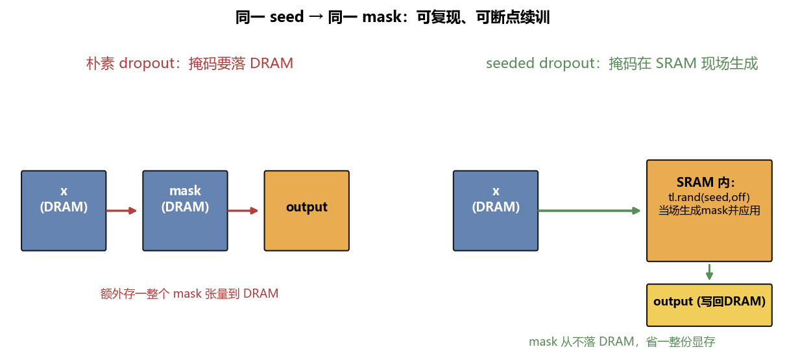

# 第 07 章：Dropout——低内存随机失活

> 对应原仓库 `07_dropout/dropout.py`。这是全教程**改动最小**的一章，但演示了一个极其实用的省显存技巧：**让掩码完全在 SRAM 里现场生成，绝不落 DRAM**。

<details>
<summary>📒 本章对应源码（点击展开）—— 来源：07_dropout/dropout.py</summary>

```python
"""
This tutorial on low-memory dropout required the least editing of all the original Triton documentation tutorials

What you'll learn:
- Parallel pseudo-random number generation
"""
import torch
import triton
import triton.language as tl

DEVICE = torch.device(f'cuda:{torch.cuda.current_device()}')

@triton.jit
def _seeded_dropout(
    x_ptr,
    output_ptr,
    n_elements,
    p, # a float32 probability, so range [0,1]
    seed, # a single int32
    BLOCK_SIZE: tl.constexpr,
):
    # compute memory offsets of elements handled by this program
    pid = tl.program_id(axis=0)
    offsets = pid * BLOCK_SIZE + tl.arange(0, BLOCK_SIZE)
    # load data from x
    mask = offsets < n_elements
    x = tl.load(x_ptr + offsets, mask=mask) # shape (BLOCK_SIZE)
    # the key insight is that we generate and use a mask entirely in SRAM without ever having to store it in DRAM.
    # this line generates uniformly distributed float32 values in [0, 1), given a seed and a block of int32 offsets
    random = tl.rand(seed, offsets) # shape (BLOCK_SIZE)
    # prune based on our desired probability threshold
    x_keep = random > p # values are either true or false
    output = tl.where(x_keep, x / (1 - p), 0.0)
        # where x_keep is True, the value is x/(1-p), and where False it's 0.0
    # write-back to DRAM
    tl.store(output_ptr + offsets, output, mask=mask)

def seeded_dropout(x, p, seed):
    output = torch.empty_like(x)
    assert x.is_contiguous()
    n_elements = x.numel()
    grid = lambda meta: (triton.cdiv(n_elements, meta['BLOCK_SIZE']), )
    _seeded_dropout[grid](x, output, n_elements, p, seed, BLOCK_SIZE=1024)
    return output

x = torch.randn(size=(8, ), device=DEVICE)
output1 = seeded_dropout(x, p=0.5, seed=123)
output2 = seeded_dropout(x, p=0.5, seed=123)
output3 = seeded_dropout(x, p=0.5, seed=512)
print(x, output1, output2, output3, sep="\n")
```

</details>

---

## 1. dropout 在干什么

训练时，按概率 `p` 随机把一部分神经元置零（其余放大 `1/(1-p)` 补偿），防过拟合。朴素实现会先生成一个和输入同形的布尔掩码张量、存起来、再用。问题是：**这个掩码张量本身要占一整份显存**。

## 2. 朴素 vs seeded：省掉整份掩码



- **朴素**：x(DRAM) → 读出 → 生成 mask 存 DRAM → 应用 → output(DRAM)。多存一份 mask。
- **seeded**：x(DRAM) → 读进 SRAM → **在 SRAM 里用 seed+偏移当场生成 mask 并立刻应用** → output(DRAM)。mask 从头到尾不落 DRAM。

## 3. 内核

```python
@triton.jit
def _seeded_dropout(x_ptr, output_ptr, n_elements, p, seed, BLOCK_SIZE: tl.constexpr):
    pid = tl.program_id(axis=0)
    offsets = pid * BLOCK_SIZE + tl.arange(0, BLOCK_SIZE)
    mask = offsets < n_elements
    x = tl.load(x_ptr + offsets, mask=mask)                       # 读 x 进 SRAM
    random = tl.rand(seed, offsets)                                # ★ SRAM 内生成随机数 ∈ [0,1)
    x_keep = random > p                                            # 布尔掩码
    output = tl.where(x_keep, x / (1 - p), 0.0)                   # 留则放大，否则置 0
    tl.store(output_ptr + offsets, output, mask=mask)             # 写回 DRAM
```

这章你已认识所有原语（`program_id`、`arange`、`mask`、`load/store`），重点就一个新东西：

### `tl.rand(seed, offsets)`：并行伪随机数
- 给一个 `seed`（int32）和一组 `offsets`（int32 数组），生成**与 seed 和位置一一对应**的 `[0,1)` 均匀随机数，形状 `(BLOCK_SIZE,)`。
- **关键性质**：同一 `(seed, offset)` 永远产生同一随机数 → 可复现。
- 完全在 SRAM 里算，不需要预生成、不需要从 DRAM 读 mask。

### `tl.where(cond, a, b)`：逐元素选择
`cond` 为真取 `a`，否则取 `b`。等价 PyTorch 的 `torch.where`。这里：保留的位置取 `x/(1-p)`（缩放补偿），丢弃的位置取 `0.0`。

> 为什么除 `1-p`？被丢弃的比例是 `p`，留下 `1-p`。要让输出期望不变，留下的要放大 `1/(1-p)` 倍。

## 4. wrapper + 演示

```python
def seeded_dropout(x, p, seed):
    output = torch.empty_like(x)
    assert x.is_contiguous()
    n_elements = x.numel()
    grid = lambda meta: (triton.cdiv(n_elements, meta['BLOCK_SIZE']), )
    _seeded_dropout[grid](x, output, n_elements, p, seed, BLOCK_SIZE=1024)
    return output

x = torch.randn(size=(8, ), device=DEVICE)
output1 = seeded_dropout(x, p=0.5, seed=123)   # seed=123
output2 = seeded_dropout(x, p=0.5, seed=123)   # 同 seed → 同输出
output3 = seeded_dropout(x, p=0.5, seed=512)   # 换 seed → 不同输出
print(x, output1, output2, output3, sep="\n")
```

**可复现性**的价值：
- 断点续训：保存 seed，重训时掩码完全一致，结果可复现。
- 调试：固定 seed 排查问题。
- 节省显存：大模型里掩码张量动辄几个 GB，省掉它意义巨大。

> 注意 `assert x.is_contiguous()`：本内核按连续内存布局算偏移，非连续张量要先 `.contiguous()`。

## 本章学到的

| 概念 | 要点 |
|------|------|
| **`tl.rand(seed, offsets)`** | 并行 PRNG（Pseudo-Random Number Generator，伪随机数生成器），给 seed+位置生成可复现随机数，全程在 SRAM |
| **省显存** | 不物化掩码张量，省一整份 DRAM |
| **可复现** | 同 seed 同位置 → 同随机数，利于续训/调试 |
| **`tl.where`** | 逐元素条件选择 |
| **缩放补偿 `1/(1-p)`** | 丢弃后放大保留项，保持期望不变 |

## 小结

这章虽短，但"在 SRAM 里现算、不落 DRAM"的思路和[第 05 章融合 softmax](05-融合Softmax.md) 是一脉相承的——都是**减少 DRAM 读写**。下一章我们终于要碰**反向传播**了：LayerNorm，它还引入了"原子锁"和"两阶段内核"。→ [第 08 章：LayerNorm](08-LayerNorm.md)
