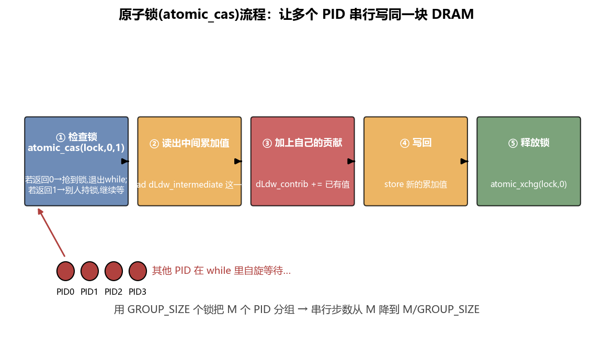
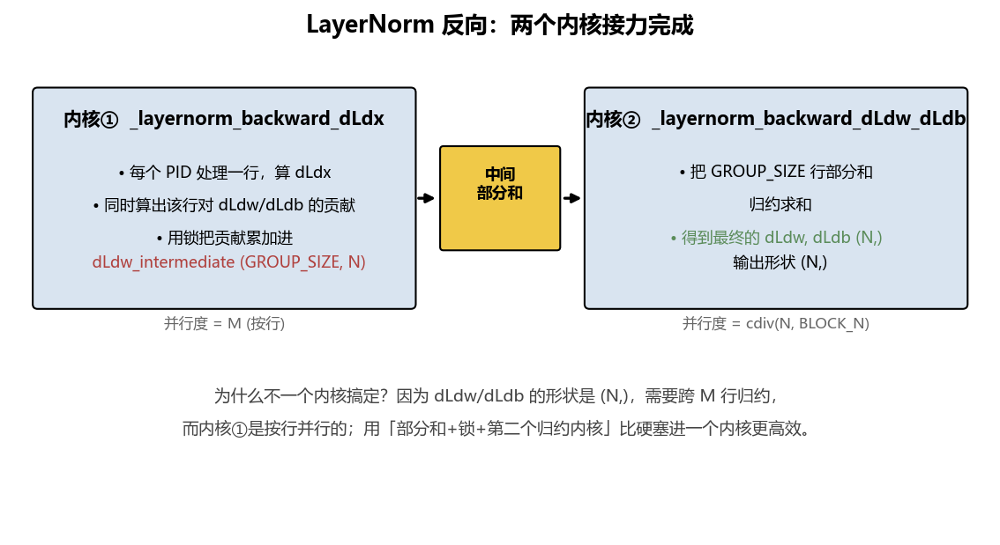
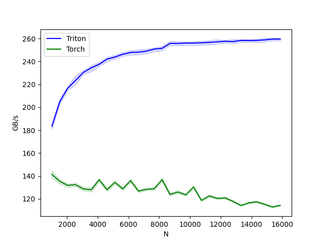

# 第 08 章：LayerNorm——反向传播与原子锁

> 对应原仓库 `08_layernorm/layernorm.py`。这章是**第一次接触反向传播（backward）**：内核接入 PyTorch 计算图，能 `.backward()`。为此要学三件新事：`torch.autograd.Function`、**原子锁（atomic lock）**、**两阶段内核**。

读代码顺序：Step1 单元测试 → Step2 wrapper → Step3 前向内核 → Step4 反向内核 → Step5 benchmark。

<details>
<summary>📒 本章对应源码（点击展开）—— 来源：08_layernorm/layernorm.py</summary>

```python
"""
In this lesson on LayerNorm we'll finally connect our kernels to PyTorch's backpropogation graph. Keep in mind
this kernel is fast but it only works for normalizing vectors that fit within SRAM, so we've done a trade-off
of better speed for worse generalize-abililty

What you'll learn:
- Writing a backward pass kernel
- re-using intermediate values from a forward pass in the backward pass
- Using torch.nn.functional to connect to PyTorch's backpropogation graph
- Locks and atomic operations
- How to use sequential kernels with intermediate tensors to complete a calculation 
    more efficiently than one kernel alone could

Recommended order to read the code in:
Step 1 - unit test
Step 2 - wrapper
Step 3 - forward pass kernel
Step 4 - backward pass kernels
Step 5 - benchmark

see original
https://triton-lang.org/main/getting-started/tutorials/05-layer-norm.html#sphx-glr-getting-started-tutorials-05-layer-norm-py
"""
import torch
import triton
import triton.language as tl

DEVICE = torch.device(f'cuda:{torch.cuda.current_device()}')

######### Step 3 #########
@triton.jit
def _layernorm_forward(
    x_ptr, y_ptr, # points to first entry of tensors of shape (M, N)
    w_ptr, b_ptr, # points to first entry of tensors of shape (N)
    mean_ptr, rstd_ptr, # points to first entry of tensors of shape (M)
    stride_M, # how much to increase the X pointer when moving through memory to the next row along x
    N, # number of columns in x, aka the tensor's embedding dimension
    eps, # small value used to avoid division by zero
    BLOCK_SIZE: tl.constexpr,
):
    # use the program id to move x_ptr and y_ptr to the row of X and Y they should compute
    row = tl.program_id(0)
    x_ptr += row * stride_M
    y_ptr += row * stride_M

    # Compute mean
    sum_accumulator = tl.zeros([BLOCK_SIZE], dtype=tl.float32)
    for offset in range(0, N, BLOCK_SIZE):
        cols = offset + tl.arange(0, BLOCK_SIZE)
            # we're assuming in this over-simplified example that x is contiguous along N dimension, 
            #  so no need to multiply cols by a stride (which should just be equal to 1)
        x_ptrs = tl.load(x_ptr + cols, mask=cols < N, other=0.).to(tl.float32) # shape (BLOCK_SIZE)
            # x is fp16 but we want to accumulate in fp32 for increased accuracy
            # other=0.0 since zeros don't affect summation
        sum_accumulator += x_ptrs
    mean = tl.sum(sum_accumulator, axis=0) / N
        # shape goes from (BLOCK_SIZE) to (1)

    # Compute variance & reciprocal standard deviation
    acc = tl.zeros([BLOCK_SIZE], dtype=tl.float32)
    for offset in range(0, N, BLOCK_SIZE):
        cols = offset + tl.arange(0, BLOCK_SIZE)
        x_ptrs = tl.load(x_ptr + cols, mask=cols < N, other=0.).to(tl.float32)
        diff = tl.where(cols < N, x_ptrs - mean, 0.)
            # mask here to prevent (0.0 - mean) at the masked out-of-bounds values
        acc += diff * diff
            # no need to mask operations here since 0 * 0 = 0 
    var = tl.sum(acc, axis=0) / N # shape goes from (BLOCK_SIZE) to (1)
    rstd = 1 / tl.sqrt(var + eps) 
        # eps is a small number (eg 1e-6) there to prevent division by 0

    # we save mean and rstd for the backward pass later
    tl.store(mean_ptr + row, mean)
    tl.store(rstd_ptr + row, rstd)

    # Normalize and apply linear transformation
    for offset in range(0, N, BLOCK_SIZE):
        # load input and parameters
        cols = offset + tl.arange(0, BLOCK_SIZE)
        mask = cols < N
        w_ptrs = tl.load(w_ptr + cols, mask=mask)
        b_ptrs = tl.load(b_ptr + cols, mask=mask)
        x_ptrs = tl.load(x_ptr + cols, mask=mask)

        # Normalize and apply linear transformation
        x_hat = (x_ptrs - mean) * rstd
        y = x_hat * w_ptrs + b_ptrs

        # Write output
        tl.store(y_ptr + cols, y, mask=mask)


######### Step 4 #########
@triton.jit
def _layernorm_backward_dLdx(
    x_ptr, dLdx_ptr, dLdy_ptr,                              # pointers to first entries of tensors of shape (M, N)
    w_ptr,                                                  # pointers to first entries of tensors of shape (N)
    dLdw_intermediate_ptr, dLdb_intermediate_ptr,           # pointers to first entries of tensors of shape (GROUP_SIZE, N)
    mean_ptr, rstd_ptr,                                     # pointers to first entries of tensors of shape (M)
    locks_ptr,                                              # pointers to first entry of tensor of shape (2 * GROUP_SIZE)
    stride, N,                                              # dynamic variables determined at run-time
    GROUP_SIZE: tl.constexpr, BLOCK_SIZE_N: tl.constexpr    # static variables determined at compile-time
):
    """
    there's a weird grouping strategy being used here for the _dLdw and _dLdb that has visuals on the website
    https://triton-lang.org/main/getting-started/tutorials/05-layer-norm.html#sphx-glr-getting-started-tutorials-05-layer-norm-py
    the idea is that each pid is assigned some subset of rows (which are interleaved rather than next to each other)
    and it's that pid's job to accumulate the gradients over all of the rows it has been assigned
    then once each pid is done, in the next kernel we'll accumulate all of those individiual partial sums
    """
    # Map the program id to the elements of x, dLdx, and dLdy it should compute.
    PID = tl.program_id(0)
    cols = tl.arange(0, BLOCK_SIZE_N)
    mask = cols < N # since we're holding an entire row within a single block
    x_ptr += PID * stride
    dLdx_ptr += PID * stride
    dLdy_ptr += PID * stride

    # Load data to SRAM
    # it's generally faster to do a bunch of loads before a bunch of flops rather than alternating back & forth
    x = tl.load(x_ptr + cols, mask=mask, other=0).to(tl.float32)            # shape (BLOCK_SIZE_N)
    dLdy = tl.load(dLdy_ptr + cols, mask=mask, other=0).to(tl.float32)      # shape (BLOCK_SIZE_N)
    w = tl.load(w_ptr + cols, mask=mask).to(tl.float32)                     # shape (BLOCK_SIZE_N)
    mean = tl.load(mean_ptr + PID)                                          # shape (1)
    rstd = tl.load(rstd_ptr + PID)                                          # shape (1)

    # Compute dLdx
    x_normalized = tl.where(mask, (x - mean) * rstd, 0.)        # shape (BLOCK_SIZE_N)
    dydx_normed = tl.where(mask, w * dLdy, 0.)                  # shape (BLOCK_SIZE_N)
    # c1 and c2 are just intermediary labels; the names don't have any real meaning
    c1 = tl.sum(x_normalized * dydx_normed, axis=0) / N         # shape (1)
    c2 = tl.sum(dydx_normed, axis=0) / N                        # shape (1)
    dLdx = (dydx_normed - (x_normalized * c1 + c2)) * rstd      # shape (BLOCK_SIZE_N)

    # Write dLdx back to DRAM
    tl.store(dLdx_ptr + cols, dLdx, mask=mask)

    # Here we'll accumulate partial sums for dLdw and dLdb, meaning these are only the single rows of 
    #  the dLdw and dLdb gradients that this PID had the job of calculating
    dLdw_contribution = (dLdy * x_normalized).to(w.dtype)
    dLdb_contribution = (dLdy).to(w.dtype)

    """
    Now we'd like to take our single contributions to dLdw and dLdb and somehow aggregate them with
    the portions that all of the other PIDs have calculated.
    The reason this aggregation has to happen is because the input x is of shape (M, N) while
    the weights and biases are of shape (N), meaning they receive gradients from all M rows of x,
    and this PID holds the gradient of one of those rows, but it's not easy to communicate
    that information between PIDs.
    The specific operation to do between all these rows is to sum them up, but we can't just
    naively tl.load(), then add our row, then tl.store() because all of the PIDs would do so
    at slightly different and completely unpredictable times, meaning all the tl.store() calls
    would overwrite each other.
    What we need first a way to ensure that only one PID at a time does the read, flop, and 
    write while all the other PIDs others wait their turn.
    For this we can use what's called a lock, which is a way for us to ensure that only one 
    PID can work on a given part of a tensor in DRAM at a time, AKA "locking" it.

    However, even that's not great because if only one PID can do work at a time and we have a 
    lot of PIDs, then that's a whole lot of time leaving a large majority of the GPU sitting 
    idle while they wait in line. 
    What we need then is a way for GROUPS of PIDs to work sequentially with a lock while each
    group works in parallel to the others. 
    This is why we created dLdw_intermediate and dLdb_intermediate, each of which has shape 
    (GROUP_SIZE, N).
    We're going to assign every PID to a group, and then use our locking mechanism to ensure
    that only (M // GROUP_SIZE) PIDs attempt to wait around for their turn to work on a row
    of dLdw_intermediate and dLdb_intermediate at a time.
    In this way we've now gone from a sequential process with M steps to one with 
    (M // GROUP_SIZE) steps. 
    Then in the next kernel we'll take these (GROUP_SIZE, N) matrices and reduce them further
    down to the desired shape (N) matrices of dLdw and dLdb.

    But how do locks actually work?
    In this case we've got a tensor of shape (2 * GROUP_SIZE) and datatype int32 that's
    initialized to all zeroes. 
    The first GROUP_SIZE entries are for holding an indicator of the state of that lock;
    0 means unlocked and 1 means locked for the row of dLdw_intermediate and dLdb_intermediate 
    that it corresponds to.
    The latter GROUP_SIZE entries are for holding an indicator of whether this lock has
    ever been used before, which is useful because we'll want to run different code if
    this PID happens to be the first one to add its values to dLdw_intermediate and dLdb_intermediate.
    To use the lock, we check if the entry corresponding to the group that our PID is
    in is locked or unlocked:
    - if it's locked, then we wait and check again in a moment until it's unlocked
    - if it's unlocked then we'll lock it, load the current value of our group's row of 
        dLdw_intermediate and dLdb_intermediate, add our dLdw_contribution and dLdb_contribution 
        respectively, write those new values back to DRAM, and finally unlock it
    """
    # To start we figure out which lock ID corresponds to our PID and move our pointers accordingly
    lock_id = PID % GROUP_SIZE # so there are GROUP_SIZE number of locks
    # the first GROUP_SIZE entries in Lock hold the state of that lock in the entry locks_ptr for each pid
    locks_ptr += lock_id
    # the next GROUP_SIZE entries hold the count of how many accumulations have already happened on that lock
    count_ptr = locks_ptr + GROUP_SIZE
    # then we figre out which row of dLdw_intermediate and dLdb_intermediate we're meant to point to
    dLdw_intermediate_ptrs = dLdw_intermediate_ptr + lock_id * N + cols 
    dLdb_intermediate_ptrs = dLdb_intermediate_ptr + lock_id * N + cols 
        # we can use N in place of a .stride() here since these tensors are generated specifically for 
        #  this purpose and therefore guaranteed to be contiguous in memory
    
    # atomic_cas() compares the contents of a memory location with a given value and, 
    #  only if they are the same, modifies the contents of that memory location to a new given value.
    while tl.atomic_cas(locks_ptr, 0, 1) == 1:
        pass
        # so here, we're looking at the location locks_ptr_ptr and:
        # - If it's 0 (unlocked), change it to 1 (locked) and return 0 (False) to exit the while loop
        # - If it's 1 (already locked), leave it as 1 and return 1 (True) so that we stay in the while loop
    
    # then here we grab the number of times this lock position has already been accumulated into
    count = tl.load(count_ptr) # shape (1)
    if count == 0: # if this PID is the first one to access the lock
        # then no need to do the memory reads & flops; we can just set the row of dLdw_intermediate & 
        #  dLdB_intermediate equal to dLdw_contribution and dLdb_contribution (done below, outside the if/else)
        # atomic_xchg() sets the value at Count_ptr equal to 1 so the next PID knows we've been here
        tl.atomic_xchg(count_ptr, 1)
    else: # but if this is not the first pid in the accumulation process,
        # then we've actually gotta accumulate by grabbing the values already there in 
        #  DRAM and adding them to the rows of dLdw_contribution and dLdb_contribution that our PID generated
        dLdw_contribution += tl.load(dLdw_intermediate_ptrs, mask=mask) # we load and add in one step (+= operator)
        dLdb_contribution += tl.load(dLdb_intermediate_ptrs, mask=mask) #  so as not to consume unnecessary SRAM
    
    # now we get to store our accumulated values back to DRAM
    tl.store(dLdw_intermediate_ptrs, dLdw_contribution, mask=mask)
    tl.store(dLdb_intermediate_ptrs, dLdb_contribution, mask=mask)

    # and finally release the lock so that any pids waiting in their while loop can take their turn
    tl.atomic_xchg(locks_ptr, 0) # we set the value at our lock equal to 0
    # whichever pid gets to the 0 value first with its .atomic_cas() will get to go next

@triton.jit
def _layernorm_backward_dLdw_dLdb(
    dLdw_intermediate_ptr,  dLdb_intermediate_ptr, # pointers to first entries of tensors of shape (GROUP_SIZE, N)
    dLdw_ptr, dLdb_ptr,                            # pointers to first entries of tensors of shape (N)
    GROUP_SIZE,  N,
    BLOCK_SIZE_M: tl.constexpr, BLOCK_SIZE_N: tl.constexpr,
):
    # our PIDs are split up within the N dimension
    PID = tl.program_id(0)
    col_ptrs = PID * BLOCK_SIZE_N + tl.arange(0, BLOCK_SIZE_N)

    # here is where we'll accumulate the stored group values into as we read them
    dLdw_acc = tl.zeros((BLOCK_SIZE_M, BLOCK_SIZE_N), dtype=tl.float32)
    dLdb_acc = tl.zeros((BLOCK_SIZE_M, BLOCK_SIZE_N), dtype=tl.float32)

    # Iterate through the rows of _dLdw and _dLdb to sum them up
    for i in range(0, GROUP_SIZE, BLOCK_SIZE_M):
        row_ptrs = i + tl.arange(0, BLOCK_SIZE_M)
        mask = (row_ptrs[:, None] < GROUP_SIZE) & (col_ptrs[None, :] < N)
        offsets = row_ptrs[:, None] * N + col_ptrs[None, :]

        # load the partial sums from all that group locking nonsense earlier and add them to our final output
        dLdw_acc += tl.load(dLdw_intermediate_ptr + offsets, mask=mask, other=0.) 
        dLdb_acc += tl.load(dLdb_intermediate_ptr + offsets, mask=mask, other=0.)
            # masked-out values get set to 0 so they don't affect sum

    # sum along our BLOCK_SIZE_M dimension to get the final BLOCK_SIZE_N chunk of dLdw & dLdb that this 
    #  PID was assigned to
    sum_dLdw = tl.sum(dLdw_acc, axis=0) # shape (BLOCK_SIZE_N)
    sum_dLdb = tl.sum(dLdb_acc, axis=0)

    # Write the final sum to the output.
    tl.store(dLdw_ptr + col_ptrs, sum_dLdw, mask=col_ptrs < N)
    tl.store(dLdb_ptr + col_ptrs, sum_dLdb, mask=col_ptrs < N)


######### Step 2 #########
class LayerNorm(torch.autograd.Function): 
    """
    We can implement our own custom functions that play nice with PyTorch's autograd graph
    by subclassing torch.autograd.Function and implementing the forward and backward passes
    with static methods forward() and backward(). 
    """

    @staticmethod
    def forward(
        ctx, # ctx is an object we use to store info that'll be used later in the backward pass
            # it doesn't actually get inputted when using .forward(), rather it's handled by the parent class
        x, # the input; however many dimensions will be turned into a matrix of shape (M, N)
        normalized_shape, # this never gets used, but putting it here keeps arguments consistent with pytorch which does use it
        weight, # so this LayerNorm class is in fact acting as a function rather than a module since w&b are stored elsewhere
        bias, # weight and bias both of shape (x.shape[-1])
        eps # very small value (eg 1e-6) to prevent division by zero in the reciprocal standard deviation calculation
    ):
        # reshape to 2D tensor and grab said shapes
        M, N = x.reshape(-1, x.shape[-1]).shape
        # allocate intermediary tensors and final output
        mean = torch.empty((M, ), dtype=torch.float32, device=x.device)
        rstd = torch.empty((M, ), dtype=torch.float32, device=x.device)
        y = torch.empty_like(x)

        # if there's less than 64KB per feature then we can use our fused kernel
        MAX_FUSED_SIZE = 65536 // x.element_size() 
            # .element_size() returns number of bytes per a single entry
                # fp32 element_size = 4, fp16 element_size = 2, fp8 element_size = 1
            # so this is used to calculate how many elements can fit within a 64KB block of memory
            # 64KB is a heuristic for the smallest possible SRAM size our GPU is likely to have; it'd be beter
            #  if we got our GPU's actual SRAM size and used that (look back at lesson 5 for how to do this)
        BLOCK_SIZE = min(MAX_FUSED_SIZE, triton.next_power_of_2(N))
            # we'll either define block_size by 
            # - the maximum amount of entries that a 64kb block of memory can hold or
            # - the smallest size that can hold the dimension N
        if N > BLOCK_SIZE: # so if we used MAX_FUSED_SIZE
            raise RuntimeError("This layer norm doesn't support feature dim >= 64KB.")
            # in order to support feature_dim bigger than SRAM size we'd have to parallelize within feature_dim

        # heuristics for number of warps
        num_warps = min(max(BLOCK_SIZE // 256, 1), 8)
        
        _layernorm_forward[(M, )](  # grid parallelizes using a separate program for each non-embedding dimension entry
            x, y, weight, bias,
            mean, rstd,  # pre-allocated intermediary useful tensors
            x.stride(0), # number of memory items needed to move forward to hit the next row of x (should be = N if x is contiguous)
            N, # model embedding dimension will be used for hardware mask
            eps,  # small number to prevent division by 0 in reciprocal standard deviation calculation
            # meta-paramaters
            BLOCK_SIZE=BLOCK_SIZE, num_warps=num_warps, 
        ) 

        # ctx is an object that can be used to stash information that's useful for the backward pass computation
        # You can cache arbitrary objects using the ctx.save_for_backward method
        ctx.save_for_backward(x, weight, bias, mean, rstd)
        # save_for_backward is mostly for tensors, whereas meta-parameters get saved as individual entries in the object
        ctx.BLOCK_SIZE = BLOCK_SIZE
        ctx.num_warps = num_warps
        ctx.eps = eps

        # and finally return our output
        return y

    @staticmethod
    def backward(
        ctx, # when calling .backward() we don't actually input ctx; rather it is handled by torch.autograd.Function
        dLdy # partial derivative of the loss with respect to y
    ):
        """
        In the backward pass we receive a Tensor containing the gradient of the loss with respect to the output, and 
        we need to compute the gradient of the loss with respect to the input(s).
        """
        # fetcing the original inputs, intermediary tensors, and meta-parameters
        x, w, b, mean, rstd = ctx.saved_tensors
        M, N = x.reshape(-1, x.shape[-1]).shape

        # allocate gradients of original inputs
        dLdw = torch.empty((N, ), dtype=w.dtype, device=w.device)
        dLdb = torch.empty((N, ), dtype=w.dtype, device=w.device)
        dLdx = torch.empty_like(dLdy)

        # heuristics for amount of parallel reduction stream for dLdw & dLdB; explained a bit below but mostly in the kernel
        GROUP_SIZE = 64
        if N <= 8192: GROUP_SIZE = 96
        if N <= 4096: GROUP_SIZE = 128
        if N <= 1024: GROUP_SIZE = 256

        # Rather than computing all three gradients immediately in one kernel, we're actually going to call two kernels.
        # The first will compute dLdx and intermediary steps on the way to dLdw and dLdb; we'll call these _dLdw and _dLdb
        dLdw_intermediate = torch.zeros((GROUP_SIZE, N), dtype=x.dtype, device=w.device)
        dLdb_intermediate = torch.zeros((GROUP_SIZE, N), dtype=x.dtype, device=w.device)

        # When multiple programs want to edit the same entries in a tensor stored in DRAM, we need a way to prevent them from
        #  doing so out of order and from overwriting each other's work. For that we can use a lock, which is another tensor 
        #  with the job of keeping track of which entries are currently being worked on by a different program and which are
        #  free to be edited
        locks = torch.zeros(2 * GROUP_SIZE, dtype=torch.int32, device=w.device)
            # the first GROUP_SIZE entries in our locks tensor will be used to determine whether a lock is on or off
                # (AKA whether the important tensor is occupied or available)
            # the second will keep track of whether the lock has been used before, since in the kernel we will need to 
            #  treat the first use differently from all successive uses
        
        # enqueue kernel that uses forward pass heuristics to calculate both dLdx and the partial contributions to dLdw and dLdb
        _layernorm_backward_dLdx[(M, )](  # parallelize across rows
            x, dLdx, dLdy, 
            w, dLdw_intermediate, dLdb_intermediate, 
            mean, rstd, 
            locks,  
            x.stride(0), N,  # dynamic run-time variables
            GROUP_SIZE = GROUP_SIZE, BLOCK_SIZE_N = ctx.BLOCK_SIZE, num_warps = ctx.num_warps) # static compile-time variables
        
        # Now we'll do a seperate call to the second kernel, who's job is to accumulate dLdw_intermediate into dLdw and 
        #  dLdb_intermediate into dLdb.
        # We do this in a separate kernel since this final set of operations requires 
        #  1) fewer pids as opposed to the previous kernel which called M pids
        #  and 2) dLdw_intermediate and dLdb_intermediate to be completed before it can begin
        grid = lambda meta: [triton.cdiv(N, meta['BLOCK_SIZE_N'])] # parallelize within rows
        _layernorm_backward_dLdw_dLdb[grid](
            dLdw_intermediate, dLdb_intermediate, dLdw, dLdb, 
            min(GROUP_SIZE, M), N,  # run-time integer values
            BLOCK_SIZE_M=32, BLOCK_SIZE_N=128, # heuristically chosen compile-time values
        )
        
        # pytorch expects .backward() to return a value for every single input into .forward() in order (except for ctx)
        #  so that it can keep track for the backpropogation graph
        return dLdx, None, dLdw, dLdb, None 
            # the None values correspond to the inputs of .forward() that don't need gradients (order matters!)

# this line just creates a reference to the apply function of LayerNorm rather than having it act like an object
layernorm = LayerNorm.apply 


######### Step 1 #########
def test_layernorm_kernel(M, N, dtype, eps=1e-5, device=DEVICE):
    # create data
    x = -2.3 + 0.5 * torch.randn((M, N), dtype=dtype, device=device)
    weight = torch.rand((N, ), dtype=dtype, device=device, requires_grad=True)
    bias = torch.rand((N, ), dtype=dtype, device=device, requires_grad=True)
    dLdy = .1 * torch.randn_like(x)
    # setting requires_grad to True here instead of x's initial definition means the graph doesn't have to move through 
    #  the -2.3 and 0.5 operations. That's not a big deal here for testing but if we didn't do it in the benchmark then
    #  those results would be confounded by the kernels pytorch implements for entry-wise multiplication and addition
    x.requires_grad_(True)
    # forward pass
    y_tri = layernorm(x, (N,), weight, bias, eps)
    y_ref = torch.nn.functional.layer_norm(x, (N,), weight, bias, eps).to(dtype)
    torch.testing.assert_close(y_tri, y_ref, atol=1e-2, rtol=0) 
    print("Passed fwd")
    # backward pass (triton)
    y_tri.backward(dLdy, retain_graph=True) # this writes directly to x.grad, weight.grad and bias.grad
        # retain_graph is used to control whether the computation graph should be kept in memory after the backward pass. 
        # Setting retain_graph=True allows you to perform multiple backward passes on the same graph, but it can increase 
        # memory usage, so it's generally recommended to use it only when necessary for a scenario like this
    # This detaches our gradients so that we can run pytorch on the same input tensors and test against each other later
    dLdx_tri, dLdw_tri, dLdb_tri = [_.grad.clone() for _ in [x, weight, bias]]
        # when denoting derivatives, it's always with respect to the loss function L and we use "d" instead of "partial"
        #  because it's more concise albiet bad practice from a mathematician's perspective
    x.grad, weight.grad, bias.grad = None, None, None
    # backward pass (torch)
    y_ref.backward(dLdy, retain_graph=True)
    dLdx_ref, dLdw_ref, dLdb_ref = [_.grad.clone() for _ in [x, weight, bias]]
    # compare
    torch.testing.assert_close(dLdx_tri, dLdx_ref, atol=1e-2, rtol=0)
    torch.testing.assert_close(dLdb_tri, dLdb_ref, atol=1e-2, rtol=0)
    torch.testing.assert_close(dLdw_tri, dLdw_ref, atol=1e-2, rtol=0)
        # rtol=0 means we don't use relative tolerance 
    print("Passed bwd")


######### Step 5 #########
@triton.testing.perf_report(
    triton.testing.Benchmark(
        x_names=['N'],
        x_vals=[512 * i for i in range(2, 32)], # if you increase past 32 the kernel will break since features become larger than 64kb
        line_arg='provider',
        line_vals=['triton', 'torch'],
        line_names=['Triton', 'Torch'],
        styles=[('blue', '-'), ('green', '-')],
        ylabel='GB/s',
        plot_name='layer-norm-backward',
        args={'M': 4096, 'dtype': torch.float16, 'mode': 'backward'}, # so we're actually only benchmarking the backward pass
    ))
def benchmark(M, N, dtype, provider, mode='backward', eps=1e-5, device=DEVICE):
    # create data
    x_shape = (M, N)
    w_shape = (N, )
    weight = torch.rand(w_shape, dtype=dtype, device=device, requires_grad=True)
    bias = torch.rand(w_shape, dtype=dtype, device=device, requires_grad=True)
    x = -2.3 + 0.5 * torch.randn(x_shape, dtype=dtype, device=device)#, requires_grad=True)
    dLdy = .1 * torch.randn_like(x)
    x.requires_grad_(True) 
        # setting this here instead of x's initial definition means the graph doesn't have to move through the -2.3 and 0.5 operations
    quantiles = [0.5, 0.05, 0.95]

    def y_fwd():
        if provider == "triton":
            return layernorm(x, w_shape, weight, bias, eps) 
        if provider == "torch":
            return torch.nn.functional.layer_norm(x, w_shape, weight, bias, eps) 

    # forward pass
    if mode == 'forward':
        gbps = lambda ms: 2 * x.numel() * x.element_size() * 1e-9 / (ms * 1e-3)
        ms, min_ms, max_ms = triton.testing.do_bench(y_fwd, quantiles=quantiles, rep=500)
    # backward pass
    if mode == 'backward':
        y = y_fwd()
        gbps = lambda ms: 3 * x.numel() * x.element_size() * 1e-9 / (ms * 1e-3)  # noqa: F811, E704
        ms, min_ms, max_ms = triton.testing.do_bench(lambda: y.backward(dLdy, retain_graph=True), quantiles=quantiles,
                                                     grad_to_none=[x], rep=500)
    return gbps(ms), gbps(max_ms), gbps(min_ms)


if __name__ == "__main__":
    # always run unit-tests
    test_layernorm_kernel(1151, 8192, torch.float16)

    # Only run benchmark if explicitly requested
    import sys
    if len(sys.argv) > 1 and sys.argv[1] == "--benchmark":
        benchmark.run(save_path='.', print_data=False)
```

</details>

---

## 0. LayerNorm 在干什么

对输入 $x$ 形状 $(M, N)$（$N$ 是特征维），对每一行 $m$ 做归一化：

$$\mu_m = \frac{1}{N}\sum_{i=1}^{N} x_{m,i} \qquad \sigma_m^2 = \frac{1}{N}\sum_{i=1}^{N}(x_{m,i}-\mu_m)^2$$

$$\hat{x}_{m,i} = \frac{x_{m,i}-\mu_m}{\sqrt{\sigma_m^2+\varepsilon}} \qquad y_{m,i} = \hat{x}_{m,i}\, w_i + b_i$$

即:每行先算均值 $\mu$ 和方差 $\sigma^2$,再标准化成 $\hat{x}$,最后乘权重 $w_i$ 加偏置 $b_i$(仿射变换在特征维上逐元素进行)。$\varepsilon$ 防止除零。为了反向,前向要**保存 $\mu$ 和 $\mathrm{rstd}=1/\sqrt{\sigma^2+\varepsilon}$**。

## 1. 前向内核 `_layernorm_forward`

每个 program 处理**一行**（和 softmax 一样）。核心是"**沿 N 分块循环累加**"算 mean 和 var，再归一化。

```python
@triton.jit
def _layernorm_forward(x_ptr, y_ptr, w_ptr, b_ptr, mean_ptr, rstd_ptr,
                       stride_M, N, eps, BLOCK_SIZE: tl.constexpr):
    row = tl.program_id(0)
    x_ptr += row * stride_M;  y_ptr += row * stride_M   # 移到这一行

    # ---- 算 mean（沿 N 分块累加）----
    sum_accumulator = tl.zeros([BLOCK_SIZE], dtype=tl.float32)
    for offset in range(0, N, BLOCK_SIZE):
        cols = offset + tl.arange(0, BLOCK_SIZE)
        x_vals = tl.load(x_ptr + cols, mask=cols < N, other=0.).to(tl.float32)  # 加载进来的值
        sum_accumulator += x_vals
    mean = tl.sum(sum_accumulator, axis=0) / N           # (BLOCK_SIZE,) → 标量

    # ---- 算 var（同样的分块循环）----
    acc = tl.zeros([BLOCK_SIZE], dtype=tl.float32)
    for offset in range(0, N, BLOCK_SIZE):
        cols = offset + tl.arange(0, BLOCK_SIZE)
        x_vals = tl.load(x_ptr + cols, mask=cols < N, other=0.).to(tl.float32)
        diff = tl.where(cols < N, x_vals - mean, 0.)     # ← mask 防 (0 - mean) 污染
        acc += diff * diff
    var = tl.sum(acc, axis=0) / N
    rstd = 1 / tl.sqrt(var + eps)

    # ---- 保存给反向 ----
    tl.store(mean_ptr + row, mean)
    tl.store(rstd_ptr + row, rstd)

    # ---- 归一化 + 仿射（再循环一次写 y）----
    for offset in range(0, N, BLOCK_SIZE):
        cols = offset + tl.arange(0, BLOCK_SIZE)
        mask = cols < N
        w_vals = tl.load(w_ptr + cols, mask=mask)
        b_vals = tl.load(b_ptr + cols, mask=mask)
        x_vals = tl.load(x_ptr + cols, mask=mask)
        x_hat = (x_vals - mean) * rstd
        y = x_hat * w_vals + b_vals
        tl.store(y_ptr + cols, y, mask=mask)
```

### 几个要点
- **fp16 输入、fp32 累加**：和 matmul 同理，累加 mean/var 要 fp32 保精度。
- **分块循环算 mean/var**：`for offset in range(0, N, BLOCK_SIZE)`——N 可能大于 SRAM 单块容量，所以要循环。和[第 05 章](05-融合Softmax.md)的"整行装得下"不同，这里更通用。
- **var 循环里的 mask**：`tl.where(cols < N, x_vals - mean, 0.)`——越界位置填 `0`，这样 `0*0=0` 不影响累加。**不 mask 的话，越界位置会是 `(0 - mean)`，污染方差**。
- **保存 mean/rstd**：写进 `mean_ptr`、`rstd_ptr`（形状 `(M,)`），给反向用。

> 这里假设 `x` 沿 N 连续（所以没乘 stride）。更鲁棒的版本要乘 stride，本教程简化了。

## 2. 接入 PyTorch 计算图：`torch.autograd.Function`

```python
class LayerNorm(torch.autograd.Function):
    @staticmethod
    def forward(ctx, x, normalized_shape, weight, bias, eps):
        # ... 调 _layernorm_forward ...
        ctx.save_for_backward(x, weight, bias, mean, rstd)   # 存反向要用的张量
        ctx.BLOCK_SIZE = BLOCK_SIZE                            # 存 meta 参数
        return y

    @staticmethod
    def backward(ctx, dLdy):
        # ... 算 dLdx, dLdw, dLdb ...
        return dLdx, None, dLdw, dLdb, None   # 每个前向输入都返回一个梯度(无需梯度的填 None)
```

- 子类化 `torch.autograd.Function`，实现 `forward` 和 `backward` 两个 static 方法，就能像普通 PyTorch 函数一样用、能自动微分。
- `ctx.save_for_backward(...)`：**存张量**给反向。`ctx.X = ...` 存**非张量**（meta 参数等）。
- `backward` 收到 `dLdy`（损失对输出的梯度），要算出对每个**前向输入**的梯度并**按顺序返回**（不返回 `ctx`；无需梯度的输入对应位置填 `None`）。

```python
layernorm = LayerNorm.apply   # 这样用：layernorm(x, shape, w, b, eps)
```

> 之前章节的 wrapper **不支持**反向（没接图）。从这章起内核也能 backward 了，这是写"真算子"的分水岭。

## 3. 反向：为什么需要锁？为什么需要两个内核？

LayerNorm 反向要算三个梯度：
- `dLdx` 形状 `(M,N)`：每个输入元素的梯度。
- `dLdw, dLdb` 形状 `(N,)`：权重/偏置的梯度，要**跨 M 行求和归约**（归约 = 把多个值合并成一个，这里是把 M 行的对应元素求和合并）。

### 3.0 反向公式怎么来的（链式法则推导）

给定上游梯度 $\frac{\partial L}{\partial y}$(形状同 $y$),要求 $\frac{\partial L}{\partial x}$、$\frac{\partial L}{\partial w}$、$\frac{\partial L}{\partial b}$。下面固定看某一行 $m$,下标 $i$ 走特征维 $1..N$。前向三步:

$$\hat{x}_{m,i}=\frac{x_{m,i}-\mu_m}{\sqrt{\sigma_m^2+\varepsilon}}=(x_{m,i}-\mu_m)\cdot\mathrm{rstd}_m,\qquad y_{m,i}=\hat{x}_{m,i}\, w_i + b_i$$

注意 $\mu_m$、$\sigma_m^2$ 都依赖**整行** $x$,所以 $\hat{x}_{m,i}$ 对 $x_{m,j}$ 的偏导在 $j\neq i$ 时非零——这正是 dLdx 比 dLdw/dLdb 难算的原因。

**(1) 对 $w$、$b$:最简单,因为它们只在仿射那一步出现,且只看本元素。**

$$\frac{\partial L}{\partial w_i}=\sum_{m=1}^{M}\frac{\partial L}{\partial y_{m,i}}\cdot\frac{\partial y_{m,i}}{\partial w_i}=\sum_{m=1}^{M}\frac{\partial L}{\partial y_{m,i}}\cdot\hat{x}_{m,i},\qquad \frac{\partial L}{\partial b_i}=\sum_{m=1}^{M}\frac{\partial L}{\partial y_{m,i}}$$

所以每行产生一个**贡献** $\frac{\partial L}{\partial y_{m,i}}\cdot\hat{x}_{m,i}$,最后跨 $M$ 行求和。这就是内核里 `dLdw_contribution = dLdy * x_normalized`、`dLdb_contribution = dLdy` 的来源。

**(2) 对 $x$:分两步走链式法则。**

先记 $g_i=\frac{\partial L}{\partial y_{m,i}}$(上游梯度),并令 $\tilde{g}_i=g_i\, w_i$(把 $y$ 对 $\hat{x}$ 的方向 $w_i$ 乘进去,因为 $\frac{\partial y_{m,i}}{\partial \hat{x}_{m,i}}=w_i$)。要算的是 $\frac{\partial L}{\partial x_{m,j}}=\sum_i g_i w_i\frac{\partial \hat{x}_{m,i}}{\partial x_{m,j}}=\sum_i \tilde{g}_i\frac{\partial \hat{x}_{m,i}}{\partial x_{m,j}}$。

关键是求 $\frac{\partial \hat{x}_{m,i}}{\partial x_{m,j}}$。因 $\hat{x}_{m,i}=(x_{m,i}-\mu_m)\cdot\mathrm{rstd}_m$:

- 当 $i\neq j$:$x_{m,i}$ 不含 $x_{m,j}$,但 $\mu_m$、$\mathrm{rstd}_m$ 都含它;
- 当 $i=j$:三项都含。

代入 $\frac{\partial\mu_m}{\partial x_{m,j}}=\frac{1}{N}$ 与 $\frac{\partial\mathrm{rstd}_m}{\partial x_{m,j}}=-\frac{1}{N}\hat{x}_{m,j}\,\mathrm{rstd}_m$(由 $\mathrm{rstd}=(\sigma^2+\varepsilon)^{-1/2}$ 求导),化简(标准 LayerNorm 反向推导,省略中间代数)得:

$$\sum_i \tilde{g}_i\frac{\partial \hat{x}_{m,i}}{\partial x_{m,j}}=\mathrm{rstd}_m\left[\tilde{g}_j-\frac{1}{N}\sum_i \tilde{g}_i\;\hat{x}_{m,i}-\frac{\hat{x}_{m,j}}{N}\sum_i \tilde{g}_i\right]$$

把两个行内求和记成常数(对整行求一次):

$$c_1=\frac{1}{N}\sum_{i=1}^{N}\tilde{g}_i\,\hat{x}_{m,i},\qquad c_2=\frac{1}{N}\sum_{i=1}^{N}\tilde{g}_i$$

就得到最终的 dLdx:

$$\frac{\partial L}{\partial x_{m,j}}=\mathrm{rstd}_m\left[\tilde{g}_j-\big(\hat{x}_{m,j}\, c_1+c_2\big)\right]$$

代码里 $\tilde{g}=w\cdot\frac{\partial L}{\partial y}$ 命名为 `dydx_normed`,$\hat{x}$ 命名为 `x_normalized`,$c_1$/$c_2$ 就叫 `c1`/`c2`——名字只是中间量占位,无特殊含义。对照内核:

```python
x_normalized = tl.where(mask, (x - mean) * rstd, 0.)      # x̂
dydx_normed  = tl.where(mask, w * dLdy, 0.)               # g̃ = w·g
c1 = tl.sum(x_normalized * dydx_normed, axis=0) / N        # c1
c2 = tl.sum(dydx_normed, axis=0) / N                       # c2
dLdx = (dydx_normed - (x_normalized * c1 + c2)) * rstd     # 公式逐项对应
```

> 记不住推导没关系,记住三点:(1) $\frac{\partial L}{\partial x}$ 每行独立可直写;(2) $\frac{\partial L}{\partial w}/\frac{\partial L}{\partial b}$ 每行只产生一个"贡献",要跨 $M$ 行求和;(3) $c_1/c_2$ 是 LayerNorm 特有的、由 $\mu$/$\sigma^2$ 反传引入的修正项(因为归一化让一行元素互相耦合)。

问题出在 `dLdw/dLdb`：每个 program 只算一行对它的**贡献**，但最终要把 **M 行的贡献加起来**。多个 program 想同时写同一份 `dLdw`——会互相覆盖。

### 3.1 直觉：原子锁



多个 PID 要改同一块 DRAM，得排队。用一把"锁"（一个 int 张量）：
1. `atomic_cas(lock, 0, 1)`：如果锁是 0（没人占用），改成 1（我占用），返回 0（抢到了）；如果已是 1，返回 1（被占），继续 `while` 自旋等。
2. 抢到后：读出已有的累加值 → 加上自己的贡献 → 写回。
3. `atomic_xchg(lock, 0)`：释放锁，下一个排队的人能抢。

但**所有 PID 排一把锁**太慢（GPU 大量闲置等）。解法：**分组 + 多把锁**。

### 3.2 分组策略：把 M 行摊到 GROUP_SIZE 个"中间行"

```python
dLdw_intermediate = torch.zeros((GROUP_SIZE, N))   # 中间累加器
dLdb_intermediate = torch.zeros((GROUP_SIZE, N))
locks = torch.zeros(2 * GROUP_SIZE, dtype=torch.int32)
```

- 把每个 PID 按 `lock_id = PID % GROUP_SIZE` 分到 `GROUP_SIZE` 组，每组一把锁。
- 每个 PID 把自己那行贡献累加进**自己组的中间行** `dLdw_intermediate[lock_id]`。
- 串行步数从 `M` 降到 `M / GROUP_SIZE`（每组里的人排队，组间并行）。
- `locks` 前 `GROUP_SIZE` 个存锁状态（0/1），后 `GROUP_SIZE` 个是 count 标志，记录这把锁是否已经被首次写入过；首次写入直接覆盖（中间行初始为 0，不用读），后续写入要累加已有值。

> 分组大小 `GROUP_SIZE` 是个权衡：大 → 锁少、并行度低；小 → 锁多、串行长。代码里按 `N` 大小给启发式（`N<=1024` 用 256 等）。

### 3.3 内核① `_layernorm_backward_dLdx`：算 dLdx + 部分贡献

```python
@triton.jit
def _layernorm_backward_dLdx(x_ptr, dLdx_ptr, dLdy_ptr, w_ptr,
                              dLdw_intermediate_ptr, dLdb_intermediate_ptr,
                              mean_ptr, rstd_ptr, locks_ptr,
                              stride, N, GROUP_SIZE: tl.constexpr, BLOCK_SIZE_N: tl.constexpr):
    PID = tl.program_id(0)
    # ... 移指针、load x/dLdy/w/mean/rstd ...
    x_normalized = tl.where(mask, (x - mean) * rstd, 0.)
    dydx_normed = tl.where(mask, w * dLdy, 0.)
    c1 = tl.sum(x_normalized * dydx_normed, axis=0) / N
    c2 = tl.sum(dydx_normed, axis=0) / N
    dLdx = (dydx_normed - (x_normalized * c1 + c2)) * rstd
    tl.store(dLdx_ptr + cols, dLdx, mask=mask)            # dLdx 直接写回

    # 这行对 dLdw/dLdb 的贡献
    dLdw_contribution = (dLdy * x_normalized).to(w.dtype)
    dLdb_contribution = (dLdy).to(w.dtype)

    # ===== 用锁把贡献累加进中间张量 =====
    lock_id = PID % GROUP_SIZE
    locks_ptr += lock_id
    count_ptr = locks_ptr + GROUP_SIZE
    dLdw_intermediate_ptrs = dLdw_intermediate_ptr + lock_id * N + cols
    dLdb_intermediate_ptrs = dLdb_intermediate_ptr + lock_id * N + cols

    while tl.atomic_cas(locks_ptr, 0, 1) == 1:   # 抢锁，抢不到自旋
        pass
    count = tl.load(count_ptr)
    if count == 0:                                # 第一个来的人
        tl.atomic_xchg(count_ptr, 1)
    else:                                         # 后来的要累加已有值
        dLdw_contribution += tl.load(dLdw_intermediate_ptrs, mask=mask)
        dLdb_contribution += tl.load(dLdb_intermediate_ptrs, mask=mask)
    tl.store(dLdw_intermediate_ptrs, dLdw_contribution, mask=mask)
    tl.store(dLdb_intermediate_ptrs, dLdb_contribution, mask=mask)
    tl.atomic_xchg(locks_ptr, 0)                  # 释放锁
```

要点：
- **`dLdx` 不需要锁**：每个 PID 写自己那行，互不干扰，直接 store。
- **`dLdw/dLdb` 部分贡献需要锁**：因为多个 PID 往同一中间行累加。
- **`atomic_cas(ptr, expected, desired)`**：比较-交换。`ptr` 处若等于 `expected` 则改成 `desired` 并返回旧值（0）；否则不动返回当前值（1）。这是无锁同步原语。
- **`atomic_xchg(ptr, val)`**：原子地把 `ptr` 设成 `val`，返回旧值。这里用来释放锁和设 count。
- **第一个 vs 后续**：`count==0` 说明我是第一个到这把锁的人，中间行还是 0，直接覆盖即可（不用读）；否则要 `+=` 已有值。
- **`+=` 用一步**：`dLdw_contribution += tl.load(...)` 一次 load+加，避免多占 SRAM。

### 3.4 内核② `_layernorm_backward_dLdw_dLdb`：归约中间张量



> 原仓库的反向分组策略图(展示了 dLdw/dLdb 怎样把 M 行分组、用锁累加进 (GROUP_SIZE, N) 中间张量、再归约到 (N,))，是理解"为什么分两阶段 + 锁"的核心视觉，对照看：


```python
@triton.jit
def _layernorm_backward_dLdw_dLdb(dLdw_intermediate_ptr, dLdb_intermediate_ptr,
                                   dLdw_ptr, dLdb_ptr,
                                   GROUP_SIZE, N,
                                   BLOCK_SIZE_M: tl.constexpr, BLOCK_SIZE_N: tl.constexpr):
    PID = tl.program_id(0)
    col_ptrs = PID * BLOCK_SIZE_N + tl.arange(0, BLOCK_SIZE_N)
    dLdw_acc = tl.zeros((BLOCK_SIZE_M, BLOCK_SIZE_N), dtype=tl.float32)
    dLdb_acc = tl.zeros((BLOCK_SIZE_M, BLOCK_SIZE_N), dtype=tl.float32)
    for i in range(0, GROUP_SIZE, BLOCK_SIZE_M):          # 把 GROUP_SIZE 行求和
        row_ptrs = i + tl.arange(0, BLOCK_SIZE_M)
        mask = (row_ptrs[:, None] < GROUP_SIZE) & (col_ptrs[None, :] < N)
        offsets = row_ptrs[:, None] * N + col_ptrs[None, :]
        dLdw_acc += tl.load(dLdw_intermediate_ptr + offsets, mask=mask, other=0.)
        dLdb_acc += tl.load(dLdb_intermediate_ptr + offsets, mask=mask, other=0.)
    sum_dLdw = tl.sum(dLdw_acc, axis=0)                   # 沿行归约 → (BLOCK_SIZE_N,)
    sum_dLdb = tl.sum(dLdb_acc, axis=0)
    tl.store(dLdw_ptr + col_ptrs, sum_dLdw, mask=col_ptrs < N)
    tl.store(dLdb_ptr + col_ptrs, sum_dLdb, mask=col_ptrs < N)
```

- 这内核沿 **N** 并行（`grid = cdiv(N, BLOCK_SIZE_N)`），和内核①沿 M 并行不同。
- 把 `(GROUP_SIZE, N)` 的中间张量沿 GROUP_SIZE 维**求和**，得到最终的 `(N,)`。
- 没有锁、没有竞争——这内核开始时中间张量已全部算完。

### 3.5 为什么非要两个内核？

`dLdw/dLdb` 形状 `(N,)`，需要**跨 M 行归约**；而内核①是按行并行（M 个 PID）。把"跨行归约"硬塞进"按行并行"的内核里，要么加大量锁、要么效率低。**用"部分和 + 锁 + 第二个归约内核"接力，比单内核更高效。** 这是 Triton 处理归约类梯度的经典模式。

> [第 09 章 Flash Attention](09-FlashAttention.md) 反向里也会看到"预处理内核 + 主反向内核"的多内核接力思路。

## 4. 单元测试 & benchmark

测试同时验**前向和反向**：
```python
y_tri = layernorm(x, (N,), weight, bias, eps)
y_ref = torch.nn.functional.layer_norm(x, (N,), weight, bias, eps)
torch.testing.assert_close(y_tri, y_ref, atol=1e-2, rtol=0)   # 前向
# 反向：分别 backward，比 dLdx/dLdw/dLdb
y_tri.backward(dLdy, retain_graph=True)
torch.testing.assert_close(dLdx_tri, dLdx_ref, atol=1e-2, rtol=0)   # ...
```
`rtol=0` 表示不用相对容差。benchmark 默认测反向（`mode='backward'`）。

### 性能




## 本章学到的

| 概念 | 要点 |
|------|------|
| **`torch.autograd.Function`** | 子类化 + forward/backward，让内核接入计算图、能 `.backward()` |
| **`ctx.save_for_backward`** | 存张量；`ctx.X=` 存标量/meta 参数 |
| **backward 返回顺序** | 每个前向输入一个返回值，无需梯度的填 `None` |
| **归约型梯度** | `dLdw/dLdb` 形状 `(N,)` 需跨 M 行求和 → 多 PID 竞争写同一处 |
| **原子锁** | `atomic_cas` 抢锁、`atomic_xchg` 释放；让多 PID 串行写同一块 |
| **分组多锁** | `GROUP_SIZE` 把串行步数从 M 降到 M/GROUP_SIZE |
| **两阶段内核** | 内核①算 dLdx+部分贡献(带锁)，内核②归约部分和——比单内核高效 |
| **`tl.where` 防污染** | 算 var 时越界填 0，防 `(0-mean)` 污染方差 |

## 小结

到这你已经能写**带反向**的完整算子，并掌握了"归约型梯度用锁 + 多内核"的范式。下一章是综合性最强的一章：Flash Attention，它把前面所有概念——融合、分块、在线 softmax、子内核、多轴 grid、反向、autograd——全用上，外加因果掩码和 `tl.exp2` 的新花样。→ [第 09 章：Flash Attention](09-FlashAttention.md)
