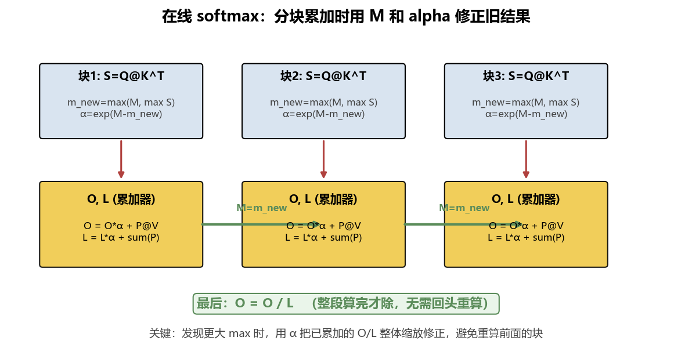
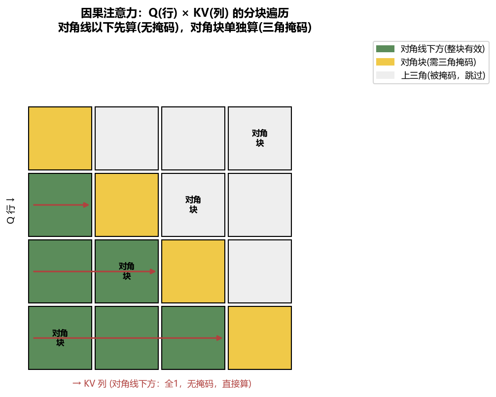
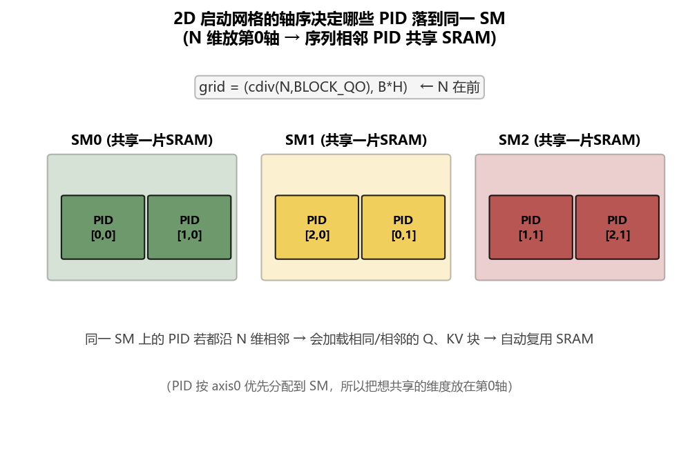
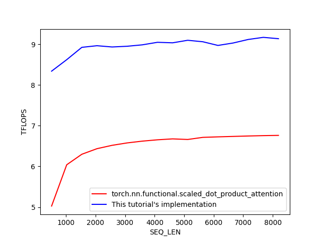
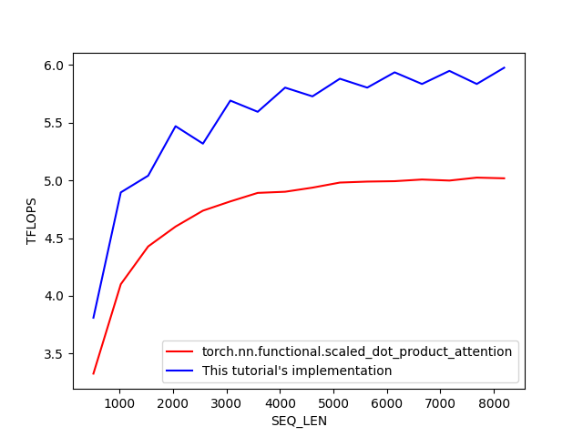

# 第 09 章：Flash Attention——分块注意力

> 对应原仓库 `09_flash_attention/flash_attention.py`。这是**综合性最强的一章**：它把前 8 章学的几乎一切——融合、分块、在线 softmax、混合精度、子内核、反向、autograd、多轴 grid——全用上，还新增了 `tl.exp2`、LSE、因果掩码分块遍历等花样。学完这章，你就接触过 Triton 的全部核心概念。

只支持 **causal mask**（因果掩码，下三角含对角）。前向基于原始论文 [v1](https://arxiv.org/abs/2205.14135)/[v2](https://arxiv.org/abs/2307.08691)，反向基于 Triton 文档实现（比论文伪代码快得多）。

<details>
<summary>📒 本章对应源码（点击展开）—— 来源：09_flash_attention/flash_attention.py</summary>

```python
"""
this implementation of flash-attention only supports a causal mask, no other masks or lack of a mask
the forward pass is based primarily on the pseudocode from the two original papers
https://arxiv.org/abs/2205.14135
https://arxiv.org/abs/2307.08691
and the backward passs is based primarily on the triton documentation implementation since it's 
significantly faster than the pseudocode from the original papers
https://triton-lang.org/main/getting-started/tutorials/06-fused-attention.html#sphx-glr-getting-started-tutorials-06-fused-attention-py

What you'll learn:
- calling sub-kernels
- using the faster tl.exp2() instead of tl.exp()
- Flash attention's specific parallelization strategy
- tl.static_assert()
- multi-axis launch grids & the importance of launch grid axis ordering
- when to pre-compute certain values in a separate kernel
- using approximate constant values rather than calculating

Notable features this kernel does NOT include:
- suppport for datatypes other than fp32 and mixed precision
- dropout
- likely more I'm forgetting

Also note, the benchmarking is setup but not used (lists have single entries)
So if you wanted even better performance you could re-enable autotuning
"""

import torch
import triton
import triton.language as tl
import math

DEVICE = torch.device(f'cuda:{torch.cuda.current_device()}')

#import os
#os.environ["TRITON_INTERPRET"] = "1"

@triton.jit
def _attn_fwd_inner(
    Q, O, L, M,
    K_ptr, V_ptr,
    K_T_offsets, V_offsets,
    block_index_QO,
    softmax_scale,
    stride_K_N, stride_V_N,
    BLOCK_SIZE_QO: tl.constexpr, BLOCK_SIZE_KV: tl.constexpr,
    DIAGONAL: tl.constexpr,
    offsets_QO_N: tl.constexpr, offsets_KV_N: tl.constexpr,
    N: tl.constexpr, Dh: tl.constexpr,
):
    """
    arrows indicate direction of this pid's for loop; each arrow is a different PID
                N of K & V
                ------------>
                ------------>
    N of Q      ------------>
                ------------>
                ------------>
    but if we actually take into account the causal mask then really it's more like
                N of K & V
                >
                --->
    N of Q      ------>
                --------->
                ------------>
    and to get even more accurate, we do the diagonal in our second call of this inner kernel
                N of K & V
                x
                   x
    N of Q            x
                         x
                            x
    and then the first call gets all the parts below the diagonal
                N of K & V
                
                -->
    N of Q      ----->
                -------->
                ----------->
    """
    if DIAGONAL:
        # Used only for the blocks along the diagonal in which there is transition between non-masked and masked keys
        lo = block_index_QO * BLOCK_SIZE_QO
        hi = (block_index_QO + 1) * BLOCK_SIZE_QO
        # let the compiler know lo is a muliple of BLOCK_SIZE_QO to speed things up
        lo = tl.multiple_of(lo, BLOCK_SIZE_QO) # TODO not sure why this doesn't also help with hi; it prolly does
    else: 
        # this part is for any blocks in the causal mask below the diagonal
        lo, hi = 0, block_index_QO * BLOCK_SIZE_QO

    K_T_offsets += lo * stride_K_N
    V_offsets += lo * stride_V_N
    offsets_KV_N += lo

    # loop over blocks along the N dimension of K & V and update the O accumulator while doing so
    for start_KV in range(lo, hi, BLOCK_SIZE_KV):
        # Just let the compiler know that start_KV is a multiple of BLOCK_SIZE_KV, so the compiler can do optimizations
        start_KV = tl.multiple_of(start_KV, BLOCK_SIZE_KV)
            # when in doubt, i guess use tl.multiple_of() for any dynamic variable (as opposed to static variables)

        # compute (Q @ K^T) / sqrt(Dh)
        mask_KV_N = offsets_KV_N < N
        K_T = tl.load(K_ptr + K_T_offsets, mask=mask_KV_N[None, :], other=0.) # shape (Dh, BLOCK_SIZE_KV)
            # sequence mask sets non-existent tokens in the block past N to zero vectors
        S = tl.dot(Q, K_T) * softmax_scale # shape (BLOCK_SIZE_QO, BLOCK_SIZE_KV)
            # the masked tokens create columns & rows of zeros hugging the bottom and right edges of S

        if DIAGONAL: # if we're currently on a block containing the diagonal
            # the causal mask is True on the lower-triangular including the diagonal
            causal_mask = offsets_QO_N[:, None] >= (offsets_KV_N[None, :])
            # causal mask addition sets upper-triangular values (excluding diagonal) to -inf
            S += tl.where(causal_mask, 0, -1.0e6) # shape (BLOCK_SIZE_QO, BLOCK_SIZE_KV)
        # notice that the masked out tokens previously hugging the right edge of S have mostly been replaced with -inf
        #  and the masked out tokens hugging the bottom edge are still mostly 0's but with some -infs towards the
        #  right edge of each of them, except for the last one which is only 0's
        
        # find the max values of the new block and compare them to those of all previous blocks to get an update
        M_new = tl.maximum(M, tl.max(S, axis=1)) # shape is (BLOCK_SIZE_QO)
            # masked token rows at the bottom will return a maximum value of 0 since their only values are 0 and -inf
        # adjust S block for safe softmax
        S -= M_new[:, None] # shape (BLOCK_SIZE_QO, BLOCK_SIZE_KV)
            # in the case of masked non-existent tokens that means subtracting by 0 so no difference

        # Compute the exponential of each safe dot product, which will be the numerator of our softmax
        P = tl.exp2(S) # shape (BLOCK_SIZE_QO, BLOCK_SIZE_KV)
            # we're using base 2 instead of base e because it's faster and softmax is invariant to the change,
            #  however it does make the derivative in the backward pass a bit more complicated.
            # for the masked non-existent tokens as the bottom that will be 2^0=1 for all those entries
        
        # Compute the sum by rows of the attention scores
        L_new = tl.sum(P, axis=1) # shape (BLOCK_SIZE_QO)
            # for the masked non-existent tokens we're summing a bunch of 1's with some -infs, except for the
            #  very bottom one which is just 1's and therefore its sum is the largest being equal to BLOCK_SIZE_QO
        # This alpha is the correction factor we'll use on the previous L
        alpha = tl.exp2(M - M_new) # shape (BLOCK_SIZE_Q)
            # for the masked non-existent tokens that's just 2^(1-1)=2^0=1=alpha_i so no correction
        # Apply the correction factor to the previous L and add the new L
        L = L * alpha + L_new # shape (BLOCK_SIZE_QO)
            # for each of the masked non-existent tokens they approach N for their entry L_i

        # This computes O = P @ V + O * alpha
        V = tl.load(V_ptr + V_offsets, mask=mask_KV_N[:, None], other=0.) # shape (BLOCK_SIZE_KV, Dh)
        # adjusts previous values based on potential new max
        O = O * alpha[:, None] # shape (BLOCK_SIZE_QO, Dh)
        # accumulated P and V block dot product into O
        O = tl.dot(P, V, acc=O) # shape (BLOCK_SIZE_QO, Dh)
            # notice we're doing this V projection before we've actually divided by our softmax denominator l_i
            #  which is possible because in this context the two operations are associative
            # acc tells triton to accumulate the values into O_block
            # the masked non-existent tokens are a bunch of 1's in the bottom rows of P and 0's in the bottom
            #  rows of V. This matmul leaves O with a bunch of incorrect values in its bottom rows, but they
            #  will get ignored later when we store O with a proper mask

        # sets old max equal to new max, ready to be used by next iteration of for loop
        M = M_new

        # iterate pointers
        K_T_offsets += BLOCK_SIZE_KV * stride_K_N
        V_offsets += BLOCK_SIZE_KV * stride_V_N
        offsets_KV_N += BLOCK_SIZE_KV

    return O, L, M # we save these three specifically for use later in the backward pass


@triton.autotune( # decorator figures out what meta-parameters will be most efficient
    [
        triton.Config(
            {"BLOCK_SIZE_QO": BLOCK_SIZE_QO, "BLOCK_SIZE_KV": BLOCK_SIZE_KV},
            num_stages=num_stages, num_warps=num_warps,
        )
        for BLOCK_SIZE_QO in [16]#, 32, 64, 128]
        for BLOCK_SIZE_KV in [16]#, 32, 64, 128]
        for num_stages in [3]#, 5, 7]
        for num_warps in [4]#, 8, 16]
    ],
    key=["Dh"],
)
@triton.jit
def attn_fwd(
    Q_ptr, K_ptr,  V_ptr,               # each shape (B, H, N, Dh)
    O_ptr,                              # shape (B, H, N, Dh). where we store the final output
    LSE_ptr,                            # shape (B, H, N). here we first store the max values of each row & later the logsumexp trick 
    softmax_scale,
    stride_Q_B, stride_Q_H, stride_Q_N, stride_Q_Dh,
    stride_K_B, stride_K_H, stride_K_N, stride_K_Dh,
    stride_V_B, stride_V_H, stride_V_N, stride_V_Dh,
    stride_O_B, stride_O_H, stride_O_N, stride_O_Dh,
    stride_LSE_B, stride_LSE_H, stride_LSE_N,
    B, # unlike other tensor dimensions, batch size can be more flexible for runtime differences
    # meta-parameters (decided at compile-time)
    H: tl.constexpr, N: tl.constexpr, 
    Dh: tl.constexpr, # should always be a power of 2
    BLOCK_SIZE_QO: tl.constexpr, BLOCK_SIZE_KV: tl.constexpr,
):
    # in order to use tl.exp2 later isntead of tl.exp (the former is faster) we need to scale our softmax scale by ln2
    rln2: tl.constexpr = 1.4426950408889634
    softmax_scale *= rln2
    """
    let's show that e^x = 2^(x * rln2)
    e^x = (2^(log_2(e)))^x since a = 2^log_2(a)
    then using the power rule
    (2^(log_2(e)))^x = 2^(x * log_2(e))
    fundamental property of logarithm is log_2(e) = 1/log_e(2)
    therefore e^x = 2^(x * 1/log_e(2)) 
    AKA e^x = 2^(x * rln2)
    then later in the backward pass we'll have to remember to account for this in the gradient
    """
    
    # as opposed to regular assert, static_assert occurs at compile-time
    tl.static_assert(BLOCK_SIZE_KV <= Dh)
        # I'm not sure why the original triton docs tutorial had this assertion, but it doesn't hurt anything

    # This indicates which block in the sequence length to process
    block_index_QO = tl.program_id(0)
    # This indicates which head and batch to process. Each program is associated with a single head of a single batch
    index_BH = tl.program_id(1)
    # This indicates which batch this program is associated with (each batch has H heads)
    index_B = index_BH // H
    # This indicates the position of the head in the batch
    index_H = index_BH % H

    # This allows to get the shape (N, Dh) block in the Q, K, V, and O by indexing it by batch and head
    Q_ptr += index_B * stride_Q_B + index_H * stride_Q_H
    K_ptr += index_B * stride_K_B + index_H * stride_K_H
    V_ptr += index_B * stride_V_B + index_H * stride_V_H
    O_ptr += index_B * stride_O_B + index_H * stride_O_H

    # Offsets for N are split by pids but for Dh we keep the whole thing in SRAM.
    offsets_QO_N = block_index_QO * BLOCK_SIZE_QO + tl.arange(0, BLOCK_SIZE_QO)
    offsets_KV_N = tl.arange(0, BLOCK_SIZE_KV)
    offsets_Dh = tl.arange(0, Dh)
    
    # create offsets specific to each tensor
    Q_offsets = (offsets_QO_N[:, None] * stride_Q_N + offsets_Dh[None, :] * stride_Q_Dh)
        # shape (BLOCK_SIZE_QO, Dh)
    # we transpose K while loading it (as opposed to writing a whole separate kernel for transpose)
    K_T_offsets = (offsets_Dh[:, None] * stride_K_Dh + offsets_KV_N[None, :] * stride_K_N)
        # shape (Dh, BLOCK_SIZE_KV)
    V_offsets = (offsets_KV_N[:, None] * stride_V_N + offsets_Dh[None, :] * stride_V_Dh)
        # shape (BLOCK_SIZE_KV, Dh)

    # load the block of Q that this PID will use; it will stay in SRAM throughout the inner loop
    mask_QO_N = offsets_QO_N < N
    Q = tl.load(Q_ptr + Q_offsets, mask=mask_QO_N[:, None], other=0.) # shape (BLOCK_SIZE_QO, Dh)
        # sequence mask sets non-existent tokens in the block past N to zero vectors

    ## pre-allocate tensors for storing intermediate & output values
    # the running maximum. We have one entry for each query in the block we're currently working on
    M = tl.full(shape=[BLOCK_SIZE_QO], value=-1e6, dtype=tl.float32) # large negative number will get ignored by tl.max()
    # the running sum. We have one entry for each query (since we sum the attention scores by rows)
    L = tl.full(shape=[BLOCK_SIZE_QO], value=1.0, dtype=tl.float32) # 1 is because we'll be using exponentials and e^0=1
    # the accumulator for the output, which is a group of rows of the O matrix
    O = tl.zeros([BLOCK_SIZE_QO, Dh], dtype=tl.float32)

    # calculate attention for dense blocks (those where the mask if full of 1's). 
    # This step runs for the blocks below the diagonal in causal attention
    O, L, M = _attn_fwd_inner(
        Q, O, L, M,
        K_ptr, V_ptr,
        K_T_offsets, V_offsets,
        block_index_QO,
        softmax_scale,
        stride_K_N, stride_V_N,
        BLOCK_SIZE_QO, BLOCK_SIZE_KV,
        False, # blocks on the DIAGONAL get special treatment if this is set to true; we use it below
        offsets_QO_N, offsets_KV_N,
        N, Dh,
    )

    # This step runs for the blocks on the diagonal in the causal attention mask
    O, L, M = _attn_fwd_inner(
        Q, O, L, M,
        K_ptr, V_ptr,
        K_T_offsets, V_offsets,
        block_index_QO,
        softmax_scale,
        stride_K_N, stride_V_N,
        BLOCK_SIZE_QO, BLOCK_SIZE_KV,
        True, # blocks on the diagonal get special masking treatment
        offsets_QO_N, offsets_KV_N,
        N, Dh,
    )
    
    # finally dividing by the denominator of our softmax.
    # notice we've already multiplied by V to get O, so this was done out-of-order from naive softmax implementations
    O = O / L[:, None] # shapes (BLOCK_SIZE_QO, Dh) / (BLOCK_SIZE_QO, 1) = (BLOCK_SIZE_QO, Dh)
        # we can do this out-of-order since the matmul (the tl.dot in _attn_fwd_inner) and this entry-wise division 
        #  are associative. matmul and entry-wise-ops are not normally, but at this level of granularity it's no longer
        #  actually a matmul but instead individual dot-products
        # the masked non-existent tokens are a bunch of meaningless values in the bottom rows of O and generally
        #  roughly equal to N in the bottom entries of L. Dividing the former by the latter isn't going to break
        #  anything and we'll mask them out later when storing

    # This is needed to compute the logsumexp (LSE) for the backwards pass. basically instead of saving the maxes 
    #  and the sums separately, we save them together which still works thanks to exponential arithmetic
    LSE = M + tl.math.log2(L) # shape (BLOCK_SIZE_QO)
        # L was composed using the sum & exp operations in _attn_fwd_inner()
        # this will work because softmax(x_i) = exp(x_i - m_i) / l_i 
        #                                     = exp(x_i - m_i) / exp(log(l_i)) 
        #                                     = exp(x_i - m_i - log(l_i))
        # the masked non-existent tokens are a bunch of 0's in the bottom entries of M and a bunch of values roughly
        #  equal to N in the bottom entries of L. So in LSE they'll be a bunch of log_2(N) entries at the bottom
        #  that we of course don't plan to use

    ## storing it all back to DRAM
    LSE_offsets = index_BH * stride_LSE_H + offsets_QO_N
    LSE_mask = block_index_QO * BLOCK_SIZE_QO + tl.arange(0, BLOCK_SIZE_QO) < N
    tl.store(LSE_ptr + LSE_offsets, LSE, mask=LSE_mask) # shape (BLOCK_SIZE_QO)
        # the mask prevents us from saving the useless log_2(n) values at the bottom of LSE
    O_offsets = (offsets_QO_N[:, None] * stride_O_N + offsets_Dh[None, :] * stride_O_Dh)
    tl.store(O_ptr + O_offsets, O, mask=mask_QO_N[:, None]) # shape (BLOCK_SIZE_Q, Dh)
        # the mask prevents us from saving the useless values at the bottom of O corresponding to non-existent tokens


@triton.autotune(
    [
        triton.Config({"PRE_BLOCK_SIZE_ROW": PRE_BLOCK_SIZE_ROW},
                        num_stages=num_stages, num_warps=num_warps,)
        for PRE_BLOCK_SIZE_ROW in [32]#, 64, 128, 256]
        for num_stages in [3]#, 5, 7]
        for num_warps in [4]#, 8, 16]
    ],
    key=["Dh"],
)
@triton.jit
def attn_backward_preprocess(
    O_ptr, dLdO_ptr, Delta_ptr,
    stride_O_B, stride_O_H, stride_O_N, stride_O_Dh,
    stride_dLdO_B, stride_dLdO_H, stride_dLdO_N, stride_dLdO_Dh,
    stride_Delta_B, stride_Delta_H, stride_Delta_N,
    N, Dh: tl.constexpr,
    PRE_BLOCK_SIZE_ROW: tl.constexpr,
):
    """the job of this kernel is to pre-compute Delta since Delta is used by both of the following two kernels"""
    index_BH = tl.program_id(1) # B * H number of pids
    row = tl.program_id(0) # N / BLOCK_SIZE_ROW number of pids

    row_offsets = row * PRE_BLOCK_SIZE_ROW + tl.arange(0, PRE_BLOCK_SIZE_ROW)
    col_offsets = tl.arange(0, Dh)
    mask = row_offsets < N

    # Load PRE_BLOCK_SIZE_ROW rows of O
    O_ptr += index_BH * stride_O_H # moves O_ptr to the correct batch & head for this pid.
    O_offsets = row_offsets[:, None] * stride_O_N + col_offsets[None, :] * stride_O_Dh
    O = tl.load(O_ptr + O_offsets, mask = mask[:, None], other=0.) # shape (PRE_BLOCK_SIZE_ROW, D)

    # Load PRE_BLOCK_SIZE_ROW rows of dLdO
    dLdO_ptr += index_BH * stride_dLdO_H
    dLdO_offsets = row_offsets[:, None] * stride_dLdO_N + col_offsets[None, :] * stride_dLdO_Dh
    dLdO = tl.load(dLdO_ptr + dLdO_offsets, mask = mask[:, None], other=0.) # shape (PRE_BLOCK_SIZE_ROW, D) 

    # Delta is the dot product of O and dLdO along Dh, giving us a single scalar Delta_i per token in N
    # it will be useful in later parts of the backward pass
    Delta = tl.sum(dLdO.to(tl.float32) * O.to(tl.float32), axis=1) # shape (PRE_BLOCK_SIZE_ROW)
    Delta_ptr += index_BH * stride_Delta_H
    tl.store(Delta_ptr + row_offsets, Delta, mask = mask)


@triton.jit
def _attn_backward_KV(
    K, V, dLdK, dLdV,               # shape (BLOCK_SIZE_COL, D)
    Q_ptr, dLdO_ptr,
    LSE_ptr, Delta_ptr, 
    stride_N, stride_Dh,
    H, N, Dh: tl.constexpr,
    BLOCK_SIZE_ROW: tl.constexpr,   # no more _1 because this sub-kernel is the _1
    BLOCK_SIZE_COL: tl.constexpr, 
    start_ROW, start_COL, num_steps,
    scale, ln2: tl.constexpr, rln2: tl.constexpr,
    MASK: tl.constexpr
):
    """
    this sub-kernel will be looking at a specific chunk of K & V , where we call
    the sequence length of K & V the columns of our NxN attention matrix,
    and iterating through rows of Q's sequence length to calculate that 
    chunk of dLdK and dLdV
                    N of K & V
               |    |   |   |   |
               |    |   |   |   |
    N of Q     |    |   |   |   |
               |    |   |   |   |
              \|/  \|/ \|/ \|/ \|/
    arrows indicate direction of this pid's for loop; each arrow is a different PID
    """
    offsets_ROW = start_ROW + tl.arange(0, BLOCK_SIZE_ROW)
    offsets_COL = start_COL + tl.arange(0, BLOCK_SIZE_COL)
    offsets_Dh = tl.arange(0, Dh)

    # we transpose Q while loading it rather than in a separate kernel
    Q_T_offsets = offsets_Dh[:, None] * stride_Dh + offsets_ROW[None, :] * stride_N
    dLdO_offsets = offsets_ROW[:, None] * stride_N + offsets_Dh[None, :] * stride_Dh

    for block_idx in range(num_steps):
        # we load M before computing S to reduce pipeline stall (and dLdO before computing dLdV)
        # meaning the Triton compiler can have an easier time doing the loading of M
        # and the dot product of K and QT simultaneously. in general you should load a bunch
        # of stuff then calc a bunch of stuff rather than flipping b/w loads and calcs
        mask_N = offsets_ROW < N
        Q_T = tl.load(Q_ptr + Q_T_offsets, mask=mask_N[None, :], other=0.) # shape (Dh, BLOCK_SIZE_ROW)
        LSE = tl.load(LSE_ptr + offsets_ROW, mask=mask_N, other=0.) # shape (BLOCK_SIZE_ROW)
        dLdO = tl.load(dLdO_ptr + dLdO_offsets, mask=mask_N[:, None], other=0.) # shape (BLOCK_SIZE_ROW, Dh)
        Delta = tl.load(Delta_ptr + offsets_ROW, mask=mask_N, other=0.) # shape (BLOCK_SIZE_ROW)
        # ^notice the order we load these in is based on the order we use them below

        # we'll re-calculate transpose of S and P matrices since doing that here is faster & more importantly
        #  cheaper on memory consumption than if we were to have saved them in our forward pass & read them here
        S_T = tl.dot(K, Q_T) # shape (BLOCK_SIZE_COL, BLOCK_SIZE_ROW)
            # no scale here because the operation is associative so we did it earlier on K
            # thanks to masking of K & Q_T, the non-existent out-of-bounds tokens look like a bunch
            #  of zeros hugged up against the bottom and right edges of S_T
        # subtract S_T by the logsumexp then exponentiate to get P_T
        P_T = tl.exp2(S_T - LSE[None, :]) # shape (BLOCK_SIZE_COL, BLOCK_SIZE_ROW)
            # this derivative actually requires an extra *ln(2) which we do below at dLdS_T
            # the non-existent tokens that were a bunch of 0's are now a bunch of 1's

        if MASK: # if we're on the block-diagonal
            # implement a lower-triangular mask. it looks like upper-triangular because we've 
            #  transposed, which is also the reason why our columns & rows are reversed
            mask = (offsets_COL[:, None] <= offsets_ROW[None, :]) # (BLOCK_SIZE_COL, BLOCK_SIZE_ROW)
            P_T = tl.where(mask, P_T, 0.)

        # compute dLdV
        dLdV = tl.dot(P_T, dLdO, acc=dLdV) # shape (BLOCK_SIZE_COL, Dh)

        # compute dLdP_T and dLdS_T to get dLdK
        dLdP_T = tl.dot(V, tl.trans(dLdO)) # shape (BLOCK_SIZE_COL, BLOCK_SIZE_ROW)
        dLdS_T = (P_T * (dLdP_T - Delta[None, :]) * ln2) # shape (BLOCK_SIZE_COL, BLOCK_SIZE_ROW)
        dLdK = tl.dot(dLdS_T, tl.trans(Q_T), acc=dLdK) # shape (BLOCK_SIZE_COL, D)
            # acc tells the tl.dot to accumulate into dLdK

        # increment pointers
        offsets_ROW += BLOCK_SIZE_ROW
        Q_ptr += BLOCK_SIZE_ROW * stride_N
        dLdO_ptr += BLOCK_SIZE_ROW * stride_N
    
    return dLdK, dLdV


@triton.jit
def _attn_backward_Q(
    dLdQ, Q, dLdO, LSE, 
    K_ptr, V_ptr, Delta_ptr,
    stride_N, stride_Dh,
    H, N, Dh: tl.constexpr,
    BLOCK_SIZE_ROW: tl.constexpr, 
    BLOCK_SIZE_COL: tl.constexpr,
    start_ROW, start_COL, num_steps,
    scale, ln2: tl.constexpr, rln2: tl.constexpr,
    MASK: tl.constexpr
):
    """
    this sub-kernel will be looking at a specific chunk of Q and iterating through
    rows of K & V to calculate that chunk of dLdQ
    I say "rows" of K and V but really we refer to them as colums since we're thinking
    not in terms of the (B, H, N, D) shaped matrices but rather the (B, H, N, N) shaped
    attention logits, where the first N are split up by "BLOCK_SIZE_ROW" and the second N
    is split up by "BLOCK_SIZE_COL"
                    N of K & V
               ------------------->
               ------------------->
    N of Q     ------------------->
               ------------------->
               ------------------->
    arrows indicate direction of this pid's for loop; each arrow is a different PID
    """
    offsets_ROW = start_ROW + tl.arange(0, BLOCK_SIZE_ROW)
    offsets_COL = start_COL + tl.arange(0, BLOCK_SIZE_COL)
    offsets_Dh = tl.arange(0, Dh)

    # we transpose V while loading it
    K_and_V_T_offsets = offsets_Dh[:, None] * stride_Dh + offsets_COL[None, :] * stride_N

    Delta = tl.load(Delta_ptr + offsets_ROW, mask=offsets_ROW<N, other=0.) # shape (BLOCK_SIE_ROW)

    for block_idx in range(num_steps):
        K_T = tl.load(K_ptr + K_and_V_T_offsets, mask=(offsets_COL < N)[None, :], other=0.) 
            # shape (Dh, BLOCK_SIZE_COL)
        V_T = tl.load(V_ptr + K_and_V_T_offsets, mask=(offsets_COL < N)[None, :], other=0.) 
            # shape (Dh, BLOCK_SIZE_COL)

        S = tl.dot(Q, K_T) # shape (BLOCK_SIZE_ROW, BLOCK_SIZE_COL)
            # no scale here because the operation is associative so we did it earlier on Q
        P = tl.exp2(S - LSE) # shape (BLOCK_SIZE_ROW, BLOCK_SIZE_COL)

        if MASK: # if we're on the block-diagonal
            mask = (offsets_ROW[:, None] >= offsets_COL[None, :]) # (BLOCK_SIZE_ROW, BLOCK_SIZE_COL)
            # setting lower-triangular values to zero since the gradient is upper-triangular
            P = tl.where(mask, P, 0.) # shape (BLOCK_SIZE_ROW, BLOCK_SIZE_COL)

        # calc dLdP and dLdS to get dLdQ
        dLdP = tl.dot(dLdO, V_T) # shape (BLOCK_SIZE_ROW, BLOCK_SIZE_COL)
        dLdS = (P * (dLdP - Delta[:, None]) * ln2) # shape (BLOCK_SIZE_ROW, BLOCK_SIZE_COL)
            # ^this line is equivalent to:
            #weighted_dLdP = tl.sum(dLdP * P, axis=1)  # row-sum over keys
            #dLdS = P * (dLdP - weighted_dLdP[:, None])
            # but trades-off a memory access for a binary & then a reduction op
        dLdQ += tl.dot(dLdS, tl.trans(K_T)) # shape (BLOCK_SIZE_ROW, Dh)
            # we'll need to de-sdcale dLdQ in the end because K_T was pre-scaled
            # we do it later instead of now bc now would mean num_steps * flops versus just flops
        
        # increment pointers
        offsets_COL += BLOCK_SIZE_COL
        K_ptr += BLOCK_SIZE_COL * stride_N
        V_ptr += BLOCK_SIZE_COL * stride_N
    
    return dLdQ


@triton.autotune(
    [
        triton.Config({"BLOCK_SIZE_MACRO": BLOCK_SIZE_MACRO, "BLOCK_SIZE_MICRO": BLOCK_SIZE_MICRO},
                        num_stages=num_stages, num_warps=num_warps,)
        for BLOCK_SIZE_MICRO in [16]#, 32, 64]
        for BLOCK_SIZE_MACRO in [32]#, 64, 128]
        for num_stages in [3]#, 5, 7]
        for num_warps in [4]#, 8, 16]
        if BLOCK_SIZE_MACRO > BLOCK_SIZE_MICRO # could do >= but i wanna get mileage out of the loop code we wrote
    ],
    key=["Dh"],
)
@triton.jit
def attn_backward(
    Q_ptr, K_ptr, V_ptr, 
    dLdO_ptr, dLdQ_ptr, dLdK_ptr, dLdV_ptr,
    LSE_ptr, Delta_ptr,
    scale,
    stride_B, stride_H, stride_N, stride_Dh,
    H, N, Dh: tl.constexpr, 
    BLOCK_SIZE_MICRO: tl.constexpr,  #
    BLOCK_SIZE_MACRO: tl.constexpr,  #
):
    # we'll use these constants later on Q
    ln2: tl.constexpr = 0.6931471824645996  # = ln(2), natural logarithm of 2
    rln2: tl.constexpr = 1.4426950408889634  # = 1.0 / ln(2), the reciprocal of the natural logarithm of 2
        # generally defining a known constant as an approximation of itself to some number of digits
        #  is more efficient than calculating the actual value every time

    # move pointers of (B, H, N, D) matrices to get to the correct batch and head
    idx_batch_head = tl.program_id(1)
    idx_batch = idx_batch_head // H
    idx_head = idx_batch_head % H 
    batch_head_jump = idx_batch * stride_B + idx_head * stride_H
    Q_ptr += batch_head_jump
    K_ptr += batch_head_jump
    V_ptr += batch_head_jump
    dLdO_ptr += batch_head_jump
    dLdQ_ptr += batch_head_jump
    dLdK_ptr += batch_head_jump
    dLdV_ptr += batch_head_jump

    # move pointers of (B, H, N) matrices to get to the correct batch and head
    batch_head_jump = idx_batch_head * N
    LSE_ptr += batch_head_jump
    Delta_ptr += batch_head_jump

    # BLOCK_SIZE_MACRO must be a multiple of BLOCK_SIZE_MICRO
    # because we use them to determine num_steps and don't want a remainder
    tl.static_assert(BLOCK_SIZE_MACRO % BLOCK_SIZE_MICRO == 0)

    ### STAGE 1: First we'll do dLdK and dLdV
    # in the fwd loop we held a block of Q in SRAM and iterated through K & V; here we'll do the opposite

    # ROW and COL refer to the N dimension of (Q & O) and (K & V) respectively
    # for stage 1 each PID will look at BLOCK_SIZE_MACRO tokens of K & V and there will 
    #  be an inner for-loop iterating over BLOCK_SIZE_MICRO tokens of Q at a time
    BLOCK_SIZE_ROW_1: tl.constexpr = BLOCK_SIZE_MICRO
    BLOCK_SIZE_COL_1: tl.constexpr = BLOCK_SIZE_MACRO

    # first we'l do the gradients along the block diagonal since they get treated differently
    #  in that they have an triangular causal mask
    pid = tl.program_id(0)
    start_COL = pid * BLOCK_SIZE_COL_1
    start_ROW = start_COL
    num_steps = BLOCK_SIZE_COL_1 // BLOCK_SIZE_ROW_1
    
    # load K & V
    offsets_COL_1 = start_COL + tl.arange(0, BLOCK_SIZE_COL_1)
    offsets_Dh = tl.arange(0, Dh)
    KV_offsets = offsets_COL_1[:, None] * stride_N + offsets_Dh[None, :] * stride_Dh
    KV_mask = (offsets_COL_1[:, None] < N) # to avoid out-of-bounds non-existent tokens
    K = tl.load(K_ptr + KV_offsets, mask=KV_mask, other=0.) # shape (BLOCK_SIZE_COL_1, Dh)
    V = tl.load(V_ptr + KV_offsets, mask=KV_mask, other=0.) # shape (BLOCK_SIZE_COL_1, Dh)

    # pre-scaling K allows us to do the multiplication once here as opposed to
    #  num_steps times inside _attn_backward_KV
    # we also scale by rln2 to account for the derivative of tl.exp2() and do it
    #  here instead of inside _attn_backward_KV for the same reason
    K *= scale * rln2

    # we'll accumulate the gradients into these
    dLdK = tl.zeros([BLOCK_SIZE_COL_1, Dh], dtype=tl.float32)
    dLdV = tl.zeros([BLOCK_SIZE_COL_1, Dh], dtype=tl.float32)

    # compute dLdK and dLdV portions along the blocked diagonal
    dLdK, dLdV = _attn_backward_KV(
        K, V, dLdK, dLdV,
        Q_ptr, dLdO_ptr, LSE_ptr, Delta_ptr,
        stride_N, stride_Dh,
        H, N, Dh,
        BLOCK_SIZE_ROW_1, BLOCK_SIZE_COL_1,
        start_ROW, start_COL, num_steps,
        scale, ln2, rln2,
        MASK=True
    )

    # next we'll do all the blocks that don't need the triangular mask on the block-diagonal.
    # this moves us forward to get off of the block-diagonal
    start_ROW += BLOCK_SIZE_COL_1
        # start_COL doesn't change since that's determined by our PID
    # then we calculate how many blocks need to be done. 
    # this adjustment to N accounts for sequence lengths that are not clean multiples of BLOCK_SIZE_COL_1
    N_adj = tl.cdiv(N, BLOCK_SIZE_COL_1) * BLOCK_SIZE_COL_1
    num_steps = (N_adj - start_ROW) // BLOCK_SIZE_ROW_1

    # compute dLdK and dLdV for non-masked blocks
    dLdK, dLdV = _attn_backward_KV(
        K, V, dLdK, dLdV,
        Q_ptr, dLdO_ptr, LSE_ptr, Delta_ptr,
        stride_N, stride_Dh,
        H, N, Dh,
        BLOCK_SIZE_ROW_1, BLOCK_SIZE_COL_1,
        start_ROW, start_COL, num_steps,
        scale, ln2, rln2,
        MASK=False ###
    )

    # scale since we didn't do it inside _attn_backward_KV to save flops
    dLdK *= scale * rln2
    # write back dLdK and dLdV
    tl.store(dLdK_ptr + KV_offsets, dLdK, mask=KV_mask)
    tl.store(dLdV_ptr + KV_offsets, dLdV, mask=KV_mask)

    ### STAGE 2: Now we do dLdQ
    # in this part, like the forward pass we look at a specific block of Q & iterate through K & V

    # ROW and COL refer to the N dimension of Q and K/V respectively
    # for stage 1 each PID will look at BLOCK_SIZE_MACRO tokens of K & V
    # and there will be an inner for loop iterating over BLOCK_SIZE_MICRO tokens of Q
    BLOCK_SIZE_ROW_2: tl.constexpr = BLOCK_SIZE_MACRO
    BLOCK_SIZE_COL_2: tl.constexpr = BLOCK_SIZE_MICRO

    # we again start off doing the block-diagonal
    start_ROW = pid * BLOCK_SIZE_ROW_2
    start_COL = start_ROW
    num_steps = BLOCK_SIZE_ROW_2 // BLOCK_SIZE_COL_2
    # ^this is number of steps for a single block, aka the blocks on the diagonal

    offsets_ROW = start_ROW + tl.arange(0, BLOCK_SIZE_ROW_2)
    QO_offsets = offsets_ROW[:, None] * stride_N + offsets_Dh[None, :] * stride_Dh
    mask_ROW = offsets_ROW < N
    Q = tl.load(Q_ptr + QO_offsets, mask=mask_ROW[:, None], other=0.) # shape (BLOCK_SIZE_ROW_2, Dh) 
    Q *= scale * rln2
    dLdO = tl.load(dLdO_ptr + QO_offsets, mask=mask_ROW[:, None], other=0.) # shape (BLOCK_SIZE_ROW_2, Dh) 
    LSE = tl.load(LSE_ptr + offsets_ROW, mask=mask_ROW, other=0.)[:, None] # shape (BLOCK_SIZE_ROW_2, 1) 

    # accumulate the gradients into here
    dLdQ = tl.zeros([BLOCK_SIZE_ROW_2, Dh], dtype=tl.float32)

    # compute dQ for blocks on the diagonal
    dLdQ = _attn_backward_Q(
        dLdQ, Q, dLdO, LSE, 
        K_ptr, V_ptr, Delta_ptr, 
        stride_N, stride_Dh,
        H, N, Dh,
        BLOCK_SIZE_ROW_2, BLOCK_SIZE_COL_2,
        start_ROW, start_COL, num_steps,
        scale, ln2, rln2,
        MASK=True
    )

    # now we'll do the parts that are not on the block-diagonal
    end_COL = start_COL
    start_COL = 0 #end_COL - num_steps * BLOCK_SIZE_COL_2 # could just call it 0 lmao
    num_steps = end_COL // BLOCK_SIZE_COL_2
    dLdQ = _attn_backward_Q(
        dLdQ, Q, dLdO, LSE, 
        K_ptr, V_ptr, Delta_ptr, 
        stride_N, stride_Dh,
        H, N, Dh,
        BLOCK_SIZE_ROW_2, BLOCK_SIZE_COL_2,
        start_ROW, start_COL, num_steps,
        scale, ln2, rln2,
        MASK=False
    )
    dLdQ *= scale * rln2
    tl.store(dLdQ_ptr + QO_offsets, dLdQ, mask=mask_ROW[:, None])


class _flashattention(torch.autograd.Function):

    @staticmethod
    def forward(ctx, q, k, v, scale): 
        assert q.shape == k.shape == v.shape
        assert q.shape[-1] <= 128, \
            f'flash attention only supports head dimension of 128 less but got {q.shape[-1]}'
            # the kernel actually isn't this limited but too much larger and i think it might overwhelm SRAM
        B, H, N, Dh = q.shape
        assert q.device == k.device and q.device == v.device
        assert q.dtype == k.dtype == v.dtype == torch.float32

        # pre-allocate output tensor
        O = torch.empty_like(q) # output tensor will be pre head concatenation and mixing
        # and pre-allocate the tensor where we hold the logsumexp
        LSE = torch.empty((B, H, N), device=q.device, dtype=torch.float32)

        grid = lambda args: (
            triton.cdiv(N, args["BLOCK_SIZE_QO"]), # primary parallelizatoin is across sequence length
            B * H, # further parallelize across the dimensions that don't matter
        )
        # notice the sequence dimension axis is first, and BH parallelization axis is second
        # this is because we want the former to have PIDs on the same SM

        """
        imagine for a launch grid of (3, 2) wiwth 3 SMs that can each hold 2 PIDs
        we'd have PIDs:
        [0, 0] \ SM0
        [1, 0] /
        [2, 0] \ SM1
        [0, 1] /
        [1, 1] \ SM2
        [2, 1] /
        """

        attn_fwd[grid](
            q, k, v, O, LSE, 
            scale,
            q.stride(0), q.stride(1), q.stride(2), q.stride(3),
            k.stride(0), k.stride(1), k.stride(2), k.stride(3),
            v.stride(0), v.stride(1), v.stride(2), v.stride(3),
            O.stride(0), O.stride(1), O.stride(2), O.stride(3),
            LSE.stride(0), LSE.stride(1), LSE.stride(2),
            B, H, N, Dh,
        )

        ctx.save_for_backward(q, k, v, O, LSE)
        ctx.grid = grid
        ctx.B, ctx.H, ctx.N, ctx.Dh = B, H, N, Dh
        ctx.scale = scale
        return O

    @staticmethod
    def backward(ctx, dLdO):
        q, k, v, O, LSE = ctx.saved_tensors
        grid = ctx.grid
        scale = ctx.scale
        B, H, N, Dh = ctx.B, ctx.H, ctx.N, ctx.Dh

        dLdq = torch.empty_like(q) # shape (B, H, N, Dh)
        dLdk = torch.empty_like(k)
        dLdv = torch.empty_like(v)

        dLdO = dLdO.contiguous()
        assert q.stride() == k.stride() == v.stride() == O.stride() == dLdO.stride()

        Delta = torch.empty_like(LSE) # shape (B, H, N)
        # the ordering of your grid matters because it determines which programs end up sharing the same SRAM
        pre_grid = lambda meta: (triton.cdiv(N, meta["PRE_BLOCK_SIZE_ROW"]), B * H)
            # in this case, we want the parallelizations along the N dimension to be near each other so they can
            #  share data, while parallelization across batches & heads don't necessitate any sharing
        attn_backward_preprocess[pre_grid](
            O, dLdO, Delta,
            O.stride(0), O.stride(1), O.stride(2), O.stride(3),
            dLdO.stride(0), dLdO.stride(1), dLdO.stride(2), dLdO.stride(3),
            Delta.stride(0), Delta.stride(1), Delta.stride(2),
            N, Dh,
        )

        grid = lambda meta: (triton.cdiv(N, meta["BLOCK_SIZE_MACRO"]), B * H) 
        attn_backward[grid](
            q, k, v,
            dLdO, dLdq, dLdk, dLdv,
            LSE, Delta,
            scale,
            q.stride(0), q.stride(1), q.stride(2), q.stride(3), # all tensors should share same stride
            H, N, Dh,
        )

        return dLdq, dLdk, dLdv, None

triton_attention = _flashattention.apply
    

######### Step 1 #########
def test_flashattention_kernel(B, H, N, Dh, device=DEVICE, atol=5e-3):
    # create data
    q = torch.randn((B, H, N, Dh), dtype=torch.float32, device=device, requires_grad=True)
    k = torch.randn((B, H, N, Dh), dtype=torch.float32, device=device, requires_grad=True)
    v = torch.randn((B, H, N, Dh), dtype=torch.float32, device=device, requires_grad=True)
    sm_scale = 1/math.sqrt(Dh) # idk why I made scale a parameter to be passed in, whatever too late now
    # forward pass
    tri_out = triton_attention(q, k, v, sm_scale)
    ref_out = torch.nn.functional.scaled_dot_product_attention(q, k, v, is_causal=True)

    """
    # you could un-comment this if you want to visually analyze patterns in any errors
    import os
    import numpy as np
    import matplotlib.pyplot as plt
    # Convert to numpy arrays
    actual = tri_out.detach().cpu().numpy()
    expected = ref_out.detach().cpu().numpy()
    # Compute differences and masks
    abs_diff = np.abs(expected - actual)
    abs_fail_mask = (abs_diff > 1e-2).astype(np.int32)
    plt.figure(figsize=(8, 6))
    plt.imshow(abs_fail_mask[0][0], cmap="hot", aspect="auto")
    plt.xlabel("Model/Head Dimension")
    plt.ylabel("Sequence Position")
    plt.colorbar()
    plt.savefig('./out_heatmap.png')
    plt.close()
    """
    
    # compare
    torch.testing.assert_close(tri_out, ref_out, atol=atol, rtol=0) 
    print("passed fwd")

    # backward pass (triton)
    dLdout = 0.1 * torch.randn_like(q)
    tri_out.backward(dLdout, retain_graph=True)
    dLdq_tri, dLdk_tri, dLdv_tri = [_.grad.clone() for _ in [q, k, v]]
    q.grad, k.grad, v.grad = None, None, None
    # backward pass (torch)
    ref_out.backward(dLdout, retain_graph=True)
    dLdq_ref, dLdk_ref, dLdv_ref = [_.grad.clone() for _ in [q, k, v]]
    q.grad, k.grad, v.grad = None, None, None

    """
    # you could un-comment this if you want to visually analyze patterns in any errors
    import os
    import numpy as np
    import matplotlib.pyplot as plt
    # dLdq Convert to numpy arrays
    actual = dLdq_ref.detach().cpu().numpy()
    expected = dLdq_tri.detach().cpu().numpy()
    # Compute differences and masks
    abs_diff = np.abs(expected - actual)
    abs_fail_mask = (abs_diff > atol).astype(np.int32)
    plt.figure(figsize=(8, 6))
    plt.imshow(abs_fail_mask[0][0], cmap="hot", aspect="auto")
    plt.xlabel("Model/Head Dimension")
    plt.ylabel("Sequence Position")
    plt.colorbar()
    plt.savefig('./dLdq_out_heatmap.png')
    plt.close()
    # dLdk Convert to numpy arrays
    actual = dLdk_ref.detach().cpu().numpy()
    expected = dLdk_tri.detach().cpu().numpy()
    # Compute differences and masks
    abs_diff = np.abs(expected - actual)
    abs_fail_mask = (abs_diff > atol).astype(np.int32)
    plt.figure(figsize=(8, 6))
    plt.imshow(abs_fail_mask[0][0], cmap="hot", aspect="auto")
    plt.xlabel("Model/Head Dimension")
    plt.ylabel("Sequence Position")
    plt.colorbar()
    plt.savefig('./dLdk_out_heatmap.png')
    plt.close()
    # dLdv Convert to numpy arrays
    actual = dLdv_ref.detach().cpu().numpy()
    expected = dLdv_tri.detach().cpu().numpy()
    # Compute differences and masks
    abs_diff = np.abs(expected - actual)
    abs_fail_mask = (abs_diff > atol).astype(np.int32)
    plt.figure(figsize=(8, 6))
    plt.imshow(abs_fail_mask[0][0], cmap="hot", aspect="auto")
    plt.xlabel("Model/Head Dimension")
    plt.ylabel("Sequence Position")
    plt.colorbar()
    plt.savefig('./dLdv_out_heatmap.png')
    plt.close()
    """

    # compare
    torch.testing.assert_close(dLdq_tri, dLdq_ref, atol=atol, rtol=0)
    torch.testing.assert_close(dLdk_tri, dLdk_ref, atol=atol, rtol=0)
    torch.testing.assert_close(dLdv_tri, dLdv_ref, atol=atol, rtol=0)
    print("Passed bwd")
    


# vary seq length for fixed head and batch=4
configs = []
for mode in ["fwd", "bwd"]:
    configs.append(
        triton.testing.Benchmark(
            x_names=["SEQ_LEN"],
            x_vals=[512 * i for i in range(1, 17)], # LOWER IF YOU DON'T HAVE ENOUGH RAM
            line_arg="provider",
            line_vals=["torch", 'this_tutorial'],
            line_names=[
                "torch.nn.functional.scaled_dot_product_attention", 
                "This tutorial's implementation"
                ],
            styles=[("red", "-"), ("blue", "-")],
            ylabel="TFLOPS",
            plot_name=f"attention-performance-{mode}",
            args={"mode": mode},
        ))

@triton.testing.perf_report(configs)
def bench_flash_attention(SEQ_LEN, mode, provider, device=DEVICE):
    assert mode in ["fwd", "bwd"]
    dtype = torch.float32
    BATCH, N_HEADS = 32, 4 # LOWER THESE IF YOU DON'T HAVE ENOUGH RAM
    HEAD_DIM = 128 # AND THIS IF YOU DON"T HAVE ENOUGH SRAM
    q = torch.randn((BATCH, N_HEADS, SEQ_LEN, HEAD_DIM), dtype=dtype, device=device, requires_grad=True)
    k = torch.randn((BATCH, N_HEADS, SEQ_LEN, HEAD_DIM), dtype=dtype, device=device, requires_grad=True)
    v = torch.randn((BATCH, N_HEADS, SEQ_LEN, HEAD_DIM), dtype=dtype, device=device, requires_grad=True)
    sm_scale = 1 / math.sqrt(HEAD_DIM)
    if provider == 'torch':
        fn = lambda: torch.nn.functional.scaled_dot_product_attention(q, k, v, is_causal=True)
    if provider == 'this_tutorial':
        fn = lambda: triton_attention(q, k, v, sm_scale)
    if mode == "bwd":
        O = fn()
        dLdO = torch.randn_like(O)
        fn = lambda: O.backward(dLdO, retain_graph=True)
    ms = triton.testing.do_bench(fn)
    flops_per_matmul = 2.0 * BATCH * N_HEADS * SEQ_LEN * SEQ_LEN * HEAD_DIM
    total_flops = 2 * flops_per_matmul * 0.5
    if mode == "bwd":
        total_flops *= 2.5  # 2.0(bwd) + 0.5(recompute)
    return total_flops * 1e-12 / (ms * 1e-3)

if __name__ == "__main__":
    # always run unit-tests
    test_flashattention_kernel(1, 1, 128, 32) # without block masking
    test_flashattention_kernel(1, 1, 128, 64) # without block masking
    test_flashattention_kernel(1, 1, 128, 128) # without block masking
    test_flashattention_kernel(32, 8, 69, 128) # with block masking

    # Only run benchmark if explicitly requested
    import sys
    if len(sys.argv) > 1 and sys.argv[1] == "--benchmark":
        bench_flash_attention.run(save_path='.', print_data=True)
```

</details>

---

## 0. 背景：注意力与"为什么需要 Flash"

注意力核心：`O = softmax(Q @ K^T / sqrt(Dh)) @ V`。朴素做法：先算整个 `S = Q @ K^T`（形状 `(N,N)`，N 是序列长），再 softmax，再乘 V。**问题：`S` 是 N×N，序列一长显存爆。**

Flash Attention 的洞察：**别一次处理整个 `S`**。把 Q、K、V 切块，一块块算 `S` 的小块、做"在线 softmax"累加进 `O`，全程在 SRAM 里周转。显存从 O(N²) 降到 O(N)。

## 1. `tl.exp2`：用底 2 代替自然底 e

```python
rln2: tl.constexpr = 1.4426950408889634   # = 1/ln(2) = log2(e)
softmax_scale *= rln2
# ... 后面用 P = tl.exp2(S) 而非 tl.exp(S)
```

**为什么？** 硬件上 `exp2`（2 的幂）比 `exp`（e 的幂）快。softmax 对底不敏感（最后会归一），所以可以换。

数学换底：`e^x = 2^(x * log2(e)) = 2^(x * rln2)`。所以把 `softmax_scale` 预乘 `rln2`，后面就能全程用 `exp2`。

**代价**：反向求导时 `d/dx 2^x = 2^x * ln(2)`，要多乘一个 `ln2`（反向里会看到 `* ln2`）。

## 2. 在线 softmax：分块累加时怎么修正旧结果

这是 Flash 的数学核心。朴素 softmax 要先看**整行**才能算 max、再 exp、再求和、再除。但分块时，每个 `S` 块只看到一部分列，怎么办？

**在线 softmax 的解法**：维护两个"累加器" `M`（运行最大值）和 `L`（运行和），每来一个新块就增量更新，并**用 `α` 修正已累加的结果**。



每来一个 `S` 块：
1. `M_new = max(M, max(S))` —— 更新全局最大值（safe softmax 减最大防溢出）。
2. `S -= M_new` —— 减新最大值。
3. `P = exp2(S)` —— 算分子。
4. `L_new = sum(P)` —— 这块的分子和。
5. **`α = exp2(M - M_new)`** —— 修正因子。如果新 max 比旧 max 大，说明之前减的是较小的旧 max、算出的 `P` 偏大，要用 `α`（此时 `< 1`）把之前累加的 `O` 和 `L` 整体**缩小**到新基准；若新旧 max 相等则 `α=1` 无需修正。
6. `L = L * α + L_new` —— 旧和 ×修正因子 + 新块和。
7. `O = O * α + P @ V` —— 旧输出 ×修正因子 + 新块贡献。

**所有块算完**，最后 `O = O / L`（这时才除分母）。因为 `(P@V)/L` 和 `P@V` 再除 `L` 在分块累加语境下等价（结合律）——**可以先累加再除，避免回头重算前面的块**。

> 这就是"在线"的含义：不回头，流式处理，每来一块就把之前的成果修正好。这是和朴素 softmax 最根本的不同。

## 3. LSE：把 max 和 sum 压成一个数（给反向用）

LSE = Log-Sum-Exp（对数-和-指数），即 `log(sum(exp(...)))`。

```python
LSE = M + tl.math.log2(L)    # 保存这个，反向要用
```

softmax 数学等价变形：
```
softmax(x_i) = exp(x_i - m) / l   其中 m=max, l=sum(exp(x_i-m))
             = exp(x_i - m) / exp(log(l))
             = exp(x_i - m - log(l))
             = exp(x_i - LSE)     其中 LSE = m + log(l)
```

所以**存一个 `LSE` 就够了**（不用分别存 max 和 sum），反向时 `P = exp2(S - LSE)` 即可还原。省一份显存，且反向重算 `S` 时直接用。

## 4. 因果掩码的分块遍历

causal mask：每个 query 只能看它 **之前（含自己）** 的 key。在 N×N 的注意力矩阵上是个下三角（含对角）。

> 图AI生成的，不太准确，撮合看



把 N×N 切成 block 网格，对每个 query 块（行）：
- **对角线以下的块**（图中绿）：完全在掩码内，**整块有效，无需掩码处理**，直接算。
- **对角块**（图中金）：跨掩码边界，需要**逐元素三角掩码**（上三角填 `-inf`）。
- **对角线以上的块**（灰）：完全被掩掉，**跳过**。

代码用**两次**调用内层循环实现这个切分：第一次算对角线以下（`DIAGONAL=False`），第二次单独算对角块（`DIAGONAL=True`）。

## 5. 前向：主内核 `attn_fwd` + 子内核 `_attn_fwd_inner`

`attn_fwd` 是"调度器"，负责定位到对应 batch/head、加载 Q 块、初始化累加器，然后把循环累加的活儿**委托给子内核** `_attn_fwd_inner`。

### 5.1 多轴 grid 与轴序

```python
grid = lambda args: (
    triton.cdiv(N, args["BLOCK_SIZE_QO"]),   # 轴0: 序列方向
    B * H # 轴1: batch×head
)                                   
```



**为什么序列方向放轴 0？** 因为 PID 按轴 0 优先分配到 SM。把序列相邻的 PID 放同 SM，它们会加载**相同/相邻的 Q、KV 块**，自动复用 SRAM——和[第 06 章 matmul 的 PID 重排](06-矩阵乘法.md)是**同一思想**：让想共享数据的 PID 数值上靠近。

> 原注释的例子：grid=(3,2)、3 个 SM 各塞 2 个 PID，则 `[0,0],[1,0]` 落 SM0，`[2,0],[0,1]` 落 SM1……序列相邻的落到同 SM。

### 5.2 指针定位到 batch/head

```python
block_index_QO = tl.program_id(0)       # 序列块号
index_BH = tl.program_id(1)             # batch×head 的合并号
index_B = index_BH // H
index_H = index_BH % H
Q_ptr += index_B * stride_Q_B + index_H * stride_Q_H   # 移到这个 batch/head
# ... K,V,O 同理
```
4D 张量 `(B,H,N,Dh)`：用两轴 grid，把 `(batch, head)` 合并成一个轴（`B*H` 个 PID），用整除/取模拆开。这样 grid 只需 2 维而非 4 维，更紧凑。

### 5.3 加载 Q 一次，K/V 在循环里逐块加载
```python
Q = tl.load(Q_ptr + Q_offsets, ...)          # Q 块常驻 SRAM，整个内循环都用
# ... 累加器初始化 ...
O, L, M = _attn_fwd_inner(Q, O, L, M, ..., DIAGONAL=False, ...)   # 对角线以下
O, L, M = _attn_fwd_inner(Q, O, L, M, ..., DIAGONAL=True,  ...)   # 对角块
O = O / L[:, None]                            # 最后才除
LSE = M + tl.math.log2(L)                     # 算 LSE
tl.store(LSE_ptr + ..., LSE, mask=...)        # 写回 LSE（给反向用）
tl.store(O_ptr + ..., O, mask=...)            # 写回 O
```

K 是**转置着加载**的（`K_T_offsets` 直接取 `(Dh, BLOCK_SIZE_KV)` 形状），省得另写一个转置内核。

### 5.4 子内核 `_attn_fwd_inner` 的循环
```python
for start_KV in range(lo, hi, BLOCK_SIZE_KV):
    K_T = tl.load(...)
    S = tl.dot(Q, K_T) * softmax_scale
    if DIAGONAL:                                       # 对角块要三角掩码
        causal_mask = offsets_QO_N[:, None] >= (offsets_KV_N[None, :])
        S += tl.where(causal_mask, 0, -1.0e6)          # 上三角填一个大负数（-1e6，起到 -inf 的作用）
    M_new = tl.maximum(M, tl.max(S, axis=1))
    S -= M_new[:, None]
    P = tl.exp2(S)
    L_new = tl.sum(P, axis=1)
    alpha = tl.exp2(M - M_new)
    L = L * alpha + L_new
    V = tl.load(...)
    O = O * alpha[:, None]
    O = tl.dot(P, V, acc=O)
    M = M_new
    # 推进 K/V 指针
```
正是第 2 节在线 softmax 的实现。`tl.dot(P, V, acc=O)` 把 `P@V` 累加进 `O`。

`lo`/`hi` 控制遍历范围：
- 对角线以下那次调用 `lo=0, hi=当前 query 块对应的 KV 起始位置`（遍历到对角线为止的所有整块，这些块完全在掩码内，无需逐元素掩码）；
- 对角块那次调用 `lo=当前 query 块的 KV 起始位置, hi=起始位置 + BLOCK_SIZE_QO`（只覆盖对角块这一块，并开 `DIAGONAL=True` 分支做逐元素三角掩码）。
  
注意：对角块不能也设成 `lo=hi`，那会让 `range` 空转、什么也不算。

## 6. 反向：预处理内核 + 主反向内核

反向要算 $dLdQ, dLdK, dLdV$。它比前向更复杂,但**只要抓住一个直觉,就不绕**:

> **反向就是把前向的三步(`S=QKᵀ` → `P=softmax(S)` → `O=PV`)按矩阵求导"原路转置乘回去"**,中间夹一次"softmax 自己的反向"。前向存了 `O` 和 `LSE`,反向重算 `S/P`(用计算换显存),再算三条梯度。

它和[第 08 章](08-LayerNorm.md)一样是"多内核接力":先在一个预处理内核算公共量 `Delta`,再在主反向内核里分两段循环(Stage)算三条梯度。


反向由**两个内核**组成:`attn_backward_preprocess`(预处理)+ `attn_backward`(主反向)。后者内部又分 Stage 1(算 dLdK/dLdV)和 Stage 2(算 dLdQ)——注意 Stage 是同一内核里的两段循环,**不是**两个独立内核。每段又把"对角块"和"普通块"分开(因为有/无三角掩码)。

### 6.1 先把符号和前向讲死(反向就对着它推)

先约定符号,后面全程用它。固定看一个 (batch, head),序列长 $N$、头维 $D_h$。三个输入都是 $N\times D_h$:

- **行号 = 第几个 token**:$Q$ 用 $i$,$K/V$ 用 $j$。
- **列号 $d$ = 向量里第几维**,范围 $0\sim D_h-1$。
- 一句话:**$i$ 永远指 query 的 token 号,$j$ 永远指 key/value 的 token 号。**

$$Q_{id}=\text{第 }i\text{ 个 token 的 query},\quad K_{jd}=\text{第 }j\text{ 个 token 的 key},\quad V_{jd}=\text{第 }j\text{ 个 token 的 value}$$

forward 算出三个东西($S,P$ 是 $N\times N$ 方阵,$O$ 是 $N\times D_h$):

$$S_{ij}=Q_i\cdot K_j,\qquad P_{ij}=\mathrm{softmax}_\text{每行}(S)_{ij},\qquad O_{id}=\sum_j P_{ij}\,V_{jd}$$

大白话:$S_{ij}$ 是"第 $i$ 个 query 问第 $j$ 个 key"的分数;$P_{ij}$ 是把它按第 $i$ 行归一化成概率;$O_{id}$ 是第 $i$ 个输出 = 所有 token 的 value 按 $P_{ij}$ 加权平均。

实际实现用底 2(省硬件,见 6.5):记 $s=1/\sqrt{D_h}$、$\mathrm{rln2}=1/\ln2$,把这两因子并入,算 $S'_{ij}=s\cdot\mathrm{rln2}\cdot S_{ij}$,则 $P_{ij}=2^{S'_{ij}-\mathrm{LSE}_i}$,其中行级 $\mathrm{LSE}_i=m_i+\log_2\ell_i$ 是前向存下来的(下文 $S'$ 与 $S$ 不分时都指"已含因子的 logits")。给定上游梯度 $dLdO$,要求 $dLdQ,dLdK,dLdV$。

> 反向直觉:第③步 $O=PV$ 是普通矩阵乘,对 $V$、对 $P$ 求导就是"转置乘回去";第②步 softmax 有自己的反向公式(6.3);第①步 $S=QK^\top$ 又是矩阵乘,再转置乘回去拿 $dLdQ/dLdK$。下面的代码就是这个流程。

### 6.2 预处理内核:先算一个公共量 Delta

为什么先算 `Delta`?因为 softmax 反向里会反复用到"每行一个标量",与其每个块都重算,不如提前算一次存好。

**原理**:对 $O$ 沿 $D_h$ 求和前,先和上游梯度 $dLdO$ 点乘,得到每个 token(每行)一个标量:

$$\Delta_i=\sum_{d} dLdO_{id}\cdot O_{id}$$

**对应代码**(`attn_backward_preprocess`):
```python
# 每个 PID 处理 PRE_BLOCK_SIZE_ROW 个 token
O = tl.load(...)        # 形状 (行, Dh)
dLdO = tl.load(...)     # 形状 (行, Dh)
Delta = tl.sum(dLdO.to(tl.float32) * O.to(tl.float32), axis=1)  # 沿 Dh 求和 → (行,)
tl.store(Delta_ptr + row_offsets, Delta, mask=...)
```
就是上面那个公式的逐元素实现:乘起来、沿 $D_h$(`axis=1`)求和。它后面两段 Stage 都要读。

### 6.3 softmax 反向:从 dLdP 推 dLdS(唯一需要点数学的地方)

这是反向里最绕的一步,但本质就一句话:

> **softmax 反向:$dLdS_i = P_i\cdot(dLdP_i - \text{该行 }dLdP\text{ 的加权和})$。**

直观理解:softmax 的特点是"一行内互相牵制"($P$ 归一化,改一个 logit 会动整行)。求导后,$S$ 的第 $i$ 个 logit 的梯度 = 自己的 $dLdP$ 减去"同行其它 logit 通过归一化反传回来的量",那个"同行反传量"展开后恰好等于 $\sum_j P_{ij}\,dLdP_{ij}$。

**关键简化**:这个加权和正好能用预处理算的 `Delta` 等价替换(因为 $O=PV$ 蕴含 $dLdP=dLdO\cdot V^\top$,代回去即得 $\sum_j P_{ij}dLdP_{ij}=\Delta_i$)。所以**只要记住结论:那个加权和 $=\Delta$**,无需每块重算。

为什么 $dLdS_i = P_i(dLdP_i - \text{行加权和})$,以及加权和为何 $=\Delta$

<details>
<summary>📐 详细推导(可跳):</summary>

**第一步:softmax 输出对 logits 的雅可比。** 用底 2,$P_{ij}=2^{S'_{ij}-\mathrm{LSE}_i}$,$\mathrm{LSE}_i=\log_2\sum_k 2^{S'_{ik}}$,故 $\frac{\partial \mathrm{LSE}_i}{\partial S'_{ij}}=\frac{2^{S'_{ij}}}{\sum_k 2^{S'_{ik}}}=P_{ij}$。于是

$$\frac{\partial P_{ij}}{\partial S'_{ab}}=P_{ij}\big(\delta_{ia}\delta_{jb}-P_{ib}\delta_{ia}\big)$$

(同行 $i$:自身 logit 取 $+P_{ij}$、其它列取 $-P_{ij}P_{ib}$;跨行为 0。)

**第二步:链式法则。**

$$\frac{\partial L}{\partial S'_{ij}}=\sum_{a,b}\frac{\partial L}{\partial P_{ab}}\frac{\partial P_{ab}}{\partial S'_{ij}}=P_{ij}\left(\frac{\partial L}{\partial P_{ij}}-\sum_b P_{ib}\frac{\partial L}{\partial P_{ib}}\right)$$

**第三步:把行内加权和换成 Delta。** 由 $O_{ad}=\sum_b P_{ab}V_{bd}$ 对 $O$ 反推 $\frac{\partial L}{\partial P_{ib}}=\sum_d\frac{\partial L}{\partial O_{id}}V_{bd}$(即 $\frac{\partial L}{\partial P}=\frac{\partial L}{\partial O}V^\top$)。代回:

$$\sum_b P_{ib}\frac{\partial L}{\partial P_{ib}}=\sum_b P_{ib}\sum_d\frac{\partial L}{\partial O_{id}}V_{bd}=\sum_d\frac{\partial L}{\partial O_{id}}\underbrace{\Big(\sum_b P_{ib}V_{bd}\Big)}_{=\,O_{id}}=\sum_d\frac{\partial L}{\partial O_{id}}O_{id}=\Delta_i$$

**第四步:补底 2 的导数。** $P=2^{S'-\mathrm{LSE}}$,$\frac{d}{dx}2^x=\ln2\cdot 2^x$,故再乘 $\ln2$。合并得主式:

$$\frac{\partial L}{\partial S'_{ij}}=P_{ij}\big(\frac{\partial L}{\partial P_{ij}}-\Delta_i\big)\cdot\ln2$$

</details>

最后补一个 $\ln2$:因为前向用底 2($P=2^{S'-\mathrm{LSE}}$),$d(2^x)/dx=\ln2\cdot 2^x$。

$$\boxed{\;dLdS'_{ij}=P_{ij}\cdot(dLdP_{ij}-\Delta_i)\cdot\ln2\;}$$

**对应代码**(在两个子内核 `_attn_backward_KV` 和 `_attn_backward_Q` 里都出现):
```python
# P_T 或 P 就是重算出来的 P, LSE/Delta 是前向/预处理存的
dLdS_T = (P_T * (dLdP_T - Delta[None, :]) * ln2)   # 逐元素: P 乘以(自己的dLdP - 行级Delta), 再乘ln2
```
逐元素对应:每个位置就是 $P_{ij}(dLdP_{ij}-\Delta_i)\ln2$。`Delta[None,:]` 是把每行一个标量广播到整行。

### 6.4 三条主梯度线 = "矩阵转置乘回去"

#### 先讲透"转置乘回去"是怎么回事

前向是三步:$S=QK^\top$ → $P=\mathrm{softmax}(S)$ → $O=PV$。按 6.1 的下标,$S,P$ 是 $N\times N$(行 $i$ 是 query、列 $j$ 是 key/value),$O$ 是 $N\times D_h$(行 $i$、列 $d$)。

矩阵乘反向有个**死规矩**:

> **若 $Y = A\,B$($A$ 形状 $m\times k$、$B$ 形状 $k\times n$),且已知 $dLdY$(同 $Y$,$m\times n$),则:**
> - $dLdA = dLdY\,B^\top$　($m\times k$)
> - $dLdB = A^\top\,dLdY$　($k\times n$)
>
> 口诀:**对左乘子($A$),用右乘子转置($B^\top$)右乘;对右乘子($B$),用左乘子转置($A^\top$)左乘。** 转置是为了让维数对齐(链式法则推出来的,记结论即可)。

把它套到前向三步上,再夹一道 softmax 反向(6.3),就得到全部三条梯度线:

| 求谁的梯度 | 怎么来 | 最终式 |
|---|---|---|
| $dLdV$ | $O=PV$,对右乘子 $V$ 用 $P^\top$ 左乘 | $dLdV = P^\top\,dLdO$ |
| $dLdP$ | $O=PV$,对左乘子 $P$ 用 $V^\top$ 右乘 | $dLdP = dLdO\,V^\top$ |
| $dLdS$ | softmax 反向(6.3) | $dLdS = P\odot(dLdP-\Delta)\cdot\ln2$ |
| $dLdK$ | $S=QK^\top$,对右乘子 $K^\top$ 用 $Q^\top$ 左乘 $\Rightarrow$ $dLd(K^\top)=Q^\top dLdS$ $\Rightarrow$ $dLdK=dLdS^\top Q$ | $dLdK = dLdS^\top\,Q$ |
| $dLdQ$ | $S=QK^\top$,对左乘子 $Q$ 用 $K^\top$ 右乘 | $dLdQ = dLdS\,K^\top$ |

> 看 $dLdV/dLdK$ 那两行:它们都需要 $P^\top$ 或 $dLdS^\top$ —— **转置**是关键字。前向怎么乘的,反向就把另一个乘子转置、再乘回去。

#### 为什么 KV 一起算、Q 单独算?

这是反向**最该理解的工程决策**,不是随便分的。关键要先看懂两件事:

**第一件:K 和 V 是"同一批 token 的两套权重",肩并肩绑在一起。**
按 6.1,$K$ 的第 $j$ 行 $K_{j}$ 和 $V$ 的第 $j$ 行 $V_{j}$,都是第 $j$ 个 token 的东西——一个是它的 key、一个是它的 value。所以你 load 一块"第 $j$~$j\!+\!15$ 号 token",你**同时**拿到 $K[j\!:\!j\!+\!16]$ 和 $V[j\!:\!j\!+\!16]$,它们就是同一批 token 的两套权重。

**第二件:$dLdK$ 和 $dLdV$ 是"孪生"——同形状、同 $j$ 行、共用同一份 $P$。**
- $dLdV_{jd}$ 和 $dLdK_{jd}$ 形状一模一样(都 $N\times D_h$),都"以 $j$ 为行"(都挂在第 $j$ 个 token 上)。
- 算第 $j$ 行时,$dLdV$ 需要 $P$ 的**第 $j$ 列**(所有 query 对第 $j$ 个 key 的注意力),$dLdK$ 也要 $P$ 的**第 $j$ 列**(softmax 反向要用 $P$)。
- 而 $P$ 的第 $j$ 列 = 所有 query 去查第 $j$ 个 key 的结果,**只取决于 $K_{j}$ 这一个 key**。

所以:**固定第 $j$ 块 K(和它绑定的 V),算一次 P 的第 $j$ 列,$dLdV$ 和 $dLdK$ 的第 $j$ 行就一起出来了**——一份 P 喂饱两条线。这就是"孪生":同形状、同 $j$ 行、共用同一份(由 $K_{j}$ 算出的)P。

**工程落点**:既然如此,把**同一块 K/V 固定在 SRAM 里,沿 $Q$ 方向循环**(前向是固定 $Q$ 沿 $KV$ 循环,反向对 $K/V$ 正好反过来:固定 $KV$ 沿 $Q$ 循环)。K/V 只 load 一次,循环里反复用 $Q$ 的块,**复用 K/V 的 SRAM**,把 $dLdK$ 和 $dLdV$ 一起累加出来。

**对比:$dLdQ$ 为什么塞不进这个循环?** $dLdQ$ 形状也是 $N\times D_h$,但它要的是"$dLdQ_{id}=\sum_j dLdS_{ij}K_{jd}$",即对每个 query 位置 $i$,要遍历**所有** $j$ 累加。而在上面那个"固定 K/V 沿 Q 循环"里,$Q$ 是循环变量(在流、不常驻),某个 $Q_{i}$ 只出现一次就走了,没法为它收集"所有 $j$"。所以 $dLdQ$ 必须反过来:**固定一块 $Q$ 常驻 SRAM,沿 K/V 循环累加**——这和前向同构(前向就是固定 $Q$ 沿 $KV$ 循环)。

一句话收口:

| 梯度 | 想为哪个位置收结果 | 谁常驻 SRAM | 谁循环 |
|---|---|---|---|
| $dLdK, dLdV$ | key/value 位置 $j$ | **K/V**(肩并肩,P 由 K 算、两条都吃) | $Q$ |
| $dLdQ$ | query 位置 $i$ | **$Q$** | $K/V$ |

$dLdK/dLdV$ 能合并成一段,**不是因为名字像,而是:(1) 结果落在同一批 K/V 行上、(2) 都要消费"由这块 K 算出的同一份 P"**——这两条同时成立,固定 K/V 一次喂饱两条。$dLdQ$ 的 P 由它自己的循环结构另算、结果又落在 Q 行上,结构对不上,只能另起一段。

#### Stage 1(算 dLdK、dLdV)完整代码

下面是原仓库 `_attn_backward_KV` 子内核的循环主体,逐行标注它对应上面哪条式:

```python
# 固定一块 K, V 在 SRAM(形状 BLOCK_SIZE_COL x Dh,即 KV 行 x Dh)
K = tl.load(K_ptr + KV_offsets, mask=KV_mask, other=0.)   # (KV, Dh)
V = tl.load(V_ptr + KV_offsets, mask=KV_mask, other=0.)   # (KV, Dh)
dLdK = tl.zeros([BLOCK_SIZE_COL, Dh])                      # 累加器,对应 dLdK = dLdS^T Q
dLdV = tl.zeros([BLOCK_SIZE_COL, Dh])                      # 累加器,对应 dLdV = P^T dLdO

for block_idx in range(num_steps):            # —— 沿 Q 方向循环 ——
    # ① load 当前 Q 块(转置视角,方便和 K 配对)
    Q_T  = tl.load(...)     # (Dh, Q)   Q 的转置
    dLdO = tl.load(...)     # (Q,  Dh)
    LSE  = tl.load(...)     # (Q,)      前向存的
    Delta = tl.load(...)    # (Q,)      预处理算的

    # ② 重算 S^T = K @ Q^T,再 exp2 得 P^T(用 LSE 还原)
    S_T = tl.dot(K, Q_T)                          # (KV, Q)   = (S)^T
    P_T = tl.exp2(S_T - LSE[None, :])             # (KV, Q)   = P^T
    if MASK:                                      # 对角块三角掩码
        P_T = tl.where(offsets_COL[:, None] <= offsets_ROW[None, :], P_T, 0.)

    # ③ dLdV = P^T @ dLdO  (对应表中 dLdV = P^T dLdO)
    dLdV = tl.dot(P_T, dLdO, acc=dLdV)            # (KV, Dh)

    # ④ dLdP = V @ dLdO^T  (对应 dLdP = dLdO V^T;这里取转置视角所以是 V @ dLdO^T)
    dLdP_T = tl.dot(V, tl.trans(dLdO))            # (KV, Q)   = (dLdP)^T

    # ⑤ softmax 反向: dLdS^T = P^T ⊙ (dLdP^T - Delta) * ln2   (6.3 取转置形式)
    dLdS_T = (P_T * (dLdP_T - Delta[None, :]) * ln2)   # (KV, Q) = (dLdS)^T

    # ⑥ dLdK = dLdS^T @ Q   (对应 dLdK = dLdS^T Q;Q_T 已转置,故 dot(dLdS^T, Q_T^T)... 这里直接配)
    dLdK = tl.dot(dLdS_T, tl.trans(Q_T), acc=dLdK)     # (KV, Dh)

    # ⑦ 推进 Q 维指针,下一轮
    offsets_ROW += BLOCK_SIZE_ROW
    Q_ptr += BLOCK_SIZE_ROW * stride_N
    dLdO_ptr += BLOCK_SIZE_ROW * stride_N
return dLdK, dLdV
```

把 ②③④⑤⑥ 连起来读,就是表格里那一行行公式在 GPU 上的实现。`acc=` 表示跨循环块累加(因为 $dLdK/dLdV$ 是沿 $Q$ 多块累出来的)。注意 Stage 1 全程在"转置视角"下算($S^\top, P^\top, dLdP^\top, dLdS^\top$),因为这里 $K/V$ 是行、$Q$ 是列,正好把前向的 $S=QK^\top$ 翻成 $S^\top=K Q^\top$。

#### Stage 2(算 dLdQ)完整代码

`_attn_backward_Q` 子内核,和前向同构(固定 $Q$、沿 $KV$ 循环):

```python
# 固定一块 Q、dLdO、LSE 在 SRAM
Q     = tl.load(...)   # (Q,  Dh)
dLdO  = tl.load(...)   # (Q,  Dh)
LSE   = tl.load(...)[:, None]   # (Q,1)
Delta = tl.load(...)   # (Q,)

dLdQ = tl.zeros([BLOCK_SIZE_ROW, Dh])   # 累加器,对应 dLdQ = dLdS K^T

for block_idx in range(num_steps):            # —— 沿 K/V 方向循环 ——
    # ① load 当前 K^T、V^T(转置着加载)
    K_T = tl.load(...)   # (Dh, KV)
    V_T = tl.load(...)   # (Dh, KV)

    # ② 重算 S = Q @ K^T, exp2 得 P (用 LSE 还原)
    S = tl.dot(Q, K_T)                            # (Q, KV)
    P = tl.exp2(S - LSE)                          # (Q, KV)
    if MASK:                                      # 对角块三角掩码
        P = tl.where(offsets_ROW[:, None] >= offsets_COL[None, :], P, 0.)

    # ③ dLdP = dLdO @ V^T  (对应 dLdP = dLdO V^T)
    dLdP = tl.dot(dLdO, V_T)                      # (Q, KV)

    # ④ softmax 反向: dLdS = P ⊙ (dLdP - Delta) * ln2  (6.3 原形)
    dLdS = (P * (dLdP - Delta[:, None]) * ln2)    # (Q, KV)

    # ⑤ dLdQ = dLdS @ K^T  (对应 dLdQ = dLdS K^T;K_T 已转置)
    dLdQ += tl.dot(dLdS, tl.trans(K_T))           # (Q, Dh), 累加

    # ⑥ 推进 K/V 维指针
    offsets_COL += BLOCK_SIZE_COL
    K_ptr += BLOCK_SIZE_COL * stride_N
    V_ptr += BLOCK_SIZE_COL * stride_N
return dLdQ
```

对比 Stage 1:同样是"重算 $S/P$ → 求 $dLdP$ → softmax 反向 → 反向矩阵乘拿目标梯度",只是这次固定的是 $Q$、循环的是 $K/V$,转置的对象也换了($K/V$ 转置着 load,而 $Q$ 是原形)。最后算出的 $dLdQ/dLdK$ 都还含 6.5 的预乘因子,出去前统一 `*= scale*rln2` 补正。

### 6.5 预缩放省 flops

前向里 $S'=s\cdot\mathrm{rln2}\cdot QK^\top$。如果每次算 $S$ 都乘一遍 $s\cdot\mathrm{rln2}$,循环 `num_steps` 次就乘 `num_steps` 次。优化:进循环前**一次性预乘进 K**:

```python
K *= scale * rln2     # s·rln2 预乘进 K,循环里算的 S 已含该因子
```

那反向算出的 $dLdK$、$dLdQ$ 也都含了 $s\cdot\mathrm{rln2}$ 因子(因为它们由含因子的 $S$/$K$ 派生)。要还原成对**原始** K、Q 的梯度,链式法则 $\frac{\partial L}{\partial K_\text{orig}}=\frac{\partial L}{\partial K_\text{pre}}\cdot(s\cdot\mathrm{rln2})$:

```python
dLdK *= scale * rln2    # 补正因子
dLdQ *= scale * rln2
```

一句话:预乘把"循环内每次乘"变成"循环外乘一次 + 末尾补正两次",省 flops。

### 6.6 autograd.Function 串联

把前向 + 三个反向内核接进 PyTorch 自动微分:

```python
class _flashattention(torch.autograd.Function):
    @staticmethod
    def forward(ctx, q, k, v, scale):
        # 调 attn_fwd 算 O 和 LSE
        ctx.save_for_backward(q, k, v, O, LSE)        # 存反向要用的张量
        ctx.grid, ctx.B, ctx.H, ctx.N, ctx.Dh, ctx.scale = ...   # 存 meta 参数
        return O

    @staticmethod
    def backward(ctx, dLdO):
        # 1. attn_backward_preprocess 算 Delta
        # 2. attn_backward 算 dLdQ/dLdK/dLdV (内部分 Stage1/Stage2)
        return dLdq, dLdk, dLdv, None   # scale 不需要梯度 → None
```

## 7. 单元测试 & benchmark

测试覆盖**有/无块掩码**两种情况（参数依次为 B、H、N、Dh）：
```python
test_flashattention_kernel(1, 1, 128, 32)    # 无块掩码（块比N大）
test_flashattention_kernel(1, 1, 128, 128)
test_flashattention_kernel(32, 8, 69, 128)   # 有块掩码（69 非整除块大小）
```
`atol=5e-3`，反向也一起验。benchmark 用 TFLOPS，反向的 flops 乘 `2.5`（`2.0` 反向 + `0.5` 重算 S/P 的开销）。

> benchmark 的 config 列表都只放了**一个**候选（autotune 被关了），注释里有更多候选可解开以追求更快。作者留作"作业"。

**作者实测结果（RTX 4060Ti，float32，batch×头=128，序列长 512~8192）**：

前向：



反向：



注意:**这里 autotune 被关死了（只一个候选配置）**，所以 Triton 并没有发挥全力——意图是留给读者当作业去解开更多候选配置再追平甚至超过 PyTorch 的 `scaled_dot_product_attention`(后者背后是 cuDNN/FlashAttention 的高度优化实现)。即便如此，长序列下 Triton 自研内核仍能跟上量级，证明前向/反向算法本身是对的。要真正比肩甚至超越，需放开 autotune 候选、针对自己显卡调 `BLOCK_SIZE`/`num_stages`/`num_warps`。

## 本章学到的

| 概念 | 要点 |
|------|------|
| **在线 softmax** | 分块累加用 `M`/`L`/`α` 增量修正，无需回头重算 |
| **`tl.exp2` + 换底** | 底 2 比底 e 快；`softmax_scale *= rln2`；反向要 `* ln2` |
| **LSE** | `LSE = M + log2(L)`，把 max+sum 压成一个数给反向 |
| **因果掩码分块** | 对角线以下整块算、对角块三角掩码、对角线以上跳过 |
| **子内核** | 主内核做调度定位，循环累加委托给 `_*_inner` 子函数 |
| **多轴 grid 轴序** | 序列维放轴 0 → 相邻 PID 落同 SM → 复用 SRAM |
| **batch/head 合并** | `(B,H)` 合一轴 + `//`/`%` 拆开，grid 更紧凑 |
| **反向重算 S/P** | 不存中间张量、当场重算，用计算换显存（Flash 精髓） |
| **预缩放省 flops** | 循环外预乘 `scale*rln2`，循环里不重复乘 |
| **多内核接力** | preprocess 算公共量 → 主反向算梯度 |

## 小结

学完这章，你已经接触过 Triton 的全部核心概念：融合、分块、在线算法、子内核、反向、autograd、grid 轴序、混合精度、原子操作的思想全在里面。