> 本文转载自 [JingMing 的博客](https://jingming.pro/posts/llm-speculative-decoding-eagle)，版权归原作者所有。


## 1. 引言

投机采样（Speculative Decoding）是Google提出的大语言模型（LLM）推理无损加速方法，突破了LLM 推理过程中逐词生成的串行限制，转化为“推测-验证”的并行过程。该算法通过引入一个计算成本很低的草稿模型（Draft Model）来一次性推测出多个词，并利用目标模型（Target Model）并行验证，在不改变目标模型输出概率分布的前提下，大幅提升生成速度，并在数学上证明了投机采样的输出概率分布与直接使用目标模型生成的概率分布完全一致。 本文将从传统投机采样出发，介绍其实原理以及为何能够在不改变目标模型最终采样分布的前提下实现推理加速。随后分析传统方法对独立草稿模型的依赖及其局限，介绍EAGLE-1/2/3对传统方法的改进；EAGLE系列实现不再使用独立草稿模型，直接利用目标模型内部特征训练轻量草稿模型，从而提升候选 token 的质量与接受率。

## 2. 投机采样

### 2.1 研究动机

大语言模型（LLM）推理慢，除了计算量大，更主要的是自回归生成阶段解码过程串行，生成 n 个 token，就要跑 n 次大模型串行推理。论文中根据两个观察提出了投机采样的并行预测思路。

很多 token 的预测其实并不难，小模型往往也能猜得不错；

大模型推理很多时候受限于内存带宽和通信，没有把所有GPU算力用满，可以通过增加并行计算来提升速度。

### 2.2 算法思路

投机采样由两个模型组成：

**目标模型**（Target Model, $M_p$）： 原始的大模型，准确率高但推理慢。

**草稿模型**（Draft Model, $M_q$）： 一个参数量极小的模型，推理速度极快，但准确率较低。

设大模型是$M_p$，目标分布$p(x_t\mid x_{<t})$；小模型是$M_q$，目标分布$q(x_t\mid x_{<t})$。论文做法分三步：

用小模型先自回归地生成$\gamma$个候选 token。

将前缀和这 $γ$ 个词拼接一起输入给目标模型 $M_p$，通过一次前向传播并行计算出这 $γ$个词在目标模型下的概率分布 $p_i(x)$

通过采样算法，决定接受前几个 Token。如果第 $i$ 个 Token 被拒绝，则该位置及之后的 Token 全部废弃，由大模型在"修正后的分布”里重新采样一个Token，将接受的Token更新到Token序列，这样每轮至少生成 1 个 token，最多生成$γ+1$ 个 。

下图中，每一行代表一次迭代，由草稿模型预测的token，目标模型判断是否接受这些token，绿色表示接受，红色表示拒绝，蓝色是大模型给出的修正。

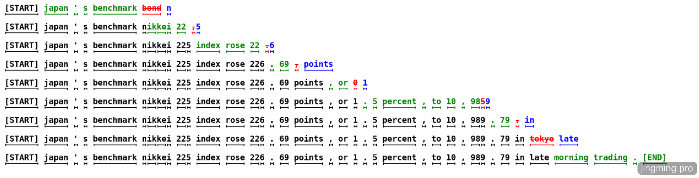

*图：投机采样流程举例*

### 2.3 实现步骤

**第1步：草稿模型预测**$γ$ **个 token和对应的概率分布**

草稿模型 $M_q$ 快速自回归地生成接下来 $γ$ 个Token序列：$x_1, x_2, \dots, x_γ$, 以及每个Token对应的概率分布$q_i(x)$


**注意：**公式里$x$为什么下标到$i-1$而不是$γ$？因为第$i$个 token的概率分布是由第$i-1$个token经过模型预测得到，$M(x\_γ)$计算出的是$q\_{i+1}(x)$。

**第2步：目标模型并行计算**$γ$ **个 token的真实概率分布**

将前缀和这 $γ$ 个词拼接一起输入给目标模型 $M_p$，通过一次前向传播并行计算出这 $γ$个词在目标模型下的概率分布 $p_i(x)$，正是这里的并行计算，提高了token返回的速度。

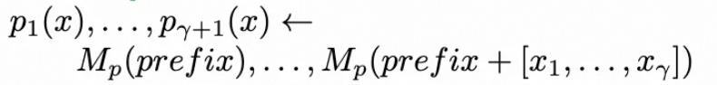

**注意：**公式里$x$的下标到$γ$，这样顺便计算出$γ+1$位置Token的概率分布$p_{γ+1}$。

**第3步：比较Token的概率分布决定接受哪些Token**

遍历Token序列：

如果$q_i(x)<p_i(x)$，说明目标模型比草稿模型还认可选出来的Token$x$，可以直接接受。

如果$q_i(x)>p_i(x)$，说明Token$x$在草稿模型中被高估了，目标模型不认可，此时以一定概率接受，计算方法如下：

从均匀分布中取一个随机数$r_i​∼Uniform(0,1)$

计算接受概率：$\frac{p_i(x_i)}{q_i(x_i)}$, 如果$r_i \le \frac{p_i(x_i)}{q_i(x_i)}$则接受，如果$r_i > \frac{p_i(x_i)}{q_i(x_i)}$则拒绝Token $x$

这一步确定了可以接受的前$n$个Token。

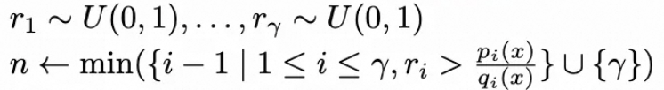

**第4步：对拒绝的Token重采样**

情况1: 所有Token验证都通过了$n = 𝛾$, 那直接从第2步顺便计算出的第$γ+1$位置Token的概率分布$p_{γ+1}$中采一个新的Token $t$，最终得到$γ+1$个Token

情况2: 第$n+1$个预测的Token被拒绝，使用修正概率分布$norm(max(0, p_{n+1}​(x)−q_{n+1​}(x)))$重新采样，**修正是为了服从目标模型的概率分布**$p$

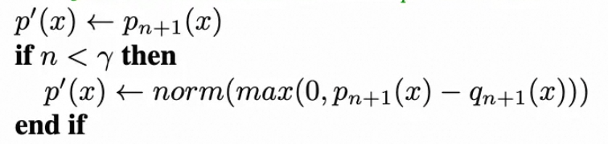

**第5步：返回**$n+1$个token

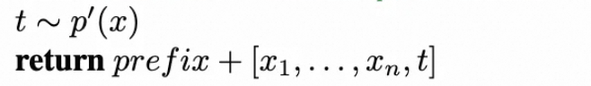

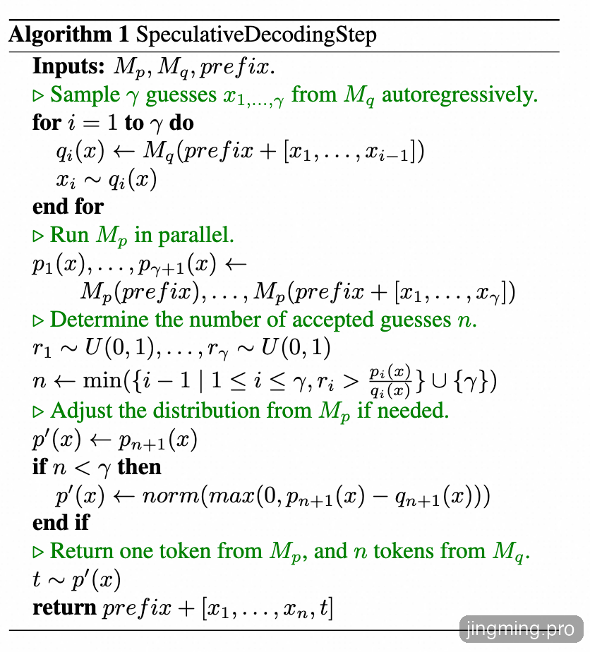

*图：完整的算法步骤伪代码*

### 2.4 举例说明

为了更清晰地说明投机采样的工作过程，我们假设 $K=3$（即草稿模型一次猜 3 个词），且当前已经生成的文本前缀为：**“大语言模型是”**。

**第一步：草稿模型生成** 草稿模型 $M_{\text{draft}}$ 快速预测接下来的 3 个词为：$x_1=$`"人"`, $x_2=$`"工"`, $x_3=$`"智能"`。 它同时给出了自己生成这三个词的概率 $p_{\text{draft}}(x)$。

**第二步：目标模型验证与采样** 我们将上下文和这 3 个词作为一个批次送入大模型 $M_{\text{target}}$ 计算，得到目标模型概率 $p_{\text{target}}(x)$ 并逐一判定：

**判定** $x_1 =$ `"人"`：

草稿模型概率 $p_{\text{draft}}(\text{"人"}) = 0.7$

目标模型概率 $p_{\text{target}}(\text{"人"}) = 0.9$

因为 $p_{\text{target}} > p_{\text{draft}}$，可以接受。目前生成的句子变成：`"大语言模型是人"`。

**判定** $x_2 =$ `"工"`：

草稿模型概率 $p_{\text{draft}}(\text{"工"}) = 0.8$

目标模型概率 $p_{\text{target}}(\text{"工"}) = 0.2$

接受率为 $\min(1, 0.2/0.8) = 0.25$。

此时生成一个随机数 $r \sim U$。假设 $r = 0.6$。因为 $r > 0.25$，**拒绝** `"工"`。

**第三步：对拒绝的Token重采样**

因为 $x_2$ 被拒绝，我们不仅丢弃 `"工"`，还要丢弃它后面的 `"智能"`。

大模型在判定 $x_2$ 失败后，利用残差分布 $\max(0, p_{\text{target}}(x) - p_{\text{draft}}(x))$ 在当前位置重新采样。假设大模型在 `"类"` 这个词上的残差概率很大，那么重采样抽中的词是 `"类"`，最终更新后的提示词为：大语言模型是**人类。**

在这一轮中，大模型只进行了一次前向传播计算，得到了 2 个 Token（`"人"`、`"类"`）。相比于传统的逐词解码（1次前向传播只能生成1个Token），在这个环节上，速度直接翻倍。

### 2.5 局限

在上述传统投机采样流程中，草稿模型的 Token 预测速度 和 预测结果被大模型接受的概率直接决定了投机采样的整体收益。传统投机采样通常依赖一个独立且参数规模更小的模型作为草稿模型，例如用 Llama-7B 为 Llama-70B 生成候选 Token。但这种草稿模型存在两个明显问题：

**模型彼此独立**，协同性差: 由于小模型层数更浅，表征能力会变弱，往往难以准确捕捉大模型在高维语义空间中的真实意图，因此候选 Token的接受率很有限。

**小模型本身计算开销大**: 以 Llama-7B 为例，输入Token仍要经过完整的几十层 Decoder 网络，才能得到下一个 Token 的概率分布，其推理成本依然较高，这会削弱投机采样原本希望带来的速度提升。

为了解决这些问题，**EAGLE（Extrapolation Algorithm for Greater Language-model Efficiency）** 不再额外引入一个替身小模型，直接复用大模型内部的权重和表征能力训练出草稿模型（小模型），这个草稿模型**同时拥有低开销和高接受率**的特性。

## 3. EAGLE-1

在EAGLE之前，也有许多研究在尝试降草稿模型的的开销。如Lookahead采用 n-gram 方法， Medusa利用一组 MLP，根据原始 LLM 最后一个Decoder层的特征来预测 token。这些策略确实降低了草稿模型预测Token的延迟，但预测的准确率不高，而EAGLE将准确率提升到了大约 0.8。

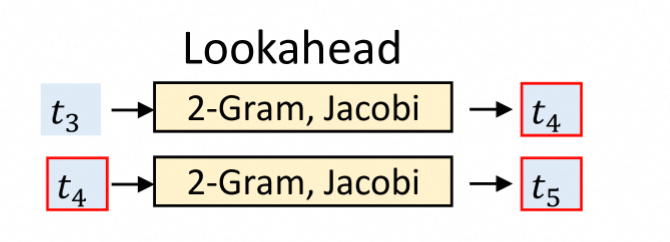

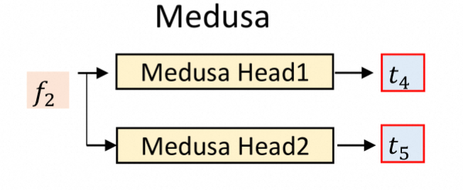

### 3.1 设计动机

EAGLE-1的算法设计基于下面两个思考：

大模型在生成第 $t$ 个 Token 时，最后一个 Transformer 层输出的特征$f_t$已经包含了丰富的上下文语义信息，直接用特征$f_t$自回归预测下一个特征$f_{t+1}$，随后再利用原始 LLM 的 LM head 生成 token，其效果优于直接使用token进行自回归预测（加速比1.9 vs 1.5）。

Token采样过程是随机的，采样不同的Token会导致下一个特征$f_{t+1}$明显分化，所以$f_{t+1}$并不是由$f_t$唯一决定，还要加上已经采样出来的下一个Token为$e_{t+1​}$，也就是$(f_t​, e_{t+1​})→f_{t+1}$

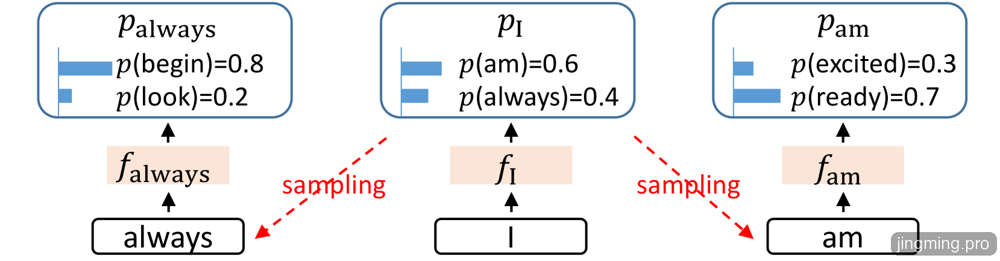

*图：词元 “I” 后面既可能跟 “always”，也可能跟 “am”，从而产生两个分支。*

### 3.2 草稿模型

#### 3.2.1 模型结构

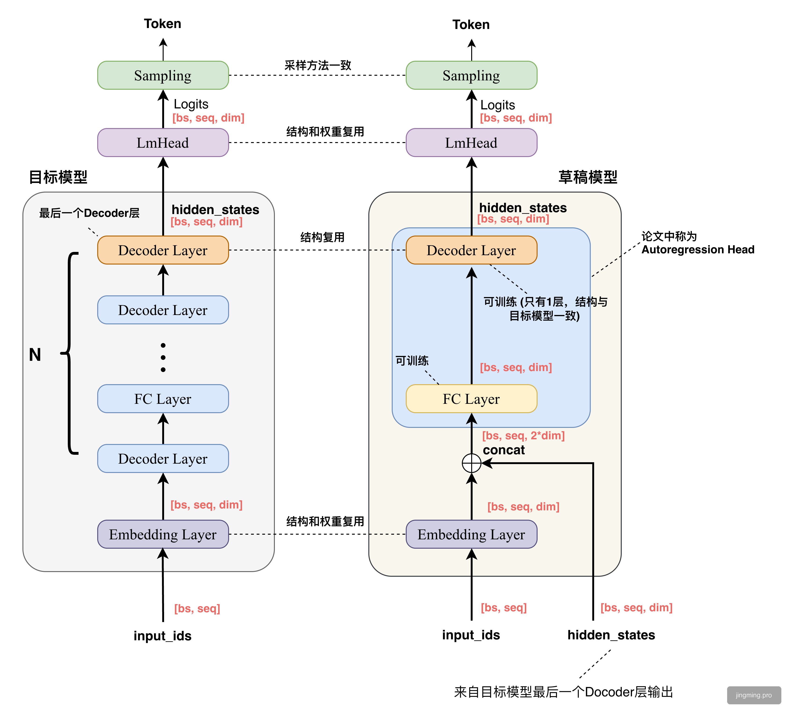

*图：草稿模型和目标模型对照*

EAGLE 的草稿模型由三个模块组成：Embedding layer、LM Head 和 Autoregression Head。其中Embedding layer 和 LM Head 直接使用目标 LLM 的参数，无需额外训练。草稿模型的输入包括一个形状为 (bs, seq_len, hidden_dim) 的特征序列，以及一个形状为 (bs, seq_len) 的token 序列。模型先将该 token 序列转换为embedding 序列，形状变为 (bs, seq_len, hidden_dim) ，再与特征序列进行拼接，形成一个形状为 (bs, seq_len, 2 × hidden_dim) 的融合序列。 Autoregression Head 由一个全连接层（Linear layer）和一个decoder layer组成。全连接层先将融合的特征降维到 (bs, seq_len, hidden_dim)，然后利用 decoder layer 预测下一个特征，随后经过LMHead计算出概率分布，采样出下一个 token。 草稿模型中只有一个全连接层和一层decoder，计算量和矩阵参数大幅缩小

#### 3.2.2 代码实现

```
class EAGLEModel(nn.Module):
  """  
  核心思想: 给定当前隐藏状态 h_t 和下一个 token，预测下一个隐藏状态 h_{t+1}
  """
  
  def __init__(self, config):
    super().__init__()
       
    # 1. Embedding层，复用基础模型
    self.embed_tokens = nn.Embedding(config.vocab_size, config.hidden_size,config.pad_token_id)
    # 冻结 embedding 参数
    for param in self.embed_tokens.parameters():
      param.requires_grad = False
    
    # 2. 特征融合层 (可训练)
    #  将 [hidden_states, token_embeds] 拼接后映射回 hidden_size
    self.fc = nn.Linear(
      2 * config.hidden_size,  # 输入: 拼接后的维度
      config.hidden_size,    # 输出: 原始维度
      bias=True
    )
    
    # 3. Transformer Decoder 层 (可训练，通常只有1层)
    self.layers = nn.ModuleList([
      LlamaDecoderLayer(config, idx) 
      for idx in range(config.num_hidden_layers) # 通常 = 1
    ])
  
  def forward(
    self,
    hidden_states: torch.Tensor,   # 基础LLM的隐藏状态 [bs, seq, hidden]
    input_ids: torch.Tensor,     # 目标token序列 [bs, seq]
    attention_mask: Optional[torch.Tensor] = None,
    position_ids: Optional[torch.Tensor] = None,
    past_key_values: Optional[List] = None,
    use_cache: bool = False,
  ):
    """
    前向传播
    
    训练时:
      输入 hidden_states: h_0, h_1, h_2, h_3
      输入 input_ids:   t_1, t_2, t_3, t_4 (已移位)
      目标 target:    h_1, h_2, h_3, h_4
    """
    batch_size, seq_length, _ = hidden_states.shape
    
    # ==================== Step 1: Token Embedding ====================
    # 冻结的 embedding，不参与梯度计算
    with torch.no_grad():
      inputs_embeds = self.embed_tokens(input_ids) # [bs, seq, hidden]
    
    # ==================== Step 2: 特征融合 ====================
    # 拼接: [hidden_states, inputs_embeds] -> [bs, seq, 2*hidden]
    # 然后通过 FC 层映射回 [bs, seq, hidden]
    inputs_embeds = inputs_embeds.to(hidden_states.dtype)
    hidden_states = self.fc(
      torch.cat((inputs_embeds, hidden_states), dim=-1)
    )
    
    # ==================== Step 3: Decoder Layer ====================
    # 通过 Transformer Decoder 层 (通常只有1层)
    for idx, decoder_layer in enumerate(self.layers):
      past_key_value = past_key_values[idx] if past_key_values else None
      
      layer_outputs = decoder_layer(
        hidden_states,
        attention_mask=attention_mask,
        position_ids=position_ids,
        past_key_value=past_key_value,
        use_cache=use_cache,
      )
      hidden_states = layer_outputs[0]
    
    # ==================== 返回预测的隐藏状态 ====================
    return hidden_states # [bs, seq, hidden]
```

### 3.3 草稿模型训练

前面提到，EAGLE 模型需要两类输入特征：

最后一层 Decoder 输出的当前 Token 特征$f_t$

通过采样得到的下一个 Token，即$e_{t+1​}$

给定当前hidden state和下一个token，预测下一个位置的hidden state

模型的目标是用当前hidden state特征$f_t$和下一个 Token $e_{t+1​}$，预测下一个位置的hidden state特征$f_{t+1}$，于是$(f_t​, e_{t+1​})→f_{t+1}$可以构成一条训练样本。接下来我们具体介绍下样本生成和训练的流程。

#### 3.3.1 数据准备

EAGLE使用 ShareGPT_V4.3 作为训练数据，这是一个包含真实用户与ChatGPT对话的数据集（数据量：约68000条对话）

对话示例：

```
{
 "id": "conv_001",
 "conversations": [
  {"from": "human", "value": "你好"},
  {"from": "gpt", "value": "你好！有什么可以帮助你的？"},
  {"from": "human", "value": "介绍下Python"},
  {"from": "gpt", "value": "Python是一种..."}
 ]
}
```

#### 3.3.2 特征提取

使用基础模型批量生成hidden_state等特征数据。

Step1：将对话数据转为基础模型所识别的提示词格式

```
[INST] SYS>> You are a helpful... /SYS>>
你好 [/INST] 你好！有什么可以帮助你的？ /s>
s>[INST] 介绍下Python [/INST] Python是一种... /s>
s>[INST] 谢谢 [/INST] 不客气！ /s>
```

Step2：生成tokenId和loss_mask

```
# 生成input_ids和loss_mask
input_ids = tokenizer(conversation, ...)

# loss_mask标记哪些位置需要计算损失
# 只在模型(gpt)回复的位置设为1，用户输入位置设为0
loss_mask[user_instruction_range] = 0 # 忽略用户输入
loss_mask[model_response_range] = 1  # 只学习模型回复
```

Step 3: 生成Hidden States和样本

```
@torch.no_grad()
def ge(data):
  # 运行基座模型的前向传播
  outs = bigmodel(input_ids.cuda(), output_hidden_states=True)
  # 提取最后一层的hidden states
  hidden_state = outs.hidden_states[-1] # [seq_len, 4096]
  
  return {
    "input_ids": input_ids,   # token序列
    "hidden_state": hidden_state, # 对应的hidden states
    "loss_mask": loss_mask    # 损失掩码
  }
```

保存每条数据到 .ckpt 文件：

```
{
 input_ids:  [1, 319, 13563, 518, 25580, ..., 29871, 5765, ...]
        │──────────────── seq_len ────────────────────│
 
 hidden_state: [[h0], [h1], [h2], ..., [h499]]
         │──── [seq_len, 4096] ───────│
 
 loss_mask:  [0, 0, 0, ..., 1, 1, 1, ..., 0, 0, 0, ..., 1, 1, 1]
         └─Human─┘  └──GPT──┘  └─Human─┘   └──GPT──┘
}
```

#### 3.3.3 样本生成

将上一步生成的特征数据转换为样本，效果如下图所示：


#### 3.3.4 损失函数

EAGLE使用双重损失来训练模型：

预测下一个特征本质上是一个回归任务，计算推理得到的hidden state回归损失：

$L_{reg}​=Smooth L1(f_{i+1}​, Draft{\_Model}(T_{2:i+1}​,F_{1:i}​))$

特征预测只是草稿模型的一个中间目标，最终目标是预测 token，从而生成 token 序列。还引入了分类损失，以便直接向这一最终目标进行优化。

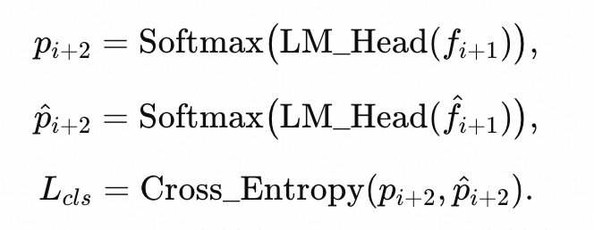

于是得到如下联合损失函数：

$L=L_{reg}​+w_{cls}​L_{cls}​$

因为分类损失会比回归损失大一个数量级。论文中将$w_{cls}$设为 0.1。

#### 3.3.5 训练

完成前面的准备，开始进行训练：

```
for epoch in range(num_epochs):
  for batch in train_loader:
    # 前向传播
    predict = model(batch["hidden_states"], 
            input_ids=batch["input_ids"],
            attention_mask=batch["attention_mask"])
    
    # 计算双重损失
    vloss = smooth_l1_loss(predict, batch["target"])
    ploss = kl_divergence(lm_head(predict), lm_head(batch["target"]))
    loss = v_w * vloss + p_w * ploss
    
    # 反向传播
    accelerator.backward(loss)
    optimizer.step()
```

训练的特点：

**目标模型完全冻结**：训练过程中目标模型的所有参数（包括 Embedding 层和 LM Head）均不更新，只训练融合层和单层 Transformer 的参数。

**训练成本极低**：由于可训练参数量极少（通常不到目标模型的 1%），EAGLE 的训练仅需 1-2 天（在单张 GPU 上），使用的训练数据量也很小（通常 ShareGPT 等数据集上几万条对话即可）。

**与目标模型天然对齐**：因为特征和 LM Head 都来自目标模型自身，解决了传统方案中小模型与大模型协同性差的问题。

### 3.4 推测验证流程

#### 生成候选Token树

在标准投机采样中，草稿模型每轮推理采样只保留一个Token，于是生成的预测Token是一串序列。EAGLE中，草稿模型每轮推理采样会保留多个Token，对保留的每个Token分别进行下一轮推理采样，于是得到一棵候选Token树，提供给目标模型进行验证。

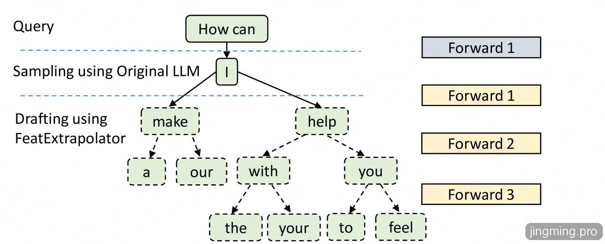

生成候选Token树的流程如下图所示:

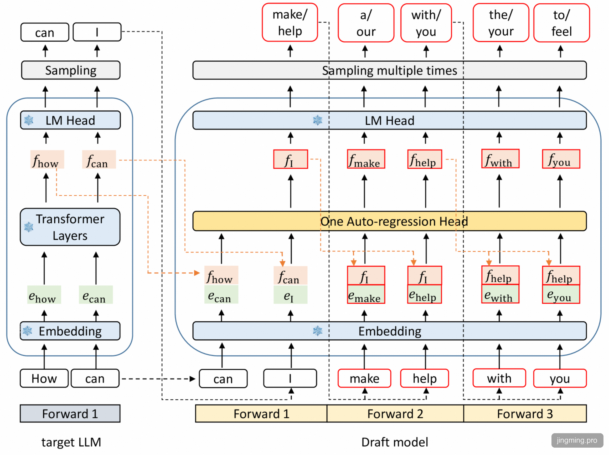

**注意，如果要和上面生成的候选Token树保持一致，这个图Forward3流程应该再加上"a", "our"的Forward流程，可能是作者漏掉了。**

#### 候选Token树采样

EAGLE使用目标模型并行采样候选树的所有路径，选择匹配长度最大的那条，其**采样算法与传统投机采样一致**。但由于提供了更多的可能路径，最后目标模型接受的Token会更多，再加上多条路径可以并行验证，从而提高了Token的生成速度。

### 3.4 实验结论

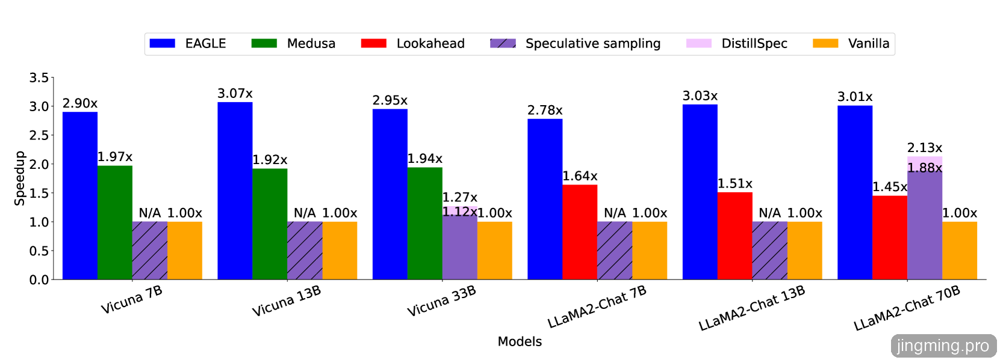

**优点：**

使用在 MT-bench数据集、采用贪婪解码（temperature=0），EAGLE 在所有模型上都取得了最高的推理加速比，整体明显优于 Medusa、Lookahead、Speculative sampling 和 Vanilla等投机采样方法。

并且EAGLE训练出的草稿模型具有很强的**通用性**，文中在只使用ShareGPT数据集上训练出来草稿模型，再使用其他评测集（MT-bench、GSM8K、HumanEval、alpaca）进行评测，也得到很好的效果。

**局限：**

在生成高度不确定的内容（如创意写作）时，草稿模型的预测准确率下降，加速效果减弱；在确定性较高的任务（如代码生成、翻译）中，由于模式相对固定，表现更佳。

## 4. EAGLE-2：候选树采样优化

### 4.1 研究动机

EAGLE-2与EAGLE-1的思路一致，其草稿模型结构，训练流程和EAGLE-1中完全相同，只是对候选Token树的采样过程进行了优化。EAGLE-1中对候选Token树所有节点进行推理采样，如果候选Token树的层次设置比较大，节点会成指数增长，产生了大量无效计算，在EAGLE-2中提出了“可动态调整草稿树”，在保证采样准确性的前提下，对候选Token树的节点进行了裁剪，从而进一步提升了Token的生成速度。

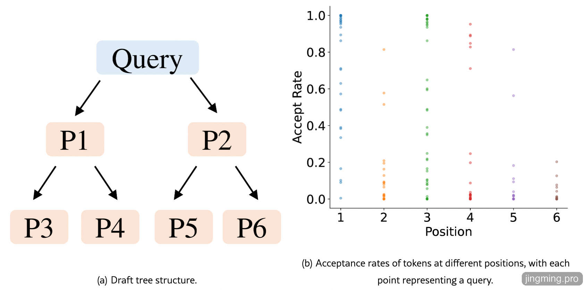

图中左侧的“草稿树”就是EAGLE-1草稿模型最后生成的候选Token树，作者观察发现草稿树Token的接受率与其在树中的位置存在相关性，草稿树左上侧的 token（如位置 P1）通常具有更高的接受率，而右下侧的 token（如位置 P6）接受率较低。而在同一个位置上，接受率仍然存在显著波动（如右图所示，图中的点表示一条 query 在该位置的接受率），表明草稿 token 是否会被接受，不仅取决于其位置也取决于**它所在路径前后Token的概率，如果路径总的概率高，那么被目标模型接受的接受率也高，如果路径总概率不高，就裁剪掉这样的路径从而减少计算量。**

### 4.2 算法思路

基于上述观察，作者提出了“基于上下文感知的动态草稿树（Context-Aware Dynamic Draft Tree）”，也就是EAGLE-2，它没有改变EAGLE-1草稿模型的训练与推理过程，也不影响验证阶段，主要改进为**如何有选择的生成草稿树**和**如何对草稿 token 重新排序得到最终的Token。**

#### 4.2.1 生成动态草稿树

草稿模型可以同时将当前层的所有 token 作为输入，并在一次前向传播中计算它们的下一个 token 概率，从而对当前层所有 token 的同时扩展，这种方式会让Token数量会呈指数级增长，所以肯定要有选择的扩展草稿树，可以看成裁剪。裁剪的方式很简单，每次扩展从当前层中选择**全局接受概率**最高的 $top-𝑘$ 个 Token 进行扩展，Token $t_i$ 的**全局接受率定义**为从根节点到$t_i$ 路径上所有 token 概率的乘积，如下图所示：

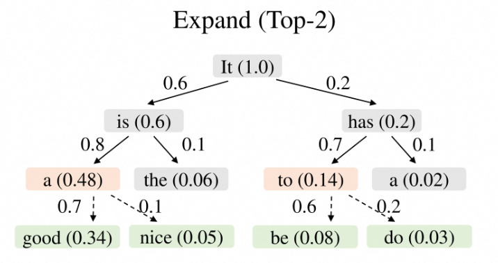

#### 4.2.2 重排序

扩展阶段的目的是**加深草稿树，但一些**被裁剪浅层节点可能全局概率更高，所以直接将扩展阶段选中的 token 作为最终草稿，而是对所有草稿 token 重新排序，并选出取值最高的 $top-m$ 个 token。如下图"the"虽然被裁剪了，但其全局概率高于"nice"和"do"，从而过滤掉nice和do，保留"the"。

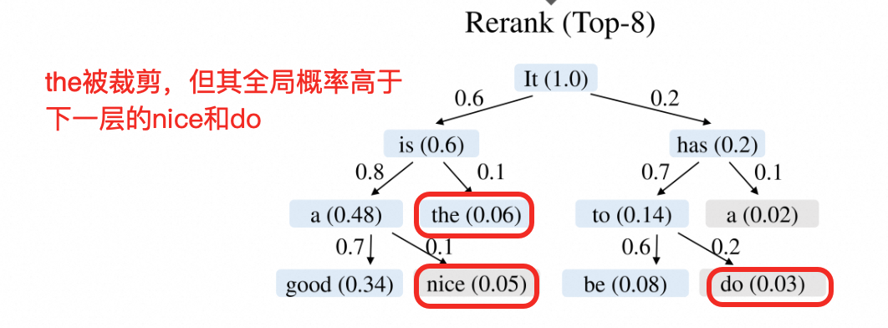

最后将选出的Token用一个一维序列表示，作为后续目标模型验证阶段的输入。

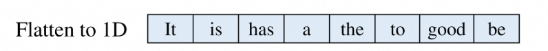

你可能会疑惑，不是要验证每一条路径吗，怎么变成一个一维序列给目标模型？这里非常巧妙的利用了树的前缀共享和Attention计算过程中的mask机制。

**树的前缀共享**：

比如两条路径：

A → B → C

A → B → D

它们前面的前缀 **A, B** 是共享的。如果你按“每条路径单独验证”，那 A、B 会被重复算，可以合并起来算一次。

**Attention Mask**

树上任意一个节点，只能看其路径上的祖先节点和原始前缀，在自注意力里，Attention Mask矩阵已经是一个下三角形，满足每个节点只能看到它之前的节点，但我们这里是一个树形结构，还要满足只能看到它路径上之前的节点，所以要修改Attention Mask矩阵如下：

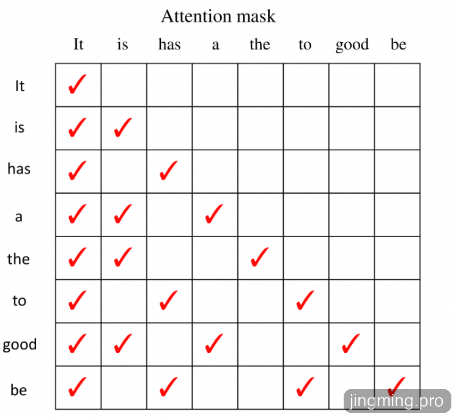

### 4.3 实验结论

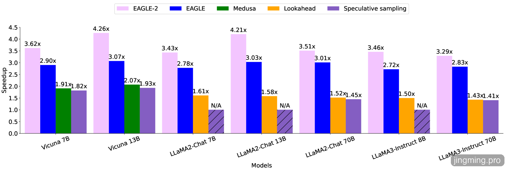

使用在 MT-bench数据集、采用贪婪解码（temperature=0），EAGLE-2 在所有模型上都是最快的，并且全面超过 EAGLE 和其他基线方法。EAGLE-2 在 EAGLE 的基础上又进一步快了 20% — 40% 左右。

## 5. EAGLE-3：训练时多步推测

### 5.1 研究动机

当前LLM 越来越依赖更大的训练数据集来获得更好的性能。例如LLaMA 系列中参数规模为 7B的模型，分别在 LLaMA 1、LLaMA 2和 LLaMA 3（Dubey et al., 2024）中使用了 1T、2T 和 15T 个 token 的训练数据，在模型架构和推理成本基本不变的情况下，各项指标都取得了显著提升。作者也希望通过增加训练数据来提升 EAGLE 的接受率和加速比，但是额外训练数据给 EAGLE 带来的收益相当有限。

### 5.2 算法思路

作者分析了原因，EAGLE 的损失函数由特征预测损失 $l_{fea}$​ 和 token预测损失$l_{token}$两部分相加组成，但最终目标是预测Token，特征预测实际上可以被视为一种额外约束，从而限制了草稿模型的表达能力，使其难以从更多数据中获益。

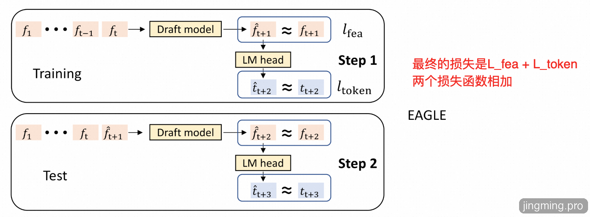

*图：EAGLE-1的训练和验证流程，使用了$l\_{fea}$​ +$l\_{token}$两个损失函数相加*

既然特征部分成了限制，那就去掉特征预测的损失函数，只计算Token预测的损失函数$l_{token}$，重新用更多的数据训练草稿模型，这个草稿模型第一个预测出的Token接受率显著提升，但第二次预测的Token接受率非常低。这主要是因为 $\hat{a}_{t+1}$ 与真实特征 $f_{t+1}$ 差异很大，这样第二次预测时输入序列$f_1, f_2, \ldots, f_t, \hat{a}_{t+1}$明显偏离训练分布，导致第二个token接受率非常低。那$\hat{a}_{t+1}$为什么与真实特征$f_{t+1}$变大了？原因也很简单，**我们刚去除了特征预测的损失函数**$l_{fea}$。

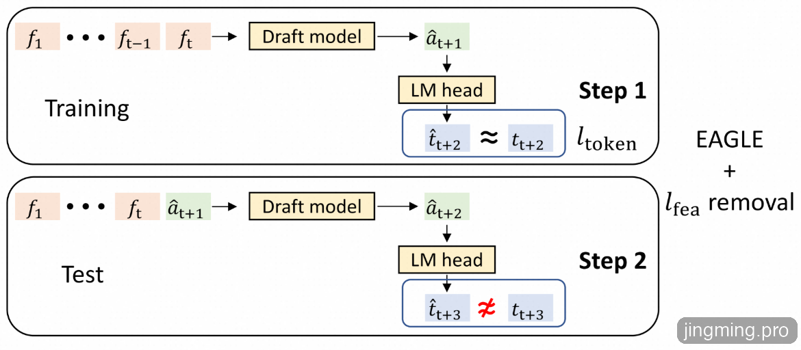

*图：去除特征预测损失 $l\_{fea}$，只保留Token预测的损失函数$l\_{token}$*

EAGLE-3训练时模拟推理时的多步推测过程（论文中称为 Training-Time Test），相当于考虑了第二次、第三次 ... 到第n次的预测情况，从而解决了这个问题，论文里用下面这个图来解释这个过程，个人感觉很不容易理解，可以参考下面训练时测试部分的代码实现。

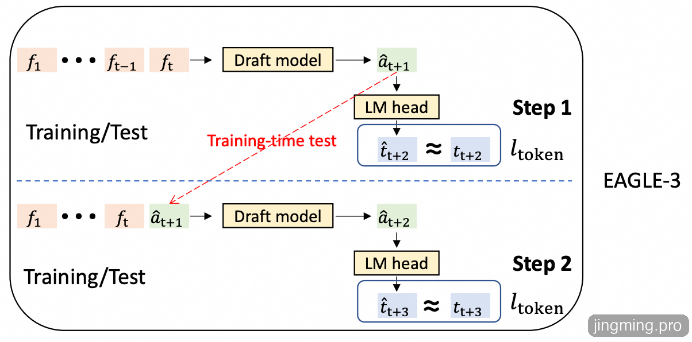

### 5.3 模型训练

#### 5.3.1 模型结构

EAGLE1/2中，特征只取最后一层Docoder的输出；EAGLE-3中，对第一层、中间层、最后一层的三个Decoder输出特征进行了特征融合（拼接+FC），如下图右下角所示：

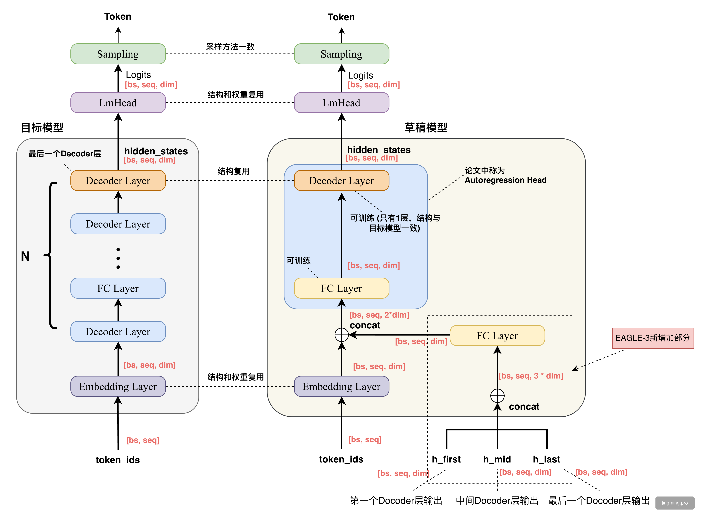

*图：EAGLE-3 模型结构，主要改动是增加了低、中、高三个特征层。*

#### 5.3.2 训练时测试

推理时（test time），draft 模型会自回归地连续生成多个 token，每一步都 attend 到之前所有步的 KV cache。"Training-time test" 就是在训练时复现这个过程。

之前的训练方式只做单步预测，每个训练样本只提供 1 个预测任务。而 training-time test 在训练时让每个样本进行7次自回归的预测，这和推理时的真实情况一致，更多训练数据意味着模型在更多样的上下文中练习了这种多步推测链，泛化效果自然更好。这就实现了论文的目标通过增加训练数据提升草稿模型准确率。

##### 核心代码逻辑

```
cache_hidden = [[], []] # 累积的 KV cache

for idx in range(self.length): # 循环 7 次，模拟推理时连续推测 7 步
  inputs_embeds = self.embed_tokens(input_ids)
  
  # midlayer 可以 attend 到之前所有步骤的 KV（和推理时一样）
  layer_outputs, cache_hidden = self.midlayer(
    input_emb=inputs_embeds,
    hidden_states=hidden_states,
    cache_hidden=cache_hidden,
    ...
  )
  
  # 每步都计算 loss
  logits = self.lm_head(self.norm(hidden_states_out))
  plosses.append(loss)
  
  # 为下一步准备：左移 input_ids/target/loss_mask
  input_ids = padding(input_ids, left=False)
  target = padding(target, left=False)
```

### 5.5 实验结论

#### 草稿模型随训练规模增大性能持续提升

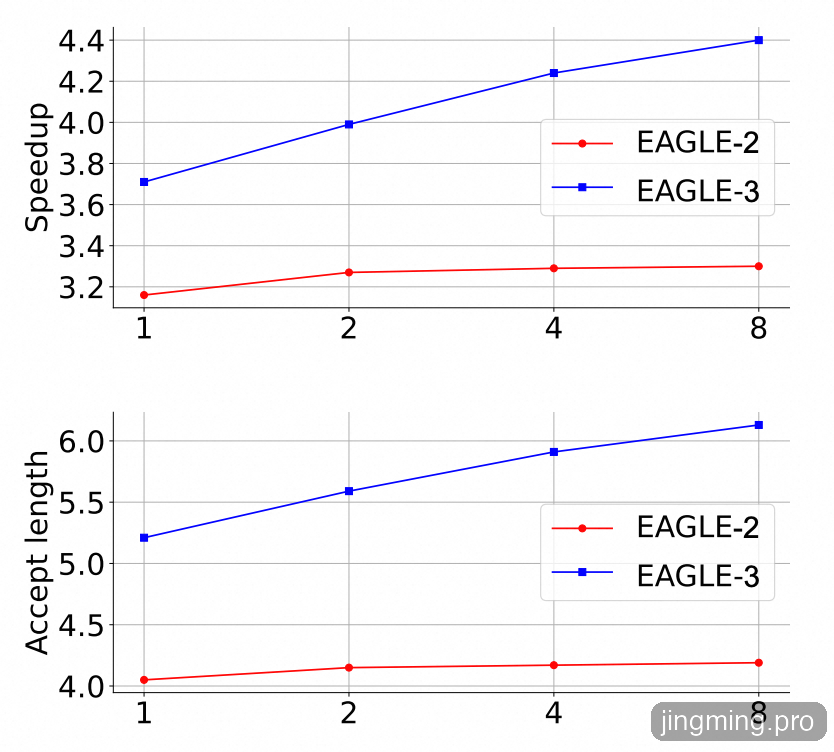

在 MT-Bench 上，以 LLaMA-Instruct 3.1 8B 作为目标模型，横轴表示相对于 ShareGPT 的数据规模。草稿模型随着 训练规模增大，EAGLE-3 的收益会继续上升，而 EAGLE-2 很快就进入平台期。

#### 推理加速效果

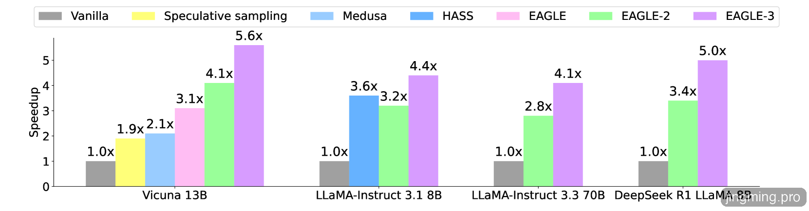

采用贪婪解码（temperature=0），EAGLE-3 在所有模型上都是最快的，并且全面超过 EAGLE-2 和其他基线方法，对话模型的评测数据集为 MT-Bench，推理模型的评测数据集为 GSM8K，EAGLE-3 的加速比最高可达 6.5 倍，相比 EAGLE-2 提升约 1.4 倍。

## 总结与展望

投机采样通过预测生成和目标验证机制，在保证输出分布与原模型一致的前提下，突破了LLM逐token串行解码的瓶颈。EAGLE-1利用大模型内部特征训练轻量草稿模型，兼顾低开销与高接受率；EAGLE-2进一步通过动态草稿树裁剪与重排序，减少无效扩展；EAGLE-3则通过多层特征融合和“训练时测试”提升多步推测能力，使草稿模型能持续受益于更大规模数据。整体来看，EAGLE系列推动了无损推理加速从可用走向高效。未来可继续探索更强的树搜索策略、更深层特征的利用、自适应推测步长 γ 的动态调整，以及与量化/蒸馏等其他加速技术的联合优化。

注：EAGLE 系列的实现涉及较多大语言模型结构与推理机制相关概念。若你对这些基础内容还不熟悉，建议先补充 LLM 模型结构与推理流程的基础知识，会更容易理解 EAGLE 的设计思路与实现细节。

**参考文献**

[1] Chen C, Borgeaud S, Irving G, et al. Accelerating Large Language Model Decoding with Speculative Sampling[J]. arXiv preprint arXiv:2302.01318, 2023.

[2] Li Y, Wei F, Zhang C, Zhang H. EAGLE: Speculative Sampling Requires Rethinking Feature Uncertainty[C]//*Proceedings of the 41st International Conference on Machine Learning (ICML 2024)*. PMLR, 2024.

[3] Li Y, Wei F, Zhang C, Zhang H. EAGLE-2: Faster Inference of Language Models with Dynamic Draft Trees[C]//*Proceedings of the 2024 Conference on Empirical Methods in Natural Language Processing (EMNLP 2024)*, 2024.

[4] Li Y, Wei F, Zhang C, Zhang H. EAGLE-3: Scaling up Inference Acceleration of Large Language Models via Training-Time Test[J]. arXiv preprint arXiv:2503.01840, 2025.

[5] Cai T, Li Y, Geng Z, et al. Medusa: Simple LLM Inference Acceleration Framework with Multiple Decoding Heads[J]. arXiv preprint arXiv:2401.10774, 2024.
