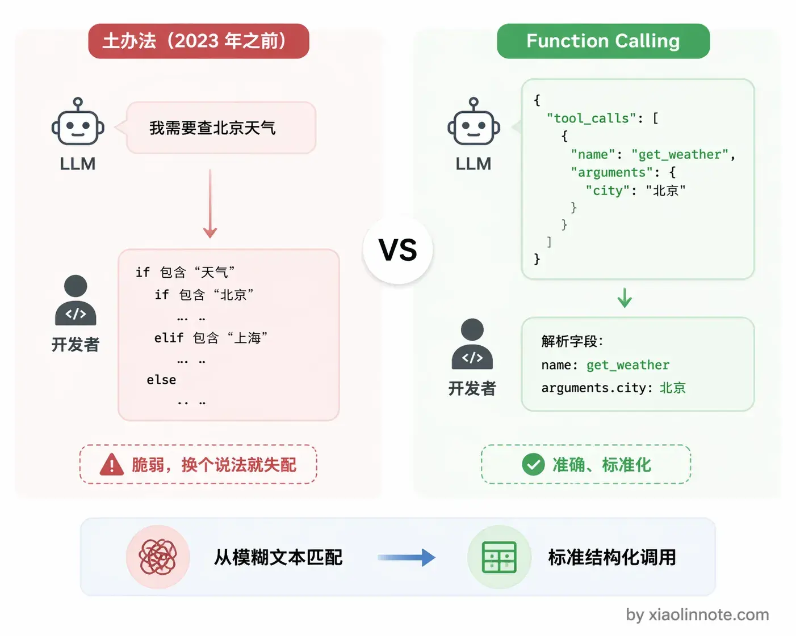
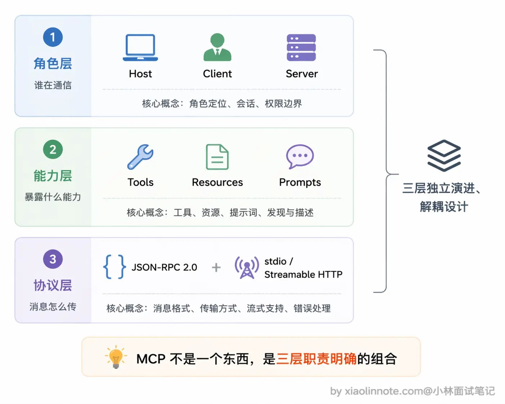
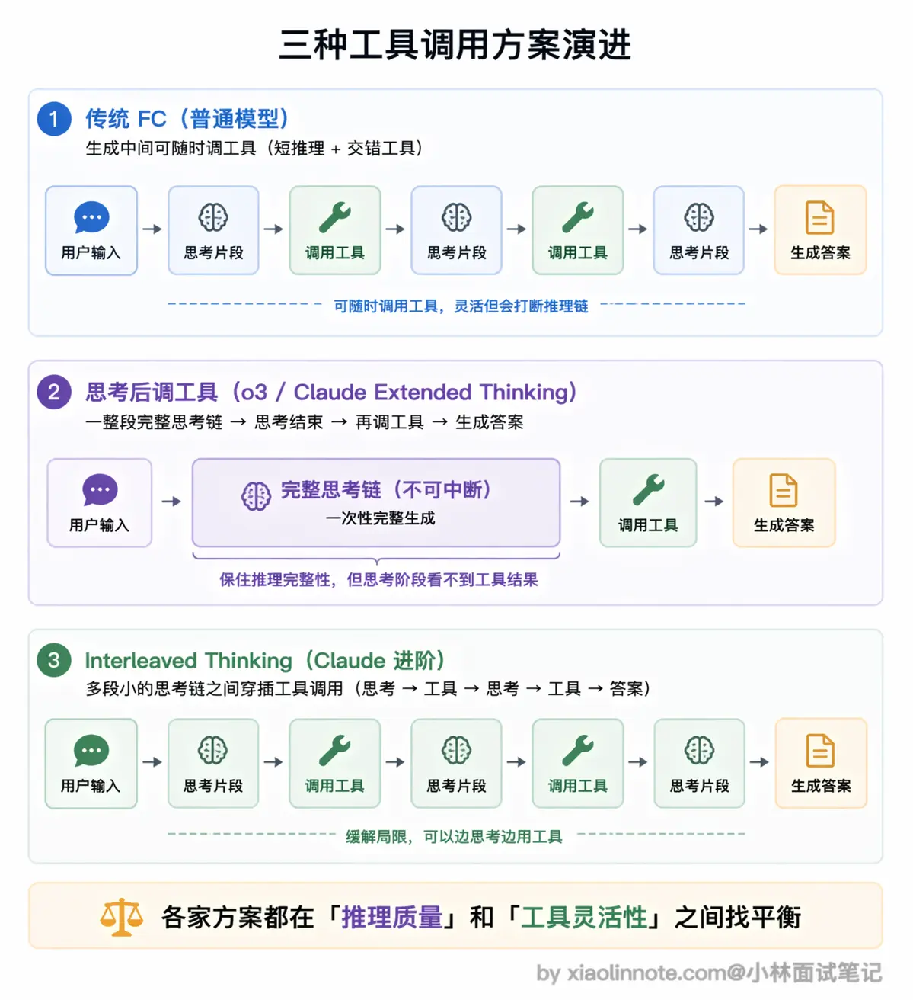
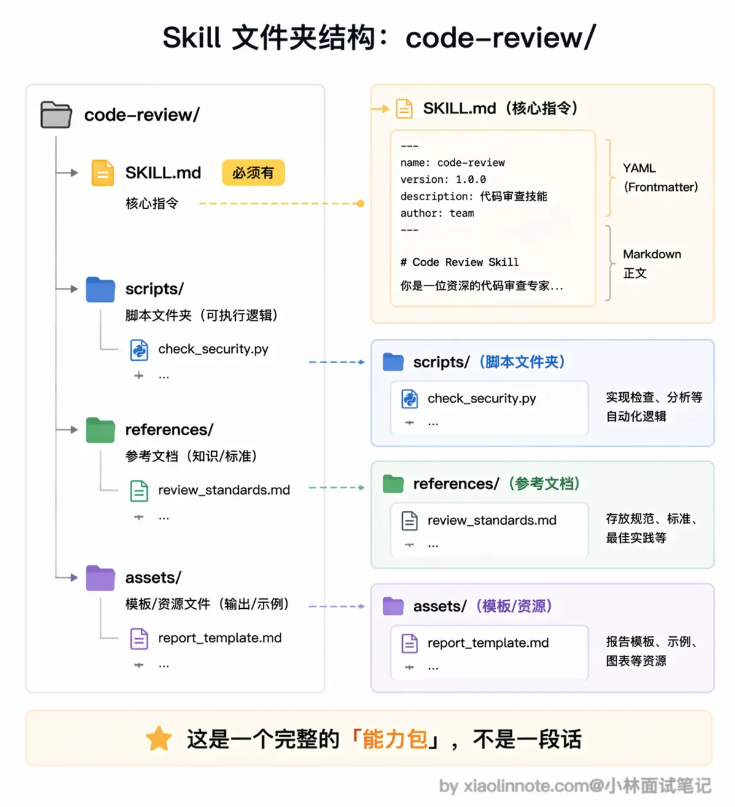
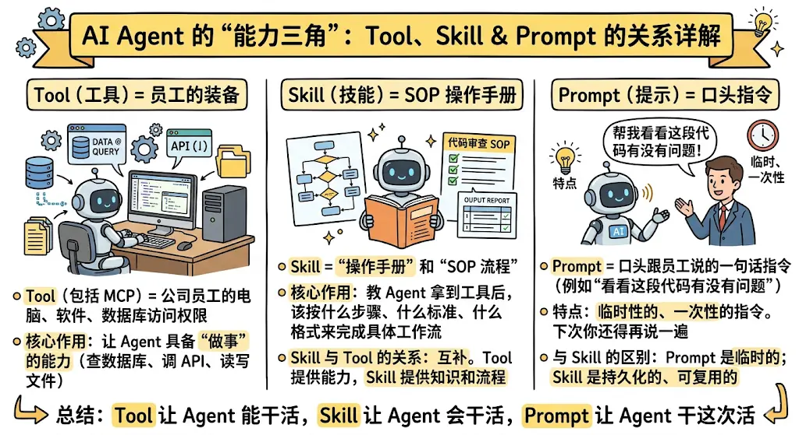
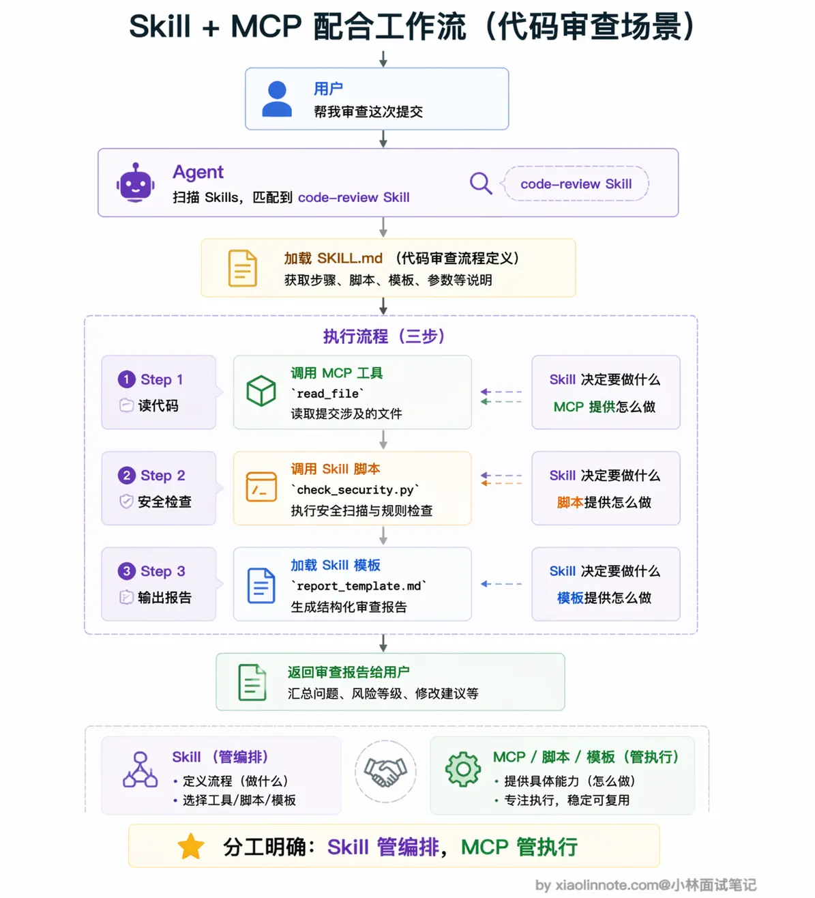
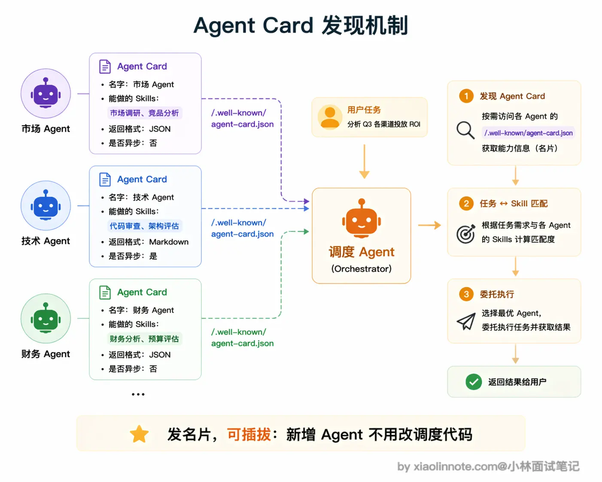
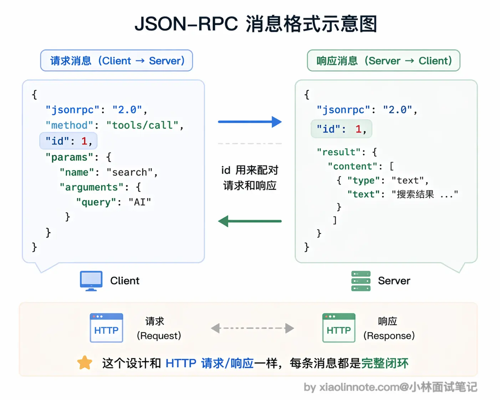
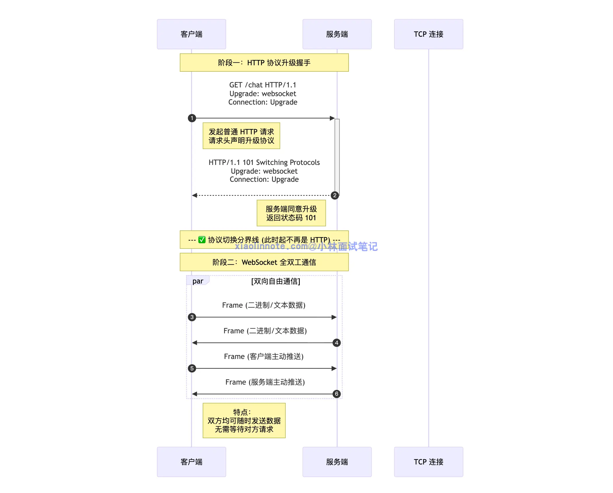

# LLM 工具调用八股

# 什么是 Function Calling ？原理是什么？

Function Calling 我的理解是这样一套机制：

开发者用 JSON schema 把工具描述好传给模型，模型判断需要调工具的时候不输出自然语言，而是直接输出一段结构化的 tool\_calls JSON，告诉你「我要调哪个函数、参数是什么」，你的代码拿到这段 JSON 去真正执行，把结果塞回对话，模型再生成最终答案。

整个流程本质上是两轮对话：

第一轮模型说「我需要调这个工具」，你去执行，第二轮模型拿到执行结果说「答案是这个」。

我觉得最核心的设计是，模型全程只做决策，执行的事情一律由宿主代码完成，职责分得很清楚。



## 并行工具调用

看完单个工具的流程，再来想一个问题：如果用户一口气问了好几件事，比如「帮我查北京、上海、广州三个城市的天气」，模型一次该调一个工具，还是可以同时调多个？这就要说到 Function Calling 的并行调用设计。

当用户的问题需要多个工具才能回答时，模型可以在一次响应里同时输出多个 `tool_calls`，`tool_calls` 是个列表，不只有一条。比如用户问「帮我查北京和上海的天气」，模型会一次返回两个调用请求，分别对应两个城市。

为什么要这么设计？你想一下，如果没有并行调用，模型先说「我要查北京天气」，你执行完喂回去，模型再说「我要查上海天气」，又一轮对话，这样两个工具串行要跑两轮，每一轮都有一次模型推理和一次工具执行的延迟，总耗时很长。有了并行调用，模型一次把两个调用请求都输出来，你的代码可以同时执行这两个工具（比如用 Python 的 `asyncio.gather` 或者多线程），拿到所有结果后一次性塞回对话，再调一次模型就拿到综合了多个工具结果的最终答案。整个过程从「两轮对话」压缩成了「一轮对话 \+ 并行执行」，总耗时大幅降低。

# LLM 是如何学会调用外部工具的？

这道题我分两块来讲：模型怎么被训练出工具调用能力，以及训练好之后运行时是怎么工作的。

训练层面靠两个阶段：

- SFT（监督微调，Supervised Fine\-Tuning）：给模型喂大量「工具调用示范对话」，让它通过模仿学会「看到工具描述 \-\> 判断要不要调 \-\> 输出结构化 JSON 请求」这整套流程；

- RLHF（基于人类反馈的强化学习，Reinforcement Learning from Human Feedback）：收集人类对「哪种回答更好」的判断，训练一个打分器，再用这个分数反复调整模型，让它学会什么时候不应该调工具。

运行层面，每次请求时，你的应用代码把工具描述（叫 schema，可以理解为工具的说明书）传给模型，模型如果判断需要工具，就输出一段结构化的 `tool_calls` JSON；你的代码拿到这段 JSON 去真正执行，把结果塞回对话，模型再给出最终答案。

有一点非常关键：模型全程只是在「下指令」，真正执行工具的是你的代码，不是模型本身。这套「模型决策、代码执行」的运行时机制，就是我们常说的 Function Calling。

# 什么是 MCP（模型上下文协议）？讲讲它的核心内容？

MCP 是 Anthropic 在 2024 年底推出的开放协议，我理解它主要解决的是「模型接工具太碎片化」的问题。

在 MCP 出现之前，每接一个新工具都要单独写集成代码、处理认证、适配格式，而且这套代码和具体模型强绑定，换个模型就得重写，非常繁琐。

MCP 的思路是把这件事标准化：工具提供方按协议实现一个 Server，任何支持 MCP 的 AI 客户端就能直接接进来，一次实现到处复用。

协议定义了三类能力：Tools 用于执行有副作用的操作，Resources 是只读数据，Prompts 是提示词模板，底层通信用 JSON\-RPC 2\.0。

我把它理解成给「AI 接工具」这件事定了一套行业标准。

## MCP

### 架构

MCP 采用标准的 Client\-Server 架构。

Server 是工具的实现方。比如 GitHub 官方维护一个 GitHub MCP Server，里面封装了「列出 PR」「创建 Issue」「搜索仓库」「查看 Diff」等操作；Client 是 AI 应用那一侧，比如 Claude Desktop 或 Cursor，连上 Server 之后就自动获得了这些工具能力。

### 核心能力

- 工具

先说 Tools（工具），这是最核心的能力，对应 Function Calling 里的「函数」。Tools 的本质是「有副作用的操作」，什么叫有副作用？就是执行之后会改变外部世界的状态。创建文件、提交代码、发送 Slack 消息、调用第三方 API，这些都属于 Tools，因为执行完之后环境发生了变化，而且往往不可逆。正因为如此，Tools 通常需要用户授权确认才能执行，不能让模型想调就调。

- 资源

再说 Resources（资源），它和 Tools 最本质的区别就一个字：只「读」。Resources 不会改变任何东西，只是把数据提供给模型看。读取日志文件、查询数据库记录、获取文档内容，都属于 Resources 的范畴。你可以把 Resources 理解成「工具的资料室」，模型可以进去查资料，但不能修改里面的东西。正因为只读、无副作用，Resources 可以更宽松地暴露给模型，不需要像 Tools 那样谨慎授权。

- 提示模板

最后是 Prompts（提示模板），这个能力很多人容易忽略，但在团队协作场景下特别有用。Prompts 就是预定义的提示词模板，带参数占位符，解决的是「每次都要手写重复 prompt」的问题。举个例子，你的团队有一套固定的代码审查标准 prompt，接受「编程语言」和「代码内容」两个参数，调用时只需传入参数值，就能自动展开成完整的提示词，不用每次从头写。把公司积累的优质 prompt 封装成 MCP Prompts，所有人都能复用，统一标准，这在实际工程中很实用。

### 底层通信——JSON\-RPC2\.0

JSON\-RPC 是一种轻量级的远程函数调用协议，用 JSON 格式来表达「调用」这件事。核心非常简单：客户端发一个 JSON 请求，里面说清楚「调哪个方法、参数是什么、这次请求的 ID 是多少」；服务端执行完，返回一个 JSON 响应，里面是执行结果或者错误信息。**用 JSON 而不是二进制格式，好处是易读、易调试、语言无关，任何编程语言都能轻松实现。**MCP 用的是它的 2\.0 版本（JSON\-RPC 2\.0），相比 1\.0 加了批量请求、通知消息等功能。

在传输层，MCP 支持两种方式。

- 第一种是 stdio（标准输入输出），Server 作为本地子进程运行，Client 通过管道和它通信，Server 从 stdin 读消息，把结果写到 stdout。这种方式适合本地工具，不需要网络，启动快、延迟低，Claude Desktop 接本地 MCP Server 用的就是这种方式。

- 第二种是 Streamable HTTP，Server 作为 HTTP 服务部署在远程，Client 通过 HTTP 连接和它通信。这种方式适合远程部署的工具服务，或者需要多个 Client 共享同一个 Server 的场景，比如团队共用一个部署在服务器上的数据库 MCP Server，所有人的 AI 客户端都连同一个地址就行。

这里有个演进要说清楚：MCP 早期版本（2024\-11\-05 规范）用的是「HTTP \+ SSE」双端点方案，一个 GET 端点开 SSE 长连接接收推送，一个 POST 端点发请求，两个端点绑在一起工作。2025 年 3 月的规范更新里，这套方案被改成了 Streamable HTTP（老的 HTTP\+SSE 被标记为 deprecated，但仍保留向后兼容）。

Streamable HTTP 并不是「抛弃 SSE」，而是把原来的两个端点合并成一个 `/mcp` 端点。Client 用 POST 发请求，Server 根据情况灵活返回：短请求直接回一个普通 JSON 响应，长请求则把这个 HTTP 响应升级为 SSE 流，持续推送中间结果。架构更简洁，部署也更友好（一个端点就够，serverless 环境也能跑），本质还是 HTTP 加 SSE，只是用法变了。

SSE **（Server\-Sent Events）** 是一种可以主动从服务端推送消息的技术。SSE 的本质其实就是一个 HTTP 的长连接，只不过它给客户端发送的不是一次性的数据包，而是一个 stream 流，格式为 text/event\-stream。所以客户端不会关闭连接，会一直等着服务器发过来的新的数据流。

# MCP 由哪几部分组成？

MCP 由三层组成，可以从角色、能力、协议三个维度来理解。

角色层有三个：Host 是 AI 应用本身（比如 Claude Desktop），Client 是 Host 里负责和 Server 通信的模块，Server 是工具提供方实现的独立进程，一个 Host 可以同时连多个 Server。

能力层定义了 Server 能暴露三类东西：Tools 是有副作用的操作（比如创建文件、调 API），Resources 是只读数据（比如读取文档内容），Prompts 是预定义的提示词模板。

协议层是底层通信：消息格式统一用 JSON\-RPC 2\.0，传输方式支持 stdio（本地子进程通信）和 Streamable HTTP（远程 HTTP 连接）两种，早期的 HTTP\+SSE 双端点方案在 2025 年 3 月的规范更新里被标记为 deprecated。

这三层合在一起，就是 MCP 的完整组成。



# MCP 和 Function Calling 有什么区别？有没有实际跑过 MCP？

我理解这两者不是竞争关系，解决的不是同一层面的问题。

- Function Calling 是「调用语言」，定义的是模型怎么表达「我要调哪个函数、参数是什么」

- MCP 是「工具生态协议」，定义的是工具怎么标准化打包、注册和被 AI 客户端发现。

MCP 底层其实还是用 Function Calling 来触发工具调用，只是在它之上加了一套**工具管理框架**，让工具实现一次、到处复用。

打个比方：Function Calling 像 HTTP 请求格式，MCP 像 REST API 的设计规范加服务注册发现机制，两者是不同层次的东西。

关于实际跑过的经验，我用 Claude Desktop 配过文件系统和 GitHub 的 MCP Server，在配置文件里加几行就能用，Claude 会自动发现工具，完全不用写对接代码。

## MCP

很多人第一次看到 MCP 会有一个直觉困惑：Function Calling 不是已经能调工具了吗，模型想用工具直接定义 schema 就行，为什么还要再搞一个协议出来？

这个困惑的根源，是把「能调工具」和「管好工具」混在一起了。这两件事完全是不同层次的问题。

Function Calling 管「一次函数调用请求长什么样」，MCP 管「一堆工具怎么被组织、发现、跨项目复用」。前者是格式，后者是规范\+生态约定，少了谁这套机制都运转不起来。

### MCP 解决的是「工具生态」的问题

工具提供方实现一个 MCP Server，这个 Server 是一个独立运行的进程，对外暴露标准接口，告诉外界「我有哪些工具、每个工具怎么调用」。任何支持 MCP 的 AI 客户端连上来，就能自动发现和使用里面的工具，完全不需要手写任何对接代码。

这带来的改变是质的：工具只需要实现一次，所有 AI 客户端都能用。GitHub 的官方 MCP Server 写好之后，不管你用 Claude Desktop、Cursor 还是自己写的 Agent，连上去就能用，不需要各自维护一份 GitHub API 的调用代码。这才是 MCP 的真正价值。

### MCP 底层依然靠 Function Calling 驱动

当 MCP Client 连上一个 Server 之后，会自动向 Server 拉取所有工具的定义（调用 `list_tools` 接口），然后把这些定义转换成模型原生的 Function Calling 格式传给模型。模型依然通过输出 `tool_calls` 来表达「我要调哪个工具」，MCP Client 再把这个请求路由到对应的 Server 去执行，拿到结果后以 tool 消息的形式喂回对话。

从模型的视角来看，它完全感知不到 MCP 的存在，它以为自己只是在做普通的 Function Calling，根本不知道背后有一套 Server 在运行。MCP 的所有「魔法」都发生在宿主程序层：工具的自动发现、schema 的格式转换、调用请求的路由、执行结果的返回，全都在这一层默默完成。

### 简单的 Demo

以 Claude Desktop 接入文件系统 MCP 为例。只需要编辑 `claude_desktop_config.json`，加入如下配置：

```JSON
{
  "mcpServers": {
    "filesystem": {
      "command": "npx",
      "args": [
        "-y",
        "@modelcontextprotocol/server-filesystem",
        "/Users/yourname/Documents"
      ]
    }
  }
}
```

这几行配置告诉 MCP Client：用 `npx` 这个命令启动文件系统 Server，把 `/Users/yourname/Documents` 目录作为允许访问的范围。`command` 和 `args` 组合起来就是启动 Server 进程的命令行，MCP Client 会把它作为子进程启动，通过标准输入输出和它通信。

配好之后重启 Claude Desktop，它会自动启动这个 Server 进程，自动发现里面提供的工具。然后你直接问 Claude「帮我读一下 Documents 里的 [report\.md](http://report.md/)」，Claude 会自动调用文件系统工具完成任务，全程你没写一行对接代码。

如果想自己写一个 MCP Server，其实也很简单。核心就三步：首先用 `@app.list_tools()` 装饰器告诉 Client 这个 Server 提供哪些工具及其参数格式，然后用 `@app.call_tool()` 装饰器实现每个工具的真实执行逻辑，最后用 stdio 方式运行，让 Client 能通过管道和它通信。

```Python
import asyncio
from mcp.server import Server
from mcp.server.stdio import stdio_server
from mcp.types import Tool, TextContent

# 1. 创建一个 Server 实例，名字叫 "calculator"
app = Server("calculator")

# 2. 定义工具列表 (告诉 Client 我有什么功能)
@app.list_tools()
async def list_tools() -> list[Tool]:
    return [
        Tool(
            name="add_numbers",
            description="计算两个数字的和",
            inputSchema={
                "type": "object",
                "properties": {
                    "a": {"type": "number", "description": "第一个数字"},
                    "b": {"type": "number", "description": "第二个数字"}
                },
                "required": ["a", "b"]
            }
        )
    ]

# 3. 实现工具的具体逻辑
@app.call_tool()
async def call_tool(name: str, arguments: dict) -> list[TextContent]:
    if name == "add_numbers":
        a = arguments.get("a", 0)
        b = arguments.get("b", 0)
        result = a + b

        # 返回结果，必须是 TextContent 格式
        return [
            TextContent(
                type="text",
                text=f"计算结果: {result}"
            )
        ]

    # 如果工具名不认识，返回错误
    return [TextContent(type="text", text=f"未知工具: {name}")]

# 4. 启动 Server (使用标准输入输出模式)
async def main():
    async with stdio_server() as (read_stream, write_stream):
        await app.run(
            read_stream,
            write_stream,
            app.create_initialization_options()
        )

if __name__ == "__main__":
    asyncio.run(main())
```

整个 Server 加起来不超过 30 行代码，Anthropic 开源的 MCP SDK 把底层通信都封装好了。

然后编辑你的 `claude_desktop_config.json`，添加这个 Python 服务：

```JSON
{
  "mcpServers": {
    "calculator": {
      "command": "python",
      "args": [
        "/path/to/your/calculator_server.py"
      ]
    }
  }
}
```

注意这里的路径要改成你自己实际存放文件的绝对路径，如果你的系统中 Python 命令是 `python3`，也要把 `command` 对应改过来。

配好之后重启 Claude Desktop，直接输入「帮我算一下 25 加 17 等于多少」，Claude 就会自动调用你写的 `add_numbers` 工具并返回结果。整个过程你只写了工具逻辑本身，所有的通信、发现、调用路由都由 MCP 框架搞定了。

# Function Calling 也属于工具调用，请问什么场景下使用 Function Calling，什么场景下使用 MCP？

如果只是给单个应用接一两个工具、场景临时、不需要复用，Function Calling 就够了，简单直接，不需要引入额外的进程和配置。

但只要工具需要跨项目或跨团队复用、或者数量多了管理麻烦、或者社区已经有现成的 MCP Server 可以直接配置，MCP 就值得上了。

判断的核心问题只有一个：这个工具会不会在这个应用之外被用到？会的话，把它封装成 MCP Server 是更长远的选择。

此外，做 Agent 系统的话更应该选 MCP，工具来源多、数量大，手写 Function Calling 的维护成本会让代码变得难以管理。

## Function Calling 适用场景

最典型的就是做**快速原型和 Demo**。你的目标是跑通一个想法或做演示，直接在代码里定义 schema 和调用逻辑就行，不需要启动任何额外进程，也不需要额外配置。这种场景下搞 MCP 完全没必要，你花在搭 Server 上的时间可能会超过原型本身的价值。

再比如工具**只为这一个应用服务**的情况。假设你在做一个内部工具，里面有一个查本公司私有数据库的接口，这个接口绝不会被任何其他地方用到，那用 Function Calling 把逻辑直接写在项目里反而更清晰，何必额外维护一个独立的 MCP Server 进程呢？

还有一种情况是你需要对**工具的执行逻辑做精细控制**。Function Calling 的调用逻辑完全在你的代码里，想加权限校验、参数二次处理、特殊错误处理、调用链路追踪，都可以直接嵌进去。MCP Server 是独立进程，这类定制逻辑要额外传递或约定，不如直接写在调用代码里方便。

最后还有一个容易被忽略的因素：**部署环境的限制。**某些受限的云环境或 Serverless 平台不允许启动子进程，stdio 模式的 MCP Server 就没法用了。这种情况只能退回 Function Calling，工具逻辑都写在主进程里，反而是最稳妥的选择。

## MCP 适用场景

- 社区存在现成产品：不重复造轮子

- 跨团队/跨项目复用：MCP 维护更简单

- 工具规模大

- Agent 系统：MCP 让 Agent 可以按需连不同的 Server，工具来源模块化，Agent 的核心逻辑和工具管理完全解耦，架构干净很多。

# 为什么有些特定的推理模型不支持 MCP 协议？

推理模型很难适配工具调用和 MCP，**根本原因是生成范式、底层架构、训练目标三者存在天然结构性冲突**。

首先是**生成范式冲突**。推理模型的核心是先跑完一整套完整、连续的思维链，思考过程是一次性串行生成的，架构不允许中途被打断；但工具调用本身就是多轮交互模式，需要模型中途停下、发起调用请求、等待工具返回结果再继续生成，直接打断了原本连贯的推理链路，模型往往只能重新推理，严重损耗推理性能。

其次是** KV Cache 与显存状态冲突**。就算强行保存模型推理的中间状态，等工具执行完再把结果回填续推，也会带来两个严重问题：一是** KV Cache 会长时间占用显存无法释放**，显存开销极大；二是会出现**上下文一致性冲突**，工具返回的外部结果，很可能和模型之前自主推理的逻辑不匹配，导致推理链路断裂、逻辑不连贯，模型还要额外修正这种不一致，反而进一步降低推理效果。

再者是**训练层面的目标冲突**。推理模型依靠强化学习训练，核心是大量奖励**思维链完整、推理到底、结论正确**的输出，让模型养成持续深度推理、不中途中断的固有行为；而函数调用训练刚好相反，要求模型学会在合适时机主动打断推理，切换状态输出结构化 JSON 调用指令。两种行为模式完全相悖，训练数据很难同时兼顾，模型难以同时学好强推理和工具调用。

而 MCP 底层本身就是基于 Function Calling 驱动的，推理模型本身就天生不擅长函数调用，自然也就没法很好兼容和支持 MCP 协议。

目前行业的折中解决思路：像 o3、Claude 采用**工具调用后置**的方式，把工具调用放到完整思考流程结束之后，保证思维链不被打断；Claude 还推出了交错思考模式，支持思考和多轮工具调用穿插进行，在一定程度上缓解了这类冲突局限。

## 推理模型

推理模型（Reasoning Model）不一样。它在给出最终答案之前，会先生成一大段「内部思考」（thinking tokens），在思考里自言自语地推演、验证、反驳，甚至推翻自己前面的结论重来，直到把问题想清楚了，再输出面向用户的最终答案。代表模型有 OpenAI o1/o3 系列、DeepSeek\-R1、Claude 的扩展思考（Extended Thinking）模式。

这套「先思考再回答」的机制，正是推理模型在复杂推理、数学、代码问题上比普通模型强的根本原因。但也正是这个机制，和工具调用产生了根本冲突。

## 与工具调用的冲突

### 工具调用本质

工具调用的本质是**中途暂停，**要理解冲突，先要搞清楚工具调用的完整流程。

工具调用不是一次性生成完成的，它天然是多轮交互：

- 第一步，模型生成调用请求，表达「我要查北京天气，调 `get_weather` 工具，参数是 city=北京」；

- 第二步，停下来等宿主程序去执行这个工具；

- 第三步，拿到工具返回的结果；第四步，继续生成，把工具结果纳入后续推理，最终给出答案。

整个流程的核心是第二步，模型生成到一半，强制暂停，等外部执行完毕，再恢复生成。对普通模型来说，这没有问题，因为它的状态很轻量，随时可以截断再重新启动。

### 思维链被打断的风险

推理模型的思考链就是这种东西。它是一个依赖完整上下文的连续生成过程，每一步推理都建立在前面所有推理内容的基础上，整条链是一个有机整体。中途强行打断，之前建立的推理状态会断掉，模型没办法从中间接着想，只能整个重来。

### 保存中间状态再恢复不可行

技术上使用 KV Cache，是模型缓存注意力计算结果的结构，体积庞大。一旦暂停，等待工具调用，其 Cache 就必须保存在 GPU 里，工具执行的等待时间，GPU 显存就一直被占，吞吐量直接腰斩，整体延迟大幅度上升。

对于一个同时需要服务成千上万的在线推理系统，这个代价完全无法承受。

### 一致性冲突

即使不考虑显存占用的问题，保存中间状态，但是还是会面临一个一致性问题。

更难解决的是一致性问题。思考过程中途接入工具结果，等于在模型「想到一半」时改变了输入。模型之前的思路是基于「我还不知道工具结果」建立的，突然工具结果来了，模型需要重新校准，之前的推理链和新来的工具结果可能是矛盾的，怎么融合？这个「思考状态一致性」的问题没有简单的解法

## 训练层面的冲突

除了生成范式，训练层面也有根本性的冲突。

推理模型的训练核心是：用强化学习（RL，通过奖励反馈让模型学会更好的行为）大量奖励「思考链完整且结论正确」的输出。模型接受了大量这类训练之后，会越来越倾向于「一直想、想到底」，把推理过程跑完整，这是它推理能力强的根本来源。

而 Function Calling 的训练恰好相反，需要模型学会在合适时机打断自己，从推理状态切换出来，输出一段结构化的 JSON 调用请求。这个行为和「持续深入推理」是相反的，要同时学好这两件事，训练数据的分布就要两边都兼顾。

如果强行把两种训练数据混在一起喂，实际会看到什么现象？常见的失败模式有三种：

- 一是模型在思考到一半突然跳出来输出一段奇怪的 JSON，结果 JSON 格式还错了，两边都没干好；

- 二是模型彻底偏向一边，要么思考链缩水变浅（变成普通模型），要么干脆不会输出工具调用；

- 三是融合处的推理断裂，工具结果回来之后模型的后续推理和之前的思考链对不上，答非所问。

所以早期推理模型宁可先放弃工具调用，也要先把推理能力做扎实。

## 解决办法

后续版本找到的工程解法是：让工具调用发生在思考阶段结束之后。

具体做法是：模型先把整个推理链完整跑完，进入「输出最终答案」阶段时，才触发 Function Calling 流程。这样思考过程仍然是一次性完整生成的，完全不被打断，推理质量得以保住。

代价是：思考阶段完全感知不到工具结果，模型只能基于自己的已有知识来推理，工具数据只有在「答案生成阶段」才能引入。

对于那种「需要先查到某个数据，再基于这个数据做复杂推理」的任务，这个方案是有局限的，模型没办法带着工具结果去深度推理。但对大多数场景来说，先想清楚再调工具已经够用。

o3 和 Claude Extended Thinking 走的都是这条路，所以它们现在已经支持工具调用了。而且 Claude 还进一步推出了 interleaved thinking（交错思考）模式，允许模型在多次工具调用之间穿插思考，而不是只能在所有思考结束后才调用工具，这在一定程度上缓解了「思考阶段感知不到工具结果」的局限。



## 为什么不支持 Function Calling 就不支持 MCP？

这个传导关系很直接。

MCP 协议在底层完全依赖 Function Calling。整个调用链是这样的：MCP Client 先连上 Server，拉取工具定义，然后把这些定义转换成模型原生的 Function Calling 格式传给模型。接下来等模型输出 `tool_calls`，Client 再把调用请求路由到对应的 Server 执行，最后把执行结果喂回对话。

这个「工具定义 \-\> Function Calling 格式转换」就是 MCP 的翻译层，是整个链路的关键环节。

那如果推理模型不支持 Function Calling 呢？这个翻译层就完全失效了。工具信息没办法让模型理解，调用请求也无法被模型生成，整条链路从中间直接断掉了。

所以「推理模型不支持 Function Calling \-\> 不支持 MCP」是一个很自然的传导关系，不是 MCP 本身有什么问题，是底层能力缺失导致的连锁反应。

# Skill 是什么？

- 第一个要说清楚的是 Skill 的本质：它不是一段 prompt，而是一个包含指令、脚本、模板的可复用能力模块，Agent 可以自动发现和按需加载。

- 第二个关键点是渐进式加载的设计。三层加载机制（只读元数据 \-\> 按需加载指令 \-\> 用到时才取资源）让 Skill 既能提供丰富的能力，又不会浪费宝贵的 context window 空间。这个设计思想在面试里说出来会很加分，因为它体现了你对「context 工程」的理解。

- 第三个要讲清楚的是 Skill 和其他概念的关系：MCP/Tool 提供外部工具和数据访问，Skill 提供用这些工具完成任务的知识和流程，两者互补；Prompt 是一次性的临时指令，Skill 是持久化的可复用模块；Slash Command 需要手动触发，Skill 可以被 Agent 自动发现。

它和普通 prompt 最大的区别是：Skill 能被 Agent 自动发现和按需加载，不用你每次手动输入；和 MCP 工具的区别是：MCP 给 Agent 提供外部工具和数据的访问能力，而 Skill 教 Agent 拿到这些工具和数据之后该怎么用。

Anthropic 在 2025 年 10 月推出了 Agent Skills，同年 12 月把规范作为开放标准发布出来，允许其他 Agent 平台按照这套格式来兼容 Skills 生态。

## Skill

一个 Skill 说白了就是一个文件夹，里面最核心的是一份叫 SKILL\.md 的文件，再加上一些可选的辅助资源。结构很直观：

```Python
code-review/                  # Skill 文件夹，名字就是这个 Skill 的标识
├── SKILL.md                  # 核心指令文件（必须有）
├── scripts/                  # 可选：可执行的脚本
│   └── check_security.py     # 比如一个安全检查脚本
├── references/               # 可选：参考文档
│   └── review_standards.md   # 比如团队的审查标准文档
└── assets/                   # 可选：模板、资源文件
    └── report_template.md    # 比如审查报告的输出模板
```



SKILL\.md 的内容分两部分。顶部是一段 YAML 格式的元数据，叫 frontmatter，声明这个 Skill 的名字和一句话描述；下面是正文，用 Markdown 写具体的指令和步骤。来看一个实际的例子

```Plain Text
---
name: code-review
description: "对代码进行全面审查，检查 bug、安全漏洞和性能问题，输出结构化审查报告"
---

# 代码审查 Skill

## 指令

### 第一步：理解代码上下文
阅读提交的代码，理解它的功能和所属模块，确认修改范围。

### 第二步：逐项检查
按以下维度逐一检查：
1. 功能正确性：逻辑是否有 bug，边界条件是否处理了
2. 安全性：是否有注入、XSS、权限绕过等漏洞
3. 性能：是否有 N+1 查询、不必要的循环、内存泄漏风险
4. 可读性：命名是否清晰，关键逻辑是否有注释

### 第三步：输出报告
使用 assets/report_template.md 的模板格式，输出结构化的审查报告。
```

你会发现，这和普通 prompt 的区别就很明显了。普通 prompt 只是一段文字，用完就没了；而 Skill 是一个完整的文件夹，里面的指令、脚本、模板可以持续维护、版本管理，团队里所有人用的都是同一份。

## 渐进式加载

- 第一层是「只看简历」。Agent 启动的时候，只加载**每个 Skill 的 name 和 description** 这两个字段，大概每个 Skill 只占 30 到 50 个 token。这就像你面前摆了 20 份简历，每份只看名字和一句话介绍，几秒钟就能扫完，心里有数「我手上有哪些能力可以用」。

- 第二层是「翻开详细资料」。当用户提了一个任务，Agent 判断「这个任务跟 code\-review 这个 Skill 相关」，这时候才会把 code\-review 的 [SKILL\.md](http://skill.md/) 正文完整加载进来，读取里面的详细指令。不相关的 Skill 始终不会被加载，不浪费一个 token。

- 第三层是「需要时再取」。执行过程中，如果指令里提到了「使用 assets/report\_template\.md 的模板」，Agent 才会在那个时刻去读取这个模板文件。参考文档、脚本这些辅助资源也是一样，用到的时候才加载。

## Skill/Propmt/Tools/MCP 之间的关系



# MCP 和 Agent Skill 的区别是什么？

- 两者的定位差异：MCP 提供工具和数据的访问能力，解决的是「Agent 怎么做事」；Skill 提供完成任务的知识和流程，解决的是「Agent 该怎么做事」。一个是能力，一个是知识。

- 粒度差异。MCP 的粒度是原子操作，每次调用做一件明确的事，schema 对模型完全可见；Skill 的粒度是工作流程，定义的是完成某类任务的完整步骤和标准，还可以附带脚本、模板等资源，通过渐进式加载按需使用。

- 第三个加分点是讲清楚两者的配合方式。Skill 编排流程，MCP 提供工具，Skill 指令里经常会调用 MCP 的工具来完成具体操作。

（可以使用代码审查或者自己的案例）

## 粒度差异

Skill 的粒度比 MCP 工具粗得多。MCP 的粒度是单个函数调用，比如 `read_file`、`query_database`；Skill 的粒度是一个完整的工作流程，比如「代码审查」「数据分析报告」，内部可能涉及好几个步骤、调用好几个工具。

## 实际案例

- 案例 1

看到这里你可能会想，既然 MCP 提供工具、Skill 提供流程，那它们在实际系统里是怎么配合的？咱们用一个代码审查的场景走一遍就清楚了。

用户对 Agent 说「帮我审查一下这次提交的代码」。Agent 收到任务后，先扫描自己可用的 Skill 列表，发现有一个叫 code\-review 的 Skill 和这个任务匹配度很高。于是 Agent 加载它的 [SKILL\.md](http://skill.md/) 正文，读取里面的执行流程。这份 [SKILL\.md](http://skill.md/) 长这个样子：

```Plain Text
---
name: code-review
description: "对代码进行全面审查，识别 bug、安全漏洞和性能问题"
---

# 代码审查

## 第一步：读取待审查的代码文件
读取用户指定的代码文件，理解功能和修改范围。

## 第二步：执行安全检查
运行 scripts/check_security.py 对代码做自动化安全扫描。

## 第三步：输出审查报告
使用 assets/report_template.md 的模板格式，输出结构化审查报告。
```

你看，SKILL\.md 的作用就是告诉 Agent「做什么、按什么顺序做」，它就是一份操作手册。

但 Skill 只定义了流程，真正「动手」的时候还是得靠 MCP。Agent 执行第一步「读取代码文件」，需要调用文件系统 MCP Server 提供的工具：

```Plain Text
# Skill 第一步说：读取待审查的代码文件
# Agent 发现 MCP 有 read_file 工具，于是调用它
code = mcp_client.call_tool("read_file", {
    "path": "src/auth.py"    # 要审查的文件路径
})
```

执行第二步「安全检查」时，Agent 加载 Skill 自带的脚本 `scripts/check_security.py` 并执行（这一步骤也可能会使用 MCP 或者调 Tools）。这就是 Skill 比普通 prompt 强的地方，它不只有文字指令，还能带可执行的脚本。

执行第三步「输出报告」时，Agent 加载 Skill 的 `assets/report_template.md` 模板，按照里面定义的格式把审查结果整理成结构化报告返回给用户。

整个流程的分工非常清晰：Skill 扮演「编排者」，定义了做什么、按什么顺序做、用什么标准做；MCP 扮演「执行者」，提供了每一步需要调用的具体工具。两者配合起来，Agent 才能既知道「该怎么做」，又有能力「真正去做」。



- 案例 2

再看一个稍复杂的场景，你就能感觉到这种分工的威力。假设 Skill 定义的流程里有一步「如果改动涉及数据库表结构，额外执行权限合规检查」，这就是条件分支。

Agent 读到这条指令时，会先调用一个 MCP Tool 去扫描这次提交有没有改数据库 schema，拿到结果（布尔值）之后再决定要不要走那条分支；如果要走，就再调另一个 MCP Tool（比如 `query_permission_policy`）去查合规规则，最后根据结果决定审查报告里是否要加一条严重级警告。

整个过程里，Skill 就像项目经理，拿着流程图和判断标准指挥执行；MCP 提供的每个 Tool 就像专业工人，各自只管做好一件小事。

缺了 Skill，Agent 拿着一堆工具不知道该什么时候用；缺了 MCP，Skill 再详细的流程也只是纸上谈兵。

# Function Calling、Skill、MCP 这三个有什么区别？

这三个概念在不同层次工作，不是竞争关系。

Function Calling 是最底层的调用协议，解决的是「模型怎么调函数」，模型输出结构化 JSON 告诉程序该调哪个函数、传什么参数。

MCP 在 Function Calling 之上做工具标准化，解决的是「工具怎么暴露给模型」，把数据库、API 这些外部能力封装成标准化服务，一次实现到处复用。

Agent Skill 在最上层做知识和流程的封装，解决的是「拿到工具之后按什么流程完成任务」，把执行步骤、标准、脚本、模板打包成可复用模块。

简单记就是：Function Calling 是语言，MCP 是工具箱，Skill 是操作手册。

# 什么是 A2A 协议？它和 MCP 协议的区别是什么？

A2A 是 Google 发布的开放协议，专门解决多个 AI Agent 之间怎么互相通信协作的问题。

「为什么需要 A2A」，因为单 Agent 的天花板问题：工具数量有限、上下文窗口有限、专业能力有限，复杂任务需要拆分给不同的专业 Agent 并行处理。

A2A 通过 Agent Card 实现能力声明和自动发现。具体而言，Agent 可以自主探索发现其他 Agent，把子任务委托给另一个专业 Agent，接收方按自己的 Skill 声明承接，支持异步长任务和流式推送结果。本质上就是 Agent 世界的微服务架构。

A2A 和 MCP 的区别：MCP 解决的是「单个 Agent 怎么连工具和数据」，A2A 解决的是「多个 Agent 之间怎么分工协作」。

两者是互补的，不冲突：MCP 向下连工具，A2A 向上连 Agent，在复杂的多 Agent 系统里这两个通常都要用到。

## 单 Agent 缺陷

- 工具数量的限制，你不可能给一个 Agent 装 100 个工具，模型处理起来效率极低，容易混乱。

- 上下文窗口的限制，128K tokens 听起来很多，但复杂任务积累的中间产物，搜索结果、草稿、反思记录，会很快把窗口塞满，后面的生成根本顾不上前面写了什么。

- 专业能力的限制，同一个 Agent 既做代码审查又做市场分析，不如专门为各自任务配置或微调的 Agent 效果好。

## A2A

每个 A2A Agent 都在一个约定位置发布一张 JSON 格式的名片（A2A 规范推荐的路径是 `/.well-known/agent-card.json`，早期版本叫 `agent.json`，两种路径在社区里都能看到），里面写清楚自己叫什么、能做哪类任务（Skill 列表）、支不支持流式返回、支不支持异步回调（push notification，任务完成后主动通知调用方）。任何想和它协作的 Agent，先去拿这张名片，再决定要不要把任务委托给它。

Agent Card 里最关键的是 Skill 列表，每个 Skill 描述一类能力，比如「竞品分析」「行业趋势分析」，并带有示例输入。调度 Agent 用这些 Skill 描述来做任务路由决策，「这个任务和哪个 Agent 的哪个 Skill 最匹配？」\.



### Task：一等公民

A2A 里任务协作的基本单位是 Task。

调度 Agent 把一段任务委托给另一个 Agent，就是创建一个 Task；接收方执行这个 Task；完成后把结果作为 Task 的产出（artifacts，可以是文本、文件等）返回。

Task 有完整的生命周期状态管理。一个 Task 刚被创建时是 submitted 状态，表示已提交、等待处理。接收方开始执行后变为 working 状态，最终根据执行结果进入 completed（成功）或 failed（失败）状态。

### 微服务架构

如果你有后端开发经验，A2A 其实不陌生：它就是 Agent 世界里的微服务架构。

在微服务架构里，每个服务是独立部署的 HTTP 服务，有自己的 API 文档，服务之间通过 HTTP 互相调用，支持异步消息队列处理耗时任务。A2A 的设计几乎照搬了这套思路，只不过把「服务」换成了「Agent」。

怎么理解这个对应关系呢？Agent Card 就像 API 文档，告诉别人「我能做什么、怎么调用我」。Task 状态机就像异步消息队列，支持提交任务后去做别的事、完成了再来取结果。而 `.well-known` 下的 Agent Card 就像微服务注册中心里的一条记录，让其他 Agent 能自动发现你。

所以每个 A2A Agent 对外其实就是一个 HTTP 服务，任何支持 A2A 的系统都可以发现它、向它发任务、接收结果，不绑定特定的 AI 框架，也不依赖特定的编程语言。这个设计理念和 MCP 是一脉相承的：MCP 让工具成为独立标准化服务，A2A 让 Agent 成为独立标准化服务。

# MCP 协议通常采用什么通信方式？

MCP 支持两种主要的传输方式，分别适用于不同场景。

本地场景用 stdio，Client 把 Server 作为子进程启动，通过标准输入输出通信，延迟极低，不用开端口，也没有网络安全问题，我用 Claude Desktop 接本地工具走的就是这种方式。

远程场景现在推荐用 Streamable HTTP，Server 作为独立的 HTTP 服务部署，多个 Client 可以共享同一个 Server，适合团队统一管理工具服务。

MCP 早期版本（2024\-11\-05 规范）的远程传输是「HTTP \+ SSE」双端点方案，2025 年 3 月的规范更新里被标记为 deprecated（保留向后兼容但不推荐新项目使用），Streamable HTTP 成为了推荐的远程传输方式。

不管哪种传输方式，底层消息格式都统一用 JSON\-RPC 2\.0，传输方式只影响「怎么传」，消息协议本身不变。

## 消息格式

在说传输方式之前，先说消息格式，因为不管用哪种传输方式，消息格式都是同一套。

那为什么 MCP 选了 JSON\-RPC 2\.0 呢？

其实原因很朴素：MCP 需要一种「Client 调用 Server 的方法，Server 返回结果」的通信模式，这本质上就是远程过程调用（RPC）。

而 JSON\-RPC 2\.0 是现成的、足够轻量的 RPC 规范，用 JSON 格式易读易调试，任何编程语言都能实现，不管 Server 是 Python 写的还是 TypeScript 写的，消息格式都一样，不需要额外的序列化工具。



每条消息就是一个 JSON 对象，格式固定：

```JSON
// 请求消息（Client -> Server）
{
  "jsonrpc": "2.0",
  "id": 1,                        // 请求 ID，用于匹配响应
  "method": "tools/call",         // 调用的方法名
  "params": {
    "name": "take_screenshot",    // 工具名
    "arguments": {"url": "https://example.com"}
  }
}

// 响应消息（Server -> Client）
{
  "jsonrpc": "2.0",
  "id": 1,                        // 对应请求的 ID
  "result": {
    "content": [{"type": "image", "data": "...base64..."}]
  }
}
```

JSON\-RPC 本身只定义消息格式，不关心底层怎么传输，MCP 在此基础上定义了两种传输层实现。

## 传输方式：stdio

stdio 是 MCP 最常用的传输方式，适合本地工具的场景。

工作原理：MCP Client（比如 Claude Desktop）在启动时，把 MCP Server 当作一个子进程启动，然后通过进程的标准输入（stdin）发送请求、从标准输出（stdout）读取响应。两个进程在同一台机器上运行，通过操作系统的管道通信。

这里的「管道」到底是什么？

你可以把它理解成操作系统在内存里给这两个进程分配的一段先进先出的小缓冲区：Client 往里塞一行 JSON，Server 从缓冲区的另一头读出来处理；Server 处理完再往另一条管道里塞一行 JSON，Client 从那头读。

整个过程不经过网卡、不经过 TCP/IP 协议栈，数据在 RAM 里走了一趟就到了，所以延迟天然比网络请求低得多，也不需要序列化成网络可传输的字节流。

stdio 方式有几个很明显的优点。

- 首先延迟极低，进程间通信比走网络快得多，数据直接在操作系统管道里流转，几乎没有开销。

- 其次不需要开端口，也就没有网络安全问题，不用担心外部访问。另外 Server 的生命周期是自动管理的，随 Client 启动而启动、随 Client 关闭而关闭，不需要你手动去管进程。

## 传输方式：Streamable HTTP

远程场景下，Server 作为独立的 HTTP 服务运行，Client 通过网络连接访问。MCP 当前推荐的远程传输方式是 Streamable HTTP。

Streamable HTTP 的核心设计是用单个 HTTP 端点（通常是 `/mcp`）同时处理请求和响应。Client 通过 POST 请求发送 JSON\-RPC 消息，Server 可以选择两种方式返回：

- 如果是简单的同步操作，直接返回一个普通的 JSON 响应就行；

- 如果是需要流式输出的操作，Server 返回一个 SSE 流，持续推送数据。

这种「按需选择」的设计非常灵活，不需要强制建立长连接。

Streamable HTTP 的优点很明确。Server 可以部署在云端，多个 Client 共享同一个 Server，这对团队来说特别实用，比如团队共用一个部署在服务器上的数据库 MCP Server，所有人连同一个服务就行，不需要各自在本地跑一份。而且支持跨机器访问，不局限于本地环境，适合需要统一管理工具服务的团队或平台。

当然，相比 stdio 多了网络开销，延迟会略高一些，而且你还需要处理认证、网络中断重连等在本地场景下完全不用操心的问题。

## 为什么弃用 SSE

你可能看到一些早期的 MCP 教程还在讲** SSE（Server\-Sent Events）**传输方式，这里要说明一下：HTTP \+ SSE 双端点方案是 MCP 早期版本（2024\-11\-05 规范）采用的远程传输方案，在 2025 年 3 月的规范更新里被标记为 deprecated，仍然保留向后兼容，但新项目应该直接用 Streamable HTTP。

为什么要替换？原因是架构上有一个小尴尬：Client 向 Server 发请求要走 POST 端点，Server 向 Client 推数据要走另一条 SSE 长连接端点，同一个对话被拆成了两条通道。这带来的具体问题是**状态管理复杂**，比如 Client POST 了一条消息之后网络突然断了，那条消息到底被处理了没、SSE 流会不会推回结果，Client 没有一个简单的办法判断，出问题时排查链路很长。

Streamable HTTP 的做法是把这两条通道合并成一个端点：Client 照样 POST 发请求，Server 根据情况决定返回「一个普通 JSON」还是「一条 SSE 流」，不需要 Client 提前开另一条连接。

注意这里的关键：Streamable HTTP 并没有抛弃 SSE，流式推送的部分底层还是 SSE（`Content-Type: text/event-stream`），只是把端点从两个合成一个。架构更简洁、对负载均衡和 serverless 环境都更友好。目前主流的 MCP 客户端和 SDK 都已经迁移到了 Streamable HTTP。

# 说说 WebSocket 和 SSE 通信的区别及局限性？

我觉得最核心的区别是通信方向：SSE 是服务端单向推，客户端只能接收，想发消息只能另起一个 HTTP 请求；WebSocket 是全双工，双方都可以随时主动发消息。

对于 LLM 流式输出这种「模型一直在推 token、用户只是看」的场景，SSE 完全够用，而且轻量、HTTP 原生支持、运维简单，OpenAI 和 Anthropic 的 API 用的都是 SSE。

WebSocket 的复杂性只有在真正需要双向实时交互的时候才值得引入，比如用户要在模型说话过程中随时打断。

两者各有局限：SSE 在 HTTP/1\.1 下有连接数上限，只支持文本传输；WebSocket 有状态、横向扩展麻烦，还容易被企业代理或防火墙拦掉。大多数 LLM 文字对话产品用 SSE 就够了。

## 流式推送

模型生成一个完整回答需要几秒甚至十几秒，如果等全部生成完再一次性返回，用户只能干瞪着空白屏幕等待，体验极差。我们需要的效果是：模型生成一个词就推一个词，用户实时看到文字逐渐出现，就像 ChatGPT 那样一个字一个字「打」出来。这就需要连接保持打开、服务端能主动持续往外推数据，HTTP 的「问一答一然后断」做不到这件事。

## SSE

SSE（Server\-Sent Events，服务器推送事件）本质上是对 HTTP 的一种「巧用」，不是新协议，而是 HTTP/1\.1 里本来就有的特性，只不过以前很少用。

它的做法是：客户端发一个普通 HTTP GET 请求，但在请求头里声明 `Accept: text/event-stream`，告诉服务端「我想收流式数据」。服务端收到后，不关闭连接，而是保持连接持续打开，不停往里写数据。

这条连接在技术上仍然是一个 HTTP 响应，只不过响应体是「无限长」的，服务端在不断往里追加内容，直到模型生成完毕才发送结束标志。

有必要讲一下 SSE 的消息格式是什么样的，因为这直接决定了它为什么这么好用。

SSE 的数据不是 JSON，而是一种非常简单的纯文本格式，每条消息以 `data:` 开头，后面跟数据内容，结尾是两个换行符。

如果你现在打开 ChatGPT，按 F12 打开开发者工具，切到 Network 面板，找到流式响应请求，就能看到一行一行类似 `data: {"token": "你"}` 这样的文本在不断追加进来，每出现一行浏览器就触发一次事件。

浏览器专门有一个叫 `EventSource` 的内置 API 来处理这种格式，你只需要打开这个连接，注册一个 `onmessage` 回调函数，每收到一条消息就自动触发，完全不用自己解析底层数据流，用起来非常方便。

SSE 之所以成为 LLM 流式输出的行业标准，还有一个很关键但容易被忽视的原因：**文字传输天然适合 TCP 的可靠有序传输。模型输出是一个个 token 组成的连续文本，如果中间某个 token 丢了，整段话的意思可能完全变了，顺序乱了更是无法阅读。**

所以你希望每个 token 都准确到达、不乱序，这恰恰是 TCP 的强项。你愿意等网络重传，因为等来的是正确的内容。这和语音场景（WebRTC）完全相反，那里 TCP 的重传机制会造成不可接受的延迟，所以语音要换 UDP；但文字场景里 TCP 反而是你的朋友，你需要它。

### 局限

- 架构上的「双通道尴尬」。

SSE 只能从服务端推向客户端，用户发消息必须走一个独立的 POST 请求，这意味着同一个对话用了两条通道，用户发消息走 POST，模型回复走 SSE，两者之间要靠一个 conversation ID 关联起来。

服务端收到 POST 请求后，找到对应的 SSE 长连接，把模型输出推过去。对于简单场景这套机制够用，但状态管理比 WebSocket 的单一通道复杂，出问题时排查链路也更长。

- HTTP/1\.1 的连接数限制。

浏览器对同一个域名的 HTTP/1\.1 连接有 6 条的上限，SSE 占一条长连接，如果用户同时开了多个标签页，第 7 个标签页的 SSE 请求会被浏览器排队等待，导致某些标签页没有响应，看上去就是「页面卡死了」。HTTP/2 通过多路复用解决了这个问题，一条 TCP 连接上可以跑无数条逻辑流，所以现代部署一般要求 HTTP/2，这个问题也就消失了。但如果你的用户环境里有老浏览器或者不支持 HTTP/2 的代理，这就是一个真实的坑。

- SSE 只能传文本这条限制。

传语音或者图片时，必须先做 Base64 编码才能用 SSE 传输，数据量会膨胀约 33%，接收端还要额外解码，延迟和 CPU 开销都不小。实时语音场景下这个代价完全不可接受，所以实时语音要用 WebRTC 而不是 SSE。

- 断线重连的坑

还有一个实现细节是断线重连。SSE 有内置的重连机制，断线后会自动尝试重连，这是优点。但要做到「断了接着上次继续」而不丢消息，服务端必须支持 `Last-Event-ID`，客户端重连时带上上次收到的最后一条消息 ID，服务端从那条之后重放。很多实现省略了这块，结果断线后用户会丢失中间的内容，重连看到的是截断的回答。

## Websocket



和 SSE 最本质的区别是通信方向。SSE 只有服务端能主动推，客户端想发消息必须另起一个 HTTP 请求，两个方向用了两套机制；WebSocket 是真正的双向，客户端和服务端都可以随时主动发消息，对方立刻就能收到，没有任何「谁先说话」的限制，一条连接搞定两个方向。

用「用户要在模型说话中途打断」这个场景来感受两者的差别：

- 用 SSE 时，用户想打断，只能先关掉当前 SSE 流（第一个请求结束），再发一个新的 POST 请求（第二个请求开始），这两个动作之间有一个明显的断\-重连过程，操作上有割裂感；

- 用 WebSocket 时，用户直接在同一条连接里发送「停止」指令，服务端立刻收到，立刻停止生成，整个过程流畅、无缝，真正的实时双向交互。

### 局限

- **WebSocket 有状态**

WebSocket 最麻烦的问题是「有状态」。

每条 WebSocket 连接在建立时被负载均衡器路由到某一台后端服务器，之后这个用户的所有消息都必须发到同一台服务器，因为连接状态就保存在那里。

当你想横向扩容、加新的机器时，新机器接不到老连接，老连接的用户无法迁移到新机器，扩容的效果大打折扣。

常见的解决办法是把连接状态外移到 Redis 等共享存储，通过发布订阅机制把消息中转到正确的服务器，但这让架构明显变复杂，多了一跳，延迟也增加了。

相比之下，SSE 的每次请求都是普通 HTTP，负载均衡器可以把任意请求路由到任意后端，横向扩展非常简单，这是 SSE 在大规模部署场景的一个明显优势

- **代理和防火墙穿透问题**

很多企业的 HTTP 代理（比如 Squid）、老版本 CDN、某些安全网关不支持 WebSocket 的 `Upgrade` 握手，直接把这个请求当成异常 HTTP 请求拒掉，导致 WebSocket 连接建立失败。

SSE 就不会有这个问题，它始终是普通 HTTP 请求，任何代理都能透传，不需要任何特殊配置。

- **WebSocket 没有内置的请求\-响应配对机制**

HTTP 里每个请求有自己的响应，天然一一对应。WebSocket 里消息就是消息，服务端发来一条消息，你不知道它对应哪个请求，需要自己在消息里加请求 ID，在客户端维护请求 ID 到等待回调的映射表，才能实现「发出一条消息，等待特定响应」的语义。说起来不难，但实现起来是不少的工作量，而且一旦断线重连，那些还在等待响应的请求该怎么处理，也需要专门设计重试逻辑。

## 场景选择

# 为什么要用 WebRTC 协议？它和 WebSocket（WS）在 AI 对话流中的核心差异是什么？

我理解核心原因是：

- WebSocket 基于 TCP，而 TCP 的可靠性设计在实时语音场景里反而是负担。语音可以容忍丢包，但绝对不容忍延迟；一旦网络抖动丢了包，TCP 强制等重传，后续所有音频都得跟着等，延迟一堆积通话就卡。WebRTC 走的是 UDP，丢包了不等重传，直接用插值算法填补，用一点点音质损失换来稳定的低延迟，延迟能控制在 50 到 150 毫秒。

- 另外 WebRTC 还内置了回声消除、噪声抑制、自适应码率这些语音处理能力，这些用 WebSocket 都得自己实现。

- WebRTC 的连接建立机制：SDP 信令交换 \+ ICE/STUN/TURN NAT 穿透。「WebRTC 建连时仍然需要 WebSocket 做信令通道，两者是配合关系而不是替代关系」

所以 OpenAI Realtime API 这类实时语音产品选 WebRTC，就是因为 TCP 根本撑不住语音场景的延迟要求。

## WebRTC：协议组合

一共分为 4 层：

1. UDP：负责低延迟传输

2. DTLS：负责密钥协商和加密，保证音视频数据在传输过程中不会被窃听。

3. SRTP/RTCP：媒体数据用 SRTP（Secure RTP）传输。RTP 是专门为实时媒体设计的协议，每个包都带时间戳和序列号，接收方可以知道包的时序和是否有丢失，配合** RTCP 做传输质量的监控和反馈**。

4. 应用层

### SDP: Session Description Protocol

WebRTC 建立连接前，双方需要互相告知对方自己的能力：支持哪些音视频编解码格式、网络地址是什么、加密参数是什么。这个协商过程通过 SDP（Session Description Protocol）来完成。

SDP 本身只是一种格式，不规定如何传输。双方需要通过一个「信令通道」来交换 SDP，这个信令通道可以是 WebSocket、HTTP 或者任何能**双向传输**的方式，WebRTC 不关心。这就是为什么用 WebRTC 做 AI 语音时，还是需要一个 WebSocket 连接：WebSocket 负责信令交换（告诉对方「我的网络地址是 xxx，我支持 Opus 编解码」），真正的音频流走 WebRTC 的 UDP 通道。两者各司其职，不是替代关系。

### NAT 穿透：ICE/STUN/TURN 解决的问题

现实中大多数用户都在路由器后面，没有公网 IP，直接用内网地址互相连接是行不通的。WebRTC 用 ICE 框架来解决这个问题，ICE 会按优先级依次尝试三种连接方式：

- 第一优先级是本地直连，如果两个用户在同一个局域网里，直接用内网地址连，延迟最低。

- 第二优先级是 STUN 辅助的 NAT 穿透，STUN 服务器帮助客户端发现自己的公网 IP 和端口，然后双方尝试「打洞」建立 P2P 连接，大多数家用路由器环境下这个方式能成功，延迟仍然很低。

- 第三优先级是 TURN 中转，当 NAT 打洞失败时，流量通过 **TURN 服务器中转**，失去了 P2P 直连的延迟优势，但至少能通。

你可能会问，为什么有些情况下打洞会失败、非得走 TURN？

最常见的原因是「**对称 NAT**」：这类 NAT（常见于企业防火墙、某些运营商级 NAT）对每个目标地址都会分配一个不同的出口端口号，STUN 探测到的那个端口在对端尝试连进来时已经换了，打洞自然打不通。这时候只能退一步找一台双方都能访问到的中转服务器（TURN），把流量从一方送到服务器、再从服务器送到另一方。

### WebRTC 内置音频处理能力

- 回声消除（AEC）是其中最重要的一个。当你用扬声器外放 AI 的声音时，麦克风会同时把这段声音采集进去，如果不做处理，AI 就会听到自己说话的回声，形成反馈循环。WebRTC 内置了多年优化的回声消除算法，能实时识别并消除这部分回声，让对话不产生干扰。

- 噪声抑制（NS）解决环境噪声问题，比如用户在嘈杂的咖啡厅说话，WebRTC 会自动把背景噪声过滤掉，只传人声。自动增益控制（AGC）解决音量不稳定的问题，说话声音太小时自动放大，太大时自动降低，保证对方听到稳定的音量。

- 自适应码率控制（ABR）：WebRTC 通过 RTCP 持续监测网络状况，动态调整音频比特率。网络好时用高码率保证音质，网络差时降低码率优先保证流畅，不会因为网络波动就直接卡死。这些能力组合在一起，才让 WebRTC 能在各种真实网络环境下维持可接受的通话质量。

### 与 WebSocket 差别

# 有没有用过大模型的网关框架？网关层解决了什么问题？

我用过 LiteLLM，它是目前最活跃的开源 LLM 网关。我理解网关本质上是架在应用和模型 API 之间的中间层，主要解决几个实际问题。

第一是多模型统一接口，业务代码只调一个地方，想换模型只改网关配置，不用动应用代码；

第二是 API Key 集中管理，不用每个服务都存一份，降低泄漏风险。

第三是限流和配额，可以给不同团队分别设 token 预算，防止某个团队把整个公司的额度用光；

第四是成本追踪，所有请求的 token 用量都在网关记录，方便统计哪个服务最烧钱。

还有一个我觉得挺实用的能力是**语义缓存**，两个用户问了语义相近的问题，直接命中缓存返回上次的结果，根本不打底层模型，省钱还降延迟。

## 网关

网关就是一个中间人，坐在你的应用和各个模型 API 之间。你的应用只认识网关，不需要直接对接多个 API。这个「中间人」的定位是理解网关所有功能的基础，它集中拦截和处理了所有出入流量，所以能在这个位置统一做很多事情。

### 为什么需要网关

如果没有网关，有如下的潜在问题：

- 安全问题：API Key 散落在各个服务的配置文件里，任何一处泄露都是安全事故。

- 重复劳动：每个服务都要自己写重试和限流逻辑，你写一套我写一套，版本还不一样，出了 bug 很难排查。更糟的是，不同服务的同一个逻辑（比如「429 了要指数退避重试」）很容易各写各的。

- 成本黑箱：你想知道整个系统这个月花了多少钱、哪个团队用得最多，根本没法统计，因为各服务各记各的。

- 灵活性问题：想给某个团队限制每天的调用量？得改代码。想把某个任务从 GPT\-4o 换成 Claude？还是得改代码。

### 多模型统一接口

大多数 LLM 网关（比如 LiteLLM）对外暴露一个 OpenAI 兼容的接口，你的业务代码就像调 OpenAI 一样调它，只需要把请求地址改成网关的地址，API Key 改成网关分配的虚拟 Key。

网关收到请求后，根据路由配置决定把这个请求发到哪个实际模型，可能是 OpenAI、Azure、Anthropic，或任何其他。业务代码完全不知道底层是哪个模型在工作，「换模型」这件事对业务层彻底隐形了。这意味着你可以在不触碰任何业务代码的情况下做 A/B 测试、成本优化、模型迭代。

### 负载均衡和故障转移：可靠性兜底

模型 API 并不是 100% 可靠，OpenAI 会偶发 503，某个地区的节点会超时，高峰期会被限流。单独对接时，业务层需要自己处理这些异常，而且往往处理不完整。

有了网关，你可以给同一个「模型名」配置多条路由规则，主路由指向 OpenAI，备用路由指向 Azure OpenAI 或 Anthropic。当主路由连续失败达到设定的阈值时，网关自动把后续请求切换到备用路由，整个过程业务层完全无感知，用户也不会感受到任何异常。这种「多活」策略在生产环境里是保障可用性的重要手段。

### 限流与配额

没有配额管理时很容易出现这样的情况：研发团队为了测试跑了一个批量脚本，一个小时内消耗了当天绝大部分 token 额度，导致产品团队的用户反馈系统整个下午都在报错。

有了网关的配额管理，可以给每个团队的虚拟 Key 设置独立的 token 日预算，比如研发团队每天 100 万 token、产品团队每天 50 万 token。一旦某个团队的虚拟 Key 超出配额，该 Key 的请求直接返回 429 错误，其他团队完全不受影响，API 额度不会被「误伤」

### 成本追踪和可观测性

网关集中记录了每次调用的 token 用量、响应时间、错误率等数据，这让你可以回答「哪个接口最烧钱」「研发团队和产品团队各用了多少」「GPT\-4o 和 Claude Sonnet 的 P95 响应时间分别是多少」这类问题。

有了这些数据，成本优化才有依据，比如发现某个接口消耗了 40% 的 token，但实际上可以用便宜得多的模型替代。网关通常可以直接对接 Langfuse、Prometheus 等监控系统，不需要在业务代码里手动埋点，数据天然集中。

### Prompt 安全和内容过滤

在网关层可以统一做输入输出的安全校验，包括检测 prompt 注入攻击（用户试图通过特殊指令劫持模型行为）、过滤个人隐私信息（比如身份证号、手机号不应该被发送到外部 API）、内容安全审核等。

集中在网关做的好处是：不需要每个业务服务各自实现，安全策略统一更新，任何一个接入点都自动获得保护。有一个服务漏了检测这种事情不会再发生。

### 语义缓存

普通 HTTP 缓存是精确匹配，请求内容一字不差才能命中缓存。但 LLM 的问题往往有大量语义相近的变体，精确匹配全部 miss，每次都要打底层模型，就是三次完整的 LLM 调用费用。

语义缓存解决的正是这个问题。它的核心原理是：把用户问题先转换成一个向量（embedding）。

完整流程是：**收到新问题 \-\> 把问题向量化 \-\> 在向量数据库里做相似度搜索 \-\> 命中则直接返回历史答案，未命中则调 LLM 并把「问题向量 \+ 回答」存入缓存。**整个过程对业务层**透明**，它就像一个智能的「语义感知」缓存层。

不过语义缓存要用好，有两个工程细节需要注意。

首先是**相似度阈值**怎么设，这是最关键的调参点。阈值设太高（比如 0\.99），基本上只有一模一样的问题才能命中，缓存形同虚设。阈值设太低（比如 0\.7），就可能出现「北京今天热吗」命中了「上海今天热吗」的历史答案，答非所问就尴尬了。通常在 0\.85 到 0\.95 之间调试，具体要看你的场景和用户提问的多样性。

另一个要注意的是**缓存有效期**，不同类型的内容差别很大。天气、股价这类实时信息，缓存几分钟就够了，过期必须重新查；产品 FAQ、技术文档这类比较稳定的知识，缓存几天甚至更长都没问题。

语义缓存最适合的场景是高频重复的问答，比如客服机器人，用户总是问差不多的产品问题，命中率可以非常高，省下的调用费用很可观。但对于需要个性化或者强实时性的问答，就要在网关层识别出来，直接绕过缓存走 LLM。
