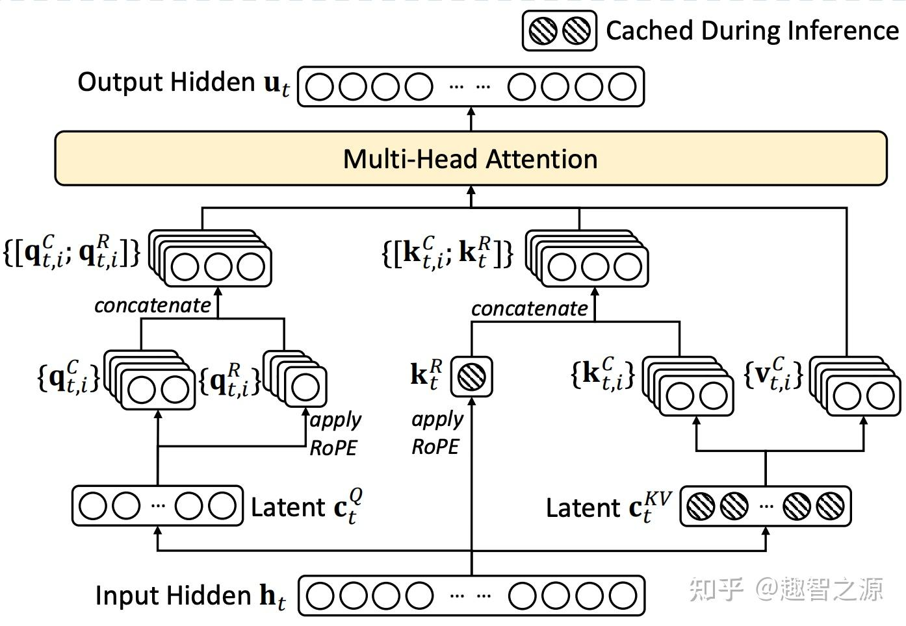
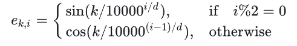
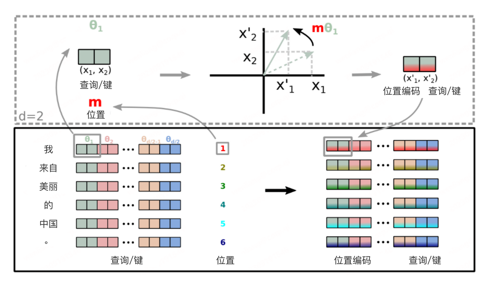
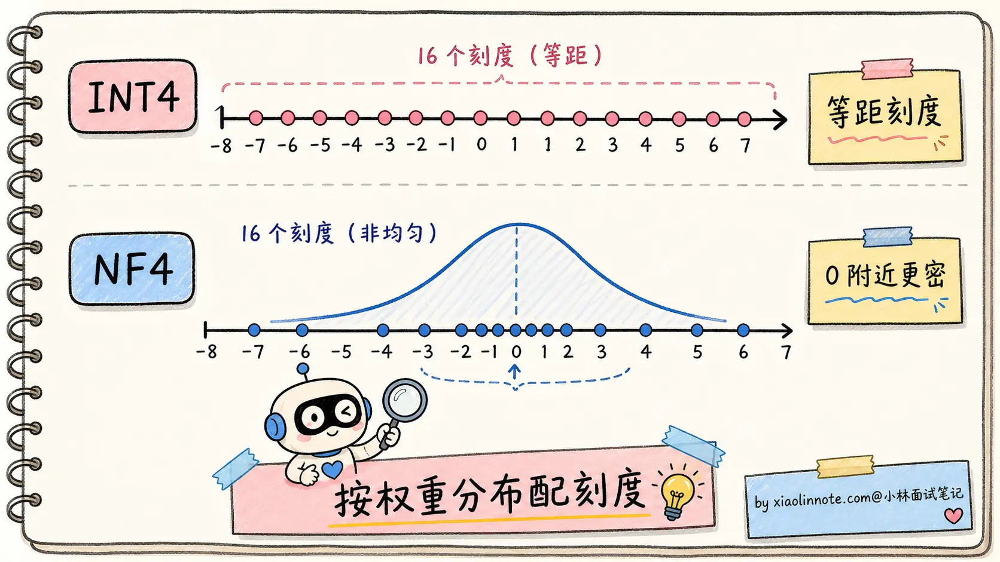

# LLM 工程面试题

# 什么是大语言模型？和传统 NLP 模型有什么区别？

我理解大语言模型的本质，是一个用**海量语料预训练、参数到百亿千亿规模、自回归生成文本的统一模型**。

它和传统 NLP 模型最根本的区别有三点。

第一，传统 NLP 是「一任务一模型」，分词、命名实体识别、情感分析、问答各训各的，每个模型只会干自己那点事；LLM 是「一个模型干所有事」，因为它在预训练阶段学的是「预测下一个 token」这件最通用的事，下游任务用 Prompt 表达就行，不用再分别训练。

第二，传统 NLP 模型是判别式的，吃一段文本输出一个标签或概率；LLM 是生成式的，吃一段文本输出更多文本，理解和生成在同一个模型里完成。

第三，也是最神奇的一点，规模到了一定程度，LLM 会「涌现」出训练目标里没有显式教过的能力，比如多步推理、上下文学习、跨语言迁移，这种「量变到质变」的现象在传统 NLP 模型上是看不到的。

## 传统 NLP

传统 NLP 的工作方式是「流水线」式的，一个完整任务要拆成好几个独立步骤，每一步用一个专门的模型来完成。这不是大家想这么干，而是当时的小模型能力有限，必须把复杂问题拆解成一个个简单的子问题，每个子问题单独训练一个模型才搞得定。

举个例子，假如你要做一个智能客服。流程大概是：

- 第一步分词，把用户的「我想退货」拆成「我 / 想 / 退货」；

- 第二步词性标注，标出「我」是代词、「退货」是动词；

- 第三步命名实体识别，找出有没有商品名、订单号；

- 第四步意图分类，判断这是「咨询」还是「投诉」；

- 第五步去知识库匹配预设答案。

光是「分词」这一步，里面就有一堆坑。中文不像英文有空格天然分隔，「南京市长江大桥」到底是「南京市/长江大桥」还是「南京/市长/江大桥」？这种歧义靠规则解决不了，必须有一个专门的分词模型来判断。而分词模型本身又依赖大量的人工标注语料，遇到训练时没见过的新词（比如「奥利给」「绝绝子」），它就懵了，这就是著名的** OOV（Out\-of\-Vocabulary，未登录词） 问题**。

每一步都有这种独立的痛点，每一步都得有自己的模型、自己的训练数据、自己的标注规范。**整个 pipeline 又长又脆，前面一步错了，后面全错**。分词错了，词性标注就错；词性错了，命名实体识别就错；最终的意图分类也跟着错。这种错误是会累积传导的，而且没法事后补救。

更糟糕的是迁移成本。换个领域（比如从客服换成医疗问答），所有模型基本都得重新训练。因为医疗领域的「实体」（药名、症状、检查项目）和电商领域的「实体」（商品、订单、品牌）完全不是一回事，原来训好的模型用不上。一个公司想做几个不同领域的 NLP 应用，等于要养几套独立的模型团队，成本极高。

**这就是 LLM 出现之前的世界，任务越细分，模型越多；模型越多，标注成本越高；标注越贵，迁移越难。整个 NLP 行业都被困在这个死循环里走不出来。**

## BERT

> Encoder\-only 结构=\>理解能力 up！
>
>

到了 2018 年，Google 推出 BERT，整个领域出现了第一次大的转折。BERT 的核心创新是**预训练 \+ 微调两阶段范式**。

- 预训练

预训练阶段，BERT 在海量无标注文本（维基百科 \+ 图书数据，约 33 亿词）上做两件事：

- 第一是 **MLM**（Masked Language Model，掩码语言模型），随机遮掉句子里 15% 的词，让模型根据上下文猜被遮的词是什么；

- 第二是 **NSP**（Next Sentence Prediction，下一句预测），给两个句子，让模型判断它们是不是连续的。这两个任务都不需要人工标注，纯靠原始文本就能训练，所以可以用海量数据。

> 后续 NSP 任务被放弃了，粒度太大，对模型而言没有提升
>
>

- 微调

经过预训练，BERT 学到了通用的语言表示能力，简单说就是「看懂文字」的能力。然后到了下游任务，只需要在 BERT 上面接一个小的「任务头」，用少量标注数据微调一下，就能在各种 NLP 任务上拿到很好的效果。这一招直接把 NLP 各项任务的 SOTA（state\-of\-the\-art，最佳表现）刷了个遍，整个领域为之一振。

但 BERT 走到一半就停了。**它解决了「特征通用」（一个 BERT 可以服务多个下游任务），但没解决「任务统一」（不同任务还是要不同的微调副本）**。原因有两个。

1. BERT 的输出是「表示」，不是「文本」。它每一层输出的是每个 token 的向量表示，要想拿来做分类，得在最后接一个分类头（全连接 \+ softmax）；要做命名实体识别，得接一个序列标注头；要做问答，得接一个抽取式 QA 头。每一种任务都需要单独设计的「头」、单独标注的数据、单独训练的过程。一个 BERT 在公司里被用起来，可能要派生出十几个微调副本，每个负责一个具体任务。

2. BERT 不擅长生成。它的预训练目标 MLM 是「填空题」，每次只猜一个被遮的词，没学过怎么连续生成长文本。所以 BERT 几乎不被用来做翻译、写作、对话这类生成任务。这一块还得交给当时另一条技术路线，比如 GPT\-2、T5。换句话说，BERT 把「理解」做到极致，但「生成」是它的短板。

## LLM 的本质：把所有任务收编成「预测下一个 token」

LLM 最根本的转变，是把所有 NLP 任务统一成了一件事，预测下一个 token。

这个训练目标叫** CLM（Causal Language Modeling，因果语言模型）**。它的训练数据格式特别简单：给一段文本，模型从左到右一个字一个字地往后猜，每一步都要预测「下一个 token 是什么」。

这种训练方式叫**自回归（Autoregressive）**，意思是「下一步的预测依赖上一步的输出」。GPT、Claude、Qwen、DeepSeek 这些主流大模型，本质都是「自回归 \+ 因果掩码」的语言模型。

> 简单来说就是 Decoder\-Only
>
>

- 翻译：Prompt 写「把下面这句翻译成英文：我喜欢你 \-\>」，LLM 接着预测下一个 token，就会输出「I like you」

- 分类：Prompt 写「下面这条评论是正面还是负面？『这家店太黑了』 \-\> 答：」，LLM 预测下一个 token 就会输出「负面」

- 总结：Prompt 写「请用一句话总结：xxxxxx \-\> 总结：」，LLM 接着写下去就是总结

- 写代码：Prompt 写「写一个 Python 函数，返回斐波那契数列前 N 项 \-\> def」，LLM 接着续写就是完整代码

### 涌现

LLM 还有一个让传统 NLP 模型望尘莫及的特点，叫涌现能力（Emergent Abilities）。

涌现的常见定义是：「某项能力在小模型上几乎看不到，规模到了某个临界点之后突然表现出来」。不过这里要留一个 caveat：有研究认为，一部分「突然出现」可能来自评测指标的离散性，比如 exact match 这种非黑即白的指标会把连续提升看成突变。所以面试里可以说「涌现是工程上能观察到的能力跃迁，但学术上对它是不是测量假象还有争议」。

为什么会涌现？业界给出的工程经验叫** Scaling Law（缩放定律）**。简单说就是模型规模、训练数据量、训练算力这三者之间存在一种可预测的关系：你把这三个量按一定比例同时放大，模型的损失值（预测错误率）会沿着一条幂律曲线下降。

所以现在的趋势是，参数堆得不一定要最大，但**数据要够多、算力要够花**。Llama 3 的 8B 模型用 15 万亿 token 训出来，效果反而比早期的 GPT\-3 175B 还好，这就是数据规模超过参数规模带来的回报。

## LLM vs 传统 NLP

这一两年所有 NLP 团队都在拥抱大模型，这不是「又出了一个新模型」，而是整个 NLP 领域的工作方式被重写了。

- 过去做一个 NLP 项目，第一件事是「数据怎么标」，第二件事是「模型选哪个 BERT 变体」，第三件事是「微调怎么调超参」。

- 现在做一个 LLM 项目，第一件事是「Prompt 怎么写」，第二件事是「需不需要 RAG 加外部知识」，第三件事是「要不要做 LoRA 微调」。

工程的着力点完全变了，先想 Prompt，再想数据，最后才考虑微调。

过去 NLP 工程师的核心技能是**词法分析、句法分析、特征工程、模型调参。**

现在 LLM 工程师的核心技能是 **Prompt Engineering、RAG 系统设计、Agent 编排、对齐微调。**

# 讲讲 Transformer 架构基本原理？Encoder 和 Decoder 是什么？

我理解 Transformer 最核心的创新是 Self\-Attention，让每个 token 都能直接和序列里任意其他位置建立联系，**一次性并行计算**，彻底解决了 RNN 顺序计算慢、长距离信息衰减的两个老问题。

理解 Encoder 和 Decoder 的区别时我用这个角度：

- Encoder 是双向的，每个词能同时看前后文，适合做「理解」类任务；

- Decoder 是单向的，只能看前面的词，天然适合「生成」任务。

至于为什么现代大模型（GPT、Claude、Qwen）都选 Decoder\-only，核心原因是「预测下一个 token」这个训练目标极其统一、可以直接在海量无标注文本上做自监督学习，规模越大涌现出的能力越强。

## RNN 缺陷

- **顺序计算，无法并行。**RNN 处理序列的方式是从左到右逐个处理每个词，第 N 步必须等第 N\-1 步计算完才能开始，无法利用 GPU 的并行计算能力。这导致训练大型 RNN 极慢。

- **长距离梯度消失。**当序列很长时（比如 1000 个词），RNN 理论上能记住早期的信息，但实践中梯度在反向传播时会指数级衰减，网络很难学习到「第 1 个词和第 800 个词之间的关系」。LSTM 通过门控机制有所缓解，但根本问题没解决。

## Self\-Attention

> 简单介绍即可，要是详细的可以网上资料搜，一搜一堆
>
>

Self\-Attention（自注意力）的核心思路是：让序列中的每个 token 都能直接关注序列中任意其他位置的 token，计算出「我和其他位置的相关程度」，然后根据相关程度加权聚合其他位置的信息。

核心公式：$Score = Softmax(\frac{Q
*K^T}{\sqrt{d_k}})*V$

输入 embedding 通过三个独立的**线性投影矩阵 **得到 Q，K，V

**最关键的一点是 Q/K/V 都是从同一个输入 X 算出来的。这就是「自注意力」里那个「自」字的含义，区别于 Encoder\-Decoder 架构里 Cross\-Attention 那种「Q 来自一边、K/V 来自另一边」的形式。**

> Scaled Dot\-Product Attention（缩放点积注意力），简单理解就是值接近方差，可以缩放，稳定训练
>
>

### Multi\-Head Attention

Multi\-Head Attention 就是把 Q/K/V 投影到多个**不同的子空间（比如 8 个或 32 个头）**，每组独立计算注意力，最后把所有头的输出拼接起来。每个头可以专注于捕捉不同类型的语言关联，整体上表达能力更强。

### 位置编码

为体现语句顺序，需要显式地给每个 token 注入位置信息，这就是位置编码。

具体的位置编码方案有 sin/cos、RoPE、ALiBi 等多种选择，每种各有不同的设计哲学和长上下文外推能力，是一个独立的研究方向。

## FFN

除了注意力层，每个 Transformer 块里还有一个前馈网络（Feed\-Forward Network），**结构是两层全连接加一个激活函数。**

FFN 对每个位置独立地做非线性变换，补充注意力层学不到的信息（注意力层本质上是线性加权，FFN 引入非线性）。研究表明 FFN 层储存了大量的「事实知识」，可以理解为模型的「记忆仓库」。

## 三种架构

理解了 Attention 的基本机制，可以解释这三种架构的区别。

- Encoder\-only（以 BERT 为代表）：每个 token 可以双向关注序列中所有其他 token（没有遮蔽）。这种双向理解能力让 Encoder 非常擅长「理解任务」，比如文本分类、命名实体识别、语义相似度计算。预训练目标是 MLM（掩码语言模型），随机遮住一些词让模型预测。

- Decoder\-only（以 GPT/Claude/Qwen 为代表）：使用因果掩码（Causal Mask），每个 token 只能关注它前面的 token，不能「提前看到」后面的内容。这种单向设计天然适合文本生成，预训练目标是「预测下一个 token」（CLM），目标统一而强大。现在几乎所有大语言模型都是这个架构。

- Encoder\-Decoder（以 T5、BART 为代表）：Encoder 双向理解输入，Decoder 单向生成输出，Decoder 通过 Cross\-Attention 读取 Encoder 的输出。这种架构适合「输入和输出是不同的文本」的任务，比如翻译、摘要、问答。但预训练目标相对复杂，超大规模训练不如 Decoder\-only 简洁。

# 多头注意力（MHA）有哪些局限？MQA、GQA、Flash Attention 怎么解决？

我理解 MHA 有三个核心痛点。

**第一是「显存爆炸」**。推理时每个 head 都要为序列里所有 token 保存自己的 K 和 V 矩阵，这就是 KV Cache。头数越多、序列越长，显存占用越夸张。一个 7B 模型跑 32K 上下文，光 KV Cache 就能吃掉十几 GB。

**第二是「访存慢」**。Attention 计算里 softmax 那步要把整个 N×N 的注意力矩阵搬来搬去，频繁读写 GPU 显存，瓶颈不在算力而在「内存带宽」。

**第三是「N² 复杂度」**。注意力分数矩阵是 N×N 的，序列翻倍计算量翻 4 倍，长上下文极其昂贵。

工业界优化有以下几个大方向：

- 结构层优化：MQA 让所有 head 共享一份 K/V，显存压到 1/H，但表达力损失明显。GQA 是折中方案：把 H 个 head 分成 G 组，每组共享一份 K/V，效果接近 MHA 但显存接近 MQA，Llama 2 70B、Llama 3、Qwen 2/3 的不少主力模型都用这个思路。

- 实现层优化：Flash Attention 是另一条思路，不改变 MHA 的结构，而是从计算实现层面把 N×N 的注意力矩阵切成小块、用 GPU 片上缓存做在线 softmax，避免反复读写大矩阵，显存从 O（N²） 降到 O（N），速度还更快。

最关键的认知是：MQA/GQA 是「结构层」的优化，Flash Attention 是「实现层」的优化，两者是叠加关系不冲突，现在的主流模型基本上都是 GQA \+ Flash Attention 一起用。

## MHA 的瓶颈

- 训练

训练时一个长度为 N 的序列，每一层 Attention 都要算一个 N×N 的注意力分数矩阵 `softmax(QK^T/√d) · V`。这个 N×N 矩阵在显存上要存下来给反向传播用，N=4K 时已经是 1600 万个数，N=32K 时膨胀到 10 亿个数（FP16 大约 2GB）；

> 1e9\*2B = 2e9B = 2GB
>
>

在计算上也是 O\(N²\) 的复杂度，N 翻倍计算量直接翻 4 倍。听起来很吓人，但好消息是训练时这个 N×N 矩阵是「一次性算完的」，不需要在多个时间步之间持续保留。

- 推理

LLM 是自回归生成，每次生成一个新 token，都要重新对前面所有 token 算注意力。如果每次都从头算，成本会飞快累加成 O\(N³\)，根本不可接受。聪明的做法是 KV Cache：把前面所有 token 的 K 和 V 矩阵存下来，每次新 token 只需要算自己的 Q，然后和缓存的 K/V 做注意力。这就是推理优化的标配。

但 KV Cache 这个救星本身就是个显存大户。粗略算一下，KV Cache 显存大小是:

> 2（K和V各一份）× B（batch）× N（序列长）× L（层数）× H（头数）× d\_k（每头维度）× 2 字节（FP16）
>
>

对一个 7B 模型（L=32、H=32、d\_k=128），跑 batch=1、N=32K：

> KV cache = 2 × 1 × 32000 × 32 × 32 × 128 × 2 ≈ 17 GB
>
> 模型权重 = 7e9 \* 2B = 14GB
>
>

光 KV Cache 就要 17GB，加上模型权重 14GB，加起来 31GB，一张 4090（24GB）根本放不下。这就是长上下文场景下的头号问题，也是面试里常被追问「KV Cache 怎么省」的根源。

显存挤爆只是一面，更隐蔽的痛点是「速度也快不起来」。原因是 GPU 计算单元（CUDA Core / Tensor Core）的算力很猛，但显存带宽跟不上。Attention 计算里大量时间花在「等数据从显存搬到计算单元」，计算单元很多时候在「等米下锅」。这就是著名的 memory\-bound（访存受限） 问题。哪怕你的 GPU 算力是另一台的两倍，跑 Attention 时速度可能只快 20%，因为瓶颈根本不在算力。

MHA综合来说：

- N² 复杂度让序列稍微长一点，计算量就按平方级膨胀；

- KV Cache 让长上下文显存爆掉；

- 访存带宽让 GPU 算力发挥不出来。

## MQA

所有 head 共享同一份 K 和 V，只有 Q 是每个 head 独立的。

好处：

- KV Cache 立刻变成 1/H：原本要存 H=32 套 K/V，现在只存 1 套，显存占用直接降到原来的 1/32。前面那个 7B 模型 32K 上下文 17GB 的 KV Cache，用 MQA 之后只剩 0\.5GB 多一点。

- 注意力公式不变：每个 head 还是各算各的注意力分数 `softmax(Q_h · K^T)`，只不过所有 head 用同一份 K，最后输出还是 H 个 head 的拼接。模型结构基本保持，训练流程几乎不用改。

代价：

- 表达能力下降。

## GQA

把 H 个 head 分成 G 组，每组内部共享一份 K/V，组之间各自独立。

好处：

- 显存上：KV Cache 从原本的 H 套压到 G 套，显存占用是 G/H 比例。比如 H=32、G=8 时，显存压到 1/4，比 MQA 的 1/32 略大但也很省。

- 表达力上：每组内部共享 K/V，组间独立，等于每组都有自己的「视角」。组数越多视角越丰富，G=8 通常已经足够保持模型效果。

- 实测效果：Meta 的 GQA 论文里，G=8 配置下，模型效果几乎和 MHA 持平（差距 \< 0\.5%），但 KV Cache 压到 1/4。

## MLA

DeepSeek V2/V3 用了另一条更激进的路线 MLA（Multi\-head Latent Attention，**多头潜在注意力**），把 K/V 压缩到一个**低秩潜在空间存储**，目标同样是压低 KV Cache，但它不是简单的 GQA 变体

MLA 的思路是：不直接共享 K/V，而是把每个 token 的 K/V 通过降维投影压缩到**低维 latent 向量**里存起来，需要时再配合额外投影参与注意力计算。这样存的不是「H 套或 G 套高维 K/V」，而是「低维压缩后的 K/V 表示」，显存比传统 MHA / GQA 更省。它和 GQA 的目标相似，都是省 KV Cache，但实现机制不同，别简单说成「GQA 的升级版」



## Flash Attention

> https://www\.bilibili\.com/video/BV1UT421k7rA/
>
>

Flash Attention 完全是另一条赛道，不改 Attention 的数学公式，从底层实现优化。

问题的根源：显存层级差距巨大

GPU 的存储分两层：

- HBM（High Bandwidth Memory，高带宽显存）：容量大（A100 是 40GB/80GB），但带宽相对慢（1\.5 TB/s）。这就是平时说的「显存」

- SRAM（Static RAM，片上缓存）：容量小（A100 每个 SM 只有 192KB），但带宽极快（19 TB/s，是 HBM 的 13 倍）

标准 Attention 的实现是这样的：

```Plain Text
# 标准实现，每一步都把大矩阵搬到 HBM 上存一次
S = Q @ K.T              # 算出 N×N 注意力分数矩阵，写回 HBM
P = softmax(S)           # 从 HBM 读 S，算 softmax，再写回 HBM
O = P @ V                # 从 HBM 读 P，算最终输出 O，再写回 HBM
```

整个过程在 HBM 上反复读写 N×N 这种大矩阵，访存时间远超实际计算时间。这就是为什么 N=4K 的注意力比 N=2K 慢 4 倍以上（理论应该是 4 倍，实际更糟），瓶颈在于 HBM 来回搬运 N² 大小的中间结果。

Flash Attention 的核心思路：分块 \+ 在线 softmax

Flash Attention 提出：既然 SRAM 带宽快但容量小，那就把 Q、K、V 切成小块（比如 128×128），每次只在 SRAM 里算一小块的注意力，算完就直接和最终输出 O 累加，不把 N×N 的中间矩阵写回 HBM。

听起来简单，但有个数学难题：softmax 操作要看「整行」才能算出来，不能局部独立计算。Flash Attention 用了一个叫「在线 softmax（online softmax）」的算法，分块计算的同时维护一个「当前最大值 \+ 累积和」的状态，每来一块就做增量更新，最终结果和一次性算 softmax 完全一样。

## Page Attention

> https://www\.bilibili\.com/video/BV1kx4y1x7bu
>
>

为了解决这个问题，该研究引入了 PagedAttention，这是一种受操作系统中虚拟内存和分页经典思想启发的注意力算法。与传统的注意力算法不同，PagedAttention 允许在非连续的内存空间中存储连续的 key 和 value 。具体来说，PagedAttention 将每个序列的 KV cache 划分为块，每个块包含固定数量 token 的键和值。在注意力计算期间，PagedAttention 内核可以有效地识别和获取这些块。

因为块在内存中不需要连续，因而可以用一种更加灵活的方式管理 key 和 value ，就像在操作系统的虚拟内存中一样：可以将块视为页面，将 token 视为字节，将序列视为进程。序列的连续逻辑块通过块表映射到非连续物理块中。物理块在生成新 token 时按需分配。

在 PagedAttention 中，内存浪费只会发生在序列的最后一个块中。这使得在实践中可以实现接近最佳的内存使用，仅浪费不到 4%。这种内存效率的提升被证明非常有用，允许系统将更多序列进行批处理，提高 GPU 使用率，显著提升吞吐量。

**PagedAttention 还有另一个关键优势 —— 高效的内存共享**。例如在并行采样中，多个输出序列是由同一个 prompt 生成的。在这种情况下，prompt 的计算和内存可以在输出序列中共享。

PagedAttention 自然地通过其块表格来启动内存共享。与进程共享物理页面的方式类似，PagedAttention 中的不同序列可以通过将它们的逻辑块映射到同一个物理块的方式来共享块。为了确保安全共享，PagedAttention 会对物理块的引用计数进行跟踪，并实现写时复制（Copy\-on\-Write）机制。

PageAttention 的内存共享大大减少了复杂采样算法的内存开销，例如并行采样和集束搜索的内存使用量降低了 55%。这可以转化为高达 2\.2 倍的吞吐量提升。这种采样方法也在 LLM 服务中变得实用起来。

PageAttention 成为了 vLLM 背后的核心技术。vLLM 是 LLM 推理和服务引擎，为各种具有高性能和易用界面的模型提供支持。

# 大模型的位置编码是干什么用的？sin/cos、RoPE、ALiBi 有什么区别？

我理解位置编码要解决的问题，本质上是 Self\-Attention 的「位置盲」缺陷。Attention 的计算是对称的，不管词序怎么变，注意力分数都一样。「我打你」和「你打我」对模型来说是一回事，所以必须显式注入位置信息。

三种主流位置编码各有不同的设计哲学。

第一种是 sin/cos 绝对位置编码（原始 Transformer 用的）。给每个位置算一组固定的 sin/cos 值，加到 token embedding 上。优点是简单、不需要训练参数；缺点是「绝对位置」太死板，模型实际关心的是「相对距离」，而且训练时见过的最长位置之外的位置（比如训练 2K，推理时上 4K），效果会断崖下跌。

第二种是 RoPE（旋转位置编码）。它不是把位置信息「加」到 embedding 上，而是「旋转」Q 和 K 向量。每个位置对应一个旋转角度，位置越靠后旋转的角度越大。两个 token 做注意力时，它们 Q/K 的点积自然带上了「相对距离」的信息。优点是相对位置直接编进了点积里、长上下文外推能力强，配合 NTK、YaRN 等扩展技巧，以及必要的继续训练或长上下文校准，可以把上下文推到更长。所以 Llama、Qwen、DeepSeek 等主流开源模型大量使用 RoPE。

第三种是 ALiBi（Attention with Linear Biases）。最简单粗暴，直接在注意力分数里加一个「距离惩罚」，离得越远扣分越多，斜率随 head 不同。优点是不引入任何可学习参数、长上下文外推天然就好；缺点是表达力弱一些，对位置的精细建模不如 RoPE。MosaicML 的 MPT、BLOOM 用过 ALiBi，但没成主流。

最关键的一句话是，主流大模型几乎全部选择了 RoPE，因为它在「相对位置编码 \+ 长上下文外推 \+ 兼容现代推理优化」三个维度上都最均衡。

## 位置编码

Self\-Attention 的核心计算是 `softmax(QK^T/√d) · V`，每个 token 通过 Q 去和所有 token 的 K 做点积、算注意力权重，然后按权重加权聚合所有 token 的 V。这个过程有一个致命特点：**它是对位置不敏感的**，也就是俗称的「位置盲」。

所以位置编码必须满足三个要求：

- 数值范围合理，不能把 token embedding 给覆盖掉

- 能区分不同位置，每个位置都有独特的「指纹」

- 能泛化到长序列，最好支持外推到训练时没见过的长度

## 绝对位置编码

分奇数偶数位置，采用不同三角函数位置编码



sin/cos 编码的优点是显而易见的：

- 零参数：完全是数学公式算出来的，不占模型参数

- 泛化性看起来不错：理论上 sin/cos 可以算到任意位置的指纹

但它的致命问题是长上下文外推能力差。

虽然理论上 sin/cos 可以算任意长度，但实际效果会在训练时见过的最长位置之外迅速恶化。如果模型只在 2K 长度上训练过，推理时给它 4K 输入，模型表现会断崖下跌。原因是模型在训练时只学过「2K 以内的相对位置关系」，超出 2K 的相对距离它从来没见过，注意力权重的分布会乱掉。

## RoPE

核心思路一句话：不把位置信息加到 embedding 上，而是旋转 Q 和 K 向量。

两个旋转后的向量做点积，结果只依赖于它们的「旋转角度差」。



再加上后来发明的 NTK Scaling、YaRN、Position Interpolation 等扩展技巧（核心都是调整 RoPE 的频率参数），可以把训练时的 2K 推到 32K、100K 甚至更长。

- Position Interpolation（PI）：把 100K 的位置「等比例缩小」到 2K 范围，比如位置 50000 当作位置 1000 处理。简单粗暴但有效，代价是「精细距离信息被压缩」

- NTK\-aware Scaling：调整 RoPE 不同维度的频率，让高频维度（精细位置）几乎不动，低频维度（粗略位置）按比例缩小。比 PI 更精细

- YaRN（Yet another RoPE extensioN）：在 NTK 基础上做了进一步精细化，引入温度参数和分段策略，目前是大厂用得最多的方案

但这里别说成「几乎无损」的银弹，外推效果取决于模型、任务、长度倍率和是否做过继续训练。推得越远，越需要专门评测长文检索、多跳推理和位置敏感任务。

## ALiBi

ALiBi（Attention with Linear Biases）是另一种相对位置编码方案，2022 年提出，思路比 RoPE 更暴力：根本不动 Q、K、V，直接在注意力分数里加一个「距离惩罚项」。

具体做法：在 `softmax(QK^T)` 这一步之前，给每对 token 的注意力分数加上一个偏置项，偏置值是 `-m × |i-j|`，其中 \|i\-j\| 是两个 token 之间的距离，m 是一个固定的斜率（每个 head 不同）。

直观理解：离得越远，注意力分数被扣得越多，模型越倾向于关注近邻的 token。每个 head 用不同的斜率，等于让不同的 head 关注不同范围的距离（有的 head 关注近邻，有的 head 关注远处）。

ALiBi 的优点：

- 零参数：和 RoPE 一样不引入可学习参数

- 极简实现：就是加一个偏置矩阵，比 RoPE 还简单

- 天然支持长上下文外推：因为距离惩罚是线性的，不存在训练截止，理论上多长都行

但 ALiBi 也有明显短板：

- 表达力弱：所有位置信息都靠「距离惩罚」这一个机制传递，对精细的位置关系（比如「主语动词宾语的语序」）建模不如 RoPE 灵活

- 过强的局部偏置：线性距离惩罚会让模型过度关注近邻，对需要捕捉长距离依赖的任务不利

# 什么是大模型项目的分词器？原理是什么？

「为什么需要它」：模型只能处理整数，不认识字符串，Tokenizer 就是把文字转成数字 ID 序列的桥梁。

原理：主流路线都是子词分词，常见实现有 BPE、SentencePiece / Unigram、WordPiece 等。

BPE 的直觉是从小单元出发，反复把出现频率最高的相邻片段合并成新 token，最终形成一个几万到十几万规模的词汇表，既能控制大小又能处理新词。

实际开发里要注意的是：API 按 token 计费而不是按字数，1000 个汉字大概对应 1000\-1500 个 token，但具体比例和模型 tokenizer 强相关，估算成本和上下文窗口用量都要用真实 tokenizer 来算。

大语言模型的本质是一个函数：输入一串整数（token ID 序列），输出下一个整数的概率分布，然后把输出的整数再查表得到对应的文字。

整个过程里模型看到的全是整数，完全不认识字符串。Tokenizer 就是连接人类文字和模型整数世界的桥梁，做两件事：编码（文本 \-\> token ID 序列）和解码（token ID 序列 \-\> 文本）。

## 传统方案

**第一种是字符级分词，**每个字母或汉字算一个 token。这种方案词汇表很小（英文才 26 个字母加标点），但序列会变得非常长。一个简单的「hello」就变成 5 个 token，正常一篇文章能膨胀到几千上万个 token，让 Attention 机制的计算量（O\(N²\)）大幅飙升。而且字符本身携带的语义信息太少，模型要从一堆离散字符里重新学出「单词」的概念，效率极低。

**第二种是词级分词，**每个完整单词算一个 token。这种方式对英文这种有空格分隔的语言可以做到，但词汇表会膨胀到几十万甚至几百万，因为英文里光是「cat / cats / catting / catty」这种变形就要分别存。更严重的问题是 OOV（Out\-of\-Vocabulary，未登录词）：遇到训练时没见过的新词（专有名词、网络用语、拼写错误）就直接无法处理，模型只能输出一个「未知词」标记，相当于这个词的语义完全丢失。中文情况更糟，词级分词意味着要先做中文分词（哪些字组成一个词），分词错了下游全错。

字符级太碎，词级太散，子词分词就是这两者中间的甜蜜点。它做的是「subword（子词）」级别的分词，既控制了词汇表大小，又能处理新词，同时保留了比字符更多的语义信息。BPE 是最常见的一类，但不是唯一方案，很多模型也会用 SentencePiece / Unigram 或 WordPiece。

## BPE

BPE（Byte Pair Encoding，字节对编码）的原理其实很简单，分三步。

- 第一步，初始化：把训练语料里所有文本拆成最小单元（通常是单个字节或字符），每个字符就是一个基础 token，形成初始词汇表。

- 第二步，反复合并：统计语料中所有相邻 token pair 的出现频率，找到频率最高的那对，比如 「t」和「h」经常在一起，就把它们合并成新 token「th」，加入词汇表，同时更新语料中的所有「t」「h」相邻位置为「th」。然后继续找下一个最高频的 pair，比如「th」和「e」合并成「the」。每轮合并产生一条合并规则，同时词汇表增加一个新 token。

- 第三步，重复直到词汇表达到预设大小（比如 GPT\-2 用了 50257，Llama 3 用了 128000）。

## 中文分词

中文没有空格分隔词语，BPE 面对中文的处理方式和英文不同。

在大多数主流模型的词汇表里，常用汉字会直接作为独立 token 存在（因为每个汉字出现频率足够高，不需要拆分）。常见的中文词语（比如「人工智能」）可能会被合并成单个 token，也可能是「人工」\+「智能」两个 token，具体取决于训练数据里的频率。

实践中估算的经验规则是：1000 个汉字大约对应 1000\-1500 个 token（汉字 token 化效率略低于英文，因为英文合并词会覆盖更多字符）。但这只是粗估，Qwen、Llama、OpenAI、Claude 的 tokenizer 都不一样，中文、英文、代码、表格混在一起时比例会明显变化，正式算成本前一定要用目标模型的 tokenizer 跑一遍。

## 特殊Token

Tokenizer 里还有一些特殊 token，它们不是来自文本，而是用来给模型传递结构信息的。

- BOS（Beginning of Sequence）标记序列开始；

- EOS（End of Sequence）标记序列结束，模型生成到 EOS 时停止输出；

- PAD（Padding）用于批量处理时对齐不同长度的序列；

- SEP（Separator）用于分隔不同部分（比如对话里区分系统消息和用户消息）；

- 在 ChatML 格式里，`<|im_start|>` 和 `<|im_end|>` 这类特殊 token 用来区分对话轮次和角色。

模型对这些特殊 token 有特殊的「意识」，它们的 embedding 在训练中被专门优化，所以模型能根据这些信号理解对话的结构。了解了 Tokenizer 的原理，来看它在实际工程里会带来哪些具体影响。

## 实际意义

- API 成本估算。主流 LLM API 都是按 token 计费的，不是按字数。1000 汉字大约对应 1000\-1500 tokens，1000 个英文单词大约 1300 tokens，代码的话效率更低（一些标点、缩进会单独成 token）。但这些都只是经验值，要预估费用，必须用目标模型的 tokenizer 数出来，不能只用字数拍脑袋。

- 上下文窗口管理。每个模型有最大 token 限制（比如 Claude 200K、Qwen 128K），你需要确保输入不超限。但字数和 token 数的比例取决于语言和内容类型，中文 \+ 代码混合内容很容易让你以为「才 5 万字应该不超」，实际算成 token 已经 8 万了。这种「直觉和实际不符」是新人的常见踩坑。

- 避免截断重要信息。如果你的文档恰好卡在上下文限制边缘，Tokenizer 可能会把一个词从中间硬切开（比如「人工智能」可能被截断成「人工」\+ 半个「智」字），导致下游解析或检索失败。这种边界情况一定要在工程上处理，比如保留几百 token 的安全 buffer

# 大模型是怎么训练出来的？

大模型训练通常分三个阶段：

- 第一阶段是“预训练（Pretraining）”，使用海量文本数据基于 Transformer 做 next token prediction，让模型学习语言规律、世界知识和推理能力；

- 第二阶段是“监督微调（SFT）”，通过人工构造的指令问答数据训练模型，让它学会按照人类要求进行对话、遵循指令和稳定输出；

- 第三阶段是“对齐优化（RLHF/DPO）”，基于人类偏好进一步优化模型输出，使回答更加有帮助、安全、符合人类价值观，其中 RLHF 使用强化学习，DPO 是现在更常见、更稳定的偏好优化方法。

## 对齐

对齐（Alignment）的目标是让模型的行为更符合人类的价值观和偏好。

举个例子。同一个问题「怎么学好 Python」，可以有很多种「合格」的回答。有的简洁、有的详细、有的带代码示例、有的纯文字、有的承认「我不熟悉这块」、有的硬装专家胡说。SFT 只教会了模型「这种格式叫合格回答」，但没告诉它「哪种回答用户更喜欢」。对齐就是补这一课。

对齐的主流方法是 RLHF（Reinforcement Learning from Human Feedback，基于人类反馈的强化学习），OpenAI 在 InstructGPT 里首次引入。

它的流程是这样的。先让人类标注员对同一个问题的多个回答做排序（A 比 B 好、B 比 C 好），收集大量这种「偏好排序」数据。然后用这些数据**训一个独立的「奖励模型」**，让它学会自动给回答打分（代替人类，因为人类标注太慢太贵）。最后用**强化学习算法（PPO）调整大模型的参数**，让它生成的回答尽量得高分。

RLHF 听起来挺合理，但工程上很难。流程长、要同时维护好几个模型、训练不稳定。一不小心模型会学会「钻空子」，讨好奖励模型而不是真的变好，业内叫**「奖励 Hacking」**。能驾驭 RLHF 的团队在业界凤毛麟角。

后来斯坦福提出了** DPO**（Direct Preference Optimization，直接偏好优化），把对齐流程大幅简化。它发现 RLHF 的优化目标可以用数学等价的方式改写成**纯监督学习**，不需要奖励模型，也不需要 PPO。**直接拿（问题，好回答，差回答）三元组训练**，让模型学会「好回答的概率要比差回答提升得多」就行。

DPO 训练简单、稳定、容易实现，很多开源 Instruct 模型会把它作为偏好对齐方案之一。但这里要注意别把所有模型都说成 DPO 训出来的。比如 Llama 2\-Chat 公开论文里的主线是 SFT、拒绝采样和 PPO/RLHF，并不是 DPO；Llama 3 系列则使用了更复杂的多阶段 post\-training。面试里说「DPO 是开源社区常见方案」可以，说「Llama 2 都是 DPO」就不严谨了。

# 什么是 Scaling Law？大模型的「涌现能力」是怎么回事？

我理解 Scaling Law（缩放定律）讲的是大模型的损失值如何随模型规模、训练数据量、训练算力这三个量变化的可预测关系。OpenAI 在 2020 年提出，DeepMind 在 2022 年的 Chinchilla 论文里精修。

核心发现是三个。

- 第一，损失值随这三个量按幂律下降（loss ∝ N^\-α，N 是规模）。意思是规模翻倍，损失值按可预测的比例下降，没有「饱和点」。

- 第二，参数和数据要按一定比例配。Chinchilla 给的最优比例是 1:20（每个参数配 20 tokens）。GPT\-3 175B 用 300B tokens 是「严重欠训」，比例只有 1:1\.7；DeepMind 训了一个 70B 模型配 1\.4T tokens（1:20），反而超过了 GPT\-3 和自家更大的 280B Gopher。

- 第三，Llama 3 这类后续模型用了远高于 1:20 的训练 token，效果继续提升。更准确地说，Chinchilla 的 1:20 是「固定训练算力下的 compute\-optimal 配比」，不是「数据再多就一定没用」的上限。后来的小模型大量喂数据，很多时候是在用更多训练计算换更低的推理成本。

涌现能力（Emergent Abilities） 是 Scaling Law 的一个特殊副产物。当模型规模超过某个临界值（典型是 50B\-100B 参数），某些能力会从「完全不能」突变到「能做」：多步推理、上下文学习、跨语言迁移、代码理解等。

但要注意 2023 年斯坦福的 Mirage 论文挑战了「涌现」的定义。他们认为很多涌现现象只是「评估指标的不连续性」造成的测量假象，换成连续指标后曲线就平滑了。学术争议还在继续，但工程层面，模型规模带来的能力跃迁是客观存在的。

对工程选型的启发是：不是越大越好，要看「参数 × 数据 × 算力」三者的最优搭配；数据规模可能比参数规模更值得加大（Llama 3 8B 用 15T tokens 跑赢 GPT\-3 175B 就是例证）；同样算力下，按 Chinchilla 比例训出来的小模型，可能比胡乱堆参数的大模型还强。

## Scaling Law

模型的损失值（loss）随模型参数 N、训练数据量 D、训练算力 C 这三个量按幂律下降。

$loss(N) ≈ (\frac{N_c}{N})^{α_N}$

直观理解就是：模型规模翻倍，损失值按一个固定比例下降，而且这个比例可以提前算出来。

- 第一，它是可预测的。不是「试试看运气」，而是「我现在有 X 算力，按 Scaling Law 算一下，最终能达到什么 loss」。这给了大公司投资大模型的底气，因为可以预测投入产出比。

- 第二，它没有看到饱和点。论文里把规模一直加大到当时能训的极限，loss 还在按幂律下降，没有「再加就不动了」的拐点。这给业界传递了一个信号：继续加大规模就还能继续提升。

- 第三，算力、数据、参数都可以独立做幂律分析。也就是说，可以分别问「我加倍参数能下降多少 loss」「我加倍数据能下降多少 loss」「我加倍算力能下降多少 loss」。这为后来的 Chinchilla 把这三个变量联立起来打下了基础。

但 OpenAI 这版 Scaling Law 有一个隐含的问题：它没回答**「参数和数据应该按什么比例配」**。当时业界的普遍做法是「能加多少参数加多少，数据用差不多就行」。结果训出了一批「严重欠训」的大模型，最典型的就是 GPT\-3。

## Chinchilla 2022：参数和数据要按 1:20 的比例配

Chinchilla 缩放定律，把 OpenAI 的 Scaling Law 精修了一步。

DeepMind 做了一个相当壕的实验：训了 400 个不同规模的 Transformer 模型，参数从 70M 到 16B，数据量从 5B tokens 到 500B tokens，全部跑完拟合损失曲面。

实验结果很清晰：**给定固定的训练算力 C，参数和数据要按接近 1:20 的比例配，最终损失更低。**换句话说，参数 N 每加倍，数据 D 也要按比例加倍，经验上大约是「每个参数配 20 个 token」。**这个 1:20 不是自然常数，而是 Chinchilla 实验条件下拟合出来的 compute\-optimal 经验点**，但它把业界从「只堆参数」拉回了「参数和数据要均衡」。

Chinchilla 改变了整个大模型行业。2022 年之后训的所有主流模型，**配比都比之前激进得多**。比如 LLaMA 1 的 7B 模型用了 1T tokens（比例 1:140），LLaMA 2 的 7B 用了 2T tokens（1:285），都远超 Chinchilla 推荐的 1:20。越来越多模型主动「过量」喂数据，因为 Chinchilla 让大家意识到：参数加得没那么疯也行，数据要喂够才是关键。

## Llama3

2024 年 Meta 训 Llama 3 时，做了一件激进的事：把数据量推到 1:1875 的极端配比。

具体数据：

```Plain Text
Llama 3 8B: 8B 参数 / 15T tokens = 1 : 1875
（Chinchilla 推荐: 1 : 20）
```

数据规模是 Chinchilla 推荐的 94 倍。按当时的常识，应该早就过拟合或者收益递减了。但 Meta 实测发现：**模型在数据量从 1T 推到 15T 的过程中，loss 一直在稳定下降，效果一直在提升。**

最后训出来的 Llama 3 8B 在多项基准测试上超过了 GPT\-3 175B。一个 8B 的小模型打赢了 22 倍参数的大模型，靠的就是数据规模。

这件事重新定义了业界对 Scaling Law 的理解。原来的 **Chinchilla 1:20 配比不是「数据上限」**，而是**「给定训练算力时，参数和数据怎么分配更划算」**的经验答案。如果你愿意投入更多训练计算，继续喂更多高质量 token，loss 仍然可能下降，只是边际收益会变小。

所以更准确的说法是：

- Chinchilla 告诉我们「别只堆参数，数据也要跟上」；

- Llama 3 之后的趋势告诉我们「为了**降低推理成本**，可以训练一个较小参数、更多 token 的模型」

这两句话不矛盾，只是**在优化不同目标，一个偏训练算力最优，一个偏部署成本最优。**

Qwen3\-0\.6B 把这个趋势推到了更极端，用 36T tokens 训一个 0\.6B 的小模型，比例 1:60000，远超 Llama 3 的 1:1875。这说明在追求「推理时性能 / 部署成本」最优的方向上，「小参数 \+ 海量数据」已经是当前最热门的路径。

为什么会出现这个趋势？背后有两个很现实的工程原因。

- 第一是推理成本：参数越多，推理时显存和延迟越高。一个 8B 模型部署一台消费级 GPU 就够，175B 模型要好几台 H100，成本天差地别。如果 8B \+ 大数据能达到同等效果，何乐不为？

- 第二是数据相对便宜：算力是真金白银的硬件投入（一张 H100 三万美元，集群上千万），数据虽然也要花钱清洗，但相比 GPU 集群仍然便宜得多。在算力受限的环境下，把算力多花在「跑过更多数据」而不是「跑过更多参数」更划算。

## 涌现

Scaling Law 还有一个让所有人都没想到的副产物，叫涌现能力（Emergent Abilities）。

涌现的精确定义是：「某项能力在小模型上完全看不到，规模超过某个临界点之后突然出现」。它不是平滑上升，而是一条「先趴在地上、到某个点垂直冲天」的折线。

具体能力：

- 多步算术能力

- 上下文学习

- 跨语言泛化

### Mirage挑战

很多「涌现」能力只在某些评估指标下才出现，换个指标就消失了。

多数评价指标是一个离散的二元指标，要么 0 要么 1。在这个指标下，看到的就是「小模型一直 0 分，大模型突然跳到 60%」的涌现曲线。

但如果换成「部分正确率」（比如答对了前 4 步算 0\.8 分），同样的实验数据，能力提升曲线就变成了平滑的对数曲线，没有任何突变。

论文的核心论点是：「涌现」可能不是模型本身的非线性特性，而是评估指标的不连续性放大了一个本来连续的能力提升过程。

这个挑战引发了广泛讨论。后续也有论文反驳，认为某些涌现现象在多种连续指标下都能观察到，不能完全用「指标假象」解释。学术争议还在继续，目前的中立结论是：

- 能力跃迁是客观存在的：从工程效果看，模型规模到了 100B 之后，确实能做小模型完全做不了的事

- 但「涌现」这个概念可能被过度神化了：很多所谓的「突变」其实是连续提升 \+ 指标放大效应

- 不存在「魔法的涌现规模」：不同任务的临界点不同，有的早有的晚，没有统一的「100B 之后必然涌现」

这个争议对面试来说很有用。如果你能在面试里指出 Mirage 论文的存在，并把双方观点都讲清楚，会显得你真的看过论文。

## 启发

理解了 Scaling Law 和涌现的内核，对实际工程选型有几个直接启发：

1. 不是越大越好，要看 Chinchilla 比例

参数和数据要匹配，至少不能出现「参数很大但数据很少」的欠训状态。1:20 可以作为理解 Chinchilla 的标尺，但不是所有模型都必须卡死在这个比例。选型时更应该问：这个模型是不是训练充分？数据质量怎么样？它是为训练算力最优设计，还是为推理成本最优设计？

2. 数据规模可能比参数规模更值得加大

如果你有限的算力是 X，与其训一个 7B \+ 100B tokens 的模型，不如训 3B \+ 250B tokens。同样的算力开销，后者效果通常更好，推理还便宜。Llama 3 和 Qwen3 都验证了这个直觉。

3. 推理成本和参数规模强相关

部署一个 175B 模型要好几台 H100，部署 8B 模型一张消费级 GPU 就够。在效果差不多的前提下，「小参数 \+ 海量数据」的模型在推理成本上有天然优势。这也是为什么 2024 年之后开源社区疯狂做小模型大数据。

4. 涌现能力对模型选型的影响

如果你的任务依赖「涌现能力」（多步推理、ICL、跨语言迁移），最低门槛是 30B\-70B 这个量级，再往下就不行。如果是简单分类、抽取、摘要任务，7B\-13B 完全够用，没必要硬上大模型。

## Scaling Law 的未来

- **数据见底（数据墙）**

互联网上高质量公开文本的总量是有限的，估计在 10T\-50T tokens 这个量级。Llama 3 已经用了 15T，Qwen3 用了 36T，再过几年就会把人类历史上所有公开文本都用完。这就是「数据墙（Data Wall）」问题。

应对方向有三个：

- 合成数据：用强模型生成训练数据训弱模型（DeepSeek\-Math、Qwen2\.5\-Math 都用了大量合成数据）

- 多模态数据：扩展到图像、视频、音频，把人类所有形式的信号都纳入训练

- 强化学习数据：用环境交互生成数据（DeepSeek R1 的 RL 训练就属于这一类）

- **算力增长放缓（算力墙）**

摩尔定律已经接近物理极限，GPU 算力的增长速度在放缓。能买得起 10 万张 H100 的玩家就那么几个，进一步堆参数的边际成本越来越高。

# 大模型微调的方案有哪些？

方案上，LoRA/QLoRA 是最常用的，因为它只训练一小部分参数，普通 GPU 上就能跑，不需要全量更新所有权重；SFT 是微调的目标形式，让模型从续写模式变成指令回答模式；有偏好对齐需求的话，DPO 比 RLHF 简单得多、效果也不差。选模型不是看谁排行榜最高，选微调方案也是同理，核心是看资源约束和实际需求。

不过工程上需要意识到的是：微调不是首选，而是最后手段。大多数问题先把 Prompt 写好、加 Few\-shot 示例，或者用 RAG 接外部知识，基本都能解决。

真正需要微调的场景是：**模型需要以特定风格持续输出、需要学会稳定的任务格式、或者需要大幅降低成本用小模型替代大模型。**

## 什么时候需要微调？

**微调是最后手段，不是第一选择。**

为什么？因为微调的成本远比想象大。需要准备：

- 高质量数据集（光是标注就可能花几万到几十万）

- GPU 资源（少说几张 A100）

- 工程经验（调参、防过拟合、防灾难性遗忘）

- 维护成本，底层基础模型一升级，你之前微调的版本基本就废了，得重新微调一遍。

那什么时候才该上微调？我自己总结的判断标准是这样的。

- 模型回答特定格式：先试 Prompt \+ Few\-shot，写清楚格式要求 \+ 给 3\-5 个示例，大模型基本能搞定。

> 个人想法：如果特定格式可以拆分，可以使用function calling的格式返回
>
>

- 模型回答特定风格：System Prompt 描述风格 \+ 几个对话示例，多数情况也能行。

- 模型懂领域知识：先试 RAG（检索增强），把领域知识库挂上让模型实时查，比硬塞进参数里灵活得多。

只有当上面这些都试过、效果还是不达标的时候，才认真考虑微调。具体来说，下面三种场景微调才是真的值得做：

- 第一种是模型需要持续以一种特殊风格输出（Prompt 控制不住，比如生成特定格式的代码、特定语气的文案）

- 第二种是需要模型稳定掌握某类任务模式或内部术语表达

- 第三种是想用小模型替代大模型省成本（用 7B 微调模型替代 70B 通用模型，推理成本能省很多）。

这里要特别提醒：如果需求是「补充经常变化的事实知识」，微调通常不是好选择。比如产品价格、政策条款、库存状态、合同原文，这些内容应该放进 RAG 或数据库里实时查。微调更适合学行为、格式、风格和任务模式，不适合当一个会频繁更新的知识库。

## 微调的两个正交维度

- 一是「改哪些参数」。

模型有几十亿到几百亿参数，你是要全部改，还是只改一小部分？这一维度上有三个主流方案：**全量微调（全改）、LoRA（改一小部分）、QLoRA（改一小部分 \+ 量化基础模型）。**

- 二是「学什么目标」。

模型要学的是「按指令回答」还是「学会哪种回答更好」？这一维度上有两个主流方案：SFT（学指令格式）、DPO（学偏好对齐）。

这两个维度是正交的，可以任意组合。比如：

- 用全量微调做 SFT

- 用 LoRA 做 SFT

- 用 QLoRA 做 SFT

- 用 LoRA 做 DPO

- 用 QLoRA 做 DPO

每种组合都是合法的「微调方案」。理解这两个维度的正交关系，是回答这道题的钥匙。

### 参数角度

1. 全量微调（Full Fine\-tuning）：所有参数都改

但代价大到吓人。一个 7B 模型的全量微调，不光要存权重本身（FP16 大约 14GB），还要存梯度（14GB）、优化器状态（Adam 的两个矩约 56GB），加起来一次训练 80GB 起步，普通研究者根本玩不动。70B 的模型更夸张，要几十张 A100 组集群才能训。

2. LoRA

真正有意义的变化只发生在一个低维子空间里。换句话说，权重的更新具有**「内在低秩性」**，不需要每个维度都去改。基于这个洞见，LoRA 的做法是：冻结原始权重 W 不动，在 W 旁边新增两个小矩阵 A 和 B（维度分别是 d×r 和 r×d，其中 r 远小于 d，通常 r=8 或 16），训练时只更新这两个小矩阵。推理时把 B·A 加回到 W 上，等价于一个全量微调过的模型，但训练时显存和算力开销是全量微调的几十分之一。

3. QLoRA

QLoRA 的核心思路是：先把基础模型用 4\-bit 量化（一种叫 NF4 的格式，专为模型权重的近似高斯分布设计），把 7B 模型的显存占用从 14GB 压到 4GB 左右；然后在量化后的基础模型上套 LoRA。这样整个微调过程的显存占用降到 10GB 以内，一张 4090（24GB）就能微调 7B 甚至 13B 模型。

### 目标角度

1. STF：有监督微调

让模型学会「按指令回答」，它的训练数据格式是 \(指令，期望回答\) 的对。

SFT 是一个「目标」，不是「方法」。具体怎么实现？可以用全量微调做 SFT、可以用 LoRA 做 SFT、也可以用 QLoRA 做 SFT。在工业界最常见的组合是 QLoRA \+ SFT 数据，性价比最高。

2. DPO：直接偏好学习

让模型学会「哪种回答更受欢迎」

早期做偏好对齐的标配方案是 RLHF（Reinforcement Learning from Human Feedback），流程是：收集人类偏好数据 → 训一个奖励模型 → 用 PPO 算法优化主模型。但 RLHF 流程长、要同时维护好几个模型、训练不稳定，能驾驭它的团队不多。

DPO 是斯坦福 2023 年提出的简化方案。它发现一个数学上的等价转换：RLHF 的优化目标可以推导成纯监督学习的损失函数，完全绕过奖励模型，也不需要 PPO。直接拿 \(问题，好回答，差回答\) 三元组训练，让模型直接学会「好回答的概率要比差回答提升得多」。

DPO 也是一个「目标」，不是「方法」。它可以用全量微调实现，也可以用 LoRA 实现。最常见的工业组合是 LoRA \+ DPO，资源友好。

# 请讲一下 LoRA 技术，除了减少参数量，它还有哪些优点？

LoRA 我在项目里用过，省参数这个优点大家都知道，但它还有几个很实用的好处。

- 第一个是推理零开销，训练完之后，LoRA 的 A、B 两个小矩阵可以直接合并回原始权重，推理阶段完全不需要带额外模块，速度和原始模型一样，这比 Adapter 方案有明显优势。

- 第二个是部署特别灵活，一个 7B 基础模型才 14GB，每套 LoRA 只有几十 MB，可以同时维护客服、代码、翻译几套 LoRA，按请求类型热切换，不需要为每个场景各跑一个完整模型。

- 第三个是灾难性遗忘风险更低，因为原始权重全程冻结，只有旁路的小矩阵在学习，相当于在原来知识旁边打补丁，通用能力通常更容易保住。

- 第四个是训练更稳定，可训练参数少，梯度空间小，对学习率这类超参不那么敏感，调参成本低。

- 还有一个进阶的点是多个 LoRA 可以加权混合，比如把指令遵循 LoRA 和代码 LoRA 合并一下，不用重新训练就能融合两种能力。

> 主要还是从训练和推理两个角度分析
>
>

## 优点解析

1. 参数量减少

- 原始更新矩阵（d=4096）：4096 × 4096 = 约 1677 万参数

- LoRA r=16：4096×16（矩阵 A）\+ 16×4096（矩阵 B）= 约 13\.1 万参数，减少了约 128 倍

放到整个 7B 模型上：全部可训练参数约 70 亿，用 LoRA 微调后只剩约 2000 万可训练参数，不到原来的 0\.3%。显存需求从 80GB\+ 直接降到了普通 GPU 可以接受的范围。

参数少只是第一步，LoRA 还带来了几个连锁的好处，理解了它「原始权重冻结 \+ 旁路小矩阵」的数学结构，这些优点都是自然推论出来的。

2. 推理0开销：可以通过融合权重矩阵，实现推理0开销

3. 部署灵活：基座模型不改变，只需要替换RoLA矩阵即可完成

4. 灾难性遗忘风险更低：因为参数量更小，通用能力通常更容易保住

5. 训练更稳定

6. 不同LoRA加权混合

数学上，合并两个 LoRA 非常简单。假设有一个指令遵循 LoRA（A₁, B₁）和一个代码生成 LoRA（A₂, B₂），同时使用时：

```Plain Text
W' = W + α₁ * (B₁ · A₁) + α₂ * (B₂ · A₂)
```

调整 α₁ 和 α₂ 的比例，就可以调整两种能力的「配比」。在代码里，PEFT 库支持同时加载多个 LoRA：

```Python
from peft import PeftModel

# 加载第一个 LoRA（指令遵循能力）
model = PeftModel.from_pretrained(base_model, "instruction_lora")

# 再加载第二个 LoRA（代码生成能力）
model.load_adapter("coding_lora", adapter_name="coding")

# 同时激活两个 LoRA，两套权重叠加生效
model.set_adapter(["default", "coding"])
```

这种技术被称为 LoRA Merging，是 Model Merging（模型融合）领域的重要方向。它的实际意义是：如果你分别微调了「擅长写代码的 LoRA」和「擅长遵循指令的 LoRA」，可以直接混合两者，得到「擅长写代码且遵循指令」的效果，不用专门为这个组合再收集数据、重新训练，大大节省了开发成本。

# 大模型生成文本时的解码策略有哪些？贪心、Beam Search、采样分别什么时候用？

我理解大模型的解码策略本质上是回答一个问题：模型在每一步输出了一个 vocabulary 大小的概率分布，我们怎么从中选下一个 token？

主流方案分两大类。

第一类是确定性策略，输入相同输出永远相同。

- 贪心解码（Greedy Decoding）：每一步选概率最高的 token。简单、可复现，但容易重复啰嗦、缺乏多样性

- Beam Search：每一步保留 Top\-B 条候选路径（B=4、8 等），最后选总概率最高的整条序列。比贪心更接近全局最优，但对生成式任务有「天然缺陷」

第二类是随机性策略，引入随机性让输出有多样性。

- Temperature 采样：通过缩放概率分布的「锐度」，控制随机性强度。Temperature 越低越确定，越高越发散

- Top\-K 采样：每步只从概率最高的 K 个 token 里采样，截断长尾

- Top\-P（Nucleus）采样：每步累加概率到 P 为止，从这个「核」里采样，自适应截断

这两大类的核心区别是，确定性策略保证质量但牺牲多样性；随机性策略保证多样性但每次输出不同。

LLM 工程实践里有个反直觉的现象：Beam Search 在大模型时代基本被弃用了。原因是 Beam Search 优化的是「整体序列概率最高」，但生成式任务（聊天、写作、推理）没有「单一最优答案」，Beam Search 给出的「最高概率序列」往往是「最 boring 的回答」，多样性差还容易陷入复读循环。

所以现在的 LLM API 通常都会提供 Temperature \+ Top\-P 这类采样参数，但默认值各家不完全一样，有的默认更稳定，有的默认更开放。更稳的工程表达是：精确任务（代码、数学、信息抽取）用 Temperature=0 或低温来提高可复现性；对话/创意任务用较高 Temperature 配合 Top\-P 平衡多样性和质量。

## 解码策略

不同的解码策略就是不同的「选择规则」。规则的差异不只是「选哪个」，更深层是对生成任务本质的不同假设：

- 贪心和 Beam Search 假设「存在一个唯一最优答案」，目标是找到它

- Temperature/Top\-K/Top\-P 假设「答案有多种合理可能」，目标是从可能空间里采样

## 贪心解码

贪心解码（Greedy Decoding）是最朴素的策略：每一步无脑选概率最高的那个 token，然后这个 token 拼到序列后面，进入下一步。

贪心解码的优点：

- 极简：每步只挑最大值，时间复杂度 O\(V\)，几乎没开销

- 完全确定：相同输入永远得到相同输出，便于调试和复现

- 不引入随机性：API 调用结果稳定，对单元测试、批处理友好

但贪心有一个臭名昭著的毛病，叫「复读机问题（Repetition Loop）」。

举个具体例子。让 GPT\-2 用贪心解码续写「I love my dog because」，常见的输出会是这样：

```Plain Text
I love my dog because he is so cute. He is so cute. He is so cute. He is so cute. ...
```

为什么会这样？因为模型某一步生成了「He is so cute」，下一步在概率分布里发现「He is so cute」这个模式刚刚出现过、上下文里这个模式的概率很高，又选了它；再下一步又选了一遍。贪心策略一旦走进这种「自我加强的循环」，就出不来了，会一直无限重复。

更隐蔽的问题是，贪心解码生成的文本乏味、保守、缺乏惊喜。因为模型每步都选最稳的那条路，最终生成的文本就是「最大众化的表达」，读起来很 boring。这对代码生成、信息抽取这类任务可能没问题，但对创意写作、对话场景就太单调了。

不过贪心也有它的最佳战场：精确任务。比如**代码生成、SQL 生成、JSON 抽取这种「输出有标准答案」的任务**，贪心反而是首选，因为它确定、不会乱写。

## Beam Search

Beam Search 是贪心的扩展版本，思路是：每一步不只保留一条路径，而是保留 B 条最高概率的路径同时推进（B 叫「束宽」beam width，典型 B=4 或 B=8）。

**具体怎么做？看个例子，假设 B=3：**

- 第 1 步：模型预测下一个 token 的概率分布，保留前 3 个：「我」「你」「他」

- 第 2 步：把这 3 个 token 各自当作前缀继续预测，得到 3×V 个候选（V 是 vocabulary 大小），从中挑总概率最高的 3 条路径，可能是「我喜」「我爱」「你爱」

- 第 3 步：重复上述过程，3 个前缀各自展开，挑总概率最高的 3 条

- ……一直进行到生成结束（遇到 EOS token）

- 最后从 3 条最终路径里选整体概率乘积最高的那条作为输出

Beam Search 的优点：

- 全局视野更好：能避开贪心走进死胡同的情况。比如某一步贪心选错了，Beam Search 还有其他 B\-1 条备份路径可以走

- 接近全局最优：总体概率上比贪心高得多，输出更「合理」

Beam Search 在 2014\-2018 年的机器翻译时代是绝对主流，几乎所有翻译模型（Google NMT、Facebook fairseq、OpenNMT）都用 Beam Search。原因是翻译任务有一个独特属性：给定源语言句子，存在一个或几个「最优译文」，Beam Search 的「找概率最高序列」目标和翻译任务高度匹配。

### 被弃用的原因

这是一个面试里的高频追问点。**表面理由是「Beam Search 慢」（B 倍计算量），但深层原因是生成式任务的本质和 Beam Search 的目标不匹配。**

Beam Search 的优化目标是「找到整体概率最高的那条序列」。这个目标在翻译时代很合理，因为「I love you \-\> 我爱你」这种翻译任务确实有「最优答案」。但在 LLM 的开放式生成任务（写故事、对话、回答开放问题）里，根本不存在「最优答案」，存在的只是「一个广阔的合理回答空间」。

更糟的是，Beam Search 在长序列上有一个反直觉的失效模式：**它会输出最 boring、最重复的内容。**

为什么？因为「整体概率最高」往往等价于「每一步都选最稳的词」。最稳的词通常是「重复前面已经出现过的内容」，因为**重复内容在概率分布上特别尖锐（模型对重复模式特别熟悉）**。结果就是 Beam Search 在生成长文本时，会陷入和贪心类似的复读，甚至比贪心还严重。

实测过 LLM Beam Search 的人会发现，**B 越大，输出越保守乏味，**B=8 比 B=4 还差。这就是有名的「Beam Search 困境（Beam Search Curse）」。

还有一个工程上的硬伤：**Beam Search 和现代 LLM 推理优化不兼容。**

KV Cache 假设序列是「单一前缀往下生成」，Beam Search 要同时维护 B 条不同前缀，KV Cache 要复制 B 份，显存爆炸。Flash Attention、PagedAttention 这些优化也是为单序列设计的，Beam Search 改起来很麻烦。

所以现在主流的 LLM 推理框架（vLLM、SGLang、TGI）虽然大多支持 Beam Search，但默认通常不开，开放式对话和写作场景也很少优先用它。更准确地说，Beam Search 不是彻底没用，而是从「默认主角」退回了「特定任务工具」，比如某些翻译、受约束生成、候选重排场景仍然可能用到。

## 采样族

LLM 时代的解码主流是采样，核心思路从「找最优」变成「按概率分布掷骰子」。

最基础的采样叫普通采样（vanilla sampling）：直接按模型输出的概率分布随机抽。这样每次生成的结果都不一样，多样性是有了，但有一个新问题：长尾噪声。

模型的概率分布往往有一个「长长的尾巴」，比如「下一个词」分布里前 20 个词概率合起来 90%，但后面还有几万个词分布着 10% 的概率，每个都极小。普通采样有概率从这堆极小概率的词里抽到一个完全不合理的词（比如生成中文时突然冒出「@$%」），让整段输出毁掉。

为了解决长尾问题，业界发展出三种采样调节器：**Temperature、Top\-K、Top\-P。**

1. Temperature 控制的是分布的锐度。数学上 Temperature T 的作用是把每个 logit 除以 T 再做 softmax：

    - T=0：等价于贪心（永远选最高）

    - T=1：用模型原始分布采样

    - T\<1（比如 0\.5）：分布变尖锐，更倾向高概率词

    - T\>1（比如 1\.2）：分布变平坦，更倾向探索低概率词

2. Top\-K 是固定截断：每步只从概率最高的 K 个 token 里采样，后面全部丢弃。比如 K=50，意味着每步从概率前 50 的词里挑。

3. Top\-P（Nucleus 采样） 是自适应截断：从高到低累加概率，超过阈值 P（比如 0\.9）就停，从这个「核」里采样。Top\-P 的好处是候选集大小会根据分布形状自动调整，分布尖锐时候选集小（几个词就累加到 0\.9），分布平坦时候选集大。

这三种调节器的具体使用场景和参数选择，是另一个独立的话题。本题层面只需要记住：采样族通过引入随机性 \+ 截断长尾，在「多样性」和「质量」之间找到平衡。

## 实际选型

工业界的解码策略选择，本质上是看任务对「确定性」和「多样性」的需求：

实践中有个简单的判断口诀：

- 任务有标准答案 \-\> 贪心或 Temperature=0

- 任务有多种合理答案，要稳一些 \-\> Top\-P=0\.9 \+ Temperature=0\.7

- 任务鼓励多样性 \-\> Top\-P=0\.95 \+ Temperature=1\.0\+

## 进阶策略

讲到这里，主流策略基本覆盖了。再简单提**两个进阶方向**，作为面试加分项。

- 推测解码（Speculative Decoding）

一种推理加速技术。核心思路是用一个小的草稿模型（比如 7B）快速生成多个 token，再用大的目标模型（比如 70B）一次性验证这几个 token。如果草稿模型的预测和大模型一致，就直接用；**不一致就以大模型为准。**

为什么这能加速？因为大模型的推理瓶颈是「访存」（每次只生成一个 token，要把整个权重从显存搬到计算单元），如果一次能验证 5 个 token，访存次数就少了 5 倍。实测下来，推测解码可以让大模型推理速度提升 2\-3 倍，结果完全等价。

- Self\-Consistency

用于推理类任务的解码增强。核心思路：对同一个数学题/逻辑题，用较高的 Temperature 采样生成 N 条独立的推理路径，**最后取最终答案出现最多次的那个（多数投票）**。

直觉是：正确答案往往可以通过多种推理路径得到，错误答案是随机的，多条路径不太可能收敛到同一个错误。Self\-Consistency 在 GSM8K 等数学推理任务上能比单次贪心提升 5\-15 个百分点，代价是 N 倍 API 调用成本。

这两个进阶策略都是「在主流采样基础上的加速/加强」，不替代基础解码策略，而是叠加使用。

> 简单来说就是，最终评判不一致
>
> - 一个是以大模型为准
>
> - 另一个是以多数投票为主
>
>

# 大模型的参数：温度值、Top\-P、Top\-K 分别是什么？各个场景下的最佳设置是什么？

我调这几个参数的经验是，Temperature 是最关键的，另外两个基本不用动。

Temperature 控制输出的随机性，越低越稳定可复现，越高越发散有创意；Top\-P 是从累积概率达到 P 的候选词里采样，比 Top\-K 更灵活自适应；Top\-K 是固定从概率最高的 K 个词里选。

实践下来，代码生成或者精确问答我会把 Temperature 调到 0\~0\.2，创意写作调到 0\.8\~1\.2，日常对话 0\.5\~0\.7 就够了。Top\-P 和 Top\-K 保持默认就好，同时调多个参数反而互相干扰。

# KV Cache 是什么？Prompt Caching 的原理是什么？

我理解 KV Cache 和 Prompt Caching 是同一个机制在两个时间尺度上的应用。

KV Cache 是「单次推理内」的优化。自回归生成时，每次生成新 token 都要让模型重新对前面所有 token 算 attention。如果每次都从零开始算，N 个 token 的总计算量是 O\(N³\)，根本不可接受。KV Cache 把前面所有 token 的 K 和 V 矩阵缓存在 GPU 显存里，每次新 token 只算自己的 Q、K、V，然后跟缓存的 K/V 做 attention，把总计算量从 O\(N³\) 降到 O\(N²\)。

Prompt Caching 是「跨请求」的优化。把上面 KV Cache 的概念从「单次生成内」扩展到「不同请求之间」。如果两个请求的 Prompt 前缀完全相同（比如都用同样的 System Prompt），第一个请求算完的 KV Cache 在 API 服务器上保留下来，第二个请求遇到相同前缀直接跳过计算、复用已有 KV Cache，只算新增的部分。

价值上的区别：

- KV Cache 解决的是「让自回归生成可行」，是 Transformer 推理的基本盘

- Prompt Caching 解决的是「降低 API 成本和延迟」，是工程层面的 ROI 优化。不同厂商的计费规则不一样，比如 Claude 的缓存读取价格可以低到普通输入 token 的 10%，OpenAI 等平台也有自己的缓存折扣；延迟收益也和前缀长度、命中率、服务端负载有关，不能死记一个固定比例

最关键的认知是，Prompt Caching 不是新发明，是 KV Cache 这个底层机制的工程级延伸。理解了 KV Cache，Prompt Caching 几乎是自然推论。

实际工程使用 Prompt Caching 的核心要点是：固定内容在前、动态内容在后，前缀只要差一个字符就缓存 miss。

## Prompt Caching是什么

到这里，**KV Cache 解决的是「单次生成内」的重复计算问题**。但还有一个更隐蔽的浪费：**不同请求之间的重复计算。**

考虑一个真实场景：你做了一个客服 AI，System Prompt 写了 3000 tokens 的产品知识、对话规则、Few\-shot 示例，所有用户的请求都用这同一个 System Prompt 开头。一天 10 万次对话，每次请求都从零开始处理这 3000 tokens 的 System Prompt，重新算 3000 个 token 的 KV Cache 才能开始生成。这就是巨大的算力浪费。

Prompt Caching 的核心思路就是：把 KV Cache 的复用范围从「单次推理内」扩展到「不同请求之间」。

具体机制：

- API 服务器维护一个 KV Cache 池子，按「Prompt 前缀的哈希值」索引

- 第一个请求来时，正常计算 System Prompt 的 KV Cache，额外把这份 KV Cache 保留在显存池子里几分钟

- 第二个请求来时，如果 Prompt 前缀和池子里某份缓存一致，直接复用那份 KV Cache，只算用户新增的部分

技术上这就是 KV Cache 在「时间维度」的延伸：单次内的 KV Cache 在 token 之间共享，Prompt Caching 在请求之间共享。底层的「缓存 K/V 矩阵避免重复计算」机制完全一样。

## Prompt Caching具体实现

- Claude（Anthropic）：显式标记缓存断点

Claude 的做法是要用户显式告诉 API「我希望缓存到这里」。在希望缓存的内容末尾加一个 `cache_control` 标记：

```Python
import anthropic
client = anthropic.Anthropic()

# System Prompt 带缓存断点：把「到这里为止的内容」标记为可缓存
SYSTEM_WITH_CACHE = [
    {
        "type": "text",
        "text": "你是一位专业的劳动法顾问。\n\n以下是完整的《劳动合同法》条文：\n\n[数千字的法律条文内容...]",
        "cache_control": {"type": "ephemeral"}  # 断点：这份法律条文会被缓存
    }
]

# 第一次请求：建立缓存（会有约 1.25x 的写入费用）
response1 = client.messages.create(
    model="你的 Claude 模型 ID",
    max_tokens=512,
    system=SYSTEM_WITH_CACHE,
    messages=[{"role": "user", "content": "员工试用期最长可以是多久？"}]
)

# 第二次请求：system 前缀完全一致，命中缓存（只需支付 10% 的 token 费用）
response2 = client.messages.create(
    model="你的 Claude 模型 ID",
    max_tokens=512,
    system=SYSTEM_WITH_CACHE,
    messages=[{"role": "user", "content": "劳动合同必须包含哪些必备条款？"}]
)
```

**显式标记的好处是用户清楚控制哪些内容缓存、哪些不缓存。代价是要改代码、加配置。**

- OpenAI：自动缓存

OpenAI 的做法更轻量：**只要请求中的 Prompt 前缀超过一定长度（1024 tokens），系统会自动尝试缓存。**命中时不需要额外操作，API 响应里会告诉你有多少 token 命中了缓存。

**自动缓存的好处是开发者不用改代码就能享受到，缺点是控制粒度不如显式标记精细。**

- 价格优势

以 Claude 的 ephemeral prompt cache 为例：

- 命中 Prompt Cache 的 token 费用是正常输入 token 的 10%（便宜 90%）

- 写入缓存的那次请求会有少量额外费用（约为正常的 1\.25x）

- 后续只要有 2 次以上命中，总体就是省钱的

延迟优势：命中缓存时首 token 延迟通常会下降，因为 Prompt 部分不用重算了。具体能降多少，要看缓存前缀长度、模型、并发和服务端调度，工程上要用真实链路压测。

## Prompt Caching适用场景

Prompt Caching 最适合「前面固定、后面变化」的使用模式，三类典型场景：

- 场景 1：固定 System Prompt 的应用

客服系统、AI 助手、代码 Review 工具，System Prompt 包含大量产品知识、规则说明、Few\-shot 示例。用户每次发消息，System Prompt 都是固定的，可以一直命中缓存。这是最常见、收益最大的场景。

- 场景 2：基于同一份长文档的多次问答

比如「把合同文本放进 Prompt，然后问 10 个不同的问题」。第一次问问题时建立缓存，后续 9 次都命中缓存，节省了大量重复处理文档的成本。法律 AI、金融 AI、医疗 AI 这种场景特别多。

- 场景 3：大量 Few\-shot 示例

如果你的 Prompt 里有 10\-20 组 Few\-shot 示例（用于引导模型输出特定格式），这部分内容非常适合缓存。每次用户的实际问题不同，但 Few\-shot 部分一样。

常见的坑：

- 固定内容在前、动态内容在后

前缀必须完全一致才能命中缓存，哪怕多了一个空格、改了一个字符，就算缓存 miss、重新计算。

- 缓存的时效性

Claude 的 ephemeral 缓存默认有效期是 5 分钟，如果超过 5 分钟没有命中过，缓存就会失效。这意味着：高流量应用（每分钟几十次以上请求）通常能自然保持缓存活跃；低流量应用（几小时一次请求）会频繁失效，反而省不了多少。

如果你的应用是低流量场景，Prompt Caching 的收益可能不如预期，甚至因为「写入缓存的 1\.25x 费用」反而更贵。这是需要在使用前评估清楚的。

## 进阶操作

- KV Cache 量化

把 KV Cache 从 FP16 量化到 INT8 甚至 INT4，显存占用减半到 1/4。但 KV Cache 对量化误差比权重更敏感，特别是长链路推理（数学题、代码题），所以这是 2024\-2026 年研究热点，主流方案还在演进。

- PagedAttention

vLLM 框架的核心创新，灵感来自操作系统虚拟内存。把 KV Cache 切成固定大小的「Block」（典型 16 个 token 一块），每个请求拿到的是逻辑 Block 列表，由一张 Block Table 映射到物理显存。这样消除了 KV Cache 的显存碎片，部署时显存利用率从 30\-40% 拉到 90%\+。

# 大模型量化是什么？INT8/INT4/AWQ/GPTQ 怎么选？

我理解量化（Quantization）的本质是把模型参数从「高精度浮点数」（FP32 或 FP16）映射到「低精度整数」（INT8 或 INT4），用更少的比特表示同样的信息。

核心收益是显存和速度。一个 7B 模型 FP16 占 14GB，INT4 量化后只剩 4GB，显存压到 1/3\.5；同时 INT4 计算比 FP16 快、访存压力也小，推理速度提升 2\-4 倍。

主流量化方案分两个维度。

精度维度：FP16 \-\> INT8 \-\> INT4 \-\> 更激进的 NF4 / FP8 等。位数越少越省，但精度损失越大。INT4 是当前的甜蜜点，效果接近 FP16，体积只有 1/4。

算法维度：

- GPTQ（GPT Quantization）：基于「误差补偿」的逐层量化。每量化一层权重，用一小批校准数据测出量化误差，把误差补偿到下一层去。优点是数学严谨、支持 INT3 这种极端精度

- AWQ（Activation\-aware Weight Quantization）：基于「激活感知」的权重保护。核心洞见是「不是所有权重都同样重要」，那些和激活值大的输入相关的权重要保护好，其他的可以激进压缩。优点是推理速度快、效果稳

- QLoRA 里的 NF4：NormalFloat 4\-bit，专为权重的近高斯分布设计的非均匀量化，配合 LoRA 微调用，让 24GB 消费级显卡能微调 7B 模型

怎么选：

- 部署生产环境、看重推理速度：优先评估 AWQ / GPTQ / FP8 / 框架原生 INT4，具体看 vLLM、SGLang、TensorRT\-LLM 当前版本支持哪种 kernel，不能简单说某个框架默认就是 AWQ

- 部署生产环境、追求最高精度：GPTQ INT4 或 FP16

- 个人微调、消费级 GPU：QLoRA NF4

- 极端压缩（边缘设备）：INT3 GPTQ 或 GGUF 的 Q4\_K\_M

实测精度损失要看模型、任务和校准数据。一般经验是：FP16 \-\> INT8 通常损失很小；INT4 是部署甜蜜点，但数学推理、长代码、长上下文任务可能明显掉点；INT3 / INT2 就要非常谨慎，通常只适合极端压缩或边缘场景。

最关键的认知是，量化算法（GPTQ/AWQ）和文件格式（GGUF/safetensors）是两层东西。GPTQ 和 AWQ 是「怎么把高精度变低精度」的算法，GGUF 是 llama\.cpp 用的「怎么存这些低精度权重」的文件格式。两者经常被混淆，理清这层关系是答好这道题的基本功。

## 量化是啥？

### 模型参数是啥？

要理解量化，先回到一个最基础的问题：模型参数本质是什么？

每个参数就是一个数字。在训练时，主流做法是用 FP32（32 位浮点） 或 FP16（16 位浮点） 来存储这些数字，因为浮点数能表达的数值范围广、精度高，对训练时的梯度计算友好。

> 但是推理部署的话使用浮点数（32bit/16bit），显存开销非常大；如果采用8bit/4bit整数，显存开销减少
>
> 同时，量化会提升推理速度。INT4 计算的硬件吞吐通常比 FP16 高 2\-4 倍（取决于 GPU 是否有专门的 INT4 计算单元），而且访存量也是 1/4，对「access\-bound」的推理过程是极大的加速。
>
>

### 映射机制

要理解量化算法，得先搞清楚最基础的「映射」机制。

假设我们有一组 FP16 权重，数值范围在 \[\-2\.5, 2\.5\] 之间，要把它们量化到 INT4（只有 16 个离散值，从 \-8 到 7）。最朴素的做法叫线性量化：

```Plain Text
缩放因子 scale = (max - min) / (2^bits - 1) = (2.5 - (-2.5)) / 15 ≈ 0.333
零点 zero_point = round(-min / scale) = round(2.5 / 0.333) ≈ 8

量化:    int_val = round(fp_val / scale) + zero_point - 8
反量化:  fp_val ≈ (int_val - zero_point + 8) × scale
```

对于权重值 0\.7，量化结果是 round\(0\.7 / 0\.333\) ≈ 2，反量化回来是 2 × 0\.333 ≈ 0\.666，精度损失 0\.034。

这就是量化的基本套路。不同算法的差别，在于怎么算 scale 和 zero\_point、怎么处理 outlier（异常大的权重值）、怎么补偿量化误差。

实际工程里，量化还分两种风格：

- 对称量化（Symmetric）：假设数值对称分布在 0 周围（min = \-max），不需要 zero\_point，公式更简单。适合权重这种通常对称分布的数。

- 非对称量化（Asymmetric）：数值不对称（比如 ReLU 之后的激活值都是正数），需要 zero\_point 把范围对齐。适合激活值这种偏分布的数。

### INT8 / INT4 各自的精度边界

不同位数的量化，精度损失差别很大。来看实测数据：

INT8 量化经常被叫做「接近免费的午餐」。FP16 \-\> INT8 在很多模型和任务上的损失很小，肉眼几乎看不出差别。**但这里不要说成绝对无损**，涉及数学、代码、长上下文、工具调用时，还是要在自己的业务集上评测。

INT4 是当前很流行的甜蜜点。损失 1\-3% 这个说法只能当粗略经验，在大多数通用任务里可接受，体积压到 FP16 的 1/4，推理还能加速。vLLM、SGLang、llama\.cpp 等推理框架都支持多种 INT4 / GGUF / GPTQ / AWQ / FP8 方案，但默认通常还是不量化，是否量化要由用户显式选择。

INT3、INT2 开始严重退化。损失曲线不是线性的，是「先平后陡」的曲线：从 INT8 到 INT4 损失增加不大，但从 INT4 到 INT3 突然增加很多，再到 INT2 模型基本就不能用了。

但「平均精度损失 1\-3%」这个数字背后藏着一个魔鬼：精度损失不是均匀分布的。某些类型的任务（特别是数学推理、长链路逻辑）对量化误差特别敏感，可能损失 10%\+；另一些任务（简单分类、文本生成）几乎无损。这是为什么后来出现了 GPTQ 和 AWQ 这种更精细的量化算法。

## 为什么可以量化？

- 权重分布

在预训练后的大模型中，权重往往呈 近似正态分布。

绝大多数权重集中在一个较小范围，真正极大或极小的值非常少，这意味着用高精度去表示这些小范围波动其实有些浪费。

- Transformer架构

Transformer 层叠结构具备强大的冗余与自稳性，它不像传统算法那样对精度极度敏感。 也就是说模型其实不在乎每个权重精确到小数点后 6 位，只要方向（sign）和大致比例（scale）对了，就能正常工作。

这就是量化的理论基础：低比特整数近似不会破坏关键的表示结构。

## GPTQ：基于误差补偿的逐层量化

GPTQ（GPT Quantization）是 2022 年 IST Austria 提出的算法，核心思路是「逐层量化 \+ 误差补偿」。

朴素量化的问题是：每层独立量化，量化误差会逐层累积，模型最终输出偏离原模型很远。

GPTQ 的洞见是，**量化误差可以被「补偿」到后面的权重里。**

具体流程：

1. 准备一小批校准数据（典型 128 条文本，几万 tokens）

2. 让模型用 FP16 跑一遍校准数据，记录每层的输入激活值

3. 从第一层开始，逐层做量化：

    - 用** Hessian 矩阵**估计每个权重的「重要性」（敏感度）

    - 量化重要性低的权重时损失最小

    - 量化产生的误差，反向修正后面还没量化的权重

4. 一层量化完，进入下一层，重复

GPTQ 的优点：

- 数学严谨：基于 Optimal Brain Surgeon 的二阶优化理论

- 支持极端低位：能做到 INT3 甚至 INT2，靠的就是误差补偿能消化大部分精度损失

- 不依赖模型结构：纯权重量化，对 Transformer 通用

GPTQ 的缺点：

- 量化耗时长：7B 模型量化要几个小时（要算 Hessian、要逐层补偿）

- 校准数据有依赖：选错校准数据，量化效果会变差

- 激活值还是 FP16：GPTQ 只量化权重，激活值依然是高精度，所以推理时混合精度计算，速度提升不如 AWQ

GPTQ 主要用在追求精度的离线量化场景。Hugging Face 的 AutoGPTQ、Optimum 都集成了它，是开源社区最早期普及的量化方案。

## AWQ：激活感知的权重保护

AWQ（Activation\-aware Weight Quantization）是 2023 年 MIT 提出的算法，核心洞见特别巧妙。

研究者们观察到一个现象：**模型里大约 1% 的权重承担了 99% 的输出贡献，他们把这些权重叫 Salient Weights（显著权重）。如果把这 1% 的权重保护好（保持高精度），其他 99% 激进量化到 INT4，模型效果几乎不掉。**

但问题是，怎么找到这 1% 的关键权重？AWQ 的方法是看「激活值的大小」。

具体技术上，AWQ 通过一个逐通道缩放操作，把重要权重通道的数值扩大（这样量化时它们占据更宽的整数范围，损失更小），不重要的不动。这个缩放是数学等价变换，不改变模型输出，只是让量化更友好。

AWQ 的优点：

- 推理速度快：因为针对 GPU 计算特性优化，量化后的权重布局对 GPU 内核友好，推理速度比 GPTQ 快 1\.5\-2 倍

- 效果稳：在 INT4 量化下，AWQ 的精度损失比 GPTQ 略好（约 0\.5\-1% 的差距）

- 量化耗时短：不用算 Hessian，量化一个 7B 模型只要几十分钟

AWQ 的缺点：

- 极端低位（INT3）效果不如 GPTQ：GPTQ 的误差补偿在极端位数下更稳

- 需要校准数据：和 GPTQ 一样，量化前要跑一批校准

实践中，AWQ 是很常见的生产部署选择之一，因为它在「精度 \+ 速度 \+ 量化耗时」三个维度比较均衡。

## QLoRA与NF4

GPTQ 和 AWQ 主要解决「部署时」的量化问题。但还有一个更激进的需求：能不能让 4\-bit 量化的模型还能继续微调？

这就是** QLoRA（Quantized LoRA）**要回答的问题。2023 年华盛顿大学的研究者发表论文，提出 **NF4（NormalFloat 4\-bit）**量化方案，配合 LoRA 微调，实现了「24GB 消费级 GPU 微调 7B 模型」这一惊人成就。

NF4 是一种**非均匀量化**。普通 INT4 是均匀分隔（16 个值平均分布），NF4 利用了一个事实：模型权重的分布近似于均值为 0 的正态分布。



NF4 把 16 个量化值的分布也设计成正态分布形状，让密集区域（0 附近）有更多刻度、稀疏区域（远离 0）刻度少。这样量化误差更小。

QLoRA 在 NF4 基础上还加了两个优化：

1. **双重量化（Double Quantization）：连量化用的 scale 常数也再量化一次，进一步省显存**

2. **分页优化器（Paged Optimizer）：用 NVIDIA 统一内存，把优化器状态溢出到 CPU 内存，避免显存峰值溢出**

最终的效果：在一张 24GB 4090 上，可以微调 7B 模型，甚至能微调 13B、33B（用 48GB 卡）。这一下让大模型微调民主化了，无数个人开发者用 QLoRA 训出了自己的领域模型。

# 如何写好 Prompt？分享下 Prompt 工程实践经验？

Prompt 写不好通常不是因为太短，而是因为「模糊」，没说清楚角色、任务、上下文、格式、示例。

接下来讲五要素拆解：

- Role（角色设定，让模型有专业人设）

- Task（任务描述，用清晰动词把任务边界说明白）

- Context（背景信息，把业务场景塞给模型）

- Format（输出格式，特别是要程序解析的场景必须强约束）

- Examples（Few\-shot 示例，比纯文字描述效果好得多）。

进阶技巧：

- CoT 触发词能帮助模型先组织推理，但最终用户侧最好只展示简要依据；

- XML 标签包裹内容（特别是 Claude 推荐）让模型理解结构更准；

先分析后回答」的结构对多步推理有效。这些技巧能在面试里点一两个出来，会让面试官觉得你真的写过项目级 Prompt。

最关键的是讲Prompt 是工程问题，不是一次写完就完事的。要建测试集（30\-50 条覆盖正常和边缘情况）、每次改动都跑一遍看通过率、遵循「每次只改一处」原则避免多变量干扰。这种工程化视角是面试拉差距的地方。

如果还想再加分，可以提一句 **Prompt 压缩**（LLMLingua 用小模型评估 token 重要性删冗余、Embedding 表示压缩 Few\-shot）作为长 Prompt 场景的进阶优化，让面试官知道你跟得上 Prompt 工程的最新实践。能讲到这一层，已经是面试里很难追问的水平了。

## 5要素拆分

- Role（角色设定） 是告诉模型「你是谁」。设定角色能让模型在回答时采用对应的知识框架和表达风格。角色越具体，模型的「人设」越稳定，输出的专业程度也越高。

- Task（任务描述） 是告诉模型「做什么」。关键是用清晰的动词，把任务边界说明白，避免歧义。复杂任务要拆成子步骤，不要让模型一步做完所有事。

- Context（背景信息） 是告诉模型「你需要知道的前提」。模型不了解你的业务场景，你需要把关键背景主动塞进 Prompt。有了正确的上下文，模型的表达方式会完全不同。

- Format（输出格式） 是告诉模型「以什么形式输出」。这是很多人忽略但最影响实用性的要素，尤其是当输出要被程序解析的时候。

- Examples（示例） 是 Few\-shot 学习，也是提升效果最明显的技巧之一。与其花很多时间描述你想要什么风格，不如直接给 1\-3 个输入/输出的例子，模型会自动对齐你的期望。

## 进阶技巧

1. CoT 触发词：是让模型先组织推理再回答的简单方式。在 Prompt 末尾加上「请先分步分析，再给出结论」这类指令，往往能提升涉及逻辑推理和计算的任务准确率。

2. XML 标签包裹内容： Claude 特别推荐的做法。当 Prompt 中包含多个部分时，用 XML 标签明确区分，模型理解起来更准确。

3. Prompt压缩

为什么需要压缩 Prompt？两个原因。第一，长 Prompt 贵，token 费用直接和长度成正比。第二，长 Prompt 慢，每多 1000 token，首 token 延迟可能多几十 ms，影响用户体验。

主流的 Prompt 压缩方案有两类：

- LLMLingua（微软提出）：用一个小模型（比如 LLaMA 7B）评估 Prompt 中每个 token 的「信息含量」，删掉信息量低的 token。原 Prompt 5000 token 压到 1000 token，效果损失只有 1\-3%。这是当前最主流的工程方案，HuggingFace 上有现成的实现。

- Embedding 表示：把整段 Prompt（特别是 Few\-shot 部分）编码成一个固定长度的 embedding 向量，让模型直接读 embedding 而不是 token 序列。这种方案需要模型支持「软 Prompt」（Soft Prompt）输入，目前还在研究阶段，没普及。

实际工程里 Prompt 压缩适合两类场景。一类是长上下文 RAG，检索到的文档内容很长，压一压能省大量 token 成本。另一类是大量 Few\-shot 示例，示例池有 50\+ 个时，压缩对延迟改善特别明显。

# 大模型为什么会出现幻觉？怎么缓解？

我理解大模型的幻觉本质是：模型生成了听起来很合理但实际是错的内容，这是 LLM 的固有缺陷，不是某个 bug。

幻觉的根因可以归到三个层面。

- 第一是训练数据层面：互联网语料本身就有错误、矛盾、过时的信息，模型把这些都「学进去」当作事实记忆。

- 第二是生成机制层面：LLM 本质是「按概率续写下一个 token」，不是「查询知识库」。模型对「自己知不知道某件事」没有显式信号，碰到不熟悉的问题，会按训练时见过的相似上下文「编一个看起来合理的答案」。这就是为什么 Temperature=0 也会幻觉，因为概率最高的那条路径本身就是错的。

- 第三是对齐目标层面：SFT 和 RLHF 训练时，「自信地回答」往往比「我不知道」得分更高，模型被无形中训练成了「不会拒答」。

幻觉分三类：

- 事实性幻觉（编造不存在的事实，把人物事件张冠李戴）

- 推理性幻觉（推理链条错乱、前后矛盾）

- 上下文不一致（违背用户给的明确条件）

缓解方案要分三层组合用。

- 训练层：对齐数据里专门加入「不知道就说不知道」的样例，做校准（Calibration）训练，让模型学会拒答。

- 推理层：让模型先做必要的分步分析再答（最终可以只展示简要依据）、Temperature 调低减少随机偏差、Self\-Consistency 多次采样投票（错误答案不一定容易收敛）、约束解码（限制只能输出特定 vocabulary）。

- 系统层：RAG 接入外部知识库（让模型「看着资料答」而不是「凭记忆答」）、答案后处理核查、强制带引用来源。

最关键的认知是，幻觉不可能完全消除，因为它是 LLM 概率生成机制的固有副产物。工程上的目标是「降低发生率 \+ 让用户能识别」，不是「彻底消灭」。

## 幻觉是啥？为什么必然出现？

模型生成了与训练事实、用户输入、或者已知世界不一致的内容，但语言上看起来很流畅合理。

关键点有二：

1. 不一致的内容；生成内容与训练事实/用户输入/已知世界三者，有一者不一致为幻觉；这需要注意，存在训练事实/用户输入/已知世界三者已经不一致的问题。

2. 语言流畅：前言不搭后语，语言混乱，语法错误，只属于生产质量不行，不属于幻觉。

## 幻觉根因

### 一、训练数据本身有错

最容易理解的一层是训练数据问题。

LLM 的训练数据来自互联网（Common Crawl）\+ 各种公开语料 \+ 书籍 \+ 代码仓库。数据量是 TB 级别的，里面什么货色都有：

- 维基百科里有过时的、错误的、被破坏的版本

- 新闻里有谣言、虚假报道、带立场的扭曲叙述

- 论坛、博客、社交媒体里满是民科、阴谋论、错误的常识

- 不同来源之间互相矛盾（同一个事件的不同说法、同一个数据的不同版本）

- 时间过期的信息（2020 年的「今年是 2020 年」、十年前的「最新研究」）

模型在预训练时把这些全都学进了参数里，没有「真假区分」机制。等推理时它说出来的，可能就是某个 2015 年错误论坛帖子的回声。

### 二、生成机制

这是幻觉最深的根因，也是面试里最容易问倒人的地方。

**LLM 的本质是 next\-token prediction：给一段上下文，输出下一个 token 是什么的概率分布，按某种解码策略选一个 token，拼到上下文后面，循环直到结束。**

这里有一个被很多人忽略的事实：模型对「自己知不知道某件事」根本没有显式信号。

模型这种「永远会输出点什么」的特性带来一个反直觉的结果：Temperature=0 也会幻觉。

为什么？因为 Temperature=0 等价于贪心解码，每步选概率最高的 token。但「概率最高的 token」不等于「正确的 token」，只是「按训练数据统计、最可能出现在这个上下文之后的 token」。这就是为什么把温度调低不能根除幻觉。温度只能减少「同一个错误重复出现的随机性」，不能修正「错误本身」。模型记错了就是记错了，温度调低反而让**错误答案更稳定地输出**。

更进一步的是「参数化知识 vs 检索式知识」的对比。

LLM 的所有事实记忆都「编码在 1700 亿个参数里」（参数化知识），这种存储方式是：

- 模糊的：知识不是 key\-value 存的，是分布式编码在权重里的，记得多准取决于训练时见过多少次

- 不可检索的：模型自己不知道某条知识在哪几个权重里

- 不可验证的：模型输出一个事实时，没法回过头标「这条来自训练数据的某段」

而 RAG 这种检索式知识就完全不同：每个事实有明确出处，找到了就找到了，找不到就明确返回空。这是为什么 RAG 能显著缓解幻觉，它把「模糊的参数化记忆」换成了「精确的检索结果」。

### 三、对齐目标的副作用

对齐训练（SFT \+ RLHF）反而会鼓励模型「自信地回答」，加剧幻觉。

什么意思？SFT 的训练数据是（指令，期望回答）对，但绝大多数标注员写期望回答时，都会写「自信、详细、专业」的回答，很少写「我不知道」。结果是模型学到了「碰到问题就要给出详细回答」的行为模式，根本没学过「碰到不会的就拒答」。

到了 RLHF 阶段更糟。人类标注员对回答打偏好排名时，「详细、自信、专业」的回答几乎永远比「我不确定」得分高，哪怕详细回答其实是错的。因为人类标注员自己也不一定知道答案对不对，他们打分的依据更多是「读起来像不像专家」。

奖励模型学到的就是「自信 = 高分，谨慎 = 低分」。PPO 把这个偏好放大到主模型，最终的模型变成「永远自信、永远不拒答」，于是幻觉率反而上升。

## 三类幻觉

学术界一般把 LLM 幻觉分成三大类：

1. 事实性幻觉（Factual Hallucination）

模型编造不存在的事实，或把已知事实张冠李戴。最常见、最容易被识破

2. 推理性幻觉（Reasoning Hallucination）

事实层面没问题，但推理过程错乱、前后矛盾、逻辑跳跃。在数学题、代码题里尤其常见：

- 数学题前面算对了，后面突然算错

- 代码生成里前半段定义了变量 x，后半段引用了从来没定义过的 y

- 推理链断了一步，最后结论强行得出

3. 上下文不一致（Faithfulness Hallucination）

最隐蔽的一类，不违反客观事实，但违反用户在 Prompt 里给的明确条件：

- 用户给了一段文档说「请只根据下面的资料回答」，模型答的是它自己脑袋里的知识，不是文档里的

- 系统 Prompt 写了「不要泄露内部信息」，模型还是把内部 Prompt 复述了出来

## 缓解方案

### 训练层

1. 在 SFT 数据里加入大量「拒答样例」：主动给训练数据里塞「我不确定」「这个我没把握」「建议你查一下专业资料」这种回答，让模型学到「拒答也是合格回答」。Anthropic 在 Claude 的训练里大量这么做。

2. 校准（Calibration）训练：用专门的偏好数据，让标注员对「正确且自信」「错误但谨慎」「错误且自信」打分，让奖励模型学到「错误且自信」要严厉扣分。这样训出来的模型会主动避免「自信地说错话」。

3. 用奖励模型筛掉幻觉回答：收集模型生成的回答，用第二个模型（或者人工）去事实核查，把出现幻觉的回答标记为低分，作为对齐训练的负样本。这是 Anthropic 的 Constitutional AI 流程的一部分。

### 推理层

推理层缓解不需要改模型，只需要在推理时调整解码行为或提示工程：

1. CoT（链式思考）暴露推理错误

让模型先做分步分析，再给出最终结论。这样模型更不容易跳步，最终答案错的时候也更容易通过简要依据追溯问题。对外产品里不一定展示完整 CoT，可以展示关键推理步骤或检查结果。CoT 对推理性幻觉有帮助，但不能保证一定正确。

2. Temperature 调低

虽然前面说过 Temperature=0 不能根除幻觉，但调低能减少「随机偏差」带来的幻觉（即「模型本来知道，但因为随机抽到了低概率的错答案」这种情况）。对事实性问答用 Temperature=0\~0\.3 是工程标配。

3. Self\-Consistency 多次采样投票

对同一个问题，用 Temperature=0\.7 采样 N 次（典型 N=5\~10），最后取多数投票。逻辑是「正确答案更容易通过多种推理路径得到，错误答案相对更分散」。在数学推理任务上经常能提升准确率，但提升幅度取决于模型、题目和采样次数，不要把 5\-15 个百分点当成固定收益。

4. 约束解码（Constrained Decoding）

如果输出格式有严格约束（比如 JSON、SQL、特定 schema），用约束解码限制模型每步只能从合法 vocabulary 里选 token。这样能根除「输出格式错误」这一类幻觉。vLLM、TGI 等推理框架都支持。

### 系统层

1. RAG：让模型「看着资料答」

最有效的系统层方案之一。在生成前先去外部知识库检索相关资料，把资料拼进 Prompt，让模型基于资料回答。这样把「靠模糊参数记忆」换成了「靠可追溯的检索结果」，通常能显著降低事实性幻觉。但它不是固定能下降一个数量级，效果取决于检索召回、文档质量、Rerank、Prompt 约束和引用校验。RAG 的具体工程细节非常多（Chunking、向量检索、Rerank、Prompt 设计），是另一个独立的大话题，本题不展开。

2. 后处理事实核查（Fact\-Checking）

模型输出后，用另一个 LLM 或者检索系统去核查里面提到的事实声明。比如模型说「Smith et al\. 2018 在 Nature 发表了 X」，后处理系统去 PubMed 查这篇论文是否存在。如果核查不过，把这部分内容标红或删掉。

3. 强制带引用来源

在 Prompt 里要求模型每条事实声明后面跟引用编号，对应到检索系统返回的具体文档。用户可以点开引用查证，这样即使有幻觉，用户也能识别出来。Perplexity AI 就是这么做的。

# MoE 混合专家模型是什么？DeepSeek V3、Qwen 为什么用 MoE？

我理解 MoE（Mixture of Experts，混合专家模型）的核心思想是把传统 Transformer 中的 FFN（前馈网络）层替换成 N 个并行的「专家网络」，再加一个 Router 来决定每个 token 进哪个专家。

核心设计哲学是「总参数大，但激活参数小」。比如 DeepSeek V3 总参数 671B，但每个 token 推理时只激活 37B（约 1/18）。这样能用「总参数 671B 的知识量」\+「激活参数 37B 的推理成本」，达到 Dense 模型做不到的「学得多 \+ 跑得快」。

具体看 MoE 三个核心组件。

1. 多个专家（Experts）：把 Transformer 每层的 FFN 复制 N 份（典型 N=8、64、256），每份就是一个独立的「专家」，在训练中各自学到不同的「擅长方向」（语言、代码、数学、知识等）

2. Router（路由器）：每个 token 进到 MoE 层时，Router 算一个「专家偏好分数」，决定这个 token 该去哪个专家。最常见的是 Top\-K 路由（K=1 或 K=2），DeepSeek V3 是 Top\-8 \+ 1 个共享专家

3. 负载均衡：训练时要加辅助损失防止「专家不平衡」（Router 偏爱某几个专家，其他专家没被训过），保证所有专家都在学

为什么 DeepSeek V3、Mixtral、部分 Qwen 模型都在用 MoE？

- 训练性价比高：同样算力下训出来的 MoE 模型，效果接近一个大 Dense 模型，但参数总量是 Dense 的 5\-20 倍

- 推理成本可控：每个 token 只用一小部分参数，推理速度和小 Dense 模型相当

- 可扩展性强：要增加模型容量，加专家数比加层数容易

但 MoE 也有挑战：训练难度高（专家不平衡、Router 训不稳、并行化复杂）；显存占用高（虽然激活只用 37B，但所有专家的参数都要加载到显存，671B 全量）；推理时通信开销（分布式部署时专家分散在多张 GPU，token 路由有跨卡通信）。

## MoE诞生原因

要理解 MoE，得先看清楚传统 Dense 模型的瓶颈。

Dense 模型（标准 Transformer）的特点是：每个 token 推理时，都要走一遍模型的全部参数。一个 175B 的 GPT\-3，每生成一个 token 都要让 175B 个参数全部参与计算。

这就带来一个棘手的权衡：

- 想提升模型能力，得加参数（更多知识、更强推理）

- 但参数加倍，推理成本（计算量 \+ 显存 \+ 延迟）也加倍

- 一台 8 卡 H100 服务器，能跑动 70B Dense 模型，但跑不动 175B

MoE 的核心创新是打破「知识量」和「推理成本」的绑定。它的思路是：

- 模型有 N 个专家，每个专家是一份独立的 FFN

- 每个 token 进来时，Router 只挑 K 个专家来处理（K 远小于 N）

- 总参数量 = N × 单专家参数量，知识量很大

- 激活参数量 = K × 单专家参数量，推理成本只有总参数的 K/N

这个设计让 MoE 在「同样推理成本下，参数量可以做到 Dense 的几倍甚至几十倍」。

## 三个核心组件

1. 专家：MoE 把 Transformer 每一层的 FFN 替换成 N 个并行的 FFN。每个 FFN 结构完全一样，但参数独立，在训练中各自学会不同的「擅长方向」。

2. 路由器：Router 是 MoE 最关键的组件，决定每个 token 该去哪个专家。通常是线性层。每个 token 进来时，Router 看它的 embedding 算出 N 个分数，挑分数最高的 K 个专家来处理这个 token。最常见的 K 值：

    - K=1（Switch Transformer 风格）：每个 token 只去 1 个专家，最稀疏，效率最高

    - K=2（Mixtral 风格）：每个 token 去 2 个专家，效果和效率折中

    - K=8（DeepSeek V3）：用更多专家，配合 256 个细粒度专家

3. 负载均衡损失

朴素的 Router 训练有个著名问题：专家不平衡（Expert Imbalance）。为了解决这个问题，MoE 训练时要加一个负载均衡损失（Load Balancing Loss）

这个损失项把「专家使用率不均」的方差作为惩罚加进总损失，迫使 Router 把任务均匀分配给所有专家。

DeepSeek V3 在这个基础上还提出了** Auxiliary\-Loss\-Free Load Balancing **策略，不用额外的辅助损失，而是动态调整每个专家的「偏置项」让负载自然均衡，进一步降低了对主任务的干扰。

## 总参数 vs 激活参数：MoE 的设计哲学

```Plain Text
Dense 模型 70B：
  推理一个 token 要算 70B 参数
  显存（FP16）：140GB
  推理速度：以 70B 参数的延迟为基准

MoE 模型 671B / 37B（DeepSeek V3）：
  推理一个 token 只算 37B 参数（包括 attention + 激活的专家 FFN）
  显存（FP16）：1.3TB（所有专家都要加载）
  推理速度：接近 37B Dense 的延迟（!!!）
```

第一，**总参数 671B vs 激活参数 37B**。模型「学过的东西」按 671B 算（专家分化、覆盖各种领域），但「每个 token 实际算的」只有 37B。

第二，**显存占用按总参数走**（1\.3TB FP16，量化后约 350GB INT4）。所有专家都要常驻显存，不然 Router 路到没加载的专家就没法算。

第三，**推理速度按激活参数走**。每个 token 只算 37B，所以 latency 接近 37B Dense 模型，而不是 671B。

## 各MoE模型

MoE 设计的几个趋势：

- 专家数越来越多：8 \-\> 64 \-\> 256

- 激活率越来越低：28% \-\> 10% \-\> 5\.5%

- 共享专家越来越普及：DeepSeek V3 引入 1 个 shared expert，避免常见知识被反复学

这个趋势的内在逻辑是「更细粒度的稀疏化 = 更高的算力性价比」。

## MoE挑战

### 训练挑战

**挑战 1：专家不平衡**

前面讲过，Router 容易陷入「只用几个专家」的恶性循环。除了负载均衡损失，业界还发展出几种应对：

- Expert Choice Routing：反过来让专家挑 token，每个专家固定吃 N 个 token，自然平衡

- Auxiliary\-Loss\-Free：DeepSeek V3 用，动态调整专家偏置项，不引入额外损失

- 温度退火：训练初期 Router 用高温采样（更随机），让所有专家都有机会被探索

**挑战 2：Router 训练不稳定**

Router 是个分类网络（要选 Top\-K 专家），梯度通过** softmax \+ topk 这两个不可微操作传播**，本身就不稳定。常见的稳定化技巧：

- Noisy Top\-K Gating：训练时给 Router 输出加噪声，鼓励探索

- Z\-loss：限制 Router logits 的范数，防止极端化

- Soft 路由 \+ Hard 路由切换：训练时用 soft（加权所有专家），推理时用 hard（只激活 Top\-K）

**挑战 3：分布式并行复杂**

MoE 模型的并行方式比 Dense 复杂得多。Dense 只用 Tensor Parallel \+ Pipeline Parallel 就够了，MoE 还要考虑：

- Expert Parallel：不同专家分配到不同 GPU，token 在 GPU 之间路由

- All\-to\-All 通信：每个 token 选了几个专家后，要把 token 发送到对应专家所在的 GPU，处理完再发回来。这是 MoE 训练通信开销最大的环节

### 部署挑战

**挑战 1：显存占用按总参数走**

虽然每个 token 只激活 37B，但所有 671B 参数都要加载到显存里（不然 Router 路由到没加载的专家就没法算）。这意味着 DeepSeek V3 部署需要至少 1\.3TB FP16 显存（量化后约 350GB INT4），最少 8 卡 H100。这对很多企业来说是不小的硬件投入。

**挑战 2：批量推理时通信开销大**

单 token 推理 MoE 还行，但批量推理（一次处理几十个用户请求）时，不同 token 选不同专家，导致大量跨卡通信。这就是为什么 MoE 模型的「吞吐量」往往不如同等激活参数的 Dense 模型。

**挑战 3：专家不均衡导致负载不均**

部署时，如果某个专家热门（被很多 token 路由到），它所在的 GPU 就会过载，其他 GPU 空闲。需要动态负载均衡机制（专家迁移、复制热门专家等），这又是一个工程坑。

# 大模型部署有哪些主流方案？vLLM、TGI、llama\.cpp、SGLang 实际项目里怎么选？

我理解大模型部署框架的本质问题是：怎么在固定的硬件上跑得更快、更省显存、支持更多并发用户？

主流框架按定位分四类。

1. vLLM：当前生产部署里很常见的框架，UC Berkeley 出品。核心创新是 PagedAttention，把 KV Cache 像操作系统虚拟内存一样分页管理，大幅减少碎片，显存利用率能明显提高。配合 Continuous Batching 实现很高的吞吐量，是很多团队部署 LLM API 时会优先评估的方案。

2. SGLang：vLLM 之后的新一代推理框架，LMSYS 出品。核心创新是 RadixAttention，把多请求的共享前缀（如 System Prompt、Few\-shot 示例、对话历史）组织成树结构，相同前缀只存一份 KV Cache。在 Agent、多轮对话、批量 Prompt 场景下比 vLLM 显存更省、首 token 延迟更低。

3. TGI（Text Generation Inference）：HuggingFace 出品，与整个 HF 生态深度集成。优点是开箱即用、支持各种 HF Hub 上的模型、企业级 API 接口（鉴权、metrics、健康检查）。但要注意它近两年的增长势头不如 vLLM / SGLang，选它更多是看中 HF 生态和既有系统集成，而不是追求极致性能。

4. llama\.cpp：CPU / 边缘设备部署的事实标准。用 C\+\+ 重写整个推理栈，配合 GGUF 量化文件格式，可以让 7B 模型在 MacBook Pro 上跑、在树莓派上跑、在手机上跑。是个人开发者和边缘部署的首选。

怎么选：

- 生产高吞吐 LLM API：vLLM 默认

- Agent / 多轮对话 / Few\-shot：SGLang 更省

- 拥抱 HuggingFace 生态、企业级：TGI

- 本地 / Mac / 边缘 / 无 GPU：llama\.cpp

- 极致性能、自家定制：TensorRT\-LLM（NVIDIA 官方）

## 为什么要部署框架？

最朴素的部署方式是写个 Python 脚本，加载 HF transformers 的 AutoModelForCausalLM，调 `model.generate()`。能跑起来，但效率会很糟糕，三个核心痛点：

1. KV Cache 显存碎片严重

每来一个请求，朴素实现会预分配「最大可能长度」（比如 4096 tokens）的 KV Cache 显存。但实际上大多数请求只用 200\-500 tokens，剩下的 3500\+ tokens 显存就空着浪费了。一台 80GB H100 理论能跑 100 个并发请求，实际只能跑 30 个，显存白白浪费 60\-70%。

2. 批量推理调度低效

朴素批量处理（static batching）是「凑齐 N 个请求一起跑、所有请求一起结束」。但每个请求生成长度不同（有的 50 tokens 就完了、有的要 1000 tokens），短的请求等长的请求，GPU 大量时间在「跑了一半在等」。吞吐率上不去。

3. 重复计算

如果每个用户都用同一段 System Prompt（比如 1000 tokens 的产品知识库），朴素实现每次都要重新算这 1000 tokens 的 KV Cache，浪费极大。

部署框架就是为了解决这三个痛点。三大优化方向：内存高效（显存碎片）\+ 批量调度（吞吐率）\+ 缓存复用（重复计算）。每个主流框架在这三个方向上都有自己的创新。

> 需要注意：缓存复用和Cache的核心区别在于一个面向全部用户，一个面向单次调用的
>
>

## vLLM

### 核心创新 PagedAttention

PagedAttention 的灵感来自操作系统的虚拟内存（Virtual Memory）。

操作系统怎么管理内存？不是给每个进程预分配大块连续物理内存（这样会有大量碎片），而是把物理内存切成固定大小的「页（Page）」，每个进程拿到的是「逻辑地址」，通过页表（Page Table）映射到真实的物理页。这样物理内存可以充分利用，不浪费。

PagedAttention 把这个思路搬到 KV Cache 上：

- 把 GPU 显存切成固定大小的「Block」（典型大小 16 个 token 的 KV）

- 每个请求拿到的是「逻辑 KV 序列」，由一张 Block Table 映射到具体的物理 Block

- 一个请求实际用了 200 tokens 就只占 13 个 Block（200/16），用完即释放

- 没有「预分配 4096 但只用 200」的浪费

实测下来 PagedAttention 把**显存利用率从 30\-40% 拉到 90%\+**，同样硬件下能跑 2\-4 倍并发请求。

### Continuous Batching（连续批处理）。

朴素 static batching 是「凑齐 N 个请求一起跑、跑完一起结束」。Continuous Batching 是「请求异步加入和退出，每个 token 步骤动态组 batch」。比如：

- 时刻 t1：请求 A、B、C 同时在跑

- 时刻 t5：A 生成完了退出，立刻有新请求 D 加入

- 时刻 t8：B 也生成完了退出，新请求 E 加入

- 这样 GPU 一刻不闲，吞吐率比 static batching 高 3\-5 倍

## SGLang

它不是要替代 vLLM，而是针对 vLLM 没解决好的特定场景：多请求共享前缀。

什么场景下「共享前缀」很常见？

- System Prompt 共享：所有用户调用同一个 API，System Prompt 完全一样（几千 tokens）

- Few\-shot Examples 共享：Prompt 里有 5\-10 个固定示例，每个用户的查询前面都附带这些示例

- 多轮对话历史：同一用户的多轮对话，每轮都包含前 N 轮的完整历史

- Agent 工作流：Agent 调用 LLM 多次，每次的上下文都从同一个 System Prompt 开始

vLLM 的 PagedAttention 虽然显存高效，但不同请求的 KV Cache 仍然各存各的。10 个用户都用同样的 1000 tokens System Prompt，vLLM 要存 10 份相同的 KV Cache。

SGLang 的核心创新 RadixAttention 把这个问题解决了。

RadixAttention 用的是计算机科学里的经典数据结构 Radix Tree（基数树）：

- 把 KV Cache 组织成一棵树

- 树的根节点是空（无 token）

- 每个请求的 token 序列从根节点开始往下走

- 多个请求如果开头 N 个 tokens 一样，就共享根节点到第 N 层的同一条路径

- 第 N\+1 层开始分叉，各自存独立部分

这样** KV Cache 显存按「所有请求的并集」算，而不是「所有请求各自的并集和」**。在前缀重复率高的场景下，显存能省下 50\-80%。

更妙的是，RadixAttention 还能**自动复用历史请求的 KV Cache**。如果 1 小时前有用户问过相同 System Prompt 的问题，那段 KV Cache 还在 GPU 显存里（按 LRU 淘汰），新用户直接复用，省去重新计算的几百 ms 延迟。

但要注意：纯单请求、无前缀共享场景下，SGLang 相对 vLLM 优势不明显。两者目前是互补关系不是替代关系。

## TGI

它的核心卖点不是绝对性能，而是**生态集成 \+ 企业级特性**：

生态集成：

- 直接读 HF Hub 的模型 ID，自动下载部署，不用手动转格式

- 支持 HF 各种格式（safetensors、quantization 配置）

- 兼容 HF transformers 的 tokenizer 和 chat template

企业级特性：

- HTTP / gRPC 双协议

- 鉴权（API Key、JWT）

- Prometheus metrics

- 健康检查、优雅重启

- 流式响应（SSE）

性能层面：

- 也支持连续批处理、量化、流式输出等生产服务常用能力

- 但在很多公开对比和工程实践里，极致吞吐通常不如 vLLM / SGLang

- 胜在 HuggingFace 生态集成、服务接口和已有企业流程迁移成本低

## llama\.cpp

llama\.cpp 是 Georgi Gerganov 在 2023 年初个人项目开始的，现在已经是「让大模型在非 GPU 设备上跑」的事实标准。

它的核心思路和 vLLM/TGI 完全不同：用纯 C\+\+ 重写整个推理栈，零依赖，最大化 CPU 性能。

为什么要这样做？因为绝大多数个人设备没有 GPU：

- MacBook Pro（M1/M2/M3 芯片，统一内存架构）

- Windows 笔记本（集成显卡）

- 树莓派、Jetson 等嵌入式设备

- 手机（iPhone、Android）

llama\.cpp 的几个关键技术：

1. GGUF 文件格式

llama\.cpp 自定义的模型存储格式，把模型权重 \+ 量化方案 \+ 元数据打包到一个文件。常见的 GGUF 量化档位：

- Q8\_0：8\-bit 量化，几乎无损

- Q5\_K\_M：5\-bit 量化，精度和体积平衡

- Q4\_K\_M：4\-bit 量化，最常用，体积压到 1/4

- Q3\_K\_S：3\-bit 量化，极端压缩，精度有损失

2. SIMD 优化

针对各种 CPU 指令集（AVX2、AVX512、ARM NEON）做手工优化的矩阵乘法 kernel，CPU 推理速度能跑到 GPU 的 30\-50%（虽然不如 GPU，但对个人使用足够）。

3. Metal 后端（Apple Silicon）

苹果 M 系列芯片的统一内存架构特别适合 llama\.cpp。M3 Max（128GB 统一内存）能跑 70B 模型，速度可观。这让 llama\.cpp 在 Mac 用户中极其流行。

适合用 llama\.cpp 的场景：

- 个人开发者本地玩模型

- Mac 用户想充分利用 M 系列芯片

- 边缘 / 嵌入式部署

- 离线场景（没网也能用）

- 隐私敏感场景（数据不出设备）

不适合的场景：

- 高并发生产 API（CPU 吞吐量上不去）

- 需要 batch 处理（llama\.cpp 的批量支持较弱）

- 多卡 GPU 集群（不是它的设计目标）

## TensorRT\-LLM

最后简单提一下 NVIDIA 自家的 TensorRT\-LLM。它的定位很特殊：针对 NVIDIA GPU 做极致优化，不考虑跨平台。

核心特点：

- 对每个具体 GPU 型号（A100 / H100 / H200）做硬件级别 fine\-tuning

- 集成 NVIDIA 自家的内核库（cuBLAS、cuDNN、TensorRT）

- 支持 FP8、INT4 等所有 NVIDIA 硬件支持的精度

- 性能通常比 vLLM 再高 10\-30%

代价：

- 开源但工程门槛高，部署相对复杂（需要先编译 engine）

- 只支持 NVIDIA GPU，AMD / Apple Silicon 不行

- 文档生态不如开源框架活跃

适合：

- 有 NVIDIA 大集群的大厂（字节、腾讯、阿里等）

- 追求极致 GPU 利用率

- 愿意承担额外的工程复杂度

# 大模型能力评测指标有哪些？

最重要的是先把学术 Benchmark 和业务评测的关系讲清楚。

**学术 Benchmark**（MMLU、HumanEval、GSM8K、MT\-Bench、HELM 等）适合横向对比模型的综合能力，但不能完全相信，因为存在严重的「数据污染」问题（模型在预训练时可能见过测试题）。

接下来讲清**主流 Benchmark 各自测什么**。

- MMLU / MMLU\-Pro 测综合知识广度和推理

- HumanEval / MBPP / SWE\-bench Verified 测代码能力

- GSM8K / MATH / GPQA 测数学和科学推理

- MT\-Bench / Arena / τ\-bench 测对话、偏好和工具调用

- HELM / LiveBench / Humanity’s Last Exam 则是更综合或更新型的评测。

最关键的是讲**业务测试集的构建方法**。从真实用户请求里采样 50\-200 条，人工标注期望答案，形成「黄金测试集」，每次改 Prompt 或换模型都在上面跑一遍。评分方式上客观任务（分类、抽取、代码）用程序自动验证；主观任务（摘要、问答）用 LLM\-as\-Judge 让强模型代评分，人工抽查 10\-20% 样本校准。这套方法是工业界做 LLM 项目的标配，能讲出来证明你真的做过项目。

最后提一句**离线评估 \+ 线上指标的闭环**。离线评估帮你快速迭代找问题，线上指标（满意度、任务完成率、会话放弃率）告诉你优化是不是真的改善了用户体验。两者结合才是完整的评估体系。

如果还想再加分，可以提一句**数据污染问题的应对方向**：避免用公开 Benchmark 直接当训练集、用 LiveBench 这种「持续更新题库」的评测、用业务真实数据做评测。这种「不被 Benchmark 蒙蔽」的工程视角是面试里很难追问的水平。

## 主流学术benchmark

> 看一下有印象就好了
>
>

- MMLU / MMLU\-Pro 是最广泛引用的综合能力测试。MMLU 涵盖 57 个学科领域，从高中数学、历史、法律到医学和计算机科学，全部是四选一的单项选择题。MMLU\-Pro 难度更高、选项更多，也更强调推理。可以把它理解成一套超全面的「文化水平考试」，考的是模型的知识广度和推理基础。

- HumanEval、MBPP 和 SWE\-bench Verified 是代码能力的基准测试。HumanEval 由 OpenAI 设计，包含 164 道编程题，每道题给出函数签名和 docstring，要求生成完整的函数实现，然后用隐藏的测试用例验证正确性。SWE\-bench Verified 更接近真实软件工程，让模型修真实 GitHub issue，能更好评估代码理解、修改和测试能力。Pass@k 是常见指标，表示生成 k 个候选代码，至少 1 个能通过所有测试的比例。

- GSM8K、MATH、GPQA 测试数学和科学推理能力。GSM8K 是小学数学应用题，考基础的四则运算和逻辑推理；MATH 是竞赛数学，包含代数、几何、组合数学等；GPQA 更偏研究生级别的科学问答，很多题需要物理、化学、生物等专业知识和多步推理。

- MT\-Bench、Arena、τ\-bench 更偏对话和 Agent / Tool Use 能力。MT\-Bench 设计了一系列需要多轮交互的场景，用「LLM\-as\-Judge」方式给回答打分；Chatbot Arena 更像用户真实偏好投票；τ\-bench 这类评测会看模型在工具调用、多轮状态管理、业务流程里的表现，更贴近 Agent 应用。

- HELM、LiveBench、Humanity’s Last Exam 是更综合或更新型的评测。HELM 覆盖准确率、鲁棒性、公平性、有害性等多个维度；LiveBench 会持续更新题目，降低数据污染；Humanity’s Last Exam 则主打更难、更广的综合知识和推理。它们比单一指标更全面，但也更复杂。然而，这些看起来很权威的指标，有一个很难回避的系统性缺陷。

### 数据污染

Benchmark 有一个严重的问题：数据污染。

现在的大模型训练数据规模极大，覆盖了互联网大部分公开内容，而 MMLU、GSM8K 这些 Benchmark 的题目也在互联网上公开流传。模型在预训练时可能已经「见过」这些题目的答案，导致测试成绩虚高，并不真正反映泛化能力。

这也是为什么有些模型在学术排行榜上名列前茅，实际用起来却不如名次更低的竞品，因为它们可能是「背过题」的，而不是真的更聪明。

# 对比使用过哪些主流大模型？你们项目中最终选用了哪个模型？为什么？

在项目选型阶段，我会先把模型分成两类：

- 一类是国内可落地的生产候选，比如 **DeepSeek、Qwen、豆包**这类模型；

- 另一类是海外能力标杆，比如** GPT\-5\.5 / o 系列、Claude Sonnet / Opus 系列**，用来做能力上限参照。

如果是面向国内企业用户的 Agentic RAG 系统，我倾向于把国内模型作为主链路候选，海外模型只做离线评测或非敏感场景兜底。原因不是海外模型不好，而是**企业项目里合规、网络稳定性、成本预算、售后支持这些约束会直接决定方案能不能上线。**

最终落地时，我不会死磕一个模型，而是用 **Model Routing（模型路由）**：

- 格式要求严格、Tool Use 多的节点优先选指令遵循和结构化输出稳定的模型；

- 高频推理、数据清洗、摘要归纳这类节点优先选性价比高的模型；

- 特别难的问题再路由给能力更强但更贵的模型。

选模型从来不是看谁跑分最高，而是看谁最契合业务的合规、成本、延迟与能力特征。

## 选模型不能看榜单

很多新手选模型喜欢盯着大模型榜单，看谁排第一就想用谁，这在工程落地时是个巨大的坑。

跑分高，不代表在你的特定业务里表现好。比如海外标杆模型在多模态、代码、复杂推理上通常很强，但它的 API 成本、数据出境、网络访问、企业合同支持，都可能卡住国内 ToB 项目；有些模型榜单漂亮，但在你的财报格式、行业黑话、内部接口调用上不一定稳定；如果系统存在大量高频的 Agent 内部循环调用，硬上最贵的标杆模型，可能一个月就把项目预算烧穿。

## 主流大模型

在评估时，我通常把模型分为「国内生产候选」和「海外能力标杆」两个阵营。这里的模型名不要当成固定答案，因为 2026 年模型版本迭代很快，面试时更重要的是讲清选型逻辑。

国内生产候选（实际落地优先看）

- DeepSeek 系列：特点是推理和性价比突出，适合放在高频分析、代码辅助、长链路推理这类成本敏感的节点上。但具体选 V 系列还是 R 系列，要看任务是偏通用生成还是偏推理。

- Qwen 系列（通义千问）：中文语境、工具调用、结构化输出、长上下文这些能力比较适合企业级应用，尤其适合做主调度、文档理解、RAG 汇总这类要求稳定性的节点。

- 豆包 / 火山引擎系列：工程生态、并发能力、中文产品化体验是它的优势，适合高频文本处理、客服、内容生成、批量分类这类吞吐优先的场景。

海外能力标杆（评测与非敏感兜底）

- GPT\-5\.5 / o 系列：适合作为复杂推理、代码、多模态能力的标杆模型。国内企业项目里通常要谨慎放到核心链路，重点评估数据出境、合规审批、网络稳定性和成本。

- Claude Sonnet / Opus 系列：长文本、代码、Agent 调度能力很强，也常被用来做评测基准或兜底模型。但它同样要先过合规、成本和可用性这几关。

## 选型思考\-示例

我们的项目是一个企业级多智能体 RAG 问答系统，业务链路涉及：解析长篇企业财报 \-\> 多个 Agent 规划拆解任务 \-\> 频繁调用公司内部的数据库与搜索引擎 \-\> 汇总生成中文报告。

基于这个真实场景，我们没有死磕单一模型，而是设计了**「大模型路由分配（Model Routing）」**策略：

- **主调度节点（Orchestrator）和格式要求严格的节点**，优先选结构化输出稳定、Tool Use 准确率高、长上下文指令遵循好的模型。在这个环节，Agent 需要频繁调用内部 API，JSON、函数参数、字段名都不能乱，所以「稳定」比「榜单第一」更重要。

- **逻辑推理与高频数据清洗节点，优先选推理能力和 token 单价更均衡的模型。**

- 在对财报**数据做归纳、比对、异常解释**时，很多调用不是面向用户的最终回答，而是 Agent 内部中间步骤，这类节点最怕成本失控，所以要把便宜且够用的模型用起来。

最重要的合规底线是：敏感商业数据尽量留在合规可控的链路里。国内 ToB 项目里，海外模型不是绝对不能用，但必须先看数据分类分级、客户合同、监管要求和企业审批。只要这几关过不了，再强的模型也只能做离线评测，不能进核心生产链路。
