# RAG 八股

# 什么是 RAG？详细描述一个完整 RAG 系统的详细工作流程？

RAG 全称是 Retrieval\-Augmented Generation，就是检索增强生成。我理解它解决的核心问题是，LLM 的知识在训练完之后就固定了，遇到私有数据或者最新的信息它就答不上来。RAG 的做法是在生成答案之前，先去外部知识库里检索相关内容，然后把检索结果和用户的问题一起交给 LLM，让它基于这些上下文来回答。本质上就是给 LLM 开了一个开卷考试的口子，不用再靠死记硬背了。

「完整工作流程」。这时候你要按离线和在线两个阶段来讲。

- 离线阶段：文档加载 → 切割（Chunking）→ 向量化（Embedding）→ 入库，这一步只做一次。

- 在线阶段：Query 改写 → 向量检索（粗排）→ Rerank（精排）→ 拼接 prompt → LLM 生成，每次用户提问都要跑一遍。每个环节干什么、为什么需要，都要能说清楚。

## LLM 的知识冻结问题

- 训练后参数冻结

一个 LLM 训练完之后，它的知识（参数）就冻住了，训练数据截止日期之后发生的事情它一无所知

- 微调困难

微调成本高、耗时长，最关键的是，知识一旦写进模型参数，以后想更新就得重新训练一遍。

- RAG 解决方案

RAG 走了一条完全不同的路：不把知识塞进模型参数里，而是在用户提问的时候，实时去外部知识库检索，把找到的相关内容直接放进 prompt 给 LLM 读。LLM 本身有很强的阅读理解能力，就算它之前不「知道」这段内容，只要你把它放在上下文里，它就能基于这段内容来回答问题。这就是 RAG 的核心思想：既然模型记不住，那就给它开卷考试。

## RAG 流程

- 离线状态

第一步是**文档加载**。把各种格式的原始数据读取进来，可以是 PDF、Word、Markdown、网页、数据库记录等。这一步通常用 LlamaIndex 或 LangChain 提供的 DocumentLoader 来做，它们支持几十种数据源格式，基本上你能想到的格式都有现成的加载器。

接下来是**文档切割（Chunking）**。你可能会问，为什么不把整篇文档直接存进去检索，非要切成一块一块的？原因有两个。一是向量模型有输入长度限制，一般最多几百到几千个 token，整篇文档根本塞不进去。二是更关键的，如果把一整篇文章压缩成一个向量，细节信息会被「平均掉」。这就好比你问「这道菜怎么样」，对方回答「中国菜整体偏咸」，具体哪道菜咸、咸到什么程度，全丢失了。

所以要把文档切成小片段（chunk），每个 chunk 代表一段聚焦的内容。那 chunk 大小怎么定？太大了（比如 2000 token），信息太杂，检索时容易召回来一堆不相关的东西；太小了（比如 50 token），语义不完整，上下文被切断了。实践中通常 500～1000 token 一个 chunk，同时做一定的重叠 overlap（比如前后各重叠 100 token），避免把一段完整的语义从中间切断。

然后是整个离线阶段最核心的一步，**Embedding（向量化）**。Embedding 模型会把一段文字转成一个高维数字向量，比如一个 1536 维的浮点数列表。这东西听起来很玄，但其实你可以把它理解成一个「语义坐标系」。什么意思呢？语义相似的文本，它们在这个坐标系里的位置就靠近；语义不相关的，位置就离得远。

最后一步是**入向量数据库**，把每个 chunk 的向量和原始文本一起存进向量数据库。向量数据库专门优化了高维向量的存储和相似度搜索，常见的有 Chroma、Milvus、Qdrant、Weaviate 等，支持在千万量级的向量里快速找到最相近的几条。

- 在线状态

第一步是** Query 处理**。用户的提问往往是口语化的，或者比较模糊，直接拿去检索效果不一定好。比如用户问「上次说的那个方案怎么样」，这个问题离开对话上下文完全没法检索，因为检索系统根本不知道「上次」指的是什么、「那个方案」又是哪个。所以实际工程里会加一步 Query 改写，让 LLM 把用户的问题改写成更适合检索的形式，或者从对话历史里补充必要的上下文。

然后是**向量检索（粗排）**。把用户的问题也转成向量，然后去向量库里做相似度搜索，找出向量距离最近的 Top\-K 个 chunk。这一步速度非常快，即使是百万量级的向量库，通常也能在几十毫秒内返回结果。但速度快是有代价的，向量检索本质上只是比较两个向量的距离，它没有深度理解查询和文档之间的语义关系，所以召回的结果里难免混入一些「看着近但其实不相关」的内容。

接下来是** Rerank（精排）**。这一步就是为了弥补粗排的不足。Rerank 模型（通常是 Cross\-Encoder 结构）会把用户问题和每个候选 chunk 拼在一起，深度理解它们之间的相关性，然后重新排序，把不相关的结果过滤掉。打个比方，粗排就像你用肉眼在书架上快速扫了一遍，把看着可能相关的书都抽了出来；精排就是你一本一本翻开读目录，确认哪些书真正有用。精排更准但更慢，所以通常只对粗排返回的 Top\-20 结果做精排，最终留下 Top\-3 到 Top\-5。

最后是**生成**，把用户问题 \+ 精排后的 chunk 拼成 prompt，交给 LLM 生成最终答案。Prompt 里通常会明确告诉 LLM「只根据提供的资料回答，资料里没有就说不知道」，这样能有效抑制 LLM 瞎编的倾向。

## RAG 价值

RAG 最核心的价值体现在两点。一是知识可以随时热更新，往知识库里加新文档就行，不需要重新训练模型，成本极低。二是答案有溯源，每条回答都能追溯到来自哪个 chunk，可解释性比纯 LLM 生成强很多，遇到答错了也知道是哪条知识出了问题。

# 大模型的 RAG 主要用来解决什么问题？

RAG 主要解决三个问题。

- 第一是知识时效性，LLM 训练完知识就固定了，训练截止日期之后发生的事它一无所知；

- 第二是私有知识覆盖，公司内部文档、行业专有数据根本没有机会进训练集，LLM 对这些内容是空白的；

- 第三是幻觉问题，没有知识依据时 LLM 容易「自己发挥」编出一个听起来合理但实际错误的答案，给了它参考资料之后幻觉就少很多。

这三个问题的根源都是同一件事，知识被固化在了模型参数里。RAG 的解法是把知识存到外部，用的时候实时检索注入，彻底绕开了参数里的知识限制。

## 幻觉

知识过期和知识空白都指向同一个现象，就是幻觉。

为什么会产生幻觉？因为 LLM 的核心机制是「预测下一个词」，它在训练时的目标就是「给定前面的文字，预测下一个最可能的 token」，这个机制天然倾向于一直生成下去，直到输出停止符。它没有内置「我不确定就停下来」的开关，也没办法「知道自己不知道」。当参数里的知识不够用的时候，它只能硬着头皮往下生成，把相关的、不相关的知识拼凑出一个「听起来合理」的答案，用户很难分辨哪句话是真实的、哪句话是编出来的。

很多人有个误区，以为幻觉是 LLM 的一个独立 bug，需要单独治理。其实不是，幻觉是知识缺失的副产品，是模型在没有可靠依据时的「应急策略」。知识过期会导致幻觉，知识缺失也会导致幻觉，根源都是同一件事：模型参数里没有对应的知识。

# 相比直接微调 LLM，RAG 解决了什么问题？微调和 RAG 各自的优劣势是什么？

微调是把新知识直接烧进模型参数里，改变模型的行为风格或者培养深度的专业能力；RAG 是在推理的时候实时检索注入知识，适合知识需要频繁更新、或者需要有溯源的场景。

RAG 擅长知识频繁更新、答案可溯源的场景，但多了检索延迟、检索质量卡住上限。

实际上这两个方案也可以组合用，先微调再套 RAG。

## 微调的局限性

首先是成本，需要准备标注数据、租用 GPU、跑训练，时间和金钱成本都不低。

其次是知识更新的问题，你可能会想：数据变了再微调一次不就行了？问题在于，业务数据每周都在变，你不可能每周都重新微调一次，每次微调都是几小时到几天的训练，成本根本扛不住。

第三是不透明，模型的回答来自参数里，你不知道它是从哪条知识推出来的，出错了也很难定位原因。很多人以为微调之后模型就「懂」了你的业务知识，其实模型只是记住了训练数据里的模式，它到底记住了什么、记错了什么，你根本无从得知。

## 微调和 RAG 的组合使用

一个典型的组合是：先对基础模型做一轮微调，让它学会输出格式、语气风格、行业术语；再用 RAG 来提供具体的知识内容。微调解决「怎么说」，RAG 解决「说什么」，各司其职。

# RAG 中的文档是怎么存的？粒度是多大？详细说说文档切割（Chunking）策略？

文档不能直接存进向量库，必须先切成小块也就是 chunk，每个 chunk 分别向量化之后存成一条记录。

每条记录我理解有三个核心部分：向量用于相似度检索，原始文本是检索命中之后塞给 LLM 读的内容，metadata 是来源文件、页码这些附加信息，用于过滤和溯源。这两个东西缺一不可，向量负责找到，原文负责阅读。

切割粒度没有固定答案，通常 500 到 1000 个 token 是一个合理的起点，但更重要的是根据文档类型来选策略，普通文本用固定大小加重叠，有标题结构的文档按语义边界切，代码按函数切，如果既要检索精度又要上下文完整的话，我会用父子切割，也就是小块检索、大块返回。

## Chunk 原因

先说一个最重要的前提：原始文档不能直接存进向量库，必须先切成小块（chunk）再存。

你可能会问，为什么不能整篇存？原因有两个。

第一，向量模型有输入长度限制，一篇超长的文档根本塞不进去。

第二，就算模型支持超长输入，把整篇文章压缩成一个向量，细节信息会被「平均掉」，你想找「退款政策」，但向量里还混着「配送时效」「积分规则」等内容，最终检索到的就是这篇笼统的文档，而不是精确的那段话。

## Chunk 组成

- 向量：索引卡

- 原始文本：书页

- 元数据：书签

## 文档切割策略

### 固定大小切割

最简单的方式，按固定字符数或 token 数切割，不管语义边界在哪。优点是实现简单、chunk 大小可控；缺点是可能在句子中间截断，破坏语义完整性。

纯固定大小几乎不单独使用，通常会加上\*\*重叠（overlap）\*\*来缓解边界截断问题。你可能觉得这种方式太粗暴了，确实如此。重叠就像扫描仪扫跨页内容时特意扫两遍边缘区域，前一个 chunk 的末尾和下一个 chunk 的开头有一段重叠内容，确保跨边界的语义能被至少一个 chunk 完整覆盖。

这种策略适合纯文本、没有明显结构的文档，是最简单也是最保底的选择。

### 语义边界切割

按文档的自然语义边界来切，比如段落、句子、标题层级。核心思想是：不要在语义中间截断，找到文字天然的「断点」再切。

为什么语义边界更好？因为一个句子是语言表达意思的最小完整单位，在句子中间截断就像切断一段话的呼吸，前半句和后半句单独拿出来都看不懂。按段落切则更进一步，每个 chunk 都是围绕同一个话题展开的完整段落，语义独立性最好。

实际操作时，常见的做法是维护一个分隔符优先级列表，先尝试按段落切，切出来太大再按句子切，还是太大再按标点切，以此类推，直到满足 chunk\_size 限制。

### 特殊内容专项处理

前面两种策略对普通文本够用了，但遇到代码文件和表格就会露馅，通用切割策略在这两种内容上效果很差，需要单独处理。

代码应该以函数或类为单位切割，原因很简单：一个函数是最小的语义完整单元，从函数中间截断就失去了逻辑意义。试想把一段函数的参数定义和返回值分到两个 chunk，单独看哪个 chunk 都不知道这段代码在做什么。用语法解析工具（比如 Python 的 AST 模块）可以识别函数和类的边界，保证每个 chunk 都是完整可理解的代码逻辑单元。

表格则要整块保留，转成 Markdown 格式存储，不能按行截断。表格的每一行都依赖表头才有意义，「2 小时」单独来看完全不知道是什么的 2 小时，但配上列名「响应时间：2 小时」就清晰多了。把整张表格作为一个完整 chunk，才能保留列的含义和行间的对比关系。

### 父子切割

父子切割就是在回答这个问题。这是在实际工程里效果提升最显著的策略之一，核心思路可以用一句话概括：检索时用放大镜（小块，精准定位），返回时用全景图（大块，上下文完整）。

存储时，同一段内容存两份。一份是细粒度的小 chunk（比如 200 token），专门用于向量检索，因为小 chunk 语义聚焦，围绕一个小话题，检索精度高。另一份是包含这个小 chunk 前后上下文的大 chunk（比如 1000 token），通过 ID 与对应的小 chunk 关联。检索时用小 chunk 找到精准的命中点，然后根据关联 ID 取出对应的大 chunk，把完整的上下文交给 LLM 阅读，生成质量更好。

> 拓展：
>
> 另外值得一提的是一个比较新的思路叫 Late Chunking（Jina AI 2024 年提出），它换了一个角度来解决切割丢失上下文的问题。
>
> 传统做法是先切块再编码，每个 chunk 独立过一遍 Embedding 模型，跨块的上下文信息在编码阶段就丢了。Late Chunking 反过来，先把整篇文档丢给一个支持长上下文的 Embedding 模型，让模型做一次完整的前向传播，输出文档里每个 token 的向量（这些 token 向量之间已经通过注意力机制彼此感知过了）；然后按照 chunk 的边界，把落在同一个 chunk 里的所有 token 向量做 mean pooling，得到这个 chunk 最终的向量。
>
> 关键在于「延迟」二字：先编码后切分，不是先切分后编码。这样每个 chunk 的向量里已经天然融入了全文的语境（因为每个 token 在注意力计算时都能看到全文），跨块的代词、背景、对比关系都能保留。代价是对 Embedding 模型要求高，必须支持足够长的上下文窗口（比如 Jina 自家的 jina\-embeddings\-v2 支持 8192 token），而且计算时要保留 token 级中间结果，比传统方式开销大一些。
>
>

# 怎么规避语义被切割掉的问题？

我的思路是从两个方向来规避这个问题。第一个方向是切的时候就不要在语义中间截断，用重叠切割和语义边界切割来保证每个 chunk 内容是完整的，也就是按句子、段落这些自然的边界来切。

第二个方向是切完之后用检索策略把上下文补回来，核心方案是句子窗口检索，命中一个句子就把周围几句一起返回给 LLM；另外还有父子切割，小块检索命中、大块内容输出。

还有一个我觉得比较有价值的方案，是 Anthropic 提出的 Contextual Retrieval，在做 Embedding 之前先让大模型看着整篇文档为每个 chunk 生成一段背景说明，把这段背景和 chunk 拼在一起再向量化，从根本上解决孤立 chunk 没头没尾的问题。

## 重叠切分

最基础的方案，让相邻 chunk 之间有一段内容重叠，这样就算边界切在语义中间，跨边界的内容也一定会完整地出现在其中一个 chunk 里。

重叠量通常设为 chunk\_size 的 10%～20%，比如 chunk\_size=800，overlap=150。

你可能会问，为什么不直接设大一点，比如重叠 40%？这是实践经验摸出来的平衡点：太小了（比如 5%）重叠区域覆盖不了完整的跨边界语义，保护效果弱；太大了（比如 40%）重复内容太多，存储和检索成本上升，而且大量重复内容还会干扰 LLM 的阅读和理解。

重叠切割是所有方案的基础，几乎每个 RAG 系统都应该开启，但它只是兜底，不能彻底解决语义截断问题。很多人以为加了 overlap 就万事大吉了，其实它只能保证跨边界的文字不丢失，解决不了「一个完整语义被拆散」的根本问题。

## 语义边界切分

重叠切割既然只是兜底，那能不能在切的时候就更聪明一点，直接避免在语义中间截断？这就是语义边界切割的思路——找到文本中自然的语义边界再切。为什么要识别句子边界？

因为句子是语言表达意思的最小完整单位，一个完整的句子包含了主语、谓语、宾语，能独立表达一个意思。把句子从中间截断，前半截和后半截单独来看都是残缺的，向量化后的语义也是扭曲的。

实际操作时，可以用 NLP 工具（比如 `spacy` 或 `nltk`）识别句子结束位置，然后以句子为单位填充 chunk：把句子一条条往当前 chunk 里加，加满了就封存这个 chunk 开启新的，不会在句子中间截断。对于段落分明的文档，还可以在句子边界的基础上优先在段落边界处切，效果更好。

## 句子窗口检索

前面两种方案都是在「怎么切」上做文章，到了这一步，思路就变了——切归切，检索的时候再把上下文补回来。这个方案的思路和前两个完全不同，它不是在「切」上做文章，而是在「检索后如何返回上下文」上做文章。

具体做法是：存储时把文档切成单个句子，每个句子单独做向量，用于精准检索；检索命中一个句子后，并不只返回这一个句子，而是把这个句子前后各 N 个句子一起返回，形成一个上下文窗口，交给 LLM 阅读。

这样的好处是两全其美：检索粒度细（单句），定位准确，相关性高；但给 LLM 的内容是完整的上下文窗口，不会因为检索粒度太细而导致 LLM 拿到的信息不完整。缺点是存储量较大，每个句子都需要单独向量化，库里的记录数等于文档的句子总数。

## 父子切分

理解了句子窗口检索的「检索命中后动态扩展上下文」思路，父子切割就很好懂了，它是一种更结构化的实现方式。

父子切割的思路是「用小 chunk 检索，用大 chunk 生成」：存储时同一段内容存两份，一份是细粒度的小 chunk（比如 200 token），一份是包含这个小 chunk 上下文的大 chunk（比如 1000 token），两者通过 ID 关联。检索时用小 chunk，语义聚焦，召回精度高；命中后把对应的大 chunk 返回给 LLM，上下文更完整，生成质量更好。

和上面句子窗口检索对比：句子窗口是检索命中后动态扩展上下文，父子切割是提前把父子关系存好。两者思路相近，父子切割更灵活（父 chunk 大小可以精确控制），句子窗口实现更简单（不需要维护父子 ID 关系）。

## 命题化切分

前面几种方案都是在「怎么切」或「切完怎么补上下文」上想办法，那有没有一种方案能从根本上让每个 chunk 天然就是完整独立的？命题化切割就是冲着这个目标来的。这是质量最高但成本也最高的方案，思路不按文本位置切割，而是用 LLM 把文档分解成一条条独立的「命题」（Proposition）。每个命题是一个完整、自包含的陈述句，包含了表达这个事实所需的全部上下文，单独拿出来就能看懂，不依赖上下文，只包含一个核心事实。

命题化切割的优势是每个 chunk 的语义密度最高、最独立，检索精度非常好。缺点是需要额外的 LLM 调用来生成命题，成本比较高，适合对质量要求极高的场景。

## Contextual Retrieval

命题化切割是用 LLM 重新组织 chunk 内容，而 Contextual Retrieval 则换了一个角度：不改变 chunk 本身，而是在向量化之前把缺失的上下文补进去。这是 Anthropic 在 2024 年提出的方案，思路和前面几种完全不同，它不是在「怎么切」或「检索后怎么扩展」上做文章，而是在向量化之前就把缺失的上下文补进去。

先说一下这个方案要解决的根本问题：chunk 被单独拿出来后就失去了语境。

一个 chunk 在向量化时，Embedding 模型只能看到这段文字本身，根本不知道它来自哪篇文档、讲的是什么主题。比如「此条款自 2024 年 1 月 1 日起生效」这段文字，单独向量化后完全丢失了「这是企业版客服条款」这一关键信息，检索时自然容易被无关内容干扰。

你可能会觉得奇怪，向量不是能捕捉语义吗，为什么会丢信息？原因很简单：向量只能捕捉它「看到」的文字里的语义，它看不到的那部分背景信息，自然没法编码进向量里。向量里没有主题信息，是孤立 chunk 召回质量低的根本原因。

核心做法分两步：

1. 生成 Context：让 LLM 看着整篇原始文档，为每一个切出来的 chunk 生成一段简短的背景说明（通常 1～2 句话），说清楚这个 chunk 在整篇文档里处于什么位置、讲的是什么

2. 拼接再向量化：把生成的 Context 前置拼到 chunk 前面，然后把这个「Context \+ chunk」整体去做 Embedding 和 BM25 索引

具体来说，这一步会用 LLM 传入完整文档和当前 chunk，让模型生成「这段内容是关于什么的」的背景说明，再把背景说明和原始 chunk 拼在一起，整体向量化入库。

### Prompt caching

你可能会担心，每个 chunk 都要调一次 LLM，这成本得多高？确实，这是 Contextual Retrieval 最大的顾虑，但 Anthropic 的 Prompt Caching 特性可以把这个成本降低 80%\-90%：

每次调用时，`full_document`（完整文档）在所有 chunk 的请求里是相同的前缀。开启 Prompt Caching 后，第一次调用会把文档内容缓存到 KV Cache，后续同一篇文档的所有 chunk 请求都复用这份缓存，只有 chunk 部分需要重新计算。

算一下账就清楚了：一篇有 100 个 chunk 的文档，传统做法要把整篇文档的 token 重复处理 100 次；开启 Prompt Caching 后，第一次写入缓存时文档部分按正常价的 1\.25 倍计费（25% 的写入溢价），后续 99 次命中缓存的部分只按正常价的 10% 计费。综合下来文档部分的成本能降到原来的 10%～20% 区间。按 Anthropic 官方给的参考数据，8k token 的文档配合 800 token 的 chunk，上下文化处理一百万文档 token 的总成本大约 1 美元出头，整体可控。工程上只需要在调用时把文档内容标记为可缓存前缀，框架就会自动复用。

根据 Anthropic 的测评数据，Contextual Retrieval 结合 BM25 混合检索，能将检索失败率（Top\-20 召回未命中目标 chunk 的比例）降低约 49%，是目前业界实测效果最显著的 chunk 质量提升方案之一。

# 在 RAG 中 Embedding 究竟是什么？如何选择和评估一个 Embedding 模型？

Embedding 我理解就是把一段文本转成一串数字向量的过程。它有一个很关键的特性，就是语义相近的文本，转出来的向量在数学空间里的距离也近。RAG 里的语义检索就是靠这个实现的，不是关键词匹配，而是看两段内容的意思相不相近。

选模型的话，我主要看三个维度：

- 第一是中文支持，中文场景我会优先选 BGE / Qwen3\-Embedding 系列，效果其实比 OpenAI 的模型还要好；中英混合用 bge\-m3；

- 第二是向量维度，维度越高精度越好，但存储成本也越大；

- 第三是最大输入长度，这个决定了能处理多长的 chunk。

评估这块我的建议是不要只看通用排行榜，一定要在自己的业务数据上跑召回测试（ Hit@K 测试），这才是真正有参考价值的。

## Embedding

Embedding 模型做的事情本质上是「语义压缩」，把一段自然语言文本映射成一个固定长度的浮点数向量。比如一个 1024 维的 Embedding 模型，不管输入的文本是 10 个字还是 500 个字，输出都是一个长度为 1024 的数字列表。

这个映射最关键的性质是：语义相近的文本，向量的余弦相似度高。

为什么衡量相似度要用「余弦」而不是直接算两个向量的直线距离？因为在高维空间里，两段文本的向量长度（模长）会受文本长度、表达强度等非语义因素影响，直接比距离会把「长短」和「语义」混在一起。而余弦只看两个向量的方向（也就是夹角），方向越一致余弦值越接近 1，正好把「意思相近」从「文本长短」里剥离出来。你可以把它理解成：两段话如果「指向同一个意思」，它们的向量箭头就朝着同一个方向，至于箭头多长无所谓。

余弦相似性

### 余弦相似度的定义

余弦相似度（Cosine Similarity）是一种衡量两个非零向量之间角度的度量方法，通常用于文本分析、信息检索和推荐系统等领域。它关注的是两个向量的方向，而不是它们的大小，因此可以很好地捕捉向量之间的相似性而不受向量长度的影响。

### 计算公式

给定两个向量 A 和 B，它们的余弦相似度可以通过以下公式计算：

余弦相似度=$\frac{A \cdot B}{\|A\| \|B\|}$

这就是语义检索比关键词匹配强的核心原因，它能处理同义词、近义词和不同的表达方式。很多人以为向量检索就是高级的关键词匹配，其实完全不是一回事，它是从「意思」层面在做匹配。

### 常见选择

理解了 Embedding 的原理，接下来就是选模型了。Embedding 模型这两年迭代很快，目前主流的选择大概分几类。

- 第一类是 OpenAI 的 text\-embedding 系列，`text-embedding-3-small` 是性价比最高的，1536 维，支持降维到 256 维来节省存储，调用方便，英文效果非常好；缺点是 API 调用有费用，而且数据要发到 OpenAI 服务器，有些企业有数据出境合规问题。

- 第二类是 BGE 系列（北京智源研究院出品），`bge-large-zh-v1.5` 是经典的中文开源模型，1024 维，可以本地部署，数据不出境。不过要注意的是，BGE 虽然仍然是很好的选择，但已经不是中文场景的唯一首选了。`bge-m3` 是 BGE 的多语言版本，同时支持中英日等多种语言，1024 维，而且支持三种检索模式（稠密向量、稀疏向量、ColBERT 式多向量），适合中英文混排的场景。

- 第三类是新一代高性能模型，这两年涌现了一批在 MTEB 排行榜上超过 BGE 的模型。`Qwen3-Embedding`（阿里通义出品）在多语言基准上表现突出，中文效果很强；`Voyage-3-large` 在英文检索上精度超过 OpenAI 的模型；`Cohere embed-v4` 支持 128K 超长上下文，适合长文档场景；`Gemini Embedding`（Google 出品）在多个评测中表现均衡。如果你在 2025\-2026 年做新项目，建议关注这些新模型，在自己的数据上做测评后再选型。

选择模型的标准：

- 第一是中英文比例：知识库以中文为主，可以选 `bge-large-zh-v1.5` 或者更新的 `Qwen3-Embedding`；中英混合，选 `bge-m3`；纯英文或追求省事，选 `text-embedding-3-small`。

- 第二是数据合规要求：数据不能出境，就必须用可以本地部署的开源模型，BGE 系列和 Qwen3\-Embedding 都是很好的选择。

- 第三是向量维度对存储和检索速度的影响：维度越高精度越好，但存储空间和检索时间都会增加。百万量级的知识库，1024 维是个合理的平衡点；如果规模很小，1536 维也无所谓。有些新模型（如 text\-embedding\-3\-small）支持 Matryoshka 降维，可以灵活调整维度来平衡精度和成本。

## 评估

正确的评估方法是在自己的业务数据上测：准备几百条业务相关的「问题 \+ 正确答案 chunk」对，分别用候选模型做检索，看正确的 chunk 有没有出现在前 K 条结果里。这个指标叫 Hit@K，Hit@5 = 0\.8 的意思就是，80% 的问题，它对应的答案都出现在了检索结果的前 5 条里。通常 Hit@5 低于 0\.7 就要考虑换模型或者改进 Chunking 策略了。这种贴近真实场景的评估，比排行榜分数更有参考价值。

# Embedding 有哪几种算法你了解过吗？

Embedding 算法大致经历了三代演进。

第一代是静态词向量，以 Word2Vec 和 GloVe 为代表，把每个词映射成固定向量，但同一个词不管上下文是什么，向量永远不变，处理不了多义词。

第二代是以 BERT 为代表的上下文相关向量，同一个词在不同语境下有不同的向量，表达能力大幅提升，但 BERT 本身输出的是 token 级别的向量，两个句子要比较相似度就必须拼在一起跑，百万条文档就要跑百万次，检索速度完全不可接受。

第三代是以 SBERT、SimCSE、BGE 为代表的句子级对比学习 Embedding，专门为「两段文本有多相似」这个任务优化，能提前把所有文档向量算好存起来，查询时只需算一次，是 RAG 场景的标配。

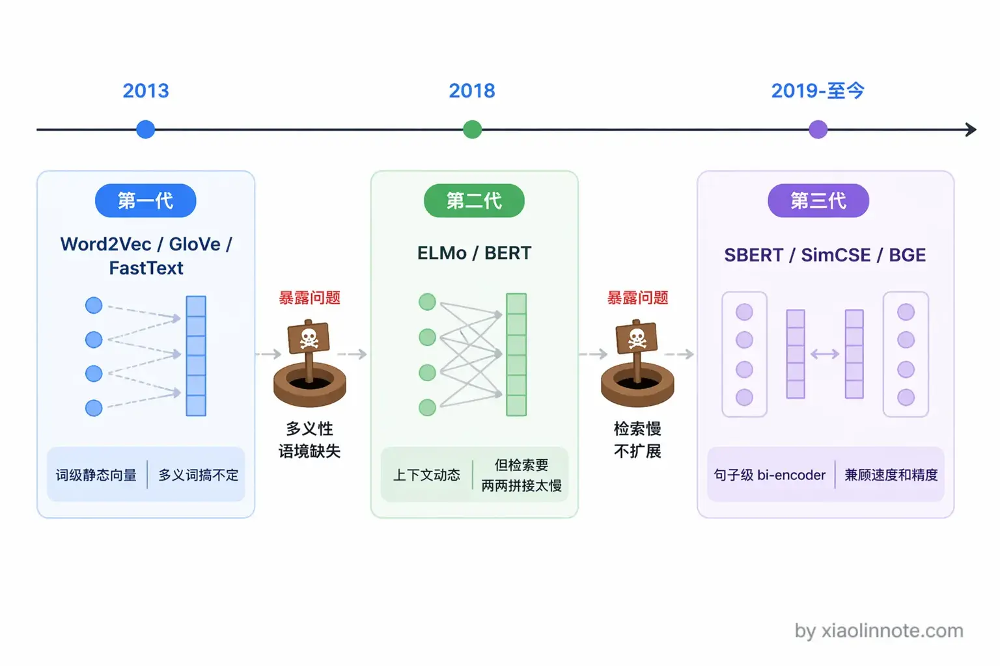

## 静态词向量

先来看第一代算法。它们的核心思路非常朴素：用一个词周围的词来预测这个词，或者反过来用这个词来预测周围的词。通过大量文本训练，语义相近的词自然就会在向量空间里被推到一起。

- Word2Vec 是这一代最有影响力的代表，2013 年 Google 提出。它有两种训练方式：CBOW（用周围词预测中心词）和 Skip\-gram（用中心词预测周围词）。为什么 Skip\-gram 更常用？因为它从一个词能产生多个训练样本（用这个词预测周围每一个词），样本利用率更高，对低频词尤其友好；CBOW 在大数据集上收敛更快，但两者最终效果通常比较接近，细节上 Skip\-gram 对生僻词表现更好，所以更常作为默认选项。训练完之后，每个词对应一个固定的向量，「国王 \- 男人 \+ 女人 ≈ 女王」这个著名的类比就是用 Word2Vec 向量做到的，当时整个 NLP 圈都为之兴奋。

- GloVe（Global Vectors for Word Representation）是斯坦福提出的，思路和 Word2Vec 类似但更系统，直接对整个语料库的词共现矩阵做分解，对全局统计信息的利用更充分。实际效果和 Word2Vec 差不多，很多场景两者可以互换。

- FastText 是 Facebook 提出的改进，解决了一个很实际的问题：Word2Vec 处理不了「未登录词」，也就是训练集里从没见过的词。你可能会觉得这有什么大不了的，但在真实业务里，新词、专有名词、网络流行语不断冒出来，处理不了新词就意味着检索直接断链。FastText 的解法很巧妙——把词拆成字符级别的 n\-gram 子词，比如「苹果」会被拆成「苹」「果」「苹果」等子片段，每个子片段有自己的向量，一个词的向量是其子片段向量的平均。这样遇到没见过的新词，只要子片段见过，就还能估算出一个合理的向量。

这一代算法的共同局限性是两个字：静态。每个词只有一个固定向量，不管上下文如何。「我吃了苹果」里的「苹果」和「苹果手机发布了」里的「苹果」，向量完全相同。很多人以为 Word2Vec 已经理解了语义，其实它只是记住了「哪些词经常一起出现」，真正的语义理解还差得远。这个致命缺陷直接催生了第二代算法。

## 上下文相关向量

理解了第一代「一个词永远只有一个向量」的局限，第二代算法的改进方向就很明确了：让词的向量随上下文动态变化，同一个词在不同句子里有不同的向量表示。

ELMo（2018 年，Allen NLP 提出）用双向 LSTM 来建模，同时从左往右和从右往左扫描句子，把两个方向的隐藏状态拼起来作为词的上下文向量。ELMo 是第一个实用的上下文 Embedding，当时在多个 NLP 任务上大幅刷新了成绩。

BERT（2018 年，Google 提出）用 Transformer 替代 LSTM，引入了 Masked Language Model 预训练任务，效果全面超越 ELMo，成为 NLP 领域最重要的里程碑之一。BERT 用 \[CLS\] token 来表示整个句子，同时看到前后文（双向），表达能力远超单向模型。

但问题来了，BERT 这么强，为什么 RAG 检索不用它？很多人以为 BERT 效果好就万事大吉，其实不是。

BERT 有一个在检索场景下极其致命的缺陷：要比较两个句子的相似度，必须把两个句子拼在一起喂给 BERT，让 \[CLS\] 来做判断。这意味着每次检索都要把**查询和每一个候选 chunk 拼在一起跑 BERT**，百万条文档的知识库就要跑百万次。

你可能觉得百万次也不算多吧？别忘了 BERT 一次前向传播就要几十毫秒，百万次就是好几个小时，用户根本等不起。这个问题直接导致了第三代的诞生。

## 句子级对比学习 Embedding（SBERT / SimCSE / BGE）

第二代 BERT 虽然语义理解能力强，但「必须两两拼接」这个限制让它在检索场景下完全没法用，这就引出了第三代的核心理念：能不能让每个句子独立生成一个向量，然后直接用余弦相似度来比较？

第三代专门针对「句子相似度」和「语义检索」这个任务优化，是 RAG 系统的标配。

- SBERT

SBERT（Sentence\-BERT，2019 年）就是用这个思路解决了 BERT 在检索场景下用不了的问题。它用** bi\-encoder **结构：两个句子分别独立过 BERT，各自得到一个句子级向量，然后只用余弦相似度来衡量两个向量的距离。

你可能会问，这样精度不会下降吗？确实会一点，因为两个句子是分开编码的，模型在编码阶段看不到两句话 token 之间的交叉关系（Cross\-Encoder 那种「每个 token 都能和另一句的每个 token 互相注意到」的深度交互就被牺牲掉了），所以在特别微妙的匹配上会不如 Cross\-Encoder。

但换来的是速度提升了几个数量级，知识库里所有文档的向量可以提前算好存起来，每次检索时只需要算一次查询向量，然后做余弦相似度就行，毫秒级返回。在 RAG 这种「速度优先」的场景里，这个取舍完全值得。

- SimCSE

SimCSE（2021 年，普林斯顿提出）进一步提升了句子 Embedding 的质量。核心思路是对比学习：把同一句话做两次 dropout 得到两个不同的向量，把这两个向量作为正样本对，让模型学会把它们拉近；同时把同一个 batch 里其他句子的向量作为负样本，把它们推远。这个方法训练非常简单，不需要人工标注，但效果很好。

它解决了一个很多人不知道的问题：**BERT 原生的句子向量存在「各向异性」，也就是说向量分布是扭曲的，都挤在一个窄小的锥形区域里，没有充分利用向量空间。SimCSE 通过对比学习把向量「撑开」了，让语义空间变得更均匀。**

- BGE

BGE（BAAI General Embedding，北京智源研究院）是中文 RAG 场景非常流行的开源模型，基于对比学习在大规模中英文数据上训练，同时支持 bi\-encoder 和 reranker 两种形态，专门为检索场景优化。E5（微软）是另一个常用的英文对比学习 Embedding，效果同样优秀。

### 目前趋势

- 指令感知 Embedding（比如 Qwen3\-Embedding），模型能根据检索指令动态调整向量表示，同一段文本在「找相似问题」和「找答案」两种意图下会产生不同的向量。

- Matryoshka 表示学习（MRL），模型训练时让向量的前 N 维就能表达有意义的语义，这样你可以灵活地截断维度来平衡精度和存储成本。

- 多模态 Embedding，同一个模型既能编码文本也能编码图片，让 RAG 可以做到文本和图片的跨模态检索。

# 什么是向量数据库？有没有做过向量数据库的对比选型？

向量数据库是专门用来存储和检索高维向量的数据库，核心能力是近似最近邻搜索，也叫 ANN，能在百万甚至亿级的向量里快速找出最相似的几条。

普通关系型数据库的索引结构对高维向量基本上是失效的，所以需要专门的数据库来处理这个场景。

我自己做过一些选型，本地开发阶段我用 Chroma，零配置上手极快；生产环境的中小规模我推荐 Qdrant，性能不错、API 也比较简洁；如果到了超大规模就要考虑 Milvus 了，字节和小米都在用；不想自己运维的话 Pinecone 是一个云托管的选项；如果项目里已经有 PostgreSQL，也可以直接用 pgvector 插件，不用引入新组件。

## 向量库

向量数据库就是专门用来存储和检索「向量」的数据库。

这里的向量，指的是嵌入模型（Embedding Model）把文本、图片、音频这些内容转换成的一串浮点数，比如一句话可能被转换成 \[0\.12， \-0\.87， 0\.34， \.\.\. \] 这样一个 768 维或 1024 维的数组。每一个向量代表了这段内容的「语义含义」，语义越相近的内容，它们的向量在高维空间里的距离就越近。

## 向量库索引技术

> [知乎文章](https://zhuanlan.zhihu.com/p/27399676042)
>
>

### 扁平索引（暴力搜索）

扁平索引之所以被称为“扁平”，是因为我们不会对输入的向量进行任何修改。

由于不对向量进行近似或聚类，这些索引能产生最准确的结果。我们能获得完美的搜索质量，但这是以显著的搜索时间为代价的。

使用扁平索引时，我们引入查询向量 ，并将其与索引中的每个其他完整向量进行比较，计算与每个向量的距离。

使用扁平索引时，我们将搜索查询向量  与索引中的每个其他向量进行比较。

在计算完所有这些距离后，我们会返回其中最近的 k 个向量作为最匹配的结果，这就是  k 近邻（kNN）搜索。

### ANN

在这里，我们的搜索速度完全未经过优化，这适用于许多较小的索引用例，或者搜索时间无关紧要的场景。但是，其他用例则需要在速度和质量之间取得更好的平衡。

那么，如何加快搜索速度呢？主要有两种方法：

- 通过降维或减少表示向量值的比特数来减小向量大小。

- 通过基于某些属性、相似性或距离对向量进行聚类或将其组织成树结构来缩小搜索范围，将搜索限制在最接近的聚类中，或者通过最相似的分支进行筛选。

使用这两种方法中的任何一种，都意味着我们不再进行详尽的最近邻搜索，而是进行**近似最近邻**（ANN）搜索，因为我们不再搜索整个全分辨率数据集。

### Annoy\( Approximate Nearest Neighbor Oh Yeah\)

Annoy 通过使用随机投影树森林来执行高效的 ANN 搜索。该算法将点投影到随机超平面上，并根据点落在超平面的哪一侧对空间进行划分。这个过程递归地重复，形成一个分区二叉树。使用不同的随机种子创建一个树森林。当收到查询点时，算法遍历森林中的每棵树，找到该点所属的叶节点。然后，通过收集所有树中找到的叶节点中的点列表，并从该列表中返回与查询点最接近的前 k 个点，来近似最近邻。

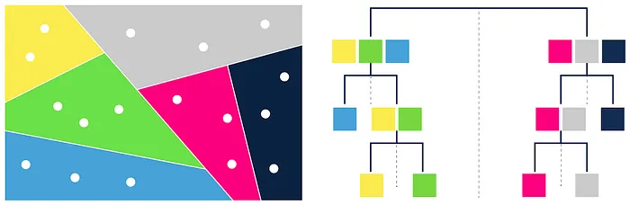

Annoy 特别适合处理高维数据，在高维数据中进行精确的最近邻搜索成本可能过高。Spotify 在生产环境中使用 Annoy 进行音乐推荐，根据歌曲的音频特征找到相似的歌曲。因此，准确性会受到森林中树的数量和搜索过程中检查的点的数量的影响，这两个参数都可以根据任务的具体要求进行调整。

Annoy 的高效性和内存高效性使其成为处理高维数据和大型数据库的有力选择。不过，也有一些需要考虑的权衡因素。构建索引可能需要花费大量时间，特别是对于大型数据集。由于 Annoy 使用随机森林分区算法，索引无法使用新数据进行更新，必须从头重新构建。根据数据集的大小以及数据变化的频繁程度，重新训练索引的成本可能过高。

### 倒排文件（IVF）索引 \*\*

它基于 Voronoi 图的概念，也称为 Dirichlet 镶嵌（这个名字更酷）。

为了理解 Voronoi 图，我们需要想象将高维向量放置在二维空间中。然后在二维空间中放置一些额外的点，这些点将成为我们的“聚类”（在我们的例子中是 Voronoi 单元）质心。

然后，我们从每个质心向外扩展相同的半径。在某个时刻，每个单元圆的圆周会与另一个圆周碰撞，从而形成单元边界：

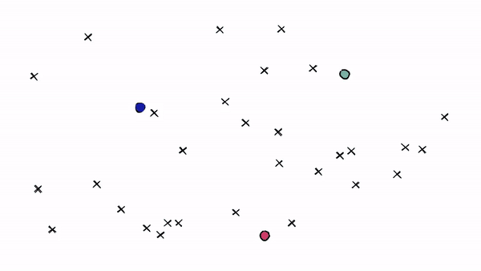

现在，每个数据点都将包含在一个单元内，并被分配给相应的质心。

与其他索引一样，我们引入查询向量 ，这个查询向量必须落在其中一个单元内，此时我们将搜索范围限制在这个单元内。

但是，如果查询向量落在单元的边缘附近，就会出现一个问题：它最接近的其他数据点很可能包含在相邻的单元中。我们称之为边缘问题：

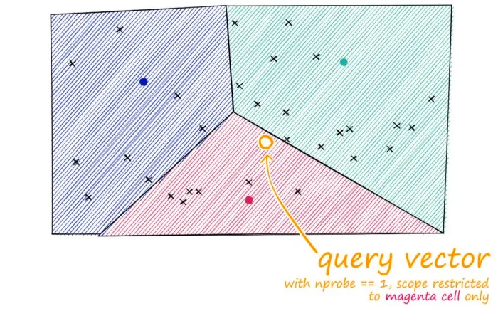

现在，为了缓解这个问题并提高搜索质量，我们可以增加一个名为 nprobe  的值的索引参数。通过 nprobe ，我们可以设置要搜索的单元数量。

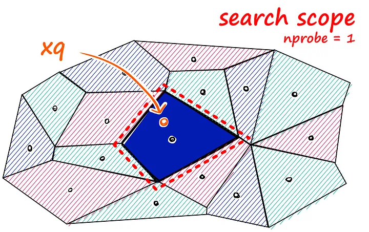

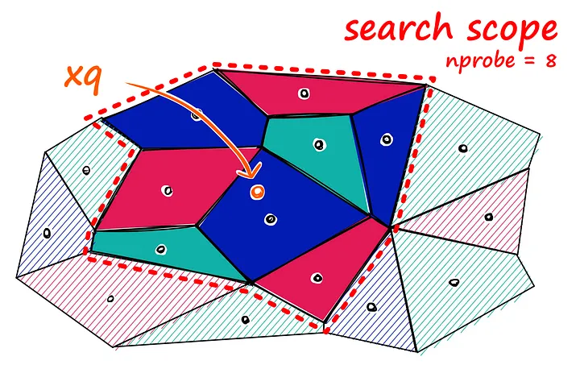

### 随机投影

随机投影的基本思想是使用随机投影矩阵将高维向量投影到低维空间。我们创建一个随机数矩阵，矩阵的大小将是我们想要的目标低维值。然后计算输入向量与矩阵的点积，得到一个投影矩阵，其维度比原始向量少，但仍然保留了它们的相似性。

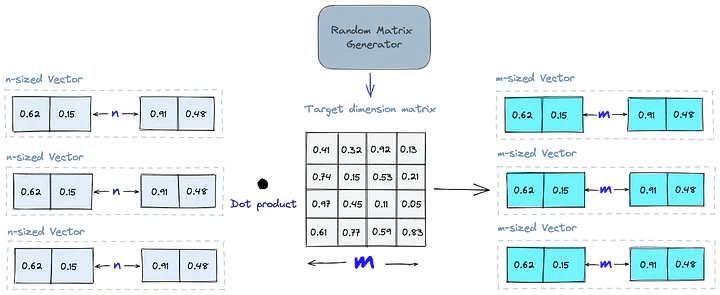

当我们进行查询时，使用相同的投影矩阵将查询向量投影到低维空间。然后，将投影后的查询向量与数据库中的投影向量进行比较，找到最近邻。由于数据的维度降低了，搜索过程比在整个高维空间中搜索要快得多。

请记住，随机投影是一种近似方法，投影质量取决于投影矩阵的属性。一般来说，投影矩阵越随机，投影质量就越好。然而，生成真正的随机投影矩阵在计算上可能很昂贵，特别是对于大型数据集。

### 局部敏感哈希

LSH 的性能范围很广，在很大程度上取决于设置的参数。搜索速度较慢时能得到较好的结果质量，而快速搜索则会导致结果质量较差。在处理高维数据时性能不佳。条形图中半填充的部分表示修改索引参数时性能的变化范围。

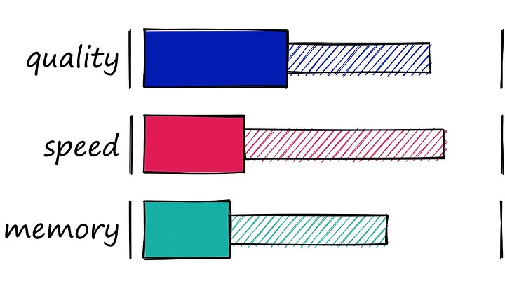

局部敏感哈希（LSH）的工作原理是通过一个哈希函数对向量进行处理，将相似的向量分组到同一个桶中，这个哈希函数的目的是最大化哈希冲突，而不是像通常的哈希函数那样最小化冲突。

这是什么意思呢？想象我们有一个 Python 字典。当我们在字典中创建一个新的键值对时，我们使用哈希函数对键进行哈希。键的这个哈希值决定了我们存储其对应值的“桶”：

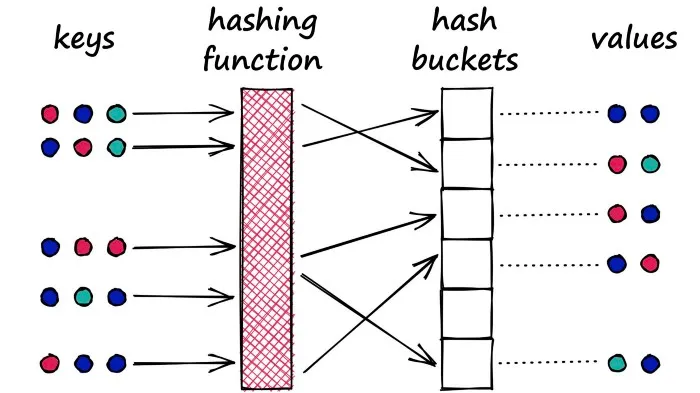

一个类似字典的对象的典型哈希函数会试图最小化哈希冲突，目标是为每个桶只分配一个值。

Python 字典就是一个使用典型哈希函数的哈希表的例子，这种哈希函数会最小化哈希冲突，即两个不同的对象（键）产生相同的哈希值的情况。

在我们的字典中，我们希望避免这些冲突，因为这意味着多个对象会映射到同一个键上。但对于 LSH 来说，我们希望最大化哈希冲突。

为什么我们想要最大化冲突呢？嗯，为了进行搜索，我们使用 LSH 将相似的对象分组在一起。当我们引入一个新的查询对象（或向量）时，我们的 LSH 算法可以用来找到最匹配的组：

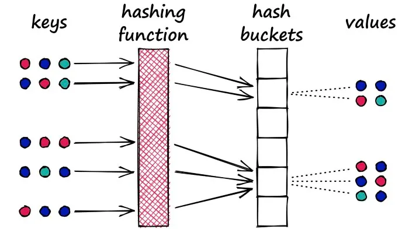

LSH 的哈希函数试图最大化哈希冲突，从而对向量进行分组

### 基于密度的空间聚类算法（DBSCAN）

DBSCAN 算法基于密度可达性和密度连通性的概念。它从数据集中的任意一个点开始，如果在给定半径`eps`内，该点周围至少有`minPts`个点，就会创建一个新的聚类。这里的`eps`代表 epsilon，是用户定义的输入参数，表示两个点在同一聚类中时，它们之间的最大距离；而`minPts`指的是形成一个聚类所需的最少数据点数量。

该算法会迭代地将`eps`半径内所有直接可达的点添加到聚类中。这个过程会一直持续，直到没有更多的点可以添加到聚类中。然后，算法会继续处理数据集中下一个未访问过的点，并重复上述过程，直到所有点都被访问过。

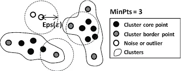

DBSCAN 算法中的关键参数是`eps`和`minPts`，它们分别定义了点的聚类范围和形成聚类所需的最小点密度。

### 分层可导航小世界图（HNSW）\*\*

> https://arxiv\.org/abs/1603\.09320
>
>

HNSW 具有很好的搜索质量和不错的搜索速度，但索引大小较大。

HNSW 创建一个分层的树状结构，树的每个节点代表一组向量。节点之间的边表示向量之间的相似性。该算法首先创建一组节点，每个节点包含少量向量。这可以通过随机方式或使用像 k\-means 这样的聚类算法来完成，其中每个聚类成为一个节点。

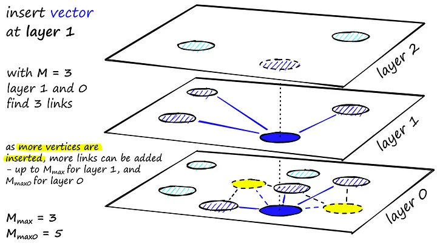

然后，算法检查每个节点的向量，并在该节点和包含与它最相似向量的节点之间绘制一条边。

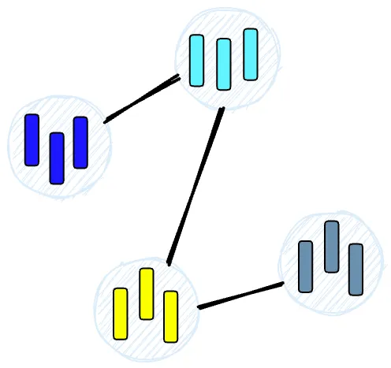

当我们查询 HNSW 索引时，它会使用这个图在树中导航，访问最有可能包含与查询向量最接近的向量的节点。

> HNSW 有两个关键参数，用社交网络来类比很好理解：
>
> - `M` 是「每个节点最多认识几个邻居」，M 越大，图越密，找到最近邻的精度越高，但建索引的内存和时间都越多，通常设 16～32 就够了。`ef_construction` 是「建图时每个节点考察多少候选」，越大越精确，但建索引越慢，通常设 100～200。
>
> - 查询时还有一个参数 `ef`（也叫 `search_ef`）：查询时搜索的候选集大小，越大召回越准，延迟也越高，按实际需求在 50～200 之间调。可以理解为「查询时多看几个候选再决定最终答案」，ef 小查得快但可能漏掉真正最近的那个，ef 大查得慢但结果更准。
>
>

### 乘积量化\*\*

另一种构建索引的方法是乘积量化（PQ），这是一种用于高维向量（如向量嵌入）的有损压缩技术。它将原始向量分解为较小的块，通过为每个块创建一个代表性的“代码”来简化每个块的表示，然后将所有块重新组合在一起，同时不会丢失对相似性操作至关重要的信息。PQ 的过程可以分为四个步骤：分割、训练、编码和查询。

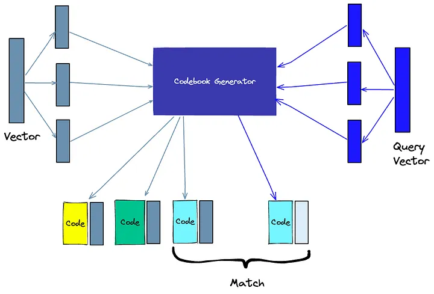

- **分割**：将向量分解为多个段。

- **训练**：为每个段构建一个“码本”。简单来说，算法会生成一组可能分配给向量的“代码”。在实践中，这个“码本”由对向量的每个段执行 k\-means 聚类得到的聚类中心点组成。段码本中的值的数量与我们用于 k\-means 聚类的值相同。

- **编码**：算法为每个段分配一个特定的代码。在实践中，训练完成后，我们在码本中找到与每个向量段最接近的值。我们为该段的 PQ 代码将是码本中相应值的标识符。我们可以根据需要使用任意数量的 PQ 代码，这意味着我们可以从码本中选择多个值来表示每个段。

- **查询**：当我们进行查询时，算法将向量分解为子向量，并使用相同的码本对它们进行量化。然后，它使用索引代码找到与查询向量最接近的向量。

码本中代表性向量的数量是在表示的准确性和搜索码本的计算成本之间的权衡。码本中的代表性向量越多，在子空间中向量的表示就越准确，但搜索码本的计算成本就越高。相反，码本中的代表性向量越少，表示就越不准确，但计算成本就越低。

### PQ 量化的工作原理

1. **向量分解**：将原始高维向量分解为多个低维子向量。例如，一个 128 维的向量可以被分成 8 个 16 维的子向量。

2. **聚类与量化**：对每个子向量应用聚类算法（如 k\-means），生成质心（centroids）。每个子向量会被映射到其最近的质心，从而用质心的 ID 替代原始子向量

3. **编码**：最终，整个向量被表示为一个短的 ID 序列，这些 ID 对应于各个子向量的质心。这种表示方式大幅减少了存储空间的需求

## Milvus 向量数据库的索引方案解析

> https://milvus\.io/docs/zh/index\-explained\.md
>
>

### 向量索引解剖图

如下图所示，Milvus 中的索引类型由三个核心部分组成，即数据结构、量化和细化器。量化和精炼器是可选的，但由于收益大于成本的显著平衡而被广泛使用。

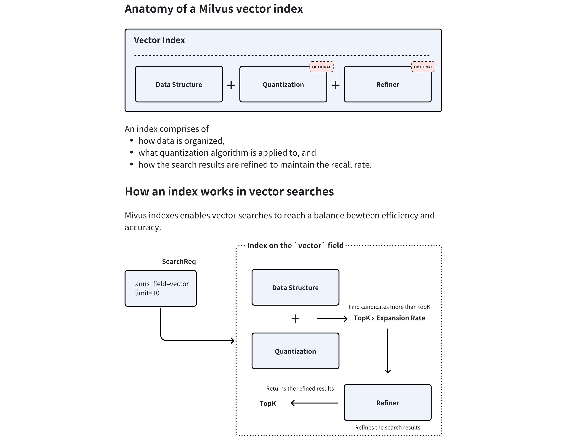

在创建索引时，Milvus 会结合所选的数据结构和量化方法来确定最佳扩展率。在查询时，系统会检索`topK × expansion rate` 候选向量，应用精炼器以更高的精度重新计算距离，最后返回最精确的`topK` 结果。这种混合方法通过将资源密集型细化限制在候选矢量的过滤子集上，在速度和精确度之间取得了平衡。

#### 数据结构

数据结构是索引的基础层。常见类型包括

- 反转文件（IVF）

IVF 系列索引类型允许 Milvus 通过基于中心点的分区将向量聚类到桶中。一般可以安全地假设，如果桶的中心点接近查询向量，那么桶中的所有向量都有可能接近查询向量。基于这个前提，Milvus 只扫描那些中心点靠近查询向量的桶中的向量 Embeddings，而不是检查整个数据集。这种策略既能降低计算成本，又能保持可接受的精确度。

这种索引数据结构非常适合需要快速吞吐量的大规模数据集。

- 基于图的结构

基于图的向量搜索数据结构，如分层导航小世界[（HNSW](https://arxiv.org/abs/1603.09320)），构建了一个分层图，其中每个向量都与其最近的邻居相连。查询可以浏览这个层次结构，从粗略的上层开始，然后切换到下层，从而实现高效的对数时间搜索复杂性。

这种索引数据结构适用于高维空间和要求低延迟查询的场景。

#### 量化

量化通过更粗略的表示来减少内存占用和计算成本：

- 标量量化（如 SQ8）使 Milvus 能够将每个向量维度压缩为单字节（8 位），与 32 位浮点数相比，内存使用量减少了 75%，同时保持了合理的精度。

- 乘积量化（PQ）使 Milvus 能够将向量分割成子向量，并使用基于编码本的聚类进行编码。这可以实现更高的压缩率（例如 4\-32 倍），但代价是召回率略有降低，因此适用于内存受限的环境。

#### 精炼器

量化本身就是有损的。为了保持召回率，量化始终会产生比所需数量更多的前 K 个候选结果，这使得精炼器可以使用更高的精度从这些候选结果中进一步选择前 K 个结果，从而提高召回率。

例如，FP32 精炼器通过使用 FP32 精度而不是量化值重新计算距离，对量化返回的候选搜索结果进行操作符操作。

这对于需要在搜索效率和精度之间做出权衡的应用（如语义搜索或推荐系统）来说至关重要，因为在这些应用中，微小的距离变化都会对结果质量产生重大影响。

#### 总结

这种分层架构\-\-通过数据结构进行粗过滤、通过量化进行高效计算、通过细化进行精度调整\-\-使 Milvus 能够自适应地优化精度\-性能权衡。

### 性能权衡

在评估性能时，平衡构建时间、每秒查询次数（QPS）和召回率至关重要。一般规则如下：

- 就 QPS 而言，基于图形的索引类型通常优于 IVF 变体。

- IVF 变体尤其适用于 topK 较大的情况（例如，超过 2,000 个）。

- 与 SQ 相比，PQ 通常能在相似的压缩率下提供更好的召回率，但后者的性能更快。

- 将硬盘用于部分索引（如 DiskANN）有助于管理大型数据集，但也会带来潜在的 IOPS 瓶颈。

### 召回率

召回率通常涉及过滤率，即搜索前过滤掉的数据。在处理召回问题时，应考虑以下几点：

- 如果过滤率小于 85%，则基于图的索引类型优于 IVF 变体。

- 如果过滤率在 85% 到 95% 之间，则使用 IVF 变体。

- 如果过滤率超过 98%，则使用 "蛮力"（FLAT）来获得最准确的搜索结果。

### 性能

搜索性能通常涉及 top\-K，即搜索返回的记录数。在处理性能问题时，请考虑以下几点：

- 对于 Top\-K 较小的搜索（如 2,000），需要较高的召回率，基于图的索引类型优于 IVF 变体。

- 对于 top\-K 较大的搜索（与向量嵌入的总数相比），IVF 变体比基于图的索引类型是更好的选择。

- 对于 top\-K 中等且过滤率较高的搜索，IVF 变体是更好的选择。

### 内存使用估算

本节侧重于计算特定索引类型的内存消耗，包括许多技术细节。如果本节内容与您的兴趣不符，您可以放心跳过。

索引的内存消耗受其数据结构、通过量化实现的压缩率以及使用中的精炼器的影响。一般来说，由于图的结构（如 HNSW），基于图的索引通常会占用较多内存，这通常意味着每个向量的空间开销较大。相比之下，IVF 及其变体更节省内存，因为适用的每个向量空间开销更少。不过，DiskANN 等先进技术允许索引的一部分（如图或细化器）驻留在磁盘上，从而在保持性能的同时减少了内存负荷。

具体来说，索引的内存使用量可按以下方式计算：

#### IVF 索引内存使用量

IVF 索引通过将数据划分为群组，在内存效率和搜索性能之间取得平衡。以下是使用 IVF 变体索引的 100 万个 128 维向量所使用的内存明细。

1. 计算中心点使用的内存。

IVF 系列索引类型使 Milvus 能够使用基于中心点的分区将向量聚类到桶中。在原始向量 Embeddings 中，每个中心点都包含在索引中。当你将向量划分为 2,000 个簇时，内存使用量可按如下方式计算：

```Plain Text
2,000 clusters × 128 dimensions × 4 bytes = 1.0 MB
```

2. 计算簇分配使用的内存。

每个向量嵌入都会分配给一个簇，并以整数 ID 的形式存储。对于 2 000 个簇来说，2 字节的整数就足够了。内存使用量的计算方法如下：

```Plain Text
1,000,000 vectors × 2 bytes = 2.0 MB
```

3. 计算量化带来的压缩。

IVF 变体通常使用 PQ 和 SQ8，内存使用量可按下式估算：

- 使用带有 8 个子量化器的 PQ

```Plain Text
1,000,000 vectors × 8 bytes = 8.0 MB
```

- 使用 SQ8

```Plain Text
1,000,000 vectors × 128 dimensions × 1 byte = 128 MB
```

下表列出了不同配置下的内存用量估算：

4. 计算细化开销。

IVF 变体通常会与细化器配对，对候选对象进行重新排序。对于检索前 10 个结果且扩展率为 5 的搜索，细化开销可估算如下：

```Plain Text
10 (topK) x 5 (expansion rate) = 50 candidates
50 candidates x 128 dimensions x 4 bytes = 25.6 KB
```

#### 基于图形的索引内存使用情况

基于图的索引类型（如 HNSW）需要大量内存来存储图结构和原始向量嵌入。下面是使用 HNSW 索引类型索引的 100 万个 128 维向量所消耗内存的详细明细。

1. 计算图结构使用的内存。

HNSW 中的每个向量都与其邻居保持连接。在图度（每个节点的边数）为 32 的情况下，所消耗的内存计算如下：

```Plain Text
1,000,000 vectors × 32 links × 4 bytes (for 32-bit integer storage) = 128 MB
```

2. 计算原始向量嵌入所消耗的内存。

存储未压缩的 FP32 向量所消耗的内存可计算如下：

```Plain Text
1,000,000 vectors × 128 dimensions × 4 bytes = 512 MB
```

当您使用 HNSW 对 100 万 128 维向量嵌入进行索引时，使用的总内存为 128 MB（图形）\+ 512 MB（向量）= 640 MB。

3. 计算量化带来的压缩。

量化可以减小向量大小。例如，使用带有 8 个子量化器（每个向量 8 字节）的 PQ 会导致大幅压缩。压缩后的向量 Embeddings 所消耗的内存可以计算如下：

```Plain Text
1,000,000 vectors × 8 bytes = 8 MB
```

与原始向量嵌入相比，这实现了 64 倍的压缩率，HNSWPQ 索引类型使用的总内存将为 128 MB（图）\+ 8 MB（压缩向量）= 136 MB。

4. 计算细化开销。

细化（如使用原始向量重新排序）会将高精度数据临时加载到内存中。对于检索前 10 个结果且扩展率为 5 的搜索，细化开销可估算如下：

```Plain Text
10 (topK) x 5 (expansion rate) = 50 candidates
50 candidates x 128 dimensions x 4 bytes = 25.6 KB
```

## 选择建议

选向量数据库主要看三个维度：数据规模、部署方式、是否需要混合检索。

中小到大规模、团队小、快速上线，首选 Qdrant，性能好、API 设计简洁、文档完善，Docker 一条命令就能部署，Rust 写的性能很稳。Qdrant 现在也支持分布式模式（分片 \+ 副本），实际已经有亿级规模的生产案例，覆盖面比较广。很多团队一开始用 Chroma 做原型，后来上生产就切到 Qdrant，这个路径很常见。

说到 Chroma，它确实是上手最快的选项，Python 直接 `pip install`，本地内存运行，零配置，配合 LangChain/LlamaIndex 原生集成非常方便。Chroma 现在也支持了 Client\-Server 模式和 Chroma Cloud 托管服务，不再只是本地嵌入式了，而且在 2025 年还加入了 BM25/SPLADE 稀疏向量的混合检索支持。不过要注意的是，Chroma 的分布式能力还在成熟中，对于超大规模（千万级以上）的生产场景，它的稳定性和性能还不如 Milvus 和 Qdrant 这些专门为大规模设计的方案。总结来说，Chroma 适合快速原型验证和中小规模的生产使用，超大规模就要考虑其他选项了。

数据规模在千万到亿级，需要分布式，选 Milvus，国内大厂用得最多，支持多种索引类型，有完整的集群方案，但部署运维复杂度也高，团队需要有足够的人力来维护。

不想运维，数据在云上，用 Pinecone，全托管 SaaS，按用量付费，适合快速验证商业化产品。不过要注意数据出境的问题，如果业务数据有合规要求，Pinecone 就不合适了。

已经在用 PostgreSQL，数据量不是特别大，可以直接用 pgvector 插件，不用引入新组件，查询可以和业务数据做 SQL JOIN，运维成本为零。

# 讲讲你用的向量数据库？数据量级是多大？性能如何？遇到过性能瓶颈吗？

我们生产环境用的是 Milvus，数据量级在百万条向量左右，每条是 1024 维，用 HNSW 索引，单次查询的延迟在 20 到 50 毫秒。选 Milvus 主要是因为它支持分布式部署和读写分离，适合数据量大、并发高的场景。

我遇到过两个比较典型的瓶颈。

第一个是内存压力，百万级的 1024 维向量光原始数据就要好几个 GB，后来我们开启了标量量化 SQ8，把 float32 压成 int8，内存直接降到原来的四分之一。

第二个是大批量写入的时候会触发后台 Segment 合并，影响查询延迟，我们的解法是把批量写入改到业务低峰期，分批小批次写入。

## 内存问题

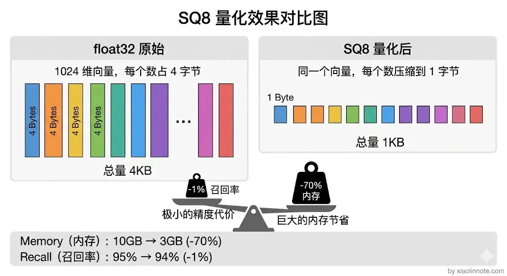

实测查询性能（单机 16 核 32G、本地千兆网、HNSW 在内存、ef=100）：单次 top\-5 查询 P50 延迟约 20ms，P99 约 60ms，并发 100 QPS 时延迟基本稳定。这里报数字一定要带上硬件和参数背景，同样是 Milvus，跑在 8 核机上、跨机房调用、或者 ef 设到 200，数字能差一个量级。这些数字才是面试官想听到的，不是「感觉挺快的」。

## Segment 合并

Milvus 组成：

- Collection（集合） 类似关系数据库里的「表」，存储一类向量数据。我们的知识库就是一个 Collection，每条记录包含：文本 chunk 的 ID、向量（embedding）、原文内容、来源文档等 metadata。

- Segment（段） 是 Milvus 内部管理数据的基本单位，理解它对后面分析性能瓶颈很关键。新写入的数据先进「增量段」，像一个临时的接收缓冲区；积累到一定量后触发合并，变成「封存段」。封存段会建好索引，查询时走索引检索速度很快。但合并这个动作本身会消耗 CPU 和磁盘，就像磁盘碎片整理，把一堆小文件合并成大文件，期间会抢资源。记住这个 Segment 合并机制，后面讲性能瓶颈的时候会用到。

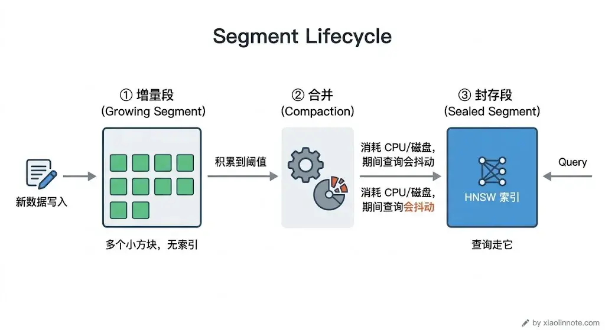

每天知识库有增量更新，一次性写入几十万条新数据时，Milvus 后台会触发 Segment 合并操作，把多个小的增量 Segment 合并成大的封存 Segment 并建好索引。还记得前面说的 Segment 合并机制吗？这个过程很耗 CPU 和磁盘 IO，期间查询的 P99 延迟会有明显抖动，从正常的 60ms 涨到 300ms\+。

解法有两个思路。一是时间上错峰，把批量写入改到业务低峰期（比如凌晨），避开查询高峰，让 Segment 合并在用户不活跃时静默完成。二是量上化整为零，把每批写入量控制在 500～1000 条以内，分成多批写，每批之间间隔几秒。这样 Segment 合并的冲击变成多次小冲击，而不是一次大冲击，每次合并规模小、耗时短，查询服务基本感知不到抖动。

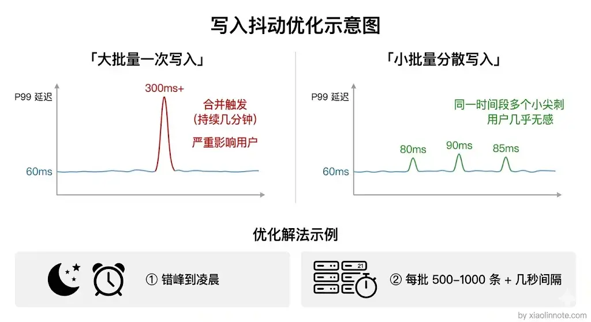

# 你使用 RAG 给大模型一个输入，系统是怎样的工作流程？

正确回答要按顺序把六个步骤讲清楚。

- 第一步 Query 预处理（改写、HyDE、多角度扩写），把口语化的问题转成适合检索的形式；

- 第二步 Query Embedding，注意必须用和建库时相同的模型；

- 第三步向量检索 \+ 多路召回，向量检索和 BM25 各有所长，通过 RRF 融合结果。

- 第四步 Rerank 精排，用 Cross\-Encoder 深度理解语义，把粗排的噪音过滤掉；

- 第五步 Prompt 拼装，明确约束 LLM 只根据资料回答、不知道就说不知道；

- 第六步生成 \+ 溯源，标注引用来源提升可信度。

# 请你介绍一下向量检索和关键词检索的区别？

关键词检索（BM25 这类）靠的是词频统计，看查询词在文档里出现了多少次，擅长精确命中；向量检索靠的是语义空间里的距离，能理解「换了种表达方式的同一个意思」，擅长模糊语义匹配。两者各有盲区：BM25 遇到同义词就没辙，向量检索遇到专有名词、产品型号这类精确词就容易漏。所以 RAG 系统里通常两路都跑，向量检索捕获语义相关的内容，BM25 精准命中关键词，再用 RRF 算法把两路结果合并，这样覆盖面比单路宽很多。

## BM25

关键词检索的代表是 BM25（Best Match 25），这是 Elasticsearch、Lucene 等传统搜索引擎的核心算法。

BM25采用倒排索引，它记录的不是「每篇文档里有哪些词」，而是反过来，记录「每个词出现在哪些文档里」。

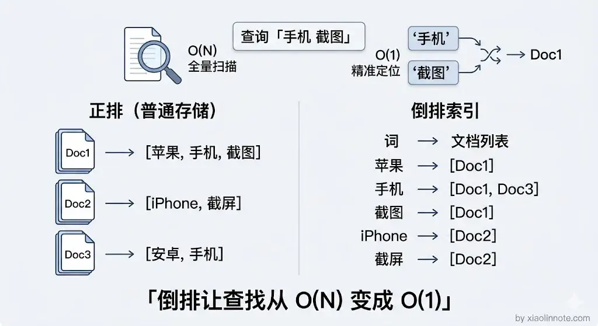

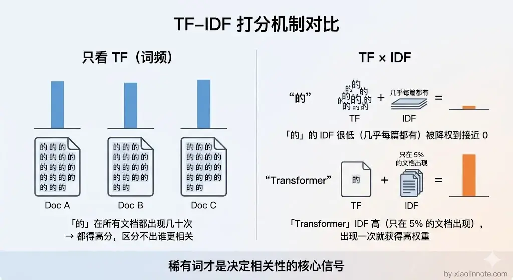

- 第一个是词频（TF）：这个词在这篇文档里出现了几次，出现越多说明越相关。

- 第二个是稀缺度（IDF）：这个词在所有文档里有多罕见。

BM25 在 TF\-IDF 基础上又加了饱和度限制，防止某个词重复出现太多次后权重无限叠加。

BM25 的优势是对精确词汇命中率极高，产品型号「iPhone 15 Pro Max」、专有名词「LSTM」、缩写「RAG」，只要文档里有这个词，BM25 就能精准找到。

但它的劣势同样明显，而且刚好是向量检索的优势所在：遇到同义词就束手无策。

## 向量检索

> 前面有介绍
>
>

## 混合检索

工程实践中的标准做法叫混合检索（Hybrid Search）：同时跑向量检索和 BM25，各自召回一批候选，然后用 RRF（Reciprocal Rank Fusion，互倒排名融合）算法把两路结果合并排序。

RRF 的思路很巧妙：它不看各路的原始分数，只看排名。你可能会问，为什么不直接把两路的分数加权平均呢？原因是向量相似度（0 到 1 的余弦值）和 BM25 分数（可能是任意正数）的量纲完全不同，就像拿摄氏度和华氏度直接加在一起没有意义。RRF 用排名的倒数来打分，排名越靠前倒数越大，最终按总分降序排列。这样，两路都认为相关的文档会排在最前面，只有一路认为相关的文档也不会被完全丢掉。

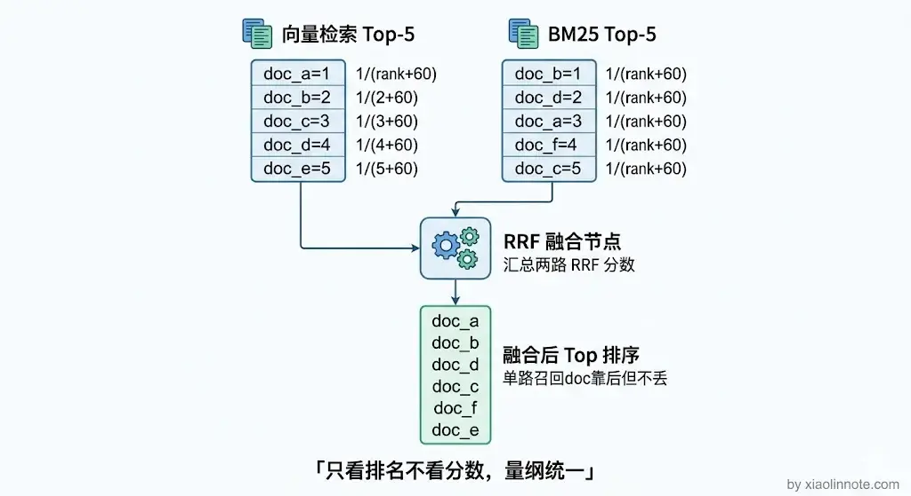

这个方案还有一个工程上的好处：两路检索可以并行执行，总延迟取两路中的最大值而不是两者相加，几乎没有额外的时间代价，但召回质量比单路明显更好。这也是为什么生产环境的 RAG 系统很少只用纯向量检索，混合检索已经成为行业默认做法

# 如何润色用户的 Query（Query Rewrite）？目的是什么？

我用 Query Rewrite 主要是为了弥补用户提问方式和知识库文档表述之间的语义鸿沟。用户的问题往往口语化、模糊、带缩写，而文档写的是正式书面语，向量相似度天然偏低，导致该召回的内容没被召回。

我接触过的方法主要有四种：

- 第一是直接改写，让 LLM 把口语化的问题转成更精准的表述；

- 第二是 Query 扩展，补充相关关键词；

- 第三是 HyDE，让 LLM 先生成一个假设答案，然后用答案的向量去检索；

- 第四是 Step\-back Prompting，把具体问题往上抽象一层，检索更通用的背景知识。

## 直接改写

表述鸿沟最简单的形态，就是口语化。把口语化、模糊的问题改写成更精准、更书面化的检索表述，这就是最基础的改写方式。改写的本质是消除口语化表达和书面知识库表述之间的向量距离，「这东西咋退」和「申请退款的操作流程」在向量空间里不是同一个邻居，改写就是把前者的向量拉近到后者。同时还可以补全上下文，处理代词指代（「这个功能」改写成具体功能名称），让多轮对话中的模糊引用变成检索可识别的具体词汇。

发给 LLM 的 Prompt 模板如下：

```Plain Text
请将用户的问题改写成更适合知识库检索的表述。
要求：去掉口语化表达、补全缩写和指代、使用更正式的书面语、保留核心意图。

对话历史：{最近几轮对话}
用户问题：{原始问题}

只输出改写后的问题，不要解释：
```

示例效果：原始「上次说的那个退款的事，流程是啥」\-\> 改写后「申请商品退款的完整操作流程是什么」。

直接改写能解决口语化和指代不清的问题，但还有另一种鸿沟是改写搞不定的，问题和文档本来就是不同的文体，一个是疑问句，一个是陈述句，就算你把问题改写得再规范，它在向量空间里还是「问句」的坐标，而文档是「陈述句」的坐标，两类文体之间天然有距离。

## HyDE

理解了「问句和陈述句在向量空间里有距离」这个问题，HyDE 的思路就非常巧妙了。

HyDE 的直觉可以这样理解：正常你用问题的影子去找答案的样子，HyDE 先描绘出答案可能长什么样子，再去找长得像它的文档。先让 LLM 根据用户问题生成一段「假设性的答案」，再用这段假设答案的向量去检索文档。假设答案不需要准确，只需要「风格像文档」就够了，它的作用是充当一个向量上更好的「检索代理」。

很多人第一次听到 HyDE 会觉得奇怪：让 LLM 生成一个可能不准确的答案，再用这个答案去检索，这不是多此一举吗？其实不是。在向量空间里，答案到答案的距离，比问题到答案的距离要近得多。假设答案的作用不是「回答问题」，而是「扮演文档的角色」，用它当检索代理比用原始问题更高效。

生成假设答案用的 Prompt 模板：

```Plain Text
请根据以下问题，生成一段可能的答案。
注意：不需要完全准确，只需要用于辅助检索，风格尽量像知识库文档。

问题：{用户问题}
假设答案：
```

示例效果：问题向量「退款政策是什么」和文档「申请售后退款须知」距离较远；而假设答案向量「用户可在购买后 14 天内申请退款\.\.\.」和文档距离很近，能被正确召回。

HyDE 解决的是「文体差异」的问题，但还有一类情况是 HyDE 和直接改写都处理不好的——用户的问题太具体了，知识库里压根没有直接对应的答案，但有相关的背景原理文档。这种情况下，不管你怎么改写、怎么假设，都很难从具体问题直接跳到背景知识。于是就有了 Step\-back Prompting。

## Step\-back Prompting

对于涉及具体细节的问题，有时候知识库里没有直接对应的答案，但有背景原理。Step\-back Prompting 把具体问题「后退一步」，提升到更抽象的层次，先检索背景知识，再结合背景知识回答具体问题。

类比一下就很直观：就像你做一道数学题，不是一上来就硬套公式，而是先想想「这道题用的是哪种定理」，再用定理解题。知识库里可能没有「ef 参数设 100 是否合适」的直接答案，但一定有「HNSW 参数调优原则」这样的背景文档，把具体问题后退成背景问题，才能找到真正有用的参考资料。

生成「后退版本」问题的 Prompt 模板：

```Plain Text
请将以下具体问题转化为一个更通用的背景问题，用于检索相关背景知识。

具体问题：{原始问题}
背景问题：
```

示例效果：具体问题「Qdrant 的 HNSW ef 参数设多少合适」\-\> 后退问题「HNSW 索引的参数调优原则是什么」。后退后的问题能命中更多通用背景文档，让 LLM 生成有原理支撑的答案。

前面三种方法都是在「一个问题」上做文章——要么改写它、要么给它配一个假设答案、要么把它抽象化。但有时候问题的角度本身就比较窄，用一个角度去检索，覆盖面不够。这时候就需要换个思路：不求一个问题改得更好，而是多生成几个不同角度的问题。

## 多 Query 扩展

用 LLM 把用户原始问题改写成 3～5 个不同角度的版本，分别去检索，然后把所有结果合并去重。核心思路是：只要有一个改写版本和文档的表述对上了，就能把正确的内容召回来，就像拦截网越宽，捕到鱼的概率越高。适合用户提问风格多变、和文档表述差异大的场景，代价是多几次 LLM 调用。

# 什么是多路召回？具体怎么做？

多路召回就是同时用多种不同的检索方式去捞候选内容，然后合并排序，而不是只靠单一的向量检索。我理解核心出发点是向量检索和关键词检索各有盲区，向量检索擅长语义相似，但对精确词语比如产品型号、缩写、数字效果比较差；BM25 关键词检索正好相反，精确匹配强，但不理解语义。我在项目里常用的组合是向量检索加 BM25 混合检索，再加上多 Query 扩展，也就是把用户问题改写成多个版本分别检索。多路的结果用 RRF 算法融合，最后送进 Rerank 精排。

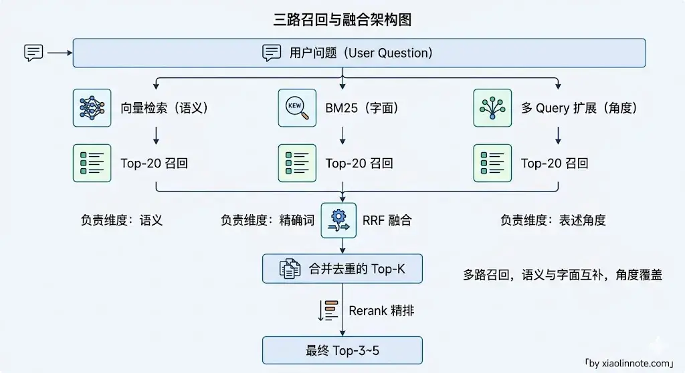

# RAG 检索优化策略有哪些？

我理解 RAG 的检索优化可以从四个层次来看：

- 索引层决定知识怎么存

- 查询层决定问题怎么转换

- 召回层决定从哪些路径去找

- 重排序层决定最终哪些内容进入 prompt。

每一层都有对应的优化手段，我的经验是单独优化一个层次往往效果有限，线上系统我会组合来用，先靠索引优化和多路召回来保证覆盖率，再用 Rerank 保证精度，如果用户提问质量比较差，再额外加上查询优化。

## 重排序

检索质量已经比朴素 RAG 好了很多，但还差最后一步。

多路召回之后，候选 chunk 可能有 20\~30 个，这些 chunk 里难免混入一些不太相关的内容，直接全塞给 LLM 会出问题：一是 token 消耗暴涨，成本直线上升；二是上下文太长，LLM 在处理长文本时容易出现「Lost in the Middle」的现象，也就是只关注开头和结尾，中间的内容容易被忽略。

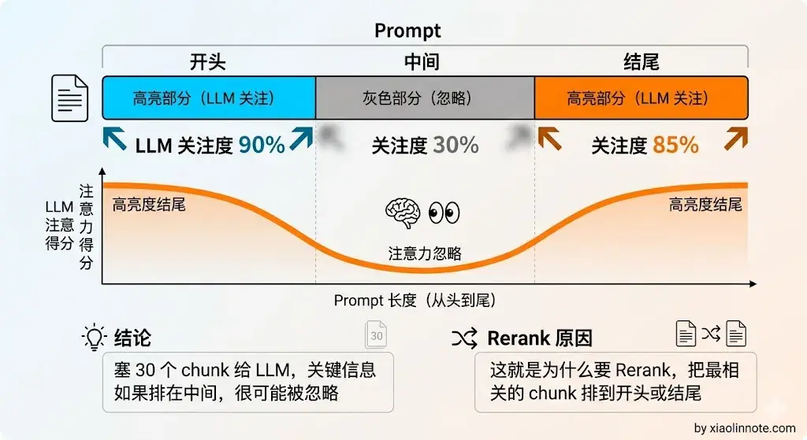

所以需要一个精排步骤，从 20\~30 个候选里挑出最相关的 3\~5 个，这就是 Rerank 的作用。

你可能会问，向量检索不是已经排过序了吗，为什么还需要再排一次？要理解 Rerank 为什么比向量检索更准，需要先理解两种不同的模型结构。

向量检索用的是 Bi\-encoder 结构：query 和 chunk 各自独立编码成向量，再算余弦相似度。这个结构的优点是速度极快，因为 chunk 的向量可以提前计算好存库，检索时只要算一次 query 的向量然后做距离比较就行；缺点是 query 和 chunk 是分开编码的，模型没办法看到两段文字之间的具体词语关联，相关性判断不够精准。

Rerank 用的是 Cross\-encoder 结构，把「query \+ chunk」拼成一对输入，让模型整体看这一对的相关性。Cross\-encoder 能看到 query 中每个词对 chunk 的影响、chunk 里哪些词最能回答 query，相关性判断精度远高于 Bi\-encoder。代价是每一个候选 chunk 都要单独跑一次 Cross\-encoder，速度慢，所以只适合对小规模候选集做精排，不适合大规模召回阶段。

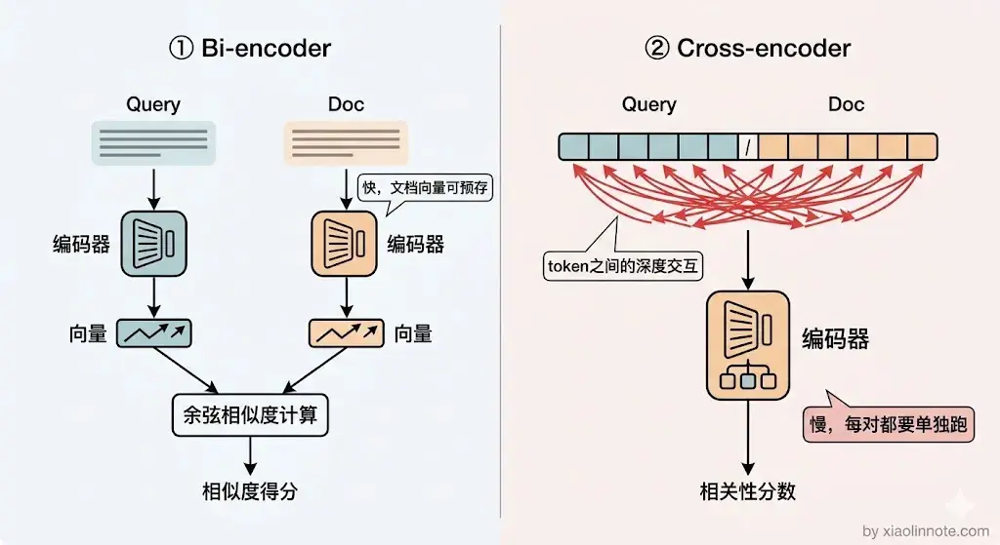

# 了解哪些更复杂的 RAG 范式？

在我的了解里，RAG 的发展经历了三代演进：

- Naive RAG 是基础的检索加生成；

- Advanced RAG 在检索前后都加了优化，比如 Query 改写、Rerank、混合检索这些；

- Modular RAG 是把各个环节做成模块可以任意组合。

在这之上还有几个我觉得值得关注的高级范式。

- Self\-RAG 是让 LLM 自己来决定要不要检索，以及评估检索质量；

- CRAG 是检索质量差的时候自动降级到网络搜索；

- GraphRAG 是微软推的方案，用知识图谱的社区发现和层次摘要来增强全局理解能力；

- Agentic RAG 是把 RAG 做成 Agent，支持多轮的动态检索。

# 在什么场景下，你会选择使用图数据库来增强传统的向量检索？

我的判断是，当业务问题涉及多个实体之间的关联推理的时候，就需要考虑引入图数据库来增强。

向量检索有一个根本的局限，它只能做单跳检索，找和问题直接相关的文档，没办法沿着实体之间的关系链做推理。比如你问公司 A 的投资方和公司 B 有什么交集，单纯向量检索就很难处理了，因为答案不在某一段文档里，而是藏在多个节点之间的关系上。

这时候图数据库就能发挥作用，沿着关系边一跳一跳地把关联信息收集回来。我接触过的典型场景有企业关系分析、医疗知识图谱、代码依赖关系查询、供应链溯源这些。

## 单跳vs多跳

向量检索有一个根本限制：它是「单跳」的，也就是每次只能找和问题直接相关的内容，没办法沿着实体之间的关系链往下追。

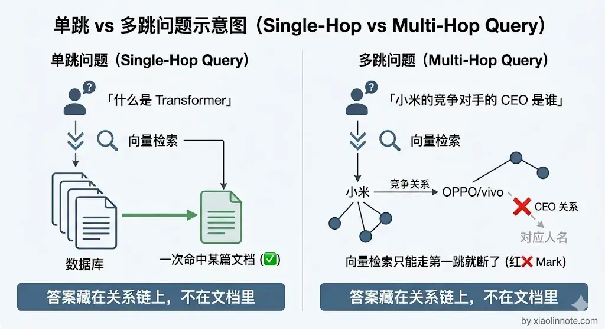

这些问题的共同特征是：答案不在某一个文档里，而是藏在多个节点之间的「关系」上，要沿着边一跳一跳地走才能拼出完整答案。理解了这个局限，图数据库存在的意义就很好懂了。

**图数据库是干什么的，为什么能解决这个问题**

向量检索做不到多跳遍历，这个能力缺口恰恰是图数据库的强项。图数据库专门用来存「实体和关系」，它把世界表示成一张网：每个节点是一个实体（比如公司、人、疾病、药物），每条边是一种关系（比如「投资」「竞争」「治疗」「副作用」）。

有了这张网之后，就可以做「图遍历」：从一个节点出发，沿着关系边一跳一跳地走，把路径上所有相关节点的信息都收集回来。这正好补了向量检索的短板。

很多人以为图数据库是向量检索的「升级版」，上了图就可以替代向量检索了，其实不是这样。图数据库也有自己的局限：传统的图查询语言（比如 Cypher）擅长的是精确关系查询，「从 A 出发沿着这条边走到 B」，对「语义相似」这种模糊匹配不擅长（现代图数据库如 Neo4j 虽然也在加向量索引能力，但那本质上是把向量检索嫁接进图里，不是图遍历本身在做）。

比如用户问「手机充电慢怎么办」，这种问题没有明确的实体关系可以遍历，图数据库帮不上忙，但向量检索可以从知识库里找到语义相近的故障排查文档。所以实际系统里，这两种技术是互补的，不是替代关系。

## 组合使用

两者组合起来的工作流是这样的：向量检索先作为「入口」，用户问「小米的竞争对手 CEO 是谁」，先用向量检索找到和「小米」相关的文档片段，从中识别出关键实体，定位到「小米」这个节点。

接下来，图数据库接力做「关系遍历」，拿到入口实体之后，在图里沿着关系边一路走：「小米」\-\> 竞争关系 \-\>「OPPO、vivo、荣耀」\-\> CEO 关系 \-\> 对应人名，把沿途经过的节点信息都收集回来。

最终，把向量检索结果和图遍历结果合并，一起塞给 LLM 生成回答。


打个比方，向量检索像是「导航定位」，帮你找到出发点在哪；图遍历像是「沿着路线一站一站走」，帮你把沿途经过的所有站点信息都收集起来。前者解决「在哪」的问题，后者解决「能到哪」的问题，合在一起才能给出完整答案。

这样，LLM 拿到的上下文既有语义相关的文档片段，也有沿关系链追出来的关联信息，两者互补，回答就完整了。

## 图数据库的应用场景

可用场景：

- 企业关系分析是最典型的场景。金融、投资领域的知识库里，企业之间的股权关系、人员之间的任职关系错综复杂。如果只用纯向量检索，问「X 基金投资的公司里有哪些跟 Y 集团存在竞争」，基本答不上来，因为这个关系链不会在某篇文档里直接写出来。但在图里，这一趟遍历几秒钟就出来了。

- 医疗知识图谱也是图数据库的强项。疾病、症状、药物、基因之间有大量关联，如果只用向量检索，「某个基因突变会导致哪些疾病，这些疾病又有哪些共同的治疗方案」这种沿着多层关系链追溯的问题根本无从下手，因为没有一篇文档会把这条完整的链路写在一起。图遍历反而很自然。

- 代码知识库同样适合。函数调用关系、模块依赖关系可以建成图，「这个接口被哪些上游服务直接和间接调用」在图里走一遍就出来了。靠文本检索的话，你得一个个文件翻，几乎不可能做到。供应链溯源也类似，原材料 \-\> 供应商 \-\> 成品 \-\> 分销商，这种层级关系天然适合图结构存储和查询，追溯某批次产品的所有上下游环节，图遍历是最自然的解法。

不适用场景：

如果用户的问题大多数是「找某个概念的解释」「某个功能怎么用」，向量检索加上 Rerank 已经够用了，强行上图数据库是过度设计。

判断要不要用图数据库的简单原则：问题里是否同时出现多个具体实体名，并且在问这些实体之间「有什么关系」或「通过关系能找到什么」。如果是，就值得考虑图增强；如果问题主要是找某段描述性的内容，向量检索就够了。

# 如何规避 RAG 系统中大模型的幻觉？

我遇到过的 RAG 幻觉主要有两类。

- 第一类是检索没有召回到相关内容，LLM 没有可用的上下文，靠自身知识在编造答案。

- 第二类是检索内容召回了但 LLM 没有严格遵循，在文档内容的基础上加了自己的推断。我用来规避幻觉的策略主要有四个方向：

    - 第一是 Prompt 强约束，明确告知 LLM 只能根据提供的资料回答，资料里没有的就说不知道；

    - 第二是检索质量门控，Rerank 分数低于阈值就直接拒答，不让 LLM 在低质量上下文上硬撑；

    - 第三是生成后引用核查，每个关键的声明都要在 chunk 里找到来源依据；

    - 第四是结构化输出强制溯源，让 LLM 输出 JSON，每条结论必须附上来源编号。

其中 Prompt 强约束加检索质量门控是我觉得成本最低、收效最快的组合，生产系统上线前这两个必须做。

## 方案

### 添加Prompt

> 比较简单，直接说明要按照资料进行回答
>
>

### 检索质量差时，直接拒绝回答

用 Rerank 模型打分。整个流程很直接：检索召回 top\-K 个候选 chunk，Rerank 模型对每个候选打一个 0 到 1 的相关度分数，然后看最高分的值。如果最高分低于阈值，说明这次检索根本没找到有用的内容，直接返回「知识库无相关信息，建议联系人工」，不让 LLM 强行回答；如果最高分达标，就把所有达标的 chunk 筛出来喂给 LLM。

这个阈值到底设多少？没有通用数字，得按你自己的业务数据调。调法是拿一批「已知答案在知识库里」和「已知答案不在知识库里」的测试集跑一遍，看 Rerank 分数分布，找那个能把两类分开的切点。一般经验值在 0\.3 到 0\.6 之间：对精度要求高（金融、医疗）偏高，对召回率宽松（闲聊型问答）偏低。先从中间值开始，根据线上误判的样例往上或往下调。

### 逐条检查答案

LLM 生成完答案，再用另一个 LLM（或者同一个 LLM）回头检查，答案里的每一条关键信息，在 chunk 里有没有对应的依据。没有依据的内容，标注「无法核实」或者直接删掉。实现方式是发起「第二次 LLM 调用」，把原始答案和 chunk 一起送给 LLM，让它充当编辑角色，逐条核查每个声明有没有来源支撑。就像文章写完还要请编辑审阅一遍，方案一是事前约束作者的行为，方案三是事后审稿。

这个方案的代价是多一次 LLM 调用，响应延迟会增加，成本也会翻倍。所以一般只在对准确性要求极高的场景使用，比如医疗问诊、法律咨询，答错了代价很大的地方。普通的企业知识库问答，方案一 \+ 方案二组合通常已经够用。

### 规范格式\-\>确定来源

让 LLM 输出结构化的 JSON，每个结论都必须填写来自哪条参考资料的编号。这样一来，用户看到答案的同时就能看到来源，系统也可以自动验证每条结论的来源 ID 是不是真实存在。

```JSON
{
    "answer": "完整回答",
    "statements": [
        {"claim": "具体结论1", "source_ids": [1, 2]},
        {"claim": "具体结论2", "source_ids": [3]}
    ],
    "confidence": "high/medium/low"
}
```

这个方案有效原因有两个：

- 一是 LLM 在构建 JSON 时必须主动想「这条结论我从哪条资料里找到的」，这个过程本身就会减少瞎编的概率

- 二是系统拿到 JSON 后可以做程序化验证，`source_ids` 里的编号如果对应的 chunk 和 `claim` 明显不相关，就可以自动过滤掉这条结论。

规避幻觉没有一劳永逸的银弹。最重要的认知是：检索质量是幻觉的最大来源，检索到了正确的内容，Prompt 再稍微约束一下，幻觉就已经少很多了；如果检索这一步就烂，再多的生成层约束也填不了这个坑。所以治幻觉，先治检索。

# 怎么量化你的 RAG 效果？

我评估 RAG 效果是分两层来看的。

检索层看该召回的有没有召回到，我用 Hit@K 和 MRR 来衡量。生成层看答案对不对、有没有幻觉、和问题相不相关，我主要用 RAGAs 框架，里面的 Faithfulness、Answer Relevancy 和 Context Recall 这三个指标是最核心的。

我的建议是一定要在自己的业务数据上跑，不能只看通用排行榜，那个不能代表你的场景。

另外线上指标，就是用户的点踩率、追问率、转人工率这些，才是最终的衡量标准，离线指标只是辅助。

## 评估指标

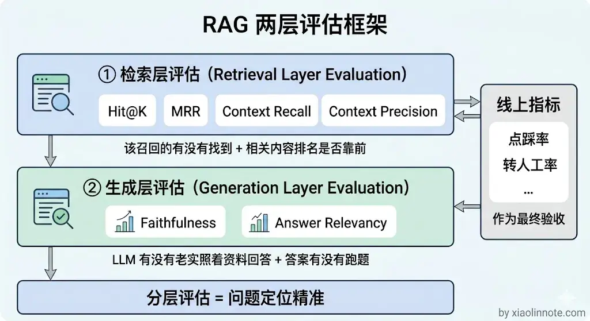

### 检索层

- Hit@K

把 Top\-K 的检索结果摆在你面前，你要找的那个在里面吗？如果在，这次就算命中（Hit）。Hit@5 就是说，把前 5 个结果给你，能不能命中，最终统计命中率。

这个指标回答的是「找到没」的问题，不关心找到的是第几名。一般 Hit@5 低于 0\.7 就说明检索层有问题，需要考虑换 Embedding 模型或者优化 Chunking 策略；高于 0\.8 说明检索层 OK，如果答案还不好，问题在生成层。

- MRR（Mean Reciprocal Rank，平均倒数排名）

关心的是「你要找的东西排在第几名」。计算公式也很直观，就是对每个问题算 `1 / 排名`，然后对所有问题求平均。所以第一名找到得 1 分，第二名找到得 0\.5 分，第三名得 0\.33 分，第五名得 0\.2 分，排名越靠后得分越低。MRR 越高，说明正确内容排名越靠前，用户越早看到它。这个指标回答的是「多快找到的」。MRR 低于 0\.5 通常说明 Rerank 效果不够好，正确内容召回了但没排到前面。

很多人容易混淆这两个指标，觉得差不多。简单来说：Hit@K 是「找到没」，MRR 是「多快找到的」。Hit@5 等于 0\.9，说明 90% 的问题都能在前 5 个结果里找到相关内容；但 MRR 只有 0\.3，说明相关内容虽然找到了，但排得很靠后，可能第 4、第 5 才出现。配合起来用能精确定位检索层的问题出在哪一步。

### 生成层

它有四个核心指标，分别是 Faithfulness、Answer Relevancy、Context Recall 和 Context Precision，每个都有直观的理解方式，下面挨个讲。

- Faithfulness（忠实度）：答案里说的每件事，在检索到的 chunk 里有没有出处？这个指标衡量的是幻觉程度。你可以把它理解为「LLM 裁判」在逐句问：「这句话你从哪条资料里找到的依据？」没有依据的句子越多，分越低。目标值是 \> 0\.8。

- Answer Relevancy（答案相关性）：答案有没有回答用户问的那个问题？注意这个指标和 Faithfulness 是两回事，很多人会把它们搞混。Faithfulness 是问「说的是不是真的」，Answer Relevancy 是问「说的是不是用户想要的」。一个答案可以字字有据、但完全跑题，Faithfulness 高、Answer Relevancy 低。

- Context Recall（上下文召回率）：要回答这个问题，所需要的信息有多少比例在检索结果里覆盖到了？这个指标需要有「标准答案」作为参照，衡量的是检索层有没有「漏掉该找到的内容」。目标值是 \> 0\.7。

- Context Precision（上下文精确率）：这个指标和 Context Recall 配对出现，衡量的是检索结果里「有用的内容」排名是否靠前。也就是说，如果你召回了 10 个 chunk，相关的那几个有没有被排在前面，而不是混在无关内容的后面。它同样需要 ground\_truth 作为参照计算。Context Recall 关注「该找的有没有找全」，Context Precision 关注「找到的里面相关的是不是排在前面」，两个配合能完整刻画检索质量。

## 问题定位

- Context Recall 低，你可以把它理解为「检索结果里缺少了答好这道题必要的信息」，说明检索层没召回到正确内容，优化方向是换更强的 Embedding 模型、调整 Chunking 策略、或者加多路召回来补充覆盖面。

- Context Precision 低，说明检索召回了太多噪音，相关内容是找到了，但不相关的内容也混进来了，把 LLM 的注意力稀释掉了，优化方向是加强 Rerank 模型、调低最终送给 LLM 的 chunk 数量。

- Faithfulness 低，说明 LLM 在编造，幻觉问题多，你回答里说的东西在参考资料里找不到依据，优化方向是加强 Prompt 约束、引入引用核查、或者做检索质量门控，防止低质量上下文进入生成阶段。

- Answer Relevancy 低，说明答案跑题了，没有聚焦在用户问的问题上，通常是 Prompt 的指令不够明确，告诉 LLM「请严格回答问题本身，不要展开无关内容」往往就能改善。

## 线上问题

- 踩率（thumbs\_down\_rate）是最直接的信号，用户主动点踩，说明这次回答让他不满意，是最真实的负反馈。

- 追问率（followup\_rate）反映的是「答非所问」的程度，用户紧接着说「你没回答我的问题」或者追问同一个问题，通常意味着上一次回答没用。

- 转人工率（escalation\_rate）衡量的是「RAG 放弃回答」的频率，这个比例太高说明知识库覆盖不足；但如果这个比例因为加了质量门控而上升，不一定是坏事，宁可转人工也不要给用户错误答案。

- 空回答率（answer\_empty\_rate）就是系统主动说「我不知道」的比例，过高说明知识库亟需扩充。

- 会话解决率（session\_resolution\_rate）是最综合的指标，衡量「一次对话能不能解决用户的问题」，是最贴近用户体验的衡量维度。

- 离线评估（Hit@K \+ RAGAs）用来快速迭代和定位问题，线上指标（踩率、转人工率）是最终验收标准。两者结合，形成「离线测评 \-\> 上线 \-\> 线上观测 \-\> 发现问题 \-\> 离线复现 \-\> 修复 \-\> 再上线」的完整评估闭环。

# RAG 知识库如何实现动态与持续更新？

我理解知识库更新的核心挑战是，文档变了，对应的 chunk 和向量都要跟着变，而且要做到增量处理，不能每次全量重建。我们的通用方案是给每个文档算一个内容 hash，通过轮询或者监听数据源变更，检测到文档新增、修改、删除的时候，先清掉旧的向量，再重新切割入库。对于实时性要求比较高的场景，我会用消息队列比如 Kafka 做变更事件驱动，实现秒级的入库。

## RAG知识库更新更复杂

在讲具体方案之前，先搞清楚一个关键问题：为什么 RAG 知识库的更新不能像普通数据库那样直接 UPDATE？原因在于，普通数据库更新一条记录，直接 UPDATE 就行，数据是独立的，改一条不影响别的。但 RAG 知识库的麻烦在于：原始文档和向量库之间不是一对一的关系，而是一对多的关系。

一篇文档会被切割成几十甚至上百个 chunk，每个 chunk 分别 Embedding 后存入向量库。当文档内容发生变化时，你不能简单地「更新一条记录」，**因为文档结构变了，切割结果可能完全不同，chunk 的数量、边界、内容都会变。**

所以 RAG 知识库在工程上最可靠的更新逻辑是先删掉旧文档对应的所有 chunk，再重新切割入库，即「先删后增」，而不是在原来的 chunk 上做局部更新。理论上如果 Chunking 策略完全稳定（比如按固定 token 窗口切），某些场景可以做局部更新，但生产环境里 chunk 边界一变就全乱套，与其在这种不确定性上博弈，不如直接走「先删后增」简单可靠。

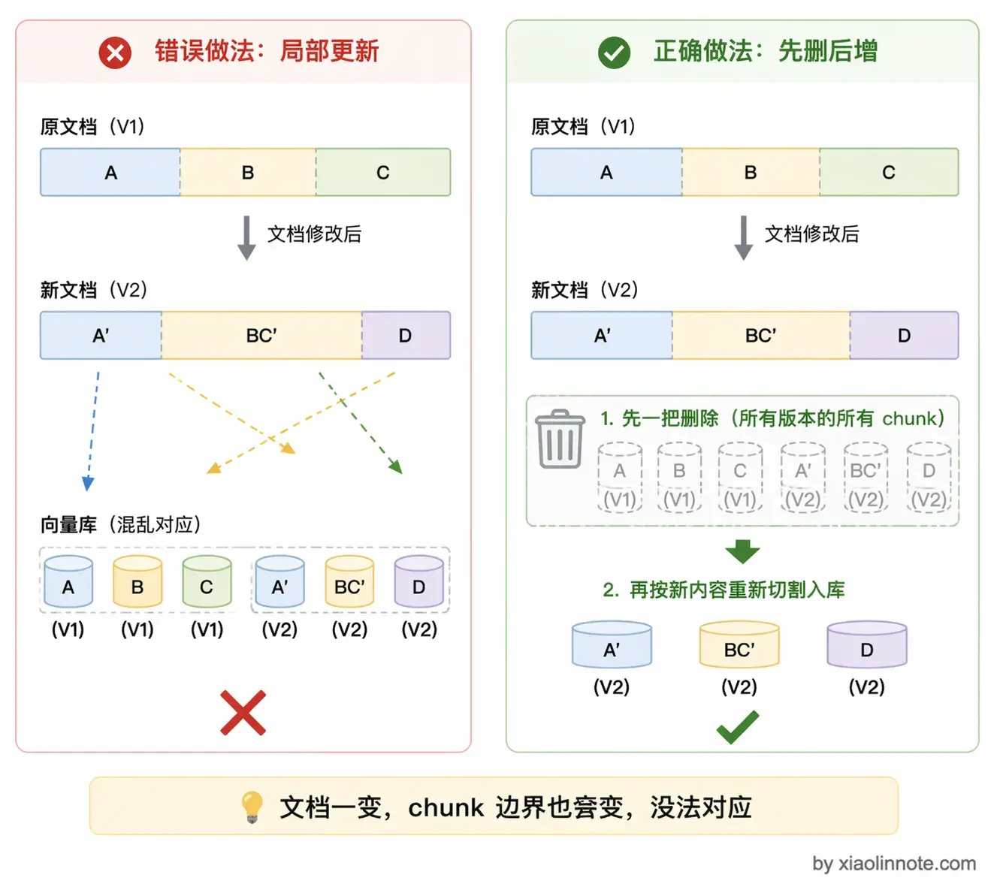

抽象来看，知识库的变更只有三种操作类型。新增是最简单的，文档以前不存在，走一遍完整的「切割 \-\> Embedding \-\> 写入」流程就行，没有任何历史包袱。

修改是最容易踩坑的操作，值得多说几句。很多同学第一次做这个功能，直觉上认为「只改了一段文字，更新那一个 chunk 就好了」，这个思路在实际中行不通。

原因很简单：文档内容一改，切割边界就变了，原来第 3 个 chunk 的内容可能现在分散在第 3 和第 4 个 chunk 里，你根本没法把旧 chunk 和新 chunk 一一对应起来做「局部打补丁」。就像装修时把一堵墙拆了重建，不能指望原来的插座位置还能对上，整面墙的电路要重新布。所以修改的正确做法是推倒重来：把这篇文档之前入库的所有 chunk 全部删掉，然后重新按新内容切割入库。操作虽然暴力，但是可靠，也是唯一不会出 bug 的做法。

删除最直接，文档下线了，把它对应的所有 chunk 从向量库中清除，不能留着「僵尸 chunk」，否则用户还是会检索到这些已经失效的内容。

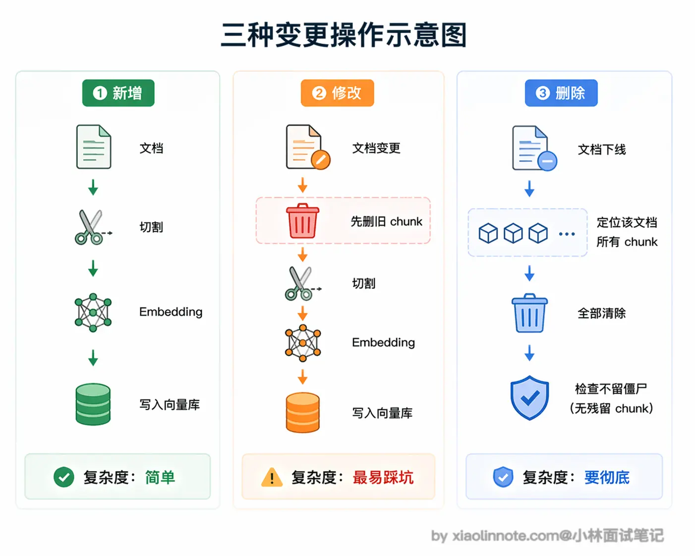

## 如何判断是否修改

最常用的方案是内容 hash。每次文档入库时，计算文档内容的 MD5 或 SHA256 摘要，把这个 hash 值和文档 ID、对应的 chunk ID 列表一起存下来（存在 Redis、数据库都行）。下次检测到这篇文档时，重新计算 hash 和存储的值对比：相同说明内容没变，跳过；不同说明内容有更新，触发重处理流程。

你可能会担心，每次都算 hash 性能会不会有问题？完全不会。hash 运算非常快，哪怕只改了文档里的一个标点符号，hash 值就会完全不同，不会漏掉任何变更，计算成本极低。

实际工程里还有一个进一步优化：先用「最后修改时间」这个轻量字段做粗筛，只对时间戳发生变化的文档才计算 hash。比如数据源每晚同步一次，上百万篇文档里真正改过的可能只有几千篇，这样能把 99% 的文档过滤掉，hash 只对小部分计算，开销再降一个量级。

## 文档id与chunk id关联

有了变更检测的方案，还有一个容易被忽视但非常关键的设计问题：chunk ID 的命名规范。这个东西一开始不设计好，后面做更新的时候会非常痛苦。

为什么？因为删除一篇文档的所有 chunk 时，你需要能快速找出「这篇文档对应了哪些 chunk」。

常见的做法是让 chunk ID 带上文档 ID 作为前缀，比如 `product_manual_v3_chunk_001`、`product_manual_v3_chunk_002`，这样按前缀就能批量查找和删除对应的所有 chunk。

另一种做法是在每个 chunk 的 metadata 里存上文档 ID 字段（比如 `source_doc_id: "product_manual_v3"`），向量库一般都支持按 metadata 字段过滤批量删除，效果是一样的。无论选哪种方式，关键是从一开始就把文档和 chunk 的关联关系设计好，等到需要更新时再临时想办法，会很狼狈。

## 更新策略

- 第一种是定时轮询（Polling）。

系统按固定时间间隔（比如每天凌晨两点、每小时一次）扫描所有文档，对比 hash 值，把有变化的文档重新处理。这种方案实现简单，不依赖任何外部系统，适合文档更新频率低、对实时性要求不高的场景，比如内部知识库、产品文档这类一周才改几次的内容。缺点是有延迟，文档改完之后要等到下一个轮询周期才会生效；而且如果文档数量很多，全量扫描本身也是一笔开销，大多数文档根本没变，却每次都要算一遍 hash。

- 第二种是事件驱动（Event\-Driven）。

数据源有变更时，主动发出一条消息（通过 Kafka、RabbitMQ、或者 Webhook），知识库更新服务订阅这些消息，收到事件立刻处理。这种方案延迟低，文档变更后几秒内就能在知识库里生效，适合实时性要求高的场景，比如客服知识库（运营刚更新了退款政策，要求立刻在客服机器人里生效）、新闻资讯类应用（新文章发布就要入库）。代价是需要数据源支持发消息的能力，系统架构也更复杂一些。

# 在实际落地中，你觉得 RAG 最难的地方是哪里？

我觉得 RAG 最难的不是把它跑起来，一个基础的 Demo 一两天就能搭起来，难的是把它调好。工程上最让我头疼的有三块。

- 第一是文档预处理，原始数据的格式五花八门，PDF 里面的表格、图片、嵌套的格式，处理不好就是一堆乱码进了知识库，进去的是垃圾出来的也是垃圾。

- 第二是检索质量的调优，向量召回不准是整个系统效果的天花板，但问题来源很多，Chunking、Embedding、Query 改写，任何一个环节出问题都会影响结果，排查起来很费劲。

- 第三是效果评估，答案对不对很难系统性地衡量，不知道是哪个环节出了问题，优化就变成了瞎猜。

## 文档预处理

> PDF，markdown，PPT等等格式的处理
>
>

## 检索质量调优

> 可以查看前面的优化策略
>
>

## 效果评估

> 查看量化RAG效果
>
>
