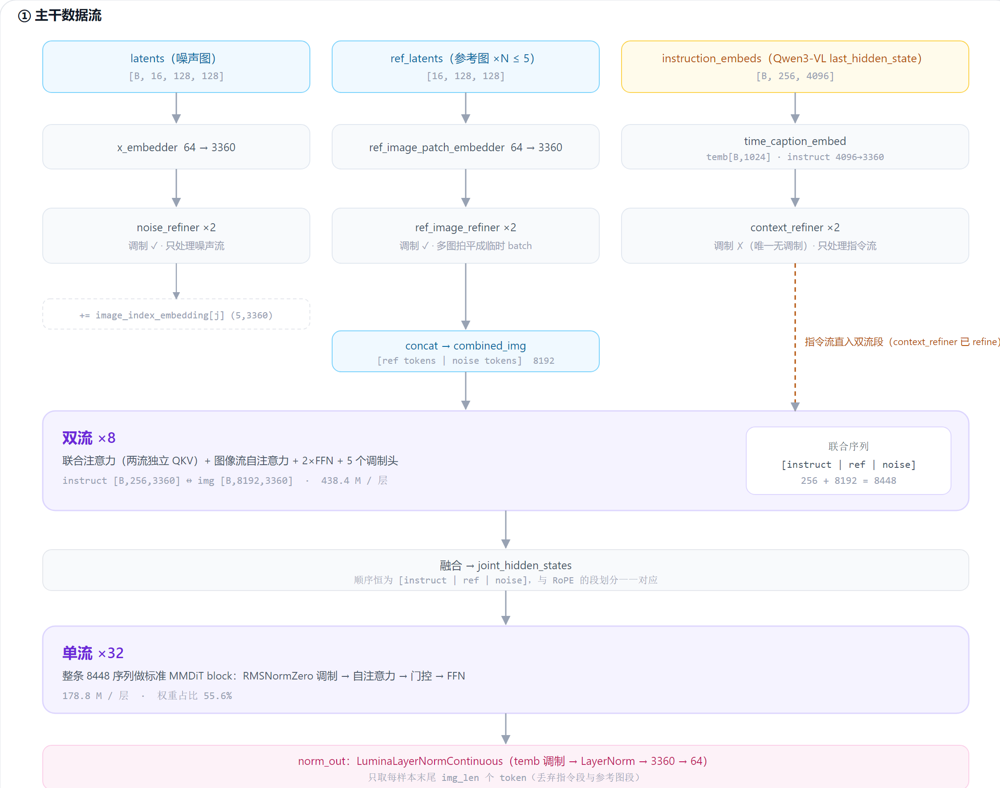

# BooguImageTransformer2DModel 源码精读

> 范围：**只精读自研去噪器** `BooguImageTransformer2DModel` 以及它直接依赖的 4 个 Lumina2 原语、双流注意力 processor、3 轴 RoPE。
>
> Qwen3-VL 编码器 / FLUX VAE / pipeline 调度都是借用件，压到 §11 一节带过。
>
> 代码全部是**从源码逐字切出来的原文**（含原注释原缩进），展开即可读，行号对应 `boogu/models/transformers/transformer_boogu.py`。



---

## 1. 先记住三件事

1. **它是「8 双流 + 32 单流」的混合 MMDiT**：前 8 层让指令流与图像流并行交互，后 32 层拼成一条序列做标准注意力。40 层 = `num_layers`，两类层共用同一套 hidden=3360 / FFN=13568 的规格。
2. **双流层不是 FLUX 的双流层**：它内部有 **3 个注意力 + 3 个 FFN**，图像流在联合注意力之外**还要过一次自己的自注意力**，且 FFN 分支是"并行"而非"串行"（§6.4 详细说）。
3. **整个 transformer 只有 2 个 block 类**：`BooguImageTransformerBlock`（单流 + 三种 refiner 全用它）和 `BooguImageDoubleStreamTransformerBlock`。源码里 `NoiseRefiner/RefImgRefiner/ContextRefiner/SingleStream` 四个类名都是空壳子类，只是为了让 print 出来的结构树好看。

### 参数量账本（实机统计，非估算）

| 模块 | Linear 数 | 权重参数 | 占比 |
|---|---:|---:|---:|
| single_stream ×32 | 256 | 5,720,064,000 | 55.59% |
| double_stream ×8 | 192 | 3,506,442,240 | 34.07% |
| noise_refiner ×2 | 16 | 357,504,000 | 3.47% |
| ref_image_refiner ×2 | 16 | 357,504,000 | 3.47% |
| context_refiner ×2 | 14 | 329,978,880 | 3.21% |
| time_caption_embed | 3 | 15,073,280 | 0.15% |
| norm_out | 2 | 3,655,680 | 0.04% |
| x_embedder + ref_image_patch_embedder | 2 | 430,080 | 0.004% |
| **合计** | **501** | **10,290,652,160** | 100% |

加 bias 后总参数 **10,292,556,288**（10.293 B，BF16 ≈ 20.6 GB）。单层平均：双流层 438.4 M、单流层 178.75 M——**一个双流层 ≈ 2.45 个单流层**。主体（89.7%）就是这 40 层，外壳可忽略。

---

## 2. 实测超参

以发布权重 `config.json` 为准（源码 `__init__` 里的默认值是占位，别用）：

```python
patch_size          = 2        # latent 切 2×2，token 维度 = 2*2*16 = 64
in_channels         = 16       # FLUX VAE latent 通道
hidden_size         = 3360
num_attention_heads = 28       # head_dim = 3360/28 = 120
num_kv_heads        = 7        # GQA：k/v 投影输出 7*120 = 840
num_layers          = 40       # = 8 双流 + 32 单流
num_double_stream_layers = 8
num_refiner_layers  = 2        # 三种 refiner 各 2 层
multiple_of         = 256      # FFN 内维 = 256*ceil(4*3360/256) = 13568
axes_dim_rope       = (40,40,40)   # 40*3 = 120 = head_dim（__init__ 里有断言）
axes_lens           = (2048,1664,1664)  # RoPE 三轴查表长度上界
instruction_feature_configs = dict(instruction_feat_dim=4096, reduce_type="mean", num_instruction_feat_layers=1)
timestep_scale      = 1000.0
```

`__init__` 开头有两条硬断言：`hidden//heads == sum(axes_dim_rope)`、`num_double_stream_layers <= num_layers`。

---

## 3. 骨架：`__init__` 建了什么

按构建顺序读一遍（完整代码见下方折叠框）：

```
rope_embedder            BooguImageDoubleStreamRotaryPosEmbed（3 轴，查表式，不占参数）
x_embedder               Linear 64→3360        噪声图 patch 嵌入
ref_image_patch_embedder Linear 64→3360        参考图 patch 嵌入（独立权重！）
time_caption_embed       Lumina2CombinedTimestepCaptionEmbedding
                         ├ Timesteps(256, scale=1000) + TimestepEmbedding(256→1024→1024)
                         └ caption_embedder = RMSNorm(4096) + Linear(4096→3360)
noise_refiner        ×2  BooguImageNoiseRefinerTransformerBlock  (modulation=True)
ref_image_refiner    ×2  BooguImageRefImgRefinerTransformerBlock (modulation=True)
context_refiner      ×2  BooguImageContextRefinerTransformerBlock(modulation=False) ← 唯一无调制
double_stream_layers ×8  BooguImageDoubleStreamTransformerBlock  (modulation=True)
single_stream_layers ×32 BooguImageSingleStreamTransformerBlock  (modulation=True)
norm_out                 LuminaLayerNormContinuous(1024 → LayerNorm → Linear 3360→64)
image_index_embedding    Parameter (5, 3360)    区分最多 5 张参考图
```

三个容易被忽略但很实用的类属性：

- `_no_split_modules`：列出全部 block 类 + `nn.Embedding`，决定 device_map 切分边界（放量化/多卡时有用）。
- `_repeated_blocks`：**只含单流/context refiner 通用块**。源码注释写明"noise refiner / ref image refiner / double stream 层为了数值稳定不参与 regional torch.compile"——作者自己标了这三处对数值更敏感，量化时值得重点看。
- `_skip_layerwise_casting_patterns = ["x_embedder", "norm", "embedding"]`：layerwise casting 时跳过这些层。

`__init__` 末尾还有两件"顺手的运行时状态"：TeaCache 开关与 4 次多项式 rescale 系数 `[-5.48259225, 11.48772289, -4.47407401, 2.47730926, -0.03316487]`，以及 `self.layers = double_stream + single_stream`（给 TaylorSeer 之类按层遍历用）。

<details>
<summary><b>BooguImageTransformer2DModel.__init__（含类属性与配置断言）</b> <code>src_transformer_boogu.py:773-988</code></summary>

```python
class BooguImageTransformer2DModel(
    ModelMixin, ConfigMixin, PeftAdapterMixin, FromOriginalModelMixin
):
    """
    Boogu-Image transformer with mixed stream topology.
    Early layers use double-stream (aka dual-stream) processing, then switch
    to single-stream joint processing.
    """

    _supports_gradient_checkpointing = True
    _no_split_modules = [
        "BooguImageTransformerBlock",
        "BooguImageNoiseRefinerTransformerBlock",
        "BooguImageRefImgRefinerTransformerBlock",
        "BooguImageContextRefinerTransformerBlock",
        "BooguImageSingleStreamTransformerBlock",
        "BooguImageDoubleStreamTransformerBlock",
        "PromptEmbedding",
        "nn.Embedding",
    ]
    # Noise refiner, reference image refiner, and double stream layers
    # are kept out of regional torch.compile for numerical stability.
    _repeated_blocks = [
        "BooguImageTransformerBlock",
        "BooguImageContextRefinerTransformerBlock",
        "BooguImageSingleStreamTransformerBlock",
    ]
    _skip_layerwise_casting_patterns = ["x_embedder", "norm", "embedding"]

    @register_to_config
    def __init__(
        self,
        patch_size: int = 2,
        in_channels: int = 16,
        out_channels: Optional[int] = None,
        hidden_size: int = 2304,
        num_layers: int = 26,
        num_double_stream_layers: int = 2,
        num_refiner_layers: int = 2,
        num_attention_heads: int = 24,
        num_kv_heads: int = 8,
        multiple_of: int = 256,
        ffn_dim_multiplier: Optional[float] = None,
        norm_eps: float = 1e-5,
        axes_dim_rope: Tuple[int, int, int] = (40, 40, 40),
        axes_lens: Tuple[int, int, int] = (2048, 1664, 1664),
        # instruction_feat_dim: int = 1024,
        instruction_feature_configs: Dict[str, Any] = dict(
            instruction_feat_dim=1024,
            reduce_type="mean",
            num_instruction_feat_layers=1,
        ),
        prompt_tuning_configs: Dict[str, Any] = dict(use_prompt_tuning=False),
        timestep_scale: float = 1.0,
    ) -> None:
        """Initialize the Boogu-Image mixed single-double stream transformer model."""
        super().__init__()

        # Validate configuration
        if (hidden_size // num_attention_heads) != sum(axes_dim_rope):
            raise ValueError(
                f"hidden_size // num_attention_heads ({hidden_size // num_attention_heads}) "
                f"must equal sum(axes_dim_rope) ({sum(axes_dim_rope)})"
            )

        if num_double_stream_layers > num_layers:
            raise ValueError(
                f"num_double_stream_layers ({num_double_stream_layers}) cannot be greater than "
                f"num_layers ({num_layers})"
            )

        self.out_channels = out_channels or in_channels
        self.num_double_stream_layers = num_double_stream_layers
        self.num_single_stream_layers = num_layers - num_double_stream_layers
        self.instruction_feature_configs = instruction_feature_configs
        self.prompt_tuning_configs = prompt_tuning_configs
        self.preprocessed_instruction_feat_dim = (
            self.cal_preprocessed_instruction_feat_dim(instruction_feature_configs)
        )

        # Initialize embeddings
        self.rope_embedder = BooguImageDoubleStreamRotaryPosEmbed(
            theta=10000,
            axes_dim=axes_dim_rope,
            axes_lens=axes_lens,
            patch_size=patch_size,
        )

        self.x_embedder = nn.Linear(
            in_features=patch_size * patch_size * in_channels,
            out_features=hidden_size,
        )

        self.ref_image_patch_embedder = nn.Linear(
            in_features=patch_size * patch_size * in_channels,
            out_features=hidden_size,
        )

        self.time_caption_embed = Lumina2CombinedTimestepCaptionEmbedding(
            hidden_size=hidden_size,
            instruction_feat_dim=self.preprocessed_instruction_feat_dim,
            norm_eps=norm_eps,
            timestep_scale=timestep_scale,
        )

        # Refiner layers.
        self.noise_refiner = nn.ModuleList(
            [
                BooguImageNoiseRefinerTransformerBlock(
                    hidden_size,
                    num_attention_heads,
                    num_kv_heads,
                    multiple_of,
                    ffn_dim_multiplier,
                    norm_eps,
                    modulation=True,
                )
                for _ in range(num_refiner_layers)
            ]
        )

        self.ref_image_refiner = nn.ModuleList(
            [
                BooguImageRefImgRefinerTransformerBlock(
                    hidden_size,
                    num_attention_heads,
                    num_kv_heads,
                    multiple_of,
                    ffn_dim_multiplier,
                    norm_eps,
                    modulation=True,
                )
                for _ in range(num_refiner_layers)
            ]
        )

        self.context_refiner = nn.ModuleList(
            [
                BooguImageContextRefinerTransformerBlock(
                    hidden_size,
                    num_attention_heads,
                    num_kv_heads,
                    multiple_of,
                    ffn_dim_multiplier,
                    norm_eps,
                    modulation=False,
                )
                for _ in range(num_refiner_layers)
            ]
        )

        # Mixed architecture: dual-stream first, then single-stream.
        # Here "double-stream" and "dual-stream" mean the same thing.
        self.double_stream_layers = nn.ModuleList(
            [
                BooguImageDoubleStreamTransformerBlock(
                    hidden_size,
                    num_attention_heads,
                    num_kv_heads,
                    multiple_of,
                    ffn_dim_multiplier,
                    norm_eps,
                    modulation=True,
                )
                for _ in range(num_double_stream_layers)
            ]
        )

        # Single-stream layers process the fused sequence.
        self.single_stream_layers = nn.ModuleList(
            [
                BooguImageSingleStreamTransformerBlock(
                    hidden_size,
                    num_attention_heads,
                    num_kv_heads,
                    multiple_of,
                    ffn_dim_multiplier,
                    norm_eps,
                    modulation=True,
                )
                for _ in range(self.num_single_stream_layers)
            ]
        )

        # Output norm and projection.
        self.norm_out = LuminaLayerNormContinuous(
            embedding_dim=hidden_size,
            conditioning_embedding_dim=min(hidden_size, 1024),
            elementwise_affine=False,
            eps=1e-6,
            bias=True,
            out_dim=patch_size * patch_size * self.out_channels,
        )

        # Distinguish multiple reference images.
        self.image_index_embedding = nn.Parameter(
            torch.randn(5, hidden_size)
        )  # support max 5 ref images

        self.gradient_checkpointing = False

        self.initialize_weights()

        # TeaCache settings
        self.enable_teacache = False
        self.enable_taylorseer = False
        self.enable_teacache_for_all_layers = False
        self.enable_taylorseer_for_all_layers = False
        self.teacache_rel_l1_thresh = 0.05
        self.teacache_params = TeaCacheParams()

        coefficients = [-5.48259225, 11.48772289, -4.47407401, 2.47730926, -0.03316487]
        self.rescale_func = np.poly1d(coefficients)

        self.layers = list(self.double_stream_layers) + list(self.single_stream_layers)
```

</details>

---

## 4. 调制原语（Lumina2 系）

四个原语都在 `block_lumina2.py`，是理解两类 block 的前提。

**`LuminaRMSNormZero`** —— 整份代码里最关键的 20 行。它是 AdaLN-zero 的 RMSNorm 版：`temb → SiLU → Linear(1024, 4·dim)` 切四份，只把 `scale_msa` 乘回 norm 后的 x 返回，另外三个（`gate_msa / scale_mlp / gate_mlp`）作为门控/缩放外带返回：

```
返回 ( norm(x)·(1+scale_msa),  gate_msa,  scale_mlp,  gate_mlp )
```

注意三点：输入调制向量维度固定 `min(hidden, 1024)` = **1024**（所以 temb 全程是 1024 维）；`Linear(1024 → 4*3360 = 13440)` 带 bias；**门控在使用处一律过 `tanh`**，这是 Lumina 的做法，不是 MMDiT 的 SiLU-gate。

**`LuminaLayerNormContinuous`** —— 输出层：`temb → SiLU → Linear_1(1024→3360) = scale`，`LayerNorm(x)·(1+scale)` 后接 `Linear_2(3360→64)`；这里用的是真 `nn.LayerNorm(elementwise_affine=False, eps=1e-6)`，与主干里的 RMSNorm 不同。

**`LuminaFeedForward`** —— SwiGLU：`linear_2( silu(linear_1(x)) * linear_3(x) )`，三个 Linear 全无 bias，内维由 `multiple_of` 对齐（13568）。flash_attn 可用时用融合 swiglu，`torch.compile` 中切 torch 实现。

**`Lumina2CombinedTimestepCaptionEmbedding`** —— 时间与指令两路条件：时间走 `Timesteps(256, flip_sin_to_cos=True, downscale_freq_shift=0, scale=timestep_scale)` 再 MLP 到 1024；指令走 `RMSNorm(4096) + Linear(4096→3360)`，**注意这里没有做 pooling**——MLLM 的整条 token 序列（含参考图的 vision token）原样进 transformer，作为"指令流"的 token。

<details>
<summary><b>LuminaRMSNormZero</b> <code>src_block_lumina2.py:39-71</code></summary>

```python
class LuminaRMSNormZero(nn.Module):
    """
    Norm layer adaptive RMS normalization zero.

    Parameters:
        embedding_dim (`int`): The size of each embedding vector.
    """

    def __init__(
        self,
        embedding_dim: int,
        norm_eps: float,
        norm_elementwise_affine: bool,
    ):
        super().__init__()
        self.silu = nn.SiLU()
        self.linear = nn.Linear(
            min(embedding_dim, 1024),
            4 * embedding_dim,
            bias=True,
        )

        self.norm = RMSNorm(embedding_dim, eps=norm_eps)

    def forward(
        self,
        x: torch.Tensor,
        emb: Optional[torch.Tensor] = None,
    ) -> Tuple[torch.Tensor, torch.Tensor, torch.Tensor, torch.Tensor]:
        emb = self.linear(self.silu(emb))
        scale_msa, gate_msa, scale_mlp, gate_mlp = emb.chunk(4, dim=1)
        x = self.norm(x) * (1 + scale_msa[:, None])
        return x, gate_msa, scale_mlp, gate_mlp
```

</details>

<details>
<summary><b>LuminaLayerNormContinuous</b> <code>src_block_lumina2.py:74-122</code></summary>

```python
class LuminaLayerNormContinuous(nn.Module):
    def __init__(
        self,
        embedding_dim: int,
        conditioning_embedding_dim: int,
        # NOTE: It is a bit weird that the norm layer can be configured to have scale and shift parameters
        # because the output is immediately scaled and shifted by the projected conditioning embeddings.
        # Note that AdaLayerNorm does not let the norm layer have scale and shift parameters.
        # However, this is how it was implemented in the original code, and it's rather likely you should
        # set `elementwise_affine` to False.
        elementwise_affine=True,
        eps=1e-5,
        bias=True,
        norm_type="layer_norm",
        out_dim: Optional[int] = None,
    ):
        super().__init__()

        # AdaLN
        self.silu = nn.SiLU()
        self.linear_1 = nn.Linear(conditioning_embedding_dim, embedding_dim, bias=bias)

        if norm_type == "layer_norm":
            self.norm = nn.LayerNorm(embedding_dim, eps, elementwise_affine, bias)
        elif norm_type == "rms_norm":
            self.norm = RMSNorm(
                embedding_dim, eps=eps, elementwise_affine=elementwise_affine
            )
        else:
            raise ValueError(f"unknown norm_type {norm_type}")

        self.linear_2 = None
        if out_dim is not None:
            self.linear_2 = nn.Linear(embedding_dim, out_dim, bias=bias)

    def forward(
        self,
        x: torch.Tensor,
        conditioning_embedding: torch.Tensor,
    ) -> torch.Tensor:
        # convert back to the original dtype in case `conditioning_embedding`` is upcasted to float32 (needed for hunyuanDiT)
        emb = self.linear_1(self.silu(conditioning_embedding).to(x.dtype))
        scale = emb
        x = self.norm(x) * (1 + scale)[:, None, :]

        if self.linear_2 is not None:
            x = self.linear_2(x)

        return x
```

</details>

<details>
<summary><b>LuminaFeedForward</b> <code>src_block_lumina2.py:125-174</code></summary>

```python
class LuminaFeedForward(nn.Module):
    r"""
    A feed-forward layer.

    Parameters:
        hidden_size (`int`):
            The dimensionality of the hidden layers in the model. This parameter determines the width of the model's
            hidden representations.
        intermediate_size (`int`): The intermediate dimension of the feedforward layer.
        multiple_of (`int`, *optional*): Value to ensure hidden dimension is a multiple
            of this value.
        ffn_dim_multiplier (float, *optional*): Custom multiplier for hidden
            dimension. Defaults to None.
    """

    def __init__(
        self,
        dim: int,
        inner_dim: int,
        multiple_of: Optional[int] = 256,
        ffn_dim_multiplier: Optional[float] = None,
    ):
        super().__init__()
        self.swiglu = swiglu

        # custom hidden_size factor multiplier
        if ffn_dim_multiplier is not None:
            inner_dim = int(ffn_dim_multiplier * inner_dim)
        inner_dim = multiple_of * ((inner_dim + multiple_of - 1) // multiple_of)

        self.linear_1 = nn.Linear(
            dim,
            inner_dim,
            bias=False,
        )
        self.linear_2 = nn.Linear(
            inner_dim,
            dim,
            bias=False,
        )
        self.linear_3 = nn.Linear(
            dim,
            inner_dim,
            bias=False,
        )

    def forward(self, x):
        h1, h2 = self.linear_1(x), self.linear_3(x)
        swiglu_fn = torch_swiglu if torch.compiler.is_compiling() else self.swiglu
        return self.linear_2(swiglu_fn(h1, h2))
```

</details>

<details>
<summary><b>Lumina2CombinedTimestepCaptionEmbedding</b> <code>src_block_lumina2.py:177-219</code></summary>

```python
class Lumina2CombinedTimestepCaptionEmbedding(nn.Module):
    def __init__(
        self,
        hidden_size: int = 4096,
        instruction_feat_dim: int = 2048,
        frequency_embedding_size: int = 256,
        norm_eps: float = 1e-5,
        timestep_scale: float = 1.0,
    ) -> None:
        super().__init__()

        self.time_proj = Timesteps(
            num_channels=frequency_embedding_size,
            flip_sin_to_cos=True,
            downscale_freq_shift=0.0,
            scale=timestep_scale,
        )

        self.timestep_embedder = TimestepEmbedding(
            in_channels=frequency_embedding_size, time_embed_dim=min(hidden_size, 1024)
        )

        self.caption_embedder = nn.Sequential(
            RMSNorm(instruction_feat_dim, eps=norm_eps),
            nn.Linear(instruction_feat_dim, hidden_size, bias=True),
        )

        self._initialize_weights()

    def _initialize_weights(self):
        nn.init.trunc_normal_(self.caption_embedder[1].weight, std=0.02)
        nn.init.zeros_(self.caption_embedder[1].bias)

    def forward(
        self,
        timestep: torch.Tensor,
        instruction_hidden_states: torch.Tensor,
        dtype: torch.dtype,
    ) -> Tuple[torch.Tensor, torch.Tensor]:
        timestep_proj = self.time_proj(timestep).to(dtype=dtype)
        time_embed = self.timestep_embedder(timestep_proj)
        caption_embed = self.caption_embedder(instruction_hidden_states)
        return time_embed, caption_embed
```

</details>

---

## 5. 单流 block / refiner 通用块 `BooguImageTransformerBlock`

三种 refiner 和 32 层单流用的都是它，**唯一差别是实例化参数 `modulation`**（context_refiner 传 False）。

有调制时的数据流（`modulation=True`）：

```
norm_x, gate_msa, scale_mlp, gate_mlp = LuminaRMSNormZero(x, temb)
attn_out = attn(norm_x)                                   # 自注意力：QK-RMSNorm + RoPE + GQA
x = x + tanh(gate_msa) · RMSNorm(attn_out)                 # 门控残差（注意外层还有一个 RMSNorm）
mlp_out  = FFN( RMSNorm(x) · (1 + scale_mlp) )             # 用【更新后】的 x
x = x + tanh(gate_mlp) · RMSNorm(mlp_out)
```

无调制时（context_refiner）退化成最朴素的 pre-norm 残差：`x += RMSNorm(attn(norm1(x)))`，FFN 同款，没有任何 temb 参与，也不带门控。

两个细节值得记住：

- **单流没有 shift**：`scale_mlp` 是直接乘在 `ffn_norm1(x)` 上的，不存在 adaLN 的 shift 项。这是它和双流层 FFN 输入构造最大的区别（见 §6.4）。
- attention 用的是 diffusers 的 `Attention`：`qk_norm="rms_norm"`（对 head_dim 做 RMSNorm）、`bias=False`、`out_bias=False`、`kv_heads=7`。processor 默认在 `device` 环境变量不含 "cpu" 时选 `BooguImageAttnProcessorFlash2Varlen`（导入失败回落 SDPA 版）。

<details>
<summary><b>BooguImageTransformerBlock（__init__ + forward 全文）</b> <code>src_transformer_boogu.py:189-376</code></summary>

```python
class BooguImageTransformerBlock(nn.Module):
    """
    Basic Boogu-Image transformer block: attention + MLP + RMSNorm.
    """

    def __init__(
        self,
        dim: int,
        num_attention_heads: int,
        num_kv_heads: int,
        multiple_of: int,
        ffn_dim_multiplier: float,
        norm_eps: float,
        modulation: bool = True,
    ) -> None:
        """Initialize the transformer block."""
        super().__init__()
        self.head_dim = dim // num_attention_heads
        self.modulation = modulation

        if "cpu" in os.getenv("device", "cpu"):
            processor = BooguImageAttnProcessor()

        else:
            try:
                processor = BooguImageAttnProcessorFlash2Varlen()
            except ImportError:
                processor = BooguImageAttnProcessor()

        # Initialize attention layer
        self.attn = Attention(
            query_dim=dim,
            cross_attention_dim=None,
            dim_head=dim // num_attention_heads,
            qk_norm="rms_norm",
            heads=num_attention_heads,
            kv_heads=num_kv_heads,
            eps=1e-5,
            bias=False,
            out_bias=False,
            processor=processor,
        )

        # Initialize feed-forward network
        self.feed_forward = LuminaFeedForward(
            dim=dim,
            inner_dim=4 * dim,
            multiple_of=multiple_of,
            ffn_dim_multiplier=ffn_dim_multiplier,
        )

        # Initialize normalization layers
        if modulation:
            self.norm1 = LuminaRMSNormZero(
                embedding_dim=dim, norm_eps=norm_eps, norm_elementwise_affine=True
            )
        else:
            self.norm1 = RMSNorm(dim, eps=norm_eps)

        self.ffn_norm1 = RMSNorm(dim, eps=norm_eps)
        self.norm2 = RMSNorm(dim, eps=norm_eps)
        self.ffn_norm2 = RMSNorm(dim, eps=norm_eps)

        self.initialize_weights()

    def initialize_weights(self) -> None:
        """Initialize linear weights and modulation parameters."""
        nn.init.xavier_uniform_(self.attn.to_q.weight)
        nn.init.xavier_uniform_(self.attn.to_k.weight)
        nn.init.xavier_uniform_(self.attn.to_v.weight)
        nn.init.xavier_uniform_(self.attn.to_out[0].weight)

        nn.init.xavier_uniform_(self.feed_forward.linear_1.weight)
        nn.init.xavier_uniform_(self.feed_forward.linear_2.weight)
        nn.init.xavier_uniform_(self.feed_forward.linear_3.weight)

        if self.modulation:
            nn.init.zeros_(self.norm1.linear.weight)
            nn.init.zeros_(self.norm1.linear.bias)

    def forward(
        self,
        hidden_states: torch.Tensor,
        attention_mask: torch.Tensor,
        image_rotary_emb: torch.Tensor,
        temb: Optional[torch.Tensor] = None,
    ) -> torch.Tensor:
        """
        Forward pass of the transformer block.

        Args:
            hidden_states: Input hidden states tensor
            attention_mask: Attention mask tensor
            image_rotary_emb: Rotary embeddings for image tokens
            temb: Optional timestep embedding tensor

        Returns:
            torch.Tensor: Output hidden states after transformer block processing
        """

        enable_taylorseer = getattr(self, "enable_taylorseer", False)

        if enable_taylorseer:
            if self.modulation:
                if temb is None:
                    raise ValueError("temb must be provided when modulation is enabled")

                if self.current["type"] == "full":
                    self.current["module"] = "total"
                    taylor_cache_init(cache_dic=self.cache_dic, current=self.current)

                    norm_hidden_states, gate_msa, scale_mlp, gate_mlp = self.norm1(
                        hidden_states, temb
                    )
                    attn_output = self.attn(
                        hidden_states=norm_hidden_states,
                        encoder_hidden_states=norm_hidden_states,
                        attention_mask=attention_mask,
                        image_rotary_emb=image_rotary_emb,
                    )
                    hidden_states = hidden_states + gate_msa.unsqueeze(
                        1
                    ).tanh() * self.norm2(attn_output)
                    mlp_output = self.feed_forward(
                        self.ffn_norm1(hidden_states) * (1 + scale_mlp.unsqueeze(1))
                    )
                    hidden_states = hidden_states + gate_mlp.unsqueeze(
                        1
                    ).tanh() * self.ffn_norm2(mlp_output)

                    derivative_approximation(
                        cache_dic=self.cache_dic,
                        current=self.current,
                        feature=hidden_states,
                    )

                elif self.current["type"] == "Taylor":
                    self.current["module"] = "total"
                    hidden_states = taylor_formula(
                        cache_dic=self.cache_dic, current=self.current
                    )
            else:
                norm_hidden_states = self.norm1(hidden_states)
                attn_output = self.attn(
                    hidden_states=norm_hidden_states,
                    encoder_hidden_states=norm_hidden_states,
                    attention_mask=attention_mask,
                    image_rotary_emb=image_rotary_emb,
                )
                hidden_states = hidden_states + self.norm2(attn_output)
                mlp_output = self.feed_forward(self.ffn_norm1(hidden_states))
                hidden_states = hidden_states + self.ffn_norm2(mlp_output)
        else:
            if self.modulation:
                if temb is None:
                    raise ValueError("temb must be provided when modulation is enabled")
                norm_hidden_states, gate_msa, scale_mlp, gate_mlp = self.norm1(
                    hidden_states, temb
                )

                attn_output = self.attn(
                    hidden_states=norm_hidden_states,
                    encoder_hidden_states=norm_hidden_states,
                    attention_mask=attention_mask,
                    image_rotary_emb=image_rotary_emb,
                )
                hidden_states = hidden_states + gate_msa.unsqueeze(
                    1
                ).tanh() * self.norm2(attn_output)
                mlp_output = self.feed_forward(
                    self.ffn_norm1(hidden_states) * (1 + scale_mlp.unsqueeze(1))
                )
                hidden_states = hidden_states + gate_mlp.unsqueeze(
                    1
                ).tanh() * self.ffn_norm2(mlp_output)
            else:
                norm_hidden_states = self.norm1(hidden_states)
                attn_output = self.attn(
                    hidden_states=norm_hidden_states,
                    encoder_hidden_states=norm_hidden_states,
                    attention_mask=attention_mask,
                    image_rotary_emb=image_rotary_emb,
                )
                hidden_states = hidden_states + self.norm2(attn_output)
                mlp_output = self.feed_forward(self.ffn_norm1(hidden_states))
                hidden_states = hidden_states + self.ffn_norm2(mlp_output)

        return hidden_states
```

</details>

<details>
<summary><b>四个空壳子类（单流/三种 refiner 的真身）</b> <code>src_transformer_boogu.py:379-392</code></summary>

```python
class BooguImageNoiseRefinerTransformerBlock(BooguImageTransformerBlock):
    pass


class BooguImageRefImgRefinerTransformerBlock(BooguImageTransformerBlock):
    pass


class BooguImageContextRefinerTransformerBlock(BooguImageTransformerBlock):
    pass


class BooguImageSingleStreamTransformerBlock(BooguImageTransformerBlock):
    pass
```

</details>

---

## 6. 双流 block `BooguImageDoubleStreamTransformerBlock`（重点）

### 6.1 结构清单

每层 8 个子模块、两个 FFN、五个调制头：

| 子模块 | 类型 | 数量 | 说明 |
|---|---|---:|---|
| `img_instruct_attn` | 联合注意力 | 1 | 指令流 ↔ 图像流；Q/K/V 由 processor 自带，`Attention` 自带的 to_q/k/v 被删掉 |
| `img_self_attn` | 图像自注意力 | 1 | 标准 `Attention`（28 q / 7 kv） |
| `img_feed_forward` | SwiGLU FFN | 1 | 图像流专属 |
| `instruct_feed_forward` | SwiGLU FFN | 1 | 指令流专属 |
| `img_norm1 / img_norm2 / img_norm3` | LuminaRMSNormZero | 3 | 图像流三套调制 |
| `instruct_norm1 / instruct_norm2` | LuminaRMSNormZero | 2 | 指令流两套调制 |
| `img_ffn_norm1/2`、`img_attn_norm`、`img_self_attn_norm`、`instruct_ffn_norm1/2`、`instruct_attn_norm` | 普通 RMSNorm | 7 | 残差前的归一化 |

### 6.2 前向数据流

```
输入: img_hidden_states[B, L_img, D]   (= [ref tokens | noise tokens])
      instruct_hidden_states[B, L_ins, D]
      temb[B, 1024]

① 三/两套调制（全部基于【块输入】算，不基于中间结果）
   img:      norm1 → (x₁, gate_msa, scale_mlp, gate_mlp)
             norm2 → (x₂, shift_mlp, _, _)      ← 见 6.4，命名与语义不符
             norm3 → (x₃, gate_self, _, _)
   instruct: norm1 → (i₁, i_gate_msa, i_scale_mlp, i_gate_mlp)
             norm2 → (i₂, i_shift_mlp, _, _)

② 联合注意力（processor 直调，绕过 Attention.forward）
   joint_out = processor(img=x₁, instruct=i₁, mask=joint_mask, rope=rotary_emb)
   → 按每样本长度拆回 instruct_attn_out / img_attn_out（python 循环）

③ 图像流自注意力
   img_self_out = img_self_attn(x₃)           # 只走图像流，指令流没有这一步

④ 残差更新
   img      += tanh(gate_msa)  · RMSNorm(img_attn_out)
   img      += tanh(gate_self) · RMSNorm(img_self_out)
   img      += tanh(gate_mlp)  · RMSNorm( FFN( ffn_norm1( (1+scale_mlp)·x₂ + shift_mlp ) ) )
   instruct += tanh(i_gate_msa) · RMSNorm(instruct_attn_out)
   instruct += tanh(i_gate_mlp) · RMSNorm( FFN( ffn_norm1( (1+i_scale_mlp)·i₂ + i_shift_mlp ) ) )
```

### 6.3 联合注意力为什么把 Q/K/V 拆出来自己管

`img_instruct_attn` 用的是 `Attention` 壳，但 `__init__` 最后三行把它的 `to_q / to_k / to_v` **整个 `del` 掉**，只留 `to_out` 和 `norm_q/norm_k`：

```python
for param in self.img_instruct_attn.to_q.parameters():
    param.requires_grad = False
... (k / v 同样)
del self.img_instruct_attn.to_k
del self.img_instruct_attn.to_v
del self.img_instruct_attn.to_q
```

原因：既然要**两流各自独立的 Q/K/V 投影**，就不能共用 `Attention` 的那一份。这 6 个投影 + 2 个输出投影（`instruct_out` / `img_out`）实际住在 processor 里。`del` 之前先置 `requires_grad=False` 是防止残留引用导致报错。

于是每层的注意力参数账是：联合 2×(3360² + 2×3360×840) ≈ 33.9 M、双流输出 2×3360² ≈ 22.6 M、共享 `to_out` 11.3 M、图像自注意力 28.2 M——**光注意力就 96 M，再加两个 FFN 273.6 M 和 5 个调制 Linear 68.9 M，一层 438 M**。

### 6.4 两个读代码才会发现的行为（容易看错）

**(a) 图像流的 FFN 是"并行分支"，不是"串行后接"。** 单流块里 FFN 吃的是**注意力更新之后**的 hidden_states；双流的 `img_norm2_out / img_shift_mlp` 却是在 ① 里就基于**块输入**算好的，随后直接参与 ④ 的 FFN 输入构造。也就是说图像流的注意力分支和 FFN 分支从同一个输入分叉、各自更新、最后都加到残差上，而不是串行。这正是它需要 3 套调制的原因。

**(b) 变量名叫 `shift` 的其实是 `gate_msa`。** `LuminaRMSNormZero` 的返回顺序是 `(normed_x, gate_msa, scale_mlp, gate_mlp)`，而源码这样接：

```python
img_norm2_out, img_shift_mlp, _, _ = self.img_norm2(img_hidden_states, temb)
```

第二个返回值本身是 `gate_msa`，被命名成 `img_shift_mlp`，在 ④ 里当作加性偏移用：`(1+scale_mlp)·x₂ + img_shift_mlp`。**功能上没问题**（就是一个学习出来的加性偏置），但"shift"这个名字会让人误以为是标准 adaLN 的 shift，读代码/写算子时要按实际公式来。

### 6.5 无调制分支

`modulation=False` 时走 else 分支：三路普通 RMSNorm，无门控、无 temb，残差直接相加，FFN 变串行。发布配置里双流层恒为 `modulation=True`，这一段实际不会走到，读的时候可以略过。

<details>
<summary><b>BooguImageDoubleStreamTransformerBlock.__init__ 全文（含删掉 to_q/k/v 的三行）</b> <code>src_transformer_boogu.py:395-543</code></summary>

```python
class BooguImageDoubleStreamTransformerBlock(nn.Module):
    """
    Boogu-Image double-stream block.
    Here "double-stream" is the same idea as a "dual-stream" layer:
    instruction tokens and image tokens are processed in parallel streams.
    """

    def __init__(
        self,
        dim: int,
        num_attention_heads: int,
        num_kv_heads: int,
        multiple_of: int,
        ffn_dim_multiplier: float,
        norm_eps: float,
        modulation: bool = True,
    ) -> None:
        """Initialize the double stream transformer block."""
        super().__init__()
        self.head_dim = dim // num_attention_heads
        self.num_attention_heads = num_attention_heads
        self.modulation = modulation
        self.hidden_size = dim

        if "cpu" in os.getenv("device", "cpu"):
            processor = BooguImageAttnProcessor()
        else:
            try:
                processor = BooguImageAttnProcessorFlash2Varlen()
            except ImportError:
                processor = BooguImageAttnProcessor()

        if "cpu" in os.getenv("device", "cpu"):
            double_stream_processor = BooguImageDoubleStreamSelfAttnProcessor(
                head_dim=self.head_dim,
                num_attention_heads=num_attention_heads,
                num_kv_heads=num_kv_heads,
                qkv_bias=False,
            )
        else:
            try:
                double_stream_processor = (
                    BooguImageDoubleStreamSelfAttnProcessorFlash2Varlen(
                        head_dim=self.head_dim,
                        num_attention_heads=num_attention_heads,
                        num_kv_heads=num_kv_heads,
                        qkv_bias=False,
                    )
                )
            except ImportError:
                double_stream_processor = BooguImageDoubleStreamSelfAttnProcessor(
                    head_dim=self.head_dim,
                    num_attention_heads=num_attention_heads,
                    num_kv_heads=num_kv_heads,
                    qkv_bias=False,
                )

        # Image stream components.
        self.img_instruct_attn = Attention(
            query_dim=dim,
            cross_attention_dim=None,
            dim_head=dim // num_attention_heads,
            qk_norm="rms_norm",
            heads=num_attention_heads,
            kv_heads=num_kv_heads,
            eps=1e-5,
            bias=False,
            out_bias=False,
            processor=double_stream_processor,
        )

        self.img_self_attn = Attention(
            query_dim=dim,
            cross_attention_dim=None,
            dim_head=dim // num_attention_heads,
            qk_norm="rms_norm",
            heads=num_attention_heads,
            kv_heads=num_kv_heads,
            eps=1e-5,
            bias=False,
            out_bias=False,
            processor=processor,
        )

        self.img_feed_forward = LuminaFeedForward(
            dim=dim,
            inner_dim=4 * dim,
            multiple_of=multiple_of,
            ffn_dim_multiplier=ffn_dim_multiplier,
        )

        if modulation:
            # Image modulation terms: cross-attn, MLP, self-attn.
            self.img_norm1 = LuminaRMSNormZero(
                embedding_dim=dim, norm_eps=norm_eps, norm_elementwise_affine=True
            )
            self.img_norm2 = LuminaRMSNormZero(
                embedding_dim=dim, norm_eps=norm_eps, norm_elementwise_affine=True
            )
            self.img_norm3 = LuminaRMSNormZero(
                embedding_dim=dim, norm_eps=norm_eps, norm_elementwise_affine=True
            )
        else:
            self.img_norm1 = RMSNorm(dim, eps=norm_eps)
            self.img_norm2 = RMSNorm(dim, eps=norm_eps)
            self.img_norm3 = RMSNorm(dim, eps=norm_eps)

        self.img_ffn_norm1 = RMSNorm(dim, eps=norm_eps)
        self.img_attn_norm = RMSNorm(dim, eps=norm_eps)
        self.img_self_attn_norm = RMSNorm(dim, eps=norm_eps)
        self.img_ffn_norm2 = RMSNorm(dim, eps=norm_eps)

        # Instruction stream components.
        self.instruct_feed_forward = LuminaFeedForward(
            dim=dim,
            inner_dim=4 * dim,
            multiple_of=multiple_of,
            ffn_dim_multiplier=ffn_dim_multiplier,
        )

        if modulation:
            # Instruction modulation terms: cross-attn, MLP.
            self.instruct_norm1 = LuminaRMSNormZero(
                embedding_dim=dim, norm_eps=norm_eps, norm_elementwise_affine=True
            )
            self.instruct_norm2 = LuminaRMSNormZero(
                embedding_dim=dim, norm_eps=norm_eps, norm_elementwise_affine=True
            )
        else:
            self.instruct_norm1 = RMSNorm(dim, eps=norm_eps)
            self.instruct_norm2 = RMSNorm(dim, eps=norm_eps)

        self.instruct_ffn_norm1 = RMSNorm(dim, eps=norm_eps)
        self.instruct_attn_norm = RMSNorm(dim, eps=norm_eps)
        self.instruct_ffn_norm2 = RMSNorm(dim, eps=norm_eps)

        self.initialize_weights()

        # double_stream_processor owns its own q/k/v projections.
        for param in self.img_instruct_attn.to_q.parameters():
            param.requires_grad = False
        for param in self.img_instruct_attn.to_k.parameters():
            param.requires_grad = False
        for param in self.img_instruct_attn.to_v.parameters():
            param.requires_grad = False

        del self.img_instruct_attn.to_k
        del self.img_instruct_attn.to_v
        del self.img_instruct_attn.to_q
```

</details>

<details>
<summary><b>initialize_weights：所有调制 Linear 零初始化</b> <code>src_transformer_boogu.py:545-575</code></summary>

```python
    def initialize_weights(self) -> None:
        """Initialize linear weights and modulation parameters."""
        nn.init.xavier_uniform_(self.img_instruct_attn.to_out[0].weight)

        # Keep Xavier init consistent across Boogu-Image blocks.
        nn.init.xavier_uniform_(self.img_self_attn.to_q.weight)
        nn.init.xavier_uniform_(self.img_self_attn.to_k.weight)
        nn.init.xavier_uniform_(self.img_self_attn.to_v.weight)
        nn.init.xavier_uniform_(self.img_self_attn.to_out[0].weight)

        nn.init.xavier_uniform_(self.img_feed_forward.linear_1.weight)
        nn.init.xavier_uniform_(self.img_feed_forward.linear_2.weight)
        nn.init.xavier_uniform_(self.img_feed_forward.linear_3.weight)

        nn.init.xavier_uniform_(self.instruct_feed_forward.linear_1.weight)
        nn.init.xavier_uniform_(self.instruct_feed_forward.linear_2.weight)
        nn.init.xavier_uniform_(self.instruct_feed_forward.linear_3.weight)

        # Initialize modulation parameters
        if self.modulation:
            nn.init.zeros_(self.img_norm1.linear.weight)
            nn.init.zeros_(self.img_norm1.linear.bias)
            nn.init.zeros_(self.img_norm2.linear.weight)
            nn.init.zeros_(self.img_norm2.linear.bias)
            nn.init.zeros_(self.img_norm3.linear.weight)
            nn.init.zeros_(self.img_norm3.linear.bias)

            nn.init.zeros_(self.instruct_norm1.linear.weight)
            nn.init.zeros_(self.instruct_norm1.linear.bias)
            nn.init.zeros_(self.instruct_norm2.linear.weight)
            nn.init.zeros_(self.instruct_norm2.linear.bias)
```

</details>

> 零初始化的含义：`img_norm*.linear` / `instruct_norm*.linear` 的 W、b 全部置零 → 训练开始时四路调制输出全 0，门控 `tanh(0)=0`、缩放 `1+0=1`，于是每个双流块在初始化时刻近似恒等映射，残差主干先稳稳地走。这是把 AdaLN-zero 用在 40 层深网络上的标准做法，也解释了为什么读出权重后调制层数值普遍偏小。

<details>
<summary><b>BooguImageDoubleStreamTransformerBlock.forward 全文</b> <code>src_transformer_boogu.py:577-770</code></summary>

```python
    def forward(
        self,
        img_hidden_states: torch.Tensor,  # [B, L_img, D] - Image tokens (ref_img + noise_img)
        instruct_hidden_states: torch.Tensor,  # [B, L_instruct, D] - Instruction tokens
        img_attention_mask: torch.Tensor,  # [B, L_img] - Attention mask for [ref_img + noise_img]
        joint_attention_mask: torch.Tensor,  # [B, L_total] - Combined attention mask for [instruct + img]
        image_rotary_emb: torch.Tensor,  # [B, L_img, head_dim] - Rotary embeddings for [ref_img + noise_img]
        rotary_emb: torch.Tensor,  # [B, L_total, head_dim] - Rotary embeddings for [instruct + img]
        temb: Optional[torch.Tensor] = None,  # [B, 1024] - Timestep embeddings
        encoder_seq_lengths: List[
            int
        ] = None,  # [B] - Instruction sequence lengths for each sample
        seq_lengths: List[int] = None,  # [B] - Total sequence lengths for each sample
    ) -> Tuple[torch.Tensor, torch.Tensor]:
        """
        Run one dual-stream (double-stream) block step.
        Returns updated `(img_hidden_states, instruct_hidden_states)`.
        """
        if self.modulation and temb is None:
            raise ValueError("temb must be provided when modulation is enabled")

        enable_taylorseer = getattr(self, "enable_taylorseer", False)
        if enable_taylorseer:
            self.current["module"] = "total"
            if self.current["type"] == "Taylor":
                return taylor_formula_4_double_stream(
                    cache_dic=self.cache_dic, current=self.current
                )
            if self.current["type"] == "full":
                taylor_cache_init(cache_dic=self.cache_dic, current=self.current)

        # Extract dimensions
        batch_size = img_hidden_states.shape[0]
        L_instruct = instruct_hidden_states.shape[1]  # Instruction sequence length
        L_img = img_hidden_states.shape[
            1
        ]  # Image sequence length (ref_img + noise_img)

        if self.modulation:
            # Step 1: modulation for both streams.
            img_norm1_out, img_gate_msa, img_scale_mlp, img_gate_mlp = self.img_norm1(
                img_hidden_states, temb
            )
            img_norm2_out, img_shift_mlp, _, _ = self.img_norm2(img_hidden_states, temb)
            img_norm3_out, img_gate_self, _, _ = self.img_norm3(img_hidden_states, temb)

            (
                instruct_norm1_out,
                instruct_gate_msa,
                instruct_scale_mlp,
                instruct_gate_mlp,
            ) = self.instruct_norm1(instruct_hidden_states, temb)
            instruct_norm2_out, instruct_shift_mlp, _, _ = self.instruct_norm2(
                instruct_hidden_states, temb
            )

            # Step 2: joint attention on [instruct + img].
            # Call processor directly because Attention.forward does not expose these dual-stream args.
            joint_attn_out = self.img_instruct_attn.processor(
                attn=self.img_instruct_attn,
                img_hidden_states=img_norm1_out,
                instruct_hidden_states=instruct_norm1_out,
                joint_attention_mask=joint_attention_mask,
                rotary_emb=rotary_emb,
                encoder_seq_lengths=encoder_seq_lengths,
                seq_lengths=seq_lengths,
            )

            # Split back into instruction/image segments.
            instruct_attn_out = instruct_hidden_states.new_zeros(
                batch_size, L_instruct, self.hidden_size
            )
            img_attn_out = img_hidden_states.new_zeros(
                batch_size, L_img, self.hidden_size
            )
            for i, (encoder_seq_len, seq_len) in enumerate(
                zip(encoder_seq_lengths, seq_lengths)
            ):
                instruct_attn_out[i, :encoder_seq_len] = joint_attn_out[
                    i, :encoder_seq_len
                ]
                img_attn_out[i, : seq_len - encoder_seq_len] = joint_attn_out[
                    i, encoder_seq_len:seq_len
                ]

            # Step 3: image self-attention.
            img_self_attn_out = self.img_self_attn(
                hidden_states=img_norm3_out,
                encoder_hidden_states=img_norm3_out,
                attention_mask=img_attention_mask,
                image_rotary_emb=image_rotary_emb,
            )

            # Step 4: residual updates.
            img_hidden_states = img_hidden_states + img_gate_msa.unsqueeze(
                1
            ).tanh() * self.img_attn_norm(img_attn_out)
            img_hidden_states = img_hidden_states + img_gate_self.unsqueeze(
                1
            ).tanh() * self.img_self_attn_norm(img_self_attn_out)

            img_mlp_input = (
                1 + img_scale_mlp.unsqueeze(1)
            ) * img_norm2_out + img_shift_mlp.unsqueeze(1)
            img_mlp_out = self.img_feed_forward(self.img_ffn_norm1(img_mlp_input))
            img_hidden_states = img_hidden_states + img_gate_mlp.unsqueeze(
                1
            ).tanh() * self.img_ffn_norm2(img_mlp_out)

            instruct_hidden_states = (
                instruct_hidden_states
                + instruct_gate_msa.unsqueeze(1).tanh()
                * self.instruct_attn_norm(instruct_attn_out)
            )

            instruct_mlp_input = (
                1 + instruct_scale_mlp.unsqueeze(1)
            ) * instruct_norm2_out + instruct_shift_mlp.unsqueeze(1)
            instruct_mlp_out = self.instruct_feed_forward(
                self.instruct_ffn_norm1(instruct_mlp_input)
            )
            instruct_hidden_states = (
                instruct_hidden_states
                + instruct_gate_mlp.unsqueeze(1).tanh()
                * self.instruct_ffn_norm2(instruct_mlp_out)
            )

        else:
            # Non-modulated branch used by context-style blocks.
            img_norm1_out = self.img_norm1(img_hidden_states)
            img_norm3_out = self.img_norm3(img_hidden_states)
            instruct_norm1_out = self.instruct_norm1(instruct_hidden_states)

            # Same processor path as above.
            joint_attn_out = self.img_instruct_attn.processor(
                attn=self.img_instruct_attn,
                img_hidden_states=img_norm1_out,
                instruct_hidden_states=instruct_norm1_out,
                joint_attention_mask=joint_attention_mask,
                rotary_emb=rotary_emb,
                encoder_seq_lengths=encoder_seq_lengths,
                seq_lengths=seq_lengths,
            )

            instruct_attn_out = instruct_hidden_states.new_zeros(
                batch_size, L_instruct, self.hidden_size
            )
            img_attn_out = img_hidden_states.new_zeros(
                batch_size, L_img, self.hidden_size
            )
            for i, (encoder_seq_len, seq_len) in enumerate(
                zip(encoder_seq_lengths, seq_lengths)
            ):
                instruct_attn_out[i, :encoder_seq_len] = joint_attn_out[
                    i, :encoder_seq_len
                ]
                img_attn_out[i, : seq_len - encoder_seq_len] = joint_attn_out[
                    i, encoder_seq_len:seq_len
                ]

            img_self_attn_out = self.img_self_attn(
                hidden_states=img_norm3_out,
                encoder_hidden_states=img_norm3_out,
                attention_mask=img_attention_mask,
                image_rotary_emb=image_rotary_emb,
            )

            img_hidden_states = img_hidden_states + self.img_attn_norm(img_attn_out)
            img_hidden_states = img_hidden_states + self.img_self_attn_norm(
                img_self_attn_out
            )
            img_norm2_out = self.img_norm2(img_hidden_states)
            img_mlp_out = self.img_feed_forward(self.img_ffn_norm1(img_norm2_out))
            img_hidden_states = img_hidden_states + self.img_ffn_norm2(img_mlp_out)

            instruct_hidden_states = instruct_hidden_states + self.instruct_attn_norm(
                instruct_attn_out
            )
            instruct_norm2_out = self.instruct_norm2(instruct_hidden_states)
            instruct_mlp_out = self.instruct_feed_forward(
                self.instruct_ffn_norm1(instruct_norm2_out)
            )
            instruct_hidden_states = instruct_hidden_states + self.instruct_ffn_norm2(
                instruct_mlp_out
            )

        if enable_taylorseer and self.current["type"] == "full":
            derivative_approximation_4_double_stream(
                cache_dic=self.cache_dic,
                current=self.current,
                feature=(img_hidden_states, instruct_hidden_states),
            )

        return img_hidden_states, instruct_hidden_states
```

</details>

---

## 7. 双流注意力 processor

`BooguImageDoubleStreamSelfAttnProcessor`（SDPA 版）与 `...Flash2Varlen`（flash 版）逻辑同构，只有注意力内核不同。`__init__` 里定义 6 个 QKV 投影 + 2 个输出投影：`query_dim = 120×28 = 3360`、`kv_dim = 120×7 = 840`。

调用链（flash 版 `__call__`）：

```
1. img_to_q/k/v(instruct 同理)          → [B, L, 3360] / [B, L, 840]
2. _concat_instruction_image_features   → 按每样本长度拼成 [B, max_seq, ·]，顺序恒为 [instruct | img]
3. view 成多头 → norm_q/norm_k（head_dim 级 RMSNorm）
4. apply_rotary_emb(use_real=False)     → 复数形式 RoPE
5. 可选 proportional attention 缩放（base_sequence_length 非空时），默认走 attn.scale
6. 3 维 mask 时才检测是否 causal（逐样本判断，本模型全程用 2 维 bool mask → 非 causal）
7. _upad_input → flash_attn_varlen_func(cu_seqlens_q/k, max_seqlen_q/k)
   GQA：kv_heads(7) < heads(28) 时 repeat 4× 再进内核
8. pad_input 还原 → 拆回 instruct / img 两段
9. instruct_out / img_out 分别投影 → 再拼回 → 共享 attn.to_out[0]
```

三个实现层面的注意点：

- **拼接/拆分全靠 python 循环**（`for i, (encoder_seq_len, seq_len) in enumerate(...)`），batched 时不向量化。序列长度不齐时这是显式开销。
- 非 flash 版用 `scaled_dot_product_attention`，flash 版才有 varlen 免 padding 的收益；processor 里还有一段"每次 forward 检查自己 Linear 是否在正确 device 上、不在就 `.to()`"的防御代码（多卡/offload 场景留的）。
- `base_sequence_length` 参数支持 proportional attention（`softmax_scale = sqrt(log(seq_len, base_len)) · attn.scale`），本模型默认不传，走标准 `1/sqrt(d)`。

<details>
<summary><b>processor.__init__（8 个投影的定义）</b> <code>src_attention_processor.py:43-118</code></summary>

```python
    def __init__(
        self,
        head_dim: int,
        num_attention_heads: int,
        num_kv_heads: int,
        qkv_bias: bool = False,
    ) -> None:
        """Initialize the double-stream attention processor."""
        super().__init__()
        if not is_flash_attn_available():
            raise ImportError(
                "BooguImageDoubleStreamSelfAttnProcessorFlash2Varlen requires flash_attn. "
                "Please install flash_attn."
            )

        # Calculate dimensions
        self.head_dim = head_dim
        self.num_attention_heads = num_attention_heads
        self.num_kv_heads = num_kv_heads

        query_dim = head_dim * num_attention_heads
        kv_dim = head_dim * num_kv_heads

        # Initialize separate Q, K, V linear layers for instruction and image
        # Query uses num_attention_heads, Key/Value use num_kv_heads
        self.img_to_q = nn.Linear(query_dim, query_dim, bias=qkv_bias)
        self.img_to_k = nn.Linear(query_dim, kv_dim, bias=qkv_bias)
        self.img_to_v = nn.Linear(query_dim, kv_dim, bias=qkv_bias)

        self.instruct_to_q = nn.Linear(query_dim, query_dim, bias=qkv_bias)
        self.instruct_to_k = nn.Linear(query_dim, kv_dim, bias=qkv_bias)
        self.instruct_to_v = nn.Linear(query_dim, kv_dim, bias=qkv_bias)

        # Additional output projection layers for instruction and image streams
        self.instruct_out = nn.Linear(query_dim, query_dim, bias=qkv_bias)
        self.img_out = nn.Linear(query_dim, query_dim, bias=qkv_bias)

        # Initialize weights
        self.initialize_weights()
        # rank, world_size, worker, num_workers = pytorch_worker_info(None)

    def initialize_weights(self) -> None:
        """
        Initialize the weights of the double-stream attention processor.

        Uses Xavier uniform initialization for linear layers and zero initialization for biases.
        """
        # Initialize image stream QKV projection layers
        nn.init.xavier_uniform_(self.img_to_q.weight)
        nn.init.xavier_uniform_(self.img_to_k.weight)
        nn.init.xavier_uniform_(self.img_to_v.weight)

        # Initialize instruction stream QKV projection layers
        nn.init.xavier_uniform_(self.instruct_to_q.weight)
        nn.init.xavier_uniform_(self.instruct_to_k.weight)
        nn.init.xavier_uniform_(self.instruct_to_v.weight)

        # Initialize separate output projection layers
        nn.init.xavier_uniform_(self.instruct_out.weight)
        nn.init.xavier_uniform_(self.img_out.weight)

        # Initialize biases if they exist
        if self.img_to_q.bias is not None:
            nn.init.zeros_(self.img_to_q.bias)
            nn.init.zeros_(self.img_to_k.bias)
            nn.init.zeros_(self.img_to_v.bias)
            nn.init.zeros_(self.instruct_to_q.bias)
            nn.init.zeros_(self.instruct_to_k.bias)
            nn.init.zeros_(self.instruct_to_v.bias)
            nn.init.zeros_(self.instruct_out.bias)
            nn.init.zeros_(self.img_out.bias)

    def _upad_input(
        self,
        query_layer: torch.Tensor,
        key_layer: torch.Tensor,
```

</details>

<details>
<summary><b>拼接工具 _concat_instruction_image_features</b> <code>src_attention_processor.py:192-245</code></summary>

```python
    def _concat_instruction_image_features(
        self,
        img_hidden_states_list: List[torch.Tensor],
        instruct_hidden_states_list: List[torch.Tensor],
        encoder_seq_lengths: List[int],
        seq_lengths: List[int],
    ) -> List[torch.Tensor]:
        """
        Concatenate instruction (text & image) and reference image features (instruction first, then image).

        Args:
            img_hidden_states_list: List of image tensors [img_query, img_key, img_value]
            instruct_hidden_states_list: List of instruction tensors [instruct_query, instruct_key, instruct_value]
            encoder_seq_lengths: Instruction sequence lengths for each sample [B]
            seq_lengths: Total sequence lengths for each sample [B]

        Returns:
            List of concatenated tensors [query, key, value]
        """
        assert len(img_hidden_states_list) == len(instruct_hidden_states_list), (
            f"Length mismatch: img_list={len(img_hidden_states_list)}, instruct_list={len(instruct_hidden_states_list)}"
        )

        batch_size = img_hidden_states_list[0].shape[0]
        max_seq_len = max(seq_lengths)

        concatenated_list = []

        for img_tensor, instruct_tensor in zip(
            img_hidden_states_list, instruct_hidden_states_list
        ):
            # Ensure tensors are on the same device
            device = img_tensor.device
            if instruct_tensor.device != device:
                instruct_tensor = instruct_tensor.to(device)

            # Create output tensor with proper shape [B, max_seq_len, feature_dim]
            feature_dim = img_tensor.shape[-1]
            concatenated = img_tensor.new_zeros(batch_size, max_seq_len, feature_dim)

            # Concatenate instruction first, then image for each sample
            for i, (encoder_seq_len, seq_len) in enumerate(
                zip(encoder_seq_lengths, seq_lengths)
            ):
                # Place instruction tokens first
                concatenated[i, :encoder_seq_len] = instruct_tensor[i, :encoder_seq_len]
                # Place image tokens after instruction
                concatenated[i, encoder_seq_len:seq_len] = img_tensor[
                    i, : seq_len - encoder_seq_len
                ]

            concatenated_list.append(concatenated)

        return concatenated_list
```

</details>

<details>
<summary><b>拆分工具 _split_instruction_image_features</b> <code>src_attention_processor.py:247-303</code></summary>

```python
    def _split_instruction_image_features(
        self,
        hidden_states_list: List[torch.Tensor],
        encoder_seq_lengths: List[int],
        seq_lengths: List[int],
    ) -> List[Tuple[torch.Tensor, torch.Tensor]]:
        """
        Split concatenated features back to instruction and image features.
        Inverse operation of _concat_instruction_image_features.

        Args:
            hidden_states_list: List of concatenated tensors (usually just one element)
            encoder_seq_lengths: Instruction sequence lengths for each sample [B]
            seq_lengths: Total sequence lengths for each sample [B]

        Returns:
            List of tuples, each containing (instruct_hidden_states, img_hidden_states)
        """
        result_list = []

        for hidden_states in hidden_states_list:
            batch_size = hidden_states.shape[0]
            feature_dim = hidden_states.shape[-1]

            # Get maximum lengths for instruction and image
            max_instruct_len = max(encoder_seq_lengths)
            max_img_len = max(
                seq_len - encoder_seq_len
                for seq_len, encoder_seq_len in zip(seq_lengths, encoder_seq_lengths)
            )

            # Create output tensors [B, max_len, feature_dim]
            instruct_hidden_states = hidden_states.new_zeros(
                batch_size, max_instruct_len, feature_dim
            )
            img_hidden_states = hidden_states.new_zeros(
                batch_size, max_img_len, feature_dim
            )

            # Split each sample back to instruction and image
            for i, (encoder_seq_len, seq_len) in enumerate(
                zip(encoder_seq_lengths, seq_lengths)
            ):
                img_len = seq_len - encoder_seq_len

                # Extract instruction portion
                instruct_hidden_states[i, :encoder_seq_len] = hidden_states[
                    i, :encoder_seq_len
                ]
                # Extract image portion
                img_hidden_states[i, :img_len] = hidden_states[
                    i, encoder_seq_len:seq_len
                ]

            result_list.append((instruct_hidden_states, img_hidden_states))

        return result_list
```

</details>

<details>
<summary><b>Flash2Varlen 版 __call__ 全文（真正跑的那条路径）</b> <code>src_attention_processor.py:305-502</code></summary>

```python
    def __call__(
        self,
        attn: Attention,
        img_hidden_states: torch.Tensor,
        instruct_hidden_states: torch.Tensor,
        joint_attention_mask: Optional[torch.Tensor] = None,
        rotary_emb: Optional[torch.Tensor] = None,
        encoder_seq_lengths: List[
            int
        ] = None,  # [B] - Instruction sequence lengths for each sample
        seq_lengths: List[int] = None,  # [B] - Total sequence lengths for each sample
        base_sequence_length: Optional[int] = None,
    ) -> torch.Tensor:
        """
        Process double-stream self-attention computation with flash attention.

        Args:
            attn: Attention module
            img_hidden_states: Image hidden states tensor [B, L_img, D]
            instruct_hidden_states: Instruction hidden states tensor [B, L_instruct, D]
            joint_attention_mask: Combined attention mask [B, L_total]
            rotary_emb: Rotary embeddings for the joint sequence
            encoder_seq_lengths: Instruction sequence lengths for each sample [B]
            seq_lengths: Total sequence lengths for each sample [B]
            base_sequence_length: Optional base sequence length for proportional attention

        Returns:
            torch.Tensor: Processed hidden states after attention computation
        """
        batch_size = img_hidden_states.shape[0]
        L_instruct = instruct_hidden_states.shape[1]
        L_img = img_hidden_states.shape[1]

        # Ensure Q, K, V linear layers are on the same device as input tensors
        device = img_hidden_states.device
        for layer in [
            self.img_to_q,
            self.img_to_k,
            self.img_to_v,
            self.instruct_to_q,
            self.instruct_to_k,
            self.instruct_to_v,
            self.instruct_out,
            self.img_out,
        ]:
            if (
                (layer.weight.device != device)
                and (str(layer.weight.device).lower() != "meta")
                and (str(device).lower() not in {"meta", "auto"})
            ):
                layer = layer.to(device)

        # Generate Q, K, V for image and instruction streams (NO head reshaping yet)
        img_query = self.img_to_q(img_hidden_states)  # [B, L_img, query_dim]
        img_key = self.img_to_k(img_hidden_states)  # [B, L_img, kv_dim]
        img_value = self.img_to_v(img_hidden_states)  # [B, L_img, kv_dim]

        instruct_query = self.instruct_to_q(
            instruct_hidden_states
        )  # [B, L_instruct, query_dim]
        instruct_key = self.instruct_to_k(
            instruct_hidden_states
        )  # [B, L_instruct, kv_dim]
        instruct_value = self.instruct_to_v(
            instruct_hidden_states
        )  # [B, L_instruct, kv_dim]

        # Use helper function to concatenate QKV (instruction first, then image)
        img_list = [img_query, img_key, img_value]  # [B, L_img, feature_dim] each
        instruct_list = [
            instruct_query,
            instruct_key,
            instruct_value,
        ]  # [B, L_instruct, feature_dim] each
        concatenated_list = self._concat_instruction_image_features(
            img_list, instruct_list, encoder_seq_lengths, seq_lengths
        )
        query, key, value = concatenated_list  # [B, max_seq_len, feature_dim] each

        # From here, follow exactly the same logic as BooguImageAttnProcessorFlash2Varlen
        sequence_length = max(seq_lengths)

        query_dim = query.shape[-1]
        inner_dim = key.shape[-1]
        head_dim = query_dim // attn.heads
        dtype = query.dtype

        # Get key-value heads
        kv_heads = inner_dim // head_dim

        # Reshape tensors for attention computation
        query = query.view(batch_size, -1, attn.heads, head_dim)
        key = key.view(batch_size, -1, kv_heads, head_dim)
        value = value.view(batch_size, -1, kv_heads, head_dim)

        # Apply Query-Key normalization
        if attn.norm_q is not None:
            query = attn.norm_q(query)
        if attn.norm_k is not None:
            key = attn.norm_k(key)

        # Apply Rotary Position Embeddings
        if rotary_emb is not None:
            query = apply_rotary_emb(query, rotary_emb, use_real=False)
            key = apply_rotary_emb(key, rotary_emb, use_real=False)

        query, key = query.to(dtype), key.to(dtype)

        # Calculate attention scale
        if base_sequence_length is not None:
            softmax_scale = (
                math.sqrt(math.log(sequence_length, base_sequence_length)) * attn.scale
            )
        else:
            softmax_scale = attn.scale

        # Detect if we have a causal mask
        is_causal = False
        if joint_attention_mask is not None and joint_attention_mask.dim() == 3:
            # Check if it's a lower triangular causal mask
            # For efficiency, we only check the first sample
            mask_sample = joint_attention_mask[0]  # [seq_len, seq_len]
            is_causal = torch.allclose(
                mask_sample, torch.tril(torch.ones_like(mask_sample))
            )

        # Unpad input for flash attention
        (
            query_states,
            key_states,
            value_states,
            indices_q,
            cu_seq_lens,
            max_seq_lens,
        ) = self._upad_input(
            query, key, value, joint_attention_mask, sequence_length, attn.heads
        )

        cu_seqlens_q, cu_seqlens_k = cu_seq_lens
        max_seqlen_in_batch_q, max_seqlen_in_batch_k = max_seq_lens

        # Handle different number of heads
        if kv_heads < attn.heads:
            key_states = repeat(
                key_states, "l h c -> l (h k) c", k=attn.heads // kv_heads
            )
            value_states = repeat(
                value_states, "l h c -> l (h k) c", k=attn.heads // kv_heads
            )

        # Apply flash attention with causal parameter
        attn_output_unpad = flash_attn_varlen_func(
            query_states,
            key_states,
            value_states,
            cu_seqlens_q=cu_seqlens_q,
            cu_seqlens_k=cu_seqlens_k,
            max_seqlen_q=max_seqlen_in_batch_q,
            max_seqlen_k=max_seqlen_in_batch_k,
            dropout_p=0.0,
            causal=is_causal,  # Use detected causal setting
            softmax_scale=softmax_scale,
        )

        # Pad output and apply final transformations
        hidden_states = pad_input(
            attn_output_unpad, indices_q, batch_size, sequence_length
        )
        hidden_states = hidden_states.flatten(-2)
        hidden_states = hidden_states.type_as(query)

        # Split hidden_states back to instruction and image, apply separate output projections, then merge
        split_results = self._split_instruction_image_features(
            [hidden_states], encoder_seq_lengths, seq_lengths
        )
        instruct_hidden_states, img_hidden_states = split_results[
            0
        ]  # [B, max_instruct_len, feature_dim], [B, max_img_len, feature_dim]

        # Apply separate output projections for instruction and image
        instruct_projected = self.instruct_out(
            instruct_hidden_states
        )  # [B, max_instruct_len, feature_dim]
        img_projected = self.img_out(img_hidden_states)  # [B, max_img_len, feature_dim]

        # Merge back to joint representation
        merged_list = self._concat_instruction_image_features(
            [img_projected], [instruct_projected], encoder_seq_lengths, seq_lengths
        )
        hidden_states = merged_list[0]  # [B, max_seq_len, feature_dim]

        # Apply final output projection
        hidden_states = attn.to_out[0](hidden_states)
        hidden_states = attn.to_out[1](hidden_states)

        # rank, world_size, worker, num_workers = pytorch_worker_info(None)

        return hidden_states
```

</details>

---

## 8. 三轴 RoPE

`BooguImageDoubleStreamRotaryPosEmbed` 不持有参数，只做三件事：建三张频率表 → 按 position_ids 查表 → 按段切分。

- **轴的划分**：head_dim 120 = 40 + 40 + 40，三轴依次是 (文本/时间序, 行, 列)。表由 `get_1d_rotary_pos_embed(d, e, theta=10000, freqs_dtype=float64)` 生成，默认导出**复数**形式，长度上界是 `axes_lens=(2048,1664,1664)`。
- **position_ids 的排法**（`[B, max_seq, 3]` int32）：
  - 文本 token：三轴**都填同一个序号** `0,1,2,…,L_cap-1`（等价于一维文本位置）；
  - 参考图 token：第 0 轴填 `pe_shift`（每张图一个常量），第 1/2 轴填 row / col；
  - 噪声图 token：同上，`pe_shift` 在所有参考图之后继续累加。
- **pe_shift 的推进规则**：每张图（含末尾的噪声图）处理完后 `pe_shift += max(H_tokens, W_tokens)`，起点是 `cap_seq_len`。这让"第 k 张图"在时间轴上占住一段连续区间，多图不会撞位。
- **查表实现**：`freqs[i]` 先 `.to(ids.device)`，`index = ids[:, :, i:i+1].repeat(1,1,freqs.shape[-1])`，然后 `torch.gather`，最后三轴 `cat` 到最后一维。
- **返回 8 个值**：`cap / ref_img / img / 全序列` 四组嵌入 + `l_effective_cap_len` + `seq_lengths` + `combined_img_freqs_cis`（ref+noise 拼一起，给双流用）+ `combined_img_seq_lengths`。切分规则：`[cap | ref | img]` 的顺序与 `seq_lengths = cap + Σref + img` 完全对应。

<details>
<summary><b>BooguImageDoubleStreamRotaryPosEmbed 全文</b> <code>src_rope.py:223-448</code></summary>

```python
class BooguImageDoubleStreamRotaryPosEmbed(nn.Module):
    def __init__(
        self,
        theta: int,
        axes_dim: Tuple[int, int, int],
        axes_lens: Tuple[int, int, int] = (300, 512, 512),
        patch_size: int = 2,
    ):
        super().__init__()
        self.theta = theta
        self.axes_dim = axes_dim
        self.axes_lens = axes_lens
        self.patch_size = patch_size

    @staticmethod
    def get_freqs_cis(
        axes_dim: Tuple[int, int, int], axes_lens: Tuple[int, int, int], theta: int
    ) -> List[torch.Tensor]:
        freqs_cis = []
        freqs_dtype = (
            torch.float32 if torch.backends.mps.is_available() else torch.float64
        )
        for i, (d, e) in enumerate(zip(axes_dim, axes_lens)):
            emb = get_1d_rotary_pos_embed(d, e, theta=theta, freqs_dtype=freqs_dtype)
            freqs_cis.append(emb)
        return freqs_cis

    def _get_freqs_cis(self, freqs_cis, ids: torch.Tensor) -> torch.Tensor:
        device = ids.device
        if ids.device.type == "mps":
            ids = ids.to("cpu")

        result = []
        for i in range(len(self.axes_dim)):
            freqs = freqs_cis[i].to(ids.device)
            index = ids[:, :, i : i + 1].repeat(1, 1, freqs.shape[-1]).to(torch.int64)
            result.append(
                torch.gather(
                    freqs.unsqueeze(0).repeat(index.shape[0], 1, 1), dim=1, index=index
                )
            )
        return torch.cat(result, dim=-1).to(device)

    def forward(
        self,
        freqs_cis,
        attention_mask,
        l_effective_ref_img_len,
        l_effective_img_len,
        ref_img_sizes,
        img_sizes,
        device,
    ):
        batch_size = len(attention_mask)
        p = self.patch_size

        encoder_seq_len = attention_mask.shape[1]
        l_effective_cap_len = attention_mask.sum(dim=1).tolist()

        seq_lengths = [
            cap_len + sum(ref_img_len) + img_len
            for cap_len, ref_img_len, img_len in zip(
                l_effective_cap_len, l_effective_ref_img_len, l_effective_img_len
            )
        ]

        max_seq_len = max(seq_lengths)
        max_ref_img_len = max(
            [sum(ref_img_len) for ref_img_len in l_effective_ref_img_len]
        )
        max_img_len = max(l_effective_img_len)

        # Create position IDs
        position_ids = torch.zeros(
            batch_size, max_seq_len, 3, dtype=torch.int32, device=device
        )

        for i, (cap_seq_len, seq_len) in enumerate(
            zip(l_effective_cap_len, seq_lengths)
        ):
            # add text position ids
            position_ids[i, :cap_seq_len] = repeat(
                torch.arange(cap_seq_len, dtype=torch.int32, device=device), "l -> l 3"
            )

            pe_shift = cap_seq_len
            pe_shift_len = cap_seq_len

            if ref_img_sizes[i] is not None:
                for ref_img_size, ref_img_len in zip(
                    ref_img_sizes[i], l_effective_ref_img_len[i]
                ):
                    H, W = ref_img_size
                    ref_H_tokens, ref_W_tokens = H // p, W // p
                    assert ref_H_tokens * ref_W_tokens == ref_img_len
                    # add image position ids

                    row_ids = repeat(
                        torch.arange(ref_H_tokens, dtype=torch.int32, device=device),
                        "h -> h w",
                        w=ref_W_tokens,
                    ).flatten()
                    col_ids = repeat(
                        torch.arange(ref_W_tokens, dtype=torch.int32, device=device),
                        "w -> h w",
                        h=ref_H_tokens,
                    ).flatten()
                    position_ids[i, pe_shift_len : pe_shift_len + ref_img_len, 0] = (
                        pe_shift
                    )
                    position_ids[i, pe_shift_len : pe_shift_len + ref_img_len, 1] = (
                        row_ids
                    )
                    position_ids[i, pe_shift_len : pe_shift_len + ref_img_len, 2] = (
                        col_ids
                    )

                    pe_shift += max(ref_H_tokens, ref_W_tokens)
                    pe_shift_len += ref_img_len

            H, W = img_sizes[i]
            H_tokens, W_tokens = H // p, W // p
            assert H_tokens * W_tokens == l_effective_img_len[i]

            row_ids = repeat(
                torch.arange(H_tokens, dtype=torch.int32, device=device),
                "h -> h w",
                w=W_tokens,
            ).flatten()
            col_ids = repeat(
                torch.arange(W_tokens, dtype=torch.int32, device=device),
                "w -> h w",
                h=H_tokens,
            ).flatten()

            assert pe_shift_len + l_effective_img_len[i] == seq_len
            position_ids[i, pe_shift_len:seq_len, 0] = pe_shift
            position_ids[i, pe_shift_len:seq_len, 1] = row_ids
            position_ids[i, pe_shift_len:seq_len, 2] = col_ids

        # Get combined rotary embeddings
        freqs_cis = self._get_freqs_cis(freqs_cis, position_ids)

        # create separate rotary embeddings for captions and images
        cap_freqs_cis = torch.zeros(
            batch_size,
            encoder_seq_len,
            freqs_cis.shape[-1],
            device=device,
            dtype=freqs_cis.dtype,
        )
        ref_img_freqs_cis = torch.zeros(
            batch_size,
            max_ref_img_len,
            freqs_cis.shape[-1],
            device=device,
            dtype=freqs_cis.dtype,
        )
        img_freqs_cis = torch.zeros(
            batch_size,
            max_img_len,
            freqs_cis.shape[-1],
            device=device,
            dtype=freqs_cis.dtype,
        )

        # Calculate combined image sequence lengths (ref_img + img) for each sample
        combined_img_seq_lengths = [
            sum(ref_img_len) + img_len
            for ref_img_len, img_len in zip(
                l_effective_ref_img_len, l_effective_img_len
            )
        ]
        max_combined_img_len = max(combined_img_seq_lengths)

        # Create combined image rotary embeddings
        combined_img_freqs_cis = torch.zeros(
            batch_size,
            max_combined_img_len,
            freqs_cis.shape[-1],
            device=device,
            dtype=freqs_cis.dtype,
        )

        for i, (cap_seq_len, ref_img_len, img_len, seq_len) in enumerate(
            zip(
                l_effective_cap_len,
                l_effective_ref_img_len,
                l_effective_img_len,
                seq_lengths,
            )
        ):
            cap_freqs_cis[i, :cap_seq_len] = freqs_cis[i, :cap_seq_len]
            ref_img_freqs_cis[i, : sum(ref_img_len)] = freqs_cis[
                i, cap_seq_len : cap_seq_len + sum(ref_img_len)
            ]
            img_freqs_cis[i, :img_len] = freqs_cis[
                i,
                cap_seq_len + sum(ref_img_len) : cap_seq_len
                + sum(ref_img_len)
                + img_len,
            ]

            # Combined image rotary embeddings: ref_img + img (same order as img_patch_embed_and_refine)
            combined_img_freqs_cis[i, : sum(ref_img_len)] = freqs_cis[
                i, cap_seq_len : cap_seq_len + sum(ref_img_len)
            ]
            combined_img_freqs_cis[i, sum(ref_img_len) : sum(ref_img_len) + img_len] = (
                freqs_cis[
                    i,
                    cap_seq_len + sum(ref_img_len) : cap_seq_len
                    + sum(ref_img_len)
                    + img_len,
                ]
            )

        return (
            cap_freqs_cis,
            ref_img_freqs_cis,
            img_freqs_cis,
            freqs_cis,
            l_effective_cap_len,
            seq_lengths,
            combined_img_freqs_cis,
            combined_img_seq_lengths,
        )
```

</details>

---

## 9. forward 全流程（含 shape 推演）

以 **1024×1024 输出、1 张 1024×1024 参考图、L_txt=256** 为例（`default_sample_size=128`，× vae_scale_factor 8 = 1024）：

```
latents            [1, 16, 128, 128]                噪声 latent（randn）
ref_image_hidden   [[16, 128, 128]]                 参考图 latent（VAE encode）
instruction_embeds [1, 256, 4096]                   MLLM last_hidden_state

① preprocess_instruction_hidden_states   单层时原样透传；多层可 mean/concat
② time_caption_embed    temb[1,1024]；instruction → [1, 256, 3360]
③ flat_and_pad_to_seq   patch=2 → 每图 (128/2)² = 4096 token；token 维度 2·2·16 = 64
④ rope_embedder         生成四组嵌入 + 各段长度；总长 seq_len = 256 + 4096 + 4096 = 8448
⑤ context_refiner ×2    只 refine 指令流 [1, 256, 3360]（无调制）
⑥ img_patch_embed_and_refine
     x_embedder(噪声) → [1,4096,3360]；ref_image_patch_embedder(参考图) → [1,4096,3360]
     每张参考图 += image_index_embedding[j]
     noise_refiner ×2（吃噪声流）；ref_image_refiner ×2（把多张参考图拍平成临时 batch 再还原）
     concat → combined_img [1, 8192, 3360] = [ref tokens | noise tokens]
⑦ 双流 ×8    img=[1,8192,3360] ↔ instruct=[1,256,3360]
     联合序列 [instruct | img] = 8448；GQA 7→28
⑧ 融合       joint [1, 8448, 3360] = [instruct | ref | noise]（顺序与 RoPE 一致）
⑨ 单流 ×32   整条 8448 序列做标准自注意力 + FFN
⑩ norm_out   temb 调制 → LayerNorm → Linear(3360→64)
   → 每样本只取【末尾 img_len 个 token】（丢弃指令段与参考图段）→ rearrange 回 [1,16,128,128]
```

`forward` 里几处值得单独记住的实现：

- 进入时若 `hidden_states` 是 4 维 tensor 会先拆成 list（batch 内每张图尺寸可不同），返回时再 stack 回去。
- 双流段的两个 mask 都是**运行时现造**的 bool 张量：`joint_attention_mask`（长度 `max(seq_lengths)`）和 `img_attention_mask`（长度 `max(combined_img_seq_lengths)`）。
- 输出取法：`img_tokens = hidden_states[i][seq_len - img_len : seq_len]`——**只有噪声图那一段被解码**，参考图 token 与指令 token 在最后一步被丢弃。
- LoRA 走 `scale_lora_layers / unscale_lora_layers` 包住整个 forward（PEFT 后端）。

<details>
<summary><b>img_patch_embed_and_refine（refiner 与多图拍平逻辑）</b> <code>src_transformer_boogu.py:1008-1115</code></summary>

```python
    def img_patch_embed_and_refine(
        self,
        hidden_states,
        ref_image_hidden_states,
        padded_img_mask,
        padded_ref_img_mask,
        noise_rotary_emb,
        ref_img_rotary_emb,
        l_effective_ref_img_len,
        l_effective_img_len,
        temb,
    ):
        """Embed image patches and run the refiner blocks."""
        batch_size = len(hidden_states)
        max_combined_img_len = max(
            [
                img_len + sum(ref_img_len)
                for img_len, ref_img_len in zip(
                    l_effective_img_len, l_effective_ref_img_len
                )
            ]
        )

        hidden_states = self.x_embedder(hidden_states)
        ref_image_hidden_states = self.ref_image_patch_embedder(ref_image_hidden_states)

        for i in range(batch_size):
            shift = 0
            for j, ref_img_len in enumerate(l_effective_ref_img_len[i]):
                ref_image_hidden_states[i, shift : shift + ref_img_len, :] = (
                    ref_image_hidden_states[i, shift : shift + ref_img_len, :]
                    + self.image_index_embedding[j]
                )
                shift += ref_img_len

        for layer in self.noise_refiner:
            hidden_states = layer(
                hidden_states, padded_img_mask, noise_rotary_emb, temb
            )

        flat_l_effective_ref_img_len = list(itertools.chain(*l_effective_ref_img_len))
        num_ref_images = len(flat_l_effective_ref_img_len)
        max_ref_img_len = max(flat_l_effective_ref_img_len)

        batch_ref_img_mask = ref_image_hidden_states.new_zeros(
            num_ref_images, max_ref_img_len, dtype=torch.bool
        )
        batch_ref_image_hidden_states = ref_image_hidden_states.new_zeros(
            num_ref_images, max_ref_img_len, self.config.hidden_size
        )
        batch_ref_img_rotary_emb = hidden_states.new_zeros(
            num_ref_images,
            max_ref_img_len,
            ref_img_rotary_emb.shape[-1],
            dtype=ref_img_rotary_emb.dtype,
        )
        batch_temb = temb.new_zeros(num_ref_images, *temb.shape[1:], dtype=temb.dtype)

        # Flatten reference images into a temporary batch.
        idx = 0
        for i in range(batch_size):
            shift = 0
            for ref_img_len in l_effective_ref_img_len[i]:
                batch_ref_img_mask[idx, :ref_img_len] = True
                batch_ref_image_hidden_states[idx, :ref_img_len] = (
                    ref_image_hidden_states[i, shift : shift + ref_img_len]
                )
                batch_ref_img_rotary_emb[idx, :ref_img_len] = ref_img_rotary_emb[
                    i, shift : shift + ref_img_len
                ]
                batch_temb[idx] = temb[i]
                shift += ref_img_len
                idx += 1

        # Refine each reference-image sample.
        for layer in self.ref_image_refiner:
            batch_ref_image_hidden_states = layer(
                batch_ref_image_hidden_states,
                batch_ref_img_mask,
                batch_ref_img_rotary_emb,
                batch_temb,
            )

        # Restore reference-image sequence layout.
        idx = 0
        for i in range(batch_size):
            shift = 0
            for ref_img_len in l_effective_ref_img_len[i]:
                ref_image_hidden_states[i, shift : shift + ref_img_len] = (
                    batch_ref_image_hidden_states[idx, :ref_img_len]
                )
                shift += ref_img_len
                idx += 1

        combined_img_hidden_states = hidden_states.new_zeros(
            batch_size, max_combined_img_len, self.config.hidden_size
        )
        for i, (ref_img_len, img_len) in enumerate(
            zip(l_effective_ref_img_len, l_effective_img_len)
        ):
            combined_img_hidden_states[i, : sum(ref_img_len)] = ref_image_hidden_states[
                i, : sum(ref_img_len)
            ]
            combined_img_hidden_states[
                i, sum(ref_img_len) : sum(ref_img_len) + img_len
            ] = hidden_states[i, :img_len]

        return combined_img_hidden_states
```

</details>

<details>
<summary><b>flat_and_pad_to_seq（变长 patch 化与 padding）</b> <code>src_transformer_boogu.py:1117-1217</code></summary>

```python
    def flat_and_pad_to_seq(self, hidden_states, ref_image_hidden_states):
        """Flatten patch tokens and pad to batched sequences."""
        batch_size = len(hidden_states)
        p = self.config.patch_size
        device = hidden_states[0].device

        img_sizes = [(img.size(1), img.size(2)) for img in hidden_states]
        l_effective_img_len = [(H // p) * (W // p) for (H, W) in img_sizes]

        if ref_image_hidden_states is not None:
            ref_img_sizes = [
                [(img.size(1), img.size(2)) for img in imgs]
                if imgs is not None
                else None
                for imgs in ref_image_hidden_states
            ]
            l_effective_ref_img_len = [
                [
                    (ref_img_size[0] // p) * (ref_img_size[1] // p)
                    for ref_img_size in _ref_img_sizes
                ]
                if _ref_img_sizes is not None
                else [0]
                for _ref_img_sizes in ref_img_sizes
            ]
        else:
            ref_img_sizes = [None for _ in range(batch_size)]
            l_effective_ref_img_len = [[0] for _ in range(batch_size)]

        max_ref_img_len = max(
            [sum(ref_img_len) for ref_img_len in l_effective_ref_img_len]
        )
        max_img_len = max(l_effective_img_len)

        # Reference-image patch embeddings.
        flat_ref_img_hidden_states = []
        for i in range(batch_size):
            if ref_img_sizes[i] is not None:
                imgs = []
                for ref_img in ref_image_hidden_states[i]:
                    C, H, W = ref_img.size()
                    ref_img = rearrange(
                        ref_img, "c (h p1) (w p2) -> (h w) (p1 p2 c)", p1=p, p2=p
                    )
                    imgs.append(ref_img)

                img = torch.cat(imgs, dim=0)
                flat_ref_img_hidden_states.append(img)
            else:
                flat_ref_img_hidden_states.append(None)

        # Noise-image patch embeddings.
        flat_hidden_states = []
        for i in range(batch_size):
            img = hidden_states[i]
            C, H, W = img.size()

            img = rearrange(img, "c (h p1) (w p2) -> (h w) (p1 p2 c)", p1=p, p2=p)
            flat_hidden_states.append(img)

        padded_ref_img_hidden_states = torch.zeros(
            batch_size,
            max_ref_img_len,
            flat_hidden_states[0].shape[-1],
            device=device,
            dtype=flat_hidden_states[0].dtype,
        )
        padded_ref_img_mask = torch.zeros(
            batch_size, max_ref_img_len, dtype=torch.bool, device=device
        )
        for i in range(batch_size):
            if ref_img_sizes[i] is not None:
                padded_ref_img_hidden_states[i, : sum(l_effective_ref_img_len[i])] = (
                    flat_ref_img_hidden_states[i]
                )
                padded_ref_img_mask[i, : sum(l_effective_ref_img_len[i])] = True

        padded_hidden_states = torch.zeros(
            batch_size,
            max_img_len,
            flat_hidden_states[0].shape[-1],
            device=device,
            dtype=flat_hidden_states[0].dtype,
        )
        padded_img_mask = torch.zeros(
            batch_size, max_img_len, dtype=torch.bool, device=device
        )
        for i in range(batch_size):
            padded_hidden_states[i, : l_effective_img_len[i]] = flat_hidden_states[i]
            padded_img_mask[i, : l_effective_img_len[i]] = True

        return (
            padded_hidden_states,
            padded_ref_img_hidden_states,
            padded_img_mask,
            padded_ref_img_mask,
            l_effective_ref_img_len,
            l_effective_img_len,
            ref_img_sizes,
            img_sizes,
        )
```

</details>

<details>
<summary><b>BooguImageTransformer2DModel.forward 全文</b> <code>src_transformer_boogu.py:1274-1628</code></summary>

```python
    def forward(
        self,
        hidden_states: Union[torch.Tensor, List[torch.Tensor]],
        timestep: torch.Tensor,
        instruction_hidden_states: torch.Tensor,
        freqs_cis: torch.Tensor,
        instruction_attention_mask: torch.Tensor,
        ref_image_hidden_states: Optional[List[List[torch.Tensor]]] = None,
        attention_kwargs: Optional[Dict[str, Any]] = None,
        return_dict: bool = False,
    ) -> Union[torch.Tensor, Transformer2DModelOutput]:
        """
        Forward pass:
        context/refiner -> dual-stream (double-stream) -> fusion -> single-stream -> projection.
        """
        instruction_hidden_states = self.preprocess_instruction_hidden_states(
            instruction_hidden_states, self.instruction_feature_configs
        )

        enable_taylorseer = getattr(self, "enable_taylorseer", False)
        if enable_taylorseer:
            cal_type(self.cache_dic, self.current)

        if attention_kwargs is not None:
            attention_kwargs = attention_kwargs.copy()
            lora_scale = attention_kwargs.pop("scale", 1.0)
        else:
            lora_scale = 1.0

        if USE_PEFT_BACKEND:
            # weight the lora layers by setting `lora_scale` for each PEFT layer
            scale_lora_layers(self, lora_scale)
        else:
            if (
                attention_kwargs is not None
                and attention_kwargs.get("scale", None) is not None
            ):
                logger.warning(
                    "Passing `scale` via `attention_kwargs` when not using the PEFT backend is ineffective."
                )

        # === 1. Initial processing (same as original Boogu-Image) ===
        batch_size = len(hidden_states)
        is_hidden_states_tensor = isinstance(hidden_states, torch.Tensor)

        if is_hidden_states_tensor:
            assert hidden_states.ndim == 4
            hidden_states = [_hidden_states for _hidden_states in hidden_states]

        device = hidden_states[0].device

        # Timestep and instruction embedding.
        temb, instruction_hidden_states = self.time_caption_embed(
            timestep, instruction_hidden_states, hidden_states[0].dtype
        )

        # Flatten and pad token sequences.
        (
            hidden_states,
            ref_image_hidden_states,
            img_mask,
            ref_img_mask,
            l_effective_ref_img_len,
            l_effective_img_len,
            ref_img_sizes,
            img_sizes,
        ) = self.flat_and_pad_to_seq(hidden_states, ref_image_hidden_states)

        # Build rotary embeddings and sequence lengths.
        (
            context_rotary_emb,
            ref_img_rotary_emb,
            noise_rotary_emb,
            rotary_emb,
            encoder_seq_lengths,
            seq_lengths,
            combined_img_rotary_emb,
            combined_img_seq_lengths,
        ) = self.rope_embedder(
            freqs_cis,
            instruction_attention_mask,
            l_effective_ref_img_len,
            l_effective_img_len,
            ref_img_sizes,
            img_sizes,
            device,
        )

        # Context refinement.
        for layer in self.context_refiner:
            instruction_hidden_states = layer(
                instruction_hidden_states,
                instruction_attention_mask,
                context_rotary_emb,
            )

        # Image patch embedding and refinement.
        combined_img_hidden_states = self.img_patch_embed_and_refine(
            hidden_states,
            ref_image_hidden_states,
            img_mask,
            ref_img_mask,
            noise_rotary_emb,
            ref_img_rotary_emb,
            l_effective_ref_img_len,
            l_effective_img_len,
            temb,
        )

        # Dual-stream (double-stream) stage.
        instruct_hidden_states = instruction_hidden_states
        img_hidden_states = combined_img_hidden_states

        # Joint mask for [instruct + image].
        max_seq_len = max(seq_lengths)
        joint_attention_mask = hidden_states.new_zeros(
            batch_size, max_seq_len, dtype=torch.bool
        )
        for i, seq_len in enumerate(seq_lengths):
            joint_attention_mask[i, :seq_len] = True

        # Run dual-stream blocks.
        if self.num_double_stream_layers > 0:
            # Image-only mask for [ref + noise].
            max_img_len = max(combined_img_seq_lengths)
            img_attention_mask = hidden_states.new_zeros(
                batch_size, max_img_len, dtype=torch.bool
            )
            for i, img_seq_len in enumerate(combined_img_seq_lengths):
                img_attention_mask[i, :img_seq_len] = True

            enable_double_stream_taylorseer = (
                enable_taylorseer and self.enable_taylorseer_for_all_layers
            )
            enable_double_stream_teacache = (
                self.enable_teacache and self.enable_teacache_for_all_layers
            )

            if enable_double_stream_teacache:
                first_double_stream_layer = self.double_stream_layers[0]
                img_modulated_inp, _, _, _ = first_double_stream_layer.img_norm1(
                    img_hidden_states.clone(), temb
                )
                instruct_modulated_inp, _, _, _ = (
                    first_double_stream_layer.instruct_norm1(
                        instruct_hidden_states.clone(), temb
                    )
                )
                previous_double_modulated_inp = getattr(
                    self.teacache_params, "previous_double_modulated_inp", None
                )
                if (
                    self.teacache_params.is_first_or_last_step
                    or previous_double_modulated_inp is None
                ):
                    should_calc_double_stream = True
                    self.teacache_params.double_accumulated_rel_l1_distance = 0
                else:
                    img_rel_l1 = (
                        img_modulated_inp - previous_double_modulated_inp[0]
                    ).abs().mean() / previous_double_modulated_inp[0].abs().mean()
                    instruct_rel_l1 = (
                        instruct_modulated_inp - previous_double_modulated_inp[1]
                    ).abs().mean() / previous_double_modulated_inp[1].abs().mean()
                    rel_l1 = (img_rel_l1 + instruct_rel_l1) * 0.5
                    self.teacache_params.double_accumulated_rel_l1_distance += (
                        self.rescale_func(rel_l1.cpu().item())
                    )
                    if (
                        self.teacache_params.double_accumulated_rel_l1_distance
                        < self.teacache_rel_l1_thresh
                    ):
                        should_calc_double_stream = False
                    else:
                        should_calc_double_stream = True
                        self.teacache_params.double_accumulated_rel_l1_distance = 0
                self.teacache_params.previous_double_modulated_inp = (
                    img_modulated_inp,
                    instruct_modulated_inp,
                )
            else:
                should_calc_double_stream = True

            if enable_double_stream_teacache and not should_calc_double_stream:
                img_residual, instruct_residual = (
                    self.teacache_params.previous_double_residual
                )
                img_hidden_states = img_hidden_states + img_residual
                instruct_hidden_states = instruct_hidden_states + instruct_residual
            else:
                if enable_double_stream_taylorseer:
                    self.current["stream"] = "double_stream_layers"

                if enable_double_stream_teacache:
                    ori_img_hidden_states = img_hidden_states.clone()
                    ori_instruct_hidden_states = instruct_hidden_states.clone()

                for layer_idx, layer in enumerate(self.double_stream_layers):
                    if enable_double_stream_taylorseer:
                        layer.current = self.current
                        layer.cache_dic = self.cache_dic
                        layer.enable_taylorseer = True
                        self.current["layer"] = layer_idx
                    else:
                        layer.enable_taylorseer = False

                    if torch.is_grad_enabled() and self.gradient_checkpointing:
                        img_hidden_states, instruct_hidden_states = (
                            self._gradient_checkpointing_func(
                                layer,
                                img_hidden_states,
                                instruct_hidden_states,
                                img_attention_mask,
                                joint_attention_mask,
                                combined_img_rotary_emb,
                                rotary_emb,
                                temb,
                                encoder_seq_lengths,
                                seq_lengths,
                            )
                        )
                    else:
                        img_hidden_states, instruct_hidden_states = layer(
                            img_hidden_states,
                            instruct_hidden_states,
                            img_attention_mask,
                            joint_attention_mask,
                            combined_img_rotary_emb,
                            rotary_emb,
                            temb,
                            encoder_seq_lengths,
                            seq_lengths,
                        )

                if enable_double_stream_teacache:
                    self.teacache_params.previous_double_residual = (
                        img_hidden_states - ori_img_hidden_states,
                        instruct_hidden_states - ori_instruct_hidden_states,
                    )

        # Fuse streams to joint sequence.
        joint_hidden_states = hidden_states.new_zeros(
            batch_size, max(seq_lengths), self.config.hidden_size
        )
        for i, (encoder_seq_len, seq_len) in enumerate(
            zip(encoder_seq_lengths, seq_lengths)
        ):
            joint_hidden_states[i, :encoder_seq_len] = instruct_hidden_states[
                i, :encoder_seq_len
            ]
            joint_hidden_states[i, encoder_seq_len:seq_len] = img_hidden_states[
                i, : seq_len - encoder_seq_len
            ]

        # Single-stream stage.
        hidden_states = joint_hidden_states

        # TeaCache optimization.
        if self.enable_teacache and len(self.single_stream_layers) > 0:
            teacache_hidden_states = hidden_states.clone()
            teacache_temb = temb.clone()
            modulated_inp, _, _, _ = self.single_stream_layers[0].norm1(
                teacache_hidden_states, teacache_temb
            )
            if self.teacache_params.is_first_or_last_step:
                should_calc = True
                self.teacache_params.accumulated_rel_l1_distance = 0
            else:
                self.teacache_params.accumulated_rel_l1_distance += self.rescale_func(
                    (
                        (modulated_inp - self.teacache_params.previous_modulated_inp)
                        .abs()
                        .mean()
                        / self.teacache_params.previous_modulated_inp.abs().mean()
                    )
                    .cpu()
                    .item()
                )
                if (
                    self.teacache_params.accumulated_rel_l1_distance
                    < self.teacache_rel_l1_thresh
                ):
                    should_calc = False
                else:
                    should_calc = True
                    self.teacache_params.accumulated_rel_l1_distance = 0
            self.teacache_params.previous_modulated_inp = modulated_inp
        else:
            should_calc = True

        if self.enable_teacache and not should_calc:
            hidden_states += self.teacache_params.previous_residual
        else:
            if enable_taylorseer:
                self.current["stream"] = "single_stream_layers"

            if self.enable_teacache:
                ori_hidden_states = hidden_states.clone()

            for layer_idx, layer in enumerate(self.single_stream_layers):
                if enable_taylorseer:
                    layer.current = self.current
                    layer.cache_dic = self.cache_dic
                    layer.enable_taylorseer = True
                    self.current["layer"] = self.num_double_stream_layers + layer_idx

                if torch.is_grad_enabled() and self.gradient_checkpointing:
                    hidden_states = self._gradient_checkpointing_func(
                        layer, hidden_states, joint_attention_mask, rotary_emb, temb
                    )
                else:
                    hidden_states = layer(
                        hidden_states, joint_attention_mask, rotary_emb, temb
                    )

            if self.enable_teacache:
                self.teacache_params.previous_residual = (
                    hidden_states - ori_hidden_states
                )

        # Output projection.
        hidden_states = self.norm_out(hidden_states, temb)

        # Reshape back to image format.
        p = self.config.patch_size
        output = []
        for i, (img_size, img_len, seq_len) in enumerate(
            zip(img_sizes, l_effective_img_len, seq_lengths)
        ):
            height, width = img_size
            img_tokens = hidden_states[i][seq_len - img_len : seq_len]
            img_output = rearrange(
                img_tokens,
                "(h w) (p1 p2 c) -> c (h p1) (w p2)",
                h=height // p,
                w=width // p,
                p1=p,
                p2=p,
            )
            output.append(img_output)

        if is_hidden_states_tensor:
            output = torch.stack(output, dim=0)

        # Reset LoRA scaling.
        if USE_PEFT_BACKEND:
            unscale_lora_layers(self, lora_scale)

        # TaylorSeer step counter.
        if enable_taylorseer:
            self.current["step"] += 1

        if not return_dict:
            return output
        return Transformer2DModelOutput(sample=output)
```

</details>

---

## 10. 加速器挂钩与量化锚点

**加速器**（默认全关，只影响调度不影响结构，`_` 开头的开关在 `__init__` 里初始化为 False）：

- TeaCache：图像流与指令流各取第一层 `img_norm1 / instruct_norm1` 调制后输出的相对 L1 距离，取均值 → 多项式 rescale → 累计超 `teacache_rel_l1_thresh=0.05` 才算，否则复用上一轮残差。双流段和单流段**各有一套独立判定**。
- TaylorSeer：每层持有 `current/cache_dic/enable_taylorseer`，双流层用 `taylor_formula_4_double_stream`（要吃 `(img, instruct)` 两个张量），单流层用 `taylor_formula`。
- 两者都依赖 `cache_functions.cal_type` 做步类型判定，且与 `gradient_checkpointing` 分支互斥地写在同一个 if 里。

**量化锚点**（结合审计报告）：

| 锚点 | 事实 | 影响 |
|---|---|---|
| 权重分布 | single 55.6% + double 34.1%；FFN 的 linear_1/linear_3 与 Qwen gate/up 合计 8.55 B = 目标 83%（分母 A 口径） | 量化收益主要在 FFN，注意力层占比小 |
| 作者标注的数值敏感区 | `_repeated_blocks` 注释明确指出 noise refiner / ref image refiner / **double stream 层**为数值稳定排除在 regional torch.compile 外 | 这三处是精度回归的重点观测对象 |
| 非 2 幂维度 | head_dim=120、kv 维 840、FFN 内维 13568 | tiling 不友好，注意对齐 |
| 序列长度 | 全部变长（文本/参考图数量/尺寸/输出尺寸），2 维 bool mask + varlen 内核 | 移植时第一优先要解决 varlen flash 等价物 |
| 无 CrossAttention | 文本与图像只在 ①双流联合注意力 ②单流序列拼接 两处交互 | 拼接顺序 `[instruct, ref…, noise]` + pe_shift 规则是最易错的两点 |

---

## 11. 量化目标定位：FFN 的 `linear_1` / `linear_3` 在哪里

上一节的锚点说了"量化收益主要在 FFN"，这一节把这句话落到**具体模块路径**上：被量化的那两个上投影到底定义在哪、被复用成多少个实例、每个实例叫什么名字。

### 11.1 定义只有 3 处，实例有 54 个

`LuminaFeedForward` 在 transformer 源码里**只被实例化 3 次**（`src_transformer_boogu.py`）：

- `:233` → `self.feed_forward`（通用块 `BooguImageTransformerBlock`，单流与三种 refiner 全用它）
- `:479` → `self.img_feed_forward`（双流块·图像流）
- `:508` → `self.instruct_feed_forward`（双流块·指令流）

下面三段折叠框是这三处定义的原文。注意它们**都是 `dim=dim, inner_dim=4*dim`**，配合 `multiple_of=256` 得到统一内维 13568——也就是说全模型 54 个上投影**形状完全一致**，量化配置可以只写一条模板。

<details>
<summary><b>通用块里的 FFN 定义</b> <code>src_transformer_boogu.py:232-238</code></summary>

```python
        # Initialize feed-forward network
        self.feed_forward = LuminaFeedForward(
            dim=dim,
            inner_dim=4 * dim,
            multiple_of=multiple_of,
            ffn_dim_multiplier=ffn_dim_multiplier,
        )
```

</details>

<details>
<summary><b>双流块的 <code>img_feed_forward</code></b> <code>src_transformer_boogu.py:479-484</code></summary>

```python
        self.img_feed_forward = LuminaFeedForward(
            dim=dim,
            inner_dim=4 * dim,
            multiple_of=multiple_of,
            ffn_dim_multiplier=ffn_dim_multiplier,
        )
```

</details>

<details>
<summary><b>双流块的 <code>instruct_feed_forward</code></b> <code>src_transformer_boogu.py:508-513</code></summary>

```python
        self.instruct_feed_forward = LuminaFeedForward(
            dim=dim,
            inner_dim=4 * dim,
            multiple_of=multiple_of,
            ffn_dim_multiplier=ffn_dim_multiplier,
        )
```

</details>

### 11.2 54 个实例的完整分布

`dim=3360`、内维 13568，所以单个 `linear_1`（或 `linear_3`）= 3360 × 13568 = **45,588,480** 参数。

| 所在块（模块路径前缀） | 块数 | FFN/块 | FFN 数 | 单个上投影 | linear_1 小计 | linear_3 小计 |
|---|---:|---:|---:|---:|---:|---:|
| `context_refiner.{0,1}` | 2 | 1 | 2 | 45.59 M | 91,176,960 | 91,176,960 |
| `noise_refiner.{0,1}` | 2 | 1 | 2 | 45.59 M | 91,176,960 | 91,176,960 |
| `ref_image_refiner.{0,1}` | 2 | 1 | 2 | 45.59 M | 91,176,960 | 91,176,960 |
| **`double_stream_layers.{0..7}`** | 8 | **2** | **16** | 45.59 M | **729,415,680** | **729,415,680** |
| **`single_stream_layers.{0..31}`** | 32 | 1 | **32** | 45.59 M | **1,458,831,360** | **1,458,831,360** |
| **合计** | **46** | — | **54** | — | **2,461,777,920** | **2,461,777,920** |

**两个上投影合计 4,923,555,840 = 4.924 B**，占 transformer（10,292,556,288）的 **47.8%**。按块类型看份额：单流 59.3%、双流 8 层 29.6%、三种 refiner 合计 11.1%。

### 11.3 为什么值得量化：结构上的三个理由

**(a) SwiGLU 的两个上投影已经是"低秩友好"位置。** 源码里两个上投影并行算出 `h1 = linear_1(x)`、`h2 = linear_3(x)`，只在非线性处合流：

<details>
<summary><b>LuminaFeedForward 的 forward（两个上投影的合流点）</b> <code>src_block_lumina2.py:171-174</code></summary>

```python
    def forward(self, x):
        h1, h2 = self.linear_1(x), self.linear_3(x)
        swiglu_fn = torch_swiglu if torch.compiler.is_compiling() else self.swiglu
        return self.linear_2(swiglu_fn(h1, h2))
```

</details>

因为 `swiglu` 是**逐元素**的，两个上投影可以看成同一输入 `x` 上的两条旁路，不存在跨通道的信息交换——对低秩分解/权重量化来说，这比"上投影接非线性再接另一个线性"的结构更干净。

**(b) 激活分布随块类型分化（做激活校准时必须留意）。** FFN 输入在两类块里来源不同：

| 块类型 | FFN 输入 | 源码 |
|---|---|---|
| 单流 / refiner | `ffn_norm1(x)`，其中 x 是**注意力更新之后**的 hidden | `:339 / :358 / :373` |
| 双流（img 与 instruct 各一） | `(1+scale_mlp)·x₂ + shift_mlp`，是**块输入的调制变形**，与注意力分支并行 | `:681 / :695` |

即双流块的 FFN 与注意力是**并行分叉**、输入不是注意力产物。如果量化流程含激活校准（而非纯权重量化），这两类层的校准统计建议分开收，混在一起会把分布拉平。

**(c) 作者自己标了数值敏感区。** `_repeated_blocks` 的注释写明：noise refiner / ref image refiner / **double stream 层**为了数值稳定**不参与 regional torch.compile**。这三类恰好是 FFN 密度最高的一批（双流每层 2 个 FFN、占比 29.6%），量化后的精度回归优先在这几处看。

### 11.4 相关提醒

- **MLLM 侧的 FFN 是另一个东西，别混。** Qwen3-VL 文本塔 36 层的 `gate_proj` / `up_proj`（4096 → 12288）合计 3.624 B，属于 pipeline 里独立的 `mllm` 模块，路径前缀是 `mllm.model.language_model.layers.{0..35}.mlp.*`，与 transformer 无关。两边的核对关系见 `boogu-linear-audit-报告.md` §2。
- **参数与形状：** 54 个 × 2 个上投影 = **108 个 Linear**，全部 3360 → 13568、`bias=False`、无例外。

---

## 12. 上下文：借来的件与调用方式

- **编码器 = Qwen3-VL**（36 层文本塔 hidden 4096、32q/8kv、FFN 12288；ViT depth 27、patch 16、spatial_merge 2）：`apply_chat_template` → `last_hidden_state` → 4096 维序列，被 pipeline 剥掉 `lm_head` 后注册为 `mllm` 模块。**参考图既进 MLLM（vision token，构成指令流的一部分），又进 VAE（成为图像流的 ref tokens）**，双通路。
- **VAE = FLUX.1 的 AutoencoderKL**（16 通道、8× 下采样、scale 0.3611 / shift 0.1159）：encode 时 `(z − 0.1159) × 0.3611`，decode 反向。
- **去噪调度**：Base/Edit 走多步 CFG（text + image 双引导，必要时 3~4 次前向/步，`scheduler.step` 收尾）；Turbo/Edit-Turbo 走 4 步 DMD——`σ = linspace(0.001→1.0, 5)[:-1]`，每步 `x += (1−σ)·v`（一跳到位到干净估计）后 `x = (1−σ_next)·noise + σ_next·x` 重新加噪；**σ 是"信号占比"（0=纯噪声，1=干净）**，无 CFG、无 scheduler。四个变体的 transformer 权重结构完全相同。
- 全 pipeline 权重 ≈ 19.1 B（transformer 10.29 + Qwen3-VL 8.77 + VAE 0.08），BF16 约 38 GB
