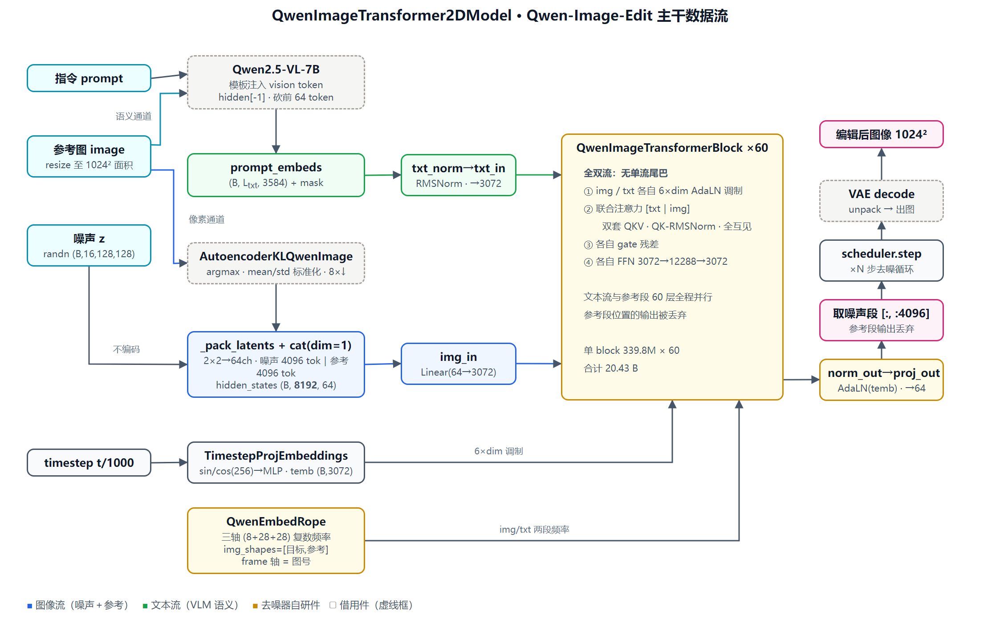

# QwenImageTransformer2DModel 源码精读（Qwen-Image-Edit）

> 范围：**只精读去噪器 `QwenImageTransformer2DModel` 本体**，以及它直接依赖的双流注意力 processor、三轴 RoPE、AdaLN 调制原语；再看 **Qwen-Image-Edit 把参考图"喂进"这个去噪器的两条通道**（prompt 通道 + latent 通道）。
>
> Qwen2.5-VL 文本编码器 / Qwen-Image VAE / FlowMatch 调度器都是借用件，压到 §11 一节带过。
>
> 代码全部是**从源码逐字切出来的原文**（含原注释原缩进），展开即可读。行号对应 **diffusers v0.40.0**（本机 `linkquant` 环境实装版本）的以下三个文件：
>
> | 文件 | 内容 |
> |---|---|
> | `src/diffusers/models/transformers/transformer_qwenimage.py` | 去噪器本体（1031 行），下文简称 `transformer_qwenimage.py` |
> | `src/diffusers/pipelines/qwenimage/pipeline_qwenimage_edit.py` | Edit pipeline（852 行），下文简称 `pipeline_qwenimage_edit.py` |
> | `src/diffusers/models/normalization.py` / `attention.py` | `AdaLayerNormContinuous` / `FeedForward` 等公共件 |
>
> 精读的权重是 `Qwen/Qwen-Image-Edit`（初版 Edit）。它的 `transformer/config.json` 与 2509 版**逐字节相同**——两代 Edit 共用同一个去噪器结构，差异全在条件侧（§10）。



---

## 1. 先记住三件事

1. **它是「60 层全双流」的标准 MMDiT，没有单流尾巴。** FLUX 是 19 双流 + 38 单流、Boogu 是 8 双流 + 32 单流，Qwen-Image 则是 60 层一模一样的双流 block：文本流和图像流**每一层都完整地并行走完**自己的调制、注意力（联合）、FFN。文本流不是"用完即丢"的 prompt 编码，而是和图像流一起被精修 60 遍的"第二条序列"。
2. **编辑能力不在去噪器里，在"怎么喂"里。** 去噪器对"编辑"零感知：它的 `in_channels` 仍是 64，参考图既**不进通道维**（不像 SD 式 concat 到通道上），而是与噪声 token **在序列维拼接**后从同一个 `img_in` 进网络；同时参考图还以**另一种身份**——Qwen2.5-VL 的视觉输入——混进 prompt embedding。一张参考图走两条通道进模型（§2 的架构图）。
3. **三轴 RoPE 的 frame 轴是"第几张图"的开关。** 每个图像 token 的位置是 `(frame, height, width)` 三元组，Edit 的 `img_shapes` 传两个条目：目标图 `frame=0`、参考图 `frame=1`。参考图的宽高索引与目标图**同起点**（各自从 0 铺开、中心对称），模型靠 frame 轴区分"这是待去的噪"还是"这是参考"——对齐靠这个，换姿势/平移也会破坏这个对齐（这是它做不了大位移编辑的结构原因之一）。

### 参数量账本（meta 设备实例化实测，非估算）

按发布 `config.json` 在 meta 设备实例化 `QwenImageTransformer2DModel` 后逐模块 `sum(p.numel())`：

| 模块 | Linear 数 | 权重参数 | 占比 |
|---|---:|---:|---:|
| transformer_blocks ×60 | 840 | 20,389,877,760 | 99.80% |
| norm_out（AdaLayerNormContinuous） | 1 | 18,880,512 | 0.09% |
| time_text_embed | 2 | 10,229,760 | 0.05% |
| txt_in | 1 | 11,013,120 | 0.05% |
| img_in | 1 | 199,680 | 0.001% |
| proj_out | 1 | 196,672 | 0.001% |
| txt_norm（RMSNorm） | 0 | 3,584 | ~0% |
| pos_embed（RoPE 频率表） | 0 | 0 | 0% |
| **合计** | **846** | **20,430,401,088** | 100% |

**单个 block 的账本**（×60 即上表第一行）：

| 子模块 | Linear 数 | 参数量 | 说明 |
|---|---:|---:|---|
| `attn` | 8 | 75,522,560 | 双流各自 QKV + 双 out proj（8×9.44M）+ 4 个 head_dim=128 的 QK RMSNorm（512） |
| `img_mlp` | 2 | 75,512,832 | 3072→12288→3072 |
| `txt_mlp` | 2 | 75,512,832 | 同上，规格完全相同 |
| `img_mod` | 1 | 56,641,536 | 3072→18432（6×dim） |
| `txt_mod` | 1 | 56,641,536 | 同上 |
| 4×LayerNorm | 0 | ~0 | `elementwise_affine=False`，无参数 |
| **单 block 合计** | **14** | **339,831,296** | |

总参数 **20,430,401,088 ≈ 20.43 B**（BF16 ≈ 40.86 GB，与 HF 仓库 9 个 safetensors 分片实测 40.86 GB 精确吻合）。注意力与 FFN 各占 block 的 22.2%，**两个调制 Linear 合占 33.3%**——全双流意味着 60 层每层都要付两份 6×dim 的调制账（120 个调制 Linear 合计 3.40 B，占总参数 16.6%；对照 FLUX：双流层只用 1 份 6×dim 调制、且仅 19 层有，单流层的调制 Linear 只有 1×2×dim，全模型调制占比 12.0%）。60 层无任何结构变化，没有一层是特殊的。

---

## 2. 实测超参

以发布权重 `Qwen/Qwen-Image-Edit` 的 `transformer/config.json` 为准（巧的是，与源码 `__init__` 默认值全部一致——Boogu 那篇"默认值是占位别信"的教训在这里不适用，但习惯仍然保留）：

```json
{
  "_class_name": "QwenImageTransformer2DModel",
  "_diffusers_version": "0.35.0.dev0",
  "attention_head_dim": 128,
  "axes_dims_rope": [16, 56, 56],
  "guidance_embeds": false,
  "in_channels": 64,
  "joint_attention_dim": 3584,
  "num_attention_heads": 24,
  "num_layers": 60,
  "out_channels": 16,
  "patch_size": 2
}
```

| 超参 | 值 | 含义 |
|---|---:|---|
| `num_layers` | 60 | 双流 block 层数，全部同构 |
| `num_attention_heads` × `attention_head_dim` | 24 × 128 | **`inner_dim = 3072`**（模型内部隐宽，源码里是 `num_attention_heads * attention_head_dim` 算出来的，不是配置项） |
| FFN 隐宽 | 12288 | `FeedForward` 默认 mult=4，3072×4 |
| `joint_attention_dim` | 3584 | 文本流入维 = Qwen2.5-VL-7B 的 hidden_size，**不是凑数**：prompt embedding 直接进 `txt_in` |
| `in_channels` | 64 | = VAE `z_dim` 16 × patch 2×2，"2×2 latent patch 拍平成 token"的标准做法；**参考图不额外加通道** |
| `out_channels` | 16 | `proj_out` 输出 3072→`patch²×out_channels`=64，解包后是 16 通道 latent |
| `axes_dims_rope` | (16, 56, 56) | frame / height / width 三轴的**实数维**，各除 2 得复数对：8+28+28=64=128/2 |
| `guidance_embeds` | false | 发布模型不是 guidance-distilled；`true_cfg_scale` 走双 forward（§11） |
| `zero_cond_t` / `use_additional_t_cond` / `use_layer3d_rope` | 均不在 config 中（默认 false） | 三个"家族开关"，Edit 全关；谁在用见 §6.4、§7.4、§10 |

一个对照着看就懂的设计：**隐宽 3072 只有 FLUX（3072）同级、比 Boogu（3360）略小，但层数 60 是 FLUX（57）的邻级**——参数大头全押在"深"而宽不宽的 60 层双流上。
---

## 3. 骨架：`__init__` 建了什么

`transformer_qwenimage.py` L859-909：

<details>
<summary>QwenImageTransformer2DModel.__init__ 原文（L859-909）</summary>

```python
    @register_to_config
    def __init__(
        self,
        patch_size: int = 2,
        in_channels: int = 64,
        out_channels: int | None = 16,
        num_layers: int = 60,
        attention_head_dim: int = 128,
        num_attention_heads: int = 24,
        joint_attention_dim: int = 3584,
        guidance_embeds: bool = False,  # TODO: this should probably be removed
        axes_dims_rope: tuple[int, int, int] = (16, 56, 56),
        zero_cond_t: bool = False,
        use_additional_t_cond: bool = False,
        use_layer3d_rope: bool = False,
    ):
        super().__init__()
        self.out_channels = out_channels or in_channels
        self.inner_dim = num_attention_heads * attention_head_dim

        if not use_layer3d_rope:
            self.pos_embed = QwenEmbedRope(theta=10000, axes_dim=list(axes_dims_rope), scale_rope=True)
        else:
            self.pos_embed = QwenEmbedLayer3DRope(theta=10000, axes_dim=list(axes_dims_rope), scale_rope=True)

        self.time_text_embed = QwenTimestepProjEmbeddings(
            embedding_dim=self.inner_dim, use_additional_t_cond=use_additional_t_cond
        )

        self.txt_norm = RMSNorm(joint_attention_dim, eps=1e-6)

        self.img_in = nn.Linear(in_channels, self.inner_dim)
        self.txt_in = nn.Linear(joint_attention_dim, self.inner_dim)

        self.transformer_blocks = nn.ModuleList(
            [
                QwenImageTransformerBlock(
                    dim=self.inner_dim,
                    num_attention_heads=num_attention_heads,
                    attention_head_dim=attention_head_dim,
                    zero_cond_t=zero_cond_t,
                )
                for _ in range(num_layers)
            ]
        )

        self.norm_out = AdaLayerNormContinuous(self.inner_dim, self.inner_dim, elementwise_affine=False, eps=1e-6)
        self.proj_out = nn.Linear(self.inner_dim, patch_size * patch_size * self.out_channels, bias=True)

        self.gradient_checkpointing = False
        self.zero_cond_t = zero_cond_t
```

</details>

组装全景（对照 Boogu 篇的骨架记法）：

```
QwenImageTransformer2DModel
├── pos_embed        QwenEmbedRope          # 三轴复数 RoPE 频率表，0 参数（全是 buffer/缓存）
├── time_text_embed  QwenTimestepProjEmbeddings
│   ├── time_proj         Timesteps(256, flip_sin_to_cos=True, scale=1000)   # 无参
│   └── timestep_embedder TimestepEmbedding(256→3072→3072)                   # 2 Linear
├── txt_norm         RMSNorm(3584)          # 注意：作用在 VLM 输出上，在 txt_in 之前
├── img_in           Linear(64 → 3072)      # 噪声 token + 参考图 token 共用
├── txt_in           Linear(3584 → 3072)    # VLM 最后一层 hidden states 的投影
├── transformer_blocks ×60  QwenImageTransformerBlock   # §5 逐个拆
├── norm_out         AdaLayerNormContinuous(3072 | cond=3072)  # 1 Linear(3072→6144)
└── proj_out         Linear(3072 → 64)      # patch²×out_channels
```

三个一眼可见的结构判断：

1. **没有 patch embed 层。** `img_in` 是个普通 Linear(64→3072)，2×2 的 patch 化早在 pipeline 侧用 `_pack_latents` 的 view/permute 完成（§4.1），模型内部不存在卷积 patchify——这与 FLUX/Boogu 的 `x_embedder` 同款思路。
2. **`txt_norm` 挂在主干上而不是 block 里。** VLM 出来的 hidden states 先做一遍 RMSNorm(3584) 再进 `txt_in`。这是接 LLM 系编码器的通用补丁：LLM 末层范数量级大且各向异性，不先归一化会把 `txt_in` 的输出尺度带偏。
3. **12 个 `*_embed`/`in/out` 外壳件合计只占 0.2% 参数**，全部戏份在 60 层 block。

---

## 4. 输入侧：参考图到底怎么进网络

这一节是 Edit 篇区别于文生图篇的核心。答案分两条通道，都在 pipeline 里，去噪器毫不知情。

### 4.1 像素通道：VAE latent 在序列维拼到噪声后面

`pipeline_qwenimage_edit.py` L429-482（`prepare_latents`，删去报错分支）：

```python
    def prepare_latents(self, image, batch_size, num_channels_latents, height, width,
                        dtype, device, generator, latents=None):
        # VAE applies 8x compression on images but we must also account for packing which requires
        # latent height and width to be divisible by 2.
        height = 2 * (int(height) // (self.vae_scale_factor * 2))
        width = 2 * (int(width) // (self.vae_scale_factor * 2))

        shape = (batch_size, 1, num_channels_latents, height, width)

        image_latents = None
        if image is not None:
            image = image.to(device=device, dtype=dtype)
            if image.shape[1] != self.latent_channels:
                image_latents = self._encode_vae_image(image=image, generator=generator)
            else:
                image_latents = image
            ...
            image_latent_height, image_latent_width = image_latents.shape[3:]
            image_latents = self._pack_latents(
                image_latents, batch_size, num_channels_latents, image_latent_height, image_latent_width
            )

        if latents is None:
            latents = randn_tensor(shape, generator=generator, device=device, dtype=dtype)
            latents = self._pack_latents(latents, batch_size, num_channels_latents, height, width)
        else:
            latents = latents.to(device=device, dtype=dtype)

        return latents, image_latents
```

注意 `image` 要先过 `self.image_processor.resize(...)` 到**目标图的宽高**（L662）再编码——参考图的 latent 网格和目标图**逐位对齐**，为后文 RoPE 的坐标对齐埋伏笔。`_encode_vae_image`（L406-427）取 `sample_mode="argmax"`（即 VAE 后验均值，**编辑任务的参考图不采噪**），并用 `latents_mean/latents_std` 逐通道标准化。

`_pack_latents`（L382-387）把 `(B, 16, H, W)` 变成 `(B, (H/2)·(W/2), 64)`：

```python
    def _pack_latents(latents, batch_size, num_channels_latents, height, width):
        latents = latents.view(batch_size, num_channels_latents, height // 2, 2, width // 2, 2)
        latents = latents.permute(0, 2, 4, 1, 3, 5)
        latents = latents.reshape(batch_size, (height // 2) * (width // 2), num_channels_latents * 4)
        return latents
```

然后在去噪循环里，**序列维 cat**（`__call__` L765-767）：

```python
                latent_model_input = latents
                if image_latents is not None:
                    latent_model_input = torch.cat([latents, image_latents], dim=1)
```

`dim=1` 是 token 维。1024² 目标图 + 同尺寸参考图 ⇒ 进网络的 `hidden_states` 是 `(B, 4096+4096, 64)`——**通道维始终 64，`in_channels` 不需要为 Edit 改**。输出取回时也照样砍头（L782）：

```python
                    noise_pred = noise_pred[:, : latents.size(1)]
```

噪声段在前、参考段在后，取前 4096 个 token 就是干净图需要的速度场。参考段位置的预测值被**直接扔掉**——网络对它做了 60 层无谓的精修，这是序列拼接式编辑方案的固定开销。

### 4.2 语义通道：参考图同时是 VLM 的"看图"输入

`pipeline_qwenimage_edit.py` L212-213，Edit 的 prompt 模板（对比文生图版的纯文本模板）：

```python
        self.prompt_template_encode = "<|im_start|>system\nDescribe the key features of the input image (color, shape, size, texture, objects, background), then explain how the user's text instruction should alter or modify the image. Generate a new image that meets the user's requirements while maintaining consistency with the original input where appropriate.<|im_end|>\n<|im_start|>user\nPicture: <|vision_start|><|image_pad|><|vision_end|>{}<|im_end|>\n<|im_start|>assistant\n"
        self.prompt_template_encode_start_idx = 64
```

`_get_qwen_prompt_embeds`（L225-270）里 `processor(text=txt, images=image, ...)`——**参考图以 `image_pad` 视觉 token 的形式进 Qwen2.5-VL**，取 `outputs.hidden_states[-1]` 后按 mask 掐头，并且**每条序列砍掉前 64 个 token**（`drop_idx`）：那段固定的 system 模板输出不留，只保留从用户内容开始的部分。也就是说，文本流里除了指令文字，还混着参考图的**VLM 语义 token**（一张 384² 缩略图摊成 ~576 个视觉 hidden states）。

### 4.3 一图两走的设计为什么成立

| 通道 | 形态 | 信息 | 进网络的位置 |
|---|---|---|---|
| VLM 语义通道 | 文本流 token | "图里有什么"（可文字化的语义） | `encoder_hidden_states` |
| VAE 像素通道 | 图像流尾部 token | "图长什么样"（像素级保真） | `hidden_states` 后半段 |

去噪器端两者殊途同归：都是 3072 维 token，都参与同一场联合注意力。区别只在**位置编码身份**（§7：VAE token 用三轴空间 RoPE，VLM token 用一维平移 RoPE）和**是否受噪声时间步调制**（都受，见 §5.2 的 `zero_cond_t` 之坑）。
---

## 5. 时间步嵌入与调制（AdaLN）

### 5.1 `QwenTimestepProjEmbeddings`：t 怎么变成 temb

L207-229：

```python
class QwenTimestepProjEmbeddings(nn.Module):
    def __init__(self, embedding_dim, use_additional_t_cond=False):
        super().__init__()

        self.time_proj = Timesteps(num_channels=256, flip_sin_to_cos=True, downscale_freq_shift=0, scale=1000)
        self.timestep_embedder = TimestepEmbedding(in_channels=256, time_embed_dim=embedding_dim)
        self.use_additional_t_cond = use_additional_t_cond
        if use_additional_t_cond:
            self.addition_t_embedding = nn.Embedding(2, embedding_dim)

    def forward(self, timestep, hidden_states, addition_t_cond=None):
        timesteps_proj = self.time_proj(timestep)
        timesteps_emb = self.timestep_embedder(timesteps_proj.to(dtype=hidden_states.dtype))  # (N, D)

        conditioning = timesteps_emb
        if self.use_additional_t_cond:
            if addition_t_cond is None:
                raise ValueError("When additional_t_cond is True, addition_t_cond must be provided.")
            addition_t_emb = self.addition_t_embedding(addition_t_cond)
            addition_t_emb = addition_t_emb.to(dtype=hidden_states.dtype)
            conditioning = conditioning + addition_t_emb

        return conditioning
```

链条：`t/1000`（pipeline 传入前已除，见 §9）→ `×1000`（`Timesteps.scale`）→ 256 维 sin/cos（`flip_sin_to_cos=True`，cos 在前）→ MLP 256→3072→3072 → `temb (B, 3072)`。

两个容易顺手记错的点：
- **`scale=1000` 和 pipeline 的 `timestep / 1000` 互相抵消**——`time_proj` 实际看到的还是 0~1000 量级的 t。这一进一出是 SD3/FLUX 系的祖传写法，单看任何一边都以为"归一化到了 [0,1]"。
- `TimestepEmbedding` 的 SiLU 夹在 **两层 Linear 中间**（`linear_1 → act → linear_2`，`post_act_fn` 默认 None），输出 temb 是裸 Linear 结果，没有出口激活。

### 5.2 block 里的调制：6×dim 的用途切分

`QwenImageTransformerBlock.__init__`（L632-681）建了 **`img_mod` 和 `txt_mod` 两个 `SiLU+Linear(dim, 6*dim)`**。6 份输出的消费方式在 forward（L719-788，删去 gradient-checkpointing 与 controlnet 分支）：

```python
    def forward(
        self,
        hidden_states: torch.Tensor,
        encoder_hidden_states: torch.Tensor,
        encoder_hidden_states_mask: torch.Tensor,
        temb: torch.Tensor,
        image_rotary_emb: tuple[torch.Tensor, torch.Tensor] | None = None,
        joint_attention_kwargs: dict[str, Any] | None = None,
        modulate_index: list[int] | None = None,
    ) -> tuple[torch.Tensor, torch.Tensor]:
        # Get modulation parameters for both streams
        img_mod_params = self.img_mod(temb)  # [B, 6*dim]

        if self.zero_cond_t:
            temb = torch.chunk(temb, 2, dim=0)[0]
        txt_mod_params = self.txt_mod(temb)  # [B, 6*dim]

        # Split modulation parameters for norm1 and norm2
        img_mod1, img_mod2 = img_mod_params.chunk(2, dim=-1)  # Each [B, 3*dim]
        txt_mod1, txt_mod2 = txt_mod_params.chunk(2, dim=-1)  # Each [B, 3*dim]

        # Process image stream - norm1 + modulation
        img_normed = self.img_norm1(hidden_states)
        img_modulated, img_gate1 = self._modulate(img_normed, img_mod1, modulate_index)

        # Process text stream - norm1 + modulation
        txt_normed = self.txt_norm1(encoder_hidden_states)
        txt_modulated, txt_gate1 = self._modulate(txt_normed, txt_mod1)

        ...
        attn_output = self.attn(
            hidden_states=img_modulated,  # Image stream (will be processed as "sample")
            encoder_hidden_states=txt_modulated,  # Text stream (will be processed as "context")
            encoder_hidden_states_mask=encoder_hidden_states_mask,
            image_rotary_emb=image_rotary_emb,
            **joint_attention_kwargs,
        )

        # QwenAttnProcessor2_0 returns (img_output, txt_output) when encoder_hidden_states is provided
        img_attn_output, txt_attn_output = attn_output

        # Apply attention gates and add residual (like in Megatron)
        hidden_states = hidden_states + img_gate1 * img_attn_output
        encoder_hidden_states = encoder_hidden_states + txt_gate1 * txt_attn_output

        # Process image stream - norm2 + MLP
        img_normed2 = self.img_norm2(hidden_states)
        img_modulated2, img_gate2 = self._modulate(img_normed2, img_mod2, modulate_index)
        img_mlp_output = self.img_mlp(img_modulated2)
        hidden_states = hidden_states + img_gate2 * img_mlp_output

        # Process text stream - norm2 + MLP
        txt_normed2 = self.txt_norm2(encoder_hidden_states)
        txt_modulated2, txt_gate2 = self._modulate(txt_normed2, txt_mod2)
        txt_mlp_output = self.txt_mlp(txt_modulated2)
        encoder_hidden_states = encoder_hidden_states + txt_gate2 * txt_mlp_output

        # Clip to prevent overflow for fp16
        if encoder_hidden_states.dtype == torch.float16:
            encoder_hidden_states = encoder_hidden_states.clip(-65504, 65504)
        if hidden_states.dtype == torch.float16:
            hidden_states = hidden_states.clip(-65504, 65504)

        return encoder_hidden_states, hidden_states
```

`6×dim = shift + scale + gate`（对应 norm1/norm2 两组，`chunk(2)` 先分 pre-attn / pre-MLP，`_modulate` 内再 `chunk(3)`）。调制公式是 `x·(1+scale)+shift`，gate 乘在残差分支输出上——标准 DiT adaLN-zero 谱系，只是**图像流、文本流各吃各的一套 6 份**（FLUX 单流层只有 1 套）。

**结构上与 FLUX/SD3 不同的两处**：
1. 文本流有完整的 norm2+MLP+gate——SD3/FLUX 的 MM-double 层同样如此，但 Qwen 的**所有 60 层**都如此，文本表征在深层仍在被 FFN 精修；
2. 残差写法 `x + gate*attn(x)` 中 attention 的输入是**调制后**的 norm1 输出，而 norm1 是 `elementwise_affine=False` 的裸 LayerNorm——仿射全部由调制承担，没有冗余参数。

`_modulate` 的 `index` 分支（L683-717，`zero_cond_t` 专用）：

```python
    def _modulate(self, x, mod_params, index=None):
        """Apply modulation to input tensor"""
        # x: b l d, shift: b d, scale: b d, gate: b d
        shift, scale, gate = mod_params.chunk(3, dim=-1)

        if index is not None:
            # Assuming mod_params batch dim is 2*actual_batch (chunked into 2 parts)
            # So shift, scale, gate have shape [2*actual_batch, d]
            actual_batch = shift.size(0) // 2
            shift_0, shift_1 = shift[:actual_batch], shift[actual_batch:]  # each: [actual_batch, d]
            ...
            # index: [b, l] where b is actual batch size
            index_expanded = index.unsqueeze(-1)  # [b, l, 1]
            ...
            shift_result = torch.where(index_expanded == 0, shift_0_exp, shift_1_exp)
            scale_result = torch.where(index_expanded == 0, scale_0_exp, scale_1_exp)
            gate_result = torch.where(index_expanded == 0, gate_0_exp, gate_1_exp)
        else:
            shift_result = shift.unsqueeze(1)
            scale_result = scale.unsqueeze(1)
            gate_result = gate.unsqueeze(1)

        return x * (1 + scale_result) + shift_result, gate_result
```

机理：`zero_cond_t=True` 时（forward L963-969）timestep 被复制成 `[t, 0]` 两半拼 batch，得到两套调制参数；`modulate_index` 是一张 `[B, L_img]` 的 0/1 表——**噪声段 token 用 t 的调制、条件图 token 用 t=0 的调制**——`torch.where` 逐 token 选边。语义是"参考图是干净图，它不该感受噪声水平"。

> **容易看错的行为 ①**：`zero_cond_t` 在 `__init__` 里有完整参数通路，但**初版 Edit、2509、连 Layered 的发布 config 里它都是 false**（Layered 打开的是另外两个开关：`use_layer3d_rope` 与 `use_additional_t_cond`，§7.4/§11）。也就是说 Qwen-Image-Edit 的参考图 token **和噪声 token 吃同一套 t 调制**——"干净条件零调制"这条路 block 里代码现成，但整个已发布的 Edit 家族没有启用。结构代码只保证"能用"，用不用是训练配方定的。

### 5.3 norm_out：出口只有一个 AdaLN

出口没有第二道门：`norm_out = AdaLayerNormContinuous(3072, cond=3072, elementwise_affine=False)`，内部 `Linear(3072→6144)` 出 `scale/shift` 两份（normalization.py L346-351）：

```python
    def forward(self, x: torch.Tensor, conditioning_embedding: torch.Tensor) -> torch.Tensor:
        # convert back to the original dtype in case `conditioning_embedding`` is upcasted to float32 (needed for hunyuanDiT)
        emb = self.linear(self.silu(conditioning_embedding).to(x.dtype))
        scale, shift = torch.chunk(emb, 2, dim=1)
        x = self.norm(x) * (1 + scale)[:, None, :] + shift[:, None, :]
        return x
```

`zero_cond_t=True` 时 temb 前 2B 的账在这里平掉（forward L1022-1023）：`temb = temb.chunk(2, dim=0)[0]`——出口只取 t 那一半，**不管噪声段还是参考段，出口统一按 t 调制**（发布模型此路径关闭，这段是空转逻辑）。
---

## 6. 双流注意力 processor：`QwenDoubleStreamAttnProcessor2_0`

一个 block 的注意力只有一个 `Attention` 模块，但**两套投影**：图像流 `to_q/to_k/to_v` + 文本流 `add_q_proj/add_k_proj/add_v_proj`，各自 3072→3072。`QwenDoubleStreamAttnProcessor2_0.__call__`（L530-629）全文（删 docstring）：

<details>
<summary>processor 原文（L530-629）</summary>

```python
    def __call__(
        self,
        attn: Attention,
        hidden_states: torch.FloatTensor,  # Image stream
        encoder_hidden_states: torch.FloatTensor = None,  # Text stream
        encoder_hidden_states_mask: torch.FloatTensor = None,
        attention_mask: torch.FloatTensor | None = None,
        image_rotary_emb: torch.Tensor | None = None,
    ) -> torch.FloatTensor:
        if encoder_hidden_states is None:
            raise ValueError("QwenDoubleStreamAttnProcessor2_0 requires encoder_hidden_states (text stream)")

        if attention_mask is not None:
            raise ValueError(
                "QwenDoubleStreamAttnProcessor2_0 does not accept an external attention_mask. "
                "Pass encoder_hidden_states_mask to let the processor build the joint mask."
            )

        if encoder_hidden_states_mask is not None:
            seq_img = hidden_states.shape[1]
            image_mask = torch.ones((hidden_states.shape[0], seq_img), dtype=torch.bool, device=hidden_states.device)
            attention_mask = torch.cat([encoder_hidden_states_mask, image_mask], dim=1)
            attention_mask = attention_mask[:, None, None, :]

        seq_txt = encoder_hidden_states.shape[1]

        # Compute QKV for image stream (sample projections)
        img_query = attn.to_q(hidden_states)
        img_key = attn.to_k(hidden_states)
        img_value = attn.to_v(hidden_states)

        # Compute QKV for text stream (context projections)
        txt_query = attn.add_q_proj(encoder_hidden_states)
        txt_key = attn.add_k_proj(encoder_hidden_states)
        txt_value = attn.add_v_proj(encoder_hidden_states)

        # Reshape by a fixed `head_dim` and let `-1` absorb the head count. Under tensor parallelism each rank
        # holds a column-sharded slice (`attn.heads // tp_degree` heads); this keeps the processor TP-agnostic.
        # The shared Attention has no `head_dim` attribute; derive it from the unsharded `inner_dim`/`heads`.
        head_dim = attn.inner_dim // attn.heads
        img_query = img_query.unflatten(-1, (-1, head_dim))
        img_key = img_key.unflatten(-1, (-1, head_dim))
        img_value = img_value.unflatten(-1, (-1, head_dim))

        txt_query = txt_query.unflatten(-1, (-1, head_dim))
        txt_key = txt_key.unflatten(-1, (-1, head_dim))
        txt_value = txt_value.unflatten(-1, (-1, head_dim))

        # Apply QK normalization
        if attn.norm_q is not None:
            img_query = attn.norm_q(img_query)
        if attn.norm_k is not None:
            img_key = attn.norm_k(img_key)
        if attn.norm_added_q is not None:
            txt_query = attn.norm_added_q(txt_query)
        if attn.norm_added_k is not None:
            txt_key = attn.norm_added_k(txt_key)

        # Apply RoPE
        if image_rotary_emb is not None:
            img_freqs, txt_freqs = image_rotary_emb
            apply_rope = ROPE_PER_DEVICE.get(img_query.device.type, ROPE_PER_DEVICE["cuda"])
            img_query = apply_rope(img_query, img_freqs)
            img_key = apply_rope(img_key, img_freqs)
            txt_query = apply_rope(txt_query, txt_freqs)
            txt_key = apply_rope(txt_key, txt_freqs)

        # Concatenate for joint attention
        # Order: [text, image]
        joint_query = torch.cat([txt_query, img_query], dim=1)
        joint_key = torch.cat([txt_key, img_key], dim=1)
        joint_value = torch.cat([txt_value, img_value], dim=1)

        joint_hidden_states = dispatch_attention_fn(
            joint_query,
            joint_key,
            joint_value,
            attn_mask=attention_mask,
            dropout_p=0.0,
            is_causal=False,
            backend=self._attention_backend,
            parallel_config=self._parallel_config,
        )

        # Reshape back
        joint_hidden_states = joint_hidden_states.flatten(2, 3)
        joint_hidden_states = joint_hidden_states.to(joint_query.dtype)

        # Split attention outputs back
        txt_attn_output = joint_hidden_states[:, :seq_txt, :]  # Text part
        img_attn_output = joint_hidden_states[:, seq_txt:, :]  # Image part

        # Apply output projections
        img_attn_output = attn.to_out[0](img_attn_output.contiguous())
        if len(attn.to_out) > 1:
            img_attn_output = attn.to_out[1](img_attn_output)  # dropout

        txt_attn_output = attn.to_add_out(txt_attn_output.contiguous())

        return img_attn_output, txt_attn_output
```

</details>

流程要点：

1. **QK RMSNorm 在 head 维上**：`norm_q` 等是 `RMSNorm(head_dim=128)`，对每头每 token 的 128 维做归一（4 套权重共 512 个参数）。这是"QK-norm 稳训练"流派（SD3 同款），和 Boogu 从 Lumina2 借的 RMSNorm+门控调制是两个谱系。
2. **RoPE 在拼接之前、各流各表**：`image_rotary_emb` 是 `(img_freqs, txt_freqs)` 二元组，图像段用三轴表、文本段用一维表（§7），旋转完才 `cat([txt, img])`。**联合序列的秩序是"文本在前、图像在后"**——与 `hidden_states` 输入时"噪声在前、参考在后"的图像流内部秩序正好嵌套：`[txt | 噪声 | 参考]`。出口切分 `[:, :seq_txt]`/`[:, seq_txt:]` 只切文本/图像两大段，图像段内部不再动。
3. **无输出 bias**：两个 out proj 都来自 `Attention(bias=True)`，但 `to_out.0`/`to_add_out` 都是 3072→3072 的普通 Linear（bias 实测存在）——与 FLUX 的无 bias out proj 不同，账本里已计入。
4. **`is_causal=False` 全场可见**：文本 token 能看全部图像 token，噪声段能看参考段，参考段也能看噪声段（它在被"污染"的图里当清洁工）。没有任何块状掩码保护参考段——参考段位置的输出反正被丢弃，无所谓。

> **容易看错的行为 ②**：processor 拒收外部 `attention_mask`，只接受 `encoder_hidden_states_mask` 并**自己拼一张全 1 的图像段掩码**（L548-552）。后果：padding 只可能来自文本段的 VLM 输出；而 §4.2 的 pipeline 已经把每条样本的有效段裁出来右补零了，所以掩码是规整的"左真右假"。但 transformer 侧的 `compute_text_seq_len_from_mask`（L177-204）专门写了**任意掩码模式**的 per-sample 长度计算——为将来"中间挖洞"的 mask 留了口子，目前调用方没人用。

> **容易看错的行为 ③**：out proj 用的是 `attn.to_out[0]` 且判 `len(attn.to_out) > 1` 才调 dropout——`Attention` 默认 `dropout=0.0` 时 `to_out` 里确实有 nn.Dropout 占位，所以这个分支永远走但永远恒等。读代码时别以为推理跳过了它。

---

## 7. 三轴 RoPE：`QwenEmbedRope`

### 7.1 频率表：4096 个正位置 + 4096 个负位置

`__init__`（L233-256）预计算两张复数频率表：

```python
        pos_index = torch.arange(4096)
        neg_index = torch.arange(4096).flip(0) * -1 - 1
```

`rope_params`（L258-266）对每个轴独立生成 `outer(index, 1/theta^(2i/dim))` 后 `torch.polar` 直接产出复数 `e^{i·θ}`——**这张表存的就是旋转因子本身**，不是角度。三轴拼接后每 token `8+28+28=64` 个复数 = 128 实数 = 一个 head_dim。

### 7.2 forward：返回的是"两段表"，不是一段

`forward`（L278-333，删批量校验警告分支）：

```python
        if isinstance(video_fhw, list):
            video_fhw = video_fhw[0]
        if not isinstance(video_fhw, list):
            video_fhw = [video_fhw]

        vid_freqs = []
        max_vid_index = 0
        for idx, fhw in enumerate(video_fhw):
            frame, height, width = fhw
            # RoPE frequencies are cached via a lru_cache decorator on _compute_video_freqs
            video_freq = self._compute_video_freqs(frame, height, width, idx, device)
            vid_freqs.append(video_freq)

            if self.scale_rope:
                max_vid_index = max(height // 2, width // 2, max_vid_index)
            else:
                max_vid_index = max(height, width, max_vid_index)

        max_txt_seq_len_int = int(max_txt_seq_len)
        # Use cached device-transferred freqs to avoid CPU→GPU sync every forward call
        pos_freqs_device, _ = self._get_device_freqs(device)
        txt_freqs = pos_freqs_device[max_vid_index : max_vid_index + max_txt_seq_len_int, ...]
        vid_freqs = torch.cat(vid_freqs, dim=0)

        return vid_freqs, txt_freqs
```

`video_fhw` 就是 pipeline 的 `img_shapes`——**Edit 传两个条目**（目标图 + 参考图，§4、§9），循环把两段的频率表按序 `cat`，与图像流 token 的排列 `[噪声段 | 参考段]` 严格同构。

### 7.3 `_compute_video_freqs`：中心对称的宽高 + "第几张图"的 frame 轴

L335-358：

```python
    @lru_cache_unless_export(maxsize=128)
    def _compute_video_freqs(
        self, frame: int, height: int, width: int, idx: int = 0, device: torch.device = None
    ) -> torch.Tensor:
        seq_lens = frame * height * width
        pos_freqs, neg_freqs = (
            self._get_device_freqs(device) if device is not None else (self.pos_freqs, self.neg_freqs)
        )

        freqs_pos = pos_freqs.split([x // 2 for x in self.axes_dim], dim=1)
        freqs_neg = neg_freqs.split([x // 2 for x in self.axes_dim], dim=1)

        freqs_frame = freqs_pos[0][idx : idx + frame].view(frame, 1, 1, -1).expand(frame, height, width, -1)
        if self.scale_rope:
            freqs_height = torch.cat([freqs_neg[1][-(height - height // 2) :], freqs_pos[1][: height // 2]], dim=0)
            freqs_height = freqs_height.view(1, height, 1, -1).expand(frame, height, width, -1)
            freqs_width = torch.cat([freqs_neg[2][-(width - width // 2) :], freqs_pos[2][: width // 2]], dim=0)
            freqs_width = freqs_width.view(1, 1, width, -1).expand(frame, height, width, -1)
        else:
            ...
```

三行三种性格：

- **frame 轴**：`freqs_pos[0][idx : idx+frame]`——`idx` 是"第几个 fhw 条目"，Edit 里目标图取位置 0、参考图取位置 1。对单图（frame=1）而言，**frame 轴的数值就是"第几张图"的 ID**，这就是"RoPE 偏移"的全部实现；同一张图内部所有 token 的 frame 坐标相同。
- **height/width 轴（`scale_rope=True`）**：负表拼正表 `[-H/2..-1 | 0..H/2-1]`——坐标**以图心为原点**。这招来自 3D 视频生成的插帧场景（相邻帧窗口对称），Edit 白捡的好处是：两张同尺寸图的**同坐标 token 宽高相位完全相同**，空间对齐零成本。
- **文本流**：`txt_freqs = pos_freqs_device[max_vid_index : ...]`——从图像用剩的位置继续排（取 `max(H/2, W/2)` 再往后），一维递增。文本在 RoPE 空间里"住在图像右上方的延长线上"。

> **容易看错的行为 ④**：`forward` 开头 `if isinstance(video_fhw, list): video_fhw = video_fhw[0]`（L309-310）——外层 list 是 **batch 维**（pipeline `img_shapes = [ [...两个条目...] ] * batch_size`），取 `[0]` 后才是"条目列表"。多张参考图（Edit-Plus/2509）扩张的是**内层条目数**，外层永远是 batch。两层 list 极易在读调用方代码时搞混。

### 7.4 `QwenEmbedLayer3DRope`：Layered 的变体，一句话

L361-512 是 `QwenEmbedRope` 的近似孪生：frame 轴直接等于层号，**最后一层（条件图）的 frame 坐标强制取负表末位 `-1`**（`_compute_condition_freqs` L491-512）。只有 `use_layer3d_rope=True` 的 `Qwen-Image-Layered` 在用。与 Edit 精读无关，不展开。
---

## 8. forward 全流程（含 shape 推演）

### 8.1 主干 forward

`transformer_qwenimage.py` L911-1031，删去 grad-checkpoint / controlnet / 文档字符串后的骨架（行号保持原文）：

```python
    @apply_lora_scale("attention_kwargs")
    def forward(
        self,
        hidden_states: torch.Tensor,                      # (B, S_img, 64)
        encoder_hidden_states: torch.Tensor = None,        # (B, S_txt, 3584)
        encoder_hidden_states_mask: torch.Tensor = None,   # (B, S_txt)
        timestep: torch.LongTensor = None,                 # (B,)  已是 t/1000
        img_shapes: list[tuple[int, int, int]] | None = None,
        guidance: torch.Tensor = None,
        ...
    ):
        hidden_states = self.img_in(hidden_states)         # (B, S_img, 3072)   L959

        timestep = timestep.to(hidden_states.dtype)        # L961

        if self.zero_cond_t:                               # L963  发布模型=False
            timestep = torch.cat([timestep, timestep * 0], dim=0)
            modulate_index = torch.tensor(
                [[0] * prod(sample[0]) + [1] * sum([prod(s) for s in sample[1:]]) for sample in img_shapes],
                ...
            )
        else:
            modulate_index = None

        encoder_hidden_states = self.txt_norm(encoder_hidden_states)   # L973
        encoder_hidden_states = self.txt_in(encoder_hidden_states)     # L974  (B,S_txt,3072)

        text_seq_len, _, encoder_hidden_states_mask = compute_text_seq_len_from_mask(
            encoder_hidden_states, encoder_hidden_states_mask
        )                                                                # L977

        if guidance is not None:                                         # L981
            guidance = guidance.to(hidden_states.dtype) * 1000

        temb = (                                                          # L984
            self.time_text_embed(timestep, hidden_states, additional_t_cond)
            if guidance is None
            else self.time_text_embed(timestep, guidance, hidden_states, additional_t_cond)
        )

        image_rotary_emb = self.pos_embed(img_shapes, max_txt_seq_len=text_seq_len, device=hidden_states.device)  # L990

        for index_block, block in enumerate(self.transformer_blocks):     # L992  ×60
            encoder_hidden_states, hidden_states = block(
                hidden_states=hidden_states,
                encoder_hidden_states=encoder_hidden_states,
                encoder_hidden_states_mask=encoder_hidden_states_mask,
                temb=temb,
                image_rotary_emb=image_rotary_emb,
                joint_attention_kwargs=attention_kwargs,
                modulate_index=modulate_index,
            )

        if self.zero_cond_t:                                             # L1022
            temb = temb.chunk(2, dim=0)[0]
        # Use only the image part (hidden_states) from the dual-stream blocks
        hidden_states = self.norm_out(hidden_states, temb)               # L1025
        output = self.proj_out(hidden_states)                            # L1026  (B,S_img,64)
        return Transformer2DModelOutput(sample=output)
```

注意 L1006 的返回解包：block 的 return 顺序是 `(encoder_hidden_states, hidden_states)`（L788），**文本流在前返回、图像流在后接收**，形参和实参方向相反——第一次读循环体十有八九会盯错一行。

### 8.2 shape 推演：1024×1024 出图 + 一张同比例参考图

| 阶段 | 张量 | shape | 算式 |
|---|---|---|---|
| 输入图 | — | 1024×1024×3 | pipeline 把目标与参考都 resize 到 `calculate_dimensions(1024², ratio)` |
| VAE latent（各） | `(1,16,128,128)` | 1024/8=128 | `vae_scale_factor=8`（`2^len(temperal_downsample)`，空间向） |
| pack 后（各） | `(1,4096,64)` | (128/2)²、16×4 | §4.1 `_pack_latents` |
| 图像流输入 | `hidden_states` | **(1, 8192, 64)** | `cat([噪声 4096, 参考 4096], dim=1)` |
| 文本流输入 | `encoder_hidden_states` | (1, L, 3584) | VLM 末层 hidden（含 ~数百视觉 token），L=模板裁剪后长度 |
| img_in / txt_in 后 | 各 | (1,8192,3072) / (1,L,3072) | |
| temb | | (1, 3072) | |
| `vid_freqs` | | (8192, 64) 复数 | 4096+4096，与图像 token 一一对应 |
| `txt_freqs` | | (L, 64) 复数 | 起点 `max_vid_index`=64（1024²→latent 128→pack 后 h=w=64，`scale_rope` 取半） |
| 联合注意力序列 | Q/K/V | (1, L+8192, 24, 128) | `[txt \| img]` |
| 每层 block | 双流各自残差 | 不变 | |
| 出口 | `proj_out` 后 | (1, 8192, 64) | |
| 截取 | `noise_pred[:, :4096]` | (1, 4096, 64) | pipeline L782 |
| unpack + VAE decode | | (1,3,1024,1024) | |

注意力开销感受一下：L≈800 时联合序列 ~9000 token，60 层、24 头，每层注意力 O(S²)≈8×10⁷ 对——**参考段把图像算力直接翻倍**，这就是序列拼接式编辑的账单（对比 ControlNet 支路方案只加编码器不加主序列）。

### 8.3 与调度器的接口

`FlowMatchEulerDiscreteScheduler`，`sigmas = linspace(1.0, 1/steps, steps)`，`mu = calculate_shift(image_seq_len=4096, ...)` 做分辨率自适应时间偏移（FLUX 同款 dynamic shifting）。传给 transformer 的是 `timestep = t/1000`（L770-774 展开后在 transformer 里被 `scale=1000` 乘回去，§5.1）。

---

## 9. Edit 调用链：把散件串起来

`pipeline_qwenimage_edit.py::__call__` 的完整时序（行号为 `__call__` 内大致位置）：

```
1.  calculate_dimensions(1024², 参考图宽高比) → 目标/参考统一尺寸          L644-660
2.  image_processor.resize + preprocess，prompt_image = 缩放后参考图      L661-665
3.  encode_prompt(image=prompt_image, prompt=指令)                        L679-687
      └─ VLM 模板（§4.2）→ hidden_states[-1] → 砍前 64 token → 右补零
4.  prepare_latents(...) → latents(噪声段), image_latents(参考段)         L701-711
5.  img_shapes = [ [目标 fhw, 参考 fhw] ] * batch                         L712-717
6.  sigmas / mu / timesteps（dynamic shifting）                           L720-735
7.  去噪循环：                                                             L759-800
      latent_model_input = cat([latents, image_latents], dim=1)           L767
      noise_pred = transformer(...)[0][:, :4096]                          L772-782
      (true_cfg>1 时再来一次 uncond 前向，两路各自包着 cache_context)      L784-799
      scheduler.step(...)
8.  latents 截段 → _unpack_latents → VAE decode → 出图                    L832+
```

`true_cfg_scale` 与 `guidance_embeds` 是两套无关的机制：发布模型 `guidance_embeds=false`，CFG 全靠双前向（顺带 `DynamoCacheMixin` 的 `cache_context("cond"/"uncond")` 给两路各自的 KV 缓存命名空间，纯推理加速件，与结构无关）。

---

## 10. 同族变体速览：Edit → Edit-Plus / 2509

`pipeline_qwenimage_edit_plus.py`（2509 的官方用法）对去噪器**零改动**（§2 已证两份 config 逐字节相同），差异全在条件预处理：

| | Edit（初版） | Edit-Plus / 2509 |
|---|---|---|
| 参考图数量 | 1 | 多张（官方 demo 用 2~3 张；结构上 N 张仅受序列长度约束） |
| 给 VLM 的参考图 | 与 VAE 同图（~1024²） | 独立缩到 **384²**（`CONDITION_IMAGE_SIZE`，L66、L699-702） |
| 给 VAE 的参考图 | ~1024² | 固定 **1024² 面积**（`VAE_IMAGE_SIZE`） |
| 图像流构成 | `[噪声 \| 参考1]` | `[噪声 \| 参考1 \| 参考2 \| ...]`（`all_image_latents` 循环后 `cat(dim=1)`，L468-491） |
| `img_shapes` | 2 条目 | 1+N 条目，frame 轴 0..N |

两条值得记住的设计判断：
1. **VLM 看小图、VAE 看大图**：语义通道对分辨率不敏感（VLM 本来就把图打成 patch），省下的 VLM 算力巨大；像素通道必须保真所以维持 1024²。一条"分通道定预算"的干净示范。
2. 多参考图不改任何 Linear——**MMDiT 的序列维是免费的扩展轴**，这是它相对 U-Net 编辑方案（要改 skip/inject 结构）的结构性优势。

---

## 11. 借用件一节带过

| 件 | 参数量 | 一句话 |
|---|---:|---|
| `Qwen2_5_VLForConditionalGeneration`（text_encoder） | ~7 B | Qwen2.5-VL-7B-Instruct；hidden 3584，28 层，MRoPE `[16,24,24]`；取 `hidden_states[-1]`，指令+视觉 token 混排进文本流 |
| `AutoencoderKLQwenImage`（vae） | 126.9 M | 因果 3D 卷积 WAE：`z_dim=16`、空间 8×、时间 `[F,T,T]` 两组 2×（图像当 1 帧处理，`frame=1`）；编码取后验均值 + 16 通道逐维 `(x-mean)/std` 标准化（mean/std 写死在 config，是权重的一部分认知） |
| `FlowMatchEulerDiscreteScheduler` | 0 | rectified flow + dynamic shifting |
| `Qwen2Tokenizer` + `Qwen2VLProcessor` | 0 | `vocabulary` 151k 级；processor 负责图像→patch 与 `image_pad` 展开 |

### FAQ（读完整篇仍容易带走的错误结论）

- **Q：Edit 版去噪器比文生图版多了一堆"编辑层"？** A：没有。config 逐字节相同，唯一的编辑逻辑是 pipeline 的 `cat(dim=1)` 和 `img_shapes` 多传一个条目。
- **Q：参考图 token 会被去噪吗？** A：网络会给它们产出预测值，但被 `noise_pred[:, :4096]` 丢弃；它们不随 scheduler 更新，全程保持干净。
- **Q：`in_channels=64` 里藏着参考图的通道吗？** A：不。64 = 16 latent ch × 2×2 pack，与文生图完全相同。
- **Q：文本流在深层还有用吗？** A：有，60 层全双流，文本流每层过自己的 mod/MLP；出口只取图像流（L1024 注释原文："Use only the image part"）。
- **Q：想给任意条件图加"零调制"要动结构吗？** A：不用，`zero_cond_t=True` 重新实例化 + 训练时遵守 `img_shapes` 排布即可，代码通路已备好（§5.2）。

---

## 附：本仓库存放约定

- 本文：`docs/posts/LLM/模型架构/Qwen-Image-Edit.md`
- 图：`docs/posts/LLM/模型架构/imgs/qwen-image-transformer-dataflow.png`（源文件 4090:`/home/amax01/lingchen/qwen_image_src/dataflow.html`，改完用 headless Chrome 按 2246×1400 截图重出）
- 源码快照与账本脚本：4090:`/home/amax01/lingchen/qwen_image_src/`（diffusers 0.40.0 摘出 + `qwen_param_ledger.py`，重跑即复现 §1 账本）
