# XJTUSE-Linux实验-NFS、Samba、Apache实验

xjtuser别直接抄我的，仅供参考

非常感谢zhy同学的帮助！！！

## 实验目的

熟练掌握Linux操作系统的使用，掌握Linux系统的NFS和Samba服务的配置和管理。

## 实验要求

完成实验内容并写出实验报告，报告应具有以下内容：

- 实验目的；- 实验内容；- 题目分析及基本设计过程分析；- 配置文件关键修改处的说明及运行情况，应有必要的效果截图；- 实验过程中出现的问题及解决方法；- 实验体会。## 实验内容

1.查看系统的网络情况，确保能够在本地网络中联网通信(给出网络接口配置文件和测试结果)，获知主机的IP地址和主机所在的子网信息。

2.在本机提供NFS服务，请将本地的/home/设为共享目录供指定客户机使用，客户机具有读写权限。给出访问结果。

3.假设本地网络中大部分客户端是windows系统，请建立Samba服务器使得客户端能够共享Linux服务器的资源，具体要求如下：

1)创建一个共享文件夹/home/public，使得所有用户都可以匿名访问(可读写)。

2)每个用户可以访问自己的主目录，且具有完全权限，采用用户验证的方式进行配置；

3)为用户tux和tom创建一个共享目录/home/share，可供这两个用户进行文件的共享(可读写)；

4)测试：使用smbclient客户端程序和windows客户端分别登录Samba服务器，访问服务器中的共享资源。

注：以上所需用户组和用户以及文件夹需要自己创建，并具有适当的权限。实验报告中需要给出配置文件及相关的运行结果。

4.根据以下要求配置Apache服务器：

1)设置Web页面的主目录为/var/www/web；

2)设置Apache监听的端口号为8080；

3)建立一个名为temp的虚拟目录，其对应的物理路径是/var/www/temp，并对该虚拟目录启用用户认证，只允许用户tux和lily访问。

4)允许每个用户拥有自己的个人主页。制作你的个人主页，并给出你的个人主页显示结果。

## 任务一

### 设计思路

查看系统的网络情况可以使用命令ifconfig 使用ping可以测式网络通信

如果没有网络，记得桥接模式

### 展示

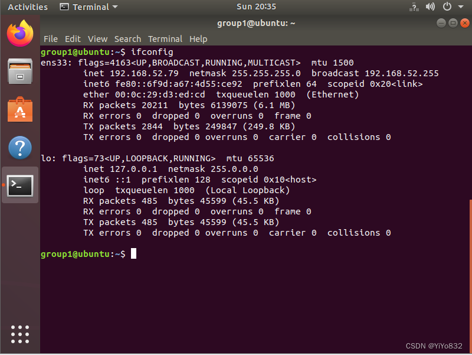

可能需要下载，看命令行提示即可

需要记住自己的IP地址，我的地址是192.168.52.30，下面配置有用

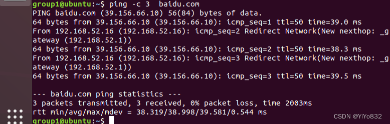

## 任务二

>___<     太难了....

### 设计思路

1.安装nfs环境

`sudo apt-get install nfs-kernel-server`

2.编辑配置文件

`vi /etc/exports`

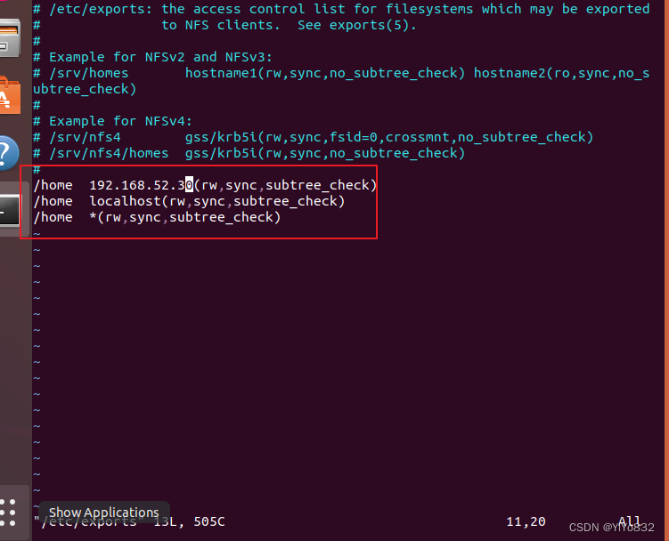

 3.启动服务

`sudo systemctl start nfs-kernel-server`

4.检验

`showmount -e`

5.其他虚拟机进行挂载

命令应该是：

`sudo apt-get install nfs-common
mount -t nfs 192.168.52.30:/home .`

### 展示

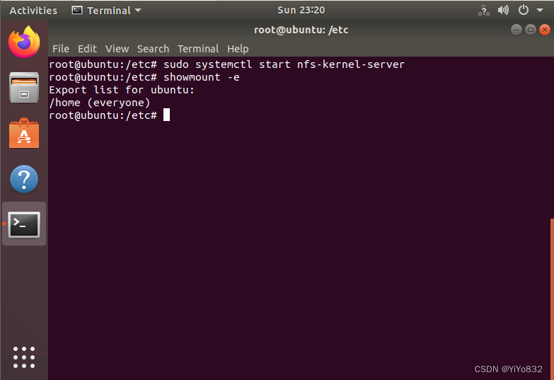挂接：

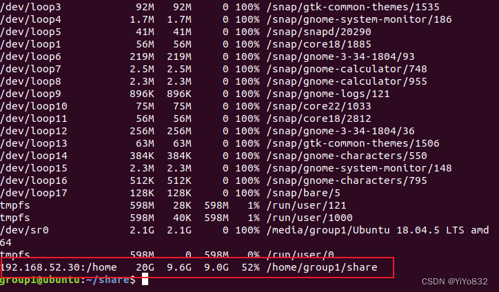

全部完成！

## 任务三

### 设计思路

下面是GPT生成的内容，还算完美

要创建一个满足你描述的要求的 Samba 服务器，你需要按照以下步骤进行配置：

在 Linux 服务器上安装 Samba 服务器软件包。具体的安装命令可能因发行版而异。例如，在基于 Debian 的系统上，你可以使用以下命令安装 Samba：

`sudo apt-get install samba`

编辑 Samba 配置文件 /etc/samba/smb.conf。可以使用任何文本编辑器打开该文件，并添加以下配置：(放在配置文件末尾即可)

`[public]
path = /home/public
writable = yes
guest ok = yes
guest only = yes

[homes]
browseable = no
read only = no
create mode = 0700
directory mode = 0700

[share]
path = /home/share
valid users = tux tom
writable = yes`

上述配置将创建三个共享目录：`public`、`homes` 和 `share`。`public` 目录允许匿名访问，`homes` 目录允许每个用户访问自己的主目录，`share` 目录只允许用户 `tux` 和 `tom` 共享文件。创建共享目录并设置相应的权限。在终端中执行以下命令：

`sudo mkdir /home/public
sudo chmod 777 /home/public

sudo mkdir /home/share
sudo chown tux:tux /home/share
sudo chown tom:tom /home/share
sudo chmod 770 /home/share`

上述命令将创建 `/home/public` 和 `/home/share` 目录，并设置相应的权限，以便满足你的要求。

重启 Samba 服务以使配置生效。使用以下命令重启 Samba 服务：

`sudo service smbd restart`

使用 smbclient 客户端程序和 Windows 客户端分别登录 Samba 服务器，访问共享资源。你可以在 Linux 终端中使用 smbclient 命令，或者在 Windows 上使用资源管理器来访问共享资源。以下是示例命令：

在 Linux 终端中使用 smbclient 访问共享资源：

`smbclient //IP_ADDRESS/SHARE_NAME -U USERNAME`

在 Windows 上使用资源管理器访问共享资源：打开资源管理器，然后在地址栏输入

`\\IP_ADDRESS\SHARE_NAME`

在登录时使用正确的 IP 地址、共享名称和用户名，你应该能够成功访问 Samba 服务器上的共享资源。

### 展示

配置文件

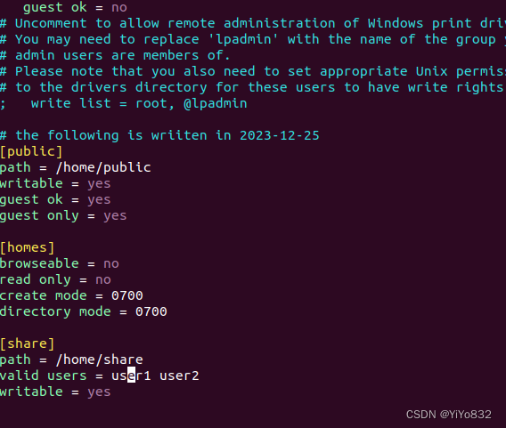

window访问

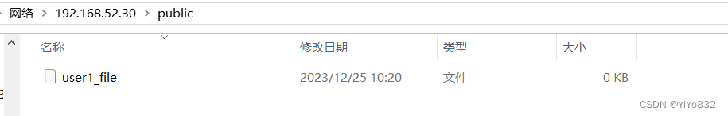

linux访问

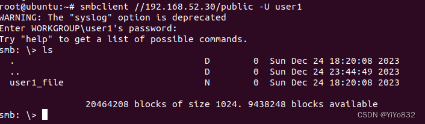

创建用户(这个很重要)

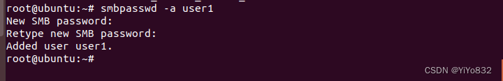

 linux的user1访问

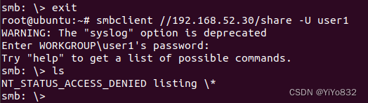

## 任务四

### 设计思路+展示

1.安装Apache服务器：

在终端中执行以下命令安装Apache服务器：

`sudo apt update
sudo apt install apache2`

2.设置Web页面主目录：

默认情况下，Apache的主目录是/var/www/html，你需要将其更改为/var/www/web。执行以下命令

`sudo vi /etc/apache2/sites-available/000-default.conf`

同时添加下面这些

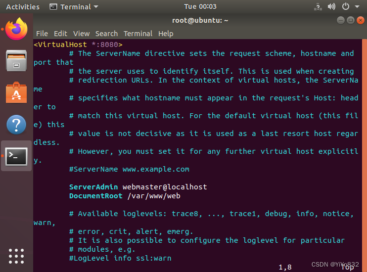

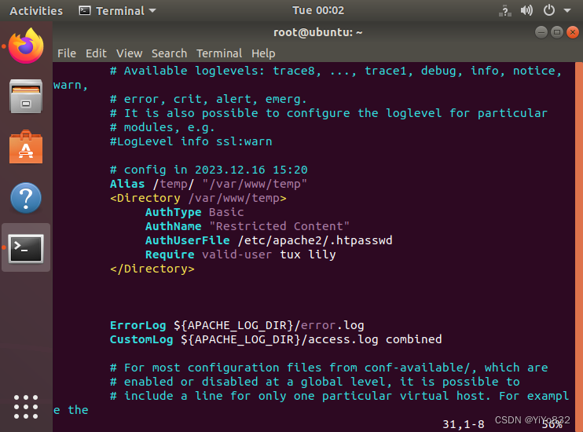

3.设置Apache监听的端口号：

执行以下命令编辑Apache的配置文件：

`sudo vi /etc/apache2/ports.conf`

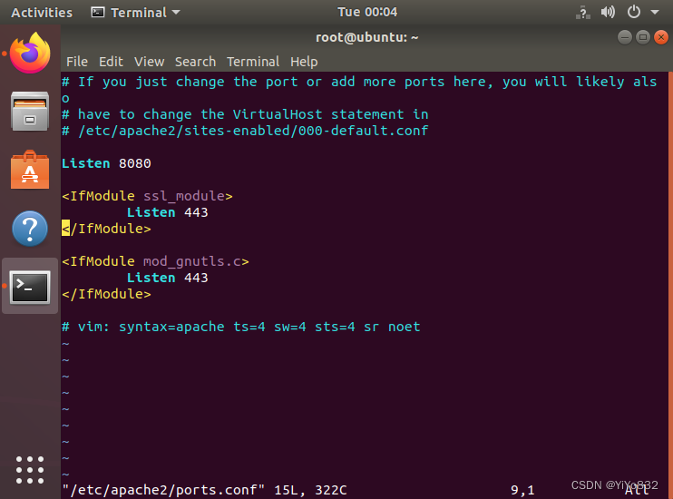

4.创建用户认证文件：

执行以下命令创建用户认证文件，并添加允许访问的用户名和密码：

`sudo htpasswd -c /etc/apache2/.htpasswd tux
sudo htpasswd /etc/apache2/.htpasswd lily
`

可以通过如下命令查看是否添加成功：

`cat /etc/apache2/.htpasswd
`

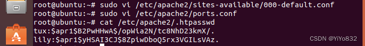

5.创建相应的文件夹，index.html文件

这一部分不给出了，我相信跟着前面的实验做的都会。

这里可以给一个参考的html文件

`<!DOCTYPE html>
<html>
<head>
    <title>Hello</title>
</head>
<body>
    <h1>Hello</h1>
</body>
</html>`

6.还有要给文件夹权限

这一部分不给出，锻炼大家了

7.启用虚拟目录和重启Apache服务器：

执行以下命令启用虚拟目录并重启Apache服务器

`sudo a2ensite 000-default.conf
sudo systemctl restart apache2`

7.浏览器进行访问

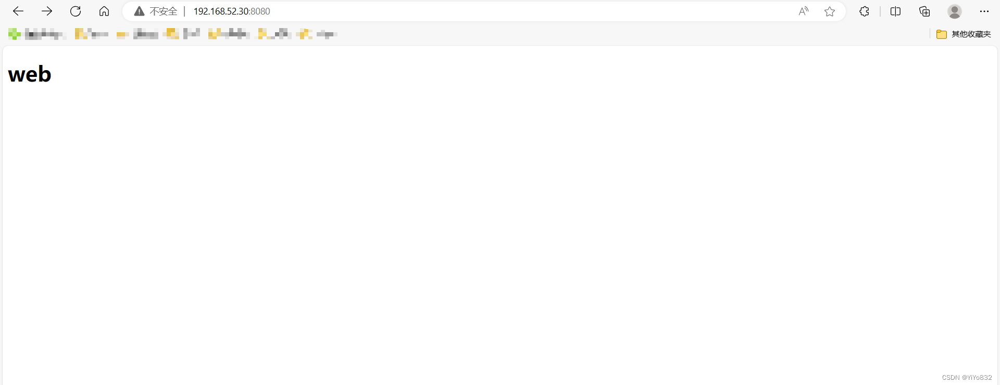

关于为什么访问192.***我相信前面工作做应该懂

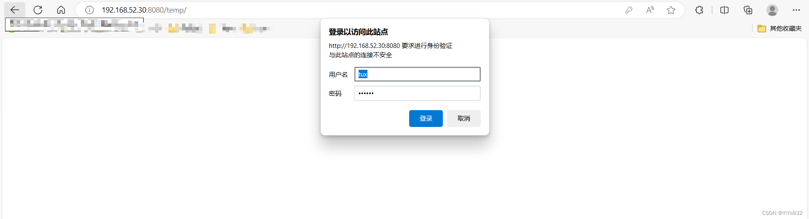

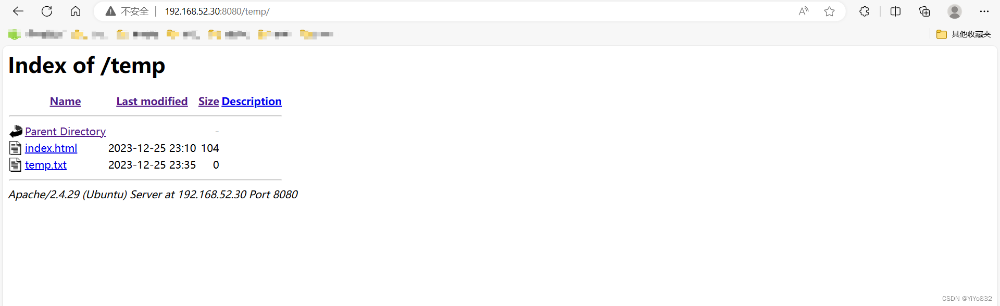

至此，三次实验报告全部完成！！！！！！！！
