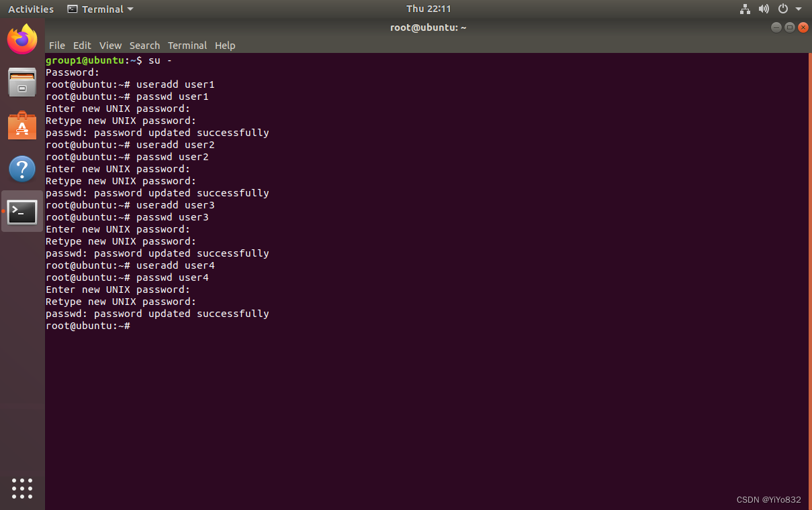
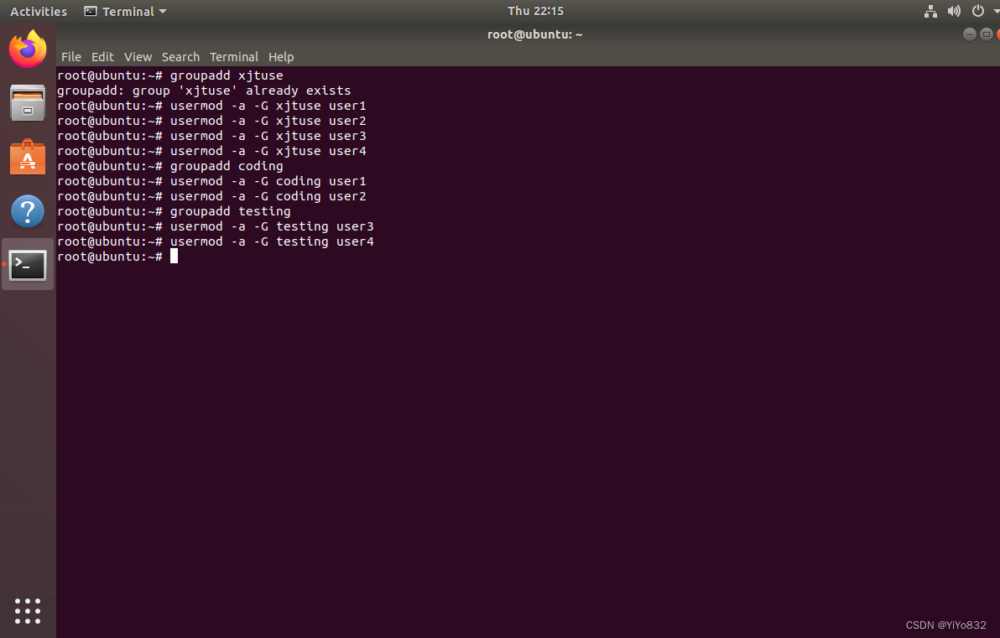
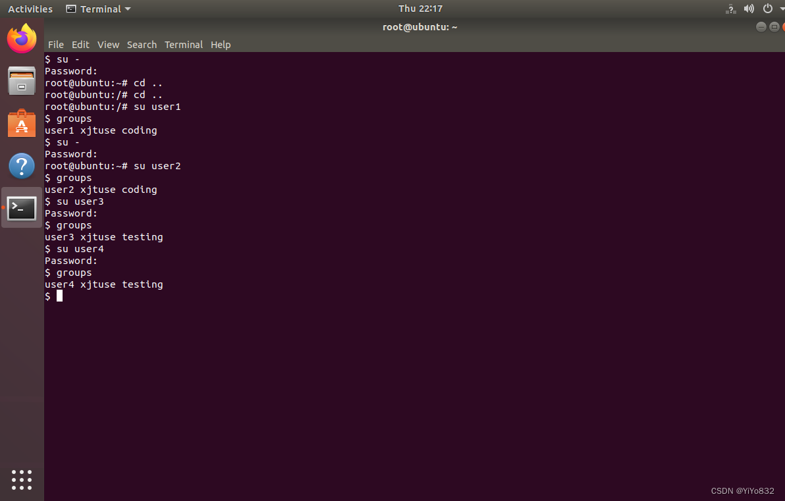
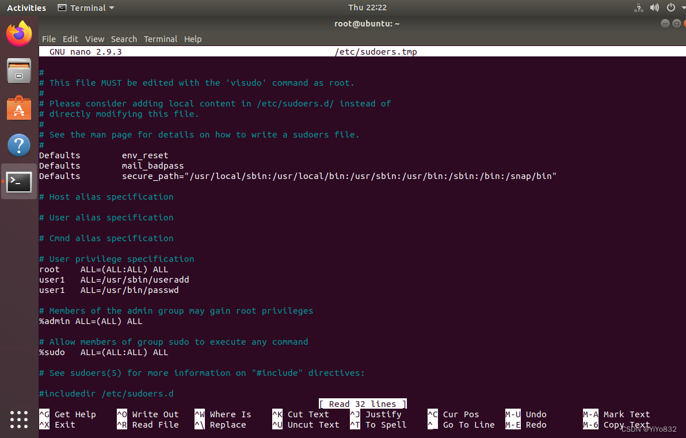
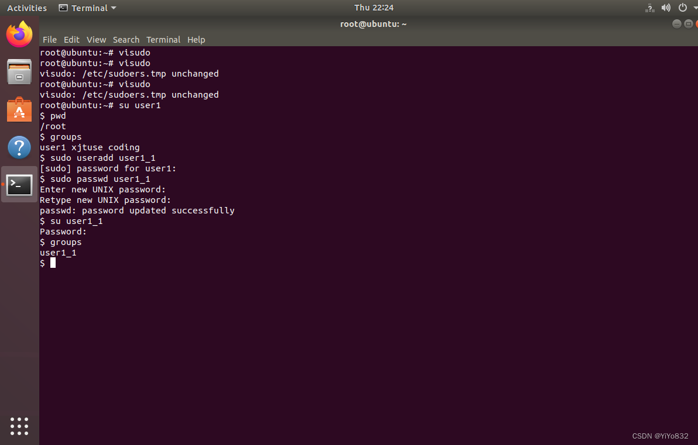
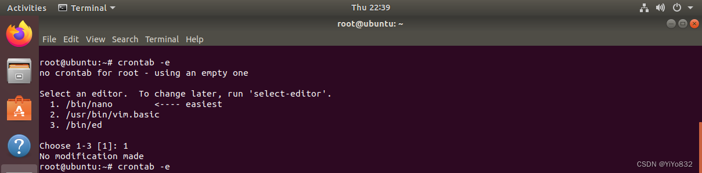
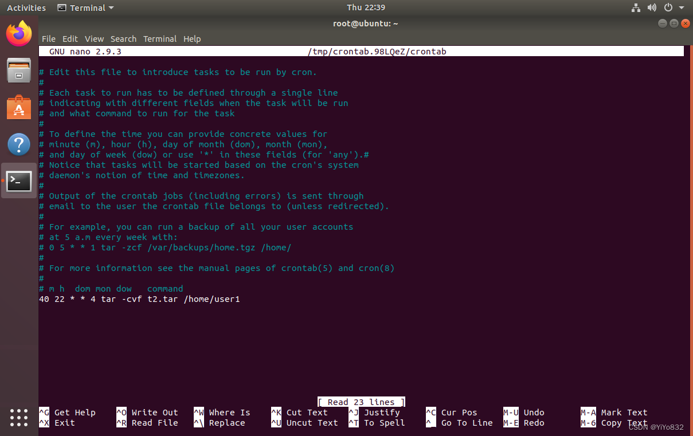
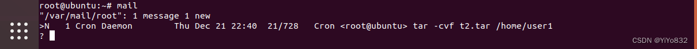
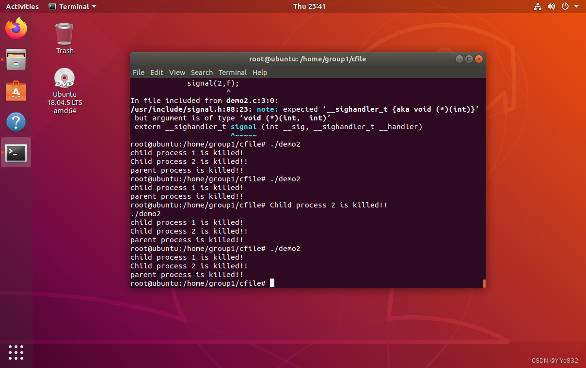
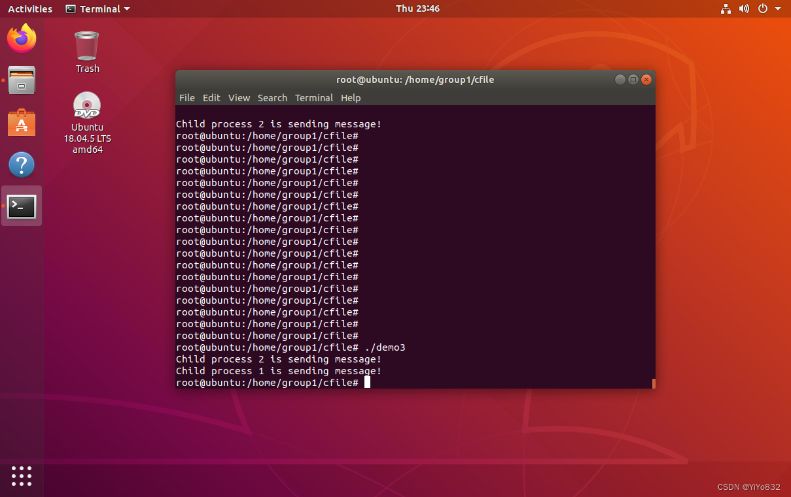

# XJTUSE-Linux实验-进程管理实验

如何配置Linux虚拟机可以参考我的这篇blog

 [VMware配置Linux虚拟机配置过程及遇见的问题-CSDN博客](https://blog.csdn.net/weixin_64112516/article/details/135122348)

## 实验目的
熟练掌握Linux操作系统的使用，掌握Linux的系统的进程管理相关内容，掌握进程之间的通信方式。

进程是操作系统中最重要的概念，贯穿始终，也是学习现代操作系统的关键。通过本次实验，要求理解进程的实质和进程管理的机制。在Linux系统下实现进程从创建到终止的全过程，从中体会进程的创建过程、父进程和子进程的关系、进程状态的变化、进程之间的同步机制、进程调度的原理和以信号和管道为代表的进程间通信方式的实现。

## 实验要求
完成实验内容并写出实验报告，报告应具有以下内容：

- 实验目的；- 实验内容；- 题目分析及基本设计过程分析；- 配置文件关键修改处的说明及运行情况，应有必要的效果截图；- 实验过程中出现的问题及解决方法；- 实验体会。
## 实验内容
1.在命令行新建多个普通用户，如tux，bob，Alice，lily等，给每个用户创建密码，并将这几个用户分到同一个组xjtuse中。再新建两个组coding和testing，使得某些用户也分别为其组用户。在root用户和新建用户之间切换，验证用户创建成功与否。(给出相关命令运行结果)

2.实现sudo 委托管理任务，给上述某一指定的普通用户赋予创建用户的权限。(给出相关配置文件和命令运行结果)

3.备份数据是系统应该定期执行的任务，请利用cron计划作业在每周五下午6：10对某用户(如tux)主目录下的文件进行备份(可使用tar 命令)。给出相关运行结果和邮件记录。

4.编制实现软中断通信的程序

  使用系统调用fork()创建两个子进程，再用系统调用signal()让父进程捕捉键盘上发出的中断信号(即按delete键)，当父进程接收到这两个软中断的某一个后，父进程用系统调用kill()向两个子进程分别发出整数值为16和17软中断信号，子进程获得对应软中断信号，然后分别输出下列信息后终止：

Child process 1 is killed by parent !!

Child process 2 is killed by parent !!

父进程调用wait()函数等待两个子进程终止后，输入以下信息，结束进程执行：

Parent process is killed!!

多运行几次编写的程序，简略分析出现不同结果的原因。

5.编制实现进程的管道通信的程序

使用系统调用pipe()建立一条管道线，两个子进程分别向管道写一句话：

Child process 1 is sending a message!

Child process 2 is sending a message!

而父进程则从管道中读出来自于两个子进程的信息，显示在屏幕上。

要求：父进程先接收子进程P1发来的消息，然后再接收子进程P2发来的消息。

## 任务一
### 设计思路
- 先切换到root用户，使用useradd创建四个用户- groupadd创建组，再用usermod -a -G命令给四个组分配组- 在su命令切换到各个用户，groups查看分组进行验证。

 有关一些Linux命令讲解我回头再写一篇blog

### 展示




## 任务二
### 设计思路
1.使用visudo命令在vi编辑器中修改配置文件

2.验证修改用户是否有权限

### 展示


## 任务三
### 设计思路
1.使用crontab -e创建作业

2.创建完成后使用mail命令查看邮件记录

### 展示过程

 不过在创建前要新建/home/user1的文件夹，不然备份失败



 这里为了方便展示，没有按照题目设计时间，大家自行修改时间

 使用mail命令时候，需要下载。



收到邮箱，验证成功！

后续，可自行在文件夹里查看备份！

## 任务四
### 前置知识
先简要学习一下：

要运行一个C语言文件，您可以按照以下步骤进行操作：

-  使用文本编辑器(如vi、nano或其他编辑器)创建一个包含C代码的文件，例如`program.c`。

 -  在文件中编写C代码。例如，以下是一个简单的"Hello, World!"程序示例：

```
#include <stdio.h>

int main() {
    printf("Hello, World!\n");
    return 0;
}

```
-  保存并关闭文件。

 -  打开终端或命令行界面。

 -  使用gcc编译器编译C代码。运行以下命令：

```
gcc program.c -o program

```
这将使用gcc编译器将`program.c`文件编译成名为`program`的可执行文件。

- 运行编译后的可执行文件。使用以下命令：
```
./program

```
这将执行生成的可执行文件并输出结果。对于上述"Hello, World!"程序示例，您将在终端或命令行界面上看到输出的"Hello, World!"消息。

请注意，确保您在运行之前已经编译了C代码文件。如果您对C代码进行了更改，则需要重新编译文件以反映最新的更改。

### 设计思路
```
#include <stdio.h>
#include <stdlib.h>
#include <signal.h>
#include <sys/wait.h>
#include <unistd.h>
#include <sys/types.h>

void func() {
    printf("test\n");
}

void f(int p1, int p2) {
    kill(p1, 16);
    kill(p2, 17);
}

int main() {
    int p1, p2;
    signal(2, func);

    if ((p1 = fork())) {
        if ((p2 = fork())) {
            signal(2, f); # 传入指针
            wait(0);
            printf("parent process is killed!!\n");
        } else {
            signal(17, func);
            printf("Child process 2 is killed!!\n");
            exit(0);
        }
    } else {
        signal(16, func);
        printf("child process 1 is killed!\n");
        exit(0);
    }

    return 0;
}
```


## 任务五
### 设计思路
```
#include<unistd.h>
#include<signal.h>
#include<stdio.h>
#include<string.h>
#include<stdlib.h>
#include <sys/wait.h>
int pid1,pid2; // 作为子进程标识符
main(){
    int fd[2]; // 作为管道
    char outpipe[100],inpipe[100];
    pipe(fd);
    while((pid1=fork()) == -1);
    if (pid1==0){
        lockf(fd[1],1,0); // 把管道锁上
        sprintf(outpipe,"Child process 1 is sending message!");
        write(fd[1],outpipe,50);
        sleep(5);
        lockf(fd[1],0,0);
        exit(0);
    }
    else{
        while((pid2=fork()) == -1);
        if (pid2==0){
            lockf(fd[1],1,0); // 把管道锁上
            sprintf(outpipe,"Child process 2 is sending message!");
            write(fd[1],outpipe,50);
            sleep(5);
            lockf(fd[1],0,0);
            exit(0);
        }
        else{
            wait(0); // 等待大儿子的消息(颇有点像老父亲的守望)
            read(fd[0],inpipe,50);
            printf("%s\n",inpipe);
            wait(0); // 等待二儿子的消息
            read(fd[0],inpipe,50);
            printf("%s\n",inpipe);
            exit(0);
        }
    }
}
```
### 展示


 注意：需要等一会！！！
