# XJTUSE-OS-ch1-8

试卷题型：名词解释(10分)、选择(10分)、判断(10分)、简答题(30分)、计算和PV操作(40分)

注意：名词解释，需要先翻译名词，再用一两句话进行解释。

试卷客观题是英文，主观题是中文，请在复习时关注专业词汇。

## 第一章-Introduction

### What is an Operating System?

- 把操作系统定义为用以控制和管理计算机系统资源，方便用户使用的程序和数据结构的集合。- Operating system is a program that manage the computer hardware.操作系统是管理计算机硬件的程序- A program that acts as an intermediary between a user of a computer and the computer hardware.在计算机用户和计算机硬件之间起媒介作用的一种程序。 作用：

- 1.计算机硬件、软件资源的管理者。- 2.用户使用计算机硬件、软件的接口。- 3.操作系统是直接与硬件相邻的第一层软件，它是由大量极其复杂的系统程序和众多的数据结构集成的。-
	### Development and Types of OS

- No operating system 无操作系统- Simple Batch Systems 简单批处理系统- Multiprogramming Batched Systems 多道程序批处理系统- Time-Sharing Systems 分时系统- Real -Time Systems 实时系统- Embedded SystemS 嵌入式系统- Parallel Systems 并行系统- Distributed Systems 分布式系统

世界上第一台计算机是 ENIAC

#### Simple Batch Systems 简单批处理系统

是什么？

把一批作业以脱机输入方式输入到磁带/磁鼓

利用磁带或磁盘把任务分类编成作业顺序执行

每批作业由专门监督程序(Monitor)自动依次处理

批处理系统解决了高速计算机的运算、处理能力与人工干预之间的速度矛盾，实现了作业自动过渡。

运行特征

顺序性：磁带上的各道作业是顺序地进入内存，各作业的完成顺序与他们进入内存的顺序相同

单道性:内存中仅有一道程序运行

自动性

优点：减少了CPU的空闲时间，提高了主机CPU和I/O设备的使用效率，提高了吞吐量

缺点：CPU和I/O设备使用忙闲不均

#### Multiprogramming Batched Systems 多道程序批处理系统

出现前提：通道和中断技术的出现

通道: 是一种专用部件，负责外部设备与内存之间信息的传输。
中断：指主机接到外界的信号(来自CPU外部或内部)时，立即中止原来的工作，转去处理这一外来事件，处理完后，主机又回到原来工作点继续工作。

是什么？

内存中同时存放几个作业，使之都处于执行的开始点和结束点之间，多个作业共享CPU、内存、外设等资源

所用技术

- 作业调度：作业的现场保存和恢复－－上下文切换- 资源共享：资源的竞争和同步－－互斥(exclusion)和同步(synchronization)机制；- 内存使用：提高内存使用效率(为当前由CPU执行的程序提供足够的内存)－－覆盖(overlap)，交换(swap)和虚拟存储(virtual memory)；- 内存保护:系统存储区和各应用程序存储区不可冲突；- 文件非顺序存放、随机存取运行特征

- 多道性：内存中同时驻留多道程序并发执行，从而有效地提高了资源利用率和系统吞吐量- 无序性：作业的完成顺序与它进入内存的顺序之间无严格的对应关系- 调度性：作业调度、进程调度优点：资源利用率高:CPU,内存,I/O设备；系统吞吐量大

缺点：无交互能力，用户响应时间长；作业平均周转时间长(有可能第一个进入，最后一个出)

#### Time-Sharing Systems 分时系统

技术支持

分时技术：把CPU的时间分成若干个大小相等(或不等)的时间单位，称为时间片(如100毫秒)，每个终端用户获得CPU(获得一个时间片)后开始运行，当时间片到，该用户程序暂停运行，等待下一次运行。

特点：

- 多路性：众多联机用户可以同时使用同一台计算机；- 独占性：各终端用户感觉到自己独占了计算机；- 交互性：用户与计算机之间可进行“会话”；- 及时性：用户的请求能在很短时间内获得响应。### 操作系统的功能

#### 进程管理

完成进程资源分配和调度等功能

- 进程控制：创建、撤销、挂起、改变运行优先级等——主动改变进程的状态- 进程调度:作业和进程的运行切换，以充分利用处理机资源和提高系统性能- 进程同步：协调并发进程之间的推进步骤，以协调资源共享- 进程通信:进程之间的信息交换#### 内存管理

目标：提高内存利用率、方便用户使用、提供足够的存储空间

功能：存储分配与回收、存储保护、地址重定位、内存扩充

#### 设备管理

目标：完成用户的I/O请求,为用户分配I/O设备、提高I/O速度，提高CPU与I/O设备利用率、方便设备使用

功能

- 缓冲管理- 设备分配与回收- 设备处理:利用设备驱动程序(通常在内核中)完成对设备的操作。- 虚拟设备设备独立性:提供统一的I/O设备接口，使应用程序独立于物理设备

#### 文件管理

目标：实现外存上的信息资源“按名存取”

功能

- 文件存储空间管理:如何存放信息，以提高空间利用率- 目录管理:文件检索- 文件存取控制:文件保护- 软件管理:软件的版本、相互依赖关系、安装和拆除等#### 用户接口

目标：为用户使用计算机系统提供一个友好的访问OS的接口

包括作业级接口与程序级接口(系统调用)

### 现代操作系统的特征

- 并发concurrency：多个事件在同一时间段发生。- 共享sharing：计算机系统资源的共享- 虚拟virtual：一个物理实体映射成多个逻辑实体。提高了资源利用率。- 异步asynchronism：进程的执行时间和执行步骤不确定，无法复现。但是，其输出的结果应该和串行输出的结果一致。
并发与并行的差别：

并发concurrency:多个事件在同一时间段内发生。如，在单处理器的情况下，实现宏观的并发是微观的交替执行。

并行(parallel):是指多个事件在同一时刻发生。如，多核处理器同时处理多个事件。

## 第二章-Computer-System Structures

### Computer System Operation

#### 中断机制

硬件中断：完成了某件事情进行中断信号发送，比如磁盘找资源

软件中断：1.异常；2.系统调用

#### IO中断

Synchronous同步：当I/O操作开始时，系统会等待I/O操作结束才执行其他的操作

Asynchronous异步：当I/O操作开始时，系统不会等待，而是直接去执行其他的操作

### Storage-Device Hierarchy 存储设备层次

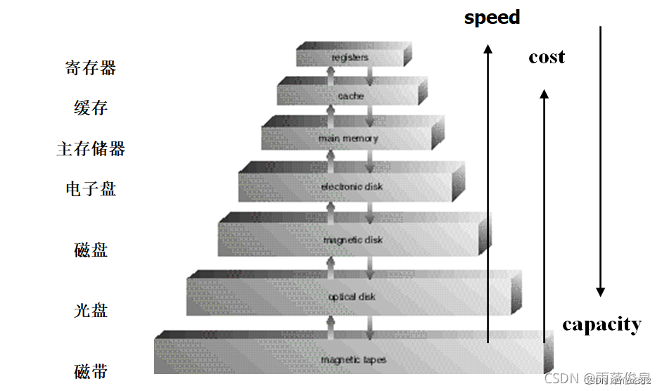

### Dual-Mode Operation 两状态操作

- 用户态 user mode- 管态 monitor mode特权指令：只能在管态下运行的指令，通常使用系统调用。

特权指令有哪些？

- 设置定时器的值- 清除内存- 关闭中断- 所有的IO操作- 加载基本寄存器和限制寄存器- ...## 第三章-Operating-System Structures

### 操作系统服务

帮助用户的角度：

- User interface - Program execution 程序执行- I/O operations  I/O操作- File-system manipulation  文件系统操作- Communications 通信- Error detection 出错检查提高系统效率的角度：

- Resource allocation  资源分配- Accounting 账务- Protection 保护### 系统调用

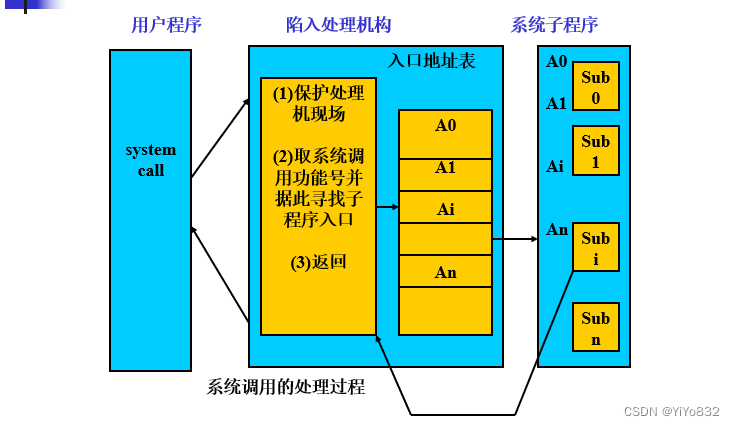

### 系统结构

- 简单结构- 层次化结构- 微内核结构- 模块- 混合系统## 第四章-Processes

### Process Concept

#### 是什么？

进程：一个具有一定独立功能的程序在一个数据集合上的一次动态执行过程

进程 = 程序段+相关的数据段+PCB

#### 特征

- 动态性：进程的实质是进程实体的一次执行过程，因此动态性是进程的最基本的特征。- 并发性: 多个进程实体同存在于内存中，且能在一段时间内同时运行。是最重要的特征。- 独立性：指进程实体是一个能独立运行、独立分配资源和独立接受调度的基本单位。- 异步性: 进程按各自独立的、不可预知的速度向前推进。#### PCB

program control block，进程控制块。包含了与一个特定进程有关的信息：进程状态、程序计数器、CPU寄存器、CPU调度信息、内存管理信息、计账信息、I/O状态信息。

#### 进程状态

5状态图：

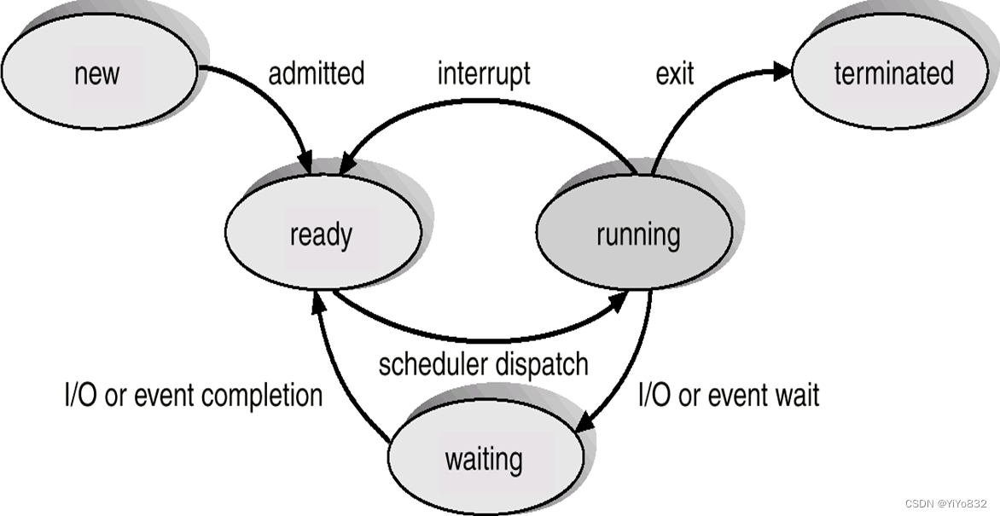

7状态图(添加了挂起状态)

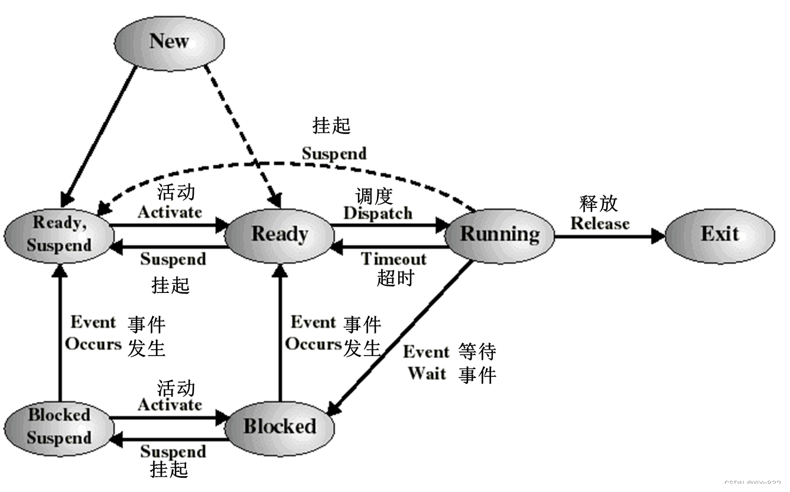

###  Schedulers 调度

#### The long-term scheduler

- 长程调度(或作业调度)- 选择可以进入就绪队列的进程控制了多道程序中的道！

切换频率不高

#### Short-term scheduler(or CPU scheduler)

短程调度：选择可被下一个执行并分配CPU的进程

切换频率高

#### Medium Term Scheduling

中程调度

为了缓和内存紧张的情况，将内存中处于阻塞状态的进程换至外存上(挂起)，降低多道程序的度。当这些进程重新具备运行条件时，再从外存上调入内存。

#### 上下文切换

When CPU switches to another process, the system must save the state of the old process and load the saved state for the new process

个人理解：比如保留PCB，相关的数据块...

### 进程操作

#### 进程创建

重点讲一下父子进程的关系：

父进程创建子进程，形成进程树。fork()

当进程创建新进程时，可能有两种执行可能：

父进程与子进程并发执行

父进程等待，直到子进程终止

新进程的地址空间有两种可能

子进程是父进程的复制品，具有和父进程一样的程序和数据

子进程加载另一个新程序，exec()

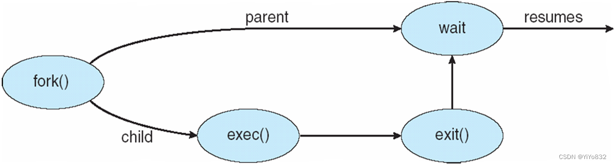

看懂代码：

`#include<stdio.h>
#include<unistd.h>
void main(int argc, char *argv[])
{ int pid;
    pid = fork(); /*fork another process*/
    if (pid < 0) {/* error occurred */
        fprintf(stderr, “Fork Failed”);
        exit(-1); }
    else if (pid == 0) { /* child process */
        execlp(“/bin/ls”,”ls”,NULL);
     }  else {   /* parent process */
         wait(NULL);
         printf(“Child Complete”);
         exit(0);
      }
}
`

fork:创建子进程，返回pid；pid=0，返回的是子进程;pid>0，返回的是父进程；pid<0，出错。

课堂练习

编写一段程序，使用fork()创建两个子进程。

当此程序运行时，在系统中有一个父进程和两个子进程活动。让每一个进程在屏幕上显示一个字符：父进程显示字符“a”；子进程分别显示字符“b”和字符“c”

`#include <stdio.h>
main()
{
	int p1,p2;
	while((p1 = fork()) == -1);
	if(p1==0)------------创建成功一子进程
		putchar('b');
	else
	{
		while((p2 = fork()) == -1);
		if(p2 == 0)
			putchar(‘c’); -------创建成功,另一子进程
		else      putchar(‘a’);--------父进程
	}
}
`

#### 进程终止

使用exit()终止进程，父进程调用wait()等待子进程的终止。

搞清楚僵尸进程和孤儿进程的区别。

#### 进程阻塞

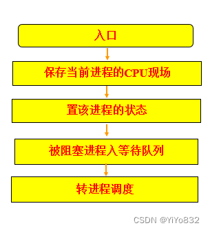

#### 进程唤醒

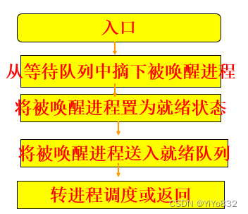

### 进程间通信

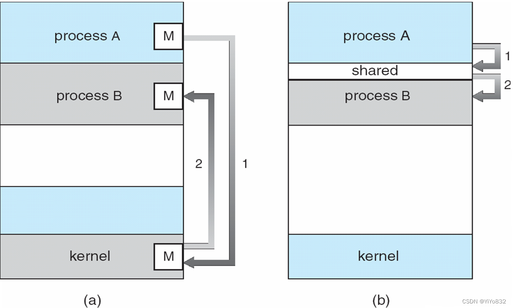

#### 共享存储

如图所示，不再赘述。

值得一提，由通信进程来确定交换的数据和位置，不受操作系统的控制。

#### 消息传递

两个原语：

- send()- receive()类型：

直接通信

间接通信：消息导向至信箱并从信箱接收。

#### 同步/异步

阻塞：同步

非阻塞：异步

#### Buffering

- 零容量- 有界容量- 无界容量## 第五章-Threads

### 线程概要

#### 引入

如果按照第四章的说法，进程调度开销较大。这是由于进程既是拥有资源的独立单位，又是可以接受独立调度和分派的基本单位。

这时候，为了减少系统开销，引入线程，即不拥有资源，只是接收调度的基本单位。

引入线程的目的是简化线程间的通信，以小的开销来提高进程内的并发程度。

#### 优点

- 创建时间短- 终止时间短- 进程内线程通信无需内核支持- 切换时间短#### 线程所需资源

线程(轻型进程)是CPU运用的一个基本单元，包括

- program counter 程序计数器- register set  寄存器集- stack space 栈空间 与同等地位的线程共享：

- 代码段- 数据段(如堆)- 操作系统资源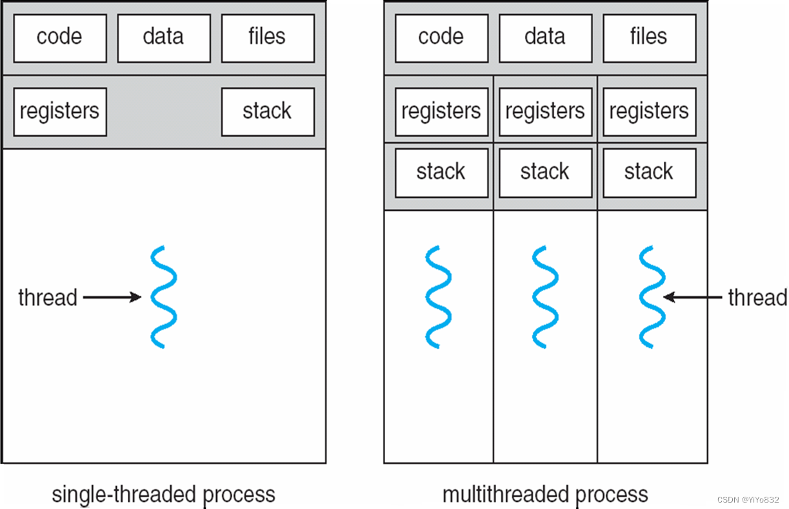

### 用户级线程

时间片是发给进程的，进程内有多个线程。线程来使用这个时间片，一般来说，是按照均分时间片的方法给线程的。

### 内核级线程

对内核级线程，每个线程分配时间片。

一个有4个用户级线程的进程，如果时间片为100ms，则分给每个线程的时间片是多少？如果是一个有4个内核级线程的进程，其每个线程的时间片又是多少？

25ms；100ms

### Multithreading Models

就用户线程与内核线程之间的模型，简单梳理：

- 一对一- 多对一- 多对多需要理清楚，各个模型如果内核线程阻塞，用户线程阻塞情况。

### 线程取消

异步取消：一个线程立即终止目标线程

延迟取消：目标线程检查它是否应该终止

### 线程池

- 进程创建时就创建一定数量的线程，放入线程池中等待；- 进程收到请求时，唤醒线程池中的一个线程进行处理；- 线程完成工作，返回线程池中继续等待；- 如果没有可用的线程，进程就等待直到有空线程为止好处：

- 减少创立线程和终止线程的开销- 由于用户级线程可以无限开辟，但内核级线程的数量是一定的，使用线程池，可以限制用户级线程的数量，从而使系统的性能得以保障。## 第六章-CPU Scheduling

需要注意这章的讨论范围

CPU调度，即前面说的短程调度，定义为决定就绪队列中哪个进程将获得处理机，然后由分派程序执行把处理机分配给该进程的操作。

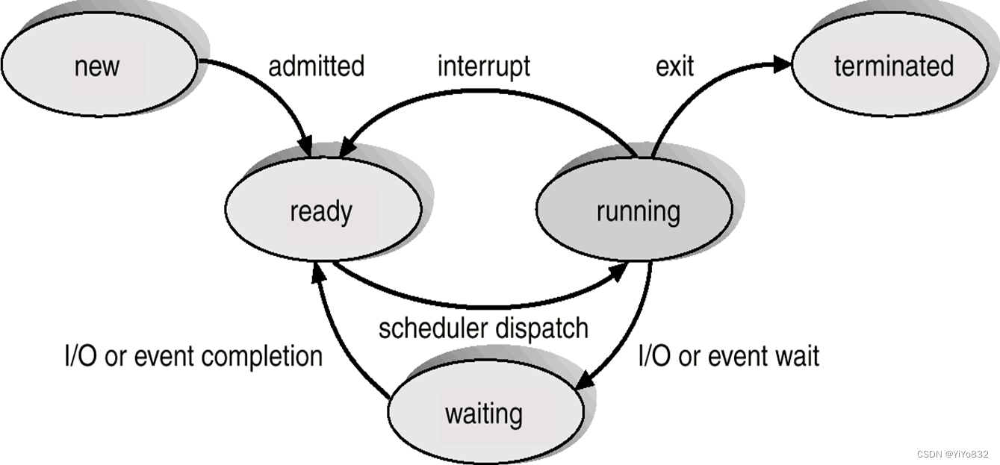

即从ready状态队列里面挑选进程到ruuning状态

### CPU调度的情况

1.  Switches from running to waiting state(从运行转到等待).

2.  Switches from running to ready state(从运行转到就绪).

3.  Switches from waiting to ready(从等待转到就绪).

4.  Terminates(终止运行).

Scheduling under 1 and 4 is nonpreemptive (发生在1、4两种情况下的调度称为非抢占式调度).

All other scheduling is preemptive (其他情况下发生的调度称为抢占式调度).

抢占式/非抢占式的特点和定义了解明晰！

### Scheduling Criteria

有以下指标：

- CPU利用率- 吞吐量：完成的进程数量- 周转时间：进程提交到结束的时间- 等待时间：进程再就绪队列中等待调度的时间片总和- 响应时间：进程提交申请后，到首次被响应的时间调度算法影响的是等待时间，而不能影响进程真正使用CPU的时间和I/O时间

Max CPU utilization

  (最大的CPU利用率)

Max throughput

  (最大的吞吐量)

Min turnaround time

  (最短的周转时间)

Min waiting time

  (最短的等待时间)

Min response time

  (最短的响应时间)

### Scheduling Algorithm

主要学习下面四个

n先来先服务(FCFS)

n短作业优先(SJF)

n优先权调度(Priority Scheduling)

n时间片轮转(Round Robin)

了解下面三个

n多级队列调度(Multilevel Queue)

n多级反馈队列调度算法(Multilevel Feedback Queue)

nHighest Response Ratio Next (HRRN)高响应比优先 (作业)调度算法

算法的具体思想不再赘述。

简要阐述一些概念/知识点：

饥饿：低优先级的进程可能永远得不到运行。

先来先服务的等待时间最短！

#### 例题

例题1

假定在一个处理机上执行以下五个作业：

 作业号      A     B     C     D      E

 到达时间    0     1     2     3      4

 运行时间    4     3     5     2      4

分别采用FCFS、SJF、RR(时间片＝1)

解答

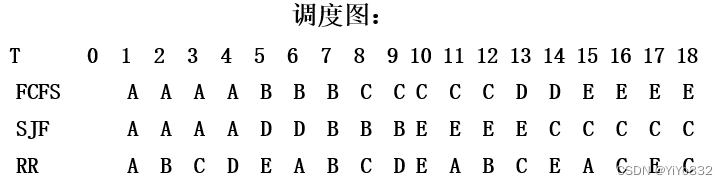

例题2

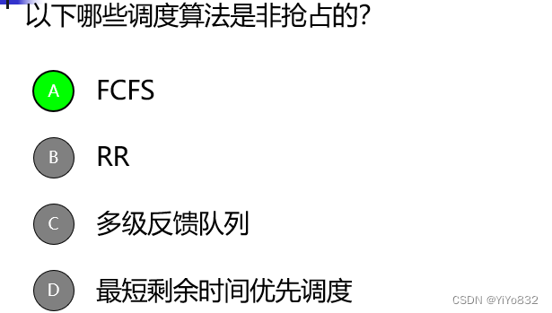

例题3

例题4

RR调度算法的性能很大程度取决于 时间片的大小

例题5

优先级调度算法的一个主要问题是 [填空1]，可以采用 [填空2] 来解决该问题。

饥饿 老化

例题6

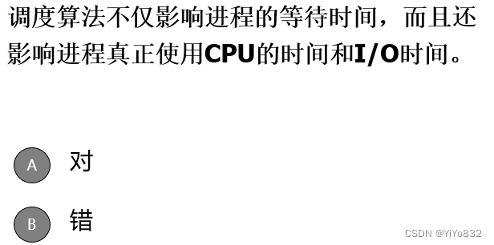

错

例题7

等待时间是指进程在 [填空1] 中等待的时间之和。

就绪队列

## 第七章-Process Synchronization

这章难度不小，主要就是设计PV操作同步嘛...写作业的时候就老写错

### 背景(略)

### The Critical-Section Problem

临界区(critical section)：进程中访问临界资源的一段代码。(考点)

实现进程对临界资源的互斥访问—各进程互斥的进入自己的临界区

假定一个系统有n个进程{P0,P1,……,Pn-1},每个进程有一个代码段称为临界区,在该区中进程可能修改共享变量\更新一个表\写一个文件等.当一个进程在临界区中执行时,其他进程都不能进入临界区

临界区的执行在时间上是互斥的,进程必须请求允许进入临界区

进入区(entry section)：在进入临界区之前，检查可否进入临界区的一段代码。如果可以进入临界区，通常设置相应“正在访问临界区”标志。

退出区(exit section)：用于将"正在访问临界区"标志清除。

剩余区(remainder section)：代码中的其余部分。

### 两进程互斥的软件方法

注意：是两个进程

#### 算法1

`while(turn != i);
critical section...
turn = j;
remaindersection`

`while(turn != j);
critical section...
turn = i;
remaindersection`

利用变量turn使得两个进程轮流使用。

缺点：强制轮流进入临界区，没有考虑进程的实际需要。容易造成资源利用不充分：在进程1让出临界区之后，进程2使用临界区之前，进程1不可能再次使用临界区；

#### 算法2

`flag[i] = TRUE;
while (flag[j]);
critiacal section...
flag[i] = False;
remainder section..`

`flag[j] = TRUE;
while (flag[i]);
critiacal section...
flag[j] = False;
remainder section..`

n优点：不用交替进入，可连续使用；

n缺点：两进程可能都进入不了临界区(死锁)

#### 算法3

`flag[i] = TRUE;turn = j;
while (flag[j] && turn == j);
critiacal section...
flag[i] = False;
remainder section..`

`flag[j] = TRUE;turn = i;
while (flag[i] && turn == i);
critiacal section...
flag[j] = False;
remainder section..`

结合算法1和算法2

## Synchronization Hardware (同步的硬件实现)

硬件方法的优点

适用于任意数目的进程，在单处理器或多处理器上

简单，容易验证其正确性

可以支持进程内存在多个临界区，只需为每个临界区设立一个布尔变量

硬件方法的缺点

等待要耗费CPU时间，不能实现"让权等待"

可能"饥饿"：从等待进程中随机选择一个进入临界区，有的进程可能一直选不

## Semaphore

### 原子操作PV

`void P(S):
    while (S<=0);
    S--;

void V(S):
    S++;`

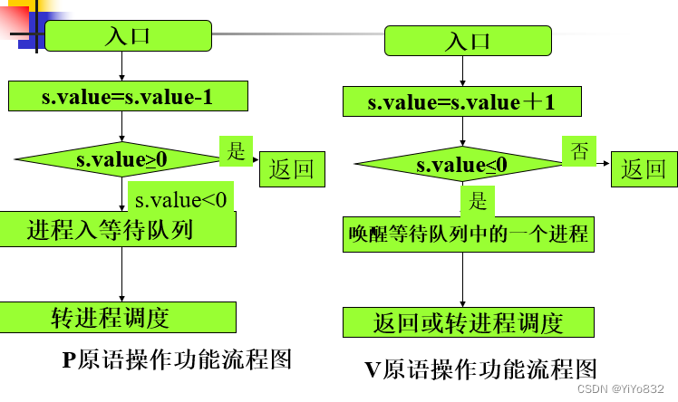

### 信号量的用法

信号量可以实现：

- 互斥，让mutex初始化为1- n个资源，让S=n- 同步，设置两个信号量，一个进行p操作，一个进行v操作### 经典同步问题

#### 有限缓冲区

`// 写的伪代码...
int empty = n;
int full = 0;
int mutex = 1;
void P(int S);
void V(int S);

void Producer:
    P(empty);
    P(mutex);
    producing..
    V(mutex);
    V(full);

void Consumer:
    P(full);
    P(mutex);
    comsumering...
    V(mutex);
    V(empty);
`

注意：信号量的处理顺序不能颠倒了，原因请自行思考。

#### 第一类读者-写者问题

`// 写的伪代码...
int mutex = 1;
int wtr = 1;
int readerNum = 0;
void P(int S);
void V(int S);

void writer:
    P(wtr);
    writing..
    V(wtr);

void reader:
    P(mutex);
    readerNum++;
    if (readerNum == 1):
        P(wtr);
    V(mutex);
    reading..
    P(mutex);
    readerNum--;
    if (readerNum == ):
        V(wtr);
    V(mutex);`

#### 第二类读者-写者问题

`// 写的伪代码...
int mutex = 1;
int wtr = 1;
int readerNum = 0;
int wtrNum = 0;
void P(int S);
void V(int S);

void writer:
    V(wtrNum);
    P(wtr);
    writing..
    V(wtr);
    P(wtrNum);

void reader:
    while (wtrNum==0);
    P(mutex);
    readerNum++;
    if (readerNum == 1):
        P(wtr);
    V(mutex);
    reading..
    P(mutex);
    readerNum--;
    if (readerNum == 0):
        V(wtr);
    V(mutex);`

这个算法自己写的，while空循环感觉效率不是很高，或者我们尝试一下新的写法

`// 写的伪代码...
int readerNumMutex = 1;
int wtr = 1;
int readerNum = 0;
int readerCanRead = 1;
void P(int S);
void V(int S);

void writer:
    P(readerCanRead);
    P(wtr);
    writing..
    V(wtr);
    V(readerCanRead);

void reader:
    P(readerCanRead);
    V(readerCanRead);
    P(readerNumMutex);
    readerNum++;
    if (readerNum == 1):
        P(wtr);
    V(readerNumMutex);
    reading..
    P(readerNumMutex);
    readerNum--;
    if (readerNum == 0):
        V(wtr);
    V(readerNumMutex);`

但是，这样子写者的优先级可能不是最高的，在尝试一下新的写法。

`// 写的伪代码...
int readerNumMutex = 1;
int writerNumMutex = 1;
int wtr = 1;
int readerNum = 0;
int writerNum = 0;
int readerCanRead = 1;
void P(int S);
void V(int S);

void writer:
    P(writerNumMutex);
    writerNum++;
    if (writerNum == 1):
        P(readerCanRead);
    V(writerNumMutex);
    P(wtr);
    writing..
    V(wtr);
    P(writerNumMutex);
    writerNum--;
    if (writerNum == 0):
        V(readerCanRead);
    V(writerNumMutex);

void reader:
    P(readerCanRead);
    V(readerCanRead);
    P(readerNumMutex);
    readerNum++;
    if (readerNum == 1):
        P(wtr);
    V(readerNumMutex);
    reading..
    P(readerNumMutex);
    readerNum--;
    if (readerNum == 0):
        V(wtr);
    V(readerNumMutex);`

这样子就很完美了，效率也有了，就是信号量稍微多了一点....

#### 哲学家就餐问题

(略)

### AND型信号量集

` Swait(S1, S2, …, Sn)	//P原语；
 {
 while (TRUE)
 {
      if (S1 >=1 && S2 >= 1 && … && Sn >= 1)
  {		//满足资源要求时的处理；
        for (i = 1; i <= n; ++i)  --Si;
           //注：与wait的处理不同，这里是在确信可满足
           //全部资源要求时，才进行减1操作；
        break;
      }
  else
  {    //某些资源不够时的处理；
        进程进入第一个小于1信号量的等待队列Sj.queue;
        阻塞调用进程;
      }
 }
 }
`

` Ssignal(S1, S2, …, Sn)
 {
   for (i = 1; i <= n; ++i)
   {
     ++Si;		//释放占用的资源；
     for (each process P waiting in Si.queue)
           //检查每种资源的等待队列；
     {
       从等待队列Si.queue中取出进程P;
       if (判断进程P是否通过Swait中的测试)
            //注：与signal不同，这里要进行重新判断；
           {	//通过检查(资源够用)时的处理；
 	进程P进入就绪队列;
           }
       else
           {	//未通过检查(资源不够用)时的处理；
 	进程P进入某等待队列；
           }
     }
   }
 }
`

 哲学家就餐解决方案：

`Var chopstick array[0,…,4] of semaphore :=(1,1,1,1,1);
Processi
    Reeat
           think;
           Swait (chopstick[(I+1) mod 5],chopstick[I]);
           Eat;
           Ssignal (chopstick[(I+1) mod 5],chopstick[I]);
 Until false;
`

### 信号量机制的缺点

•同步操作分散：信号量机制中，同步操作分散在各个进程中，使用不当就可能导致各进程死锁(如P、V操作的次序错误、重复或遗漏)

•易读性差：要了解对于一组共享变量及信号量的操作是否正确，必须通读整个系统或者并发程序；

•不利于修改和维护：各模块的独立性差，任一组变量或一段代码的修改都可能影响全局；

•正确性难以保证：操作系统或并发程序通常很大，很难保证这样一个复杂的系统没有逻辑错误；

### Monitors-管程

基本思想是把信号量及其操作原语封装在一个对象内部。即：将共享变量以及对共享变量能够进行的所有操作集中在一个模块中。

管程的定义：管程是关于共享资源的数据结构及一组针对该资源的操作过程所构成的软件模块。

引入管程可提高代码的可读性，便于修改和维护，正确性易于保证。采用集中式同步机制。一个操作系统或并发程序由若干个这样的模块所构成，一个模块通常较短，模块之间关系清晰。

#### 生产者-消费者问题

` producer : begin
                       repeat
                           produce an  item  in nextp ;
                           PC.put ( item) ;
                       until false   ;
                     end
consumer : begin
                       repeat
                          PC.get (item) ;
                          consume the item in nextc ;
                        until false ;
                      end
`

#### Solution to Dining Philosophers

`monitor diningPhilosophers {
	int[] state = new int[5];
	static final int THINKING = 0;
	static final int HUNGRY = 1;
	static final int EATING = 2;
	condition[] self = new condition[5];
	public diningPhilosophers {
		for (int i = 0; i < 5; i++)
			state[i] = THINKING;
	}
	public entry pickUp(int i) {
		state[i] = HUNGRY;
		test(i); //检查左右邻居状态
		if (state[i] != EATING)
			self[i].wait;
    }

	public entry putDown(int i) {
		state[i] = THINKING;
		// test left and right neighbors
		test((i + 4) % 5);
		test((i + 1) % 5);
    }

	private test(int i) {
		if ( (state[(i + 4) % 5] != EATING) &&
		(state[i] == HUNGRY) &&
		(state[(i + 1) % 5] != EATING) ) {
			state[i] = EATING;
			self[i].signal;//可以进餐，所以要从条件变量上唤醒

		}
	}
}

`

## 第八章-Deadlocks

### 系统模型

正常操作模式下，进程只能按照如下顺序使用资源：

- 申请- 使用- 释放### 死锁特征

#### 必要条件

1️⃣ Mutual exclusion互斥：一次只有一个进程可以使用一个资源

2️⃣ Hold and wait占有并等待：一个进程应该占有至少一个资源，并等待另一个资源，而该资源被另一个进程所占有

3️⃣ No preemption不可抢占：一个资源只有当持有它的进程完成任务后自由的释放

4️⃣ Circular wait循环等待：等待资源的进程之间存在环

#### 资源分配图

(略)

### 死锁处理方法

鸵鸟算法：视而不见

预防死锁：抑制死锁的必要条件

避免死锁：在资源的动态分配过程中，用某种方式防止系统进入不安全状态

检测与解除死锁：检测出死锁的产生，然后采用某种措施解除

### 死锁预防

互斥：改为共享文件之类的

占有并等待：两种协议：一种一次申请所有资源，一种只有没资源的进程才能申请资源。

非抢占：允许抢占

循环并等待：按照递增顺序申请资源，即避免环。

### 死锁避免

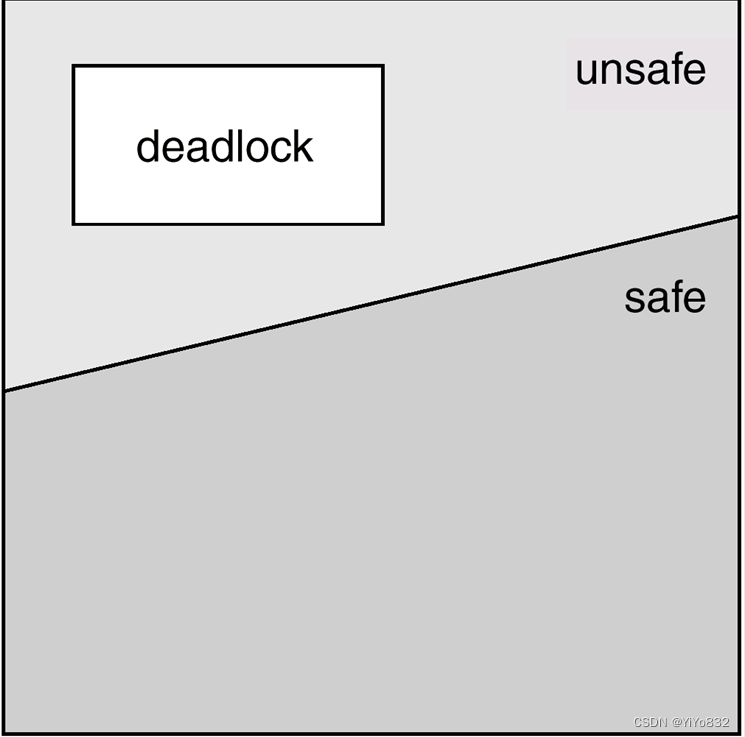

n安全状态是指系统的一种状态，在此状态下,系统能按某种顺序(例如P1、P2……Pn)来为各个进程分配其所需资源，直至最大需求，使每个进程都可顺序地一个个地完成。这个序列(P1、P2…….Pn)称为安全序列。

n若某一时刻不存在一个安全序列，则称系统处于不安全状态。

 资源只有单个实例：使用资源分配图算法，即检查环的存在。

资源有多个实例：使用银行家算法。

银行家算法的思想啥的不再给出，重点，看MOOC

### 死锁恢复

- 进程终止- 资源抢占### 例题

例题1

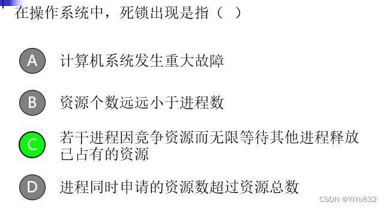

例题2

死锁产生的原因是 [填空1] 和 [填空2]

1. 系统资源分配不足；(注意，系统资源不足只会对进程造成“饥饿”，而不是造成死锁。)

2. 进程推进顺序非法。

例题3

死锁的必要条件是 [填空1]、 [填空2] 、 [填空3] 和 [填空4]

互斥、占有并等待、循环等待、非抢占。

例题4

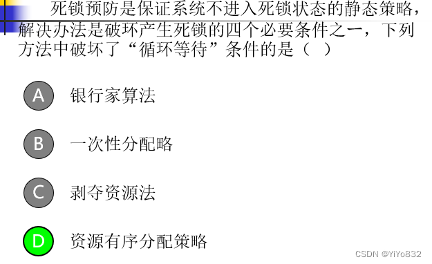

一次分配法：占有并等待

剥夺资源法：非抢占

例题5

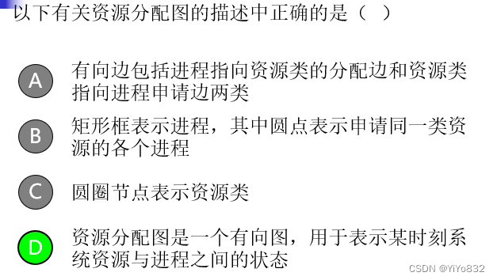

例题6

 例题7

对的

例题8

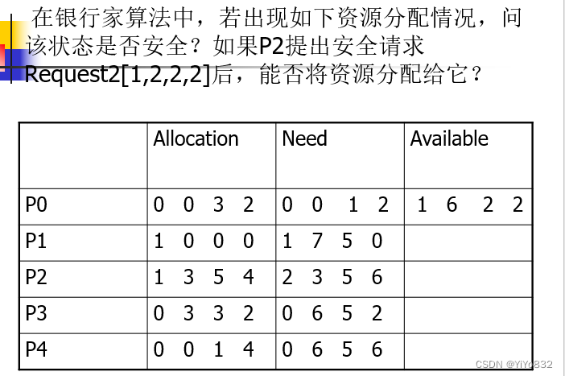

答案：存在一个安全序列{P0, P3, P4, P1, P2},该状态安全。
