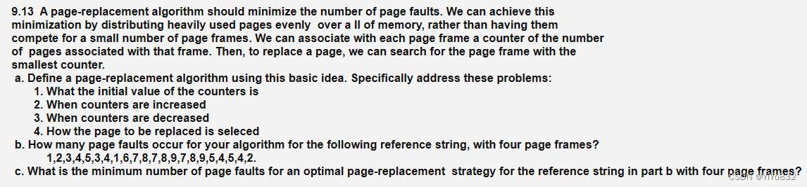
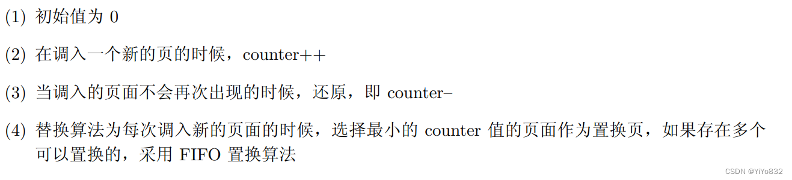
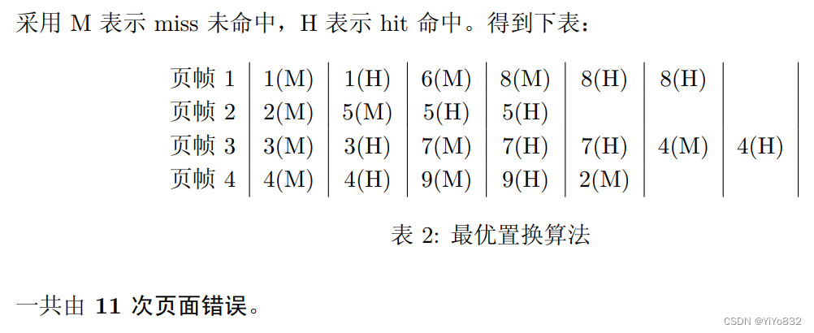
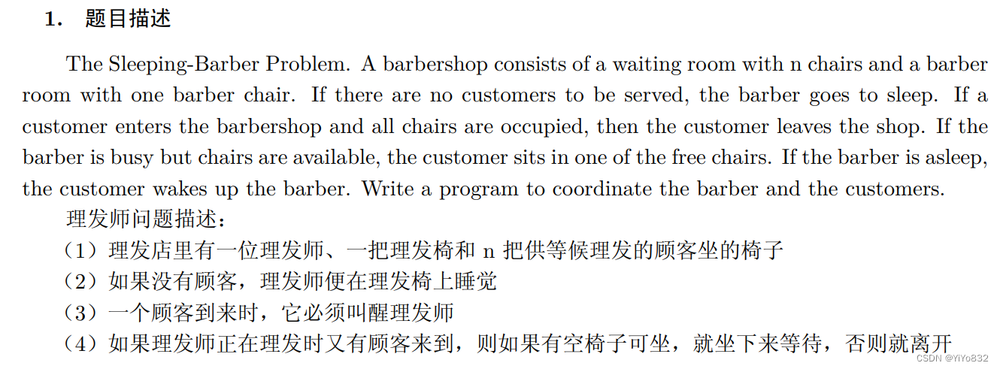
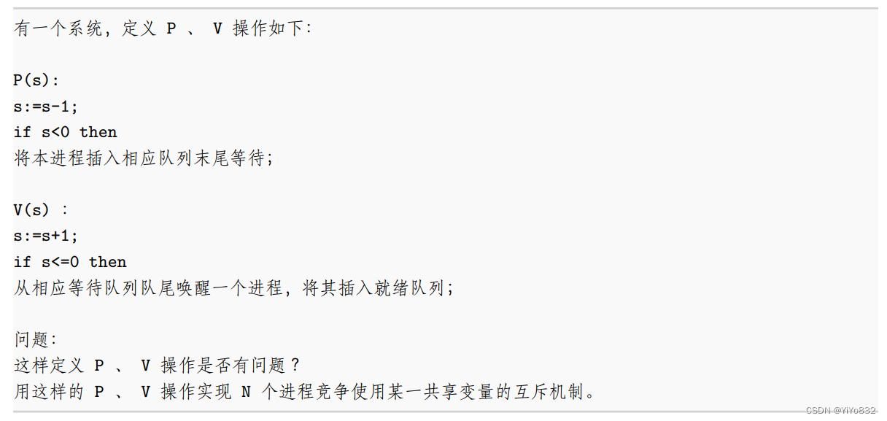
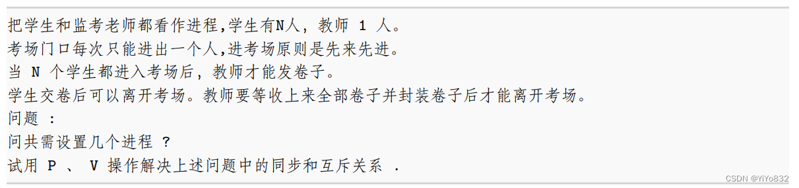

# XJTUSE-OS-homework

泉的习题笔记非常完善，不过有一点点小瑕疵，该blog主要补充和纠错泉的习题笔记

 泉的笔记：

 [操作系统复习习题_操作系统习题_雨落俊泉的博客-CSDN博客](https://yijunquan.blog.csdn.net/article/details/122061856)

## 调度
### 9.13
题目：



答案：

a



b

 不会....

 等有缘人解答...

 不过给的答案是13次页面错误

c.最优置换算法



## 文件系统
### 12.2
题目：

 Suppose that a disk drive has 5,000 cylinders, numbered 0 to 4999. The drive is currently serving a request at cylinder 143, and the previous request was at cylinder 125. The queue of pending requests, in FIFO order, is:

 ​ 86,1470,913,1774,948,1509,1022,1750,130

 Starting from the current head position, what is the total distance (in cylinders) that the disk arm moves to satisfy all the pending requests for each of the following disk-scheduling algorithms?

 假设一个磁盘驱动器有5000个柱面，从0到4999，驱动器正在为柱面143的一个请求提供服务，且前面的一个服务请求是在柱面125.按FIFO顺序，即将到来的请求队列是

   86，1470，913，1774，948，1509，1022，1750，130

 从现在磁头位置开始，按照下面的磁盘调度算法，要满足队列中即将到来的请求要求磁头总的移动距离(按柱面数计)是多少？

 a. FCFS

 b. SSTF

 c. SCAN

 d. LOOK

 e. C-SCAN

解答：

FCFS的调度是143 ， 86 ， 1470 ， 913 ， 1774 ， 948 ， 1509 ， 1022 ， 1750 ， 130 。总寻求距离是(143-86)+ (1470-86) + (1470-913) + (1774-913)+ (1774-948) + (1509-948) + (1509-1022) + (1750-1022) + (1750-130) = 7081 。

SSTF的调度是143 ， 130 ， 86 ， 913 ， 948 ， 1022， 1470， 1509， 1750， 1774。总寻求距离是(143-86) + (1774-86) = 1745。

SCAN的调度是143 ， 913 ， 948 ， 1022， 1470， 1509， 1750， 1774 ， 4999 ， 130 ， 86 。总寻求距离是(4999-143) + (4999-86)  = 9769 。

LOOK的调度是143 ， 913 ， 948 ， 1022， 1470， 1509， 1750， 1774， 130 ， 86 。总寻求距离是(1774 -143) + (1774-86) = 3319 。

C-SCAN的调度是143 ， 913 ， 948 ， 1022 ， 1470 ， 1509 ， 1750 ， 1774 ， 4999 ， 0，86 ， 130 。总寻求距离是(4999-143)+(4999-0)+ (130-0) = 9985 。

C-LOOK的调度是143 ， 913 ， 948 ， 1022 ， 1470 ， 1509 ， 1750 ， 1774 ， 86 ， 130 。总寻求距离是(1774-143) + (1774-86) + (130-86) = 3363 。

 泉的错误在于在SCAN，LOOK等调度方法，是从大到小，但是要注意题目的暗示：“驱动器正在为柱面143的一个请求提供服务，且前面的一个服务请求是在柱面125”，说明调度方向应该是从小往大！

## PV操作
### 理发师问题


思考如下：

很多习题都是从生产者-消费者问题，第一/二类读者-写者问题和哲学家就餐问题的变形得到。

先看生产者-消费者问题的代码：

```
// 写的伪代码...
int empty = n;
int full = 0;
int mutex = 1;
void P(int S);
void V(int S);

void Producer:
    P(empty);
    P(mutex);
    producing..
    V(mutex);
    V(full);

void Consumer:
    P(full);
    P(mutex);
    comsumering...
    V(mutex);
    V(empty);
```
我们只需要稍微改造一下代码，就可以改成理发师问题。

在该理发师问题中，只需要进行以下改变：

(1) 考虑一把理发椅的存在

(2) 考虑无空椅子，直接离开的情况

```
// 注意：该代码为伪代码，不是实现代码。

samaphore empty = N;
samaphore full = 0;
samaphore mutex = 1;
int chair = 0;

void* customer(void *arg){
    P(mutex);
    if (chair == N-1){ // 坐满咯
        V(mutex); // 顾客直接离开
    }
    else{
        P(empty);
        chair++; // 坐下来
        V(mutex);
        V(full); // 通知理发师 或者 等待理发师
    }
}

void* barber(void *arg){
    P(mutex);
    if (chair==0){
        V(mutex); // 理发师直接开睡
    }
    else{
        P(full);
        chair--; // 把坐在椅子上的人，带到理发椅上
        V(mutex);
        V(empty);
        haircuting... // 理发师开始理发
    }
}

```
我们都知道，在生产者-消费者模型中，生产者要先 P(empty) 后 P(mutex)，而消费者同理，要先 P(full) 后 P(mutex)，不然会导致死锁。

我写的代码确实反过来的，先 P(mutex) 后 P(empty)，这样会不会出现死锁问题呢？答案是不会， 因为引入了 chair 变量，进行了判断，一旦发现坐满了，立刻离开。

### 另类PV操作

 原谅我给这个题起的名字



解答：

问题1：

从资源互斥的角度来看，P,V 操作没有什么问题。

但是如果从“饥饿”角度来看，存在问题。就是 P 操作是插入末尾等待，而 V 操作时唤醒一个进 程，这里没有详细说明唤醒规则，如果是随机的可能导致一些进程出现饥饿状态。

需要更改 V 操作的最后一步操作，改为唤醒等待队列的第一个进程。

问题2：

可以根据代码好好理解一下，主要就是s[i] = i,最多只能容下i个进程使用，从而使得只有获取到最后一个s[n-1]的进程才能执行。

```
samaphore s[n-1] = [i for i in range(1,n)] // 伪代码生成数组，满足s[i] = i

void* process(void){
    int i;
    for (i=n-1;i>=1;i--){
        P(s[i]);
    }
    do something...
    for (i=1;i<=n-1;i++){
        V(s[i]);
    }
}

```
### 考试问题


解答：

代码有注释，很详细了

```
samaphore mutex = 1; // 互斥锁,保护变量stu
samaphore s_mutex = 1; // 保护变量start的锁
int start = NO; // 表示考试是否开始
int stu = 0; // 代表教室学生数量

void* teacher(void){
    P(s_mutex); // 获得start锁
    P(mutex); // 获得互斥锁，清点学生数量
    if (stu != N){
        V(mutex);
        V(s_mutex);
    }
    else{
        start = YES; // 分发试卷
        V(mutex);
        V(s_mutex);
        while (true){
            P(mutex);
            if (stu != 0){
                V(mutex); // 等待
            }
            else{
                leaving... // 封装卷子，走咯，下班！
                return;
            }
        }
    }
}

void* student(void){
    P(mutex); // 获得互斥锁，学生进入教室
    stu++;
    V(mutex);
    while (start != OK) ; // 人没齐，就等待
    doing... // 做卷子
    P(mutex); // 准备交卷子
    submit... // 交卷子
    stu--;
    V(mutex);
}
```
