# XJTUSE - 数电实验

## 基于自拟协议的通信装置

## 1.任务探讨

### 1.1 信息传输

随着计算机技术和电子信息技术的发展，信息的传输效率，传输安全性和传输准 确率变得越来越重要，人们为了适应不同的通信场景创建了多种多样的通信协议以满 足不同实际需求。

#### 1.1.1 BCD码

BCD 码(Binary-Coded Decimal)，用 4 位二进制数来表示 1 位十进制中的 0∼9 这 10 个数码，是一种二进制的数字编码形式。BCD 码是十位二进制码, 也就是将十进制 的数字转化为二进制, 但是和普通的转化有一点不同, 每一个十进制的数字 0-9 都对应 着一个四位的二进制码图 1-1 表示 BCD 码编译的 1∼9 数字的示意图

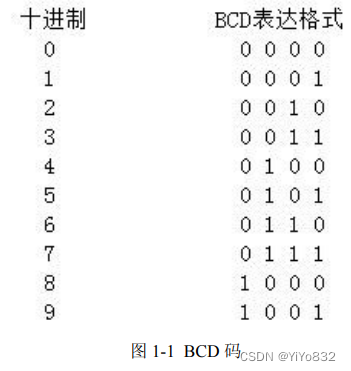

#### 1.1.2 奇偶校验码

 校验码的出现是为了保障传输信息准确无误，常见的单位校验码有奇校验码，偶 校验码。其中奇校验：原始码流 + 校验位总共有奇数个数字“1”。偶校验：原始码流 + 校验位总共有偶数个数字“1”。通常把校验码放在码流的前面或者后面。如图 1-2 所示

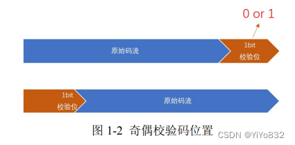

### 1.2 实验目的

了解到了信息传输的种种原理和现况，我们小组决定通过 procise 编程软件和 FMK50T4 制作简易的基于通信协议的信息传输装置。

#### 1.2.1 传输信息的方式

为了直观显示，实时输入信号，我们决定采用 FMK50T4 板上的按钮进行数据输入， 为了传输数据，共使用了两个按钮为 SW4 和 SW7。

#### 1.2.2 传输信息协议

我们自拟了一套简易的传输协议，具体可以查看图 2-2状态机。

下面进行简要说明。

协议说明：先输入 0，然后状态机才进入 start 状态，才可以进行信息传输。然后， 接受四位 BCD 码，再输入 1，状态机进入 stop 状态，一次通信完成。若不按照此协议， 无法完成通信。

#### 1.2.3 信息显示方式

为了表示传输的信息，我们决定采用 FMK50T4 板上的 led 等进行数据显示，led 对 应数据名称如表 1-2下：

下面讲解参数 done 和 verify 含义：

done 表示为一次传输协议是否成功。

verify 为根据 4 为 BCD 码生成的奇校验码。

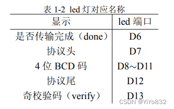

#### 1.2.4 其他模块

为了尽可能模拟信息传递的现实因素过程以及体现状态机的作用，我们设计了其 它按钮代表了不同功能。如表 1-3下：

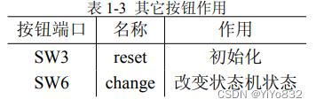

## 2 PROCISE实现

### 2.1 功能实现

总设计电路电子图如下：

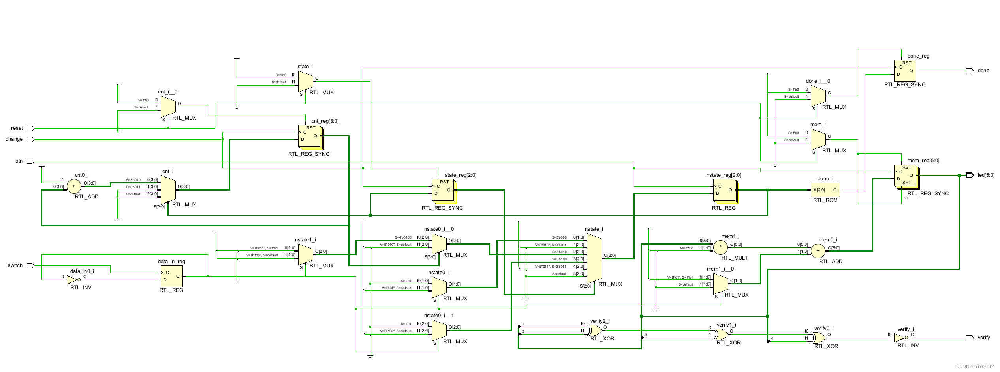

#### 2.1.1信息传输

btn 按钮为录入 01 数据按钮，switch 按钮为切换 01 数据按钮录入数据核心 Verilog 代码块如下：

`    always@(posedge btn) begin
        if (!reset)
            mem <= 1;
        else
            mem <= mem*step + (data_in?);
    end`

Verilog 代码说明：当按下 btn 按钮后，会存储数据 mem 会进行更新，这利用了二进制 乘 2 进位的性质。比如最开始 mem 为 4 ′ b0001; 我录入数据 1，有 mem = mem∗step+1， 则 4 ′ b0011, 反之录入数据 0，有 mem = mem ∗ step，则 4 ′ b0010 改变传输核心 Verilog 代码块如下：

`always@(posedge switch)begin
        data_in <= ~data_in;
    end`

Verilog代码说明：当按下switch按钮后，$data_in$进行反转，实现了输入0，1之间的转换。

#### 2.1.2 状态转移

状态机状态如 2-1表所示

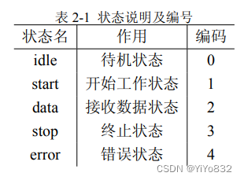

状态转移图如图 2-2所示

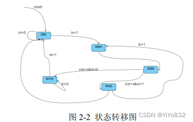

需要说明的是，虽然状态转移图不是最简的状态图，但是为了解决实际传输数据 遇到的问题，该状态图没有必要进行化简。

该有限状态机的状态表展示如下：

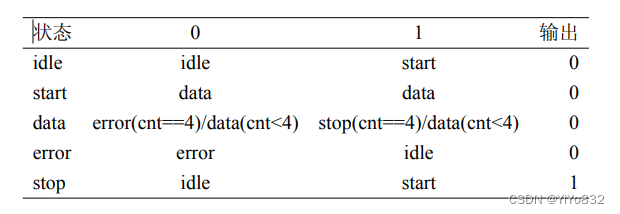

Verilog 核心代码如下：

`    always@(posedge btn) begin
        nstate=idle;
        case(state)
            idle: nstate=data_in?idle:start;
            start: nstate=data;
            data: nstate=(cnt==4)?(data_in?stop:error):data;
            error: nstate=data_in?idle:error;
            stop: nstate=stop;
            default:nstate=idle;
        endcase
    end`

上述代码为状态转移代码，使用了 case 语句进行状态判断和状态转移。

#### 2.1.3 参数实现

我们有两个重要参数，一个是 done 参数，表示传输完毕。一个是 verify，表示奇校验码。

当完成一次协议传输后，即进入状态 stop 时，done 表现为 1，其余状态均表现为 0；当完成一次协议传输后，按照协议对数据进行校验，若满足协议规则，verify 表示 为 1，否则为 0。Verilog 核心代码如下：

`    always@(posedge change)begin
        if(!reset)begin
            done<=0;
            cnt<=0;
        end
        else
            case(nstate)
                ...
                stop: begin
                    done<=1;
                    cnt<=0;
                end
                ...
            endcase
    end`

上述为参数 done 赋值模块，其中”...” 为省略的代码。

我们采用实时更新 verify 的方式，Verilog 代码如下：

`    assign verify = !(led[1]^led[2]^led[3]^led[4]);`

当 4 位 BCD 码存在奇数个 1 时，verify 为 0；当 4 位 BCD 码存在偶数个 1 时，verify 为 1；

### 2.2 仿真波形图

#### 2.2.1 输入波形仿真图

1. 输入的情况

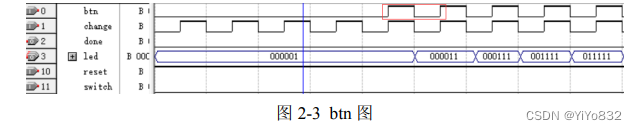

可以看到，当按下 btn 键后，led 从“6’b000001”变到了”6’b000011”，表明确实输 出了 1。

2. 转化 01 的情况

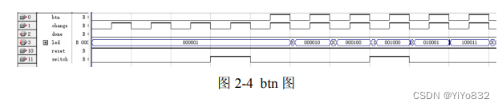

可以看到，当按下 switch，进行转化后，再按下 btn 键后，led 从“6’b000001”变 到了”6’b000010”，表明确实进行了转换并且输出了 0。而后面再次按下 switch 按钮后， 也成功进行了转换。

#### 2.2.2 参数波形仿真图

done

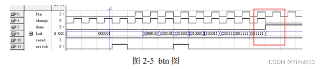

当输入满足通讯协议时，参数 done 从 0 转化为 1，表明通信正常运行。

verify

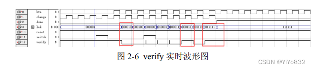

可以看到 verify 波形图实时根据 4 位 BCD 码进行改变。

### 2.3 约束文件

波形仿真图成功运行也并不代表在硬件上可以运行，在硬件上运行需要一定的约 束文件进行约束，因此需要配置约束文件。

#### 2.3.1 UCF 约束文件

`    NET "done" LOC = M17;
    NET "led[0]" LOC = N17;
    NET "led[1]" LOC = P18;
    NET "led[2]" LOC = P19;
    NET "led[3]" LOC = N19;
    NET "led[4]" LOC = N18;
    NET "led[5]" LOC = R18;
    NET "verify" LOC = R19;
    NET "btn" LOC = AA22;
    NET "switch" LOC = T20;
    NET "reset" LOC = U20;
    NET "change" LOC = T19;`

#### 2.3.2 FDC 约束文件

`set_property CLOCK_DEDICATED_ROUTE FALSE [get_nets "btn"];
set_property CLOCK_DEDICATED_ROUTE FALSE [get_nets "switch"];
set_property CLOCK_DEDICATED_ROUTE FALSE [get_nets "change"];`

下面阐述设置 FDC 文件的约束文件原因，工具在编译时通常会自动识别设计中 的时钟网络，并将其分配到专用的时钟布局布线资源中。通过对某些时钟网络设置 CLOCK_DEDICAT ED_ROUT E 值为 FALSE，可以将被识别为时钟网络并按照时 钟网络进行布局布线的时钟信号安排到通用的布线资源中。比如，某些时钟信号由于 设计疏忽或其它原因，没有被安排到电子器件的时钟专用引脚上，在编译的时候就会 报错，此时就可以使用 CLOCK_DEDICAT ED_ROUT E 约束来忽略这个错误。

##  3 实验环节

### 3.1 数据录入

不同测试图片如下：

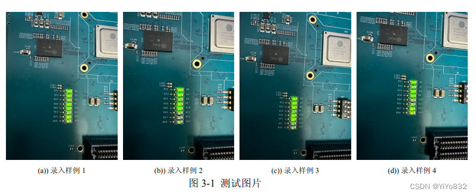

可以看到 led 灯 D7 − D12 有着不同闪烁排序，这是我通过 btn 和 switch 按钮录入 不同的 01 数据，从而使 led 灯呈现不同的状态。这表明数据录入成功！

### 3.2 参数测试

#### 3.2.1 参数 done

测试图片如下：

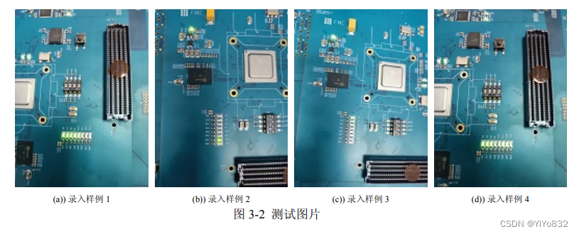

按照协议进行信息传输后，状态机进入 stop 状态后，done 参数从 0 变为 1，则对 应的 led 灯 D6 从亮变为暗，协议成立并且状态机正常工作，信息传输成功。但是，当 没有按照协议进行信息传输时候，状态机不会进入 stop 状态，对应的 led 灯 D6 一直保 持亮着，信息传输失败。

#### 3.2.2 参数 verify

测试图片如下

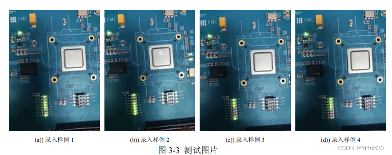

可以看到 verify 对应的 led 灯的明暗确实是按照 4 位 BCD 码变化的，而且满足奇 校验码的要求。

#### 3.3 reset 测试

reset 按钮测试如下：

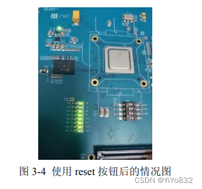

可以看到当按下 reset 按钮后，恢复到初始状态了。

## 附录

Verilog 代码

`        `timescale 1ns / 1ps
    `module top_module(
        input btn,
        input switch,
        input reset,
        input change,
        output reg done,
        output [] led，
        output verify
      );
    parameter idle=0,start=1,data=2,stop=3,error=4;
    reg [] state,nstate;
    reg data_in = 1;
    reg [] cnt;
    reg [] mem = 1;
    reg [] step = 4'b0010;
    always@(posedge btn) begin
        if (!reset)
            mem <= 1;
        else
            mem <= mem*step + (data_in?);
    end

    always@(posedge change) begin
        if(!reset)
            state <= idle;
        else
            state <= nstate;
    end

    always@(posedge switch)begin
        data_in <= ~data_in;
    end

    // 状态转移代码块
    always@(posedge btn) begin
        nstate=idle;
        case(state)
            idle: nstate=data_in?idle:start;
            start: nstate=data;
            data: nstate=(cnt==4)?(data_in?stop:error):data;
            error: nstate=data_in?idle:error;
            stop: nstate=stop;
            default:nstate=idle;
        endcase
    end

    // 输出表
    always@(posedge change)begin
        if(!reset)begin
            done<=0;
            cnt<=0;
        end
        else
            case(nstate)
                data: begin
                    done<=0;
                    cnt<=cnt+1'b1;
                end
                stop: begin
                    done<=1;
                    cnt<=0;
                end
                default: begin
                    done<=0;
                    cnt<=0;
                end
            endcase
    end

    assign led = mem;
    assign verify = (mem[1]^mem[2]^mem[3]^mem[4])

endmodule`

UCF 代码

`    NET "done" LOC = M17;
    NET "led[0]" LOC = N17;
    NET "led[1]" LOC = P18;
    NET "led[2]" LOC = P19;
    NET "led[3]" LOC = N19;
    NET "led[4]" LOC = N18;
    NET "led[5]" LOC = R18;
    NET "verify" LOC = R19;
    NET "btn" LOC = AA22;
    NET "switch" LOC = T20;
    NET "reset" LOC = U20;
    NET "change" LOC = T19;`

FDC代码

`set_property CLOCK_DEDICATED_ROUTE FALSE [get_nets "btn"];
set_property CLOCK_DEDICATED_ROUTE FALSE [get_nets "switch"];
set_property CLOCK_DEDICATED_ROUTE FALSE [get_nets "change"];`
