# XJTUSE-数电-第五次作业

答案不一定对。老师对平时作业很严格的，不要轻易拿图，也不要直接照搬文字，建议自己画图&码字(一旦发现抄袭平时分真的会扣很多的！！！！没有开玩笑，80左右的分都是正常的)

## 第5次数电作业
#### 1、如何用数字电路实现超越函数计算，学习CORDIC算法。
学习之前，先了解什么是超越函数？

1.1  了解超越函数

超越函数[[1]](#_ftn1)(Transcendental Functions)，指的是变量之间的关系不能用有限次加、减、乘、除、乘方、开方运算表示的函数。欧拉把约翰·贝努利给出的函数定义称为解析函数，并进一步把它区分为代数函数(只有自变量间的代数运算)和超越函数(三角函数、对数函数以及变量的无理数幂所表示的函数)，还考虑了“随意函数”(表示任意画出曲线的函数)。如三角函数、对数函数，反三角函数，指数函数，等就属于超越函数。如 y=arcsinx，y=cosx，它们属于初等函数中的初等超越函数。超越函数是指那些不满足任何以多项式作系数的多项式方程的函数。说的更技术一些，单变量函数若为代数独立于其变量的话，即称此函数为超越函数。例如，对数函数和指数函数即为超越函数。 超越函数这个名词通常被拿来描述三角函数，例如正弦、余弦、正割、余割、正切、余切、正矢、半正矢等。

函数的不定积分运算是超越函数的丰富来源，如对数函数便来自代数函数的不定积分。

在微分代数里，人们研究不定积分如何产生与某类“标准”函数代数独立的函数，例如将三角函数与多项式的合成取不定积分。在数学领域中，超越函数与代数函数相反，是指那些不满足任何以多项式作系数的方程的函数，即函数不满足以变量自身的多项式为系数的多项式方程。换句话说，超越函数就是"超出"代数函数范围的函数，也就是说函数不能表示为有限次的加、减、乘、除、乘方和开方的运算。严格的说，关于变量 z 的解析函数 f(z) 是超越函数，那么该函数是关于变量 z 是代数独立的。非超越函数则称为代数函数，代数函数的例子有多项式和平方根函数。对代数函数进行不定积分运算能够产生超越函数，如对数函数便是在对双曲角围成的面积研究中，对倒数函数 y = k/x

不定积分得到的，以此方式得到的双曲函数 sinhx、coshx、tanhx

都是超越函数。微分代数的某些研究人员研究不定积分如何产生与某类“标准”函数代数独立的函数，例如将三角函数与多项式的合成取不定积分。

1.2   学习CORDIC算法

CORDIC为Coordinate rotation digital computer的缩写，来自于J.E.Volder发表于1959年的论文中，是一种不同于“paper and pencil”思路的一种数字计算方法，当时专为用于实时数字计算如导航方程中的三角关系和高速率三角函数坐标转换而开发。

在极坐标中，任何一点X均可以表示为：

其中p为极径，theta为极角。

极坐标的x轴为实轴，y轴为虚轴。

以上图为例，如果只在逆时针方向旋转角度theta，图中两点p1 =(x1,y1)旋转至p2 = (x2,y2)的关系为：

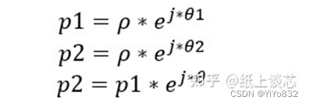

这两点又可以表示为：

将以上关系式子带入p2和p1的关系式中，化简得到：

提取cos theta得：

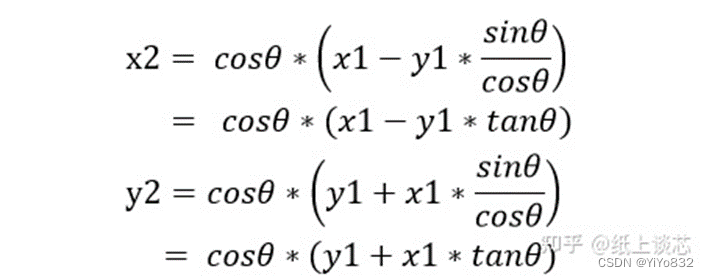

如果将以上点p2再旋转到p3，p4…等等，对于第i次旋转，重新记为如下，每次角度变化记为z(旋转模式下的角度变化)：

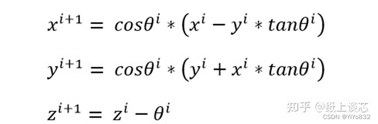

现在我们求点p2的模也就是p2的极径，即：

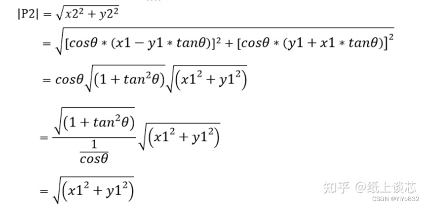
 由此可见，每次旋转后点的模与旋转前点的模相同，也就是说极径相同。

如果忽略每次旋转cos theta的影响，实际旋转后的极径又如何呢？

P2的模重新记为：

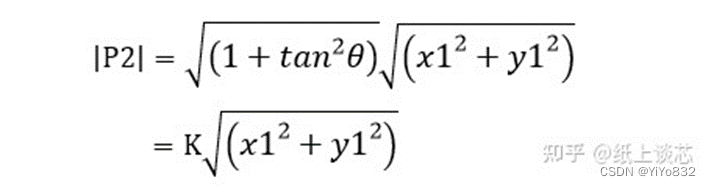

实际中变化的模值缩放值为K=sqrt(1+tan^theta)=1/(cos theta)，忽略cos theta，第i+1次的坐标变换重新表示为：

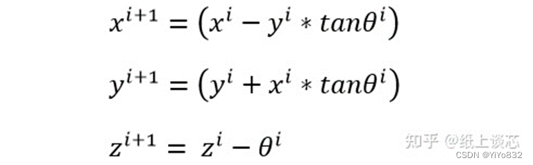

第i+1次旋转模值少乘了一个1/(cos theta)，且(1/cos theta)与sqrt(1+tan^theta)相等，所以点的模值在不断变化。为了恢复原模值的影响，我们需要将每一次模值变化的系数重新乘回去。

根据极坐标的性质，经过M次旋转后，第M次点的左边与初始点(x,y)关系为：

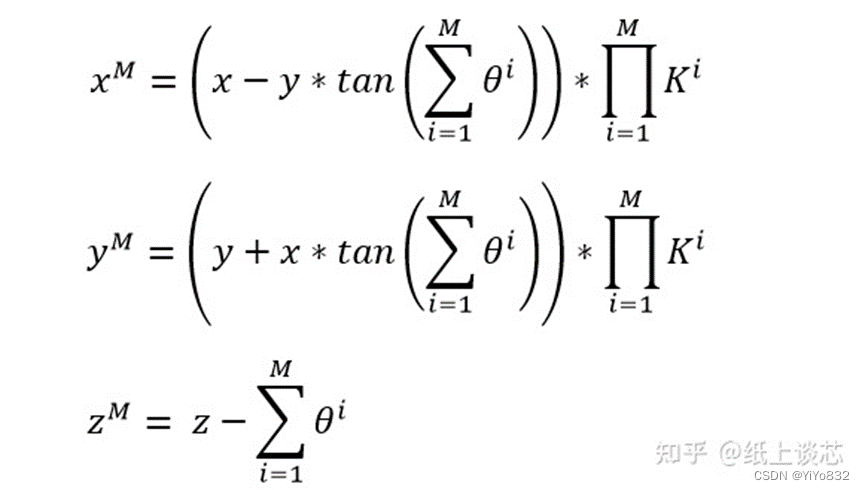

第i次迭代记为Ki，在CORDIC的计算中，经过迭代次数为24时，K=1.646760255。K值为常数，也就是缩放因子。

已经引出迭代操作，假如某个初始点p1，经过多次的递归地在极坐标上旋转，如果能按某种规则旋转，比如将该点的初始角度z转为0，并且保存住每一次旋转的角度并累积，则可以求出该点的初始相位z到底为多少，也就是CORDIC的旋转模式，各位以后看到ROTATION MODE就不会陌生了。

其实每一次点的角度x，y轴和角度变化, 在第一节末尾的基本的迭代公式中已经给出，但是每一次转多少度才能求出p1的角度z，目前为止我们还不知道，并且tan theta与x和y相乘不易，如果有更好的办法比如只是移位操作，问题将会变得更加简单，所以CORDIC算法的迭代公式中引入如下简化使得：

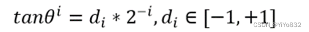

所以CORDIC迭代公式如下，模值常量K统一处理：

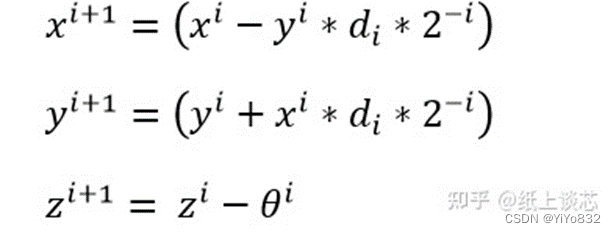

经过如上艺术化的处理，不得不惊叹祖师爷鬼斧神工般的灵感。可以看出每次迭代，x和y只需要i比特的移位器2个，并且x和y坐标变化量和角度的累计一共只需要3个加法器，其中角度的累计还需要将每次 tan^-1(2^-i)求出，当然已经存储在如下表中：

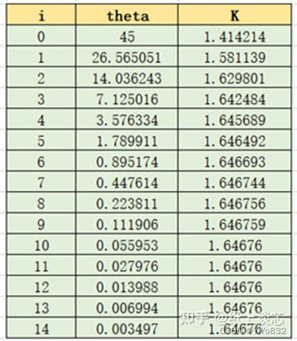

所以它的结构总结起来口诀为朗朗上口的“123”：

1：代表一个表

2：代表两个移位器

3：代表三个加法器

它的运算单元如下：

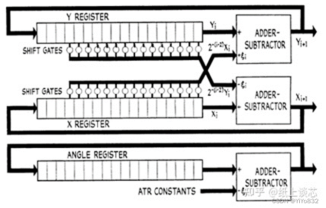

至此，该算法的理论部分和电路设计讲解完毕。

 2、课后习题：5.3、5.4、5.5。

 #### 5.3 题目省略
 (1)“101”序列可以重叠

 先设计状态表，状态表如下：

 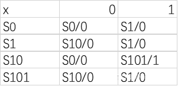

 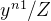

        根据状态表设计状态图如下：

 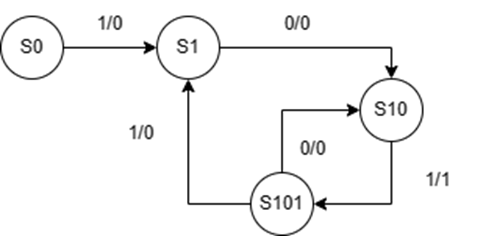

 为了画图方便，自环没有画出。

 (2)“101”序列不可以重叠

 先设计状态表，状态表如下：

 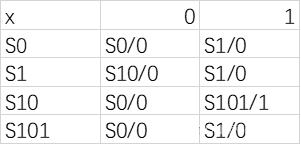

 

       根据状态表设计状态图如下：

 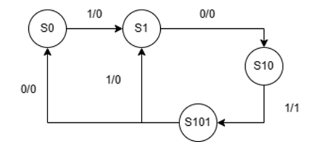

 为了画图方便，自环没有画出。

 #### 5.4   题目省略
 (a) 化简过程如下：

 1.画隐含表格：

 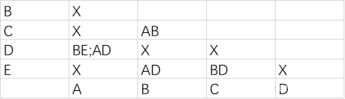

 2.合并关联项:

 A=AD

 B=BE

 C=C

 3.得到化简后的状态表:

 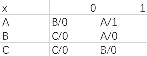

 (b) 化简过程如下：

 1.画隐含表格：

 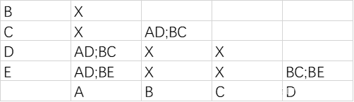

 2.合并关联项

 A=AD

 B=BC

 C=E

 3.得到化简后的状态表

 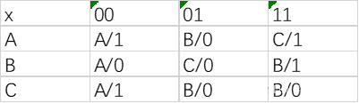

 ####
 #### 5.5   题目省略
 (a)步骤如下：

 1.画隐含表：

 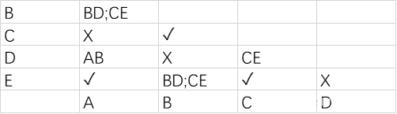

 2.合并关联项:

 (A,E),(B,C),(C,D),(C,E)

 3.求最大相容类：

 (A,E),(B,C),(C,D),(C,E)

 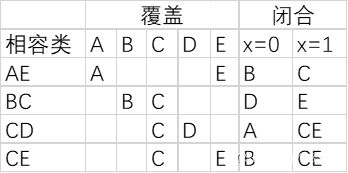

 3.求相容类集合：

 A=AE

 B=BC

 C=D

 4.化简状态表：

 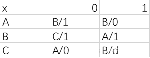

 (b)步骤如下：

 1.画隐含表：

 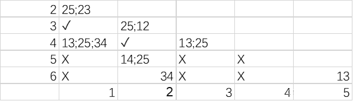

 2.合并关联项:

 (1,2),(1,3),(1,4),(2,3),(2,4),(2,5),(2,6),(3,4),(5,6)

 3.求最大相容类：

 (1,2,3,4),(2,5,6)

 

 3.求相容类集合：

 1=134

 2= 256

 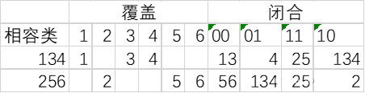

 4.化简状态表：

 

  [[1]](#_ftnref1) 内容来源知乎
