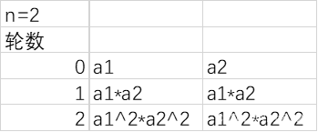
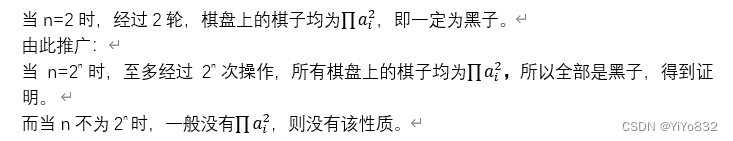

# XJTUSE-数学建模-homework1

## 选题A 棋子问题

## 一、问题描述

任意拿出黑白两种颜色的棋子N个,排成一个圆圈.然后在两颗颜色相同的棋子中间放一颗黑色棋子,在两颗颜色不同的棋子中间放一颗白色棋子,放完后撤掉原来所放的棋子.再重复以上的过程,这样放下一圈后就拿走前次的一圈棋子,问这样重复进行下去各棋子的颜色会怎样变化呢?

## 二、初步分析

       先把题目描述进行图示便于寻找规律。

       比如给出初始图如下：

       需要进行题目所说的操作，在该圈的外围增加棋子，变成下面这幅图：

       再撤销掉之前的棋子得到新的圈：

       不难发现以下规律：

1.当出现全为黑棋时，将一直保持全为黑子。

2.一定会出现有循环，这是因为状态是有限的，最多有2n个状态。

这就是我们发现的规律，下面将进行模拟和证明。

## 三、符号说明

       为了简化问题，将问题简化成如下符号：

			符号

			意义

			数字“1”

			表示黑棋

			数字“0”

			表示白棋

			符号“*”

			表示按照规则放棋子的操作

			n

			总棋子个数

## 四、模型的建立

该模型简单，利用python进行模拟即可。当发现棋盘的棋子颜色不再改变时停止模拟，当次数过多自动停止。输出每轮后的棋盘样子。

       代码如下：

`now = list(input())
n = len(now)
next: list  # 记录下一棋盘
flag = True  # 标记前后棋盘是否不一致
game = 0
while flag and game < 2 ** n:
    print(f"第{game}轮棋盘:", *now)  # 输出当前棋盘
    next = ["1" if now[i % n] == now[(i + 1) % n] else 0 for i in range(n)]
    flag = (str(now) != str(next))  # 简单判断是否棋盘是否一致
    now = next
    game += 1`

## 五、模型结果

当输入为“1101”时，结果如下：

			第0轮棋盘: ['1', '1', '0', '1']

			第1轮棋盘: ['1', '0', '0', '1']

			第2轮棋盘: ['0', '1', '0', '1']

			第3轮棋盘: ['0', '0', '0', '0']

			第4轮棋盘: ['1', '1', '1', '1']

保持黑子

当输入为“100011”，结果如下：

			第0轮棋盘: ['1', '0', '0', '0', '1', '1']

			第1轮棋盘: ['0', '1', '1', '0', '1', '1']

			第2轮棋盘: ['0', '1', '0', '0', '1', '0']

			第3轮棋盘: ['0', '0', '1', '0', '0', '1']

			第4轮棋盘: ['1', '0', '0', '1', '0', '0']

			第5轮棋盘: ['0', '1', '0', '0', '1', '0']

			第6轮棋盘: ['0', '0', '1', '0', '0', '1']

			第7轮棋盘: ['1', '0', '0', '1', '0', '0']

       出现循环

       当输入为“11001”

			第0轮棋盘: ['1', '1', '0', '0', '1']

			第1轮棋盘: ['1', '0', '1', '0', '1']

			第2轮棋盘: ['0', '0', '0', '0', '1']

			第3轮棋盘: ['1', '1', '1', '0', '0']

			第4轮棋盘: ['1', '1', '0', '1', '0']

			第5轮棋盘: ['1', '0', '0', '0', '0']

			第6轮棋盘: ['0', '1', '1', '1', '0']

			第7轮棋盘: ['0', '1', '1', '0', '1']

			第8轮棋盘: ['0', '1', '0', '0', '0']

			……

       次数不够，尚未出现循环。

## 六、结论

得出了以下结论：

1.当棋子数为2n时，至多经过2n次操作，就可以全部变为黑子。

2.当棋子数目为偶数的时候，黑白棋按照0，1，2个黑子为间隔交互排列，如“0000”按照0个间隔排序，“1010”就是按照1个间隔排序，“110011001100”就是按照2个间隔排序。则经过有限次数一定会变到全为黑子。

3. 当一般情况时，在2n次变换中，总能出现循环。

结论1证明：

采用归纳法证明：

设棋子数为n，a1,a2,a3,…,an为初始状态。

如下表：

结论2证明：

       1. 当间隔为0，经过1次变换全为黑子。

       2. 当间隔为1，经过2次变换全为黑子。

       3. 当间隔为2，经过3次变换全为黑子。

结论3证明：

       因为棋子个数为n，棋子要么是白棋要么是黑棋，最多出现2n种情况，根据鸽巢原理原理，一定会出现循环的情况。

## 七、进一步思考

       上述结论并不完备，因此想到了一个有趣的算法。有穷自动机，下面就其算法进行进一步讲解。

       该问题可以简化成一个有穷自动机，包含以下几个特点：

       1.每种棋盘状态表示为一个点，有且只有一个出度，指向下一个变换的棋盘状态。

2.只有全为黑子的棋盘的下一指向为自己。

       这样子就可以进行解释了。

解释1：为什么会出现循环？

答：因为当n一定时，有穷自动机图一定存在圈，有多少种圈，就有多少种循环模式。

解释2：为什么存在特定解法到全为黑子？

答：因为存在几条特定的路到全为黑子的棋盘状态。

解释3：为什么规律难以发现？

答：因为从不同点进入图，虽然路线唯一，但是无法判断是在那个圈里面，难以判断出现循环的次数。

因此，针对不同的n只需要做出相应的有穷状态机的图像，就可以大大简化模拟过程，代码不再给出。

## 八、总结

棋盘是一个简单的模拟问题，通过对特例的分析可以得到不少有趣的结论，但是想要系统完备地给出结果还是非常困难的，但是棋盘变换可以借助有穷自动机来进行研究，可以大大简化问题。
