# XJTUSE-数学建模-大作业

## 前言

记录一下组队写的数模大作业，不过最后得分好像也不高，大家可以借鉴一下。

(不过好像每年都不一样，所以说看看把

我们小组建模也挺一般的，没什么很高级的模型hhh

## 题目

古代玻璃珠成分分析

玻璃珠是我国古代玻璃器物中最常见的一类器型，从西周开始就已存在了，至战国时期则大为流行。战国秦汉时期，玻璃珠饰作为一类重要的随葬品，经常出现在墓葬中。由于各地制作玻璃的技术不同，玻璃的化学成分能反映其产地的特征，所以通过对玻璃样本进行化学成分分析，以此来了解它们的产地、来源等历史信息，往往能够获得古代文化交流和贸易等方面的信息。

玻璃的主要原料是石英砂(主要化学成分是SiO2)，烧制中加入不同的材料以帮助降低熔点，材料不同其化学成分不同。按照化学成分分类，我国出土的先秦至两汉时期的玻璃大致可分为三种类型：

钠钙玻璃，烧制中加入石灰和草木灰，即以氧化钠NaO作为助熔剂、氧化钙CaO作为稳定剂的硅酸盐玻璃，通常被认为是从西方引入的玻璃品种；

铅钡玻璃，烧制中加入硝石和方铅矿等，以氧化铅PbO、氧化钡BeO作为助熔剂的硅酸盐玻璃，通常被认为是我国自己发明的玻璃品种；例如楚文化的玻璃以铅钡玻璃为主。

钾玻璃，以氧化钾K2O作为助熔剂的硅酸盐玻璃，主要流行于我国岭南以及东南亚和印度等区域。

现有某地出土的一批玻璃珠样本，主要来源于戎人墓和秦人墓，其中秦人墓分为平民墓和贵族墓，样本的基本信息见附件1，主要成分所占比例数据见附件2，(F、G说明)部分样本的主要化学成分及微量元素含量比例数据见附件3。请依据这些数据进行分析，回答以下问题：

问题1：依据附件1的数据，分析玻璃珠的类型与出产年代、纹饰的关系。

问题2：玻璃珠出土后可能会发生表面风化，依据附件1和附件2，分析表面风化后样品化学成分含量的变化。根据一个表面有风化的样本分析数据，是否能推测出其风化前化学成分含量可能的比例？阐述推测的准确性。

问题3: 依据附件1和附件2，找出玻璃珠类型的分类规律。对未知类型的新样本进行分析，判断该样本所属类型，并对分类效果进行评价。

问题4：依据附件3数据，分析PbO 、BaO 这两种主要化学成分与哪些微量成分含量相关，对其含量产生什么样的影响？

(备注：对文物样品需要分析其原料所属产地，不同产地的原料其微量元素含量不同，因此需要研究原料(主要化学成分)与哪些微量元素含量密切相关。用另一种分析仪器测得部分样本更多的元素，其成分含量包括主要成分和微量成分，主要成分主要体现原料来源，微量成分为该样本中所有成分的含量数据，这些微量成分是由不同的主要成分带入的。)

附件1：样本基本信息(excel表)

附件2：部分样本主要化学成分信息(excel表)

       (F样品和G样品测试分析的仪器不同，测试化学成分略有不同)

附件3：部分样本主要成分及微量元素信息(excel表)

补充说明：

纹饰说明：

- 单色玻璃

			深蓝

			淡蓝

			淡绿

			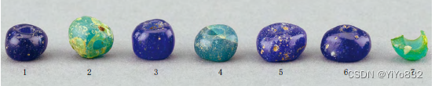

			

			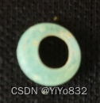

- 蜻蜓眼

蜻蜓眼玻璃珠为春秋战国时期玻璃珠的主要形式，同时它还遍布中亚、西亚及北非各地，是中西方玻璃器所共有的品种。

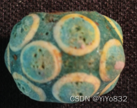  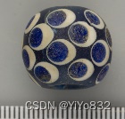

3.费昂斯

西周贵族组佩中经常与红色玛瑙珠搭配在一起的还有一种蓝色或者绿色的费昂斯珠，珠子大致呈菱形，也有管子，表面釉光，不透明。这就是被西方学者称为费昂斯( faience)的人工合成材料，一般认为它是玻璃的前身，是一种原始玻璃。

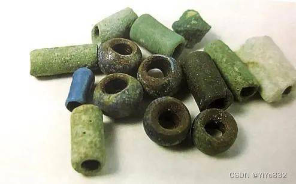  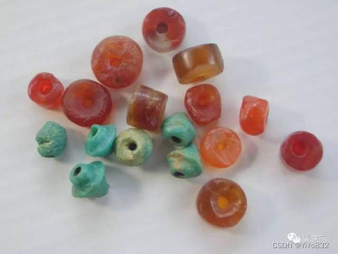

## 论文如下：

古代玻璃珠成分分析

摘要

古代玻璃珠主要成分是石英砂，为了在炼制时降低熔点，会添加草木灰(含钾)或者铅矿石(主要含氧化铅(PbO)、氧化钡(BaO)等作为助熔剂。玻璃受环境影响发生风化，玻璃的成分也随之发生一定的变化。为了探讨玻璃风化与其化学成分含量以及纹饰、颜色等特征的关系，我们结合附件中的数据，对其展开探究。

一、问题重述

1.1 问题背景

对玻璃文物化学成分的分析有利于考古工作者对文物进行分类与研究，有利于人类对中国古代相关历史的探寻，相关问题的分析对文物研究以及古代历史研究有着至关重要的作用。不同方式烧制的玻璃制品有着不同的化学成分，同时，古代玻璃容易因埋藏环境，类型，纹饰，颜色等特征不同发生不同程度的风化，从而使化学成分发生变化。

利用对出土的古代玻璃制品的化学成分的分析，可以探究玻璃文物风化的影响因素，对玻璃文物进行细致的划分，并探究同一类别文物化学成分含量的关联之处。

1.2 需解决的问题

现已有一批我国古代玻璃珠样本的相关数据，建立数学模型解决以下问题：

(1)依据附件1的数据，分析玻璃珠的类型与出产年代、纹饰的关系。

(2)在已知玻璃珠出土后可能会发生表面风化的情况下，结合数据，分析表面风化后样品化学成分含量的变化。并根据一个表面风化过的样本数据，推测风化前的化学成分含量可能的比例。并分析推测的准确性。

(3)结合数据，总结玻璃珠类型的分类模型，并对新样本进行推测。并评价模型的分类效果。

(4)分析PbO、BaO与其他化学成分之间的关联关系，得到它们对其他成分含量的影响。

二、问题分析

本文探究的是玻璃文物的风化程度与其化学成分以及纹饰、颜色等特征的关系。第一问需要得到玻璃珠的类型与出产年代、纹饰的关系。第二问则关注于玻璃的风化程度，第三问要求给出玻璃珠类型的分类规律，并且用得到的模型来对新样本进行预测。第四问关注于化学成分含量之间的相关关系。

2.1问题一的分析

附件表单一给出了74组文物相关数据，首先，对附件中的数据进行处理，我们剔除八组纹饰缺失的数据。要分析得到玻璃珠的类型与其出产年代、纹饰的相关性，可以采用贝叶斯模型在纹饰与出产年代的不同的先验条件下计算出后验概率。通过对结果的分析可以得到不同的先验条件下，其他特征的概率分布情况、

先验条件的个数是否会对玻璃珠类型的概率分布产生决定性的影响等。

2.2问题二的分析

附件表单二给出已分类玻璃文物的化学成分比例信息，需要分析文物的分类依据并在此基础上进行进一步的亚类分析。首先对数据进行筛选和处理，去除两组比例累计不在要求范围内的数据，并结合表单一将数据分为高钾和铅钡两类。本题要求将玻璃文物进行分类，是典型的分类问题。对数据进行分析后，可以大致估计文物大类的分类依据，在此基础上，可以进行进一步的验证和求解。对于亚类的划分，由于分类依据未知，主要考虑使用K-means聚类算法对文物进行进一步的类型划分。由于表单二数据维度较高，考虑对数据使用t-SNE算法对其进行降维处理，再对文物进行聚类分析从而分出亚类。最后将各个小类的中心点各化学成分作比较，就得出能作为亚类划分依据的化学物质。

2.3问题三的分析

第三问先进行数据预处理，将风化和未风化玻璃的各种特征的比例做出相应的热力图，对表单三中的未知玻璃文物进行分类。我们为了对数据进行降维，选取了pca进行降维，实现了将高维数据压缩到二维的目标，并且保留了原始数据中最重要的信息。通过可视化这个二维数据集，我们可以更好地理解数据之间的关系，并进行进一步的分析和挖掘。我们使用KNN机器学习算法，找到最近的K个邻居，并将该样本划分为出现次数最多的类别对给定的玻璃珠的化学成分预测其类型

2.4问题四的分析

第四问需要分析PbO 、BaO 这两种主要化学成分与哪些微量成分含量相关，及含量的影响。通过假设，判断为线性相关，采用线性回归方法解决问题。需要先对微量元素数据进行归一化处理，利用lasso回归模型分析得到不同类别玻璃文物化学成分之间的相关性，通过梯度下降的方法求得一种回归参数，再通过该参数下计算出来的相关性系数的大小，从而得到关联关系。最后验证模型，即需要分析R2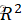的值判断回归拟合的效果

三、模型假设

1.假设题目提供的数据真实可靠；

2.仅考虑文物未风化时的化学成分含量对风化后的化学成分含量的作用；

3.假设文物出土之后各特征和化学成分不会发生很大的变化；

4.微量元素对于主要化学成分影响程度有限，而且微量元素之间相互独立。

四、定义与符号说明

			符号定义

			符号说明

			Ai

			某个类别的观察频数

			Ho

			计算出的期望频数

			p

			描述显著性

			X²

			卡方值

			sensitive

			敏感度

			TP

			正确的样本

五、模型的建立与求解

5.1 问题一模型建立与求解

5.1.1 数据预处理

剔除纹饰缺失的数据8组，一共得到有效数据66个。统计如下表：

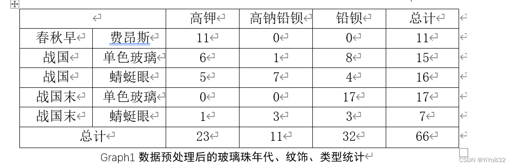

可以通过该表格初步计算出各项后验概率。

5.1.2模型建立

贝叶斯模型运用贝叶斯统计进行预测，充分利用先验信息，相较于一般的回归模型，贝叶斯模型具有明显的优越性。

P(XiY)表示在Y的条件下，Xi发生的概率；

P(Xi)表示不附加任何条件下，Xi发生的概率；

由贝叶斯公式计算后验概率：

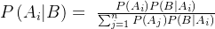

5.1.3模型的求解

通过建立的贝叶斯模型，对不同先验条件下的玻璃珠类型概率分布进行计算。

1.在出产年代、纹饰已知时，玻璃珠类型概率如下：

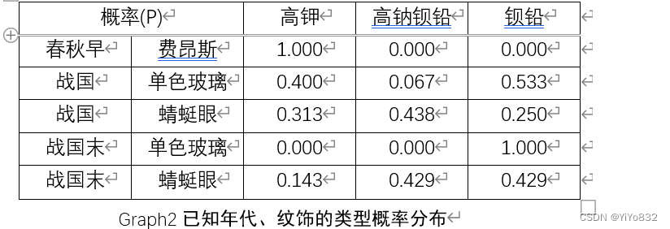

2.在出产年代已知，纹饰未知时，玻璃珠类型概率和在纹饰已知，出产年代未知时，玻璃珠类型概率均可以通过图表1计算得出：

			概率(P)

			高钾

			高钠铅钡

			铅钡

			春秋早

			1.000

			0.000

			0.000

			战国

			0.355

			0.258

			0.387

			战国末

			0.042

			0.125

			0.833

Graph3已知年代、未知纹饰的类型概率分布

			概率(P)

			高钾

			高钠铅钡

			铅钡

			费昂斯

			1.000

			0.000

			0.000

			单色玻璃

			0.188

			0.031

			0.781

			蜻蜓眼

			0.261

			0.435

			0.304

Graph4已知纹饰、未知年代的类型概率分布

3.在玻璃珠类型已知时，出产年代、纹饰概率如下：

			概率(P)

			春秋早

			费昂斯

			战国

			单色玻璃

			战国

			蜻蜓眼

			战国末

			单色玻璃

			战国末

			蜻蜓眼

			高钾

			0.478

			0.261

			0.217

			0.000

			0.043

			高钠铅钡

			0.000

			0.091

			0.636

			0.000

			0.273

			铅钡

			0.000

			0.250

			0.125

			0.531

			0.094

Graph5已知类型的年代与纹饰概率分布

4.在玻璃珠类型已知，单独得出产年代概率和纹饰概率均可以通过图表2算得出：

			概率(P)

			春秋早

			战国

			战国末

			高钾

			0.478

			0.478

			0.043

			高钠铅钡

			0.000

			0.727

			0.273

			铅钡

			0.000

			0.375

			0.625

Graph6已知类型的年代概率分布

			概率(P)

			费昂斯

			单色玻璃

			蜻蜓眼

			高钾

			0.478

			0.261

			0.261

			高钠铅钡

			0.000

			0.091

			0.909

			铅钡

			0.000

			0.781

			0.219

Graph7已知类型的纹饰概率分布

朴素贝叶斯算法分类步骤如下：

Step 1：根据预处理的表格数据计算P(Ai)。注意，由于数据量较少，应当适当的利用数据特征，我们允许P(Ai)=0，即不存在一定出产年代+纹饰的组合。

Step 2：根据后验概率表，算出每个P(B|Ai)，注意，由于数据量较少，应当适当的利用数据特征，我们允许P(B|Ai)=0，这利用了数据的特征。

Step 3：将Step1与Step2中算出的数据进行连乘，如下公式：

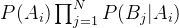

Step 4：由此可以计算出每个类的概率值，进行比较，将概率值最大的类作为分类结果。

5.1.4模型的结果

通过统计学知识可得，将概率<0.05的事件视为小概率事件，在单次实验中几乎不出现。

通过上面计算的后验概率，得到以下结论：

一、当得知出产年代时，判断玻璃珠类型：

1.当出产年代为春秋早时，玻璃珠类型大概率为高钾。

2. 当出产年代为战国时，玻璃珠类型难以确定，概率接近。

3. 当出产年代为战国末时，玻璃珠类型为铅钡的概率(0.833)远大于其它两种类型的。

二、当得知纹饰时，判断玻璃珠类型：

1.当纹饰为费昂斯时，玻璃珠类型大概率为高钾。

2.当纹饰为单色玻璃时，玻璃珠类型为铅钡的概率(0.781)远大于其它两种类型的。

3.当纹饰为蜻蜓眼时，玻璃珠类型难以确定，概率接近。

三、当得知玻璃珠类型时，判断出产年代：

1.当玻璃珠为高钾时，出产年代在春秋早或战国。

2.当玻璃珠为高钠铅钡时，出产年代大概率在战国。

3.当玻璃珠为铅钡时，年代为战国末的概率大于战国的，且不可能为春秋早。

四、当得知玻璃珠类型时，判断纹饰：

1.当玻璃珠为高钾时，纹饰为费昂斯的概率大于另外两种。

2.当玻璃珠为高钠铅钡时，纹饰大概率为蜻蜓眼。

3.当玻璃珠为铅钡时，纹饰单色玻璃的概率大于蜻蜓眼，且不可能为费昂斯。

通过朴素贝叶斯算法，可以得到以下结论：

五、当得知出产年代和纹饰时，判断玻璃珠类型：

1.单一的元素可能无法推测、判断类型，比如只知道出产年代为战国或者纹饰为蜻蜓眼时，难以推测类型。但是，当得知另一元素时，通过朴素贝叶斯算法，利用数据特征，可以进行推测类型而且不同类的概率差值比单元素使用后验概率的差值大，即更有把握。

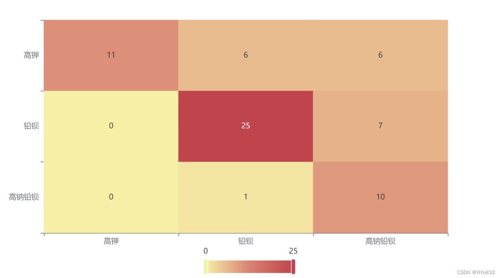

Figure 1玻璃类型热力图

准确率为69.7%，精准率为80.0%，F为70.2% 。

2.出产年代一共有3个，而纹饰也一共有三个，两两组合有9种情况，但是，根据模型假设，只会出现5种情况。所以说，当出现不合理的出产年代和纹饰组合时，有必要重新检验。

六、当得知玻璃珠类型时，判断出产年代和纹饰：

1.得知玻璃珠类型，单独判断出产年代或纹饰，可能有些概率相近，但是如果判断出产年代和纹饰，因为在三中已经提到了，有些组合不会出现，因此判断准确率上升。

2.当玻璃珠为高钾时，为春秋早+费昂斯概率最高，且与其它类型概率相差大。

3.当玻璃珠为高钠铅钡时，为战国+蜻蜓眼概率最高，且与其它类型概率相差大。

4.当玻璃珠为铅钡时，为战国末+单色玻璃概率最高，且与其它类型概率相差大。
