# XJTUSE-数据结构-homework1

## 任务 1

题目：

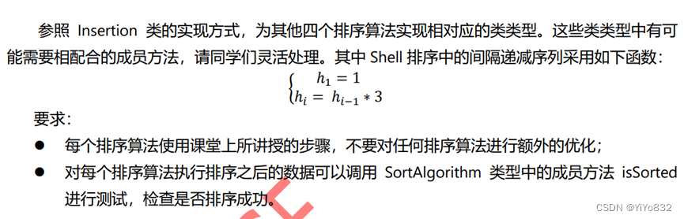

排序算法设计：

需要写Selection、Shell、Quicksort 和 Mergesort四种排序算法，书上讲述比较全面而且不需要进行额外的优化，下面我简要地按照自己的理解讲述。

Selection(选择排序)：

关键代码：

`for (int i=0;i< arr.length;i++){
            int temp = i;
            for (int j=i;j<arr.length;j++){
                if (less(arr[j],arr[temp])){
                    temp = j;
                }
            }
`

通过两个循环完成排序。其中第一个循环是选择次数，第二个循环保证较大/较小的元素可以往前交换。

Shell(希尔排序)：

关键代码：

`int temp = 1;
        while (temp*3<len){
            temp = temp*3;
        }
        for (int gap = temp;gap>0;gap /= 3){
            for (int i=gap;i<len;i++){
                for (int j= i;j>=gap&&less(arr[j],arr[j-gap]);j-=gap){
                    exchange(arr,j,j-gap);
                }
            }
        }
`

希尔排序相当于多次有间隔的选择排序，从间隔较大的开始，起到了局部的排序，减少了排序的平均时间，再到间隔为1的，保证了该排序算法的有效性。

可以注意到，该间隔为3以及3的倍数，这会导致长度为2的排序失效，因此需要考虑长度为2的特殊情况。

我添加了以下代码：

`if (len<3){
    new Selection().sort(arr);
    return;
}  `

保证了Shell排序算法无论输入数组长度为何值都是正确的。

Quicksort(快速排序算法)：

快速排序通过“随机”选择一个数，交换，比较，再交换，最后子数组递归，保证了排序的准确性，而且相较于前面的排序算法，该算法时间复杂度大大提升至O(nlogn)。具体代码在附录可见。

Mergesort(归并排序)：

这是经典的空间换取时间的排序算法。

关键方法如下：

`private void mergeSort(Comparable[] arr,Comparable[] temArr, int left,int right)；
private void merge(Comparable[] arr,Comparable[] temArr, int leftPos,int rightPos,int rightEnd)；
`

其中mergeSort反复递归，merge是用来合并两个子数组成为一个有序的父数组。

通过当子数组长度为1为边界条件保证了排序的准确性。

接下来就是测试编写的四种排序算法的正确性，我参考老师提供的SortTest编写了Test类，随机选择数据量，多次运行，其isSorted结果均为true。

以下为测试结果：

`这是Insertion测试：
数据量为100,验证结果为：true
数据量为1000,验证结果为：true
数据量为10000,验证结果为：true
这是Shell测试：
数据量为100,验证结果为：true
数据量为1000,验证结果为：true
数据量为10000,验证结果为：true
这是Quicksort测试：
数据量为100,验证结果为：true
数据量为1000,验证结果为：true
数据量为10000,验证结果为：true
这是Selection测试：
数据量为100,验证结果为：true
数据量为1000,验证结果为：true
数据量为10000,验证结果为：true
这是Mergesort测试：
数据量为100,验证结果为：true
数据量为1000,验证结果为：true
数据量为10000,验证结果为：true
`

## 任务2

题目：

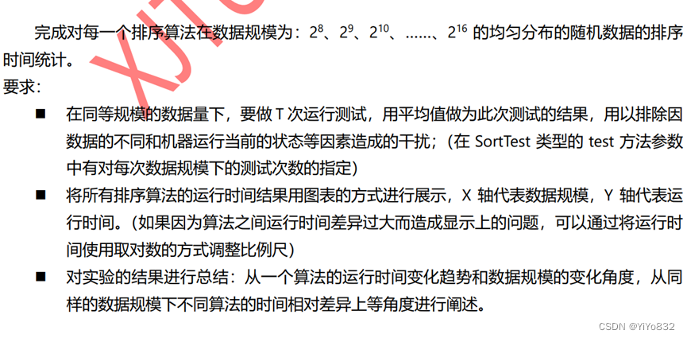

将老师提供的SortTest进行了如下更改：

1.根据数据改变了数据量数组；

2.输出文字进行改变

测试结果(时间单位为ns)如下：

`这是Insertion测试：
数据量2^8,5次平均1322680.0000
 数据量2^9,5次平均1468760.0000
 数据量2^10,5次平均2458300.0000
 数据量2^11,5次平均4726600.0000
 数据量2^12,5次平均18527580.0000
 数据量2^13,5次平均74433980.0000
 数据量2^14,5次平均357883060.0000
 数据量2^15,5次平均1593175460.0000
 数据量2^16,5次平均6490592300.0000
 这是Shell测试：
数据量2^8,5次平均153680.0000
 数据量2^9,5次平均311600.0000
 数据量2^10,5次平均405260.0000
 数据量2^11,5次平均352040.0000
 数据量2^12,5次平均841920.0000
 数据量2^13,5次平均1360680.0000
 数据量2^14,5次平均2785880.0000
 数据量2^15,5次平均7956360.0000
 数据量2^16,5次平均20619880.0000
 这是Quicksort测试：
数据量2^8,5次平均225160.0000
 数据量2^9,5次平均118000.0000
 数据量2^10,5次平均241120.0000
 数据量2^11,5次平均473040.0000
 数据量2^12,5次平均759900.0000
 数据量2^13,5次平均1666420.0000
 数据量2^14,5次平均6832760.0000
 数据量2^15,5次平均4231260.0000
 数据量2^16,5次平均9369600.0000
 这是Selection测试：
数据量2^8,5次平均599240.0000
 数据量2^9,5次平均783020.0000
 数据量2^10,5次平均2269340.0000
 数据量2^11,5次平均2438100.0000
 数据量2^12,5次平均8725240.0000
 数据量2^13,5次平均33024260.0000
 数据量2^14,5次平均141893780.0000
 数据量2^15,5次平均701216720.0000
 数据量2^16,5次平均3065605780.0000
 这是Mergesort测试：
数据量2^8,5次平均145160.0000
 数据量2^9,5次平均71820.0000
 数据量2^10,5次平均154580.0000
 数据量2^11,5次平均343920.0000
 数据量2^12,5次平均729580.0000
 数据量2^13,5次平均1674500.0000
 数据量2^14,5次平均14065500.0000
 数据量2^15,5次平均29093740.0000
 数据量2^16,5次平均21794940.0000
`

(数据具有随机性，下面的图像与上面数据不符合)

画出的图像如下：

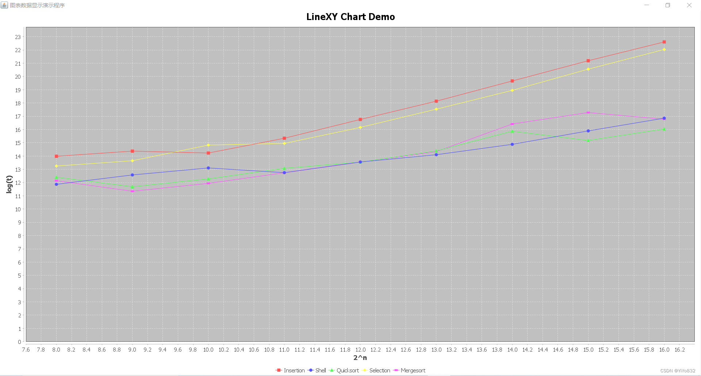

总结：

       1.所有算法的运行时间随着数据量的增大均体现出增长的趋势，但是增长的速度不同，可以看出Insertion和Selection算法的增长速度相似，Shell，Quicksort, Mergesort 增长速度相似，而且前两个算法增长速度大于后三个算法速度。

       2.从运行时间的绝对值来讲，出现了两个拐点，第一个拐点是数据量为2^11时，不同增长速度的算法开始分开，运行时间相差较大。第二个拐点时数据量为2^13时，这时候增长速度相似的算法也开始波动了，这就与算法的具体实现过程有着密切的关系，比如虽然理论值Mergesort和Quicksort的运行时间应该小于Shell，但是实际上并没有多大的差距，这就表明在分配空间和递归的耗时抵消了算法上的优势。

## 任务3

题目：完成对每一个排序算法在数据规模为：2^8、2^9、2^10、……、2^16 的 k-有序的随机数据的排序时间的统计。(k-有序数据序列有时也被称为近似有序的数据序列)

要求：

 在同等规模的数据量下，要做 T 次运行测试，用平均值做为此次测试的结果，用以排除因数据的不同和机器运行当前的状态等因素造成的干扰；

 在该任务中除了有数据规模的变化外，还有一个可变因子 k，请同学们针对不同的 k 也做一次测试设计。

 将所有排序算法的运行时间结果用图表的方式进行展示，X 轴代表数据规模，Y 轴代表运行时间。(如果因为算法之间运行时间差异过大而造成显示上的问题，可以通过将运行时

间使用取对数的方式调整比例尺)

对实验的结果进行总结，要求同任务 2

代码：对任务二中的稍作修改即可；

数据(时间单位为ns)如下：

k=5

`这是Insertion测试：
数据量2^8,5次平均70240.0000
 数据量2^9,5次平均73040.0000
 数据量2^10,5次平均119780.0000
 数据量2^11,5次平均228200.0000
 数据量2^12,5次平均465260.0000
 数据量2^13,5次平均276200.0000
 数据量2^14,5次平均422700.0000
 数据量2^15,5次平均668580.0000
 数据量2^16,5次平均926340.0000
 这是Shell测试：
数据量2^8,5次平均81920.0000
 数据量2^9,5次平均146000.0000
 数据量2^10,5次平均385620.0000
 数据量2^11,5次平均290640.0000
 数据量2^12,5次平均293740.0000
 数据量2^13,5次平均668400.0000
 数据量2^14,5次平均629120.0000
 数据量2^15,5次平均1305220.0000
 数据量2^16,5次平均2659820.0000
 这是Quicksort测试：
数据量2^8,5次平均209900.0000
 数据量2^9,5次平均96180.0000
 数据量2^10,5次平均135320.0000
 数据量2^11,5次平均288840.0000
 数据量2^12,5次平均629000.0000
 数据量2^13,5次平均1351740.0000
 数据量2^14,5次平均3531480.0000
 数据量2^15,5次平均2995280.0000
 数据量2^16,5次平均7122440.0000
 这是Selection测试：
数据量2^8,5次平均738000.0000
 数据量2^9,5次平均1435820.0000
 数据量2^10,5次平均3447300.0000
 数据量2^11,5次平均3149240.0000
 数据量2^12,5次平均10804340.0000
 数据量2^13,5次平均43137980.0000
 数据量2^14,5次平均174787920.0000
 数据量2^15,5次平均700124900.0000
 数据量2^16,5次平均2294058560.0000
 这是Mergesort测试：
数据量2^8,5次平均139540.0000
 数据量2^9,5次平均60960.0000
 数据量2^10,5次平均107560.0000
 数据量2^11,5次平均230620.0000
 数据量2^12,5次平均516120.0000
 数据量2^13,5次平均1193680.0000
 数据量2^14,5次平均7410920.0000
 数据量2^15,5次平均21259640.0000
 数据量2^16,5次平均8129380.0000
`

(数据具有随机性，下面图像与上面数据不一致)

图像：

k=5

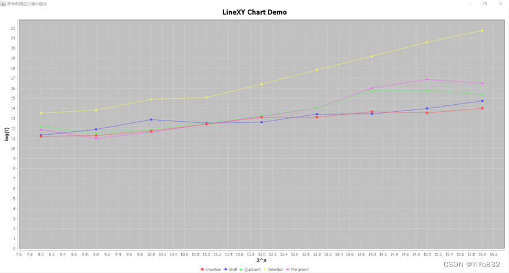

(k=10和k=3的数据不再给出，下面是图像)

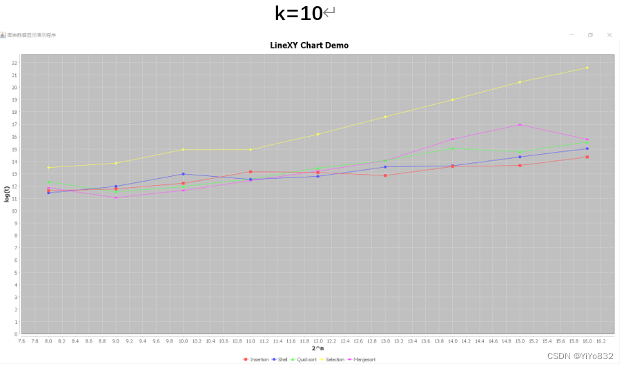

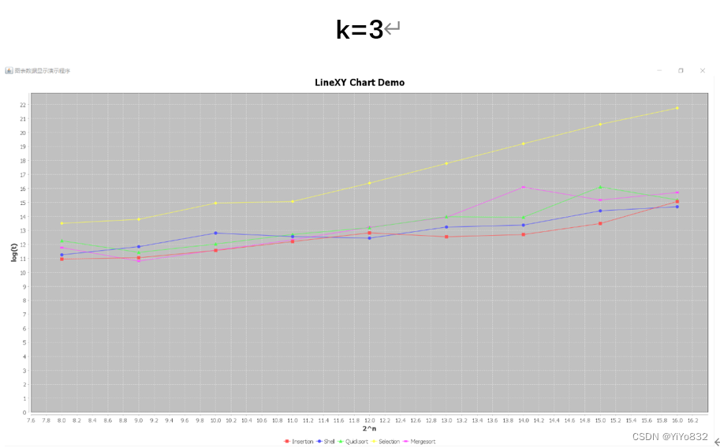

取值不同的k，可以发现，k-序列排序对五种排序算法均有一定程度的影响。大大增加了Selection排序算法的排序时间。而大幅度减少了Insertion排序算法的排序时间。随着k值的增大可以看出，Selection排序算法排序时间增长，Mergesort和Quicksort在数据量较大时(2^15左右)小幅度影响。

## 任务4

题目：

完成了任务 2 和任务 3 之后，现要求为 GenerateData 类型再增加一种数据序列的生成方法， 该方法要求生成分布不均匀数据序列：1/2 的数据是 0，1/4 的数据是 1，1/8 的数据是 2 和 1/8 的 数据是 3。对这种分布不均匀的数据完成类似任务 2 的运行测试，检查这样的数据序列对于排序算 法的性能影响。要求同任务 2。(此时，可以将任务 2、任务 3 和任务 4 的运行测试结果做一个纵向比较，用以理解数据序列分布的不同对同一算法性能的影响，如果能从每个排序算法的过程去深 入分析理解则更好。

代码：

生成不均匀数据序列

`public static Double[] getRandomData2(int N){
        Double[] numbers = new Double[N];
        for(int i = 0; i < N/2; i++)
            numbers[i] = 0.0;
        for(int i = N/2; i < 3*N/4; i++)
            numbers[i] = 1.0;
        for(int i = 3*N/4; i < 7*N/8; i++)
            numbers[i] = 2.0;
        for(int i = 7*N/8; i < N; i++)
            numbers[i] = 3.0;
        shuffle(numbers,0, numbers.length-1);
        return numbers;
    }
`

测试类与任务2，3的基本一致，不再放出。

需要提示的是，这种不均匀序列，我电脑会出现无法(极偶然可以)跑出Quicksort排序算法的结果。足以说明该不均匀序列对Quicksort的“不友好”。

因此Quicksort数据不再给出，图像如下：

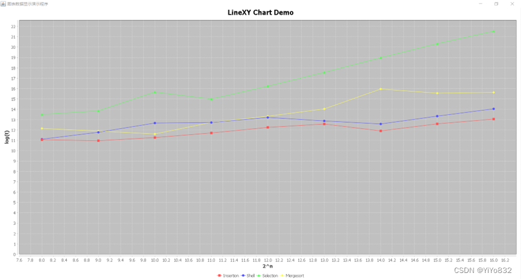

下面将进行五种排序算法的纵向比较。

Mergesort

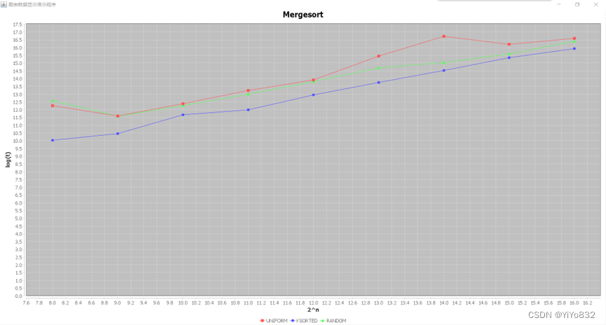

可以看出来，当数据量增大时，不同序列的Mergesort的运行时间逐渐接近，这与该算法的实现密切相关，因为Mergesort的最好、最坏、平均时间均为O(nlogn)。

Shell

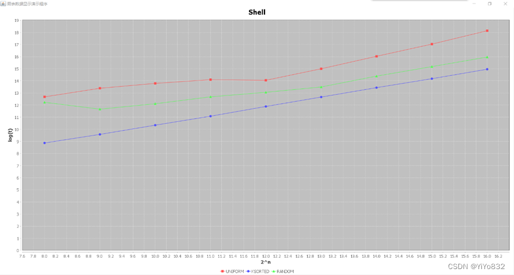

可以看出，Shell排序算法在k-有序数据序列(近似有序的数据序列)用时明显减少，而该算法在完全随机序列用时最多。这是因为Shell算法先进行局部排序，最后一趟相当于Insert排序，因此排序序列越近似有序，该算法用时越少。

Insertion

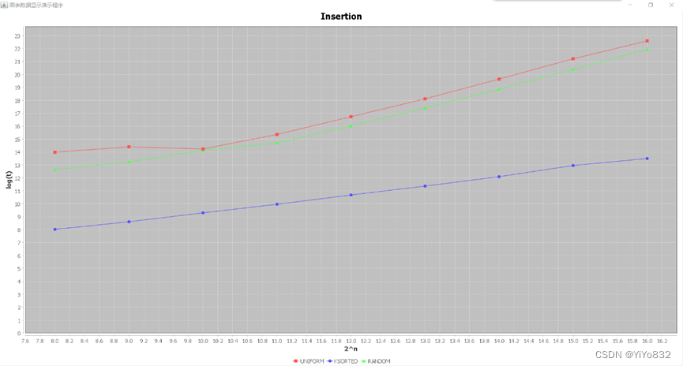

在k-有序数据序列(近似有序的数据序列)下用时远远小于其余两项。这与Insertion实现方式有关。耗时主要是因为Insertion在排序时有着大量交换，在k-有序数据序列每项数据离其正确位置相差不大，因此交换次数少，用时少。而在完全随机序列和不均匀序列中，每项顺序离其正确位置不确定，达到了运行平均时间O(n^2)。

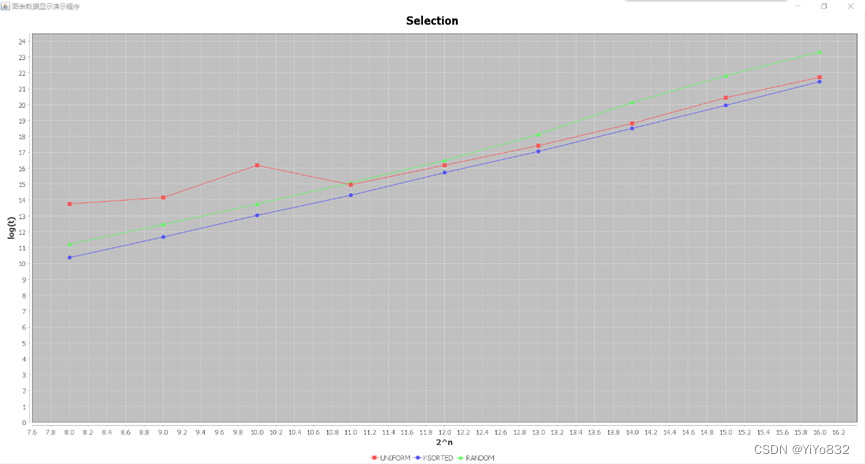

总体而言，三个序列曲线比较吻合，这是因为Selection无论序列特征如何，均要遍历序列找到最小值，次小值……因此，耗时在序列数值的比较，平均时间为O(n^2)。

Quicksort

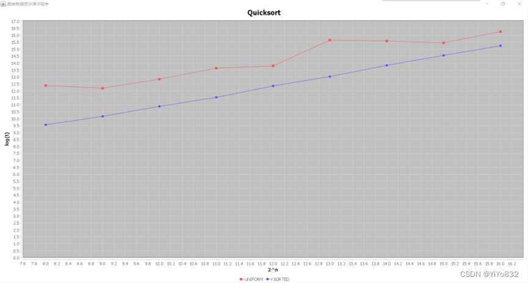

 因为不均匀序列无法跑出结果，因此没有加入到图像之中。快速排序通过“随机”选择数值进行划分，在我编写的代码中“随机”的数字是中间值，因此在完全随机和k-有序数据序列中运行时间没有明显的差异。但如果“随机”的数字为前面，会导致在k-有序数据序列出现较差的情况，这是“随机”选择的数值不足以平均划分序列，导致运行时间大大增加。

       而不均匀序列无法跑出结果，初步判断为爆栈，因为不均匀序列有大量重复的数值，而且按照一定比例，因此“随机”出来的数值无法平均划分序列的情况大大增加，而且我没有进行任何优化，递归耗时较大，层数较深，导致无法运行出结果。

## 附录

### 任务1

`public class Quicksort extends SortAlgorithm {
    @Override
    public void sort(Comparable[] objs) {
        quicksort(objs,0,objs.length-1);
    }
    private void quicksort(Comparable[] arr, int start, int end){
        int pickIndex = (start+end)/2;
        exchange(arr,pickIndex,end);
        int sortIndex = partition(arr,start,end-1,end);
        exchange(arr,sortIndex,end);
        if ((sortIndex-start)>1){
            quicksort(arr,start,sortIndex-1);
        }
        if ((end-sortIndex)>1){
            quicksort(arr,sortIndex,end);
        }
    }
    private int partition(Comparable[] arr, int start, int end, int pivot){
        do{
            while (less(arr[start],arr[pivot])){
                start++;
            };
            while (end!=0&&less(arr[pivot],arr[end])){
                end--;
            };
            exchange(arr,start,end);
        }while (start<end);
        exchange(arr,start,end);
        return start;
    }
}
`

`public class Selection extends SortAlgorithm {
    @Override
    public void sort(Comparable[] arr) {
        for (int i=0;i< arr.length;i++){
            int temp = i;
            for (int j=i;j<arr.length;j++){
                if (less(arr[j],arr[temp])){
                    temp = j;
                }
            }
            exchange(arr,i,temp);
        }
    }
}
`

`public class Shell extends SortAlgorithm {
    @Override
    public void sort(Comparable[] arr) {
        int len = arr.length;
        if (len<3){
            new Selection().sort(arr);
            return;
        }
        int temp = 1;
        while (temp*3<len){
            temp = temp*3;
        }
        for (int gap = temp;gap>0;gap /= 3){
            for (int i=gap;i<len;i++){
                for (int j= i;j>=gap&&less(arr[j],arr[j-gap]);j-=gap){
                    exchange(arr,j,j-gap);
                }
            }
        }
    }
}
`

`public class Mergesort extends SortAlgorithm {
    @Override
    public void sort(Comparable[] arr) {
        Comparable[] temArr = new Comparable[arr.length];
        mergeSort(arr,temArr,0, arr.length-1);
    }
    private void mergeSort(Comparable[] arr,Comparable[] temArr, int left,int right){
        if (left<right){
            int center = (left+right)/2;
            mergeSort(arr,temArr,left,center);
            mergeSort(arr,temArr,center+1,right);
            merge(arr,temArr,left,center+1,right);
        }
    }
    private void merge(Comparable[] arr,Comparable[] temArr, int leftPos,int rightPos,int rightEnd){
        int leftEnd = rightPos-1;
        int tmpPos = leftPos;
        int numElements = rightEnd - leftPos + 1;

        while (leftPos<=leftEnd&&rightPos<=rightEnd){
            if (less(arr[leftPos],arr[rightPos])){
                temArr[tmpPos++]=arr[leftPos++];
            }
            else {
                temArr[tmpPos++]=arr[rightPos++];
            }
        }

        while (leftPos<=leftEnd){
            temArr[tmpPos++]=arr[leftPos++];
        }
        while (rightPos<=rightEnd){
            temArr[tmpPos++]=arr[rightPos++];
        }

        for (int i=1;i<=numElements;i++,rightEnd--){
            arr[rightEnd] = temArr[rightEnd];
        }
    }
}
`

`public class Test {
    public static boolean judge(SortAlgorithm alg, Double[] numbers){
        alg.sort(numbers);
        return alg.isSorted(numbers);
    }
    public static boolean test(SortAlgorithm alg, int dataProbabilityType, int dataLength, int k, int T)
    {
        boolean flag = true;
        Double[] numbers = null;
        for(int i = 0; i < T; i++) {
            switch(dataProbabilityType){
                case GenerateData.UNIFORM -> numbers = GenerateData.getRandomData(dataLength);
            }
            flag = flag&&judge(alg,numbers);
        }
        return flag;
    }
    public static void main(String[] args) {
        int[] dataLength = {100, 1000, 10000};
        boolean[] judgeSort = new boolean[dataLength.length];
        SortAlgorithm alg = new Insertion();
        System.out.println("这是Insertion测试：");
        for(int i = 0; i < dataLength.length; i++)
            judgeSort[i] = test(alg, GenerateData.UNIFORM, dataLength[i], 0, 5);
        for (int i=0;i<dataLength.length;i++){
            System.out.printf("数据量为%d,验证结果为：%b%n",dataLength[i],judgeSort[i]);
        }
        alg = new Shell();
        System.out.println("这是Shell测试：");
        for(int i = 0; i < dataLength.length; i++)
            judgeSort[i] = test(alg, GenerateData.UNIFORM, dataLength[i], 0, 5);
        for (int i=0;i<dataLength.length;i++){
            System.out.printf("数据量为%d,验证结果为：%b%n",dataLength[i],judgeSort[i]);
        }
        alg = new Quicksort();
        System.out.println("这是Quicksort测试：");
        for(int i = 0; i < dataLength.length; i++)
            judgeSort[i] = test(alg, GenerateData.UNIFORM, dataLength[i], 0, 5);
        for (int i=0;i<dataLength.length;i++){
            System.out.printf("数据量为%d,验证结果为：%b%n",dataLength[i],judgeSort[i]);
        }
        alg = new Selection();
        System.out.println("这是Selection测试：");
        for(int i = 0; i < dataLength.length; i++)
            judgeSort[i] = test(alg, GenerateData.UNIFORM, dataLength[i], 0, 5);
        for (int i=0;i<dataLength.length;i++){
            System.out.printf("数据量为%d,验证结果为：%b%n",dataLength[i],judgeSort[i]);
        }
        alg = new Mergesort();
        System.out.println("这是Mergesort测试：");
        for(int i = 0; i < dataLength.length; i++)
            judgeSort[i] = test(alg, GenerateData.UNIFORM, dataLength[i], 0, 5);
        for (int i=0;i<dataLength.length;i++){
            System.out.printf("数据量为%d,验证结果为：%b%n",dataLength[i],judgeSort[i]);
        }
    }
}
`

### 任务2

`public class Test2 {
    public static double time(SortAlgorithm alg, Double[] numbers){
        double start = System.nanoTime();
        alg.sort(numbers);
        double end = System.nanoTime();
        return end - start;
    }
    public static double test(SortAlgorithm alg, int dataProbabilityType, int dataLength, int k, int T)
    {
        double totalTime = 0;
        Double[] numbers = null;
        for(int i = 0; i < T; i++) {
            switch(dataProbabilityType){
                case GenerateData.UNIFORM -> numbers = GenerateData.getRandomData(dataLength);
                case GenerateData.KSORTED -> numbers = GenerateData.getKSortedData(dataLength, k);
            }
            totalTime += time(alg, numbers);
        }
        return totalTime/T;
    }
    public static void main(String[] args) {
        int[] dataLength = {256,512,1024,2048,4096,8192,16384,32768,65536};
        double[] elapsedTime = new double[dataLength.length];
        SortAlgorithm alg = new Insertion();
        System.out.println("这是Insertion测试：");
        for(int i = 0; i < dataLength.length; i++)
            elapsedTime[i] = test(alg, GenerateData.UNIFORM, dataLength[i], 0, 5);
        for(int i=0;i<dataLength.length;i++)
            System.out.printf("数据量2^%d,5次平均%6.4f%n ",i+8, elapsedTime[i]);
        alg = new Shell();
        System.out.println("这是Shell测试：");
        for(int i = 0; i < dataLength.length; i++)
            elapsedTime[i] = test(alg, GenerateData.UNIFORM, dataLength[i], 0, 5);
        for(int i=0;i<dataLength.length;i++)
            System.out.printf("数据量2^%d,5次平均%6.4f%n ",i+8, elapsedTime[i]);
        alg = new Quicksort();
        System.out.println("这是Quicksort测试：");
        for(int i = 0; i < dataLength.length; i++)
            elapsedTime[i] = test(alg, GenerateData.UNIFORM, dataLength[i], 0, 5);
        for(int i=0;i<dataLength.length;i++)
            System.out.printf("数据量2^%d,5次平均%6.4f%n ",i+8, elapsedTime[i]);
        alg = new Selection();
        System.out.println("这是Selection测试：");
        for(int i = 0; i < dataLength.length; i++)
            elapsedTime[i] = test(alg, GenerateData.UNIFORM, dataLength[i], 0, 5);
        for(int i=0;i<dataLength.length;i++)
            System.out.printf("数据量2^%d,5次平均%6.4f%n ",i+8, elapsedTime[i]);
        alg = new Mergesort();
        System.out.println("这是Mergesort测试：");
        for(int i = 0; i < dataLength.length; i++)
            elapsedTime[i] = test(alg, GenerateData.UNIFORM, dataLength[i], 0, 5);
        for(int i=0;i<dataLength.length;i++)
            System.out.printf("数据量2^%d,5次平均%6.4f%n ",i+8, elapsedTime[i]);
    }
}
`

### 任务3

`public class Test2 {
    public static double time(SortAlgorithm alg, Double[] numbers){
        double start = System.nanoTime();
        alg.sort(numbers);
        double end = System.nanoTime();
        return end - start;
    }
    public static double test(SortAlgorithm alg, int dataProbabilityType, int dataLength, int k, int T)
    {
        double totalTime = 0;
        Double[] numbers = null;
        for(int i = 0; i < T; i++) {
            switch(dataProbabilityType){
                case GenerateData.UNIFORM -> numbers = GenerateData.getRandomData(dataLength);
                case GenerateData.KSORTED -> numbers = GenerateData.getKSortedData(dataLength, k);
            }
            totalTime += time(alg, numbers);
        }
        return totalTime/T;
    }
    public static void main(String[] args) {
        int[] dataLength = {256,512,1024,2048,4096,8192,16384,32768,65536};
        double[] elapsedTime = new double[dataLength.length];
        SortAlgorithm alg = new Insertion();
        System.out.println("这是Insertion测试：");
        for(int i = 0; i < dataLength.length; i++)
            elapsedTime[i] = test(alg, GenerateData.KSORTED, dataLength[i], 5, 5);
        for(int i=0;i<dataLength.length;i++)
            System.out.printf("数据量2^%d,5次平均%6.4f%n ",i+8, elapsedTime[i]);
        alg = new Shell();
        System.out.println("这是Shell测试：");
        for(int i = 0; i < dataLength.length; i++)
            elapsedTime[i] = test(alg, GenerateData.KSORTED, dataLength[i], 5, 5);
        for(int i=0;i<dataLength.length;i++)
            System.out.printf("数据量2^%d,5次平均%6.4f%n ",i+8, elapsedTime[i]);
        alg = new Quicksort();
        System.out.println("这是Quicksort测试：");
        for(int i = 0; i < dataLength.length; i++)
            elapsedTime[i] = test(alg, GenerateData.KSORTED, dataLength[i], 5, 5);
        for(int i=0;i<dataLength.length;i++)
            System.out.printf("数据量2^%d,5次平均%6.4f%n ",i+8, elapsedTime[i]);
        alg = new Selection();
        System.out.println("这是Selection测试：");
        for(int i = 0; i < dataLength.length; i++)
            elapsedTime[i] = test(alg, GenerateData.KSORTED, dataLength[i], 5, 5);
        for(int i=0;i<dataLength.length;i++)
            System.out.printf("数据量2^%d,5次平均%6.4f%n ",i+8, elapsedTime[i]);
        alg = new Mergesort();
        System.out.println("这是Mergesort测试：");
        for(int i = 0; i < dataLength.length; i++)
            elapsedTime[i] = test(alg, GenerateData.KSORTED, dataLength[i], 5, 5);
        for(int i=0;i<dataLength.length;i++)
            System.out.printf("数据量2^%d,5次平均%6.4f%n ",i+8, elapsedTime[i]);
    }
}
`

### 任务4

`public static final int RANDOM = 3;
    public static Double[] getRandomData2(int N){
        Double[] numbers = new Double[N];
        for(int i = 0; i < N/2; i++)
            numbers[i] = 0.0;
        for(int i = N/2; i < 3*N/4; i++)
            numbers[i] = 1.0;
        for(int i = 3*N/4; i < 7*N/8; i++)
            numbers[i] = 2.0;
        for(int i = 7*N/8; i < N; i++)
            numbers[i] = 3.0;
        shuffle(numbers,0, numbers.length-1);
        return numbers;
    }
`
