# XJTUSE-数据结构-homework2

当时写的还挺痛苦的

不过现在看，原老师布置的作业真的有水平

现在来看大二数据结构的作业，真的很锻炼代码能力。有些题目，我现在写也不一定能很快写出来hhhh

当时写的作业感觉还是存在问题的！

## 任务概述

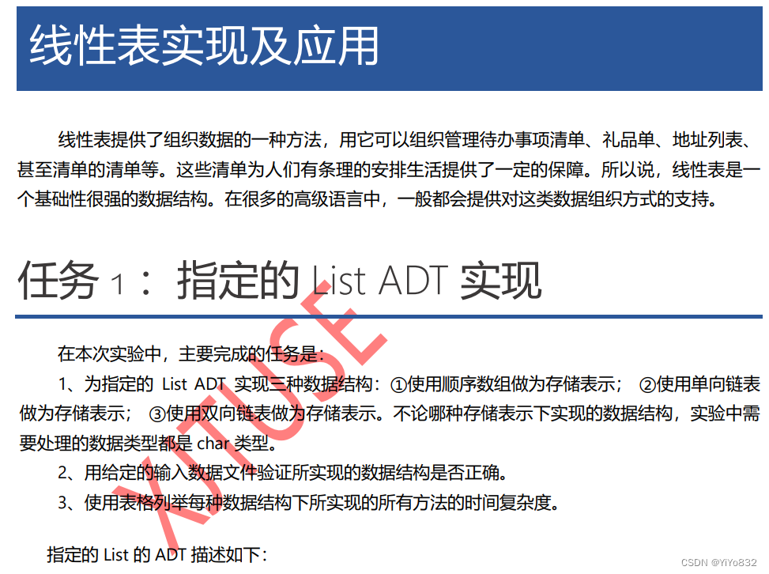

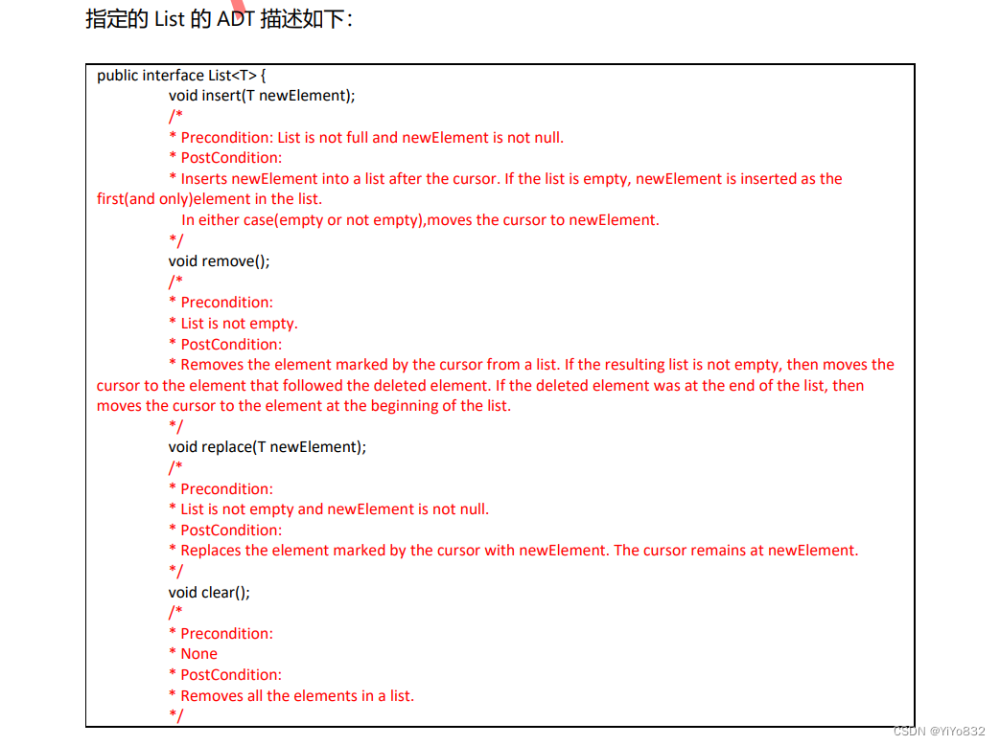

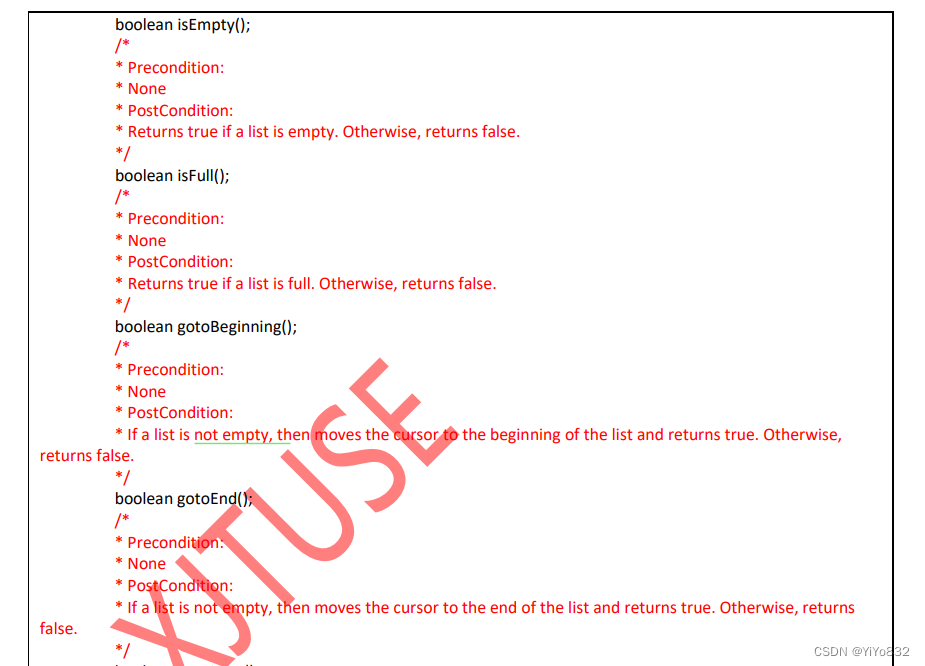

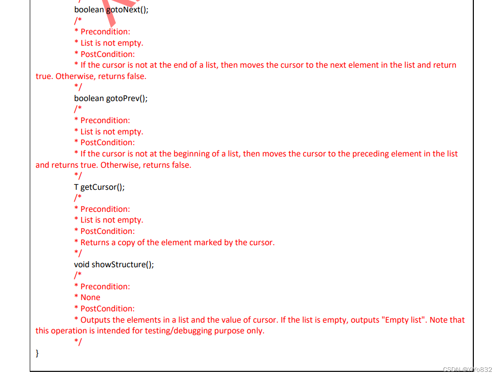

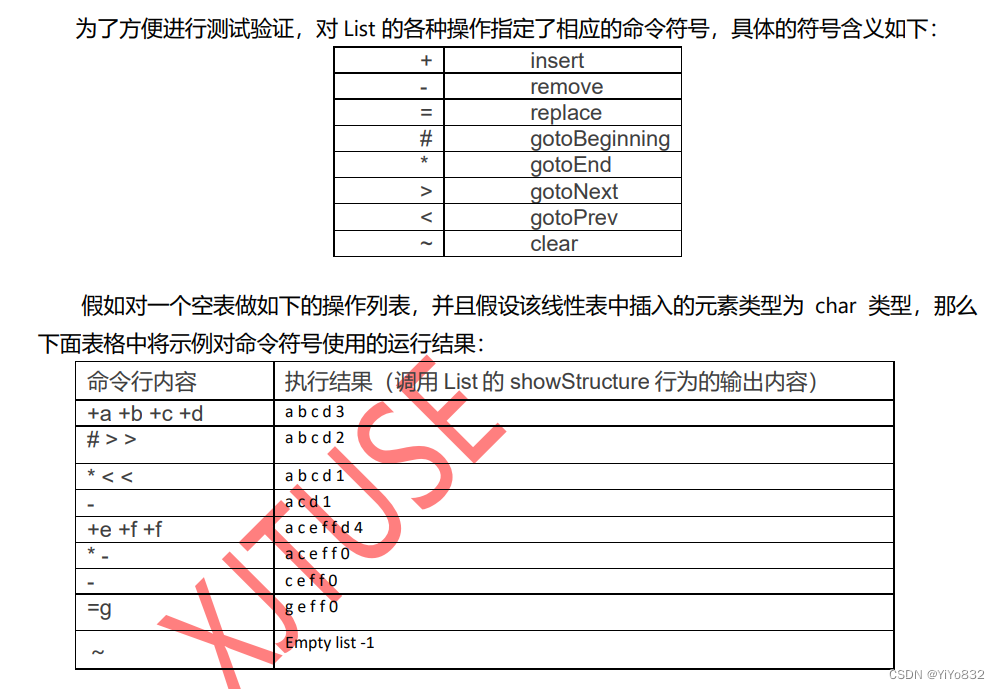

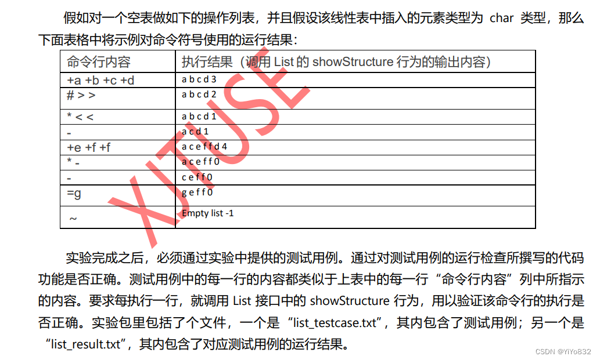

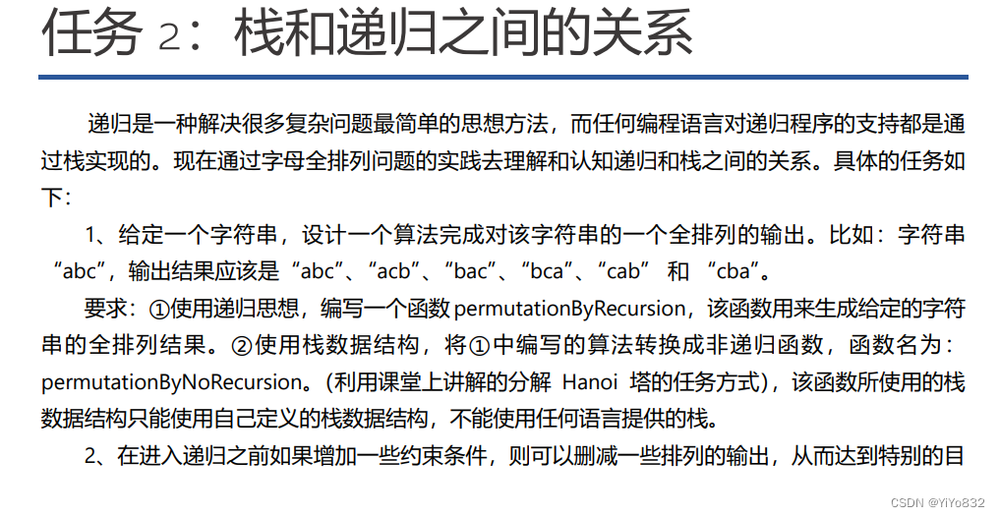

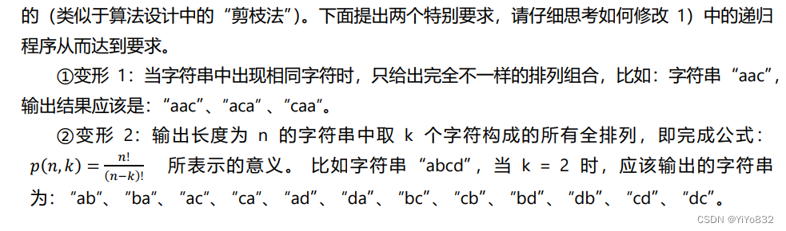

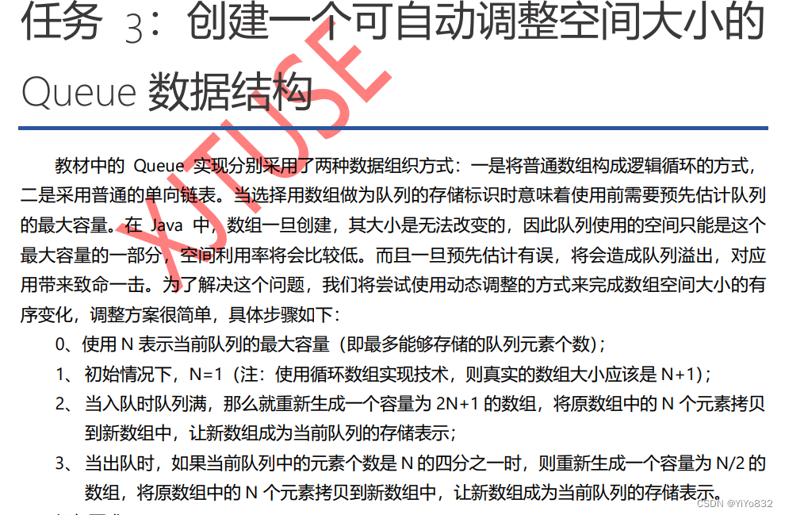

 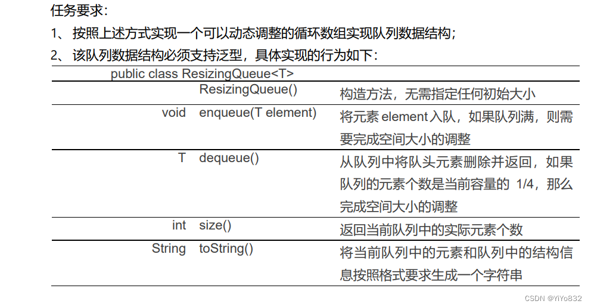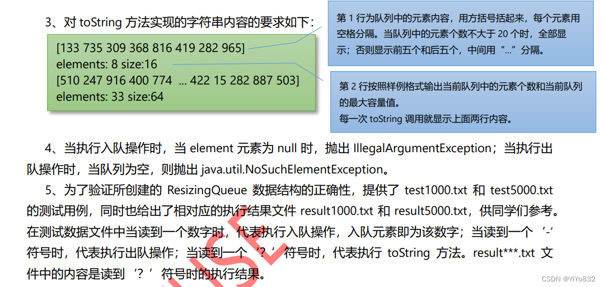

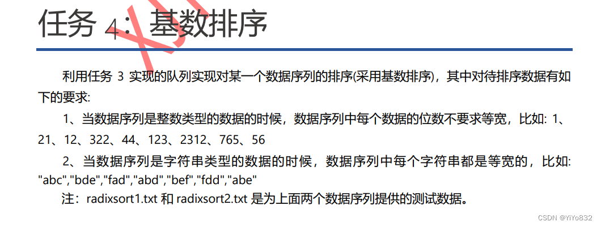

## 任务 1 ：指定的 List ADT 实现

题目：见pdf

1、使用顺序数组作为存储表示：

数据设计：

- private int MAXLEN;  - private char[] seqList = null;  - private int cursor = -1;  - private int tail = 0;

在使用顺序数组作为存储表示中，设计了以上几个私有变量，下面一一进行说明。

MAXLEN表示顺序数组的最大储存空间，这是因为顺序数组是依靠数组的存储空间实现的，必须在一开始规定好其数组的大小。

seqList 表示顺序数组，存储字符，初始化为null。

cursor  表示顺序数组的起始下标，初始化为-1。

tail   表示顺序数组的结尾下标，初始化为0。

算法设计：

- public void insert(char newElement) {  -         //  after the cursor  -         if (tail>=MAXLEN){  -             return;  -         }  - //        空数组插入  -         if (tail==0){  -             cursor++;  -             seqList[cursor] = newElement;  -             tail++;  -             return;  -         }  - //        非空插入  -         for (int i=tail-1;i>cursor;i--){  -             seqList[i+1] = seqList[i];  -         }  -         cursor++;  -         seqList[cursor] = newElement;  -         tail++;  -     }

根据题目中的插入要求，分成了三种基本情况：满数组，空数组，正常插入(非空数组)。根据要求可知道，要先判断满数组和空数组，若都不是，再进行正常插入。因为是顺序数组，所以说进行插入操作需要复制插入位置之后的所有元素，又因为剩下的操作均在常数项时间内能完成，由此插入操作的时间复杂度为O(n)   。

- public void remove() {  -         tail--;  -         //        空数组  -         if (tail ':  -         list.gotoNext();  -         break;  -     case '=front){  -         return rear-front;  -     }  -     return maxSize-front+rear;  - }

由于使用了循环数组，因此通过front和rear的两种情况的相对位置即可判断数组容量。

- public String toString() {  -     String res = "";  -     res += "[";  -       不大于20的情况  -     if (this.size()=front){  -             for (int i = front+1;i=MAXLEN){  -             return;  -         }  - //        空数组插入  -         if (tail==0){  -             cursor++;  -             seqList[cursor] = newElement;  -             tail++;  -             return;  -         }  - //        非空插入  -         for (int i=tail-1;i>cursor;i--){  -             seqList[i+1] = seqList[i];  -         }  -         cursor++;  -         seqList[cursor] = newElement;  -         tail++;  -     }  -   -     @Override  -     public void remove() {  -         tail--;  -         //        空数组  -         if (tail ':  -                         list.gotoNext();  -                         break;  -                     case '=front){  -             return rear-front;  -         }  -         return maxSize-front+rear;  -     }  -     public boolean isFull(){  -         return front == (rear+1)%maxSize;  -     }  -     public boolean isEmpty(){  -         return rear == front;  -     }  -     private boolean isExpand(){  -         return isFull();  -     }  -     private boolean isShrink(){  -         return size()rear){  -             for (int i=front;i=front){  -             for (int i=front;i=front){  -                 for (int i = front+1;i<=rear;i++){  -                     res = res + listArray[i] + " ";  -                 }  -             }  -             else {  -                 for (int i = front+1;i<maxSize;i++){  -                     res = res + listArray[i] + " ";  -                 }  -                 for (int i = 0;i<=rear;i++){  -                     res = res + listArray[i] + " ";  -                 }  -             }  -         }  - //        大于20的情况  -         else {  -             int tem = (front+1)%maxSize;  -             int count = 0;  - //            去前五个元素  -             do{  -                 res = res + listArray[tem] + " ";  -                 tem = (tem+1)%maxSize;  -                 count++;  -             }  -             while (count<5);  -             res += " ... ";  - //            取后五个元素  -             while (count<this.size()-5){  -                 tem = (tem+1)%maxSize;  -                 count++;  -             }  -             while (count<this.size()){  -                 res = res + listArray[tem] + " ";  -                 tem = (tem+1)%maxSize;  -                 count++;  -             }  -         }  -         res = res.strip()+"]";  -         res += "\nelements: " + this.size() + " size:"+(this.maxSize-1);  -         return res;  -     }  - }

- import java.io.File;  - import java.io.FileNotFoundException;  - import java.util.Scanner;  -   - public class Test {  -     public static void readFile() throws FileNotFoundException {  - //        Scanner in = new Scanner(new File("src/test1000.txt"));  - //        Scanner in2 = new Scanner(new File("src/result1000.txt")); -         Scanner in = new Scanner(new File("src/test5000.txt"));  -         Scanner in2 = new Scanner(new File("src/result5000.txt"));  -         ResizingQueue resizingQueue = new ResizingQueue`Integer`();  -         int nextInt = 0;  -         String nextString;  -         boolean vertify = true;  -         while (in.hasNext()){  -             if (in.hasNextInt()){  -                 nextInt = in.nextInt();  - //                System.out.printf("读取到的数字为：%d",nextInt);  -                 resizingQueue.enqueue(nextInt);  -             }  -             else{  -                 nextString = in.next();  -                 char nextChar;  -                 int pivot=0;  -                 while(pivot!=nextString.length()){  -                     nextChar = nextString.charAt(pivot);  -                     pivot++;  -                     if (nextChar == '-'){  -                         resizingQueue.dequeue();  -                     }  -                     if (nextChar == '?'){  -                         System.out.println(resizingQueue.toString());  -                         String tem1 = in2.nextLine();  -                         String tem2 = in2.nextLine();  -                         String res = tem1 + "\n" + tem2;  -                         System.out.println("res为："+res);  -                         boolean temVertify = res.strip().equals(resizingQueue.toString().strip());  -                         System.out.println("比较结果为："+temVertify);  -                         vertify = vertify && temVertify;  -                     }  - //                    System.out.printf("当前读取到的符号为：%c%n",nextChar);  -                 }  -             }  - //            System.out.printf("当前队列最大容量：%d,当前队列容量：%d front为：%d rear为：%d%n",resizingQueue.getMaxSize(),resizingQueue.size(),resizingQueue.getFront(),resizingQueue.getRear());  - //            System.out.printf(resizingQueue.toString()+"%n");  -         }  -         System.out.printf("经检验输出的字符串与结果符合判定：%b",vertify);  -     }  -   -     public static void main(String[] args) throws FileNotFoundException {  -         readFile();  -     }  - }

### 任务四

- import java.io.File;  - import java.io.FileNotFoundException;  - import java.util.Scanner;  -   - public class RadixSortInt {  -     static ResizingQueue[] resizingQueue = new ResizingQueue[10];  - //    static int[] arr = {27,91,100,9,17,23,84,28,72,5,67,25};//仅为测试数组  -     static void sort(int[] arr,int len){  - //        初始化队列  -         for(int i=0;i<resizingQueue.length;i++){  -             resizingQueue[i] = new ResizingQueue`Integer`();  -         }  - //        变量+初始化  -         boolean flag = true;  -         int modNum = 0;  -         int tem=0;  - //        一位一位操作，直到最长的数字结束  -         while (flag){  -             modNum++;  - //            入队，将数组数字按照顺序入队  -             for (int i=0;i<len;i++){  -                 int pivot = mod(arr[i],modNum);  -                 tem = Math.max(tem,pivot);  -                 resizingQueue[pivot].enqueue(arr[i]);  -                 flag = (tem != 0);  -             }  -             tem = 0;  -             int arrPivot = 0;  - //            出队，重新给数组赋值  -             for (int i=0;i<resizingQueue.length;i++){  -                 while (!resizingQueue[i].isEmpty()){  -                     arr[arrPivot++] = (int)resizingQueue[i].dequeue();  -                 }  -             }  -         }  - //        输出  -         for (int i=0;i<len;i++){  -             System.out.printf("%d ",arr[i]);  -         }  -     }  -   -     private static int mod(int num,int modNum){  -         for(int i=0;i<modNum-1;i++){  -             num = num/10;  -         }  -         return num%10;  -     }  -     public static void main(String[] args) throws FileNotFoundException {  -         int[] arr = new int[10000];  -         int pivot = 0;  -         Scanner in = new Scanner(new File("src/radixSort1.txt"));  -         while (in.hasNextInt()){  -             int tem = in.nextInt();  -             System.out.println(tem);   -             arr[pivot++] = tem;  -         }  -         pivot--;  -         sort(arr,pivot);  -     }  - }

- import java.io.File;  - import java.io.FileNotFoundException;  - import java.util.Scanner;  -   - public class RadixSortString {  -     static ResizingQueue[] resizingQueue = new ResizingQueue[26];  - //    static String[] arr = {"Abc","bde","fad","abd","bef","fdd","abe"};//仅为测试数组  -     static void sort(String[] arr,int len){  - //        初始化队列数组  -         for(int i=0;i<resizingQueue.length;i++){  -             resizingQueue[i] = new ResizingQueue`String`();  -         }  - //        因为等宽，所以取第一个字符串长度作为长度  -         int stringLen = arr[0].length();  -         int tem=0;  -         for (int k=0;k<stringLen;k++){  - //            入队操作  -             for (int i=0;i<len;i++){  -                 int pivot = arr[i].toLowerCase().charAt(stringLen-k-1)-'a';  -                 resizingQueue[pivot].enqueue(arr[i]);  -             }  -             tem = 0;  -             int arrPivot = 0;  - //            出队操作  -             for (int i=0;i<resizingQueue.length;i++){  -                 while (!resizingQueue[i].isEmpty()){  -                     arr[arrPivot++] = (String) resizingQueue[i].dequeue();  -                 }  -             }  -         }  -         for (int i=0;i<len;i++){  -             System.out.printf(arr[i]+" ");  -         }  -     }  -     public static void main(String[] args) throws FileNotFoundException {  -         String[] arr = new String[1000000];  -         int pivot = 0;  -         Scanner in = new Scanner(new File("src/radixSort2.txt"));  -         while (in.hasNext()){  -             arr[pivot++] = in.next();  -         }  -         pivot--;  -         sort(arr,pivot);  -     }  - }
