# 概率论-个人向使用

记录一些基本的公式和概念，不能作为学习概率论的教程。

 供个人使用

 使用教材：概率论与数理统计教材【西安交通大学出版】

 参考链接：[Statistics-note/概率论与数理统计笔记](https://github.com/ChanceQZ/Statistics-note/blob/master/%E6%A6%82%E7%8E%87%E8%AE%BA%E4%B8%8E%E6%95%B0%E7%90%86%E7%BB%9F%E8%AE%A1%E7%AC%94%E8%AE%B0.md)

## 第一章
### 1.1 随机事件
必然事件( )：在试验中⼀定会发⽣的事件。

不可能事件( 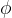)：在试验中不可能发⽣的事件。

 概率为0不一定为不可能事件。

#### 事件的运算
- 子事件- 事件的和、差、积- 对立事件- De Morgan対偶法则
### 1.2 概率
#### 古典概率计算
高中学习的排列组合....

### 1.3 各种概念&公式
#### 条件概率
### 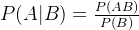
### 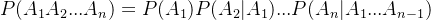
#### 全概率
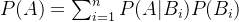

#### Bayes公式
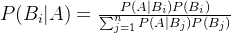

### 1.4 事件的独⽴性
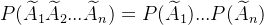

## 第二章
### 2.1 一维随机变量
#### 离散型
二项分布

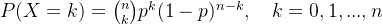

泊松分布

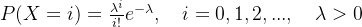

 二项分布当n足够大的时候，可以近似为泊松分布，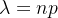

超几何分布

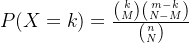

#### 连续型
正态分布

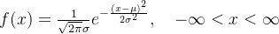

指数分布

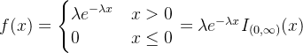

 指数分布具有无记忆性的特点

均匀分布

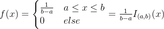

### 2.2 二维随机变量
联合分布律，边缘分布率...

二维正态分布，二维均匀分布

### 2.3 条件变量
#### 离散型变量
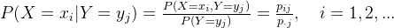

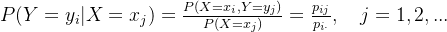

#### 连续型变量
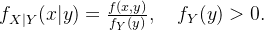

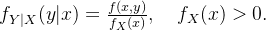

### 2.4 随机变量的相互独立性
### 2.5 随机变量函数的概率分布
#### 离散型变量
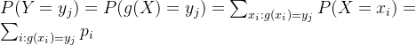

#### 连续型变量
1个变量的情况：

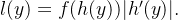

多个变量的情况：

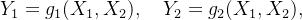

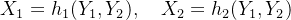

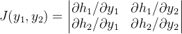

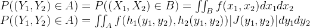

1.随机变量和的密度函数 Y=X1+X2

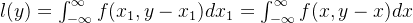

2.随机变量商的密度函数 Y=X2/X1

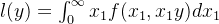

3.max{X1,X2,...} 和 min{X1,X2,X3} 的分布

## 第四章
### 4.1 数学期望
离散型数学期望：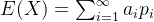

连续型数学期望：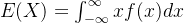

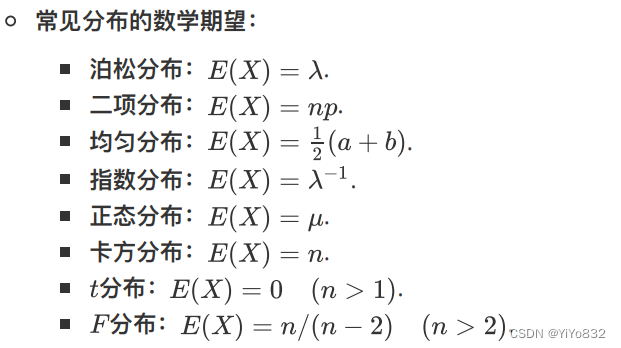

数学期望的性质：

1.线性性质(不写了

2.若干个独立随机变量之积的期望等于各变量的期望之积，即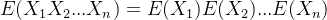

### 4.2 方差
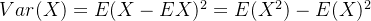

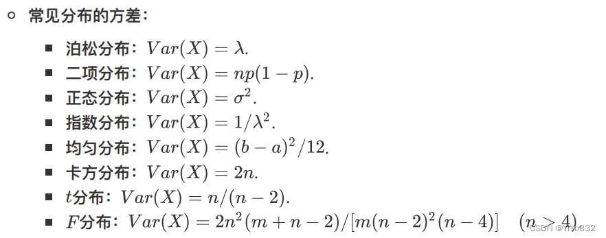

方差的性质：

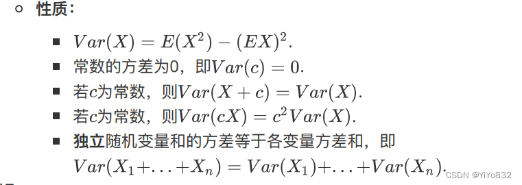

### 4.3 协方差，相关系数和矩
#### 协方差
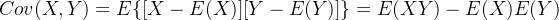

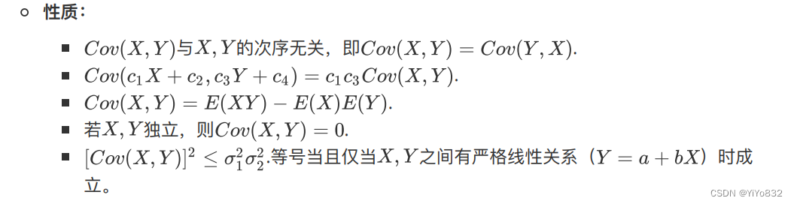

#### 相关系数
相关系数p的定义式为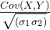

当p=0时，则称X,Y不相关

#### 矩
原点矩

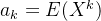

中心矩

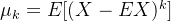

### 3.4 协方差矩阵
## 第五章
### 5.1 大数定理
设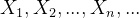是独立同分布的随机变量，记它们的公共均值为a.又设它们的方差存在并记为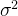.则对任意给定的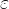>0，有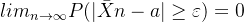

### 5.2 中心极限定理
核心公式如下：

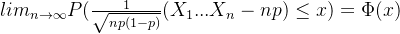

## 第六章
### 6.1 总体和样本
在一个统计问题里，研究对象的全体叫做总体，构成总体的每个成员称为个体。根据个体的数量指标数量，定义总体的维度，如每个个体只有一个数量指标，总体就是一维的，同理，个体有两个数量指标，总体就是二维的。总体就是一个分布，数量指标就是服从这个分布的随机变量。

假设个变量是相互独立的，则有如下公式：

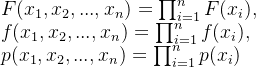

### 6.2 常用的统计量
有如下常用统计量：

样本均值

样本方差：

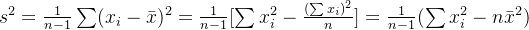

k阶原点矩

k阶中心距

p位数:

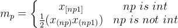

次序统计量

-  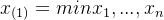称为该样本的最小次序统计量；

 -  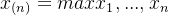称为该样本的最大次序统计量；

常见性质：

如果总体X的方差和均值均存在，则有如下性质：

- 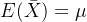- 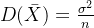- 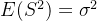
### 6.3 几大分布(重点公式)
#### 函数

#### 卡方分布

性质(记住)

#### T分布

性质(记住)

#### F分布

性质(记住)

设独立，，而，则

#### 其他重要性质
1.设独立同分布，有公共的正态分布.记.则

2.设的假定同1，则

3.设独立，各有分布各有分布，则

 

若，则

## 第七章
### 7.1 点估计
#### 矩估计
核心思想就是找到各个参数和中心距或者原点矩的关系，用样本矩代替总体矩(可以是原点矩也可以是中心矩)；计算出参数。

#### 最大似然估计
核心公式如下：

最大似然估计步骤：

-  写出似然函数；

 -  对似然函数取对数，并整理；

 -  求参数向量的偏导，令其为0，得到似然方程；

 -  求解似然方程，其解为参数值。

### 7.2 估计量的评选标准
#### 无偏性

 还有渐进无偏性

#### 有效性
对于两个估计参数的选取需要基于一个度量无偏估计优劣的准则。有效性作为这样的准则，反映了参数估计值和参数真值的波动，波动大小可用方差来衡量，波动越小表示参数的估计越有效。

可以看到前者方差小，有效性好。

#### 相合性
1.相合估计量或一致估计量

2.均方相合估计量

### 7.3 区间估计
双侧/单侧区间

#### 常见查表

## 第八章
### 8.1 假设检验的基本概念
在统计上这两个⾮空不相交参数集合称作统计假设，简称假设。通过样本对⼀个假设作 出对与不对的判断，则称为该假设的⼀个检验。若检验结果否定该命题，则称拒绝这个假设，否则 就接受(不拒绝)这个假设。 假设可分为两种：

1. 参数假设检验，即已经知道数据的分布，针对总体的某个参数进⾏假设检验；

2. ⾮参数假设检验，即数据分布未知，针对该分布进⾏假设检验。

建⽴假设—>选择检验统计量，给出拒绝域形式—>选择显著性⽔平—>给出拒绝域—>做出判断

### 8.2 参数的假设检验

### 8.3 分布的假设检验

