# XJTUSE-离散数学-代数系统

## 代数系统

要满足：

- 封闭性- 后者唯一### 基本性质

- 结合律- 交换律- 消去律- 幺元(若有则唯一)- 零元(若有则唯一)- 逆元- 分配律### 子代数系统

由于代数系统已经满足了后者唯一，子代数系统只需要在子集的情况下满足封闭性即可。

## 代数系统的同构与同态

### 同态公式

设 和 是两个代数系统，存在一个函数h，对于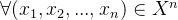有如下公式:

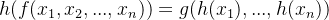

则称h对f，g保持运算，称上面的式子为同态公式。

### 同构

- 代数系统是同类型的- h是双射函数- 满足同态公式### 同态

满足同态公式即可，对于不同的h，有不同的称呼

- h是单射，单同态函数，单同态象。- h是满射，满同台函数，满同态象。- h是双射，同构。## 半群

是半群要满足如下条件：

- 代数系统- *是二元运算- 满足结合律满足交换律 => 交换半群

有幺元 => 含幺半群

### 循环半群

满足如下： 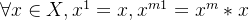

循环半群有生成元 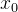

典型的循环半群 ：    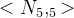

### 子半群

子代数系统 + 半群

## 群

是群要满足如下条件：

- 是代数系统- *是二元运算- 满足结合律- 有幺元- 每个元素都有逆元### 群的基本性质

是群 ， |G| > 1

- 逆元唯一- 无零元满足消去律

### 阶

是群，对每一个g，使得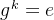的最小正整数k就是g的阶。若不存在，则阶是无穷。

- 若k=n，则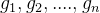各不相同- 若k为正无穷，则全部元素互不相同。- 若|G|=n,则每个元素的阶小于等于n。### 循环群

循环群与循环半群定义相似，不过循环半群是生成元的正整数次幂，循环群是生成元的整数幂。

- a为生成元，a的阶为m，同构于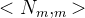- a为生成元，a的阶为无穷，同构于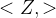循环群 => 交换群

### 置换群

### 子群

充分必要条件：

- 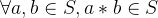- 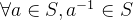充分必要条件：

- 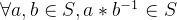有限群的子群的充分必要条件：

- ### 陪集和Lagrange定理

    设(H,*)为群(G,*)的子群，对于G中任意元素a，定义集合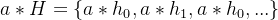为H的左陪集，同样定义集合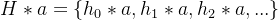为H的右陪集。

#### 陪集的性质

所有陪集构成了划分，而且划分唯一。

|aH| = |H|   |Hb| = |H|

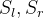分别为左陪集集合，右陪集集合，称|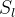| ，|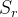|为G关于H的指数

#### Lagrange定理

有指数k，|G| = k|H|

如下结论：

- 素数阶群，只有两个子群，两个平凡子群- 有限群，每个元素的阶都是群的阶的因子。- 每个素数阶的群都是循环群。- 四阶不同构的群只有两个，一个是四阶循环群，一个是Klein-4群。## 环

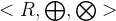是环要满足：

- 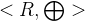是交换群- 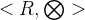是半群- 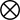对满足分配律。
整数环，矩阵环，整数模环，多项式环

交换环：满足交换律

含幺环：有幺元

### 基本性质

- 的幺元是的零元- 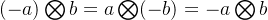### 零因子

零因子 ： 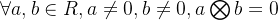,a为b的左零因子，b为a的右零因子。

无/含零因子环的充分必要条件 ： 满足/不满足消去律。

### 整环

是环，若

- 满足交换律- 幺元- 无零因子(满足消去律)则整环。

### 除环

是环，若

- 关于有幺元- 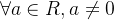，a有逆元。则除环。

若是除环 => 则为含幺的无零因子环。

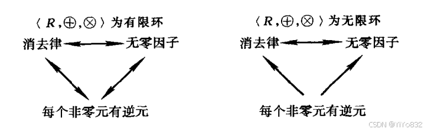

## 域

可交换的除环，则称为为域。

- 是交换群- 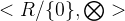是交换群，其中0是的幺元。- 对满足分配律。
有理数域，实数域，复数域

### 一些定理

有限整环 => 域

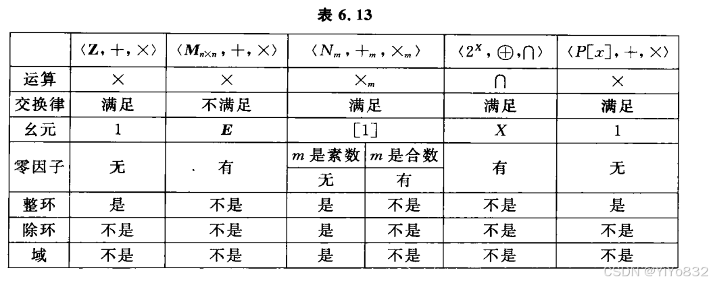
