# XJTUSE-离散数学-关系

## 集合的叉积

二元组(a,b)

(a,b) = (c,d)        a=c,b=d

m元组

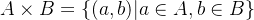

叉积的结合律、交换律

## 关系

R 是  的子集，称为一个二元关系

前域，后域的概念

### 关系的表示方法

图表示法

矩阵表示法

### 关系的运算

逆运算: 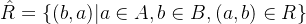

逆运算的一些定理

复合关系 and 闭包运算

复合关系 ： 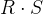

幂运算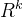

闭包运算 ： 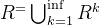

星包：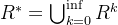

### 关系的矩阵表示法

补运算 ： 矩阵每个元素取反

交运算 ： 矩阵对应元素交

并运算 ： 矩阵对应元素并

复合关系 ： 矩阵乘法

闭包

星包

## 二元运算的基本性质

几大重要性质

- 自反性：每个x，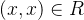- 反自反：每个x ，(x,x) 不属于 R (与非自反区分)- 对称性 ： 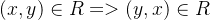- 反对称：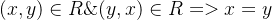    即只有对角线为1，其他对称地方至多一个1- 传递关系： 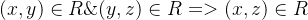## 等价类

自反的，对称的，传递的

### 划分 and 覆盖

覆盖 ： 一个集合族，所有元素之并为A

划分 ： 一个集合族，任意两个集合交集为空集，属于覆盖。

划分可以产生一个等价关系

###  相容关系

自反的，对称的

相容关系产生的是覆盖。

## 半序关系

自反的，反对称的，传递的

使用HASSA图表示半序关系。

### 最大元素 and 最小元素

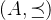 为半序集

最大元素： 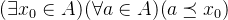  x0 为最大元素

最小元素对称即可。

### 极大元 and 极小元

极大元 ： 任意x0属于A ，不存在a属于A，使得 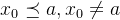

极小元对称即可。

### 上/下界 and 上/下确界

 为半序集，B是A的子集

存在属于A元素的一个元素，该元素对集合B任意的元素都有偏序关系，那么就称这个元素是一个上界元素

上界元素中第一个出现的，或者说最小的称为上确界。

### 全序关系

在半序集合的基础上，满足任意两个元素都可以比较。

### 良序关系

在半序集合的基础上，满足每个非空子集都有最小的元素。

等价于   全序关系 + 若a不是最大元，则存在直接后继a+1
