# XJTUSE-离散数学-命题演算

## 命题与真值联结词
凡是能分辨真假的语句就是命题

- 合取 : 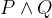- 析取 ： 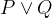- 蕴含： 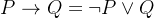
## 指派和真值表
指派就是一个确定的变元组，确定了其真假值。

成真指派，成假指派

真值表 ： 所有指派列出来的表格

永真公式 = 重言式

永假公式 = 矛盾式

## 逻辑等价关系

 挺简单的

替换定理

代入定理

### 其他联结词
异或 ： 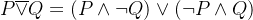

与非 ： 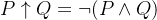

或非 ： 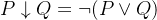

全功能 (功能完备)的概念 ： 任一真值函数都可以用其联结词表示

极小全功能

### 析取范式、合取范式的概念
析取范式 ： 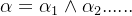

合取范式同理

主析取范式 、主合取范式的概念 .... (提示：小项包含全部变元)

## 逻辑蕴含变换

 略

## 对偶定理
原命题 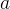

对偶命题 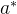 : 把合取换成析取，把析取换为合取。

内否式 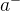 : 把变元变成相应的否定形式。

有如下定理：

- 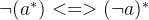 - 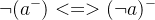- 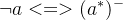
如下定理：

- a为永真公式当且仅当为永真公式- 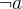为永真公式当且仅当为永真公式
对偶定理[[1]](https://blog.csdn.net/myRealization/article/details/120175968)：

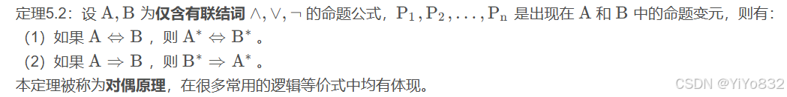

## 命题演算的形式推理
### 直接引入规则
前提引入规则(无代价)

假设引入规则(有代价)

### 直接推理规则
蕴含消去规则

合取消去规则

析取引入规则

等价引入规则

等价消去规则

### 间接推理规则
蕴含引入规则

析取消去规则

否定消去规则

否定引入规则
