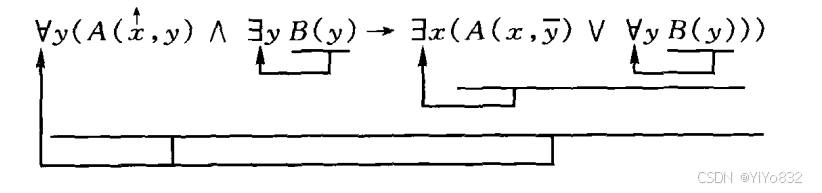
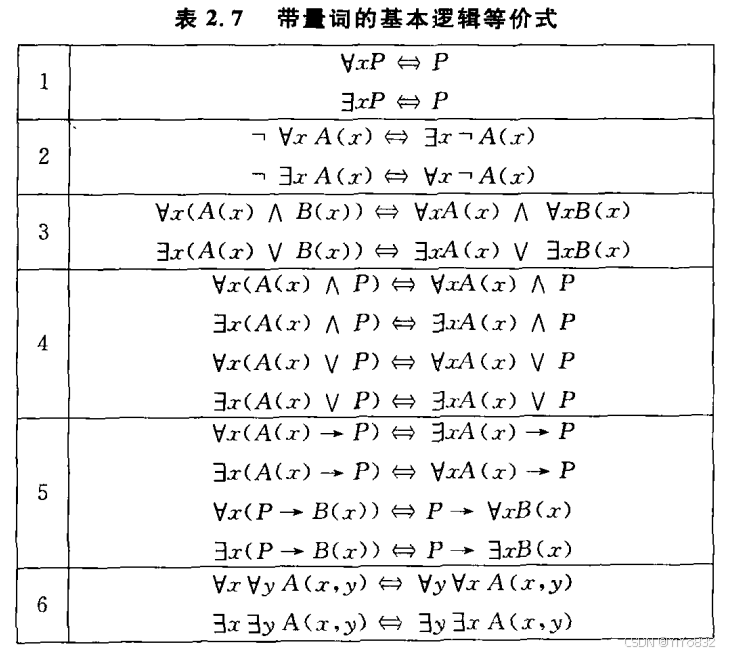
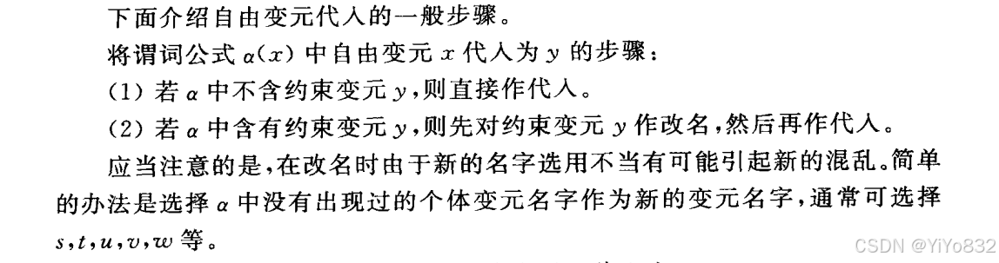
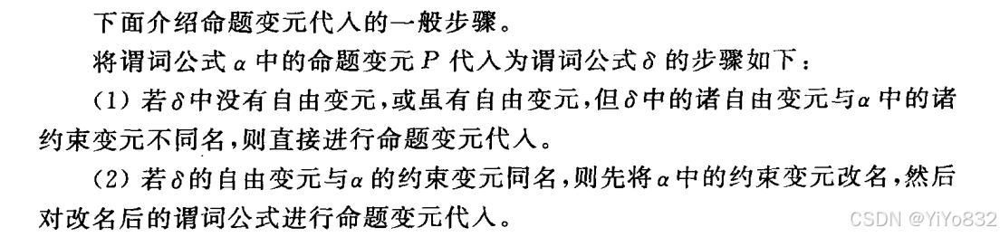
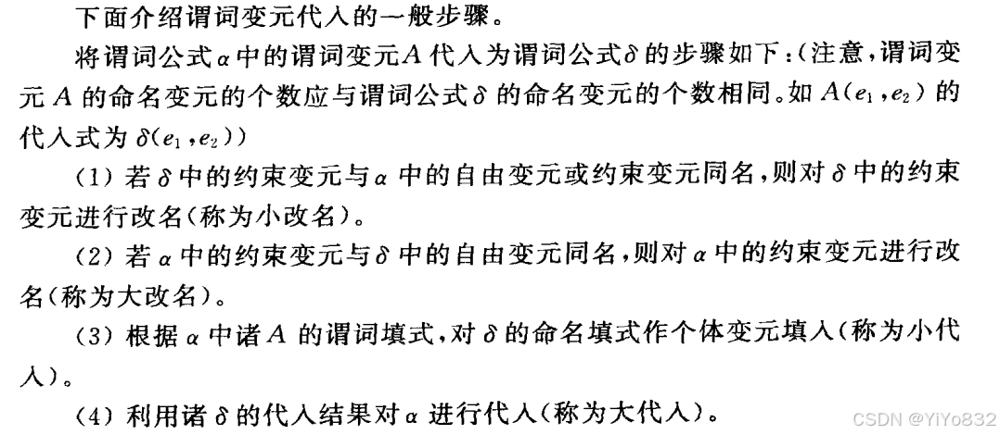
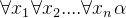
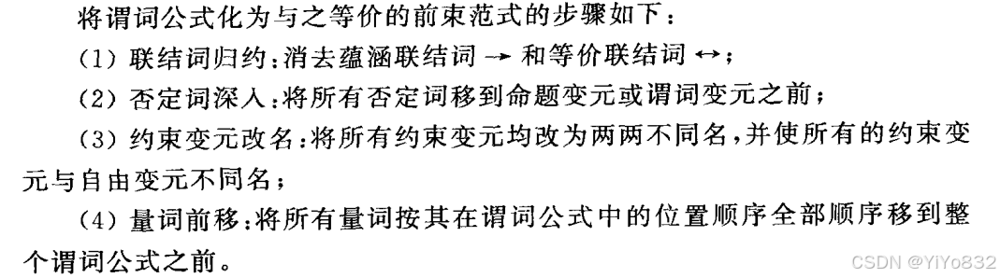
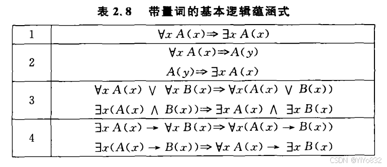
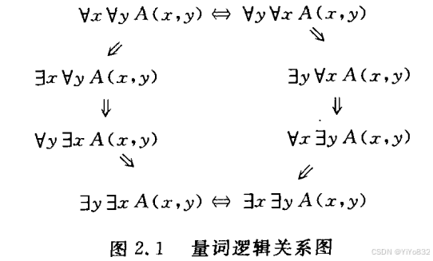

# XJTUSE-离散数学-谓词演算

## 谓词与量词

### 谓词与个体

### 量词

全称量词

存在量词

### 谓词符号化

个体域的统一

个体域转化为特性谓词：

- 全称量词，特性谓词作为蕴涵前件出现在该量词的辖域内；- 存在量词，特性谓词作为合取项出现在该量词的辖域内；## 谓词公式与真假性

### 谓词公式

约束关系的区分

### 指派

和之前的定义差不多，不过需要考虑全称量词和存在量词的影响。

## 基本逻辑等价

### 替换定理

和之前的命题演算相似。

### 代入定理

需要对谓词变元解析改名，改名步骤如下：

#### 自由变元

####  命题变元

#### 谓词变元

#### 全称封闭式

### 前束范式

简单描述即为把全称量词和存在量词全部提到最前面的式子。

## 逻辑蕴含关系

### 基本逻辑蕴含式

## 谓词演算的形式推理

### 直接推理规则

存在引入规则

全称消去规则

### 间接推理规则

存在消去规则

全称引入规则
