# XJTUSE-编译原理-第七章-HOMEWORK

## 第一题

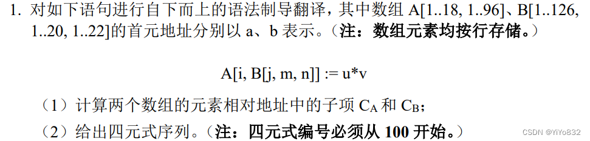

### 第一问

由公式可知：

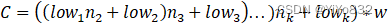

其中表示为 i 的下界，表示为 i 的可取值个数，w 表示数组元素宽度

得：

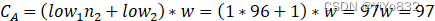

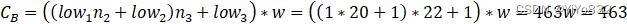

### 第二问

下面是四元式序列：

100(*,j,20,T1)

101(+,T1,m,T1)

102(*,T1,22,T1)

103(+,T1,n,T1)

104(-,b,463,T2)

105(=[],T2[T1],-,T3)

106(*,i,96,T4)

107(+,T4,T3,T4)

108(-,a,97,T5)

109(*,u,v,)

110([]=,T6,-,T5[T4])

## 第二题

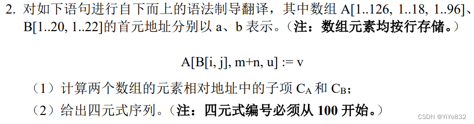

### 第一问

由公式可知：

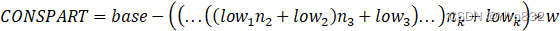

其中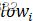表示为 i 的下界，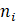表示为 i 的可取值个数，w 表示数组元素宽度

得：

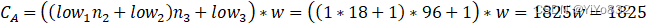

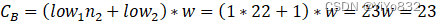

### 第二问

下面是四元式序列：

100(*,i,22,T1)

101(+,T1,j,T1)

102(-,b,23,T2)

103(=[],T2[T1],-,T3)

104(+,m,n,T4)

105(*,T3,18,T5)

106(+,T5,T4,T5)

107(*,T5,96,T5)

108(+,T5,u,T5)

109(-,a,1825,T6)

110([]=,v,-,T6[T5])

## 第三题

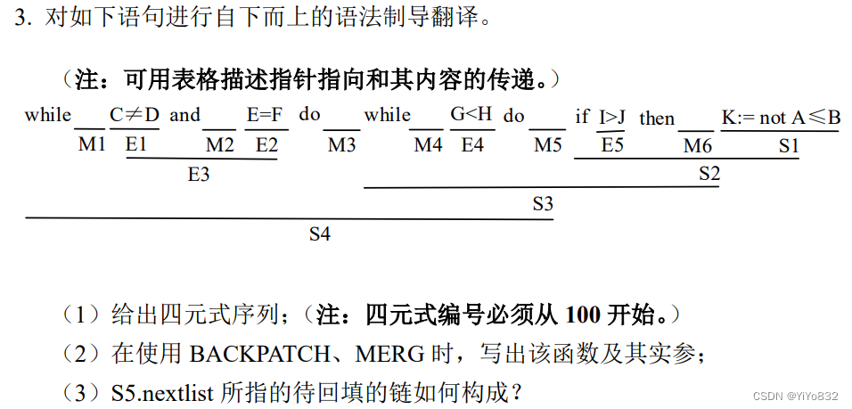

### 第一问

100(j≠,C,D,0->102)

101(j,-,-,0)

102(j=,E,F,0->104)

103(j,-,-,0->101)

104(j106)

105(j,-,-,0->100)

106(j>,I,J,0->108)

107(j,-,-,0->104)

108(E1 and M2 E2

有如下的 backpatch 和 merge 函数：

backpatch(E1.truelist,M2.quad)=backpatch(100,102)

E3.falselist:=merge(E1.falselist,E2.falselist):=merge(101,103)=103

S3

S3 -> while M4 E4 do M5 S2

有如下的 backpatch 函数：

backpatch(S2,nextlist,M4.quad)=backpatch(107,104)

backpatch(E4.truelist,M5.quad)=backpatch(104,106)

S2

S2 -> if E5 then M6 S1

有如下的 backpatch 和 merge 函数：

backpatch(E5.truelist,M6.quad)=backpatch(106,108)

S2.nextlist := merge(E5.falselist,S1.nextlist):=merge(107,0)=107

S4

S4 -> while M1 E3 do M3 S3

有如下的 backpatch 函数：

backpatch(S3.nextlist,M1.quad)=backpatch(105,100)

backpatch(E3.truelist,M3.quad)=backpatch(102,104)

### 第三问

不存在 S5，下面给出 S4.nextlist 所指的待回填的链构成：

## 第四题

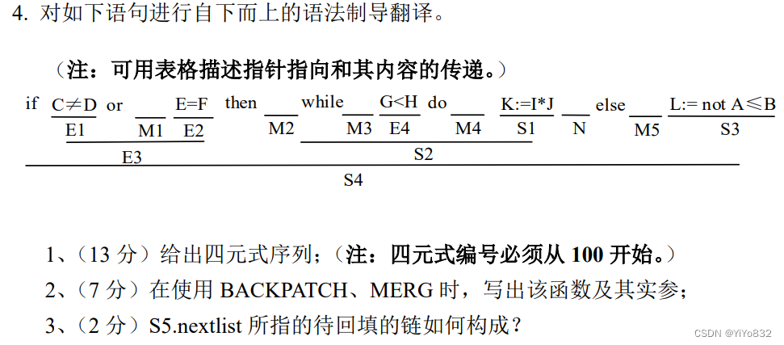

### 第一问

100(j≠,C,D,0->104)

101(j,-,-,0->102)

102(j=,E,F,0->100->104)

103(j,-,-,0->110)

104(j106)

105(j,-,-0)

106(*,I,J,T1)

107(:=,T1,-,K)

108(j,-,-,104)

109(j,-,-,0->105)

110( E1 or M1 E2

有如下的 backpatch 和 merge 函数：

backpatch(E1.falselist,M1.quad)=backpatch(101,102)

E3.truelist:=merge(E1.truelist,E2.truelist):=merge(100,102)=102

S4

S4 -> if E3 then M2 S2 N else M5 S3

有如下的 backpatch 和 merge 函数：

backpatch(E3.truelist,M2.quad)=backpatch(102,104)

backpatch(E3.falselist,M5.quad)=backpatch(103,110)

S4.nextlist := merge(S2.nextlist,N.nextlist,S3.nextlist):=merge(105,109,0)=109

S2

S2 -> while M3 E4 do M4 S1

有如下的 backpatch 和 merge 函数：

backpatch(S1.nextlist,M3.quad)=backpatch(108,104)

backpatch(E4.truelist,M4.quad)=backpatch(104,106)

### 第三问

不存在 S5，下面给出 S4.nextlist 所指的待回填的链构成：

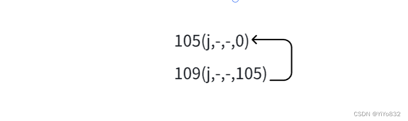
