# XJTUSE-编译原理-第三章-homework

编译原理每年作业题目都不一样，基本就是改几个小数据，我也是希望把今年(2024年)的作业题誊写下来，供各位学弟学妹多点题可以刷，多考高分！

## 第一题

### 题目描述

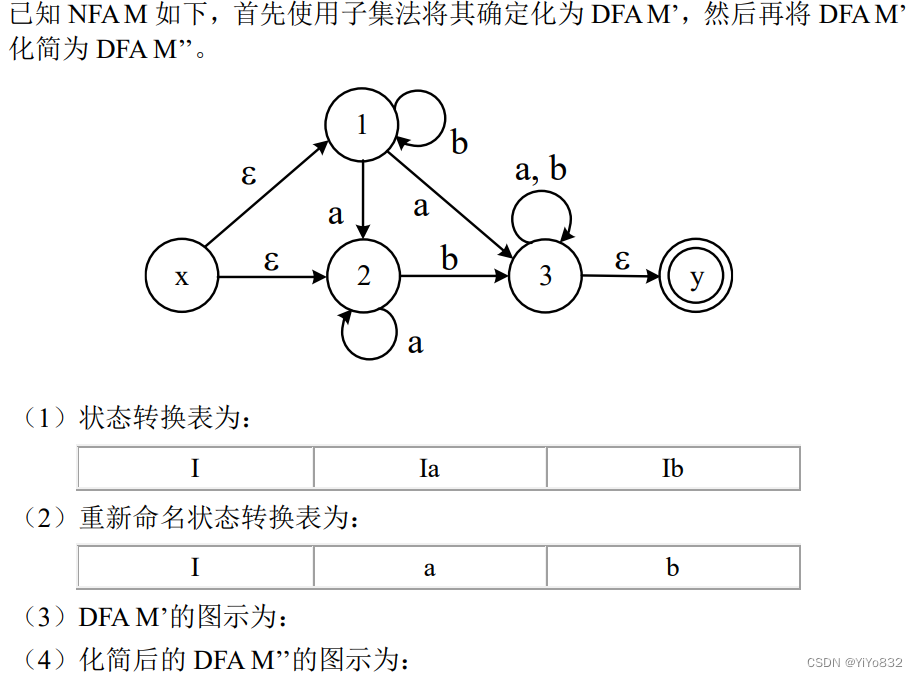

### 第一问

			I

			

			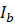

			{x,1,2}

			{2,3,y}

			{1,3,y}

			{2,3,y}

			{2.3.y}

			{3,y}

			{1.3.y}

			{2,3,y}

			{1,3,y}

			{3,y}

			{3,y}

			{3,y}

### 第二问

			I

			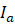

			

			1

			2

			3

			2

			2

			4

			3

			2

			3

			4

			4

			4

### 第三问

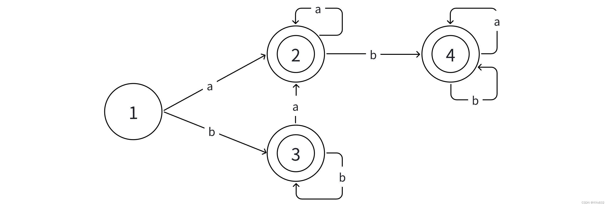

### 第四问

化简步骤如下：

1.根据终态和非终态划分为{1},{2,3,4}

2.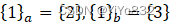，将{1}作为集合，下面考察终态

3.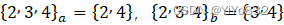，均属于终态集合

4.因此划分结束，2,3,4，得到化简后的DFAM''

## 第二题

### 题目描述

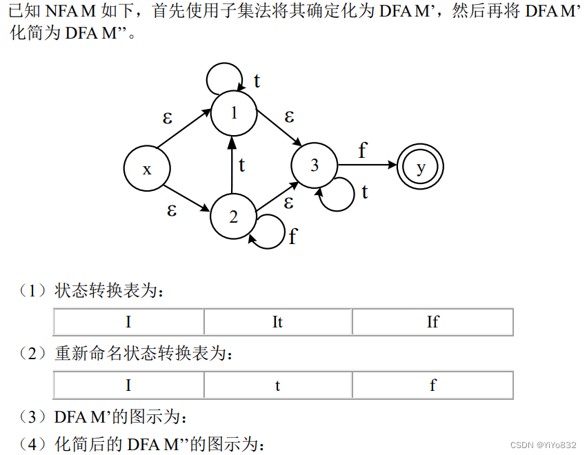

### 第一问

			I

			

			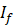

			{x,1,2,3}

			{1,3}

			{2,3,y}

			{1,3}

			{1,3}

			{y}

			{2,3,y}

			{1,3}

			{2,3,y}

			{y}

			\

			\

### 第二问

			I

			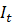

			

			1

			2

			3

			2

			2

			4

			3

			2

			3

			4

			\

			\

### 第三问

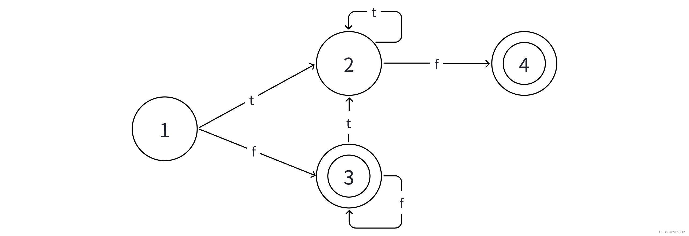

### 第四问

化简步骤如下：

- 根据终态和非终态划分为{1,2},{3,4}- 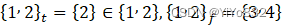，观察终态集合- 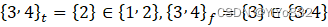，无法区分，划分完毕- 因此可以将1,2合并，将3,4合并，得到化简后的DFAM''

