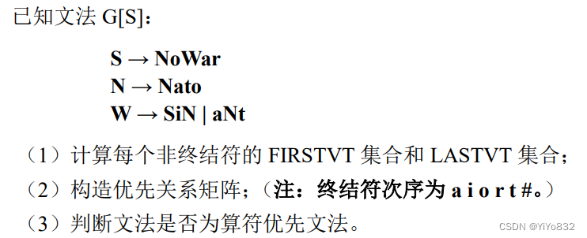
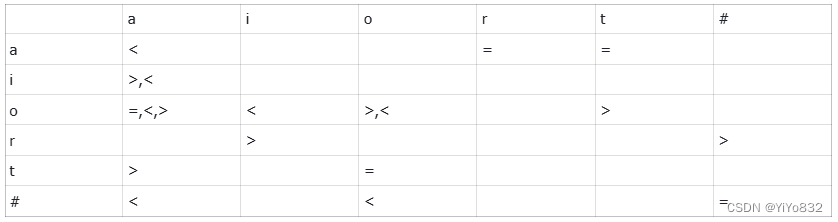
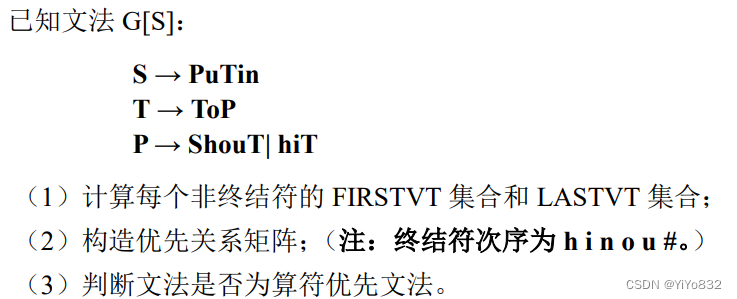
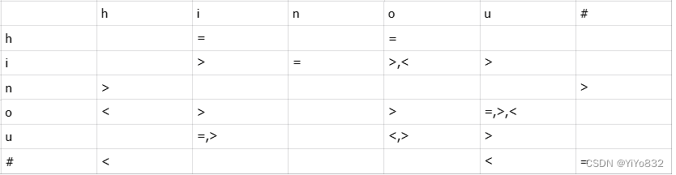
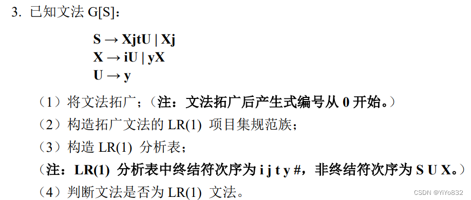
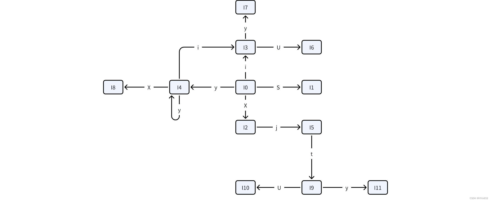
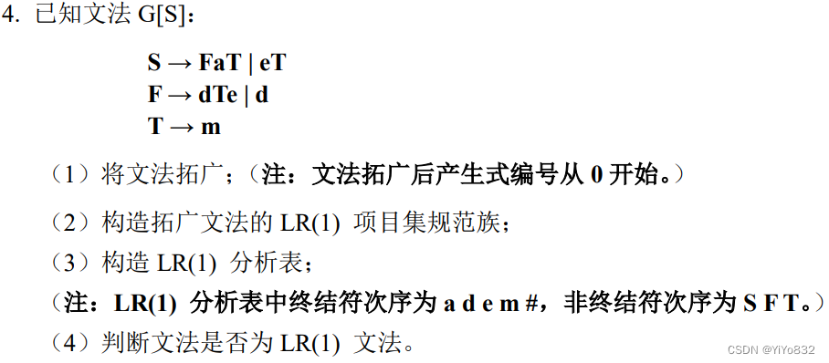

# XJTUSE-编译原理-第五章-HOMEWORK

## 第一题
### 问题描述

### 第一问

  FIRSTVT

  LASTVT

  S

  o,a

  r

  N

  a

  o

  W

  i,a,o

  o,i,t

### 第二问
说明：

为方便表示，用表示算符的优先符号

### 第三问
不满足算符优先文法，因为终结符对存在多个优先关系。

## 第二题
### 问题描述

### 第一问

  FIRSTVT

  LASTVT

  S

  u,h

  n

  T

  o

  o,i,u

  P

  u,h

  o,i,u

### 第二问
说明：

为方便表示，用表示算符的优先

### 第三问
不满足算符优先文法，因为终结符对存在多个优先关系。

## 第三题

 友情链接：[《编译原理》LR 分析法与构造 LR(1) 分析表的步骤 - 例题解析 - xpwi - 博客园](https://www.cnblogs.com/xpwi/p/11070888.html)

### 第一问
 拓广文法如下：

(0)S'->S

(1)S->XjtU

(2)S->Xj

(3)X->iU

(4)X->yX

(5)U->y

### 第二问
LR(1)的项目集规范族如下：

I0:

S'->·S,#

S->·XjtU,#

S->·Xj,#

X->·iU,j

X->·yX,j

I1:

S'->S·,#

I2:

S->X·jtU,#

S->X·j,#

I3:

X->i·U,j

U->·y,j

I4:

X->y·X,j

X->·iU,j

X->·yX,j

I5:

S->Xj·tU,#

S->Xj·,#

I6:

X->iU·,j

I7:

U->y·,j

I8:

X->yX·，j

I9:

S->Xjt·U,#

U->·y,#

I10:

S->XjtU·,#

I11:

U->y·,#

有限状态机如下：

### 第三问
构造的LR(1)分析表如下：

  ACTION

  GOTO

  状态

  i

  j

  t

  y

  #

  S

  U

  X

  0

  s3

  s4

  1

  2

  1

  acc

  2

  s5

  3

  s7

  6

  4

  s3

  s4

  8

  5

  s9

  r2

  6

  r3

  7

  r5

  8

  r4

  9

  s11

  10

  10

  r1

  11

  r5

### 第四问
不存在多重定义入口，是LR(1)文法！

## 第四题

### 第一问
拓广后的文法如下：

(0)S'->S

(1)S->FaT

(2)S->eT

(3)F->dTe

(4)F->d

(5)T->m

### 第二问
LR(1)的项目集规范族如下：

I0:

S'->·S,#

S->·FaT,#

S->·eT,#

F->·dTe,a

F->·d,a

I1:

S'->S·,#

I2:

S->F·aT,#

I3:

S->e·T,#

T->·m,#

I4:

F->d·Te,a

F->d·,a

T->·m,e

I5:

S->Fa·T,#

T->·m,#

I6:

S->eT·,#

I7:

T->m·,#

I8:

F->dT·e,a

I9:

T->m·,a

I10:

S->FaT·,#

I11:

F->dTe·,a

有限状态机如下：

### 第三问
构造的LR(1)分析表如下：

  ACTION

  GOTO

  状态

  a

  d

  e

  m

  #

  S

  F

  T

  0

  s4

  s3

  1

  2

  1

  acc

  2

  s5

  3

  s7

  6

  4

  r4

  s9

  8

  5

  s7

  10

  6

  r2

  7

  r5

  8

  s11

  9

  r5

  10

  r1

  11

  r3

### 第四问
不存在多重定义入口，是LR(1)文法！
