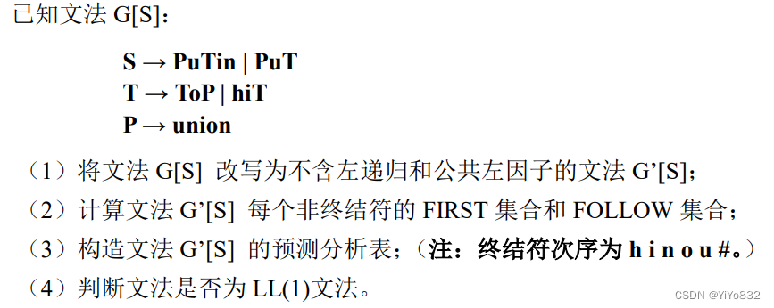
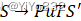
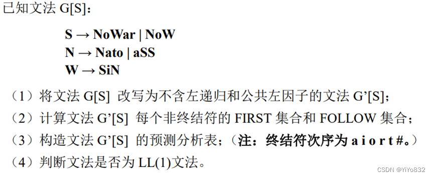

# XJTUSE-编译原理-第四章-homework

## 第一题

### 问题描述

### 第一问

将文法 G[S]改写为不含左递归：

T→hiTT'

T'→oPT'|ε

改成公共左因子：

S→PuTS'

S'→in|ε

综上所述，得文法 G'[S]：

S→PuTS'

S'→in|ε

T→hiTT'

T'→oPT'|ε

P→union

### 第二问

只有S→PuTS'需要 P 的 First 集，剩下的非终结符可以得到：

			非终结符

			First 集

			S'

			{i,ε}

			P

			{u}

			T

			{h}

			T'

			{o,ε}

然后，可以得到 S 的 First 集

			非终结符

			First 集

			S

			{u}

然后，计算非终结符的 Follow 集合：

- 首先将#放入 S 的 Follow 集中，查看S→PuTS'- #加入 S‘的 Follow 集合- i，#加入 T 的 Follow 集合- u 加入 P 的 Follow 集合- 查看T→hiTT'- 将 T’的 First 集合的终结符(o)加入 T 的 Follow 集合- i，o，#加入 T’的 Follow 集合- 查看T'→oPT'|ε- o 加入 P 的 Follow 集合- i，#加入 P 的 Follow 集合- 发现任何非终结符的 Follow 集不再增加，结束！

			非终结符

			Follow 集

			S

			{#}

			S'

			{#}

			P

			{i,o,u,#}

			T

			{i,o,#}

			T'

			{i,o,#}

综上所述：

			非终结符

			First 集

			Follow 集

			S

			{u}

			{#}

			S'

			{i,ε}

			{#}

			P

			{u}

			{i,o,u,#}

			T

			{h}

			{i,o,#}

			T'

			{o,ε}

			{i,o,#}

### 第三问

由文法得预测分析表如下：

			h

			i

			n

			o

			u

			#

			S

			S→PuTS'

			S'

			S'→in

			S'→ε

			P

			P→union

			T

			T→hiTT'

			T'

			T'→ε

			T'→ε

			T'→oPT'

			T'→ε

### 第四问

预测分析表中 M[T'，o]存在多重定义入口，不满足 LL(1)文法

## 第二题

### 问题描述

### 第一问

将文法 G[S]改写成不含左递归：

N→aSSN'

N'→atoN'|ε

提取公共左因子：

S→NoWS'

S'→ar|ε

综上，G[S']文法为：

N→aSSN'

N'→atoN'|ε

S→NoWS'

S'→ar|ε

W→SiN

### 第二问

做法与第一题相似，不再展开。

			非终结符

			First 集

			S

			{a}

			S'

			{a,ε}

			N

			{a}

			N'

			{a,ε}

			W

			{a}

求 Follow 集合步骤如下：

- 首先将#放入 S 的 Follow 集中，查看S→NoWS'- #加入 S'的 Follow 集合- a，#加入 W 的 Follow 集合- o 加入 N 的 Follow 集合- 查看N→aSSN'- a 加入 S 的 Follow 集合- o 加入 N‘的 Follow 集合- 查看W→SiN- i 加入 S 的 Follow 集合- a，#加入 N 的 Follow 集合- 查看S→NoWS'- a，i 加入 S’的 Follow 集合- a，i 加入 W 的 Follow 集合- 查看N→aSSN'- o 加入 S 的 Follow 集合- a，o，#加入 N’的 Follow 集合- 查看S→NoWS'- o 加入 S’的 Follow 集合- o 加入 W 的 Follow 集合- 查看W→SiN- i 加入 N 的 Follow 集合- 查看N→aSSN'- i 加入 N‘的 Follow 集合- 不再添加，算法结束

			非终结符

			First 集

			Follow 集

			S

			{a}

			{a,i,o,#}

			S'

			{a,ε}

			{a,i,o,#}

			N

			{a}

			{a,i,o,#}

			N'

			{a,ε}

			{a,i,o,#}

			W

			{a}

			{a,i,o,#}

### 第三问

N→aSSN'

N'→atoN'|ε

S→NoWS'

S'→ar|ε

W→SiN

			a

			i

			o

			r

			t

			#

			S

			S→NoWS'

			S'

			S'→ar

			S'→ε

			S'→ε

			S'→ε

			S'→ε

			N

			N→aSSN'

			N'

			N'→atoN'

			N'→ε

			N'→ε

			N'→ε

			N'→ε

			W

			W→SiN

### 第四问

预测分析表中 M[S'，a]，M[N'，a]存在多重定义入口，不满足 LL(1)文法
