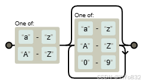
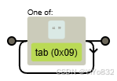
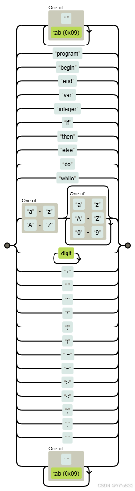

# XJTUSE-编译原理实验-词法分析

实验报告也可以在线阅读：

 [词法分析](https://ecemf3mg97.feishu.cn/docx/K78NdXq5CoENuIxgR5Pci5QTnce?from=from_copylink)

 (若不能浏览说明权限到期或者已经关闭了，浏览时请遵守法律法规)

## 实验要求
-  主要内容：

   处理的语言：类似于 PASCAL 源程序。

 -  输出结果：二元式序列。

 -  该语言的单词符号包括：

 -  保留字(10 种)：

program begin end var integer if then else do while

-  标识符

 -  整型常数

 -  界符、运算符(11 种)：

＋ － ( ) = > βα|β

β->0|1|2|...|9

② 标识符或保留字一般形式化描述为：

α->βγ γ->βγ|θγ|ε

β->a|b|...|Y|Z

θ->0|1|2|...|9

③ 符号

α->+|-|*|/|(|)|,|.|:=|;|θ|β|βγ|βθ|γ|γθ|

β->  >

θ-> =

## NFA 和 DFA
在词法分析器的实现中，NFA 和 DFA 扮演着重要的角色。词法分析器的主要任务是将输入字符流分解为一系列有意义的标记(tokens)。这个过程通常分为两个步骤：

-  模式匹配：

   使用正则表达式或其他模式匹配技术，识别输入字符流中的各种模式，如标识符、关键字、常量等。

 -  这一步通常使用 NFA 来实现，因为 NFA 可以更简单地表示正则表达式。

 -  状态转换：

   根据识别出的模式，确定每个 token 的类型。

 -  这一步通常使用 DFA 来实现，因为 DFA 可以更高效地进行状态转换和 token 识别。

具体来说，词法分析器的实现流程如下：

-  首先，定义一组正则表达式模式，用于识别输入字符流中的各种 token 类型。这些模式可以被转换为 NFA。

 -  然后，将 NFA 转换为等价的 DFA。这可以通过子集构造法或其他算法来实现。

 -  使用 DFA 来扫描输入字符流，识别出各种 token 并确定它们的类型。

 -  将识别出的 token 添加到一个 token 列表中，供后续的语法分析器使用。

根据如上实现流程，我们可以先绘制出本次实验需要的 DFA 或者 NFA：

 有一些很简单的无需进行绘制，比如关键字直接匹配就可以了

我们绘制识别常数，标识符和无意义字符的识别 NFA 图

 符号

  DFA / NFA

  常数

  标识符

  无意义的空格&tab

 
### 状态转换图
下面是总的状态转换图！



## RE 库 & 识别词代码
### RE 库
RE (正则表达式)库是 Python 标准库中的一个模块，提供了对正则表达式的支持。它允许你使用强大的模式匹配功能来处理文本数据。下面是 RE 库的一些主要特点：

-  模式匹配：

   RE 库提供了一系列函数，如`re.match()`、`re.search()`、`re.findall()`等，用于在字符串中搜索和匹配正则表达式模式。

 -  这些函数返回匹配结果，可以进一步处理。

 -  正则表达式语法：

   RE 库支持 Perl 兼容的正则表达式语法，包括特殊字符、量词、分组等众多功能。

 -  这些语法可以用于构建复杂而强大的模式，满足各种文本处理需求。

 -  替换和拆分：

   RE 库提供了`re.sub()`和`re.split()`函数，用于基于正则表达式替换和拆分字符串。

 -  这些功能在文本处理和数据清洗中很有用。

 -  编译正则表达式：

   RE 库允许你将正则表达式对象编译为`re.Pattern`对象，以提高性能。

 -  编译后的对象可以重复使用，避免每次使用正则表达式时都需要重新编译。

 -  错误处理：

   RE 库会在正则表达式语法错误时抛出`re.error`异常。

 -  你可以捕获并处理这些异常，确保代码的健壮性。

### 符号编码

 (单词种别定义)

下面是符号编码的代码：

```
# Token types
IDENTIFIER, CONSTANT, PROGRAM, BEGIN, END, VAR, INTEGER, IF, THEN, ELSE, DO, WHILE = range(1, 13)
PLUS, MINUS, MULTIPLY, DIVIDE = 14, 15, 16, 17
LPAREN, RPAREN = 18, 19
EQUAL, GREATER_THAN, LESS_THAN = 20, 21, 22
SEMICOLON, COMMA, COLON, ASSIGN = 23, 24, 25, 26
ERROR = -1
```
我不进行表格展示，以此节约报告长度，下面简单说明：

-  使用了`range`对标识符，常数，关键字等进行编码

 -  对算符，界符等符号进行编码

 -  考虑到出错的情况，对`ERROR`也进行了编码，而且为负数！

### 识别词代码

 (词法分析程序&关键算法文字说明)

因此，我们可以编写下面代码(算法的思想阐述在注释)：

```
def __tokenize(self, input_str):
    # 正则表达式列表
    token_specification = [
        ('PROGRAM', r'program'),
        ('BEGIN', r'begin'),
        ('END', r'end'),
        ('VAR', r'var'),
        ('INTEGER', r'integer'),
        ('IF', r'if'),
        ('THEN', r'then'),
        ('ELSE', r'else'),
        ('DO', r'do'),
        ('WHILE', r'while'),
        ('IDENTIFIER', r'[a-zA-Z][a-zA-Z0-9]*'),
        ('CONSTANT', r'\d+'),
        ('PLUS', r'\+'),
        ('MINUS', r'-'),
        ('MULTIPLY', r'\*'),
        ('DIVIDE', r'/'),
        ('LPAREN', r'\('),
        ('RPAREN', r'\)'),
        ('ASSIGN', r'\:='),
        ('EQUAL', r'\='),
        ('GREATER_THAN', r'\>'),
        ('LESS_THAN', r'\<'),
        ('SEMICOLON', r'\;'),
        ('COMMA', r'\,'),
        ('COLON', r'\:'),
        ('SKIP', r'[ \t]+'),
        ('MISMATCH', r'.'),
    ]
    # 进行匹配
    token_regex = '|'.join('(?P<%s>%s)' % pair for pair in token_specification)
    tokens = []
    # 开始匹配
    for mo in re.finditer(token_regex, input_str):
        kind = mo.lastgroup
        value = mo.group()
        token_type = kind
        if kind in ['IDENTIFIER', 'CONSTANT']:
            token_type = kind
        if kind == 'SKIP':
            continue
        tokens.append(Token(value, token_type))

    return tokens
```
有一个很重要的，需要阐述的点：

我们注意到正则表达式列表的识别是存在步骤的！

比如，我们应该先识别关键字，再识别标识符。

再比如，我们应该先识别`:=`,再去考虑`:`和`=`！

至此，我们完成了识别各个词的任务。

## 输入 & 输出
我们需要文件输入，文件输出：

文件输入很简单，只需要全部读取即可：

```
with open('fileSet/input/lab1.txt', 'r') as file:
    content = file.read()
```
但是文件输出，为了使得我们的代码健壮，同时保证可读性，我将文件输出进行了封装：

```
class fileWriter:
    """封装文件输出类"""
    def __init__(self, filename):
        self.filename = filename
        # 初始化+清空+创建文件
        self.fw = open(self.filename, 'w', encoding="utf-8")
        self.fw.write(str(datetime.now()) + '\n')
        self.fw.close()

    def write(self, msg):
        # 追加模式
        self.fw = open(self.filename, 'a', encoding='utf-8')
        self.fw.write(msg + "\n")
        self.fw.close()
```
这样保证了文件无需要其他过程中被调用！

然后，我们只需要将`RE 库 & 识别词代码`中的结果转化为字符串输出到文件即可：

```
def __str__(self):
    s = ""
    for token in self.tokens:
        s += "({}\t,{}\t,{})\n".format(token.lexeme, token.type, identifiers[token.type])
    return s
```
至此，我们完成了本次实验的全部任务！

由于篇幅原因，我进行了很多测试，但是无法一一在报告中展示，我仅将报告里的代码段在附录中进行展示！

## 实验总结
### 实验结果
通过本次实验,我成功实现了一个简单的词法分析器,具有以下功能:

-  能够识别并分类常见的token类型,如标识符、关键字、整数、浮点数、运算符等。

 -  采用正则表达式模式描述token的形式特征,并转换为NFA和DFA实现高效的模式匹配。

 -  扫描输入字符串,将识别出的token保存在一个列表中,供后续的语法分析使用。

 -  通过测试用例验证了词法分析器的正确性和鲁棒性。

### 实验心得
本次实验让我深入理解了词法分析在编译器中的作用,以及使用正则表达式和有限状态自动机实现词法分析器的具体方法。

在实践中,我学会了如何:

-  分析编程语言的词法特征,设计合适的token类型和正则表达式模式。

 -  将正则表达式转换为NFA和DFA,利用它们的不同特点实现高效的模式匹配。

 -  编写代码,构建一个完整的词法分析器,并进行测试和调试。

通过本次实验,我不仅掌握了词法分析的相关知识,还培养了分析问题、设计解决方案、编码实现和测试调试的能力。这些经验对我们日后从事编译器或其他语言处理领域的工作会非常有帮助。

## 附录
### 输入
输入文件如下：

```
program example;
var k, m, n: integer;
begin
k:=8;
m:=5;
n:=k+m;
if n>10 then
k:=k-1;
end;
```
### 输出
输出文件如下：

```
2024-06-04 :05.244904
(符号 ,识别符   ,识别码)
(program    ,PROGRAM   ,3)
(example    ,IDENTIFIER    ,1)
(;  ,SEMICOLON ,23)
(var    ,VAR   ,6)
(k  ,IDENTIFIER    ,1)
(,  ,COMMA ,24)
(m  ,IDENTIFIER    ,1)
(,  ,COMMA ,24)
(n  ,IDENTIFIER    ,1)
(:  ,COLON ,25)
(integer    ,INTEGER   ,7)
(;  ,SEMICOLON ,23)
(begin  ,BEGIN ,4)
(k  ,IDENTIFIER    ,1)
(:= ,ASSIGN    ,26)
(8  ,CONSTANT  ,2)
(;  ,SEMICOLON ,23)
(m  ,IDENTIFIER    ,1)
(:= ,ASSIGN    ,26)
(5  ,CONSTANT  ,2)
(;  ,SEMICOLON ,23)
(n  ,IDENTIFIER    ,1)
(:= ,ASSIGN    ,26)
(k  ,IDENTIFIER    ,1)
(+  ,PLUS  ,14)
(m  ,IDENTIFIER    ,1)
(;  ,SEMICOLON ,23)
(if ,IF    ,8)
(n  ,IDENTIFIER    ,1)
(>  ,GREATER_THAN  ,21)
(10 ,CONSTANT  ,2)
(then   ,THEN  ,9)
(k  ,IDENTIFIER    ,1)
(:= ,ASSIGN    ,26)
(k  ,IDENTIFIER    ,1)
(-  ,MINUS ,15)
(1  ,CONSTANT  ,2)
(;  ,SEMICOLON ,23)
(end    ,END   ,5)
(;  ,SEMICOLON ,23)
```
### 全部代码

 仅作参考，部分代码是GPT生成的

 同学们写这些实验一定要关注核心思想，有些实现细节的代码确实可以偷懒

 但是，不能说偷懒到不经过自己思考，直接照搬

 做好实验，完成度很高，也算是锻炼自己实际动手能力。

```
import re
from datetime import datetime

from config import *

class fileWriter:
    """封装文件输出类"""

    def __init__(self, filename):
        self.filename = filename
        # 初始化+清空+创建文件
        self.fw = open(self.filename, 'w', encoding="utf-8")
        self.fw.write(str(datetime.now()) + '\n')
        self.fw.close()

    def write(self, msg):
        # 追加模式
        self.fw = open(self.filename, 'a', encoding='utf-8')
        self.fw.write(msg + "\n")
        self.fw.close()

# Token class
class Token:
    def __init__(self, lexeme, type, code):
        self.lexeme = lexeme
        self.type = type
        self.code = code

    def __str__(self):
        return "{}\t{}\t{}".format(self.lexeme, self.type, self.code)

# TokenStream class
class TokenStream:
    def __init__(self, input_str):
        self.tokens = self.__tokenize(input_str)
        self.index = 0

    def __tokenize(self, input_str):
        # 正则表达式列表
        token_specification = [
            ('PROGRAM', r'program'),
            ('BEGIN', r'begin'),
            ('END', r'end'),
            ('VAR', r'var'),
            ('INTEGER', r'integer'),
            ('IF', r'if'),
            ('THEN', r'then'),
            ('ELSE', r'else'),
            ('DO', r'do'),
            ('WHILE', r'while'),
            ('IDENTIFIER', r'[a-zA-Z][a-zA-Z0-9]*'),
            ('CONSTANT', r'\d+'),
            ('PLUS', r'\+'),
            ('MINUS', r'-'),
            ('MULTIPLY', r'\*'),
            ('DIVIDE', r'/'),
            ('LPAREN', r'\('),
            ('RPAREN', r'\)'),
            ('ASSIGN', r'\:='),
            ('EQUAL', r'\='),
            ('GREATER_THAN', r'\>'),
            ('LESS_THAN', r'\<'),
            ('SEMICOLON', r'\;'),
            ('COMMA', r'\,'),
            ('COLON', r'\:'),
            ('SKIP', r'[ \t]+'),
            ('MISMATCH', r'.'),
        ]
        # 进行匹配
        token_regex = '|'.join('(?P<%s>%s)' % pair for pair in token_specification)
        tokens = []
        # 开始匹配
        for mo in re.finditer(token_regex, input_str):
            kind = mo.lastgroup
            value = mo.group()
            token_type = kind
            if kind in ['IDENTIFIER', 'CONSTANT']:
                token_type = kind
            if kind == 'SKIP':
                continue
            tokens.append(Token(value, token_type, code=identifiers[token_type]))

        return tokens

    def getNextToken(self):
        if self.index < len(self.tokens):
            token = self.tokens[self.index]
            self.index += 1
            return token
        else:
            return Token('', 'FILE-END', 0)

    def getNowToken(self):
        if self.index < len(self.tokens):
            token = self.tokens[self.index]
            return token
        else:
            return Token('', 'FILE-END', 0)

    def __str__(self):
        s = ""
        for token in self.tokens:
            s += "({}\t,{}\t,{})\n".format(token.lexeme, token.type, token.code)
        return s

if __name__ == '__main__':
    with open('../fileSet/input/lab1.txt', 'r') as file:
        content = file.read()
    ts = TokenStream(content)
    fw = fileWriter("../fileSet/output/lab1.txt")
    fw.write("(符号\t,识别符\t,识别码)")
    fw.write(str(ts))
    print("完成！")

```
```
# config.py
# Token types
IDENTIFIER, CONSTANT, PROGRAM, BEGIN, END, VAR, INTEGER, IF, THEN, ELSE, DO, WHILE = range(1, 13)
PLUS, MINUS, MULTIPLY, DIVIDE = 14, 15, 16, 17
LPAREN, RPAREN = 18, 19
EQUAL, GREATER_THAN, LESS_THAN = 20, 21, 22
SEMICOLON, COMMA, COLON, ASSIGN = 23, 24, 25, 26
ERROR = -1

identifiers = {
    'IDENTIFIER': 1,
    'CONSTANT': 2,
    'PROGRAM': 3,
    'BEGIN': 4,
    'END': 5,
    'VAR': 6,
    'INTEGER': 7,
    'IF': 8,
    'THEN': 9,
    'ELSE': 10,
    'DO': 11,
    'WHILE': 12,
    'PLUS': 14,
    'MINUS': 15,
    'MULTIPLY': 16,
    'DIVIDE': 17,
    'LPAREN': 18,
    'RPAREN': 19,
    'EQUAL': 20,
    'GREATER_THAN': 21,
    'LESS_THAN': 22,
    'SEMICOLON': 23,
    'COMMA': 24,
    'COLON': 25,
    'ASSIGN': 26,
    'ERROR': -1
}

re_identifiers = {
    1: 'IDENTIFIER',
    2: 'CONSTANT',
    3: 'PROGRAM',
    4: 'BEGIN',
    5: 'END',
    6: 'VAR',
    7: 'INTEGER',
    8: 'IF',
    9: 'THEN',
    10: 'ELSE',
    11: 'DO',
    12: 'WHILE',
    14: 'PLUS',
    15: 'MINUS',
    16: 'MULTIPLY',
    17: 'DIVIDE',
    18: 'LPAREN',
    19: 'RPAREN',
    20: 'EQUAL',
    21: 'GREATER_THAN',
    22: 'LESS_THAN',
    23: 'SEMICOLON',
    24: 'COMMA',
    25: 'COLON',
    26: 'ASSIGN',
    -1: 'ERROR'
}

```
