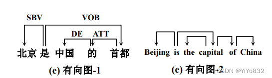
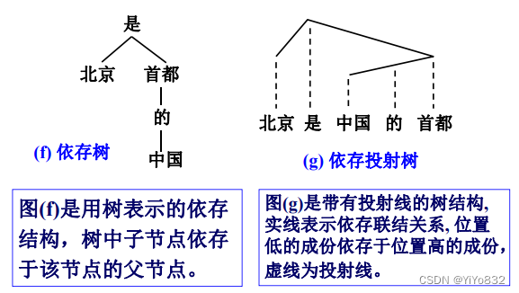
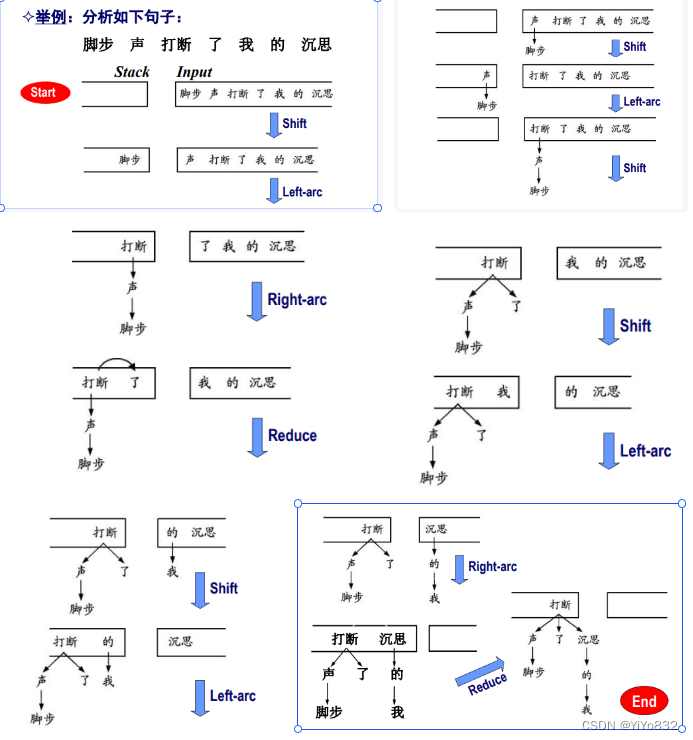
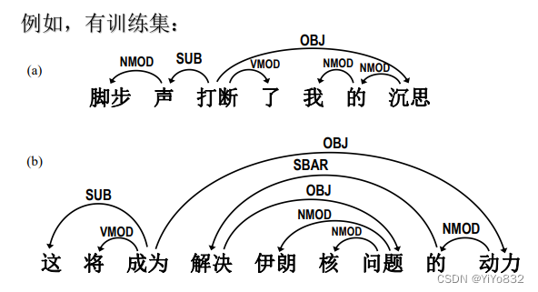
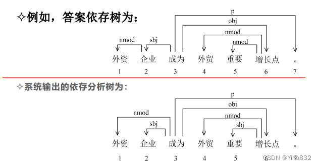
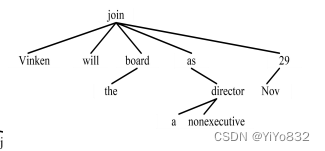
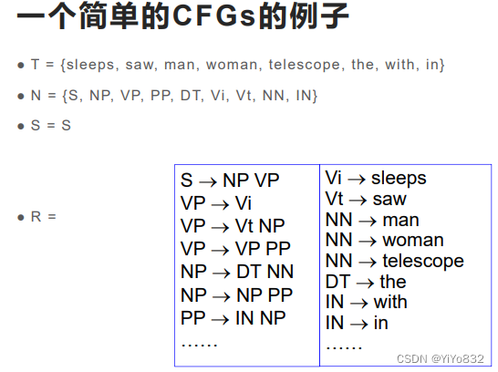
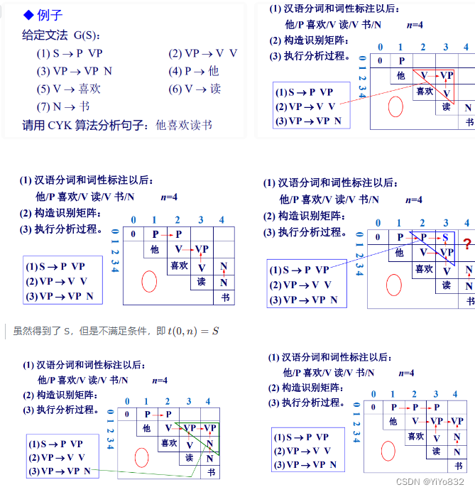
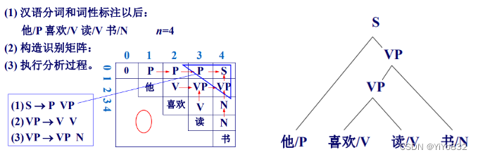
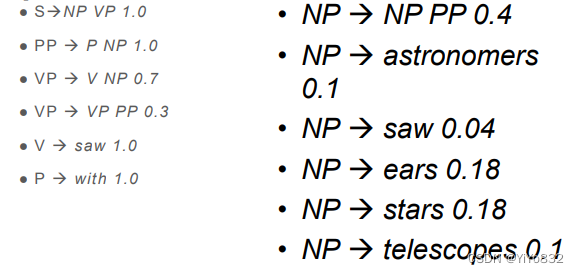

# XJTUSE-NLP-语法分析

依存语法

理论

在依存语法理论中， “依存”就是指词与词之间支 配与被支配的关系，这种关系不是对等的，而是有方 向的。处于支配地位的成分称为支配者(governor，  regent， head)，而处于被支配地位的成分称为从属者 (modifier， subordinate， dependency)



两个有向图用带有方向的弧(或称边，edge)来表 示两个成分之间的依存关系，支配者在有向弧的发 出端，被支配者在箭头端，我们通常说被支配者依 存于支配者。

考试只需掌握画线，无需掌握 SBV，VOB，DE…的概念



4 条公理：

- 一个句子只有一个独立的成分；- 句子的其他成分都从属于某一成分；- 任何一成分都不能依存于两个或多个成分；- 如果成分 A 直接从属于成分 B，而成分 C 在句子中位于 A 和 B 之间，那么，成分 C 或者从属于 A，或 者从属于 B，或者从属于 A 和 B 之间的某一成分。

对应依存图和依存树的形式约束为：- 单一父结点(single headed)- 连通(connective)- 无环(acyclic)- 可投射(projective)

投射与非投射的概念记清楚！

在这里插入图片描述
注意：

- yesterday就不满足公理四，因为which从属于dog但是yesterday没有从属于这二者之间的任何一个单词，而是从属saw- 而中文的例子满足投射的定义

依存语法分析之移进-规约

自左向右、自底向上的分析算法

当前分析状态的格局(configuration)是一个三元组： (S， I， A)，S， I， A 分别表示栈、未处理结点序列和依存弧 集合。分析体系主要包含两种分析动作组合，一种是 采用标准移进－规约方式，使用 Left-Reduce、Right- Reduce 和 Shift 三种动作。

理论过于复杂，直接看例子即可：



一共三个操作，移进，左规约，右规约。

由于该知识点个人理解也不是很到位，公式也比较少，直接把老师 PPT 上的例子照搬过来，进行学习理解即可，考试也是只考类似例题的依存树。

例题

例题 1：


例题 2：



例题 3：

Vinken will join the board as a  nonexecutive director Nov 29



个人理解：

因为理论掌握没多少，但对例题可以进行分析

- 动词为支配者，一般支配一个(多个)名词- 形容词一般的支配者应该是后面的名词- 介词，语气助词等的支配者一般也为动词

上下文无关语法

理论

Context-free grammars (CFGs)

编译原理学习过，可以简要过一遍

假设一个语言是由语法 G 生成的，则 G 可以表示为一个四元组：G=(T,N,S,R)G=(T,N,S,R)G=(T,N,S,R)
- T:表示终结符，句法树的叶子节点- N：表示非终结符，句法树的非叶子节点- S：表示为开始符号- R：重写规则(或者产生式)

上下文无关特性：句法规则X−>λX->\lambdaX−>λ的应用不依赖于出现在什么上下文环境中


Chomsky 范式

一个受 Chomsky 范式约束的 CFG 句法G=(T,N,S,R)G = (T, N, S, R)G=(T,N,S,R)，具有以下形式：

- T:终结符集合- N：非终结符集合- S：开始符号- R：句法规则集合，具有两种形式

Ni→NjNk for Ni∈N,and Nj,Nk∈NN^i \rightarrow N^jN^k \ for \ N^i \in N,and \ N^j,N^k \in N    Ni→NjNk for Ni∈N,and Nj,Nk∈N

Ni→wj for Ni∈N,and wj∈TN^i \rightarrow w^j \ for \ N^i \in N,and \ w^j \in TNi→wj for Ni∈N,and wj∈T

CYK 句法分析

自底向上的句法分析算法

采用一个线图(chart)存储中间结果

算法步骤：
- 对于 Chomsky 文法进行范式化- 自下而上的分析方法- 构造(n+1)*(n+1)的识别矩阵，n 为句子长度，输入句子x=w1,…,wnx=w_1,…,w_nx=w1​,…,wn​n=∣x∣n=|x|n=∣x∣- 识别矩阵，方阵对角线以下全为 0。- 主对角线以上元素由文法 G 的非终结符构成。- 主对角线上的元素由输入句子的终结符号(单词)构成。- 从w1w_1w1​开始分析，按平行于主对角线方向，一层一层向上填写矩阵元素tijt_ijti​j；

如果存在一个正整数k(i+1≤k≤j−1)k(i+1≤k≤j-1)k(i+1≤k≤j−1)，在文法 G 中有A→BC;B∈tik,C∈tkj;A→BC;B∈t_ik,C∈t_kj;A→BC;B∈ti​k,C∈tk​j;A 写到t(i,j)t_(i,j)t(​i,j)位置上。- 判断句子 x 由文法 G 所产生的充要条件是：t(0,n)=St(0,n)=St(0,n)=S

给个例子进行理解：




函数 CYK算法(输入: 词串w, 文法G)

初始化 chart 为一个二维数组，大小为 |w| × |w|，初始值为 空集

```
对于每个文法规则 R -> s，其中 s 是一个终结符号
    对于每个位置 i，其中 w[i] 是 w 的第 i 个字符
        如果 w[i] == s，则将 R 添加到 chart[i, i]

对于每个子串长度 l，从 2 到 |w|   # 子串长度至少为 2
    对于每个起始位置 i，从 1 到 |w| - l + 1
        对于每个分割位置 k，从 i 到 i + l - 2
            对于每个文法规则 R -> XY，其中 X 和 Y 是非终结符号
                如果 X 在 chart[i, k] 中，且 Y 在 chart[k+1, i+l-1] 中
                    将 R 添加到 chart[i, i+l-1]

如果 文法规则 S -> w 在 chart[1, |w|] 中
    返回 "句子可以由文法生成"
否则
    返回 "句子无法由文法生成"

```
概率上下文无关文法

理论

G = (T, N, S, R, P)

- T:终结符集合- N：非终结符集合- S：开始符号- R：重写规则- P：概率函数，为每一个重写规则赋予了一个概率值

为 CFG 规则下的每一棵句法导出树赋予一个概率。对于句子 s 和其可能的句法导出树集合Γ(s)Γ(s)Γ(s)，PCFG 为Γ(s)Γ(s)Γ(s)中的每棵树 t 赋予一个概率 p(t)p(t)p(t)，即得到候选树按照概率的排序。

tree∗=arg⁡ max⁡t∈T(s)⁡p(t)tree^* = arg⁡ \ \max \limits_{t \in Τ(s)}⁡ p(t)tree∗=arg⁡ t∈T(s)max​⁡p(t)
举个例子：



HMM vs PCFGs

三个基本任务一致：

- 计算句子的概率：P(w1m∣G)P(w_{1m}|G)P(w1m​∣G)- 为句子找到最优句法树：arg⁡maxt⁡P(t│w1m;G)arg⁡max_t⁡P(t│w_{1m};G)arg⁡maxt​⁡P(t│w1m​;G)- 参数学习：求解使得P(w1m│G)P(w_{1m}│G)P(w1m​│G)最大的句法 G

不同之处：- HMM 是记录 t 时刻到达状态 j 的最优路径对于的概率(根据概率得到结构)- PCFG 可能的导出结构的概率最大值(先得到结构，再计算概率)

算法

PPT 上的算法挺复杂的，而且考试不考

在计算 PCFG 的最优句法结构树，可以先使用 CYK 算法，把所有的语法树构造出来，分别计算概率，然后得出概率最大的语法树！
