# XJTUSE-OA-ch10-18

## 第十章-指令集：特征和功能

### 机器指令特征

机器指令：CPU的操作由它所执行的指令确定。

#### 机器指令要素

- 操作码- 源操作数引用- 结果操作数引用- 下一条指令引用源操作数和结果操作数可能位于下面4个范围：

- 主存或者虚存- 处理器寄存器- 立即数- I/O设备#### 指令表达

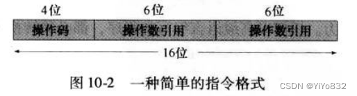

#### 指令类型

- 数据处理：算术和逻辑指令- 数据存储：存储器指令- 数据传达：I/O指令- 控制：测试和分支指令#### 地址数目(略)

#### 指令集设计(重点)

设计的出发点主要考虑：

- 操作指令表：提供多少和什么样的操作，操作何等复杂- 数据类型：对哪几种数据类型完成操作- 指令格式：指令的长度、地址数目、各个字段的大小- 寄存器- 寻址### 操作数类型

- 地址- 数值- 字符- 逻辑数据### 操作类型

主要包括：数据传送、算术、逻辑、转换、输入/输出、系统控制、控制转移

数据传送：将存储器、寄存器或者栈等里的数据转移至另一存储器、寄存器、栈。

算术：加减乘除

逻辑：位操作(布尔运算)，逻辑移位、算术移位、旋转、循环移位。

转换：改变数据格式或者对数据格式进行操作。

输入/输出(略)

系统控制：通常为特权指令

控制转移：分支指令、跳步指令、过程调用指令。

### MMX

一组用于多媒体任务的优化指令，一共有57条新指令(新指令的特点是引入了饱和算术)。

能够加速并行操作！

MMX主要是为多媒体程序设计而设置的，定义了三种新数据类型：

- 压缩字节型- 压缩字型- 压缩双字型## 第十一章-指令集：寻址方式和指令格式

### 寻址方式

#### 为什么

希望能大范围地访问主存或者虚拟存储器，因此需要多种寻址方式。

#### 类型

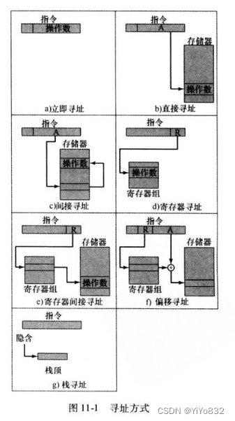

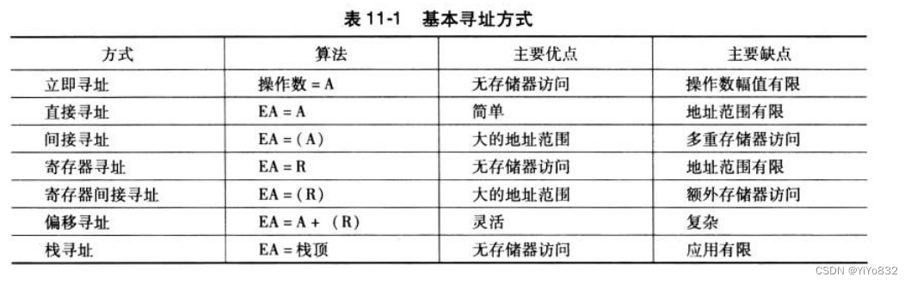

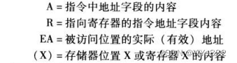

表格汇总

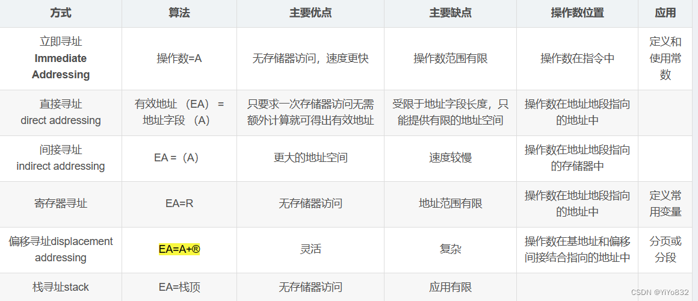

### 指令格式

指令格式：指令格式通过它的各个构成部分来定义指令的位安排，大多数的指令集使用不止一种指令格式。一个指令格式必须包括一个操作码，以及隐式或显式的、零个或多个操作数。指令格式必须隐式或显式地为每一个操作数指定其寻址空间。

#### 指令长度

即指令格式的长度。决定了机器指令的丰富性和灵活程度。

指令长度的影响因素多种多样，但主要在指令的强有力性和存储时节省空间之间进行权衡考虑。

#### 位的分配

对于一个给定的指令长度，显然要在操作码数目和寻址能力之间进行权衡

使用寻址位需要考虑：寻址方式的数目，操作数数目，寄存器与存储器比较，寄存器组的数目，地址范围，地址粒度。

#### 变长指令

即不同长度的各种指令格式。

优点：

- 提供大的操作码清单- 操作码拥有不同长度使得寻址方式更加灵活- 使用变长指令，能有效和紧凑地提供众多变化缺点：

- 增加了CPU的复杂程度- 没有消除所有指令相对于机器字长，其长度整齐的期望。常见的解决办法位取至少等于最长指令长度的几个字节/字。## 第十二章-CPU结构和功能

### CPU概述

CPU必须完成以下任务：

- 取指令- 解释指令- 取数据- 处理数据- 写数据CPU的内部结构：

### 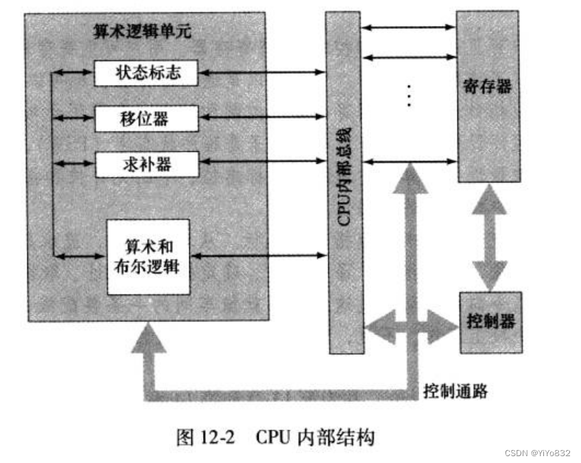

### 寄存器组成

#### 用户可见寄存器

为下面寄存器：

- 通用寄存器- 数据寄存器- 地址寄存器- 条件码#### 控制和状态的寄存器(重点)

- 程序计数器(PC)：存有待取指令的地址- 指令寄存器(IR)：存有最近取来的指令- 存储器地址寄存器(MAR)：存有存储器位置的地址- 存储器缓冲寄存器(MBR)：存有将被写入存储器的数据字或最近从存储器读出的字。PSW：程序状态字，一般含有条件吗加上其他状态信息。

#### 指令周期

- 取指- 间接- 执行- 中断#### 各周期的具体操作

这个后面微指令会详细展开，简要了解即可。

看书或者PPT，搞懂下面几幅图片：

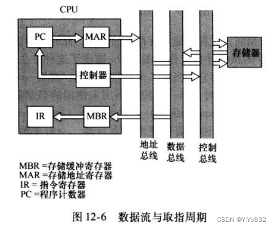

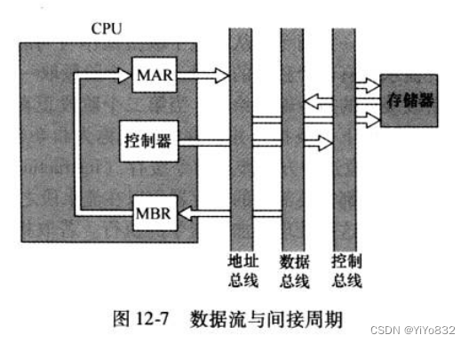

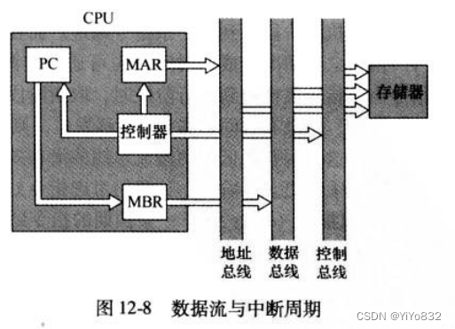

### 指令流水线

#### 是什么

简要了解即可，后面RISC的流水线策略会详细讲解。

指令处理可以得到以下分解：

- 取指令(FI)- 译码指令(DI)- 计算操作数(CO)- 取操作数(FO)- 执行指令(EI)- 写操作数(WO)时序图如下：

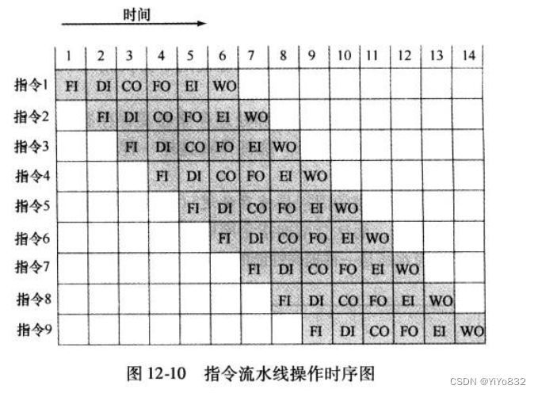

如果考虑到分支的话：

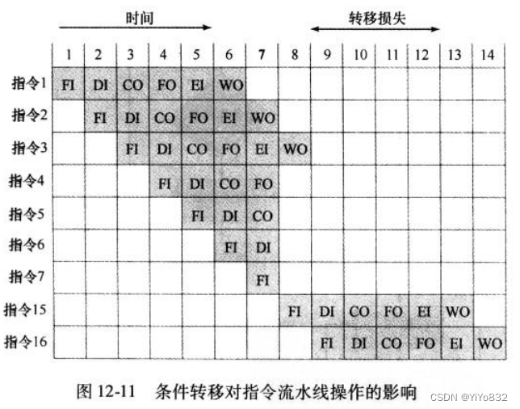

为什么不是流水线阶段越多越好？

1.流水线的每一个阶段都需要开销。

2.流水线的阶段越多，处理逻辑负担越大。

#### 流水线性能

学会计算加速比和吞吐量。

#### 流水线冒险

- 资源冒险- 数据冒险：真相关，反相关，输出相关。- 控制冒险#### 处理分支指令

- 多个指令流- 预取分支目标- 循环缓冲器- 分支预测：预测绝发生/不发生，依操作码预测，发生/不发生切换，转移历史表- 延迟分支## 第十三章-精简指令集计算机

### 指令执行特征

了解高级语言(HHL)与指令集之间的关系。

操作，操作数，过程调用三个方面进行了阐述，大概看看就好。

### 大寄存器组的方案使用

#### 是什么？

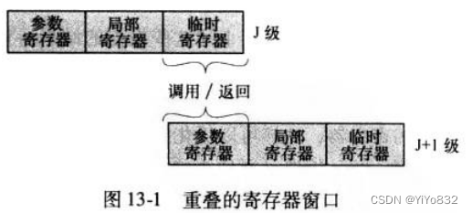

还可以做成循环的寄存器窗口

#### 全局变量

搞清楚全局变量存在哪里？ -- 全局寄存器

搞清楚全局寄存器的存储空间不够了，该怎么办？ -- 编译器决定哪些指派到全局寄存器，哪些放到内存中。

#### 与高速缓存的对比

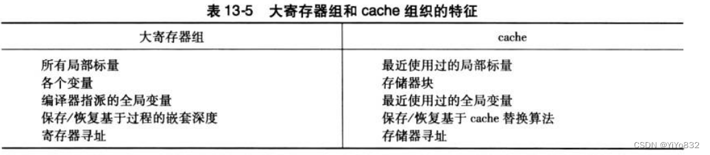

### 基于编译器的寄存器优化

掌握图着色技术即可

### RISC体系结构

#### CISC的优缺点

看一遍了解即可

#### RISC体系结构特征

掌握以下特征即可：

- 每机器周期一条机器指令- 大多数操作是寄存器到寄存器的- 使用简单的寻址方式- 使用简单的指令格式#### RISC vs CISC

简单看一遍即可。

### RISC流水线

#### 使用规整指令的流水线技术

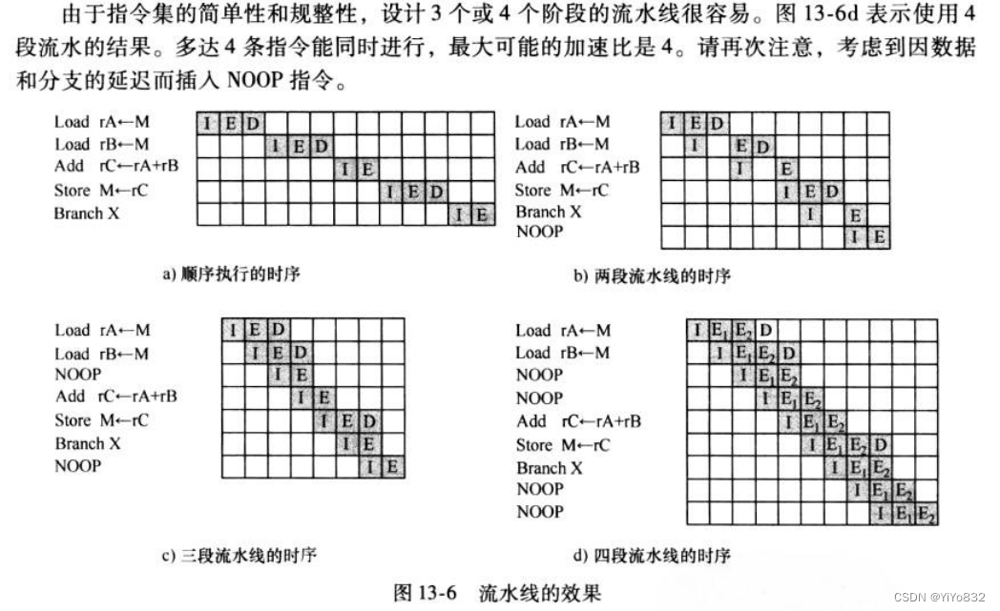

#### 流水线优化

- 延迟分支：加入NOOP- 循环展开：把增大循环步长，拓展循环语句内的操作## 第十四章-指令级并行性和超标量处理器

### 概述

超标量(superscalar)：在不同流水线中独立执行指令的能力，允许指令以不同于原程序的顺序的次序来执行。

#### 超标量与超级流水线对比

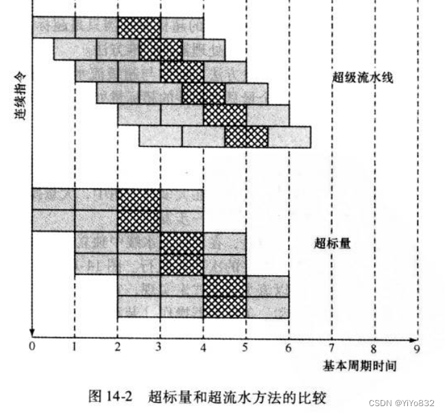

#### 限制

指令级并行性是指程序指令能并行执行的长度。

其包含5种限制(注意与流水线的限制区分)：

- 真实数据相关性：写后读- 过程相关性：分支指令，变长指令- 资源相关性：同一资源- 输出相关性：写后写- 反相关性：读后写### 设计策略

#### 指令发射策略

- 按序发射按序完成- 按序发射乱序完成- 乱序发射乱序完成：将译码阶段和执行阶段解耦，引入发射窗口#### 寄存器重命名

使用带下标的寄存器，避免了反相关性和输出相关性。

#### 分支预测

前面讲过

#### 超标量执行

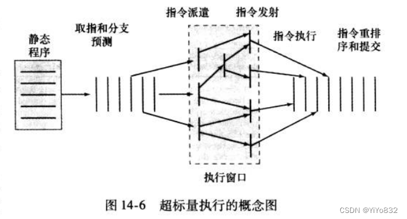

简单描述一下：

寄存器重命名---发射窗口+分支预测---执行---指令重排---提交

## 第十五章-控制器操作

### 微操作

微操作就是CPU的基本的或者原子的操作。

用一下之前的图片说明不同周期的微操作顺序。

要自己看懂缩写是什么，然后括号的含义也要搞明白。再搞明白地址，高位，低位的概念....

#### 取指周期

t1:(PC)->MAR

t2:内存->MBR

t3:(MBR)->IR

    (PC)+1->PC

#### 间接周期

t1:(IR(地址))->MAR

t2:内存->MBR

t3:(MBR(地址))->IR(地址)

#### 中断周期

t1:(PC)->MBR

t2:(MBR)->内存

t3:保存地址->MAR

    子程序地址->PC

#### 执行周期

考虑ADD R1,X

操作如下：

t1:(IR(地址))->MAR

t2:内存->MBR

t3:(MBR) + (R1) -> R1

ISZ X

操作如下：

t1:(IR(地址))->MAR

t2:内存->MBR

t3:(MBR) + 1 -> MBR

t4:(MBR) -> 内存

    IF (MBR)==0 (PC)+1->PC

其他的不再给出，只要了解各个寄存器和部件的应用即可。

#### 指令周期

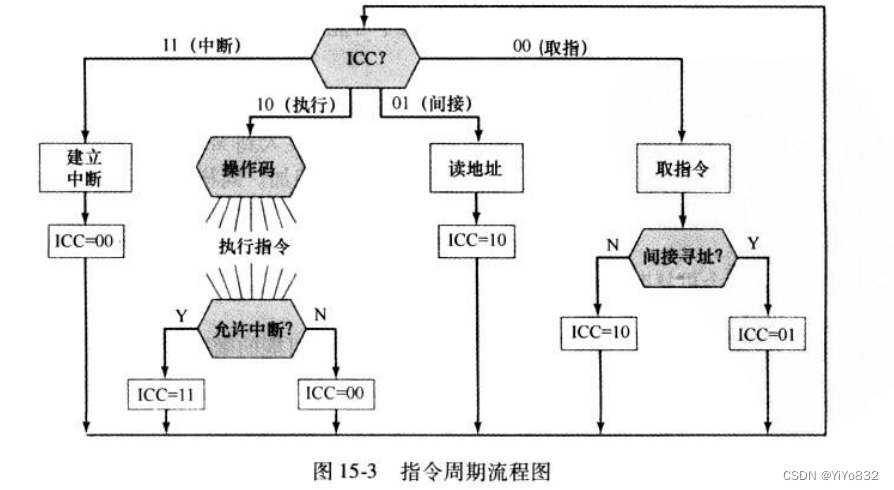

### 处理器控制

看懂这两副图和作业题即可。

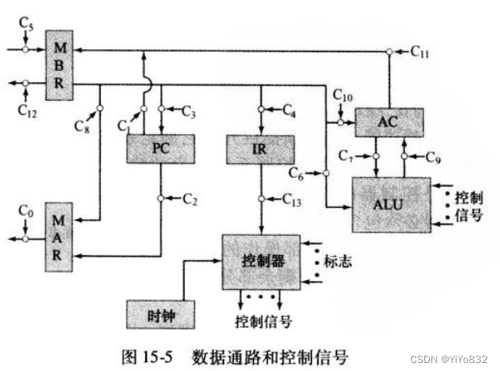

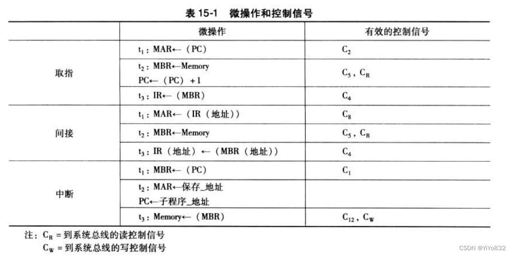

### 硬布线实现

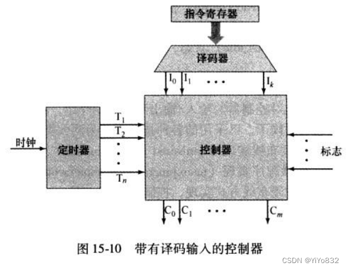

## 第十六章-微程序控制

### 微程序式控制的基本概念

微指令：每行描述一个时间内出现的一组微操作。

微程序/固件：微指令序列。介于硬件与软件之间的。

#### 微指令分类

- 水平微指令：宽度较宽，不需要译码，对于CPU内部控制线和系统总线控制线。并行度高。- 垂直微指令：宽度较窄，n个控制信号编码成logn位，需要译码才能发出。并行度低。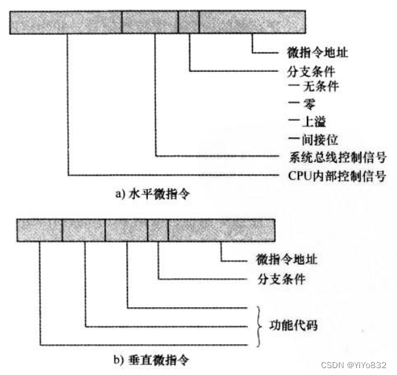

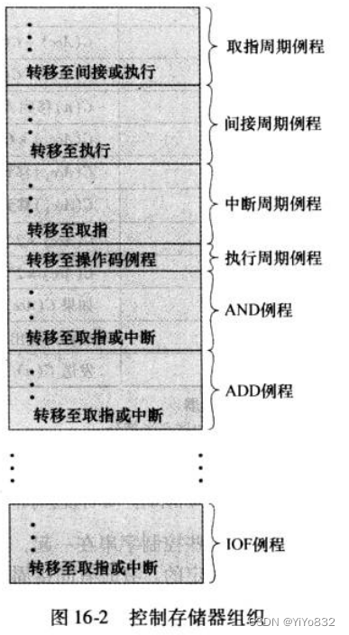

### 微程序式控制器的组成

这里是垂直微指令的设计！！

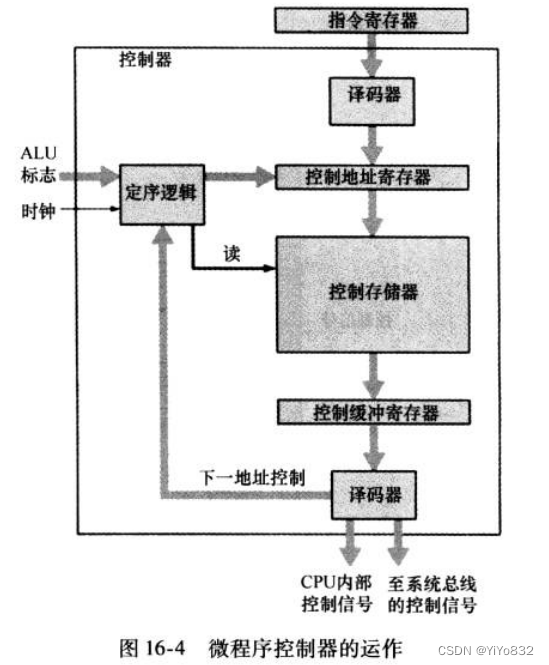

###  微指令排序

一般而言，接下来执行的地址有三种情况：

- 有指令寄存器确定- 下一顺序地址- 转移定序技术有双地址字段，单地址字段，可变格式。

双地址字段

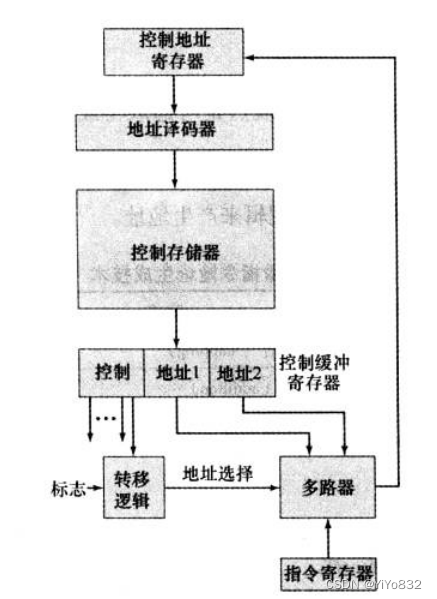

单地址字段：省了一个地址

一般而言，下一个地址的选择项为：

- 地址字段- 指令寄存器代码- 下一顺序地址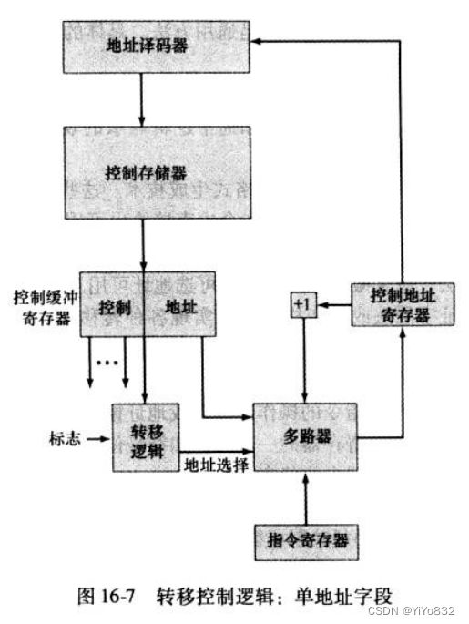

 可变格式

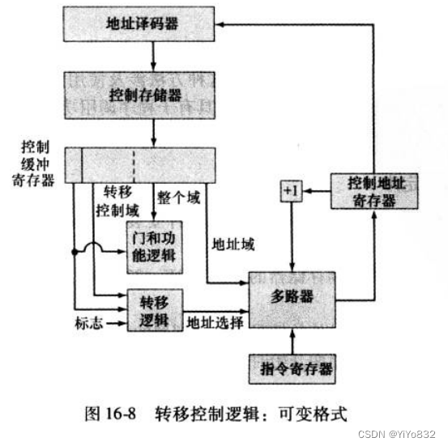

## 第十七章-并行处理

### 对称多处理机系统SMP

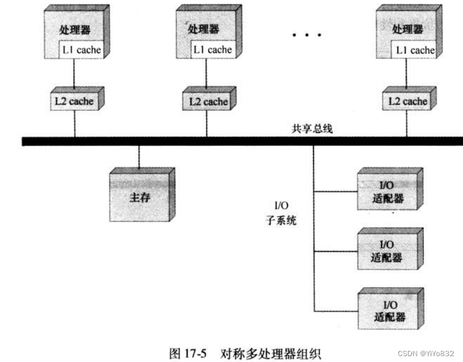

如下特征：

- 寻址：必须能区别总线上的各个模块，以确定数据的源和目标- 仲裁：任何I/O模块都能临时行使主控器功能。因此需要提供一种机制来对总线控制的竞争请求进行仲裁。- 分时复用：当一个模块正在控制总线时，其他模块都是被锁住的。而且如果需要的话，应该能挂起它的操作直到当前的总线访问被完成。 ### Cache一致性问题及解决方案

#### 软件解决方案

#### 硬件解决方案

- 目录协议- 监听协议### MESI协议

- M(modified)：修改态- E(exclusive)：专有态- S(shared)：共享态- I(invalid)：无效态### 集群系统

集群：一组完整的计算机相互连接，作为同一的计算资源一起工作。

四个好处：

- 绝对的可拓展性- 增量的可拓展性- 高可用性- 优异的价格/性能比配置

- 被动式备份- 主动式辅助- ...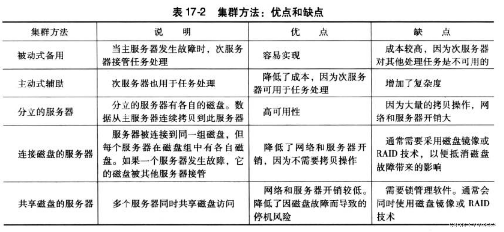

### 非均匀存储访问系统NUMA

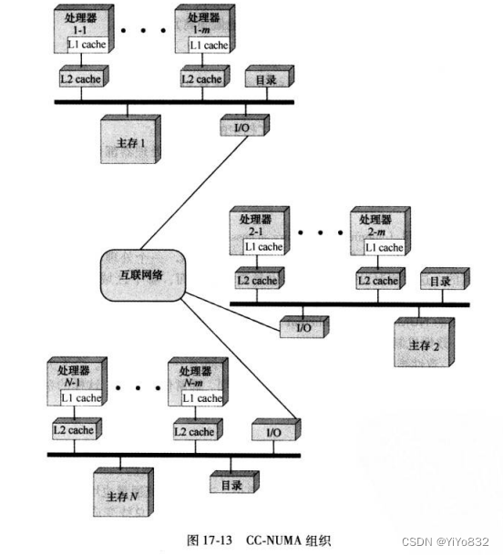

## 第十八章-多核计算机

###  硬件性能问题

#### 增加并行

- 流水线- 超标量- 并行多线程#### 功耗

### 软件性能问题

#### 多核软件

加速比，还是阿姆达尔定律。

#### 常见多核组织结构

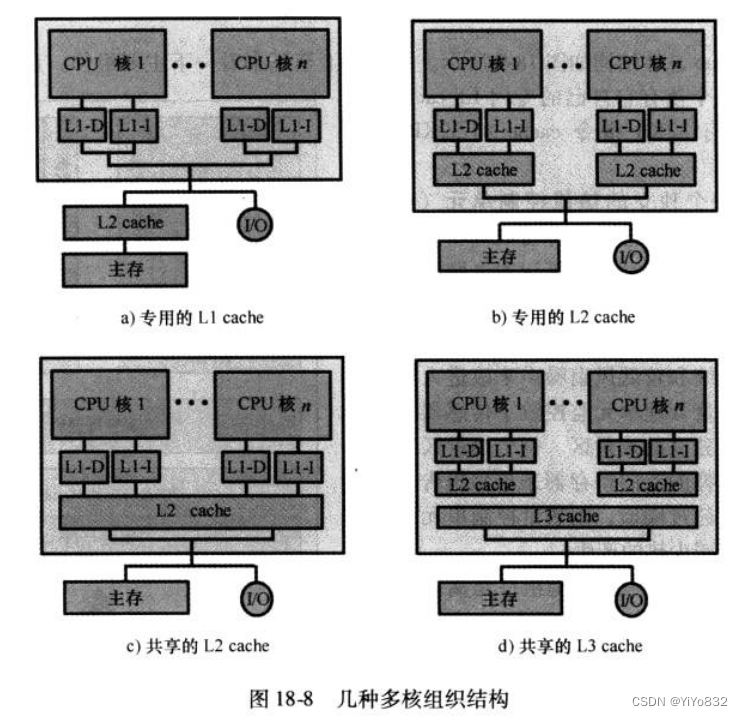
