# XJTUSE-OA-homework

### 前言
不是给答案，答案泉已经给了。

只是自己再刷一遍作业题，部分给答案，部分给思路，部分直接跳过，主要是记录重新做题的思路啥的。

### 第二章
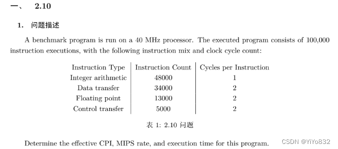

了解三个基本概念和其公式即可：

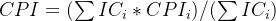

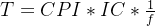 (f为时钟频率)

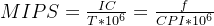

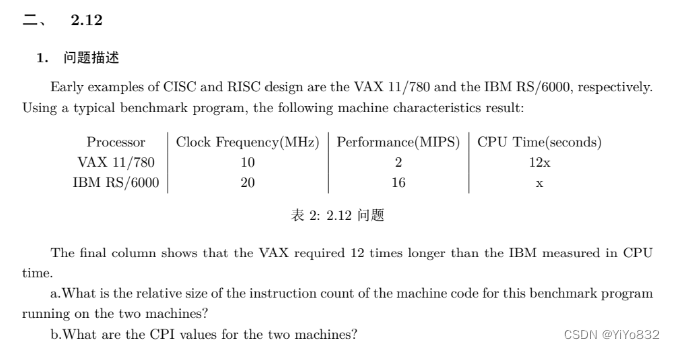

 muad，看不懂英文题目，难绷

a问

所以，IC的比值为：VAX:IBM = 2*12 : 16*1 = b问

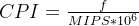

### 第三章
什么是总线？总线传输有何特点？

总线是两个及以上设备的通信通路，总线的特点为共享传输介质。

总线传输的特点是某一时刻只允许有一个部件向总线发送消息，而多个部件可以同时从总线上接受相同的信息。

什么是系统总线？它分为哪几类？各有什么作用？分别是单向的还是双向的？它们与机器字长、存

储字长及存储单元数有何关系？

系统总线：连接计算机的各个部分的总线。

分类：数据总线，地址总线，控制总线。

作用：

数据总线：提供系统模块间传输数据的路径。

地址总线：指定数据总线上的数据的来源和去向。

控制总线：控制对数据线和地址线的存取和使用。

方向：

数据总线：双向的

地址总线：单向

控制总线：单向

关系：

机器字长：一般与数据总线的宽度一致。

存储字长：与数据总线宽度有关。

存储单元数：如果把每个地址都是为存储单元，即2^(地址总线的宽度)为存储单元数。

常见的集中式总线控制有几种？各有何特点？哪种方式响应时间最快？哪种方式对电路故障最敏

感？

链式查询，计数器定时查询，独立请求。

响应时间最快：独立请求

故障敏感：链式查询

常见的总线通信方式有哪些？各有什么特点？

同步通信，异步通信，半同步通信，分离式通信

某同步总线的时钟频率为100MHz，地址/数据线复用，宽度为32位，每传输一个地址或者数据占用一个时钟周期。若该总线支持猝发(块)传输方式，块大小为16B，则一次“主存写”总线事务传输128位数据所需时间至少为多少？

猝发传输方式：在一个总线周期内传输存储地址连续的多个数据字，也就是说一次传输一个地址和一批地址连续的数据。

传送地址10ns，传送128位数据40ns，共需 50ns。

传输地址要一个周期，传输数据为128/32=4个周期

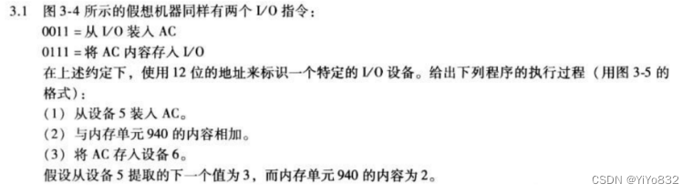

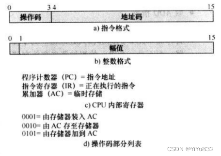

和书上的例子差不多，难度大了一些

本书中使用 6 步来描述图 3-5 的程序执行，请解释这些步骤以说明 MAR 和 MBR 的作用。

主要是十二章CPU的知识点。微操作。

考虑一个具有图 3-19 的存储器读时序的微处理器。进行一些分析后，设计者确认存储器提供的读

数据大约落后了 180ns。

(a)若总线时钟频率为 8MHz，要进行恰当的系统操作，需要插入多少等待状态(时钟周期)？

(b)为了实施等待状态，使用了 Ready(就绪)状态线。一旦处理器发出一个 Read 命令，它必须等待直到 Ready 线有效后才能试图读数据。要强迫处理器插入所要求的等待状态数，Ready 线必须在什么时间间隔内保持为低(无效)？

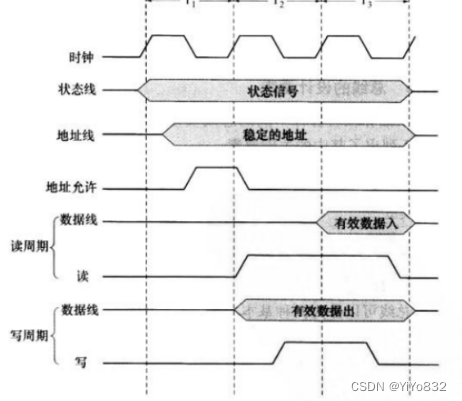

a. 频率位 8MHz，则时钟周期为 125ns。由于落后了 180ns，等待状态必须为整数倍，因此需要等

待 2 个时钟周期。

b. 可以看到即使在 T2 周期内，读(read)信号有效，数据线没有读入数据，这是因为没有时间上

升沿。而我们需要 2 个等待状态数。因此只需要保证在 T3 时间间隔内，Ready 线必须保持为低(无效)即可达到要求。

### 第四章
一个组相联 cache 由 64 个行组成，每组 4 行。主存储器包含 4K 个块，每块 128 字，请表示主存地址的格式。

tagsetword8位4位 7位

一个二路组相联 cache 具有 8KB 容量，每行 16 字节。64MB 的主存是字节可寻址的。请给出主

存地址格式。

tagsetword14位8位 4位

For the address sequence: 1 2 3 4 1 2 3 4 1 2 3 4, draw and compute the hit ratio of 3-line cache using FIFO & LRU; which methods can be used to improve the hit ratio?

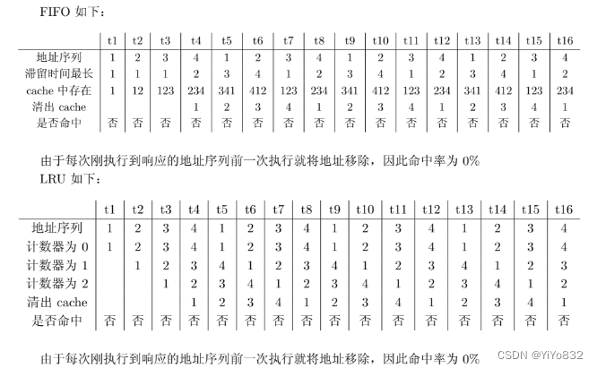

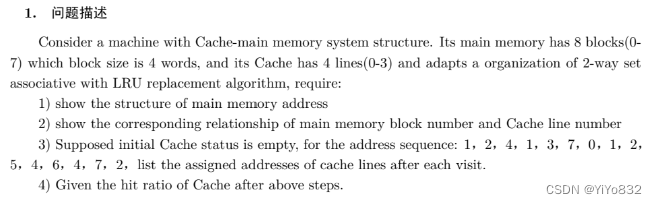

tagsetword2位1位 2位

其他的都挺简单的....

### 第五章
Compare SRAM to DRAM

静态随机存取存储器 vs 动态随机存取存储器

Which advanced techniques can be used to improve accessing main memory？

使用cache

有一个具有 22 位地址和 32 位字长的存储器模块。问：

1)该存储器的存储容量为多少字节？

2)如果有若干 512K*16 的 SRAM 芯片，那么由这样的芯片组成该存储器需要几片？

3)画出由该芯片组成需要的存储器模块的连接示意图。

16片

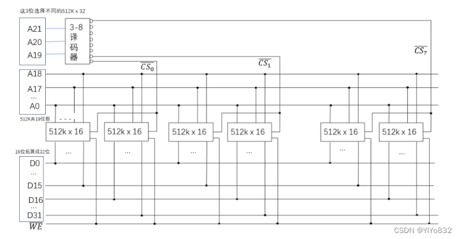

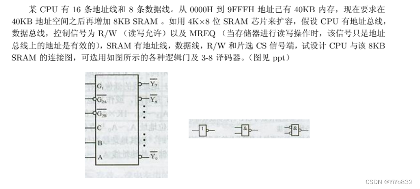

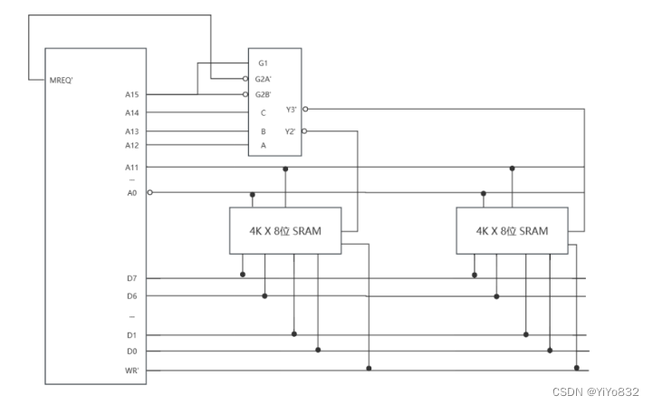

### 第六章
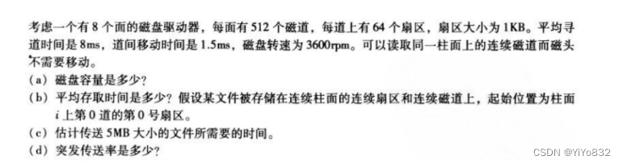

需要注意的几个点：

1.柱面，磁道的概念

2.每次到一个新的磁道，都需要重新计算旋转延迟

3.突发传送率为传输数据的速率，不用考虑数目平均存取，道间移动时间。

### 第七章

A DMA module is transferring characters to memory using cycle stealing, from a device transmitting at 9600 bps. The processor is fetching instructions at the rate of 1 million instructions per second (1 MIPS). By how much will the processor be slowed down due to the DMA activity? (默认字长为1B)

速度将被减慢的比率＝(以前速度－现在速度)/以前速度=[10^6-(10^6-9600/8)]/ 10^6

=0.12%

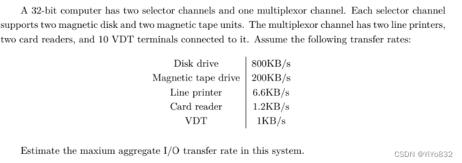

主要是学会分清楚选择通道和多路转换通道的传输速率计算。一个取最大值，一个取和值。

Assume some I/O device send information to CPU with the maximum frequency of 4000 times per second, while the executing time of the corresponding interrupt handler routine is 40μs. Can this I/O device adopt Interrupt driven mode to work? And why?

学会比较中断间隔的时间和中断程序的执行时间即可。

Assume that a disk uses 32-bit word as the data transmission unit with transferring rate of 1MB/s, and CPU clock cycles is 50MHz. Please answer the following questions:

-  In programmed mode, suppose that it takes 100 clock cycles to finish required operation. Please calculate the ratio of time that CPU uses for I/O inquiring (assume that there is enough inquiring operation to avoid data loss).- In Interrupt driven mode, the time consumption (including handling interrupt) for each transferring process is 80 clock cycles. Please calculate the ratio of time that CPU takes for data transferring of disk.- In DMA mode, assume that it takes 1000 clock cycles to start DMA, and 500 clock cycles to post-process when the DMA finished. If the length of the average transmission data is 4 KB, how much is the ratio of time that CPU use to finish I/O operation when disk working？Ignore the bus-request time of DMA.
搞懂编程式I/O，中断以字为单位处理

DMA以块为单位处理

### 第九章
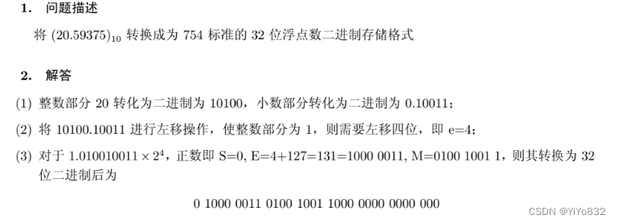

就记住32位是 1(符号) + 8(指数) + 23(数字)(要舍去小数点前的1)

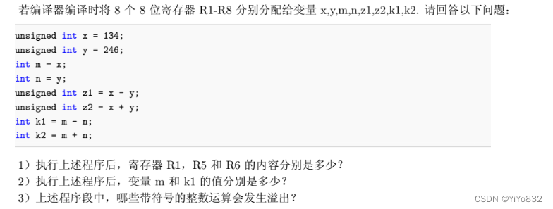

我不喜欢这道题目，出的不咋地，不指明编译器的具体如何编译及原理，答案怎么解释都是有道理的。

不给出答案。

### 第十二章

Both instructions and data are stored in the internal memory, then how CPU can distinguish them?

根据指令子周期来区分。

Suppose a pipeline with 5 stages: fetch instruction (FI), decode instruction (DI), execute (EX), memory assess (MA) and write back (WB).

1)Please draw the spatio-temporal diagram for a sequence of 12 instructions, in which there are no conflicts and no data dependencies.

2)Under this situation, what is throughput of this pipeline and the speedup of this pipeline?(Suppose the clock frequency is 100ns

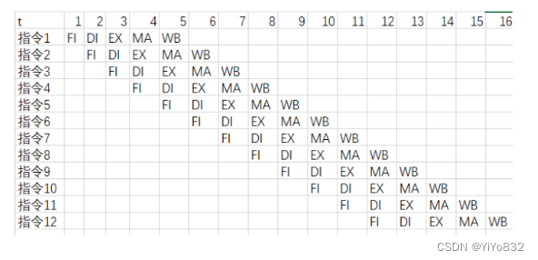

加速比：(12*5) / 16 = 3.75

吞吐量(每秒处理的指令数)： 12 / (16 * 100ns) = 0.75 * 10^7 个/s

A pipelined processor has a clock rate of 2.5GHz and executes a program with 1.5 million instrucions. The pipeline has five stages, and instructions are issued at a rate of one per clock cycle. Ignore penalties due to branch instructions and out-of-sequence executions.

a What is the speedup of this processor for this program compared to a nonpipelined processor, making the same assumptions used in Section 14.4?

b What is throughput of the pipelined processor?
 同上计算

### 第十四章
指令并行性主要受限于哪几个方面？

- 真实数据相关性- 反相关性- 输出相关性- 过程相关性- 资源冲突

下列指令序列，各存在什么相关性，在超标量中是如何解决这些相关性的？

I1: LOAD R1, X

I2: ADD R2, R1

I3: MUL R2, R4

I4: MOVE R4, R5

存在的相关性：

真实数据相关性：l1，l2先写后读

输出相关性：l2，l3写后写

反相关性：l3，l4先读后写

解决办法：

先用寄存器重命名解决输出相关性和反相关性，再用乱序发射解决真实数据相关性。

### 第十五章
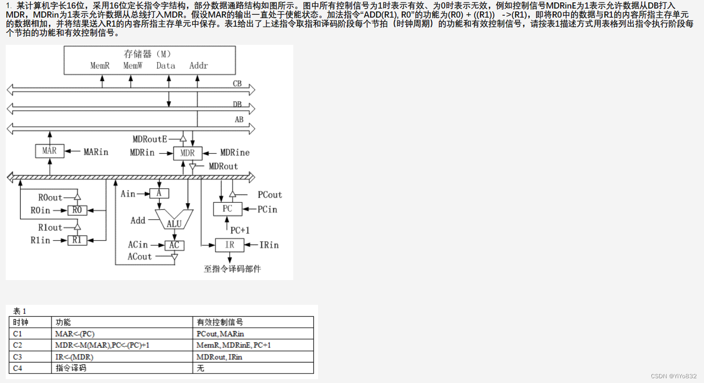

把思路简单一写，具体的步骤和控制信号需要结合题目。

 t1: (R1) ->MAR

 t2: R0 -> A

 t3: M(MAR) -> MDR

 t4: A + MDR -> AC

 t5: AC -> MDR

 t6: MDR -> M(MAR)

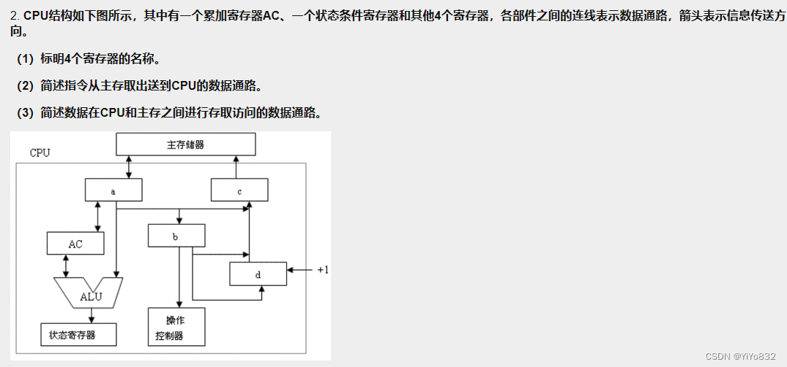

 (1)

 a:MBR

 b:IR

 c:MAR

 d:PC

 (2)

 PC -> MAR

 内存 -> MBR ->IR

 (3)

 读数据：

 IR -> MAR

 内存 -> MBR -> AC -> ALU

 写数据:

 IR -> MAR

 AC -> MBR ->内存
