# XJTUSE-计组大实验

## 引言

### 背景

随着科技的不断进步，智能家居技术逐渐成为人们生活中的重要组成部分。在传统门锁存在的问题和需求的推动下，智能门锁作为一种创新的解决方案受到了广泛关注。智能门锁不仅提供了更高级别的安全性，还赋予了用户更便捷和智能化的门禁控制体验。

### 项目介绍

本实验报告旨在设计和实现一个智能门锁系统，该系统具备密码设定和重置功能，并在密码输入完成后给予反馈信息。我们将探索智能门锁在提供安全和便利性方面的潜力，并评估其性能和功能的可行性。

具体可用功能如下：

	门锁设定密码：用户可以通过设定密码来保护门锁的安全性。通过按键输入。

	密码验证：门锁可以对用户输入的密码进行验证，以确保只有授权用户可以进入。

	输错密码锁定：系统可以追踪用户输入的错误密码次数，当错误次数达到一定阈值时，智能门锁会自动锁定，以防止暴力破解。

	密码重置：用户可以选择重置密码，以便更换旧密码或恢复遗忘的密码。这个功能可以通过特定的操作流程或者按键组合来实现。

	项目目标：

	提供高级别的安全性：智能门锁的主要目标是提供比传统门锁更高级别的安全性。通过使用密码验证和输错密码锁定功能，确保只有授权用户能够进入。

	提供便捷的门禁控制体验：智能门锁旨在提供便捷的门禁控制体验。用户可以通过设定和重置密码来管理门禁权限，而无需使用传统的钥匙。

	保护门锁免受暴力破解：通过输错密码锁定功能，智能门锁可以防止恶意攻击者通过暴力破解方式尝试多次密码，从而提高门锁的安全性。

	提供可定制的安全功能：智能门锁的设计允许用户根据自己的需求定制安全功能，如设定密码长度、锁定时间等，以满足不同环境和使用场景的要求。

	## Quartus

### 硬件设计原理图

首先是整体：

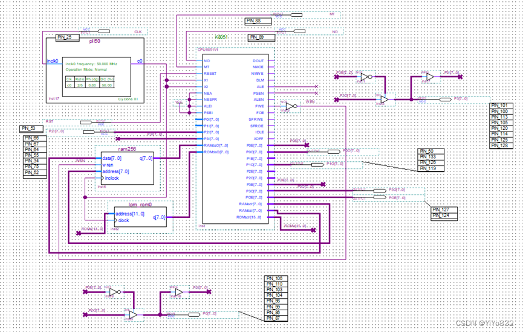

我们这里的电路首先大致上的思路是把显示器的电路和4*4键盘的电路所结合，它们各需要一个口进行数据的传输，因而确定了P0口用来进行显示器的相关数据的绑定，P3口用于进行4*4键盘的数据传输。

我们这里对P3和P1口进行处理，使得这两个I/O口成为双向口。

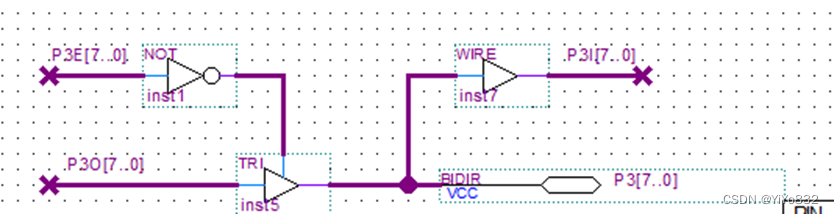

(如图为P3的处理，P1口的处理与其相同)

键盘帮助我们进行数据的输入，显示器用于相关信息的输出，为了实现多种功能，我们还需要其他的输出进行调控，这里我们使用了P2I，即P2口的输入。 P2的多位数值能够根据我们的需要随时修改为0或1。

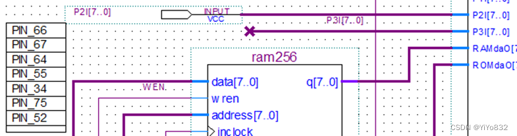

这样我们还剩下一个P1口没有使用，P1可以帮助我们完成lcd显示的相关工作，还可以帮助完成蜂鸣器的发声。

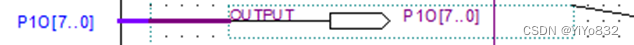

我们这里P1的输出其中的声音信号以及控制lcd显示的相关信号。

关于这些P0，P1，P2，P3口的具体使用将在程序中介绍。

### 模式

我们选取的标准是存在扬声器并且尽可能拥有多的按键

于是最终采用的是存在扬声器且键1到键8均能控制一位数据的模式5

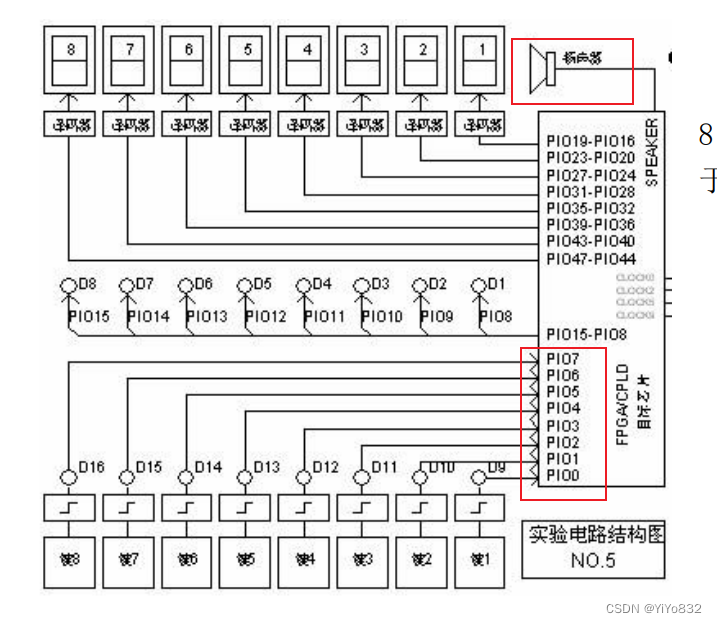

### 引脚说明

这里和我们功能密切相关的引脚有P1O[0..3]，P2I[0..7]，P0，P3

我们先说输入，

即P2I[0..6]，本来可以使用8位，不过我们最后只使用了7位，这7个引脚对应的是键7到键1，每次键的按下都会改变P2I中对应的值。

然后是其他的引脚，

P0，P3以及P1O[1..3]都对应的是电路板上的系统扩展端口，绑定引脚之后我们就能在程序中控制这些数据的改变，同时实现键盘、显示器和芯片之间的数据传输，从而在程序中获取4*4键盘按下的哪个按键，以及将我们想要显示的内容显示在显示器上。

最后还有一个P1O[0]这一个是我们实现蜂鸣器的关键，绑定的是DA24口，让我们得以输出声音信号，并且程序中不断改变其值能够实现播放不同的歌曲。

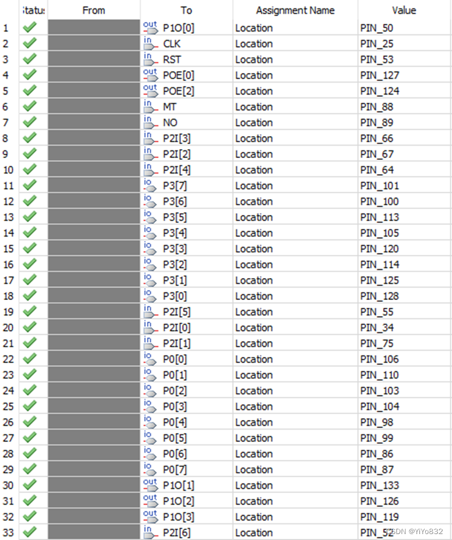

## 软件设计

### 流程图

下面给出我们智能门锁设计流程图：

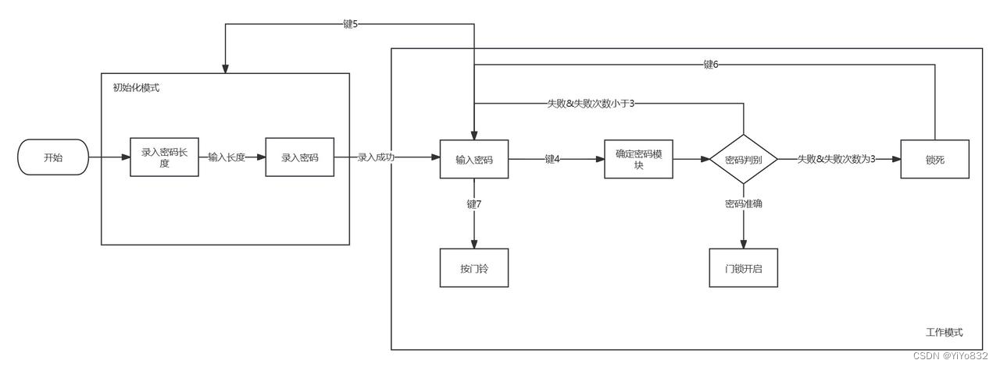

### 流程图描述

我们智能门锁一共分为两个部分，初始化模式和工作模式。两个模式可以相互转化，通过键5进行工作模式转化到初始化模式。

下面详细介绍两个模式：

初始化模式：

	该模式分为两个模块，录入密码长度和录入密码。

	首先，我们要求使用者录入密码长度(1-8位)，当按下确定键后转入录入密码模块。

	当使用者设置好密码后，按下确定键，转化至工作模式。

	工作模式：

	工作模式分为三个大块：输入密码，门铃模式，开锁模式。

	用户可以选择输入密码，然后按下确定开锁按钮，系统进行判断：1.当密码准确，开启门锁；2.当密码错误，但还有试错机会，回到输入密码模式；3.当试错机会使用完毕，门锁进入死锁模式，只有按下对应按钮解锁死锁模式。

	门铃模式则为按下按钮，蜂鸣器发出声音，即门铃功能。

	## C语言源代码

下面我们将详细讲述我们编写的C语言源代码。由于代码部分涵盖老师给的代码和一些标准引用，因此，在本环节我们只讲述实现项目的关键部分。

### 常量/变量部分

`// 下面为实现功能所需的变量，全局变量存在ROM中，节省RAM
uchar i; // 循环时的变量
uchar pivot = 0; // 循环时的变量
uchar keynum=16;        //两个全局变量
uchar now_pd[8]={0}; // 存放当前输入的密码
uchar pass_pd[8] = {0}; // 存放设置好的密码
uchar chances = 3;  // 代表试错机会一共有三次
uchar flag_verifypd = 1; // 在初始化密码时候，代表是否确认密码
uchar pd_len = 0; // 存储密码的长度
uchar flag_init = 2; // 一个辅助标记变量，用在初始化中

// 下面是将变量绑定各引脚
sbit SPK = P1^0;
sbit pd7 = P2^0;
sbit pd6 = P2^1;
sbit pd5 = P2^2;
sbit pd4 = P2^3;
sbit pd3 = P2^4;
sbit pd2 = P2^5;
sbit pd1 = P2^6;

uchar code song_tone[]=        // 存储音乐，下面三个同理
{
         190,212,142,212,0
};

uchar code song_tone2[]=
{
         212,212,190,0
};

uchar code song_long[]=
{
         12,12,12,12,0
};
uchar code song_long2[]=
{
         3,12,12,0
};`

可以看到，常量/变量部分都是根据各功能所定义出来的，具体的功能已经给出，不再赘述。

### 工具函数

`// 该方法转化uchar pd为str类型，可用于LED屏幕显示
uchar *transpd(uchar pd){
        switch(pd)
  {
    case 0: return "0";
        case 1: return "1";
        case 2: return "2";
        case 3: return "3";
        case 4: return "4";
        case 5: return "5";
        case 6: return "6";
        case 7: return "7";
        case 8: return "8";
        case 9: return "9";
        case 10: return "A";
        case 11: return "B";
        case 12: return "C";
        case 13: return "D";
        case 14: return "E";
        case 15: return "F";
        default: return "0";//
  }
}

// 该方法为将三个按钮pd1,pd2,pd3表示二进制转化为十进制。
uchar getNum(){
                if(pd1==0 && pd2==0 && pd3 ==0){
                        return 0;
                }
                else if(pd1==1 && pd2==0 && pd3 ==0){
                        return 1;
                }
                else if(pd1==0 && pd2==1 && pd3 ==0){
                        return 2;
                }
                else if(pd1==1 && pd2==1 && pd3 ==0){
                        return 3;
                }
                else if(pd1==0 && pd2==0 && pd3 ==1){
                        return 4;
                }
                else if(pd1==1 && pd2==0 && pd3 ==1){
                        return 5;
                }
                else if(pd1==0 && pd2==1 && pd3 ==1){
                        return 6;
                }
                else if(pd1==1 && pd2==1 && pd3 ==1){
                        return 7;
                }
        return 0;
}

// 检查now_pd即输入密码是否与pass_pd一致即设置密码
uchar check_pd(){
        for (pivot=0;pivot<pd_len;pivot++){
                if (now_pd[pivot]!=pass_pd[pivot]){
                        return 0;
                }
        }
        return 1;
}

// 初始化密码，全部设为0
void init_pd(){
        for (pivot=0;pivot<pd_len;pivot++){
                now_pd[pivot]=0;
                pass_pd[pivot] = 0;
                }
}

// 改变密码，将输入的密码存为设置好的密码
void change_pd(){
        for (pivot=0;pivot<pd_len;pivot++){
                pass_pd[pivot] = now_pd[pivot];
                }
}`

这些工具函数在后续的编写有用，实现功能都较为简单，而且实现方法也较为简单，不再赘述。

### 主函数

`void main(void){

        lcd_init();//初始化

        // 初始化模式
        while(1){//循环执行
                if (flag_init==2){ // 进入初态
                lcd_init();//初始化
                while (1){
                        display(1,0,"set u pd length(1-8)");
                        if (P3!=0xf0) key_scan();//判断按键是否按下，按下时扫描键盘获得按键序号
                        if (keynum!=16){
                                if (keynum<=8 && keynum>=0){
                                        pd_len = keynum; // 设置密码长度
                                        flag_init--; // 更新状态
                                        display(2,0,transpd(keynum)); // 在特定的LED屏幕位置进行展示，后面的类似，不再赘述
                                        break;
                                }
                        }
                }
                if(flag_init==1){
                        display(3,0,"set u pd:");
                        while(1){
                                        P3=0xf0;
                                        if (P3!=0xf0) key_scan();//判断按键是否按下，按下时扫描键盘获得按键序号
                                        if (keynum!=16)
                                        {
                                                if (getNum()<pd_len && getNum()>=0){ // 密码只能设置1-8位
                                                        now_pd[getNum()] = keynum; // 设置密码
                                                }
                                        }
                                        for(pivot=0;pivot<pd_len;pivot++){
                                                display(4,pivot,transpd(now_pd[pivot]));
                                        }
                                        if (pd6 == 1){ // 确定设置密码
                                                change_pd(); //改变密码
                                                flag_init --; // 更改状态
                                                break;
                                        }
                        }
                }
                lcd_init();//初始化
        }

        // 工作模式
        display(1,0,"please entry pd:");

        P3=0xf0;
        if (P3!=0xf0) key_scan();//判断按键是否按下，按下时扫描键盘获得按键序号
        if (keynum!=16)
        {
                if (getNum()<pd_len && getNum()>=0){
                        now_pd[getNum()] = keynum; // 获取当前输入密码
                }
        }
        // 循环展示密码
        for(pivot=0;pivot<pd_len;pivot++){
                display(2,pivot,transpd(now_pd[pivot]));
        }
        // 下面为验证密码
        if (pd4==1 && chances>0 && flag_verifypd==1){
                // 成功
                if (check_pd()==1){
                        display(3,0,"success!!         ");
                        display(4,0," ");
                        chances = 3;
                        playmusic(); // 播放音乐
                }
                // 失败
                else{
                        chances --;
                        flag_verifypd = 0;
                        display(3,0,"fail!! chance(s):");
                        display(4,0,transpd(chances));
                }
        }
        // 重置辅助修改密码的flag
        if (pd4 == 0){
                flag_verifypd = 1;
        }
        // 下面回到初始化模式
        if (pd5==1){
                init_pd();
                chances = 3;
                keynum = 16;
                flag_init = 2;
        }
        // 下面为重置修改次数，仍在工作模式
        if(pd6==1){
                chances = 3;
                  lcd_init();//初始化
        }
        // 按门铃功能
        if(pd7==1){
                playmusic2();
        }
        delay_ms(500);
}
}`

简单来讲，在主函数存在两个模式：初始化模式和工作模式。在不同模式中，不同按钮、按键存在不同含义，同时不同模式可以切换，不同模式存在不同的具体功能。

初始化模式功能：设置密码长度，设置密码。

工作模式：输入密码，按门铃，重置密码，回到初始化模式。

代码没有完全给出，这是因为有些代码是冗余以保障功能健硕，有些代码是老师提供的。全部代码可以参考压缩包中的.c文件。

## 调试总结&实验过程

下面给出我们实验的全过程：

首先切换到模式5，将程序导入rom中，我们就会进入我们程序的初始化界面

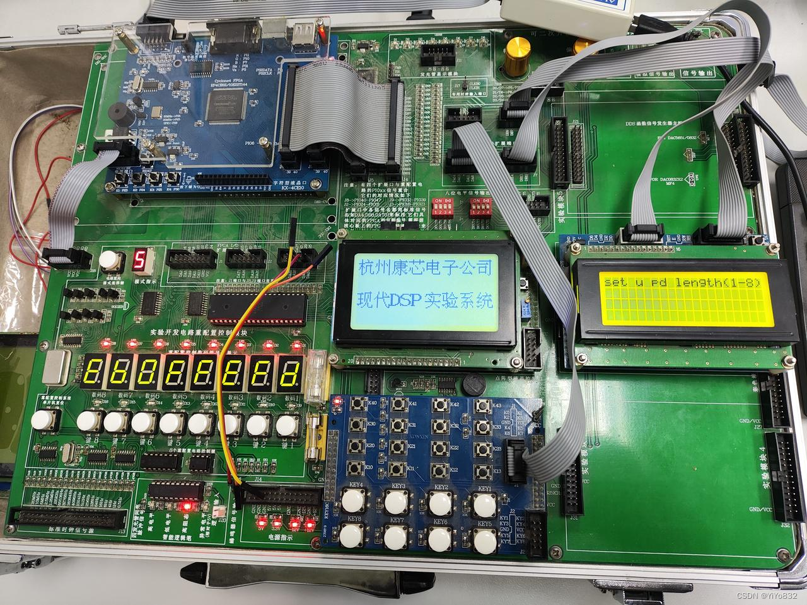

在这个界面下，根据提示，我们需要使用4*4键盘输入我们设定密码的位数，数值必须在1~8以内，如果输入在这之外的数字是无效的，不会进入下一步。

我们这里输入数字2

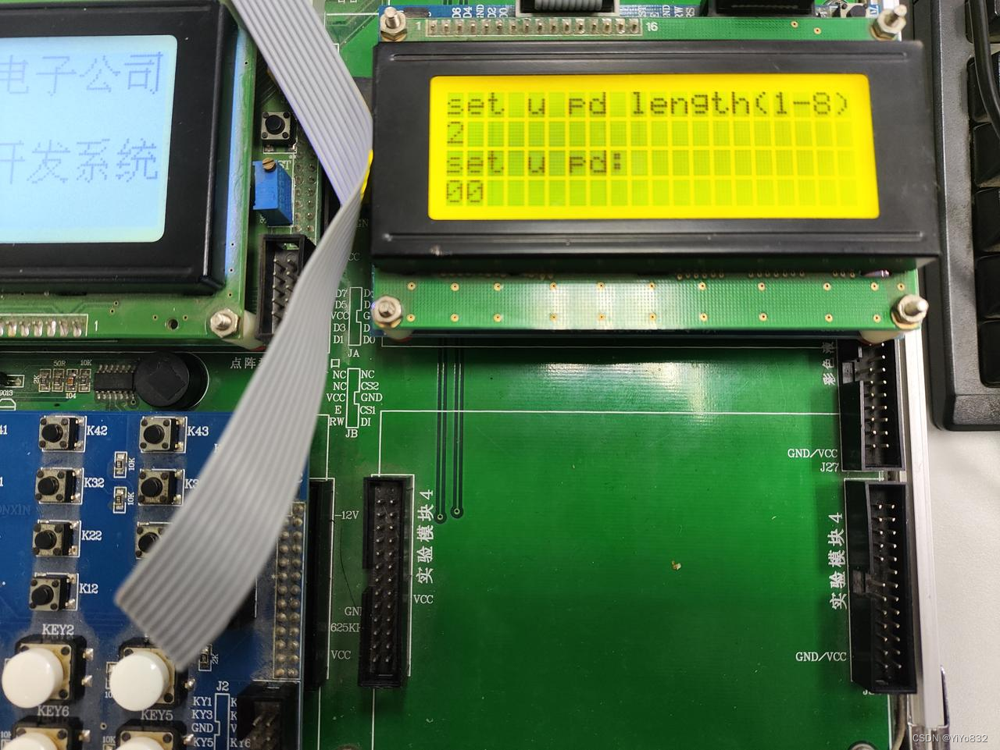

这时候就需要我们设定密码了，默认密码的每一位都是0，我们这里没有进行改动。

使用左侧键6提交我们的初始密码，我们就能够进入我们程序的主要界面，并且刷新。

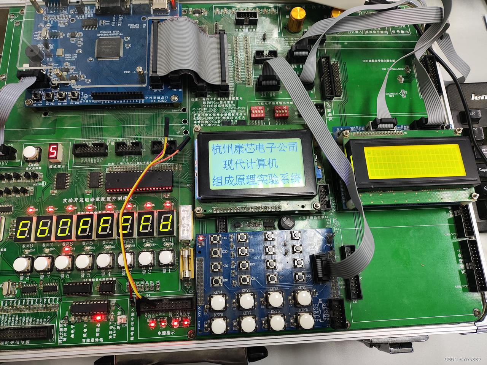

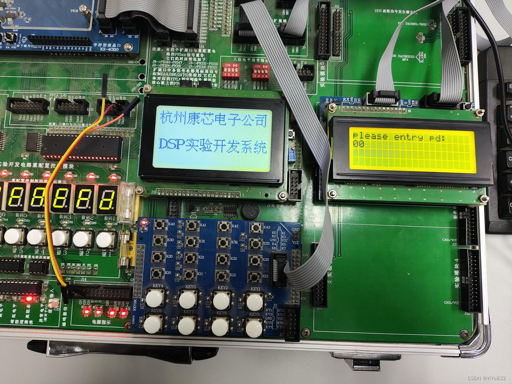

那么我们先尝试一下提交密码，看看是什么结果

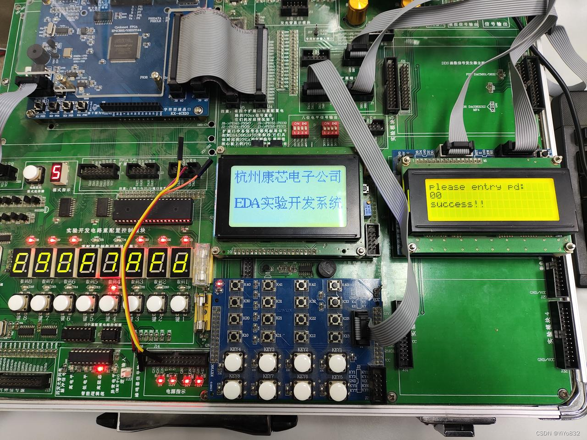

当然00是正确的密码，这里会提示文字信息，并且还会播放一段音乐。

我们也可以尝试其他密码，比如这里我们修改一下第0位为6

(注释：如何修改其他位的密码？

这里我们就要使用左侧的键1到键3，它们各自对应一个二进制的值，现在全是0，那么就是000，对应的是第0位。

如果我们要修改第1位的密码，那么只需要将键1点亮，使得二进制对应为001，这样就可以修改第1位的密码。

假设要修改第3位的密码，只要键3不亮，键2点亮，键1点亮，即011，对应3即可使用4*4键盘修改对应位。

当然我们这里只设置了2位，只需要调整键1就可以全部控制了。)

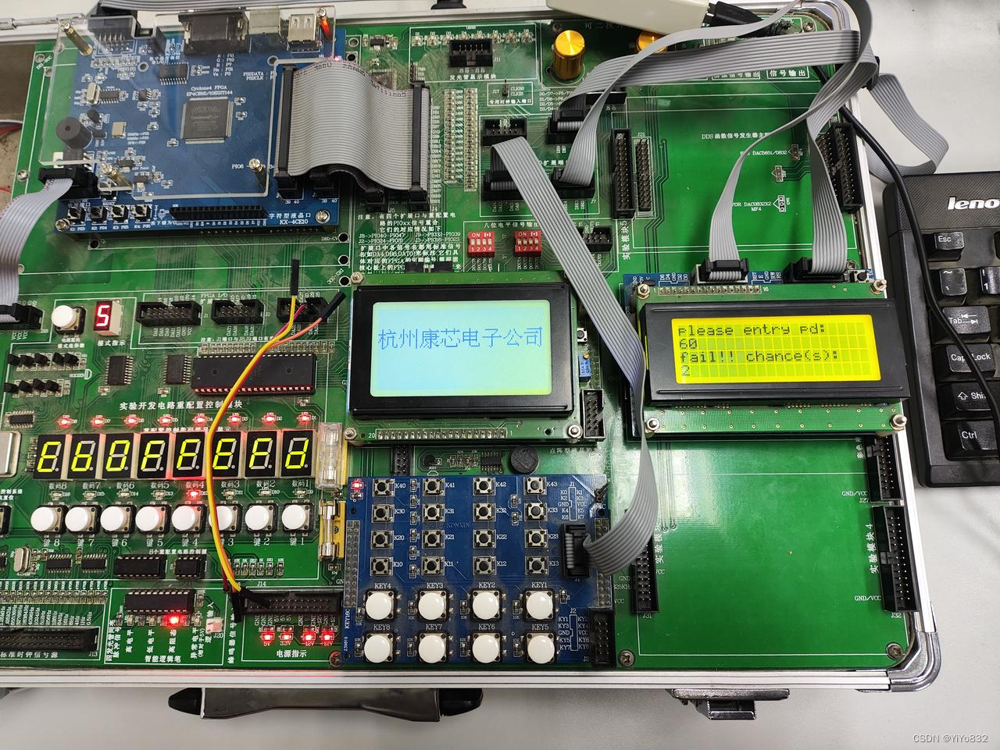

如果继续提交两次。

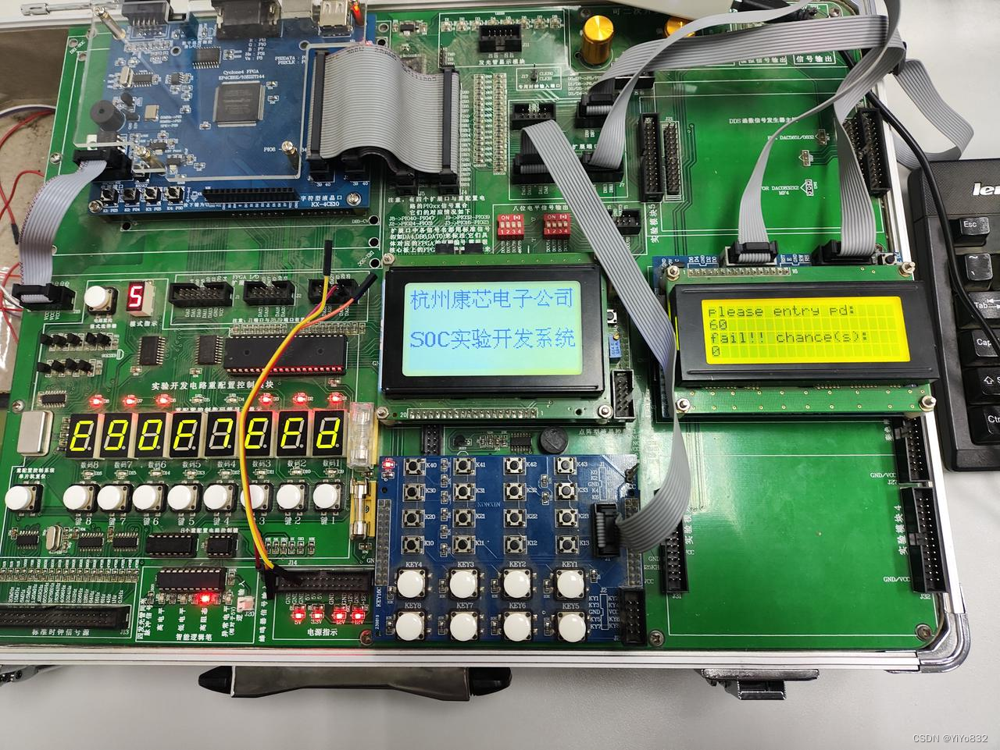

我们只有三次错误机会，如果全部错误就会锁定，无法继续提交了。

那么最后总结一下左侧按键的功能：

键1~键3：调整4*4键盘对应密码的位数，000对应第0位，111对应第7位。

键4：在主界面确定密码并提交。

键5：重新进入初始化界面。

键6：在初始化界面确认设置密码并提交，在主界面是刷新显示界面。

键7：控制蜂鸣器的发声。

## 实验困难及解决

### 模式的选择难题

一开始我们是想在老师给的4×4key的样例的模式2上进行智能门锁的实现。

如图所示扩展了两个输出口，利用到了P0，P1，P2

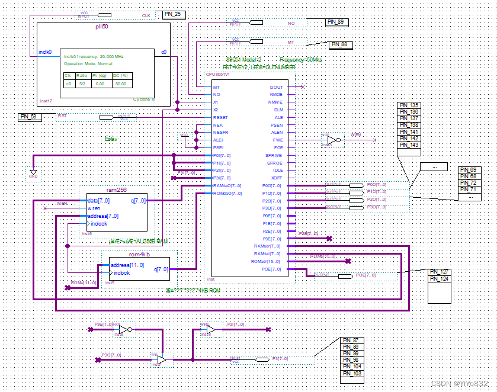

事实证明，我们完成地也不错，我们将图示的三个显示屏用来展示密码

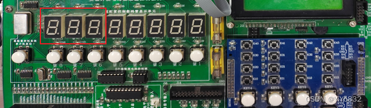

然后，用三个按钮控制密码输入输出和确定。

但是，我们接下来就遇到了巨大的问题：

每个显示屏需要7个引脚，这是难以忍受的：我们没有多余的引脚来实现其他功能了！！！

同时，我们注意到模式2没有蜂鸣器，这对于门铃来讲是巨大的挫折。

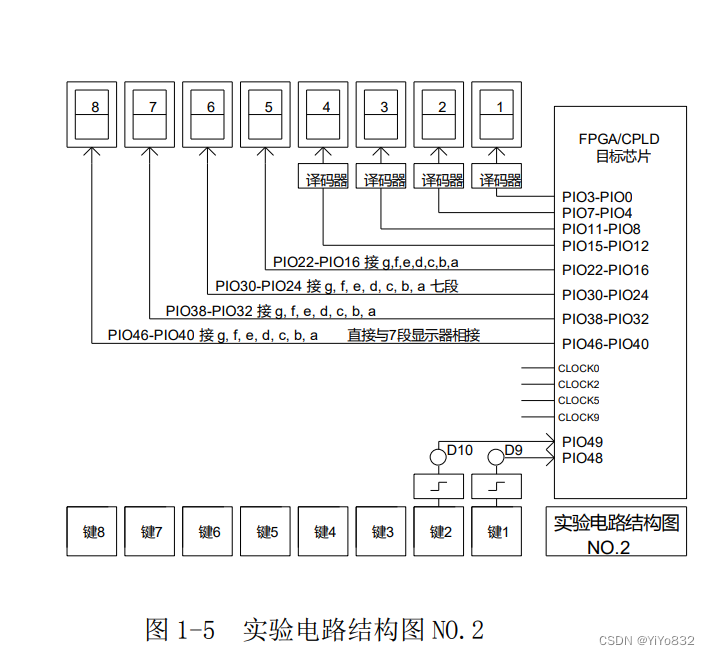

最后，我们舍弃了之前做过的工作，选择模式5，完成了较为完善的引脚配置和其他功能的结合。

### 引脚的配置难题

当我们从模式2转移到模式5，遇到的第一个问题就是硬件引脚的配置，尤其是4×4key键盘引脚的配置，不过好在通过耐心的查看老师样板引脚配置，最终理解了板子的引脚如何设置，我们完成了引脚的配置。

### ROM内存难题

一开始编写C程序，由于我们不敢修改老师的代码和想要实现非常多的功能，因此导致编译后的内存超过了4K。我们一开始没有理解为什么程序跑不起来，后来仔细对比了程序编译后的字节和ROM的内存，才发现内存超出了。对此，我们进行了如下操作：

	精简了功能实现的代码，尤其是对于一些变量的使用。

	删改了老师的参考代码，比如对于歌曲，我们再理解频率等相关知识后，自己修改出来了一个更为短暂的门铃。

	删除了部分非必要的功能。

	## 实验结论

实验结果表明，智能门锁成功实现了密码设定和验证的基本功能。密码验证过程稳定可靠，能够准确判断用户输入的密码是否正确，并根据设定的要求进行相应的锁定操作。密码重置功能也得到了有效实现，用户可以通过特定的操作流程轻松重置密码。

在实验过程中，智能门锁系统表现出较高的安全性和便利性。输错密码锁定功能有效地防止了暴力破解的尝试，提高了门锁的安全性。同时，用户可以通过简单的操作来设定密码和重置密码，无需使用传统的钥匙，提供了更便捷的门禁控制体验。

### 心得

本次实验完成了一个智能电子门锁，过程可以说是非常曲折了，不过好在我们成功完成了一个具有实际意义的小应用。这次应用主要的创新点应该是我们想法的创新，软件的编写以及硬件模式的融合。

	在硬件实现上虽然参照了老师给的样例，但我们也进行了模式融合的创新。

	相较于其他队伍，我们选题独树一帜，也算是创新点。

	软件即C语言编写，经过了许多版本迭代，最后在有限的内存中折中达成了设想的门锁功能。

	当然，也要勇于承认自己的不足：

	我们硬件调试依旧不是完美，有着部分缺陷，比如延迟过高，灵敏度不足；

	软件代码的编写还是存在部分冗余，占用内存。
