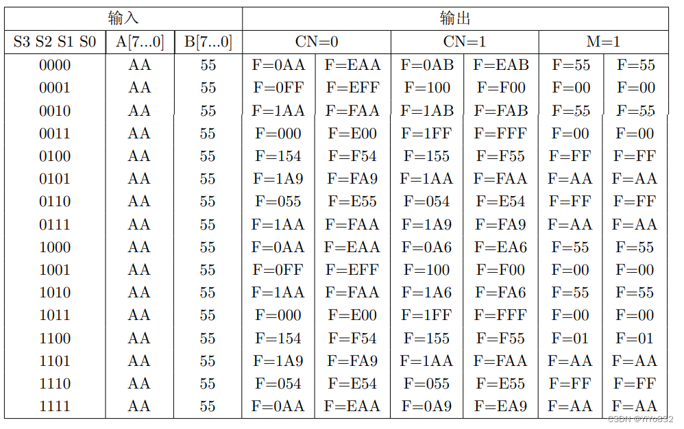
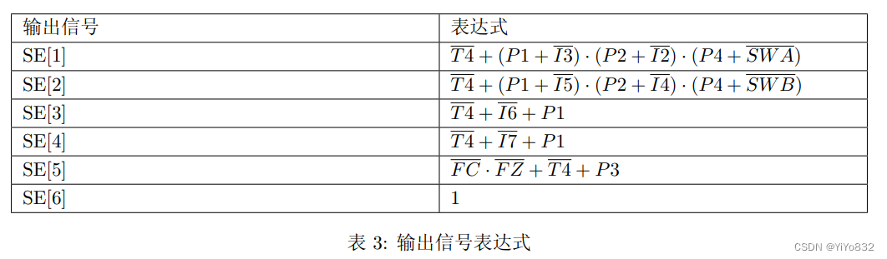

# XJTUSE-计组实验

## 前言

最近计组也快结束了，报告做的也差不多了。打算给个思考题分享交流

计组实验都没好好做，hhhh，都是借鉴前人的智慧呢。

实验原理，步骤啥的可以在教材PDF和PPT上找到。

## 思考题

节拍发生器实验

思考题1

单步运行与连续运行有何区别，它们各自的使用环境怎样？

(1) 单步运行：单步运行是一种逐条执行指令的方式。在单步运行模式下，每执行一条指令后，程序 会停下来等待用户输入下一步的指令。这样可以逐条地观察指令执行的结果和变化，并进行调试 和分析。单步运行特别适用于调试程序中的错误和异常情况，可以帮助开发人员逐步追踪问题。

(2) 连续运行：连续运行是指程序的执行没有中断，按顺序执行所有的指令直到程序结束或者遇到中 断信号。在连续运行模式下，计算机会自动执行指令，不会停下来等待用户输入。连续运行模式 适用于正常的程序执行，可以观察程序的整体执行流程和性能。

思考题2

在实验任务 3 时，如何进行单步和连续运行工作方式的切换？

在单步-连续节拍发生电路中，可以通过一个 2-1 多路选择器来实现单步和连续运行工作方式的切换。

引入一个控制信号，在实验 3 为 S 信号，该信号控制着电路的工作模式。例如，当信号处于低频 时，2-1 多路选择器选择 A，电路为单步运行方式；反之，当信号处于高频时，2-1 多路选择器选择 B， 电路为连续运行方式。

RAM、ROM 实验

思考题

如何建立 LPM_RAM_DQ 的数据初始化，如何导入和存储 LPM_RAM_DQ 参数文件？

数据从左边 D[I7..] 输入，从右边 Q(7.] 输出。在 lpm_ram_dq 中可以加入初始化文件 (如:5_ram.mif)。 首先控制读出初始化数据，与载入的初始化文件中的数据进行比较，然后控制写入一些数据，再读出比 较; 写入的数据也可以在读写窗口中观察 mif 文件的变化，导入的数据存储在 mif 文件中。

算术逻辑运算单元 ALU 设计实验

没有思考题，不过有解答题，答案如下：

 程序计数器 PC 与地址寄存器 AR 实验

思考题1

问题：执行分支/转移指令与执行普通指令时，对于实验中两种实现方式，地址单元的操作有何区别？

解答：一共有两种实现方式：

(1) 在一种实现方式中，当执行分支/转移指令时，处理器会将目标地址存储在 PC 中，然后通过地址 单元将 PC 中的地址发送到存储器，以从存储器中读取指令。这种方式下，地址单元的操作是将

PC 中的地址发送到存储器。

(2) 在另一种实现方式中，当执行分支/转移指令时，处理器会将目标地址存储在 AR 中，然后通过地 址单元将 AR 中的地址发送到存储器，以从存储器中读取指令。这种方式下，地址单元的操作是 将 AR 中的地址发送到存储器。

思考题2

问题：从存储器读取运算数据和取指令操作时，对于实验中两种实现方式，地址单元完成的操作有 何不同？

解答：两种实现方式的区别在于从存储器读取运算数据时，地址单元是将数据的地址还是 PC 中的地址 发送到存储器；而在取指令操作时，两种实现方式的地址单元操作是相同的，都是将 PC 中的地址发送 到存储器。

微程序控制器组成实验

思考题 1

题目：在微指令控制电路中，当 FC 或 FZ 有效时，对其输出 S[6..1] 有何影响？

解答：仅对 S[5] 有影响，其中当 FC、FZ 均为低电平时，S[5] 恒定输出高电平；否则 S[5] 的值 将取决于非 T4 或 P[3]。

思考题 2

题目：当 P[4..1] 取不同值时，对微指令控制电路中输出 S[6..1] 有何影响？

解答：其影响可以通过 S 的逻辑表达式来判断：其中对 S[6] 无影响。

思考题 3

题目：当控制信号 SWA,SWB 取不同值时，对微指令控制电路中输出 S[6..1] 有何影响？

解答：其影响可以通过 S 的逻辑表达式来判断：其中 SWA,SWB 取不同值时，仅对 S1、S2 产 生了影响。
