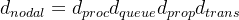
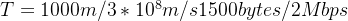
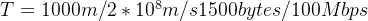

# XJTUSE-计网-第1章-homework

本篇仅为个人复习使用，切勿作业抄袭

1.Explain precisely following abbreviations:

TCP,HTTP,SMTP,DNS,FTP,ATM,ISDN,ADSL, HFC,ISP,LAN,WAN,MAN,WLAN,ISO,OSI

可百度orGPT

TCP:传输控制协议

HTTP：超文本传输协议

SMTP：简单邮件传输协议

DNS：域名系统

FTP：文件传输协议

ATM：异步传输模式

ISDN：综合业务数字网

ADSL：非对称数字用户线

HFC：混合光纤同轴电缆

ISP：互联网服务提供商

LAN：局域网

WAN：广域网

MAN：城域网

WLAN：无线局域网

ISO：国际标准化组织

OSI：开放系统互联

2.Explain following concepts:

TCP/IP

Circuit switching,Packet switching,Message switching,Virtual circuits

可百度orGPT

TCP/IP：传输控制协议/因特网协议

Circuit switching：电路交换，在分组交换网络中模拟电路交换的方法

Packet switching：分组交换，一种将数据分割成更小的数据包并逐个发送的传输方法

Message switching：报文交换，整个消息会在网络中的节点之间进行存储和转发。

Virtual circuits：虚拟电路，在分组交换网络中模拟电路交换的方法

3.List six access technologies.Classify each one as home access,enterprise access,or wide-area wireless access.

可百度orGPT

(1) 数字用户线 (DSL):home access

(2) 电缆入网 (Cable Modem):home access

(3) FTTH 光纤入户 (Fiber to the Home):home access or enterprise access

(4) 以太网 (Ethernet)：enterprise access

(5) WIFI:home access or enterprise access

(6) 3G/4G (第三/四代移动通信技术):wide-area wireless access

4.What are some of the physical media that Ethernet can run over?

GPT的答案

(1) 双绞线铜缆：这是最常见的以太网传输介质。它包括两种类型：无屏蔽双绞线(UTP)和屏蔽双 绞线(STP)。UTP 电缆广泛用于家庭和办公环境，而 STP 电缆提供了额外的屏蔽，以防止电磁 干扰。

(2) 同轴电缆：以太网可以通过同轴电缆进行传输，尽管这在现在较少见。同轴电缆由中央导体、绝 缘层、金属屏蔽层和外部保护层组成。它们在早期的以太网标准(如 10BASE2 和 10BASE5)中 广泛使用。

(3) 光纤电缆：以太网可以通过光纤电缆进行传输，光纤电缆使用光脉冲来传输数据。光纤电缆具 有高带宽、较长传输距离和抗电磁干扰的特点。它们通常用于高速以太网网络，如千兆以太网 (1000BASE-X)和 10 千兆以太网(10GBASE-X)。

(4) 无线介质：以太网也可以通过无线技术进行无线传输，如 Wi-Fi(IEEE 802.11 标准)。Wi-Fi 允 许设备无需物理电缆即可连接到以太网网络。

5.Suppose users share a 2 Mbps link. Also suppose each user transmits continuously at 1 Mbps when transmitting, but each user transmits only 20 percent of the time. (See the discussion of statistical multiplexing in Section 1.3.)

a. When circuit switching is used, how many users can be supported?

b. For the remainder of this problem, suppose packet switching is used. Why will there be essentially no queuing delay before the link if two or fewer users transmit at the same time? Why will there be a queuing delay if three users transmit at the same time?

c. Find the probability that a given user is transmitting.

d. Suppose now there are three users. Find the probability that at any given time, all three users are transmitting simultaneously. Find the fraction of time during which the queue grows.

a. 2Mbps / 1Mbps = 2users

b. 分组交换不会占用链路，但是会导致排队延迟，下面解答：

当users=3,到达速率 >= 3 * 1Mbps  > 链路的输出速率(2Mbps)，因此会出现排队延迟。

c.20%

d.三人同时传输的概率为0.2*0.2*0.2 = 0.008

队列增长时间的比例为0.8%

6.A user can directly connect to a server through either long-range wireless or a twisted-pair cable for transmitting a 1500-bytes file. The transmission rates of the wireless and wired media are 2 and 100 Mbps, respectively. Assume that the propagation speed in air is 3*108 m/s, while the speed in the twisted pair is 2*108 m/s. If the user is located 1 km away from the server, what is the nodal delay when using each of the two technologies?

核心公式如下：

a.无线传输：

不给结果了，注意byte与bit的换算

b.双绞线传输:

7.Consider a client and a server connected through one router. Assume the router can start transmitting an incoming packet after receiving its first h bytes instead of the whole packet. Suppose that the link rates are R byte/s and that the client transmits one packet with a size of L bytes to the server. What is the end-to-end delay? Assume the propagation, processing, and queuing delays are negligible. Generalize the previous result to a scenario where the client and the server are interconnected by N routers.

a. 先考虑一般情况，假设h=T，即学习的存储-转发模型，这时候n个路由器，一共有n+1段R的链路要走，如下图：

2个路由器，3段链路要走

时间为 ( n+1 ) * L/R

b. 现在假设h=0，即不管链路上多少个路由器都可以不用看，因为无需存储，即刻转发，可简化为0个路由器。

时间为 L/R

c. 现在考虑一般情况，而且只有一个路由器的情况：

因为接收前h个字节开始转发，准备时间为h/R

然后，L个字节转发还需要 L/R

一共 (L+h) /R

d. 现在考虑一般情况，而且链路上有n个路由

由前面的讨论可以知道，每个路由需要的准备时间为 h/R

然后，只要全部路由准备完毕，就可以视作开始转发(当然，这么描述只是为了方面理解)，转发时间为 L/R

总的时间为 (n*h+L) /R

8. Suppose two hosts, A and B, are separated by 20,000 kilometers and are connected by a direct link of R = 2 Mbps. Suppose the propagation speed over the link is 2.5 * 108 meters/sec

.a. Calculate the bandwidth-delay product, R * dprop.

b. Consider sending a file of 800,000 bits from Host A to Host B. Suppose the file is sent continuously as one large message. What is the maximum number of bits that will be in the link at any given time?

c. Provide an interpretation of the bandwidth-delay product.

d. What is the width (in meters) of a bit in the link? Is it longer than a football field? e. Derive a general expression for the width of a bit in terms of the propagation speed s, the transmission rate R, and the length of the link m.

a. R*dprop = 2Mbps * 20000km / 2.5*10^{8} = 0.16Mb

b. dtrans = 800000bits / 2Mbps = 0.4s > dprop ，因此存在时间段链路上全为bits在传播

下面公式可以好好理解一下

maxumum number = 800000 * (dprop / dtrans) =  R * dprop = 0.16Mb

c. 带宽-延迟积提供了链路上可以容纳的最大比特数的度量。它表示了在任何给定时间，链路上可以 存在的最大数据量

d. 比特宽度 = 链路长度 / 最大比特数 = 20000km/160000 = 125m，因此大于一般的足球场的宽度

e. 比特宽度 = 链路长度 / 最大比特数 = 链路长度 / (带宽-延迟积)=m/(R ∗ m s ) = 传播速度(s) / 传输速率(R)
