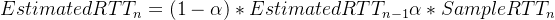
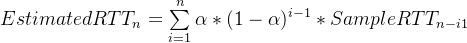

# XJTUSE-计网-第3章-homework

本篇仅为个人复习使用，切勿作业抄袭

1.Explain precisely following abbreviations:

UDP, FDM, ABR,EFCI,AIMD,MSS

UDP：用户数据报协议

FDM：频分多路复用

 ABR：可用比特率

EFCI：显示前向拥塞指示

AIMD：加法增加乘法减少

MSS：最大分段大小

2.Which services can TCP and UDP provide ?

TCP：

1.拥塞控制

2.流量控制

3.可靠传输

4.面向连接

UDP：

1.无连接

2.不可靠传输

3.低开销，报文头开销小

4.多播和广播

3.Write following TCP algorithms:

• Reliable sending

• Reliable receiving

• Flow control

• Congestion control

算法不唯一，因为实现方法不唯一，下面统一使用伪代码，理解思想即可！！

需要注意的式TCP算法和可靠数据传输原理的算法有着相似和不同！！

1)Reliable sending

`send_base = 0
next_seq = 0
loop{

    switch(case) # case 代表事件
    case:上层(应用层)需要传输数据
        创建段序号为next_seq的段
        if 计时器没启动:
            启动计时器
        将段发送给IP层
        next_seq = next_seq + data_len(数据长度)
    case:计时器超时
        重传最小序列的段
        重新计算计时器超时间隔
        重启计时器
    case:接收到ACK，字段值为y
        if y>send_base:  #接收成功
            send_base = y
            if 没有其他计时器启动:
                启动计时器
        else: # 没有接收成功
            y的计数器 + 1
            if y的计数器==3：
                快速重传y
                y的计时器重启

}`

2)Reliable receiving

`loop{
    switch(case)
    case:有序到达一个段，中间无间隙
        做一个延迟，等待下一个段到来，若来了，则一起确定；
        若没来，则发送ACK
    case：有序到达一个段，中间无间隙，有一个ACK在延迟
        不再延迟，立即发送ACK
    case：乱序到达，但比期待的段序号要高
        立即发送ACK，ACK为期待的段序号
    case：到达一个段，该段填满间隙
        if rcv_base指向的段:
            接收窗口右移
            将左边有序数据传给应用层
        else:
            返回一个ACK，ACK为期待的段序号
    case:不再接收窗口
        丢弃
}`

3)Flow control

`loop{
    RcvWindow = RcvBuffer - [LastBtyeRcvd - LastByteRead]
    switch(case)
        case:LastByteSent - LastByteAcked<=RcvWindow
            继续发送
            更新LastByteSent
        case:RcvWindow=0
            周期发送试探报文
        case：收到一个ACK
            更新 LastByteAcked
}`

4)Congestion control

首先是慢启动算法：

`慢启动(threshold,Congwin = 1):
    loop{
        if 每过1个RTT：
            Congwin *= 2
        if 收到一个ACK：
            Congwin += 1
        if 丢包 or Congwin >= threshold:
    }`

然后是拥塞避免算法：

`loop:
while (没有丢包):
    #  Congwin线性增长
    每w个段被确认:
        CongWin += 1
else:
    if 超时丢包:
        慢启动(Threshold = Congwin/2,Congwin=1)
    if 3个ACK:
        Threshold = Congwin/2
        Congwin=Threshold + 3 # +3是因为有3个ACK`

4.

How is a UDP socket fully identified? What about a TCP socket? What is the difference between the full identification of both sockets?

TCP:(源IP地址，源端口号，目标IP地址，目标端口号)

UDP：(目标IP地址，目标端口号)

5.

Why is it that voice and video traffic is often sent over TCP rather than UDP in today’s Internet? (Hint: The answer we are looking for has nothing to do with TCP’s congestion-control mechanism.

Answer： 因为当前大部分防火墙会拥塞 (堵塞)UCP 流量连接，只能选择 TCP 连接让流量通过防火墙。

6.R14. True or false?

a.Host A is sending Host B a large file over a TCP connection. Assume Host B has no data to send Host A. Host B will not sendacknowledgments to Host A because Host B cannot piggyback the acknowledgments on data.

错误，TCP的接收算法要求确认消息

b.The size of the TCP rwnd never changes throughout the duration of the connection.

错误，TCP有着流量控制和拥塞控制，会动态管理rwnd的大小。

c.Suppose Host A is sending Host B a large file over a TCP connection. The number of unacknowledged bytes that A sends cannot exceed the size of the receive buffer.

正确，只是TCP的流量控制算法保证的

d.Suppose Host A is sending a large file to Host B over a TCP connection. If the sequence number for a segment of this connection is m, then the sequence number for the subsequent segment will necessarily be m + 1.

错误，如果是乱序接收，可能接收的ACK是期待的段序列。

e.The TCP segment has a field in its header for rwnd.

正确，只是流量控制的算法要求。

f.Suppose that the last SampleRTT in a TCP connection is equal to 1 sec. The current value of TimeoutInterval for the connection will necessarily be >= 1 sec.

错误，使用加权平均往返时间(RTT)的估计值计算TimeoutInterval，即根据过往的RTT加权计算，而不是最近的一次RTT计算

g. Suppose Host A sends one segment with sequence number 38 and 4 bytes of data over a TCP connection to Host B. In this same segment the acknowledgment number is necessarily 42

错误，如果是乱序接收，可能接收的ACK是期待的段序列。

7.

Suppose Client A requests a web page from Server S through HTTP and its socket is associated with port 33000.

a. What are the source and destination ports for the segments sent from A to S?

b. What are the source and destination ports for the segments sent from S to A?

c. Can Client A contact to Server S using UDP as the transport protocol?

d. Can Client A request multiple resources in a single TCP connection?

a. source port : 33000;destination port : 80

b.source port : 80;destination port : 33000

c.不可以，HTTP不支持UDP协议，HTTP使用TCP协议

d.可以，如果服务器支持就可以。

8.

Assume that a host receives a UDP segment with 01011101 11110010 (we separated the values of each byte with a spacefor clarity) as the checksum. The host adds the 16-bit words over all necessary fields excluding the checksum and obtainsthe value 00110010 00001101. Is the segment considered correctly received or not? What does the receiver do?

解答：

01011101 11110010 + 00110010 00001101 = 10001111 11111111

不为全1，说明存在传输错误，接收方丢弃该UDP段

9.

Host A and B are directly connected with a 100 Mbps link. There is one TCP connection between the two hosts, and Host A is sending to Host B an enormous file over this connection. Host A can send its application data into its TCP socket at a rate as high as 120 Mbps but Host B can read out of its TCP receive buffer at a maximum rate of 50 Mbps. Describe the effect of TCP flow control.

由于TCP的流量控制和拥塞控制可得:

1.拥塞控制：链路的带宽为100Mbps  主机B的接收50Mbps速率，又由于是一个巨大的文件，因此当接收方的接收缓存区满的时候，TCP流量控制起作用，发送方停止发送，发送方发送试探报文，当接收方的接收缓存区有空时再传输文件。至此，最大传输速率为50Mbps。

10.

Consider the TCP procedure for estimating RTT. Suppose that ff = 0.1. Let SampleRTT1 be the most recent sample RTT, let SampleRTT2 be the next most recent sample RTT, and so on.

a. For a given TCP connection, suppose four acknowledgments have been returned with corresponding sample RTTs: SampleRTT4, SampleRTT3, SampleRTT2, and SampleRTT1. Express EstimatedRTT in terms of the four sample RTTs.

b. Generalize your formula for n sample RTTs.

c. For the formula in part (b) let n approach infinity. Comment on why this averaging procedure is called an exponential moving average.

该题就是PPT上的指数衰减的计算题目，不再计算，核心公式如下：

化简，得到下面公式：

本题目的下标表示和上面的公式存在出入，但核心思想一致！
