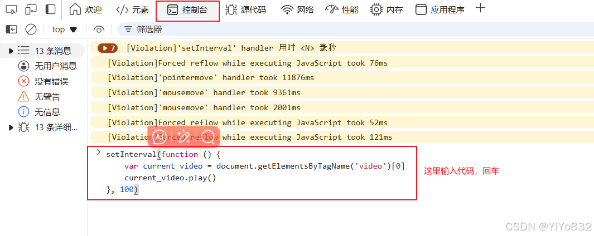
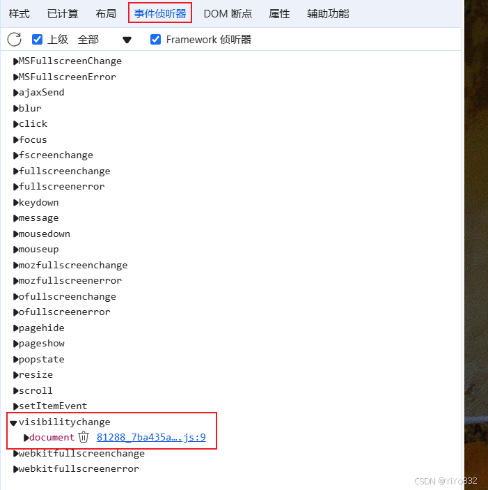
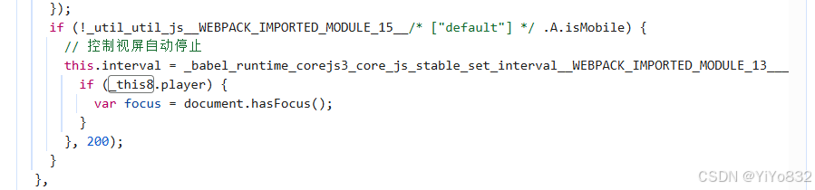
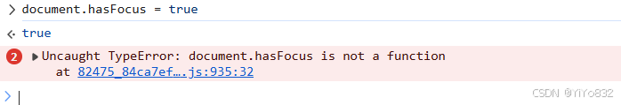

# 【XJTU-雨课堂-形式与政策-防暂停指南】

## 前言
开开心心刷XJTU的形势与政策的线上水课，结果切出页面或者换个网页就给我暂停了！明明之前都没有这个限制的，我只能说很过分。

虽然老老实实开二倍速，刷完视频也就不到一小时，但这无疑是在骑脸软件工程。于是对该网页的视频暂停机制进行了一下分析。

先给出网上的解决办法：

## 解决办法1(简单高效)
设置一个定时器，魔法打败魔法。

F12 -  在控制台(console)输入如下代码：

```
setInterval(function () {
    var current_video = document.getElementsByTagName('video')[0]
    current_video.play()
}, 100)
```


简单的JavaScript代码，我利用GPT快速入门了一下JavaScript，下面是GPT的解释：

 - `setInterval`：这是一个 JavaScript 中的函数，用于按照指定的时间间隔重复调用一个函数。它接受两个参数：
   第一个参数是一个函数，这里传入的是一个匿名函数 `function () {... }`。这个匿名函数内部定义了要重复执行的具体操作。- 第二个参数是时间间隔，以毫秒为单位。在这段代码中，时间间隔设置为 100 毫秒，意味着每隔 100 毫秒就会触发一次对匿名函数的调用。 - `function () {... }`：这是一个匿名函数，它内部的操作如下：
   `var current_video = document.getElementsByTagName('video')[0]`：这行代码使用 `document.getElementsByTagName` 方法来获取页面上所有的 `<video>` 元素，并从中取出第一个元素(索引为 0)，然后将其赋值给变量 `current_video`。也就是说，它试图找到页面上存在的第一个视频元素。- `current_video.play()`：在获取到第一个视频元素后，这行代码调用了该视频元素的 `play` 方法。`play` 方法的作用是让视频开始播放。所以这一步就是让之前获取到的那个视频元素开始播放视频内容。
 这段代码整体上是设置了一个定时器，每隔 100 毫秒就会去查找页面上的第一个视频元素，并尝试让它播放视频内容。

 总的来说，这段代码瑕疵比较多，不过很管用，实测基本播放视频无卡顿。

## 解决办法2(原理深究)
首先，先了解网上的第二个解决办法：

[解决视频防挂定时暂停或者做了切入后台等操作自动暂停的问题_网课防挂机怎么解除-CSDN博客](https://blog.csdn.net/m0_50375698/article/details/127701597)

 如果按照如上博客的方式即使删除了全部的事件监听器(Event Listenner)，切换页面视频依然会自动暂停。



 首先监听器的机制肯定绕不过去，开发人员肯定针对了删除监听器的方法进行了对应的防范措施，快速入门了浏览器如何debug JavaScript。debug的js文件如上图。

[如何在浏览器中调试JS代码，debug_调试js代码是在片段中还是在-CSDN博客](https://blog.csdn.net/qq_45839155/article/details/120493992)

最后，找到如下全部代码：

js文件名为 82475_84ca7ef900140716ad3a.js

 可能具体的文件名存在不同，不过可以通过debug锁定文件。

```
  mounted: function mounted() {
    var _context8,
      _this8 = this;
    this.flag = this.$route.meta.flag; //获取标记，是否为主站搬迁/京师慕华
    if (this.config.cc) {
      this.init();
    } else if (this.config.playurl) {
      console.log("<<<<config.playurl<<<<<", this.config.playurl);
      this.initArchievePlayer();
    } else {
      this.destroyVideo();
    }
    _babel_runtime_corejs3_core_js_stable_instance_for_each__WEBPACK_IMPORTED_MODULE_9___default()(_context8 = ['fullscreenchange', 'webkitfullscreenchange', 'mozfullscreenchange']).call(_context8, function (item, index) {
      window.addEventListener(item, function () {
        return _this8.fullscreenchange();
      });
    });
    if (!_util_util_js__WEBPACK_IMPORTED_MODULE_15__/* ["default"] */ .A.isMobile) {
      // 控制视屏自动停止
      this.interval = _babel_runtime_corejs3_core_js_stable_set_interval__WEBPACK_IMPORTED_MODULE_13___default()(function () {
        if (_this8.player) {
          var focus = document.hasFocus();
        }
      }, 200);
    }
  }
```
暂停视频的关键代码如下：

```
    if (!_util_util_js__WEBPACK_IMPORTED_MODULE_15__/* ["default"] */ .A.isMobile) {
      // 控制视屏自动停止
      this.interval = _babel_runtime_corejs3_core_js_stable_set_interval__WEBPACK_IMPORTED_MODULE_13___default()(function () {
        if (_this8.player) {
          var focus = document.hasFocus();
          if (!focus && _this8.is_open_anti_brushing) {
            _this8.player.video.pause();
          }
        }
      }, 2000);
    }
```
下面是GPT解释该代码：

 - `if (_this8.player)`：首先判断 `_this8.player` 是否存在。这里的 `_this8` 应该是在更外层的代码中定义的一个对象引用，`player` 可能是该对象的一个属性，用于指向视频播放相关的对象或者组件。如果 `_this8.player` 存在，说明有相关的视频播放对象可用，那么就继续执行后续的操作。- `var focus = document.hasFocus();`：这行代码调用了 `document.hasFocus()` 方法来获取当前页面是否有焦点。如果页面有焦点，`document.hasFocus()` 返回 `true`；如果页面失去焦点，返回 `false`。然后将这个结果赋值给变量 `focus`。- `if (!focus && _this8.is_open_anti_brushing)`：接着进行条件判断。如果 `focus` 的值为 `false`，即页面失去焦点，并且 `_this8.is_open_anti_brushing` 的值为 `true`(这里的 `is_open_anti_brushing` 是 `_this8` 对象的一个属性，用于表示是否开启了某种防刷机制或者满足特定的防刷条件)，那么就执行下面的操作。- `_this8.player.video.pause();`：在满足上述条件时，这行代码会调用 `_this8.player.video`(也就是通过 `_this8.player` 指向的视频播放对象的 `video` 属性所指向的视频元素)的 `pause` 方法，从而暂停视频的播放。

 综上所述，这段代码在非移动设备环境下，通过设置定时器每隔 2 秒检查页面焦点状态和防刷条件，来决定是否暂停视频播放，以实现一种在特定条件下控制视频播放状态的功能。

 至此，完成了原理探索，主要是通过 `_this8.is_open_anti_brushing 属性 ``对删除监听器的操作进行对抗，根据代码，可以给出如下的解决办法：`

### 删除相关代码


把对应的暂停操作代码删除即可。

### 针对代码操作
把响应的判断逻辑打碎即可，比如在console里面输入：

```
document.hasFocus = true
```


此次，从零开始，发现问题 - 探究原理 - 解决问题。对于前端的理解还是不深刻，不过还是找出来关键代码了。

然后，可以确认该网页是VUE搭建的框架。
