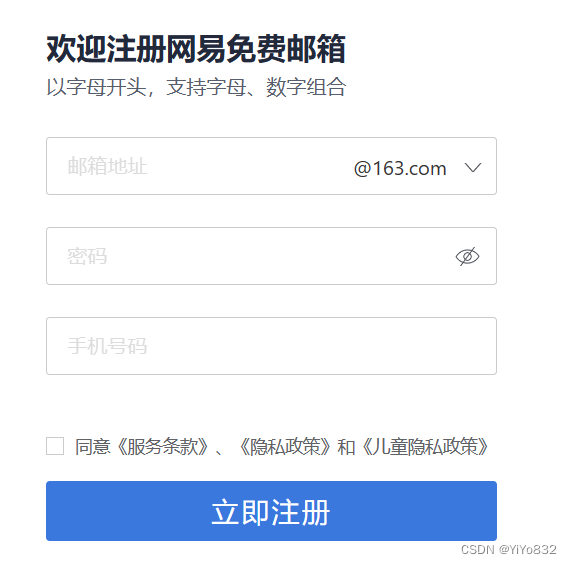
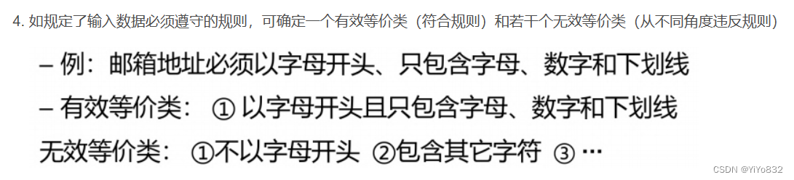

# XJTUSE-软件质量保证实操

## 前言
根据该博客的说法：

[软件质量保证基本知识加复习建议-CSDN博客](https://blog.csdn.net/qq_46311811/article/details/122518064)

 就是让做的那个JUnit5的实验，考的也比较简单，我们只考到了让编写对于一个东西的测试代码，如果实验自己写的完成这个也不是很困难，然后再就是给了一个网易邮箱的注册界面，让等价类分析，然后还有路径测试，和边界值测试

我自己考过试的人的说法，自己编一些题目，进行实操试试看

## 网易邮箱(等价类测试)
### 题目

 题目是自己编的

请根据以上界面，完成等价类分析，编写等价类测试用例。

### 分析
首先，将该界面的信息提取出来：

 一共有四个可选的输入：

 - 邮箱地址- 密码- 手机号码- 勾选同意《条款》
 而输出应该只有一个：

 - 注册成功与否

对于输出不需要进行等价类分析了；

对于输入进行分析：

#### 邮箱地址
注意到小字部分：以字母开头，支持字母、数字组合

所以说，邮箱地址的编写应该符合某种规范。

对于，需要符合某种规范的等价类规则如下：

因此，可以得到以下输入条件：

- 邮箱地址是否以字母开头- 邮箱地址是否仅包含字母和数字
根据每个输入条件，违背一个得到一个无效等价类，得到了如下等价类：

- 有效等价类：以字母开头，是字母和数字的组合。- 无效等价类：1、不以字母开头，但仅包含字母数字；2、以字母开头，包含其他字符。
#### 密码
密码在界面好像没有过多限制，不过可以想到一些常规的限制，即我们自定义。

自定义以下输入条件：

- 密码长度- 密码是否过于简单，比如只包含数字或者只包含字符。
得到以下等价类：

- 有效等价类：密码长度合规，且够复杂。- 无效等价类：1、密码长度合规但过于简单；2、密码长度超标
#### 手机号码
手机号码分析应该都会直接给了

输入条件：

- 手机号码长度- 手机号码是否存在
等价类：

- 有效等价类：存在的手机号- 无效等价类：1、不符合长度要求的手机号；2、符合长度要求但不存在的手机号。
#### 勾选
只有勾选和未勾选两个选项，不赘述。

 请注意，上述的分析存在不严谨之处，还带有主观色彩，主要是传达等价类测试的思想。

### 解答
注册邮箱的输入条件如下：

编号条件A1邮箱地址是否以字母开头A2邮箱地址是否只为字母数字组合A3密码长度A4密码是否过于简单A5手机号码长度A6手机号是否存在A7是否勾选《条款》
注册邮箱的等价类划分如下：

编号有效等价类无效等价类A1邮箱地址以字母开头(1)不以字母开头(2)A2仅为字母数字组合(3)包含了其他字符(4)A3815(6);密码长度15(11);手机号码长度0(3)

  a<0(9)

 b<0(10)

 c<0(11)

为有效类设计测试用例：

 测试数据

  期望结果

  覆盖范围

  a=10，b=10，c=10

  等边三角形

  等价类(1)(2)(3)

为每一个无效等价类设计至少一个测试用例：

 测试数据

  期望结果

  覆盖范围

  a=10，b=10

  输入无效

  等价类(4)

  a=10，b=10，c=10，d=10

  输入无效

  等价类(5)

  a=0，b=10，c=10

  输入无效

  等价类(6)

  a=10，b=0，c=10

  输入无效

  等价类(7)

  a=10，b=10，c=0

  输入无效

  等价类(8)

  a=-10，b=10，c=10

  输入无效

  等价类(9)

  a=10，b=-10，c=10

  输入无效

  等价类(10)

  a=10，b=10，c=-10

  输入无效

  等价类(11)

2.对于输出进行等价类测试：

输出条件的等价类：

 输出等价类

  条件

  输出结果

  1

  不满足条件(4)

  非三角形

  2

  满足条件(6)

  等边三角形

  3

  满足条件(5)，而且a=b!=c

  等腰三角形

  4

  满足条件(5)，而且a=c!=b

  等腰三角形

  5

  满足条件(5)，而且c=b!=a

  等腰三角形

  6

  满足条件(4)，而且三边不相等

  一般三角形

为每一个输出条件的等价类设计至少一个测试用例：

 测试数据

  期望结果

  覆盖范围

  a=10，b=10，c=100

  非三角形

  等价类(1)

  a=10，b=10，c=10

  等边三角形

  等价类(2)

  a=10，b=10，c=15

  等腰三角形

  等价类(3)

  a=10，b=15，c=10

  等腰三角形

  等价类(4)

  a=15，b=10，c=10

  等腰三角形

  等价类(5)

  a=6，b=8，c=10

  一般三角形

  等价类(6)

3.综合输入输出等价类，得到全部测试用例：

 测试数据

  期望结果

  覆盖范围

  a=10，b=10，c=100

  非三角形

  输出等价类(1)

  a=10，b=10，c=10

  等边三角形

  输出等价类(2)

  a=10，b=10，c=15

  等腰三角形

  输出等价类(3)

  a=10，b=15，c=10

  等腰三角形

  输出等价类(4)

  a=15，b=10，c=10

  等腰三角形

  输出等价类(5)

  a=6，b=8，c=10

  一般三角形

  输出等价类(6)

  a=10，b=10

  输入无效

  输入等价类(4)

  a=10，b=10，c=10，d=10

  输入无效

  输入等价类(5)

  a=0，b=10，c=10

  输入无效

  输入等价类(6)

  a=10，b=0，c=10

  输入无效

  输入等价类(7)

  a=10，b=10，c=0

  输入无效

  输入等价类(8)

  a=-10，b=10，c=10

  输入无效

  输入等价类(9)

  a=10，b=-10，c=10

  输入无效

  输入等价类(10)

  a=10，b=10，c=-10

  输入无效

  输入等价类(11)

##
