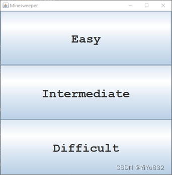
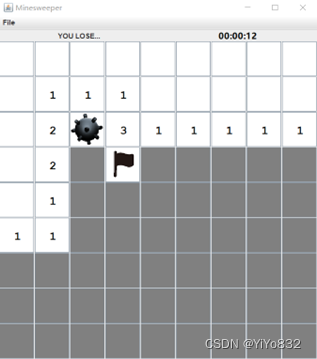
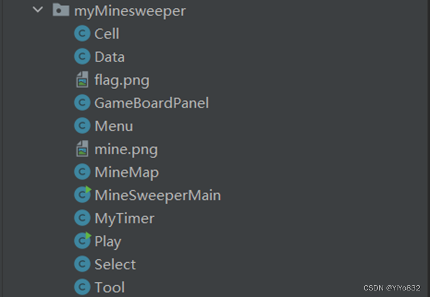

# XJTUSE--扫雷大作业

记录学习过程。

记录扫雷大作业的代码和思路。

## 1.界面设计

##

最终的游戏界面如下图所示：

图片1为开始界面(JFrame)，有三个按钮(JButton)，对应三种模式。模式的具体规则不再赘述，以简单难度为例，点击“Easy”按钮，弹出图片2的扫雷游戏(JFrame)。

图片2包含以下元素(自上而下)：

1.菜单栏(JMenuBar)，仅有“File”选项(JMeun)，点击“File”弹出三个选项(JMeunItem)。三个选项分别为“New Game”，”Reset Game”和”Exit”.

2.状态栏(JPanel)包含两个工具(JLabel)，分别用来统计剩余地雷数量和游戏时间。值得注意的是，当游戏结束第一个工具会出现“YOU LOSE…”和”YOU WIN!!”字样。

3.扫雷界面(JPanel)含有若干个地雷格子(JButton)。

总的来说，界面设计一共有十个类，其中Play的主程序为游戏启动，主要依赖另外三个类。其它类的依赖和继承关系如图所示，不再赘述。这样做法的好处是拆解了游戏模块，充分利用了面向对象性质，当想添加新工具功能时可以在Tool工具类增添一个新类即可，而当想添加新的菜单功能时可以在MyMenu菜单类增添一个新类即可。

## 2.功能设计

自动随机生成地雷

主要是在MineMap类修改函数，整体思想为随机数生成一个坐标，若无地雷，标记为地雷，若有则进行下次操作。这样的方法有一个不可避免地坏处，当地雷量较大，二维坐标较小时可能会多次无效操作，好在难度是自定义，避免了这样的效果。由于功能实现较为简单，不给出代码解释。详情可见附录。

进入新游戏前可以选择难度

       在界面设计图片1，图片3可以看到总的设计效果和关系图，不再赘述，功能核心是要创建三个可以生成不同难度地雷游戏的按钮，再将三个按钮的特性总结如下：只需要创建带有难度选择的生成地雷游戏的按钮类(Select)即可。

       Select类继承JButton有实例变量mode，为游戏难度。在Play类中使用匿名类作为监听器，核心代码如下：

`1.	public void actionPerformed(ActionEvent e) {
2.	    Select select = (Select) e.getSource();
3.	    new MineSweeperMain(select.getMode());
4.	}
`

这样子可以保证当点击不同难度的按钮会弹出不同难度的扫雷游戏窗口，完成了该要求。

创建菜单

       根据题目的提醒采用了JMenuBar、JMenu 和 JMenuItem 类类型，同时为了后期的可拓展性，并没有在运行类(MineSweeperMain类)中直接一个一个添加上去，而是创建了Menu类继承JMenuBar。

       该类没有什么实例方法和类方法，主要是按照题目要求将需要的菜单和菜单项加入，为了实现相对应的功能，创建了一个GameBoardPanel实例变量并且为每一个菜单项分配一个对应的匿名类作为监听器。代码和难度选择按钮相似，不再给出，感兴趣可以看附录MineSweeperMain类和Select类的代码。

实时剩余地雷个数的状态条

       题目提示可以使用 JTextField 充当，虽然可以设置不可更改，但是我找到了更好的库类JLabel，该库类简要来说是一种标签，不可更改，修改坐标文字等操作也较简单。本来想模仿菜单，创建一个MyLabel类继承JLabel，当右键标记时实时更改文字，但是这样子做，需要的监听器逻辑复杂和代码量比较大，因此没有采用如上的方法，直接在MineSweeperMain完成操作即可。

       核心思想为：在类中创建int类型变量remainNumMines和JLabel变量MyText。创建时，将这两个变量初始化。当检测到鼠标点击时，采取相应的操作。当游戏出现结果时(输了或者赢了)，出现相应的文字。

       下面给出鼠标点击右键时的操作，其它情况类似，可见附录。

`  if(e.getButton() == MouseEvent.BUTTON3){
    if (sourceCell.isFlagged){
        sourceCell.isFlagged = false;
        remainNumMines++;
        freshRemainMined();
    }
    else{
        sourceCell.isFlagged = true;
        remainNumMines--;
        freshRemainMined();
    }  `

注意，为了简洁地展示这部分功能，省略了部分其它核心代码。

其中freshRemainMined()方法如下：

`private void freshRemainMined(){
    myText.setText("remain mines："+hasRemainMines());
} `

由此，该功能完全实现。

计时器记录游戏时长

       可以知道计时器独立于地雷游戏存在计时，这在技术上为多线程，一条线程为处理游戏，一条线程为记录时间。找到一个库类为Timer，该类可以自主生成一条线程，并且每隔指定时间运行，该性质非常适合用来制作计时器。创建了MyTimer类，不过不是继承Timer类，而是依赖Timer类。核心代码如下：

`time = new Timer(1000,new ActionListener() {
    @Override
    public void actionPerformed(ActionEvent arg0) {
        long elapsed = System.currentTimeMillis() - programStart;
        timeLabel.setText(format(elapsed));
    }
});  `

可以看到每隔1秒，自动改变时间，其中progarmStart为生成该类的时间，format()为生成时间字符串函数。

     该类还有一个比较重要的实例方法，是当点击菜单的重新开始和重启时需要的方法。

如下：

`public static void restart(){
    programStart = System.currentTimeMillis();
    time.start();
}  `

## 3.代码实现

`package myMinesweeper;

import javax.swing.*;
import java.awt.*;
import static myMinesweeper.Data.*;

/**
 * 类Cell是对JButton的类定制(也就是JButton的一个子类，其目的是表示扫雷游戏的一个单元格；
 * 该类中定义了row/column属性以及相关状态函数。
 */
public class Cell extends JButton{
    // 为Cell单元格定义若干颜色和字体常量
    // 这些常量将随着Cell单元格的状态变化而被使用
    private static final long serialVersionUID = 1L;  // to prevent serial warning
    public static final Font FONT_NUMBERS = new Font("Monospaced", Font.BOLD, 20);

    // 定义Cell对象的属性，比如row和col值用来表示单元格在最终“棋盘”上的位置定位
    int row, col;
    public boolean isRevealed; // 标记是否已经被挖出？
    public boolean isMined;    // 标记是否是地雷？
    public boolean isFlagged;  // 标记是否被玩家插上了一个小红旗
    public boolean isCanClick;
    public Cell(int row, int col){
        this.row = row;
        this.col = col;
        super.setFont(FONT_NUMBERS);
    }

    public void newGame(boolean isMined){
        this.isRevealed = false;
        this.isFlagged = false;
        this.isMined = isMined;
        this.isCanClick = true;
        super.setEnabled(true);
        super.setText("");
        paint();
    }
    /** 基于单元格的状态进行绘制 */
    public void paint(){
        super.setForeground(isRevealed? FG_REVEALED: FG_NOT_REVEALED);
        super.setBackground(isRevealed? BG_REVEALED: BG_NOT_REVEALED);
    }
}
`

`package myMinesweeper;

import java.awt.*;

public class Data {
    /** 棋盘的参数
     * */
    // 记录不同模式的棋盘大小,地雷数目,布局尺寸
    // 简单模式
    public static final int EASY_ROWS = 9;
    public static final int EASY_COLS = 9;
    public static final int EASY_MINES = 10;
    public static final int EASY_SIZE = 60;

    // 中等模式
    public static final int MIDDLE_ROWS = 12;
    public static final int MIDDLE_COLS = 12;
    public static final int MIDDLE_MINES = 24;
    public static final int MIDDLE_SIZE = 60;

    // 困难模式
    public static final int DIFFICULT_ROWS = 12;
    public static final int DIFFICULT_COLS = 12;
    public static final int DIFFICULT_MINES = 36;
    public static final int DIFFICULT_SIZE = 60;

    /** 单元格的参数
    * */
    public static final Color BG_NOT_REVEALED = Color.GRAY;
    public static final Color FG_NOT_REVEALED = Color.WHITE;    // flag, mines
    public static final Color BG_REVEALED = Color.WHITE;
    public static final Color FG_REVEALED = Color.BLACK;     // number of mines

    /** 难度选择参数
     * */
    public static final int SELECT_WIDTH = 120;
    public static final int SELECT_HEIGHT = 40;
    public static final int Easy = 1;
    public static final int Intermediate = 2;
    public static final int Difficult = 3;

    /**
     * 界面的参数与组件
     * */
    public static final Select[] btnAll = {new Select(Easy,"Easy")
            ,new Select(Intermediate,"Intermediate")
            ,new Select(Difficult,"Difficult")};
    public static final Color SEL_FG_COLOR = Color.RED;
    public static final Color SEL_BG_COLOR = Color.CYAN;

}
`

`package myMinesweeper;

import javax.swing.*;
import java.awt.*;
import java.awt.event.MouseAdapter;
import java.awt.event.MouseEvent;
import java.io.Serial;
import java.util.Objects;

import static myMinesweeper.Data.*;

//这个类的作用就是充当“棋盘”
public class GameBoardPanel extends JPanel {
    @Serial
    private static final long serialVersionUID = 1L;
    public int ROWS;
    public int COLS;
    public int canvasWidth;
    public int canvasHeight;
    // 设定了“棋盘”中有多少个Cell对象
    private Cell[][] cells;
    public int numMines;
    private int remainNumMines;
    private JLabel myText;// 计算剩余地雷的
    private Timer myTime;// 控制计时器开始停止的
    public MineMap mineMap;

    public GameBoardPanel(){
        this(Easy);
    }
    public GameBoardPanel(int mode){
        switch (mode){
            case Easy -> {
                this.ROWS = EASY_ROWS;
                this.COLS = EASY_COLS;
                this.numMines = EASY_MINES;
                this.canvasWidth = this.ROWS * EASY_SIZE;
                this.canvasHeight = this.COLS * EASY_SIZE;
            }
            case Intermediate -> {
                this.ROWS = MIDDLE_ROWS;
                this.COLS = MIDDLE_COLS;
                this.numMines = MIDDLE_MINES;
                this.canvasWidth = this.ROWS * MIDDLE_SIZE;
                this.canvasHeight = this.COLS * MIDDLE_SIZE;
            }
            case Difficult -> {
                this.ROWS = DIFFICULT_ROWS;
                this.COLS = DIFFICULT_COLS;
                this.numMines = DIFFICULT_MINES;
                this.canvasWidth = this.ROWS * DIFFICULT_SIZE;
                this.canvasHeight = this.COLS * DIFFICULT_SIZE;
            }
        }
        remainNumMines = numMines;
        cells = new Cell[ROWS][COLS];
        super.setLayout(new GridLayout(ROWS, COLS, 1, 1));
        for(int row = 0; row < ROWS; ++row){
            for(int col = 0; col < COLS; ++col){
                cells[row][col] = new Cell(row, col);
                super.add(cells[row][col]);
            }
        }
        // [TODO 3] 为所有的Cell单元对象创建一个共享的鼠标事件监听器
        CellMouseListener listener = new CellMouseListener();
        // [TODO 4] 通过下面的循环，将每个Cell对象的鼠标事件监听器对象设为listener
        for(int row = 0; row < ROWS; ++row){
            for(int col = 0; col <COLS; ++col){
                cells[row][col].addMouseListener(listener);
            }
        }
        super.setPreferredSize(new Dimension(canvasWidth, canvasHeight));
    }

    // 初始化一个新的游戏
    public void newGame(){
        // 通过MineMap获得新游戏中的地雷数据的布局
        mineMap = new MineMap();
        mineMap.newMineMap(ROWS,COLS,numMines);
        // 根据mineMap中的数据初始化每个Cell单元对象,numMines)
        for(int row = 0; row < ROWS; ++row){
            for(int col = 0; col < COLS; ++col){
                cells[row][col].newGame(mineMap.isMined[row][col]);
                cells[row][col].setIcon(new ImageIcon());;
            }
        }
        freshRemainMined();
        MyTimer.restart();
    }
    public void resetGame(){
        for(int row = 0; row < ROWS; ++row){
            for(int col = 0; col < COLS; ++col){
                cells[row][col].newGame(mineMap.isMined[row][col]);
                cells[row][col].setIcon(new ImageIcon());;
            }
        }
        remainNumMines = numMines;
        freshRemainMined();
        MyTimer.restart();
    }

    // 获得[srcRow, srcCol]Cell单元对象周围的8个邻居的地雷总数
    private int getSurroundingMines(int srcRow, int srcCol){
        int numMines = 0;
        for(int row = srcRow-1; row <= srcRow+1; ++row){
            for(int col = srcCol-1; col <= srcCol+1; ++col){
                if(row >= 0 && row < ROWS && col >= 0 && col < COLS)
                    if(cells[row][col].isMined) numMines++;
            }
        }
        return numMines;
    }

    // 对[srcRow, srcCol]Cell单元对象执行挖雷操作
    // 如果该单元格对象中的标记的雷的数量为0，那么就自动递归对其周围8个邻居执行挖雷操作
    private void revealCell(int srcRow, int srcCol){
        int numMines = getSurroundingMines(srcRow, srcCol);
        if (numMines!=0) cells[srcRow][srcCol].setText(numMines + "");
        cells[srcRow][srcCol].isRevealed = true;
        cells[srcRow][srcCol].paint();
        if(numMines == 0){
            for(int row = srcRow-1; row <= srcRow+1; ++row){
                for(int col = srcCol-1; col <= srcCol+1; ++col){
                    if(row >= 0 && row < ROWS && col >= 0 && col < COLS)
                        if(!cells[row][col].isRevealed&&!cells[row][col].isFlagged) revealCell(row, col);
                }
            }
        }
    }
    // 用来判断玩家是否已经赢得此次游戏
    public boolean hasWon(){
        // 如果将所有单元格都成功执行了挖雷操作或者所有的地雷都被标记
        int count = 0; // 统计未被点击的格子
        int flag = 0; // 统计插旗的格子
        for (int i=0;i<ROWS;i++){
            for (int j=0;j<COLS;j++){
                if (!cells[i][j].isRevealed) count++;
                if (cells[i][j].isFlagged&&cells[i][j].isMined) flag++;
            }
        }
        if (count==numMines) return true;
        else if (flag==numMines) return true;
        return false;
    }
    // 返回剩余地雷个数
    public int hasRemainMines(){
        return remainNumMines;
    }
    private void freshRemainMined(){
        myText.setText("remain mines："+hasRemainMines());
    }

    // 设置各种变量
    public void setRemainMines(JLabel myText){
        this.myText = myText;
    }
    public void setMyTime(Timer myTime){
        this.myTime = myTime;
    }

    // [TODO 2] 定义一个内部类，该类的作用为鼠标事件监听器
    private class CellMouseListener extends MouseAdapter{
        private void lock(){
            for(int row = 0; row < ROWS; ++row)
                for(int col = 0; col < COLS; ++col)
                    cells[row][col].isCanClick = false;
        }
        public void mouseClicked(MouseEvent e){
            // 获得触发此次鼠标事件的Cell对象
            Cell sourceCell = (Cell)e.getSource();
            if (!sourceCell.isCanClick) return;
            // 获得鼠标事件的类型，MouseEvent.BUTTON1为单击鼠标左键
            if(e.getButton() == MouseEvent.BUTTON1)
                // [TODO 5] 如果当前Cell对象里面有地雷，则游戏结束；否则对该Cell对象执行挖雷操作
                if(sourceCell.isMined&&!sourceCell.isFlagged){
                    sourceCell.setIcon(new ImageIcon(Objects.requireNonNull(getClass().getResource("mine.png"))));
                    myText.setText("YOU LOSE...");
                    myTime.stop();
                    lock();
                }
                else if(sourceCell.isFlagged){ //被标记的格子无法点开
                    ;
                }
                else{
                    revealCell(sourceCell.row, sourceCell.col);
                }
            else
                if(e.getButton() == MouseEvent.BUTTON3){ //MouseEvent.BUTTON3为单击鼠标右键
                    // [TODO 6] 如果该Cell对象上插了旗子，那么就去掉旗子；否则将该Cell对象打上旗子的标记。
                    if (sourceCell.isFlagged){
                        sourceCell.isFlagged = false;
                        remainNumMines++;
                        freshRemainMined();
                        sourceCell.setIcon(new ImageIcon());
                    }
                    else if(sourceCell.isRevealed){
                        ;
                    }
                    else{
                        sourceCell.isFlagged = true;
                        remainNumMines--;
                        freshRemainMined();
                        sourceCell.setIcon(new ImageIcon(Objects.requireNonNull(getClass().getResource("flag.png"))));
                    }
                }
            // [TODO 7] 当对Cell单元格对象执行了挖雷操作之后判断玩家是否赢得该游戏
            if (hasWon()){
                myTime.stop();
                lock();
                myText.setText("YOU WIN!!");
            }
        }
    }
}`

`package myMinesweeper;

import javax.swing.*;
import java.awt.*;
import java.awt.event.ActionEvent;
import java.awt.event.ActionListener;

public class Menu extends JMenuBar {
    private static JMenuItem btnNewGame = new JMenuItem("New Game");//创建菜单对象
    private static JMenuItem  btnResetGame = new JMenuItem ("Reset Game");//创建菜单对象
    private static JMenuItem  btnExitGame = new JMenuItem ("Exit");//创建菜单对象
    private GameBoardPanel board;
    private JMenu menu = new JMenu("File");
    public Menu(GameBoardPanel board){
        this.board = board;
        this.add(menu);
        btnNewGame.addActionListener(new ActionListener() {// 使用匿名类的方式为btnNewGame按钮添加Action事件监听器
            @Override
            public void actionPerformed(ActionEvent e) {
                board.newGame();
            }
        });
        menu.add(btnNewGame);
        btnResetGame.addActionListener(new ActionListener() {
            @Override
            public void actionPerformed(ActionEvent e) {
                board.resetGame();
            }
        });
        menu.add(btnResetGame);
        btnExitGame.addActionListener(new ActionListener() {
            @Override
            public void actionPerformed(ActionEvent e) {
                System.exit(0);
            }
        });
        menu.add(btnExitGame);
    }
}
`

`package myMinesweeper;

/** 这个类主要用来存储地雷在单元格中的位置，目前这个类只是一个示意，所以地雷都是固定位置。 */

import static myMinesweeper.Data.*;

/** 需要更改为可以随机的分布地雷的函数方法 */
public class MineMap {
    private int numMines;
    public boolean[][] isMined;
    public MineMap(){}
    public void newMineMap(int rows, int cols,int numMines){
        isMined = new boolean[rows][cols];
        this.numMines = numMines;
        int num = 0;
        // 随机生成地雷，但是存在缺点，当地雷数字较大的时候，随机生成的可能很慢
        while (num<this.numMines){
            int x = (int) (Math.random()*rows);
            int y = (int) (Math.random()*cols);
            if (!isMined[x][y]){
                isMined[x][y] = true;
                num++;
            }
        }
    }
}
`

`package myMinesweeper;

import javax.swing.*;
import java.awt.*;
import java.io.Serial;

import static myMinesweeper.Data.*;

/**
 * 挖雷游戏的主程序。
 * 单击鼠标左键对单元格执行挖雷操作。
 * 单击鼠标右键用来对单元格执行添加标记，或者移除标记，标记疑似有地雷的单元格。
 * 如果所有没有地雷的单元格都执行了挖雷操作，那么玩家赢得游戏。
 * 如果对某个有地雷的单元格执行了挖雷操作，那么玩家输。
 */
public class MineSweeperMain extends JFrame {
    @Serial
    private static final long serialVersionUID = 1L;
    private GameBoardPanel board;
    public MineSweeperMain(){
        this(Easy);
    }
    public MineSweeperMain(int mode) {
        board = new GameBoardPanel(mode);
        setJMenuBar(new Menu(board));//给窗体添加菜单--注意：用的不是add

        // 容器布局
        this.setLayout(new BorderLayout());
        this.add(board, BorderLayout.CENTER);
        this.add(new Tool(board),BorderLayout.NORTH);

        // 初始化，启动游戏使其可见
        board.newGame();
        pack(); // Pack the UI components, instead of setSize()
        setDefaultCloseOperation(JFrame.EXIT_ON_CLOSE);
        setTitle("Minesweeper");
        setVisible(true);
    }

    public static void main(String[] args){
        // [TODO 1] 使用安全的方式启动下面的构造函数
        new MineSweeperMain();
    }
}
`

`package myMinesweeper;

import javax.swing.*;
import java.awt.*;
import java.awt.event.ActionEvent;
import java.awt.event.ActionListener;

public class MyTimer{
    public static Timer time;
    private static JLabel timeLabel = null;
    private static final String INITIAL_LABEL_TEXT = ":00";
    // 记录程序开始时间
    private static long programStart = System.currentTimeMillis();
    //时间显示
    public static JLabel getTimeLabel() {
        if (timeLabel == null) {
            timeLabel = new JLabel(INITIAL_LABEL_TEXT,JLabel.CENTER);
            timeLabel.setFont(new Font("微软雅黑", Font.BOLD, 15));
            timeLabel.setForeground(Color.BLACK);
            timeLabel.setBackground(Color.PINK);
            time = new Timer(1000,new ActionListener() {
                @Override
                public void actionPerformed(ActionEvent arg0) {
                    long elapsed = System.currentTimeMillis() - programStart;
                    timeLabel.setText(format(elapsed));
                }
            });
            time.start();
        }
        return timeLabel;
    }
    public static void restart(){
        programStart = System.currentTimeMillis();
        time.start();
    }

    private static String format(long elapsed) {
        int hour, minute, second, milli;
        milli = (int) (elapsed % 1000);
        elapsed = elapsed / 1000;
        second = (int) (elapsed % 60);
        elapsed = elapsed / 60;
        minute = (int) (elapsed % 60);
        elapsed = elapsed / 60;
        hour = (int) (elapsed % 60);
        return String.format("%02d:%02d:%02d", hour, minute, second);
    }
}
`

`package myMinesweeper;

import javax.swing.*;
import java.awt.*;
import java.awt.event.ActionEvent;
import java.awt.event.ActionListener;

import static myMinesweeper.Data.*;

public class Play extends JFrame {
    /**
     * 这是初始界面程序
     * 包含了三个按钮以及对应的事件链
     * */
    private ActionListener btnAllListener = new ActionListener() {
        @Override
        public void actionPerformed(ActionEvent e) {
            Select select = (Select) e.getSource();
            new MineSweeperMain(select.getMode());
        }
    };
    public Play(){
        setLayout(new GridLayout(3,1));
        setDefaultCloseOperation(WindowConstants.EXIT_ON_CLOSE);
        this.setSize(500,500);
        // 布置按钮选择
        for(Select btn:btnAll){
            btn.addActionListener(btnAllListener);
            this.add(btn);
        }
        this.setVisible(true);
        this.setTitle("Minesweeper");
    }

    public static void main(String[] args) {
        new Play();
    }
}
`

`package myMinesweeper;

import javax.swing.*;
import java.awt.*;

import static myMinesweeper.Data.*;

public class Select extends JButton {
    /**
     * 这个类是界面选择难度的按钮
     * 变量为难度模式(mode)和按钮文本(s)
     * */
    public static final Font FONT_NUMBERS = new Font("Monospaced", Font.BOLD, 35);
    private int mode;
    private String s;
    public Select(int mode,String s){
        this.mode = mode;
        this.s = s;
        super.setFont(FONT_NUMBERS);
        super.setEnabled(true);
        super.setText(this.s);
        super.setForeground(SEL_FG_COLOR);
        super.setBackground(SEL_BG_COLOR);
    }
    public int getMode(){
        return this.mode;
    }
}
`

`package myMinesweeper;

import javax.swing.*;
import java.awt.*;

public class Tool extends JPanel {
    /**
     * 这个类包含了统计地雷个数和计时两大工具
     * */
    JLabel myTime = MyTimer.getTimeLabel();
    JLabel myMines = new JLabel("",JLabel.CENTER);
    private GameBoardPanel board;
    public Tool(GameBoardPanel board){
        this.board = board;
        setLayout(new GridLayout(1,2));
        board.setRemainMines(myMines);
        board.setMyTime(MyTimer.time);
        this.add(myMines);
        this.add(myTime);
    }
}
`

## 4.收获

编写程序运用到面向对象的思想，在一定程度上体现了封装的思想，代码还有很多漏洞，希望未来可以改进。
