# XJTUSE-面向对象-homework2

原老师每年题目不一样，源代码我也找不到了

 就放一下实验报告，看看有没有能看的吧

## 题目 1：创建一个用来表示时间的类
### 数据设计
本题目仅涉及一个MyTest类。

1.private数据类型

有题目要求可以知道需要时间的小时，分钟，秒。为了避免用户操作数据，因此设计为private数据类型。private int hour; private int minute; private int second;

又因为要判断格式，因此设计boolean数组。private boolean[] valid = new boolean[3];

### 编程思想
       UML图(简略版)如下：

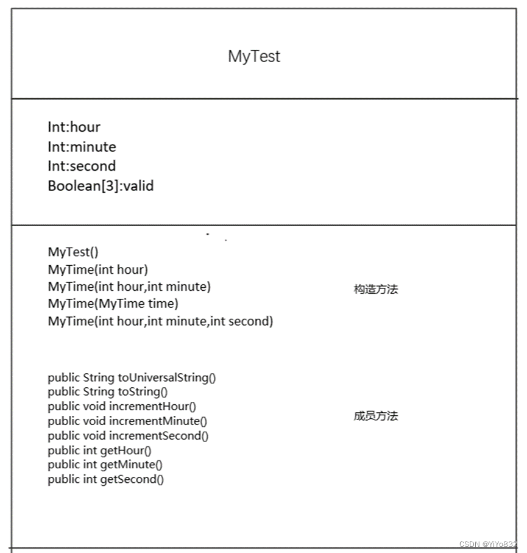

### 主干代码说明
1.

```
public String toUniversalString(){

        String res = new String();

        for (boolean i: valid){

            if (!i){

                res = toTimeString3().toString();

                return res;

            }

        }

        res = toTimeString1(this.hour,this.minute,this.second).toString();

        return res;

}
```
先检查输入格式，输入正确，交给toTimeString1方法。不正确，交给toTimeString3方法。

 2.

```
public String toString(){

        String res2 = toTimeString2().toString();

        return res2;

    }
```
重写方法，具体操作交给toTimeString2方法。

### 测试及结果
见附录测试类代码

 测试结果：

 Constructed with:

 t1: all arguments defaulted

  :00

  :00 AM

 t2: hour specified; minute and second defaulted

  :00

  :00 AM

 t3: hour and minute specified; second defaulted

  :00

  :00 PM

 t4: hour ,minute and second specified

  :42

  :42 PM

 t5: MyTime object t4 specified

  :42

  :42 PM

 t6: invalid values

 hour must be 0-23;minute must be 0-59;second must be 0-59;

 t7: 小时，分钟，秒均进位

  未加一前：:59 PM

 :00

  :00 AM

 t8: 分钟，秒均进位

  未加一前：:59 AM

 :00

  :00 AM

 t9: 秒进位

  未加一前：:59 AM

 :00

  :00 AM

 t10: 分钟进位

  未加一前：:09 AM

 :09

  :09 AM

 t11: 小时进位

  未加一前：:09 PM

 :09

  :09 AM

## 题目 2：创建自己的 GUI 图形
### 任务一
#### 数据设计
       已给代码的数据设计不再赘述，重点讲解MyRectangle和MyCircle类数据设计。

1.MyRectangle

设计了private int x; private int y; private int height; private int width; private Color  color;其中x，y表示横纵坐标，height，width表示长方形的高和宽，color是长方形的颜色。

2. MyCircle

      设计了private int x; private int y; private int radio; private Color color; 其中x，y表示横纵坐标，radio表示圆形的半径，color是圆形的颜色。

#### 编程思想

 数据及成员方法设计图如下：

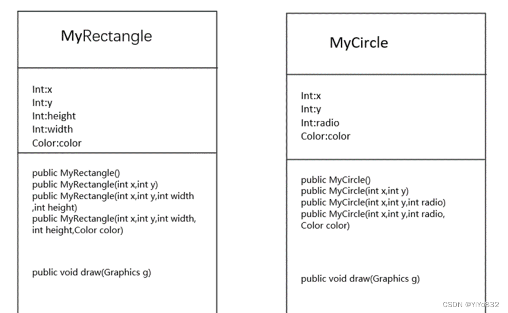

#### 测试及结果
测试代码见附录

测试结果：

注：测试结果具有随机性。

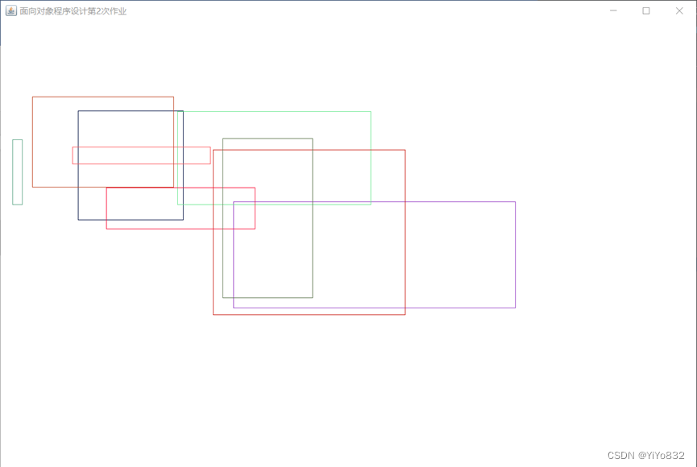

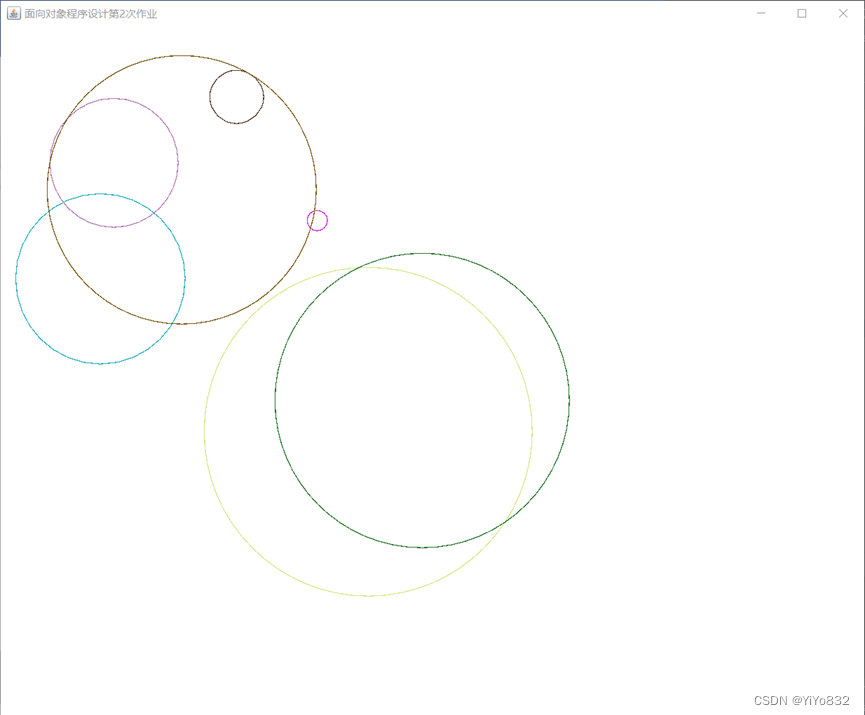

### 任务二
#### 编程思想
题目要求“的修改 DrawPanel 类的数据成员、构造函数等，使其具有可

以接收绘制任何(包括已有的和未来的)具有相同行为的图形类型”。我们可以先定义一个抽象类Shape，其中包含x,y,color等所有图形类型的共有成员变量和draw()方法。并且通过继承的方法，增加其图形必要的成员变量，重写draw()方法。
 其设计的UML图(简略版)如下：

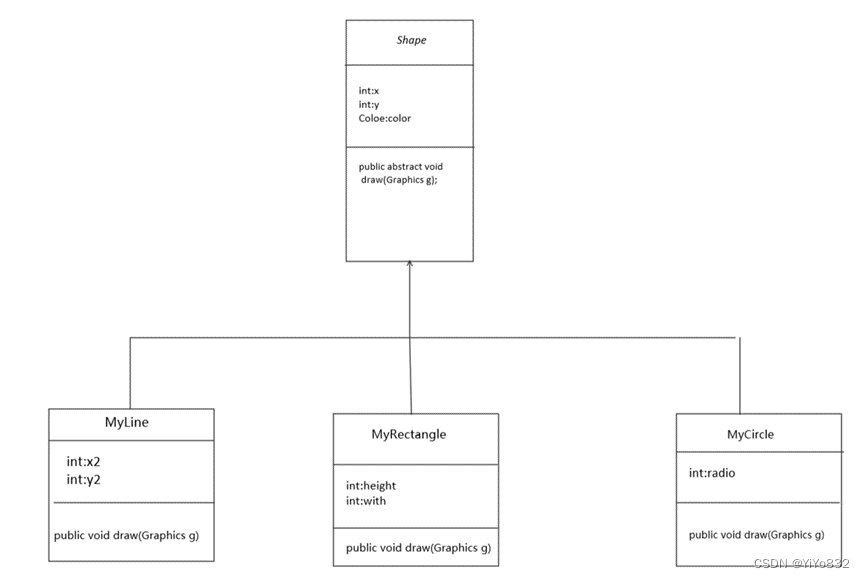

设计完各种图形之后，就需要修改DrawPanel类；

#### 主干代码说明
1.

```
public DrawPanel(Shape[] shapes){

              setBackground(Color.WHITE);

              if (shapes == null){

                     type = NULL;

                     return;

              }

              if (!shapes.getClass().isArray()){

                     type = NOTARRAY;

                     return;

              }

              this.shapes = shapes;

              type = SHAPE;

       }
```
其中SHAPE为一常量，使用shape代替circle,line,rectangle。

 2.

```
public void paintComponent(Graphics g)

       {

              super.paintComponent(g);

              switch(type){

                     case SHAPE:
                            for (Shape shape : shapes)
                                   shape.draw(g);
                            break;
                     case NULL:
                            g.drawString("在DrawPanel的构造函数中，你传递的引用参数是NULL。", 50, 50);
                            break;

                     case NOTARRAY:

                            g.drawString("在DrawPanle的构造函数中，你传递的引用参数必须是某个形状的数组类型。", 50, 50);

                            break;

              }

       }
```

把type只改为对于三个数字，这样子大大提高了代码的复用性，其中使用shape.draw(g)统一调用画画方法。

#### 测试及结果
测试代码见附录

测试结果如下：

注：测试结果具有随机性

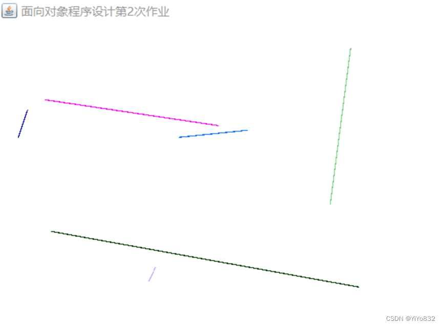

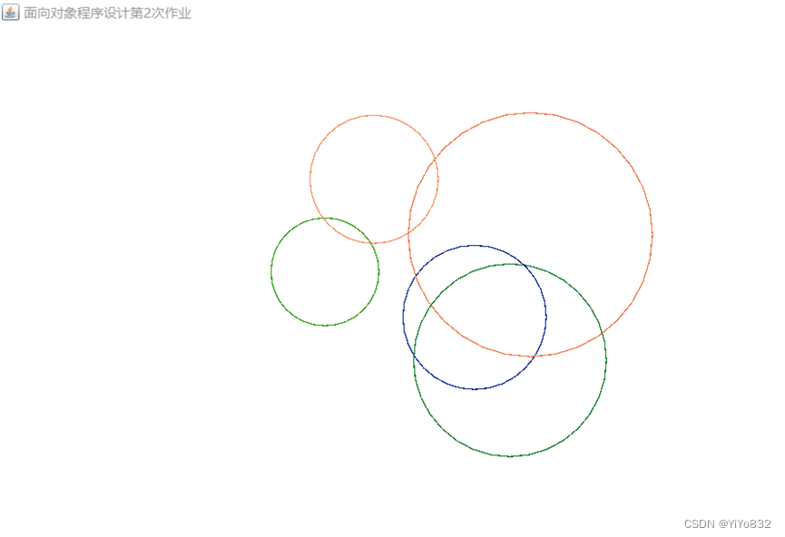

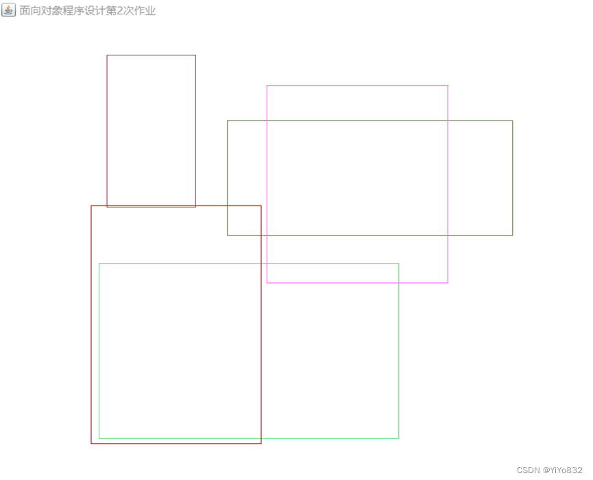

## 题目 3：接口的威力
### 前置任务
#### 编程设计
为了体现接口的威力，我们增加一个求面积的方法。

为了满足有面积特征的图形求面积的方法，增加一个接口，凡是可以满足其接口的图形均可以调用接口中的方法求面积。

其UML图如下：

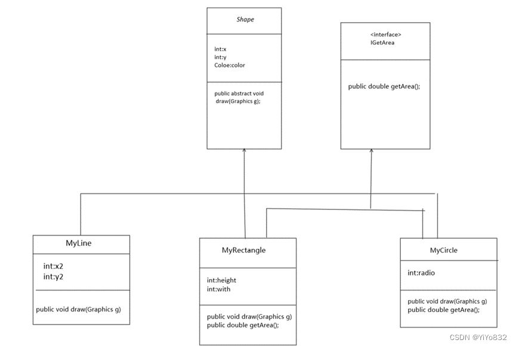

#### 主干代码说明
1.

```
package homework_2_3.mission1;

public interface IGetArea {

    public double getArea();

}
```
创建了一个IGetArea接口，仅有getArea()方法。

 2.

```
public double getArea() {

              return 3.14*(double) radio*(double) radio;

       }
```
实现接口，返回圆形面积

 3.

```
public double getArea() {

              return (double)height*(double)width;

       }
```
实现接口，返回长方形面积

#### 测试及结果
测试类代码见附录；

测试结果如下：

rectangle的长为：271，高为：129，面积为：34959.000000

rectangle的长为：285，高为：73，面积为：20805.000000

rectangle的长为：377，高为：49，面积为：18473.000000

rectangle的长为：83，高为：183，面积为：15189.000000

rectangle的长为：236，高为：243，面积为：57348.000000

circle的半径为：317，面积为：315535.460000

circle的半径为：284，面积为：253259.840000

circle的半径为：265，面积为：220506.500000

circle的半径为：177，面积为：98373.060000

circle的半径为：212，面积为：141124.160000

(上述数据为随机数据)

### 任务一
#### 编程设计
改造DrawPanel 类型，方法不再接收抽象类而是接受接口，通过接口调用draw()方法从而实现题目要求。
 UML图如下：

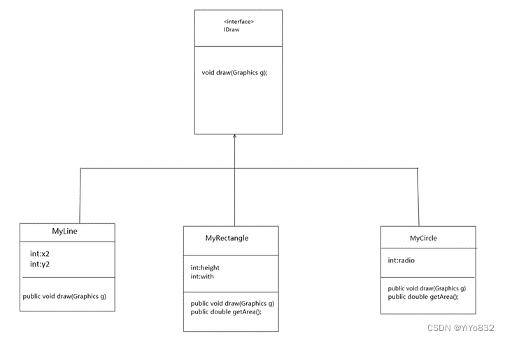

#### 主干代码说明
1.

```
package homework_2_3.mission2;

import java.awt.*;

public interface IDraw {

    void draw(Graphics g);

}
```
创造IDraw接口

2.

```
public class MyCircle extends Shape implements IDraw

public class MyRectangle extends Shape implements IDraw

public class MyLine extends Shape implements IDraw

public class MyNumber extends Shape implements IDraw

public class MyTime implements IDraw
```
说明：有图形特征的类继承Shape抽象类，有绘图要求的类实现IDraw接口即可。

3.

```
private IDraw[] shapes;

private IDraw shape;

public DrawPanel(IDraw shape){

              setBackground(Color.WHITE);

              if (shape == null){

                     type = NULL;

                     return;

              }

              this.shape = shape;

              type = SHAPE;

       }

case SHAPE:
    shape.draw(g);
    break;
```
上述为DrawPanel类的部分代码，把Shape抽象类改为了对IDraw接口的调用，增加了新的成员变量和构造方法，使其能满足单个需要绘制的类。

#### 测试与结果
测试代码见附录

 测试结果：

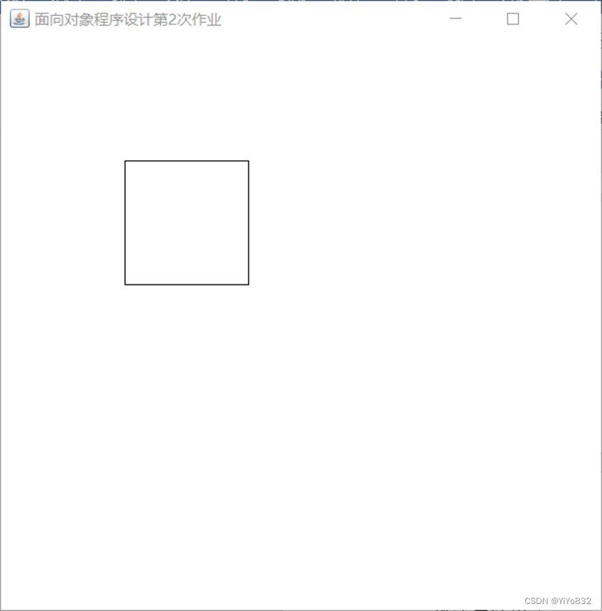

 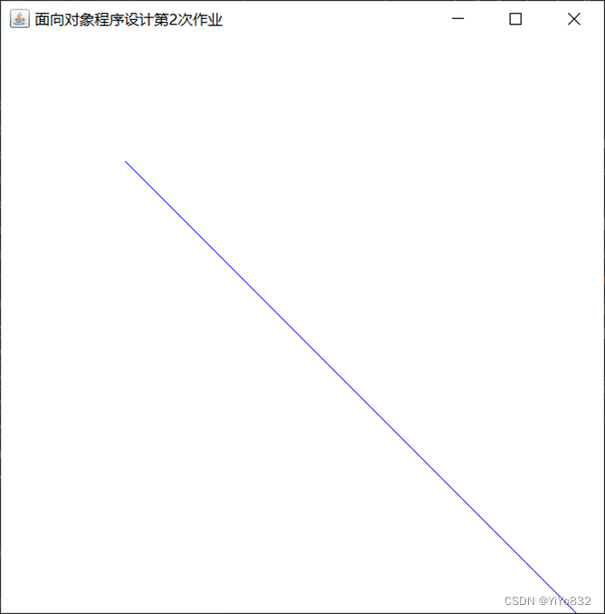

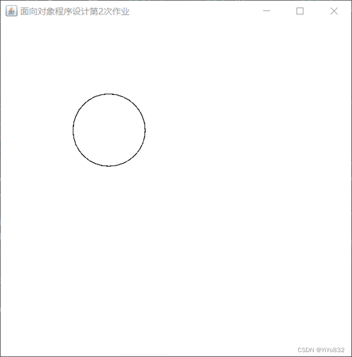

### 任务二
#### 编程思想
题目要求根据MyTime类的数据进行画图，我们可以在MyTime类中实现IDraw接口，再调用DrawPanel，最后在测试类实现钟表的绘制。

UML图省略。

#### 主干代码说明
1. MyNumber类

```
package homework_2_3.mission2;

import java.awt.*;

public class MyNumber implements IDraw{

    private static String THREE = "3";

    private static String SIX = "6";

    private static String NINE = "9";

    private static String TWELVE = "12";

    public MyNumber(){

    }

    @Override

    public void draw(Graphics g) {

        g.drawString(THREE,500,260);

        g.drawString(SIX,260,510);

        g.drawString(NINE,10,260);

        g.drawString(TWELVE,260,20);

    }

}
```
这是绘制钟表上数字的类，由于没有图形特征，只需要满足绘制要求即可。所以implements IDraw。

具体绘制参数是根据我的电脑屏幕制定的，因此不再赘述。

2.

```
public void draw(Graphics g) {

        IDraw[] iDraw = initial();

        for (IDraw iDraw1:iDraw){

            iDraw1.draw(g);

        }

    }

    public IDraw[] initial(){

        IDraw[] shapes = new IDraw[5];

//        3,6,9,12文字

        shapes[0] = new MyNumber();

//        圆圈

        shapes[1] = new MyCircle(10,10,500);

//        时针

        shapes[2] = new MyLine(260,260, 260+(int) (50*Math.cos(getHourAngle())), 260+(int) (50*Math.sin(getHourAngle())), Color.BLUE);

//        分针

        shapes[3] = new MyLine(260,260,260+(int) (100*Math.cos(getMinuteAngle())), 260+(int) (100*Math.sin(getMinuteAngle())), Color.RED);

//        秒针

        shapes[4] = new MyLine(260,260,260+(int) (150*Math.cos(getSecondAngle())), 260+(int) (150*Math.sin(getSecondAngle())), Color.BLACK);

        return shapes;

    }
```
这是MyTime类的部分函数，实现了钟表的绘制功能。其中getHourAngle()，getMinuteAngle()，getSecondAngle()是分别求出时针，分针，秒针的转动角度，具体实现过程见附录。

shapes是接口数组，为了表示方便写成shape，不代表均有由图形特征。

```
for (IDraw iDraw1:iDraw){
            iDraw1.draw(g);
        }
```
这段代码是实现了MyTime中draw()方法的主要代码。

#### 测试及结果
测试代码见附录

测试结果：

注：测试结果为转动的钟表随机截屏。

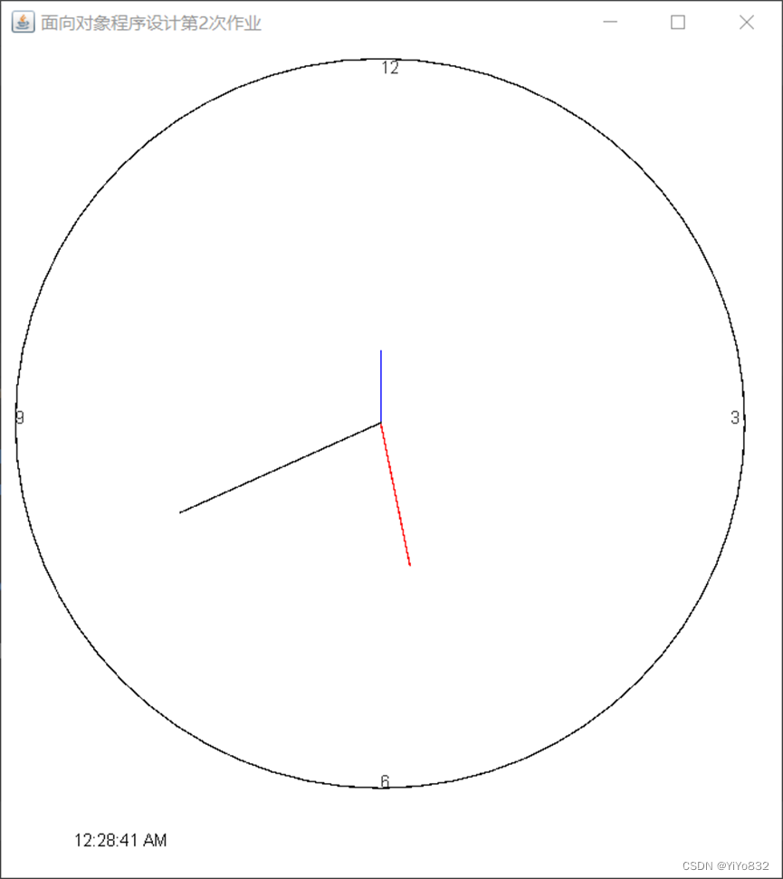

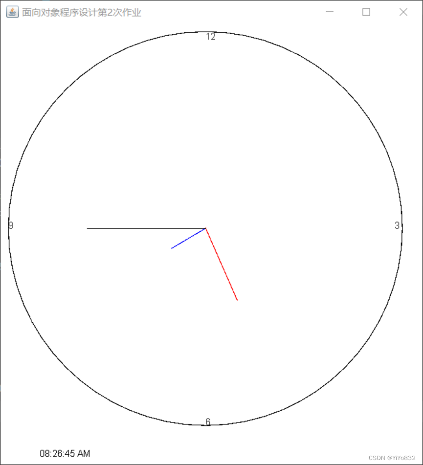

## 题目 4：撰写继承、多态和接口方面的知识梳理
### 继承
概念：

继承可以使得子类具有父类的[属性](https://baike.baidu.com/item/%E5%B1%9E%E6%80%A7/20192958?fromModule=lemma_inlink)和[方法](https://baike.baidu.com/item/%E6%96%B9%E6%B3%95/3009352?fromModule=lemma_inlink)或者重新定义、追加属性和方法等。

在JAVA中，继承是使用已存在的类的定义作为基础建立新类的技术，新类的定义可以增加新的数据或新的功能，也可以用父类的功能，但不能选择性地继承父类。

子类的创建可以增加新数据、新功能，可以继承父类全部的功能，但是不能选择性的继承父类的部分功能。继承是类与类之间的关系，不是对象与对象之间的关系。

实现方法：

       继承通过 extends 实现

       如：

class Father {}

class Son extends Father{}

Son类继承Father类

优劣势：

优势：

提高了代码的复用性 (多个类相同的成员可以放到同一个类中)

提高了代码的维护性(如果方法的代码需要修改，修改一处即可)

劣势 ：

继承让类与类之间产生了关系，类的耦合性增强了，当父类发生变化时子类实现也得跟着变化，削弱了子类的独立性

实现场景：

       需要考虑类与类之间是否存在is..a的关系，不能盲目使用继承

JAVA特点：

1.Java 中类只支持单继承 ， 不支持多继承 错误范例 ： class A exrends B,C{}

2.Java 中类支持多层继承

eg：

class Grandpa{}

class Father extends Grandpa{}

class Son extends Father{}

       3. 在子类方法中访问一个变量 ， 采用的就是就近原则 。

子类局部范围找

子类成员范围找

父类成员范围找

如果都没有就报错(不考虑父亲的父亲...)

super和this的使用：

       this 和 super 关键字 ：

this ：代表本类对象的引用

super ： 代表父类存储空间的标识 (可以理解为父类对象引用)

this 和 super 的使用区别 ：

成员方法：

this.成员变量 --- 访问本类成员变量

super.成员变量 --- 访问父类成员变量

成员变量：

this.成员方法 --- 访问本类成员方法

super.成员方法 --- 访问父类成员方法

构造方法 ：

this(...) --- 访问本类构造方法

super() --- 访问父类构造方法

注：通过子类对象访问一个方法

子类成员范围找

父类成员范围找

如果都没有就报错(不考虑父亲的父亲...)

方法重写：

1.方法重写概念

重写是子类对父类的允许访问的方法的实现过程进行重新编写, 返回值和形参都不能改变。即外壳不变，核心重写！

重写的好处在于子类可以根据需要，定义特定于自己的行为。 也就是说子类能够根据需要实现父类的方法。

重写方法不能抛出新的检查异常或者比被重写方法申明更加宽泛的异常。例如： 父类的一个方法申明了一个检查异常 IOException，但是在重写这个方法的时候不能抛出 Exception 异常，因为 Exception 是 IOException 的父类，抛出 IOException 异常或者 IOException 的子类异常。

在面向对象原则里，重写意味着可以重写任何现有方法。

2. 方法重写的应用场景

当子类需要父类的功能 ， 而功能主题子类有自己特有内容时 ， 可以重写父类中的方法， 这样 ， 即沿袭了父类的功能 ， 又定义了子类特有的内容

3. Override 注解

用来检测当前的方法 ， 是否是重写的方法 ， 起到了【校检】 的作用

4.方法重写事项：

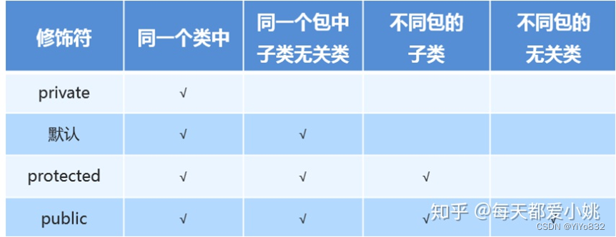

1.私有方法不能被重写 (父类私有成员子类是不能继承的)

2.子类方法访问权限不能更低(public > 默认 > 私有 )

 3.静态方法不能被重写 ， 如果子类也有相同的方法 ， 并不是重写父类的方法

4.参数列表与被重写方法的参数列表必须完全相同。

5.返回类型与被重写方法的返回类型可以不相同，但是必须是父类返回值的派生类(java5 及更早版本返回类型要一样，java7 及更高版本可以不同)。

6.访问权限不能比父类中被重写的方法的访问权限更低。例如：如果父类的一个方法被声明为 public，那么在子类中重写该方法就不能声明为 protected。

7.父类的成员方法只能被它的子类重写。

8.声明为 final 的方法不能被重写。

9.声明为 static 的方法不能被重写，但是能够被再次声明。

10.子类和父类在同一个包中，那么子类可以重写父类所有方法，除了声明为 private 和 final 的方法。

11.子类和父类不在同一个包中，那么子类只能够重写父类的声明为 public 和 protected 的非 final 方法。

12.重写的方法能够抛出任何非强制异常，无论被重写的方法是否抛出异常。但是，重写的方法不能抛出新的强制性异常，或者比被重写方法声明的更广泛的强制性异常，反之则可以。

13.构造方法不能被重写。

14.如果不能继承一个类，则不能重写该类的方法。

方法重载：

1.概念：

重载(overloading) 是在一个类里面，方法名字相同，而参数不同。返回类型可以相同也可以不同。

每个重载的方法(或者构造函数)都必须有一个独一无二的参数类型列表。

最常用的地方就是构造器的重载。

2.重载规则:

1.被重载的方法必须改变参数列表(参数个数或类型不一样)；

2.被重载的方法可以改变返回类型；

3.被重载的方法可以改变访问修饰符；

4.被重载的方法可以声明新的或更广的检查异常；

5.方法能够在同一个类中或者在一个子类中被重载。

6.无法以返回值类型作为重载函数的区分标准。

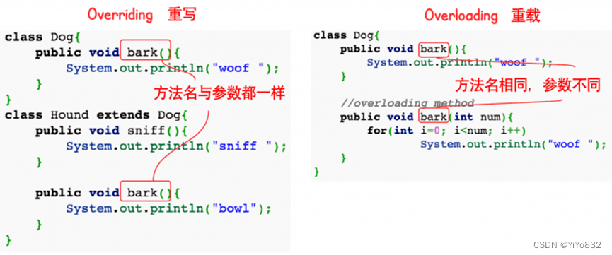

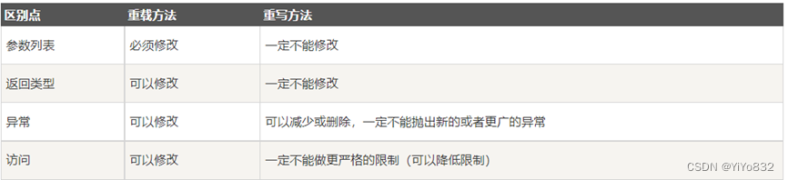

### 多态
概念：

多态是同一个行为具有多个不同表现形式或形态的能力。

多态就是同一个接口，使用不同的实例而执行不同操作

优点：

1.可替换性(substitutability)。多态对已存在代码具有可替换性。例如，多态对圆Circle类工作，对其他任何圆形几何体，如圆环，也同样工作。

2.可扩充性(extensibility)。多态对代码具有可扩充性。增加新的子类不影响已存在类的多态性、继承性，以及其他特性的运行和操作。实际上新加子类更容易获得多态功能。例如，在实现了圆锥、半圆锥以及半球体的多态基础上，很容易增添球体类的多态性。

3.接口性(interface-ability)。多态是超类通过方法签名，向子类提供了一个共同接口，由子类来完善或者覆盖它而实现的。

4.灵活性(flexibility)。它在应用中体现了灵活多样的操作，提高了使用效率。

5.简化性(simplicity)。多态简化对应用软件的代码编写和修改过程，尤其在处理大量对象的运算和操作时，这个特点尤为突出和重要。

存在的三个条件：

1.继承

2.重写

3.父类引用指向子类对象：Parent p = new Child();

注：当使用多态方式调用方法时，首先检查父类中是否有该方法，如果没有，则编译错误；如果有，再去调用子类的同名方法。

多态的好处：可以使程序有良好的扩展，并可以对所有类的对象进行通用处理。

Java实现：

方式一：重写

Java 重写(Override)与重载(Overload)

在继承里面有讲述，不再重复。

方式二：接口

1. 生活中的接口最具代表性的就是插座，例如一个三接头的插头都能接在三孔插座中，因为这个是每个国家都有各自规定的接口规则，有可能到国外就不行，那是因为国外自己定义的接口类型。

2. java中的接口类似于生活中的接口，就是一些方法特征的集合，但没有方法的实现。

方式三：抽象类和抽象方法

       下面将详细讲述抽象类和抽象方法：

Java 抽象类

在面向对象的概念中，所有的对象都是通过类来描绘的，但是反过来，并不是所有的类都是用来描绘对象的，如果一个类中没有包含足够的信息来描绘一个具体的对象，这样的类就是抽象类。

抽象类除了不能实例化对象之外，类的其它功能依然存在，成员变量、成员方法和构造方法的访问方式和普通类一样。

由于抽象类不能实例化对象，所以抽象类必须被继承，才能被使用。也是因为这个原因，通常在设计阶段决定要不要设计抽象类。

父类包含了子类集合的常见的方法，但是由于父类本身是抽象的，所以不能使用这些方法。

在 Java 中抽象类表示的是一种继承关系，一个类只能继承一个抽象类，而一个类却可以实现多个接口。

抽象类

在 Java 语言中使用 abstract class 来定义抽象类。

继承抽象类

       继承后，如果继承的类不是抽象类，则需要实现所有抽象类里面的抽象方法。

抽象方法

如果你想设计这样一个类，该类包含一个特别的成员方法，该方法的具体实现由它的子类确定，那么你可以在父类中声明该方法为抽象方法。

abstract 关键字同样可以用来声明抽象方法，抽象方法只包含一个方法名，而没有方法体。

抽象方法没有定义，方法名后面直接跟一个分号，而不是花括号。

eg：

public abstract double getDoubel();

声明抽象方法会造成以下两个结果：

如果一个类包含抽象方法，那么该类必须是抽象类。

任何子类必须重写父类的抽象方法，或者声明自身为抽象类。

继承抽象方法的子类必须重写该方法。否则，该子类也必须声明为抽象类。最终，必须有子类实现该抽象方法，否则，从最初的父类到最终的子类都不能用来实例化对象。

抽象类总结规定

1. 抽象类不能被实例化(初学者很容易犯的错)，如果被实例化，就会报错，编译无法通过。只有抽象类的非抽象子类可以创建对象。

2. 抽象类中不一定包含抽象方法，但是有抽象方法的类必定是抽象类。

3. 抽象类中的抽象方法只是声明，不包含方法体，就是不给出方法的具体实现也就是方法的具体功能。

4. 构造方法，类方法(用 static 修饰的方法)不能声明为抽象方法。

5. 抽象类的子类必须给出抽象类中的抽象方法的具体实现，除非该子类也是抽象类。

### 接口
Java 接口

接口(英文：Interface)，在JAVA编程语言中是一个抽象类型，是抽象方法的集合，接口通常以interface来声明。一个类通过继承接口的方式，从而来继承接口的抽象方法。

接口并不是类，编写接口的方式和类很相似，但是它们属于不同的概念。类描述对象的属性和方法。接口则包含类要实现的方法。

除非实现接口的类是抽象类，否则该类要定义接口中的所有方法。

接口无法被实例化，但是可以被实现。一个实现接口的类，必须实现接口内所描述的所有方法，否则就必须声明为抽象类。另外，在 Java 中，接口类型可用来声明一个变量，他们可以成为一个空指针，或是被绑定在一个以此接口实现的对象。

接口与类相似点：

一个接口可以有多个方法。

接口文件保存在 .java 结尾的文件中，文件名使用接口名。

接口的字节码文件保存在 .class 结尾的文件中。

接口相应的字节码文件必须在与包名称相匹配的目录结构中。

接口与类的区别：

接口不能用于实例化对象。

接口没有构造方法。

接口中所有的方法必须是抽象方法，Java 8 之后 接口中可以使用 default 关键字修饰的非抽象方法。

接口不能包含成员变量，除了 static 和 final 变量。

接口不是被类继承了，而是要被类实现。

接口支持多继承。

接口特性

接口中每一个方法也是隐式抽象的,接口中的方法会被隐式的指定为 public abstract(只能是 public abstract，其他修饰符都会报错)。

接口中可以含有变量，但是接口中的变量会被隐式的指定为 public static final 变量(并且只能是 public，用 private 修饰会报编译错误)。

接口中的方法是不能在接口中实现的，只能由实现接口的类来实现接口中的方法。

抽象类和接口的区别

1. 抽象类中的方法可以有方法体，就是能实现方法的具体功能，但是接口中的方法不行。

2. 抽象类中的成员变量可以是各种类型的，而接口中的成员变量只能是 public static final 类型的。

3. 接口中不能含有静态代码块以及静态方法(用 static 修饰的方法)，而抽象类是可以有静态代码块和静态方法。

4. 一个类只能继承一个抽象类，而一个类却可以实现多个接口。

注：JDK 1.8 以后，接口里可以有静态方法和方法体了。

注：JDK 1.8 以后，接口允许包含具体实现的方法，该方法称为"默认方法"，默认方法使用 default 关键字修饰。更多内容可参考 Java 8 默认方法。

注：JDK 1.9 以后，允许将方法定义为 private，使得某些复用的代码不会把方法暴露出去。更多内容可参考 Java 9 私有接口方法。

接口的声明

接口的声明语法格式如下：

[可见度] interface 接口名称 [extends 其他的接口名] {

        // 声明变量

        // 抽象方法

}

接口有以下特性：

接口是隐式抽象的，当声明一个接口的时候，不必使用abstract关键字。

接口中每一个方法也是隐式抽象的，声明时同样不需要abstract关键字。

接口中的方法都是公有的。

接口的实现

当类实现接口的时候，类要实现接口中所有的方法。否则，类必须声明为抽象的类。

类使用implements关键字实现接口。在类声明中，Implements关键字放在class声明后面。

实现一个接口的语法，可以使用这个公式：

接口语法：

...implements 接口名称[, 其他接口名称, 其他接口名称..., ...] ...

重写接口中声明的方法时，需要注意以下规则：

类在实现接口的方法时，不能抛出强制性异常，只能在接口中，或者继承接口的抽象类中抛出该强制性异常。

类在重写方法时要保持一致的方法名，并且应该保持相同或者相兼容的返回值类型。

如果实现接口的类是抽象类，那么就没必要实现该接口的方法。

在实现接口的时候，也要注意一些规则：

一个类可以同时实现多个接口。

一个类只能继承一个类，但是能实现多个接口。

一个接口能继承另一个接口，这和类之间的继承比较相似。

接口的继承

一个接口能继承另一个接口，和类之间的继承方式比较相似。接口的继承使用extends关键字，子接口继承父接口的方法。

接口的多继承

在Java中，类的多继承是不合法，但接口允许多继承。

在接口的多继承中extends关键字只需要使用一次，在其后跟着继承接口。

 如下所示：

public interface Hockey extends Sports, Event

以上的程序片段是合法定义的子接口，与类不同的是，接口允许多继承，而 Sports及 Event 可以定义或是继承相同的方法

标记接口

最常用的继承接口是没有包含任何方法的接口。

标记接口是没有任何方法和属性的接口.它仅仅表明它的类属于一个特定的类型,供其他代码来测试允许做一些事情。

标记接口作用：简单形象的说就是给某个对象打个标(盖个戳)，使对象拥有某个或某些特权。

没有任何方法的接口被称为标记接口。标记接口主要用于以下两种目的：

建立一个公共的父接口：

正如EventListener接口，这是由几十个其他接口扩展的Java API，你可以使用一个标记接口来建立一组接口的父接口。例如：当一个接口继承了EventListener接口，Java虚拟机(JVM)就知道该接口将要被用于一个事件的代理方案。

向一个类添加数据类型：

这种情况是标记接口最初的目的，实现标记接口的类不需要定义任何接口方法(因为标记接口根本就没有方法)，但是该类通过多态性变成一个接口类型。

## 附录
### 题目1
#### MyTime类
```
package homework_2_1;

public class MyTime{
//    定义小时，分钟，秒
    private int hour;
    private int minute;
    private int second;
//    定义valid[3]，分别判断hour,minute,second格式
    private boolean[] valid = new boolean[3];
//    以下为五种构造方法，hour,minute,second默认值分别为0,0,0
    public MyTime(){
        this(0);
    }
    public MyTime(int hour){
        this(hour,0);
    }
    public MyTime(int hour,int minute){
        this(hour,minute,0);
    }
    public MyTime(MyTime time){
        this(time.getHour(),time.getMinute(),time.getSecond());
    }
    public MyTime(int hour,int minute,int second){
        this.hour = hour;
        this.minute = minute;
        this.second = second;
        valid[0] = (hour<24&&hour>=0);
        valid[1] = (minute<60&&minute>=0);
        valid[2] = (second<60&&second>=0);
    }
    public String toUniversalString(){
        String res = new String();
        for (boolean i: valid){
            if (!i){
                res = toTimeString3().toString();
                return res;
            }
        }
        res = toTimeString1(this.hour,this.minute,this.second).toString();
        return res;
    }
    public String toString(){
        String res2 = toTimeString2().toString();
        return res2;
    }
//    toTimeString1是处理格式正确数据的函数，生成类似:00格式
    private StringBuffer toTimeString1(int hour, int minute, int second){
        StringBuffer res = new StringBuffer();
        appendString(res,hour);
        res.append(":");
        appendString(res,minute);
        res.append(":");
        appendString(res,second);
        return res;
    }
//    toTimeString2是处理格式正确数据的函数，生成类似:00 AM格式
    private StringBuffer toTimeString2(){
        StringBuffer res = new StringBuffer();
        if (this.hour>12){
            res = toTimeString1(this.hour-12,this.minute,this.second);
            res.append(" PM");
        }
        else if (this.hour == 12){
            res = toTimeString1(this.hour,this.minute,this.second);
            res.append(" PM");
        }
        else if (this.hour == 0){
            res = toTimeString1(12,this.minute,this.second);
            res.append(" AM");
        }
        else{
            res.append(toUniversalString());
            res.append(" AM");
        }
        return res;
    }
//    toTimeString2是处理格式错误的数据
    private StringBuffer toTimeString3(){
        StringBuffer res = new StringBuffer();
        if (!valid[0]){
            res.append("hour must be 0-23;");
        }
        if (!valid[1]){
            res.append("minute must be 0-59;");
        }
        if (!valid[2]){
            res.append("second must be 0-59;");
        }
        return res;
    }
//    appendString是补全0的函数
    private void appendString(StringBuffer res,int num){
        if (num<10){
            res.append(0);
            res.append(num);
        }
        else
            res.append(num);
    }
//    时分秒加一操作函数

    public void incrementHour() {
        if (++this.hour>=24)
            this.hour = 0;
    }

    public void incrementMinute() {
        if (++this.minute>=60){
            incrementHour();
            this.minute = 0;
        }
    }

    public void incrementSecond() {
        if (++this.second>=60){
            incrementMinute();
            this.second = 0;
        }
    }
//    get* 函数返回private数据
    public int getHour(){
        return hour;
    }
    public int getMinute(){
        return minute;
    }
    public int getSecond(){
        return second;
    }
}

```
#### TestTime类
```
package homework_2_1;

public class TestTime {
    public static void main(String[] args) {
        MyTime t1 = new MyTime();
        MyTime t2 = new MyTime(2);
        MyTime t3 = new MyTime(21,34);
        MyTime t4 = new MyTime(12, 25, 42);
        MyTime t5 = new MyTime(t4);

        System.out.println("Constructed with:");
        System.out.println("t1: all arguments defaulted");
        System.out.printf(" %s\n", t1.toUniversalString());
        System.out.printf(" %s\n", t1.toString());

        System.out.println("t2: hour specified; minute and second defaulted");
        System.out.printf(" %s\n", t2.toUniversalString());
        System.out.printf(" %s\n", t2.toString());

        System.out.println("t3: hour and minute specified; second defaulted");
        System.out.printf(" %s\n", t3.toUniversalString());
        System.out.printf(" %s\n", t3.toString());

        System.out.println("t4: hour ,minute and second specified");
        System.out.printf(" %s\n", t4.toUniversalString());
        System.out.printf(" %s\n", t4.toString());

        System.out.println("t5: MyTime object t4 specified");
        System.out.printf(" %s\n", t5.toUniversalString());
        System.out.printf(" %s\n", t5.toString());

         //when initialize t6 with invalid values,please output error information
        MyTime t6 = new MyTime(24, 74, 99);
        System.out.println("t6: invalid values");
        System.out.printf("%s\n", t6.toUniversalString());

        MyTime t7 = new MyTime(23, 59, 59);
        System.out.println("t7: 小时，分钟，秒均进位");
        System.out.printf(" 未加一前：%s\n", t7.toString());
        t7.incrementSecond();
        System.out.printf("%s\n", t7.toUniversalString());
        System.out.printf(" %s\n", t7.toString());

        MyTime t8 = new MyTime(2, 59, 59);
        System.out.println("t8: 分钟，秒均进位");
        System.out.printf(" 未加一前：%s\n", t8.toString());
        t8.incrementSecond();
        System.out.printf("%s\n", t8.toUniversalString());
        System.out.printf(" %s\n", t8.toString());

        MyTime t9 = new MyTime(2, 9, 59);
        System.out.println("t9: 秒进位");
        System.out.printf(" 未加一前：%s\n", t9.toString());
        t9.incrementSecond();
        System.out.printf("%s\n", t9.toUniversalString());
        System.out.printf(" %s\n", t9.toString());

        MyTime t10 = new MyTime(2, 59, 9);
        System.out.println("t10: 分钟进位");
        System.out.printf(" 未加一前：%s\n", t10.toString());
        t10.incrementMinute();
        System.out.printf("%s\n", t10.toUniversalString());
        System.out.printf(" %s\n", t10.toString());

        MyTime t11 = new MyTime(23, 59, 9);
        System.out.println("t11: 小时进位");
        System.out.printf(" 未加一前：%s\n", t11.toString());
        t11.incrementHour();
        System.out.printf("%s\n", t11.toUniversalString());
        System.out.printf(" %s\n", t11.toString());
    }
}

```
### 题目2
#### 任务一
MyRectangle类
```
package homework_2_2.mission1;

import java.awt.Graphics;
import java.awt.Color;
import java.security.PublicKey;

public class MyRectangle {
	private int x;
	private int y;
	private int height;
	private int width;
	private Color color;
	public MyRectangle(){
		this(0,0);
	}
	public MyRectangle(int x,int y){
		this(x,y,10,10);
	}
	public MyRectangle(int x,int y,int width,int height){
		this(x,y,width,height,Color.BLACK);
	}
	public MyRectangle(int x,int y,int width,int height,Color color){
		this.x = x;
		this.y = y;
		this.width = width;
		this.height = height;
		this.color = color;
	}
	public void draw(Graphics g)
	{
		g.setColor(this.color);
		g.drawRect(x,y,width,height);
	}
}

```
MyCircle类
```
package homework_2_2.mission1;

import java.awt.*;

public class MyCircle {
    private int x;
    private int y;
    private int radio;
    private Color color;
    public MyCircle(){
        this(0,0);
    }
    public MyCircle(int x,int y){
        this(x,y,10);
    }
    public MyCircle(int x,int y,int radio){
        this(x,y,radio,Color.BLACK);
    }
    public MyCircle(int x,int y,int radio,Color color){
        this.x = x;
        this.y = y;
        this.color = color;
        this.radio = radio;
    }
    public void draw(Graphics g)
    {
        g.setColor(this.color);
        g.drawOval(x,y,radio,radio);
    }
}

```
测试类
```
public static MyRectangle[] generateRectangles(){
    Random randomNumber = new Random();
    MyRectangle[] rectangles;
    rectangles = new MyRectangle[ 5 + randomNumber.nextInt(5)];
    for (int count = 0; count < rectangles.length; count++)
    {
        int x1 = randomNumber.nextInt(400);
        int y1 = randomNumber.nextInt(300);
        int x2 = randomNumber.nextInt(400);
        int y2 = randomNumber.nextInt(300);
        Color color = new Color( randomNumber.nextInt(256), randomNumber.nextInt(256),
                randomNumber.nextInt(256));
        rectangles[count] = new MyRectangle(x1, y1, x2, y2, color);
    }
    return rectangles;
}

public static MyCircle[] generateCircle(){
        Random randomNumber = new Random();
        MyCircle[] myCircles;
        myCircles = new MyCircle[ 5 + randomNumber.nextInt(5)];
        for (int count = 0; count < myCircles.length; count++)
        {
            int x1 = randomNumber.nextInt(400);
            int y1 = randomNumber.nextInt(300);
            int radio = randomNumber.nextInt(400);
            Color color = new Color( randomNumber.nextInt(256), randomNumber.nextInt(256),
                    randomNumber.nextInt(256));
            myCircles[count] = new MyCircle(x1, y1, radio, color);
        }
        return myCircles;
    }

```
#### 任务二
MyLine类
```
package homework_2_2.mission2;

import java.awt.Color;
import java.awt.Graphics;

public class MyLine extends Shape{
	private int x2;
	private int y2;
	public MyLine(int x, int y, int x2, int y2, Color color)
	{
		this.x = x;
		this.y = y;
		this.x2 = x2;
		this.y2 = y2;
		this.color = color;
	}
	public void draw(Graphics g)
	{
		g.setColor(color);
		g.drawLine(x, y, x2, y2);
	}
}

```
MyCircle类
```
package homework_2_2.mission2;

import java.awt.Color;
import java.awt.Graphics;

public class MyCircle extends Shape {
	private int radio;
	public MyCircle(){
		this(0,0);
	}
	public MyCircle(int x,int y){
		this(x,y,10);
	}
	public MyCircle(int x,int y,int radio){
		this(x,y,radio,Color.BLACK);
	}
	public MyCircle(int x,int y,int radio,Color color){
		this.x = x;
		this.y = y;
		this.color = color;
		this.radio = radio;
	}
	public void draw(Graphics g)
	{
		g.setColor(this.color);
		g.drawOval(x,y,radio,radio);
	}
}

```
MyRectangle类
```
package homework_2_2.mission2;

import java.awt.Color;
import java.awt.Graphics;

public class MyRectangle extends Shape{
	private int height;
	private int width;
	public MyRectangle(){
		this(0,0);
	}
	public MyRectangle(int x,int y){
		this(x,y,10,10);
	}
	public MyRectangle(int x,int y,int width,int height){
		this(x,y,width,height,Color.BLACK);
	}
	public MyRectangle(int x,int y,int width,int height,Color color){
		this.x = x;
		this.y = y;
		this.width = width;
		this.height = height;
		this.color = color;
	}
	public void draw(Graphics g)
	{
		g.setColor(this.color);
		g.drawRect(x,y,width,height);
	}
}

```
DrawPanel
```
package homework_2_2.mission2;

import javax.swing.JPanel;
import java.awt.Color;
import java.awt.Graphics;

public class DrawPanel extends JPanel {

	private static final long serialVersionUID = 1L;
	private Shape[] shapes;
	private int type;

	private static final int NONE = 0;
	private static final int NULL = 1;
	private static final int NOTARRAY = 2;
	private static final int SHAPE = 3;

	public DrawPanel()
	{
		setBackground(Color.BLACK);
		type = NONE;
	}

	public DrawPanel(Shape[] shapes){
		setBackground(Color.WHITE);
		if (shapes == null){
			type = NULL;
			return;
		}
		if (!shapes.getClass().isArray()){
			type = NOTARRAY;
			return;
		}
		this.shapes = shapes;
		type = SHAPE;
	}

	public void paintComponent(Graphics g)
	{
		super.paintComponent(g);
		switch(type){
			case SHAPE:
				for (Shape shape : shapes)
					shape.draw(g);
				break;
			case NULL:
				g.drawString("在DrawPanel的构造函数中，你传递的引用参数是NULL。", 50, 50);
				break;
			case NOTARRAY:
				g.drawString("在DrawPanle的构造函数中，你传递的引用参数必须是某个形状的数组类型。", 50, 50);
				break;
		}
	}
}

```
TestDraw
```
package homework_2_2.mission2;

import org.jetbrains.annotations.NotNull;

import javax.swing.JFrame;
import java.awt.Color;
import java.util.Random;

public class TestDraw {
	public static void main(String[] args) {
		DrawPanel panel = new DrawPanel(generateLines());
		JFrame application = new JFrame();
		application.setTitle("面向对象程序设计第2次作业");
		application.setDefaultCloseOperation(JFrame.EXIT_ON_CLOSE);
		application.add(panel);
		application.setSize(400, 300);
		application.setVisible(true);
	}
	@NotNull
	public static Shape[] generateLines(){
		Random randomNumber = new Random();
		MyLine[] lines;
		lines = new MyLine[ 5 + randomNumber.nextInt(5)];
		for (int count = 0; count < lines.length; count++)
		{
			int x1 = randomNumber.nextInt(400);
			int y1 = randomNumber.nextInt(300);
			int x2 = randomNumber.nextInt(400);
			int y2 = randomNumber.nextInt(300);
			Color color = new Color( randomNumber.nextInt(256), randomNumber.nextInt(256),
					randomNumber.nextInt(256));
			lines[count] = new MyLine(x1, y1, x2, y2, color);
		}
		return lines;
	}

	public static Shape[] generateRectangles(){
		Random randomNumber = new Random();
		MyRectangle[] rectangles;
		rectangles = new MyRectangle[ 5 + randomNumber.nextInt(5)];
		for (int count = 0; count < rectangles.length; count++)
		{
			int x1 = randomNumber.nextInt(400);
			int y1 = randomNumber.nextInt(300);
			int x2 = randomNumber.nextInt(400);
			int y2 = randomNumber.nextInt(300);
			Color color = new Color( randomNumber.nextInt(256), randomNumber.nextInt(256),
					randomNumber.nextInt(256));
			rectangles[count] = new MyRectangle(x1, y1, x2, y2, color);
		}
		return rectangles;
	}

	public static Shape[] generateCircle(){
		Random randomNumber = new Random();
		MyCircle[] myCircles;
		myCircles = new MyCircle[ 5 + randomNumber.nextInt(5)];
		for (int count = 0; count < myCircles.length; count++)
		{
			int x1 = randomNumber.nextInt(400);
			int y1 = randomNumber.nextInt(300);
			int radio = randomNumber.nextInt(400);
			Color color = new Color( randomNumber.nextInt(256), randomNumber.nextInt(256),
					randomNumber.nextInt(256));
			myCircles[count] = new MyCircle(x1, y1, radio, color);
		}
		return myCircles;
	}

```
### 题目3
#### 前置任务
MyCircle
```
package homework_2_3.mission1;

import homework_2_2.mission2.Shape;

import java.awt.*;

public class MyCircle extends Shape implements IGetArea {
	private int radio;
	public MyCircle(){
		this(0,0);
	}
	public MyCircle(int radio){
		this(0,0,radio);
	}
	public MyCircle(int x,int y){
		this(x,y,10);
	}
	public MyCircle(int x,int y,int radio){
		this(x,y,radio,Color.BLACK);
	}
	public MyCircle(int x,int y,int radio,Color color){
		this.x = x;
		this.y = y;
		this.color = color;
		this.radio = radio;
	}

	public MyCircle(int radio, Color color) {
		this(0,0,radio,color);
	}

	public void draw(Graphics g)
	{
		g.setColor(this.color);
		g.drawOval(x,y,radio,radio);
	}

	@Override
	public double getArea() {
		return 3.14*(double) radio*(double) radio;
	}
}

```
MyRectangle
```
package homework_2_3.mission1;

import homework_2_2.mission2.Shape;

import java.awt.*;

public class MyRectangle extends Shape implements IGetArea {
	private int height;
	private int width;
	public MyRectangle(){
		this(0,0);
	}
	public MyRectangle(int x,int y,int width,int height){
		this(x,y,width,height,Color.BLACK);
	}
	public MyRectangle(int x,int y,int width,int height,Color color){
		this.x = x;
		this.y = y;
		this.width = width;
		this.height = height;
		this.color = color;
	}

    public MyRectangle(int x2, int y2) {
        this(0,0,x2,y2,Color.BLACK);
    }

    public void draw(Graphics g)
	{
		g.setColor(this.color);
		g.drawRect(x,y,width,height);
	}

	@Override
	public double getArea() {
		return (double)height*(double)width;
	}
}

```
测试类
```
package homework_2_3.mission1;

import org.jetbrains.annotations.NotNull;
import java.util.Random;

public class TeatArea {
    public static void main(String[] args) {
        TeatArea.getRectanglesArea();
        TeatArea.getCirclesArea();
    }
    @NotNull
    public static void getRectanglesArea(){
        Random randomNumber = new Random();
        IGetArea iGetArea;
        MyRectangle[] rectangles;
        rectangles = new MyRectangle[5];
        for (int count = 0; count < rectangles.length; count++)
        {
            int x2 = randomNumber.nextInt(400);
            int y2 = randomNumber.nextInt(300);
            rectangles[count] = new MyRectangle(x2, y2);
            iGetArea = rectangles[count];
            System.out.printf("rectangle的长为：%d，高为：%d，面积为：%f\n",x2,y2,iGetArea.getArea());
        }
    }
    public static void getCirclesArea(){
        Random randomNumber = new Random();
        MyCircle[] myCircles;
        IGetArea iGetArea;
        myCircles = new MyCircle[5];
        for (int count = 0; count < myCircles.length; count++)
        {
            int radio = randomNumber.nextInt(400);
            myCircles[count] = new MyCircle(radio);
            iGetArea = myCircles[count];
            System.out.printf("circle的半径为：%d，面积为：%f\n",radio,iGetArea.getArea());
        }
    }
}

```
#### 任务一
IDraw接口
```
package homework_2_3.mission2;

import java.awt.*;

public interface IDraw {
    void draw(Graphics g);
}

```
Shape抽象类
```
package homework_2_3.mission2;

import java.awt.*;

public abstract class Shape {
    public int x;
    public int y;
    public Color color;

}

```

MyCircle类
```
package homework_2_3.mission2;

import java.awt.*;

public class MyCircle extends Shape implements IDraw{
	private int radio;
	public MyCircle(){
		this(0,0);
	}
	public MyCircle(int radio){
		this(0,0,radio);
	}
	public MyCircle(int x,int y){
		this(x,y,10);
	}
	public MyCircle(int x,int y,int radio){
		this(x,y,radio,Color.BLACK);
	}
	public MyCircle(int x,int y,int radio,Color color){
		this.x = x;
		this.y = y;
		this.color = color;
		this.radio = radio;
	}

	public MyCircle(int radio, Color color) {
		this(0,0,radio,color);
	}

	public void draw(Graphics g)
	{
		g.setColor(this.color);
		g.drawOval(x,y,radio,radio);
	}
}

```

MyLine类
```
package homework_2_3.mission2;

import java.awt.*;

public class MyLine extends Shape implements IDraw{
	private int x2;
	private int y2;
	public MyLine(int x, int y, int x2, int y2, Color color)
	{
		this.x = x;
		this.y = y;
		this.x2 = x2;
		this.y2 = y2;
		this.color = color;
	}
	public void draw(Graphics g)
	{
		g.setColor(color);
		g.drawLine(x, y, x2, y2);
	}
}

```

MyRectangle类
```
package homework_2_3.mission2;

import java.awt.*;

public class MyRectangle extends Shape implements IDraw{
	private int height;
	private int width;
	public MyRectangle(){
		this(0,0);
	}
	public MyRectangle(int x,int y,int width,int height){
		this(x,y,width,height,Color.BLACK);
	}
	public MyRectangle(int x,int y,int width,int height,Color color){
		this.x = x;
		this.y = y;
		this.width = width;
		this.height = height;
		this.color = color;
	}

    public MyRectangle(int x2, int y2) {
        this(0,0,x2,y2,Color.BLACK);
    }

    public void draw(Graphics g)
	{
		g.setColor(this.color);
		g.drawRect(x,y,width,height);
	}
}

```

测试类
```
package homework_2_3.mission2;
import javax.swing.JFrame;
import java.awt.*;
public class Test {
    public static void main(String[] args) {
        DrawPanel panel = new DrawPanel(new MyRectangle(100,100,100,100));
        //        依次调用panel
//        DrawPanel panel = new DrawPanel(new MyLine(100,100,500,500,Color.BLUE));
//        DrawPanel panel = new DrawPanel(new MyCircle(100,100,100));
        JFrame application = new JFrame();
        application.setTitle("面向对象程序设计第2次作业");
        application.setDefaultCloseOperation(JFrame.EXIT_ON_CLOSE);
        application.add(panel);
        application.setSize(500, 500);
        application.setVisible(true);
    }
}

```

#### 任务二
注：部分代码在任务一中已有体现，不再写出

MyNumber类
```
package homework_2_3.mission2;

import java.awt.*;

public class MyNumber implements IDraw{
    private static String THREE = "3";
    private static String SIX = "6";
    private static String NINE = "9";
    private static String TWELVE = "12";

    public MyNumber(){
    }

    @Override
    public void draw(Graphics g) {
        g.drawString(THREE,500,260);
        g.drawString(SIX,260,510);
        g.drawString(NINE,10,260);
        g.drawString(TWELVE,260,20);
    }
}

```

DrawPanel类
```
package homework_2_3.mission2;

import javax.swing.*;
import java.awt.*;

public class DrawPanel extends JPanel {

	private static final long serialVersionUID = 1L;
	private IDraw[] shapes;
	private IDraw shape;
	private int type;

	private static final int NONE = 0;
	private static final int NULL = 1;
	private static final int NOTARRAY = 2;
	private static final int SHAPES = 3;
	private static final int SHAPE = 4;

	public DrawPanel()
	{
		setBackground(Color.BLACK);
		type = NONE;
	}

	public DrawPanel(IDraw[] shapes){
		setBackground(Color.WHITE);
		if (shapes == null){
			type = NULL;
			return;
		}
		if (!shapes.getClass().isArray()){
			type = NOTARRAY;
			return;
		}
		this.shapes = shapes;
		type = SHAPES;
	}
	public DrawPanel(IDraw shape){
		setBackground(Color.WHITE);
		if (shape == null){
			type = NULL;
			return;
		}
		this.shape = shape;
		type = SHAPE;
	}

	public void paintComponent(Graphics g)
	{
		super.paintComponent(g);
		switch(type){
			case SHAPES:
				for (IDraw shape : shapes)
					shape.draw(g);
				break;
			case SHAPE:
				shape.draw(g);
				break;
			case NULL:
				g.drawString("在DrawPanel的构造函数中，你传递的引用参数是NULL。", 50, 50);
				break;
			case NOTARRAY:
				g.drawString("在DrawPanle的构造函数中，你传递的引用参数必须是某个形状的数组类型。", 50, 50);
				break;
		}
	}
}

```

MyTime类
```
package homework_2_3.mission2;

import java.awt.*;

public class MyTime implements IDraw{
//    定义小时，分钟，秒
    private int hour;
    private int minute;
    private int second;
//    定义valid[3]，分别判断hour,minute,second格式
    private boolean[] valid = new boolean[3];
//    以下为五种构造方法，hour,minute,second默认值分别为0,0,0
    public MyTime(){
        this(0);
    }
    public MyTime(int hour){
        this(hour,0);
    }
    public MyTime(int hour, int minute){
        this(hour,minute,0);
    }
    public MyTime(MyTime time){
        this(time.getHour(),time.getMinute(),time.getSecond());
    }
    public MyTime(int hour, int minute, int second){
        this.hour = hour;
        this.minute = minute;
        this.second = second;
        valid[0] = (hour<24&&hour>=0);
        valid[1] = (minute<60&&minute>=0);
        valid[2] = (second<60&&second>=0);
    }
    public String toUniversalString(){
        String res = new String();
        for (boolean i: valid){
            if (!i){
                res = toTimeString3().toString();
                return res;
            }
        }
        res = toTimeString1(this.hour,this.minute,this.second).toString();
        return res;
    }
    public String toString(){
        String res2 = toTimeString2().toString();
        return res2;
    }
//    toTimeString1是处理格式正确数据的函数，生成类似:00格式
    private StringBuffer toTimeString1(int hour, int minute, int second){
        StringBuffer res = new StringBuffer();
        appendString(res,hour);
        res.append(":");
        appendString(res,minute);
        res.append(":");
        appendString(res,second);
        return res;
    }
//    toTimeString2是处理格式正确数据的函数，生成类似:00 AM格式
    private StringBuffer toTimeString2(){
        StringBuffer res = new StringBuffer();
        if (this.hour>12){
            res = toTimeString1(this.hour-12,this.minute,this.second);
            res.append(" PM");
        }
        else if (this.hour == 12){
            res = toTimeString1(this.hour,this.minute,this.second);
            res.append(" PM");
        }
        else if (this.hour == 0){
            res = toTimeString1(12,this.minute,this.second);
            res.append(" AM");
        }
        else{
            res.append(toUniversalString());
            res.append(" AM");
        }
        return res;
    }
//    toTimeString2是处理格式错误的数据
    private StringBuffer toTimeString3(){
        StringBuffer res = new StringBuffer();
        if (!valid[0]){
            res.append("hour must be 0-23;");
        }
        if (!valid[1]){
            res.append("minute must be 0-59;");
        }
        if (!valid[2]){
            res.append("second must be 0-59;");
        }
        return res;
    }
//    appendString是补全0的函数
    private void appendString(StringBuffer res,int num){
        if (num<10){
            res.append(0);
            res.append(num);
        }
        else
            res.append(num);
    }
//    时分秒加一操作函数

    public void incrementHour() {
        if (++this.hour>=24)
            this.hour = 0;
    }

    public void incrementMinute() {
        if (++this.minute>=60){
            incrementHour();
            this.minute = 0;
        }
    }

    public void incrementSecond() {
        if (++this.second>=60){
            incrementMinute();
            this.second = 0;
        }
    }
//    get* 函数返回private数据
    public int getHour(){
        return hour;
    }
    public int getMinute(){
        return minute;
    }
    public int getSecond(){
        return second;
    }

    @Override
    public void draw(Graphics g) {
        IDraw[] iDraw = initial();
        for (IDraw iDraw1:iDraw){
            iDraw1.draw(g);
        }
        g.drawString(toString(),50,550);
    }
    public IDraw[] initial(){
        IDraw[] shapes = new IDraw[5];
//        3,6,9,12文字
        shapes[0] = new MyNumber();
//        圆圈
        shapes[1] = new MyCircle(10,10,500);
//        时针
        shapes[2] = new MyLine(260,260, 260+(int) (50*Math.cos(getHourAngle())), 260+(int) (50*Math.sin(getHourAngle())), Color.BLUE);
//        分针
        shapes[3] = new MyLine(260,260,260+(int) (100*Math.cos(getMinuteAngle())), 260+(int) (100*Math.sin(getMinuteAngle())), Color.RED);
//        秒针
        shapes[4] = new MyLine(260,260,260+(int) (150*Math.cos(getSecondAngle())), 260+(int) (150*Math.sin(getSecondAngle())), Color.BLACK);
        return shapes;
    }
    public double getHourAngle(){
        double x;
        x = (getHour()>=12)?getHour()-12:getHour();
        double angle;
        angle = -Math.PI/2 + x*Math.PI/6;
        return angle;
    }
    public double getMinuteAngle(){
        double x;
        x = getMinute();
        double angle;
        angle = -Math.PI/2 + x*Math.PI/30;
        return angle;
    }

    public double getSecondAngle(){
        double x;
        x = getSecond();
        double angle;
        angle = -Math.PI/2 + x*Math.PI/30;
        return angle;
    }
}

```
测试代码(Clock类)
```
package homework_2_3.mission2;

import javax.swing.*;
import java.awt.*;

public class Clock {
    public static void main(String[] args) {
        MyTime myTime = new MyTime(0,24,39);
        DrawPanel panel = new DrawPanel(myTime);
        JFrame application = new JFrame();
        application.setTitle("面向对象程序设计第2次作业");
        application.setDefaultCloseOperation(JFrame.EXIT_ON_CLOSE);
        application.add(panel);
        panel.updateUI();
        application.setSize(550, 550);
        application.setVisible(true);
//        让时钟转起来的代码如下：
        Thread t = new Thread() {
            public void run() {
                while (true) {
                    try {
                        Thread.sleep(1000); //设置绘制的时间间隔为 1 秒
                    }
                    catch (InterruptedException e) {
                        System.err.println(e);
                    }
//                  正好也可以用来检验第 1 道题目中时钟类型的这个方法是否正确
                    myTime.incrementSecond();
                    System.out.println(myTime.toString());
//                    更新绘制图形面板上的内容(也就是绘制的图像)
                    panel.updateUI();
                }
            }
        };
        t.start();
    }
}

```
### 题目4
参考文献：

[1]知乎--面向对象 ---- 继承 - 大烨子漫步阳光的文章

[https://zhuanlan.zhihu.com/p/340537990](https://zhuanlan.zhihu.com/p/340537990)

[2]菜鸟教程—Java—抽象类

[Java 抽象类 | 菜鸟教程 (runoob.com)](https://www.runoob.com/java/java-abstraction.html)

[3] 菜鸟教程—Java—接口

[Java 抽象类 | 菜鸟教程 (runoob.com)](https://www.runoob.com/java/java-abstraction.html)

[4] 菜鸟教程—Java—多态

[Java 多态 | 菜鸟教程 (runoob.com)](https://www.runoob.com/java/java-polymorphism.html)

[5] 菜鸟教程—Java—重写和重载

[Java 重写(Override)与重载(Overload) | 菜鸟教程 (runoob.com)](https://www.runoob.com/java/java-override-overload.html)

[6]CSDN—JVM—内存模型

[(45条消息) 一篇文章掌握整个JVM，JVM超详细解析！！！_小杰要吃蛋的博客-CSDN博客_jvm](https://blog.csdn.net/weixin_43122090/article/details/105093777?ops_request_misc=%257B%2522request%255Fid%2522%253A%2522166712838516800182717245%2522%252C%2522scm%2522%253A%252220140713.130102334..%2522%257D&request_id=166712838516800182717245&biz_id=0&utm_medium=distribute.pc_search_result.none-task-blog-2~all~top_positive~default-1-105093777-null-null.142%5Ev62%5Epc_search_tree,201%5Ev3%5Econtrol,213%5Ev1%5Econtrol&utm_term=JVM&spm=1018.2226.3001.4187)
