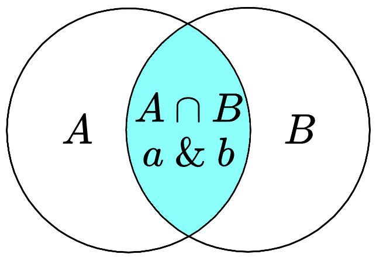

> 本文转载自力扣讨论区，作者：[灵茶山艾府（endlesscheng）](https://leetcode.cn/u/endlesscheng/)。
> 原文链接：<https://leetcode.cn/circle/discuss/CaOJ45/>

---



> 图：集合交、按位与之间存在某种联系。

## 前言

本文将扫清位运算的迷雾，在集合论与位运算之间建立一座桥梁。

在高中，我们学了集合论（set theory）的相关知识。例如，包含若干整数的集合 $S=\{0,2,3\}$。在编程中，通常用哈希表（hash table）表示集合。例如 Java 中的 `HashSet`，C++ 中的 `std::unordered_set`。

在集合论中，有交集 $\cap$、并集 $\cup$、包含于 $\subseteq$ 等等概念。如果编程实现「求两个哈希表的交集」，需要一个一个地遍历哈希表中的元素。那么，有没有效率更高的做法呢？

该二进制登场了。

集合可以用二进制表示，二进制**从低到高**第 $i$ 位为 $1$ 表示 $i$ 在集合中，为 $0$ 表示 $i$ 不在集合中。例如集合 $\{0,2,3\}$ 可以用二进制数 $1101_{(2)}$ 表示；反过来，二进制数 $1101_{(2)}$ 就对应着集合 $\{0,2,3\}$。

正式地说，包含非负整数的集合 $S$ 可以用如下方式「压缩」成一个数字：

$$
f(S) = \sum_{i\in S} 2^i
$$

例如集合 $\{0,2,3\}$ 可以压缩成 $2^0+2^2+2^3=13$，也就是二进制数 $1101_{(2)}$。

利用位运算「并行计算」的特点，我们可以高效地做一些和集合有关的运算。按照常见的应用场景，可以分为以下四类：

1. 集合与集合
2. 集合与元素
3. 遍历集合
4. 枚举集合

## 一、集合与集合

其中 $\&$ 表示按位与，$|$ 表示按位或，$\oplus$ 表示按位异或，$\sim$ 表示按位取反。

两个集合的「对称差」是只属于其中一个集合，而不属于另一个集合的元素组成的集合，也就是不在交集中的元素组成的集合。

|术语|集合|位运算|集合示例|位运算示例|
|---|---|---|---|---|
|交集|$A\cap B$|$a\&b$|$\begin{aligned}&\{0,2,3\}\\\cap\ &\{0,1,2\}\\=\ &\{0,2\}\end{aligned}$|$\begin{aligned}&1101\\\&\ &0111\\=\ &0101\end{aligned}$|
|并集|$A\cup B$|$a\ \vert\ b$|$\begin{aligned}&\{0,2,3\}\\\cup\ &\{0,1,2\}\\=\ &\{0,1,2,3\}\end{aligned}$|$\begin{aligned}&1101\\\vert\ \ &0111\\=\ &1111\end{aligned}$|
|对称差|$A\ \Delta\ B$|$a\oplus b$|$\begin{aligned}&\{0,2,3\}\\\Delta\ &\{0,1,2\}\\=\ &\{1,3\}\end{aligned}$|$\begin{aligned}&1101\\\oplus\ &0111\\=\ &1010\end{aligned}$|
|差|$A\setminus B$|$a\&\sim b$|$\begin{aligned}&\{0,2,3\}\\\setminus\ &\{1,2\}\\=\ &\{0,3\}\end{aligned}$|$\begin{aligned}&1101\\\&\ &1001\\=\ &1001\end{aligned}$|
|差（子集）|$A\setminus B,\ B\subseteq A$|$a\oplus b$ |$\begin{aligned}&\{0,2,3\}\\\setminus\ &\{0,2\}\\=\ &\{3\}\end{aligned}$|$\begin{aligned}&1101\\\oplus\ &0101\\=\ &1000\end{aligned}$|
|包含于|$A\subseteq B$|$a\& b = a$ <br/> $a\ \vert\ b = b$|$\{0,2\}\subseteq \{0,2,3\}$|$0101\& 1101 = 0101$ <br/> $0101\ \vert\ 1101 = 1101$|

> 注 1：按位取反的例子中，仅列出最低 $4$ 个比特位取反后的结果，即 $0110$ 取反后是 $1001$。
> 
> 注 2：包含于（判断子集）的两种位运算写法是等价的，在编程时只需判断其中任意一种。此外，还可以用 `(a & ~b) == 0` 判断，如果成立，也表示 $A$ 是 $B$ 的子集。
> 
> 注 3：编程时，请注意运算符的优先级。例如 `==` 在某些语言中优先级比位运算更高。

## 二、集合与元素

通常会用到移位运算。

其中 $\texttt{<<}$ 表示左移，$\texttt{>>}$ 表示右移。

> 注：左移 $i$ 位相当于乘以 $2^i$，右移 $i$ 位相当于除以 $2^i$。

|术语|集合|位运算|集合示例|位运算示例|
|---|---|---|---|---|
|空集|$\varnothing$|$0$|||
|单元素集合|$\{i\}$|$1\ \texttt{<<}\ i$|$\{2\}$|$1\ \texttt{<<}\ 2$|
|全集|$U=\{0,1,2,\ldots, n-1\}$|$(1\ \texttt{<<}\ n) - 1$|$\{0,1,2,3\}$|$(1\ \texttt{<<}\ 4)-1$|
|补集|$\complement_US = U\setminus S$|$((1\ \texttt{<<}\ n) - 1)\oplus s$|$U=\{0,1,2,3\}$<br/>$\complement_U \{1,2\} = \{0,3\}$|$\begin{aligned}&1111\\\oplus\ &0110\\=\ &1001\end{aligned}$|
|属于|$i\in S$|$(s\ \texttt{>>}\ i)\ \&\ 1 =1$|$2\in \{0,2,3\}$|$(1101\ \texttt{>>}\ 2)\ \&\ 1 =1$|
|不属于|$i\notin S$|$(s\ \texttt{>>}\ i)\ \&\ 1 =0$|$1\notin\{0,2,3\}$|$(1101\ \texttt{>>}\ 1)\ \&\ 1 =0$|
|添加元素|$S\cup \{i\}$|$s\ \vert\ (1\ \texttt{<<}\ i)$|$\{0,3\}\cup \{2\}$|$1001\ \vert\ (1\ \texttt{<<}\ 2)$|
|删除元素|$S\setminus \{i\}$|$s\&\sim (1\ \texttt{<<}\ i)$|$\{0,2,3\}\setminus \{2\}$|$1101\&\sim (1\ \texttt{<<}\ 2)$|
|删除元素（一定在集合中）|$S\setminus \{i\},\ i\in S$|$s\oplus (1\ \texttt{<<}\ i)$|$\{0,2,3\}\setminus \{2\}$|$1101\oplus (1\ \texttt{<<}\ 2)$|
|删除最小元素||$s\& (s-1)$||见下|

```java
      s = 101100
    s-1 = 101011 // 最低位的 1 变成 0，同时 1 右边的 0 都取反，变成 1
s&(s-1) = 101000
```

特别地，如果 $s$ 是 $2$ 的幂，那么 $s\& (s-1) = 0$。

此外，编程语言提供了一些和二进制有关的库函数，例如：

- 计算二进制中的 $1$ 的个数，也就是**集合大小**；
- 计算二进制长度，**减一**后得到**集合最大元素**；
- 计算二进制尾零个数，也就是**集合最小元素**。

调用这些函数的时间复杂度都是 $\mathcal{O}(1)$。

|术语|Python|Java|C++|Go|
|---|---|---|---|---|
|集合大小|`s.bit_count()`|`Integer.bitCount(s)`|`__builtin_popcount(s)`|`bits.OnesCount(s)`|
|二进制长度|`s.bit_length()`|`32-Integer.numberOfLeadingZeros(s)`|`__lg(s)+1`|`bits.Len(s)`|
|集合最大元素|`s.bit_length()-1`|`31-Integer.numberOfLeadingZeros(s)`|`__lg(s)`|`bits.Len(s)-1`|
|集合最小元素|`(s&-s).bit_length()-1`|`Integer.numberOfTrailingZeros(s)`|`__builtin_ctz(s)`|`bits.TrailingZeros(s)`|

请特别注意 $s=0$ 的情况。对于 C++ 来说，`__lg(0)` 和 `__builtin_ctz(0)` 是未定义行为。其他语言请查阅 API 文档。

此外，对于 C++ 的 `long long`，需使用相应的 `__builtin_popcountll` 等函数，即函数名后缀添加 `ll`（两个小写字母 L）。`__lg` 支持 `long long`。

特别地，只包含最小元素的子集，即二进制最低 $1$ 及其后面的 $0$，也叫 $\text{lowbit}$，可以用 `s & -s` 算出。举例说明：

```java
     s = 101100
    ~s = 010011
(~s)+1 = 010100 // 根据补码的定义，这就是 -s  =>  s 的最低 1 左侧取反，右侧不变
s & -s = 000100 // lowbit
```

## 三、遍历集合

设元素范围从 $0$ 到 $n-1$，枚举范围中的元素 $i$，判断 $i$ 是否在集合 $s$ 中。

```py [sol-Python3]
for i in range(n):
    if (s >> i) & 1:  # i 在 s 中
        # 处理 i 的逻辑
```

```java [sol-Java]
for (int i = 0; i < n; i++) {
    if (((s >> i) & 1) == 1) { // i 在 s 中
        // 处理 i 的逻辑
    }
}
```

```cpp [sol-C++]
for (int i = 0; i < n; i++) {
    if ((s >> i) & 1) { // i 在 s 中
        // 处理 i 的逻辑
    }
}
```

```go [sol-Go]
for i := 0; i < n; i++ {
    if s>>i&1 == 1 { // i 在 s 中
        // 处理 i 的逻辑
    }
}
```

也可以直接遍历集合 $s$ 中的元素：不断地计算集合最小元素、去掉最小元素，直到集合为空。

```py [sol-Python3]
t = s
while t:
    lowbit = t & -t
    t ^= lowbit
    i = lowbit.bit_length() - 1
    # 处理 i 的逻辑
```

```java [sol-Java]
for (int t = s; t > 0; t &= t - 1) {
    int i = Integer.numberOfTrailingZeros(t);
    // 处理 i 的逻辑
}
```

```cpp [sol-C++]
for (int t = s; t; t &= t - 1) {
    int i = __builtin_ctz(t);
    // 处理 i 的逻辑
}
```

```go [sol-Go]
for t := uint(s); t > 0; t &= t - 1 {
    i := bits.TrailingZeros(t)
    // 处理 i 的逻辑
}
```

## 四、枚举集合

### §4.1 枚举所有集合

设元素范围从 $0$ 到 $n-1$，从空集 $\varnothing$ 枚举到全集 $U$：

```py [sol-Python3]
for s in range(1 << n):
    # 处理 s 的逻辑
```

```java [sol-Java]
for (int s = 0; s < (1 << n); s++) {
    // 处理 s 的逻辑
}
```

```cpp [sol-C++]
for (int s = 0; s < (1 << n); s++) {
    // 处理 s 的逻辑
}
```

```go [sol-Go]
for s := 0; s < 1<<n; s++ {
    // 处理 s 的逻辑
}
```

### §4.2 枚举非空子集

设集合为 $s$，**从大到小**枚举 $s$ 的所有**非空**子集 $\textit{sub}$：

```py [sol-Python3]
sub = s
while sub:
    # 处理 sub 的逻辑
    sub = (sub - 1) & s
```

```java [sol-Java]
for (int sub = s; sub > 0; sub = (sub - 1) & s) {
    // 处理 sub 的逻辑
}
```

```cpp [sol-C++]
for (int sub = s; sub; sub = (sub - 1) & s) {
    // 处理 sub 的逻辑
}
```

```go [sol-Go]
for sub := s; sub > 0; sub = (sub - 1) & s {
    // 处理 sub 的逻辑
}
```

为什么要写成 `sub = (sub - 1) & s` 呢？

暴力做法是从 $s$ 出发，不断减一，直到 $0$。但这样做，中途会遇到很多并不是 $s$ 的子集的情况。例如 $s=10101$ 时，减一得到 $10100$，这是 $s$ 的子集。但再减一就得到 $10011$ 了，这并不是 $s$ 的子集，下一个子集应该是 $10001$。

把所有的合法子集按顺序列出来，会发现我们做的相当于「压缩版」的二进制减法，例如

$$
10101 \rightarrow 10100 \rightarrow 10001 \rightarrow 10000 \rightarrow 00101 \rightarrow \cdots
$$

如果忽略掉 $10101$ 中的两个 $0$，数字的变化和二进制减法是一样的，即

$$
111 \rightarrow 110 \rightarrow 101 \rightarrow 100 \rightarrow 011 \rightarrow \cdots
$$

如何快速跳到下一个子集呢？比如，怎么从 $10100$ 跳到 $10001$？

- 普通的二进制减法，是 $10100-1 = 10011$，也就是把最低位的 $1$ 变成 $0$，同时把最低位的 $1$ 右边的 $0$ 都变成 $1$。
- 压缩版的二进制减法也是类似的，对于 $10100 \rightarrow 10001$，也会把最低位的 $1$ 变成 $0$，对于最低位的 $1$ 右边的 $0$，并不是都变成 $1$，只有在 $s=10101$ 中的 $1$ 才会变成 $1$。怎么做到？减一后 $\&\ 10101$ 就行，也就是 $(10100-1)\ \&\ 10101 = 10001$。

### §4.3 枚举子集（包含空集）

如果要从大到小枚举 $s$ 的所有子集 $\textit{sub}$（从 $s$ 枚举到空集 $\varnothing$），可以这样写：

```py [sol-Python3]
sub = s
while True:
    # 处理 sub 的逻辑
    if sub == 0:
        break
    sub = (sub - 1) & s
```

```java [sol-Java]
int sub = s;
do {
    // 处理 sub 的逻辑
    sub = (sub - 1) & s;
} while (sub != s);
```

```cpp [sol-C++]
int sub = s;
do {
    // 处理 sub 的逻辑
    sub = (sub - 1) & s;
} while (sub != s);
```

```go [sol-Go]
for sub := s; ; sub = (sub - 1) & s {
    // 处理 sub 的逻辑
    if sub == 0 {
        break
    }
}
```

其中 Java 和 C++ 的原理是，当 $\textit{sub}=0$ 时（空集），再减一就得到 $-1$，对应的二进制为 $111\cdots1$，再 $\&s$ 就得到了 $s$。所以当循环到 $\textit{sub}=s$ 时，说明最后一次循环的 $\textit{sub}=0$（空集），$s$ 的所有子集都枚举到了，退出循环。

**注**：还可以枚举全集 $U$ 的所有大小**恰好**为 $k$ 的子集，这一技巧叫做 **Gosper's Hack**，具体请看 [视频讲解](https://www.bilibili.com/video/BV1na41137jv?t=15m43s)。

### §4.4 枚举超集

如果 $T$ 是 $S$ 的子集，那么称 $S$ 是 $T$ 的**超集**（superset）。

枚举超集的原理和上文枚举子集是类似的，这里通过**或运算**保证枚举的集合 $S$ 一定包含集合 $T$ 中的所有元素。

枚举 $S$，满足 $S$ 是 $T$ 的超集，也是全集 $U=\{0,1,2,\ldots,n-1\}$ 的子集。

```py [sol-Python3]
s = t
while s < (1 << n):
    # 处理 s 的逻辑
    s = (s + 1) | t
```

```java [sol-Java]
for (int s = t; s < (1 << n); s = (s + 1) | t) {
    // 处理 s 的逻辑
}
```

```cpp [sol-C++]
for (int s = t; s < (1 << n); s = (s + 1) | t) {
    // 处理 s 的逻辑
}
```

```go [sol-Go]
for s := t; s < 1<<n; s = (s + 1) | t {
    // 处理 s 的逻辑
}
```

## 练习

完成 [位运算题单](./05-位运算) 的第一章。

其他关联题单：

- [数据结构题单](./09-常用数据结构) 中的「**前缀异或和**」
- [动态规划题单](./08-动态规划) 中的「**状压 DP**」

## 分类题单

[如何科学刷题？](./00-如何科学刷题)

1. [滑动窗口与双指针（定长/不定长/单序列/双序列/三指针/分组循环）](./01-滑动窗口与双指针)
2. [二分算法（二分答案/最小化最大值/最大化最小值/第K小）](./02-二分算法)
3. [单调栈（基础/矩形面积/贡献法/最小字典序）](./03-单调栈)
4. [网格图（DFS/BFS/综合应用）](./04-网格图)
5. [位运算（基础/性质/拆位/试填/恒等式/思维）](./05-位运算)
6. [图论算法（DFS/BFS/拓扑排序/最短路/最小生成树/二分图/基环树/欧拉路径）](./07-图论算法)
7. [动态规划（入门/背包/状态机/划分/区间/状压/数位/数据结构优化/树形/博弈/概率期望）](./08-动态规划)
8. [常用数据结构（前缀和/差分/栈/队列/堆/字典树/并查集/树状数组/线段树）](./09-常用数据结构)
9. [数学算法（数论/组合/概率期望/博弈/计算几何/随机算法）](./10-数学算法)
10. [贪心与思维（基本贪心策略/反悔/区间/字典序/数学/思维/脑筋急转弯/构造）](./12-贪心算法)
11. [链表、二叉树与回溯（前后指针/快慢指针/DFS/BFS/直径/LCA/一般树）](./13-链表二叉树与回溯)
12. [字符串（KMP/Z函数/Manacher/字符串哈希/AC自动机/后缀数组/子序列自动机）](./14-字符串)

[我的题解精选（已分类）](https://github.com/EndlessCheng/codeforces-go/blob/master/leetcode/SOLUTIONS.md)

欢迎关注 [B站@灵茶山艾府](https://space.bilibili.com/206214)
