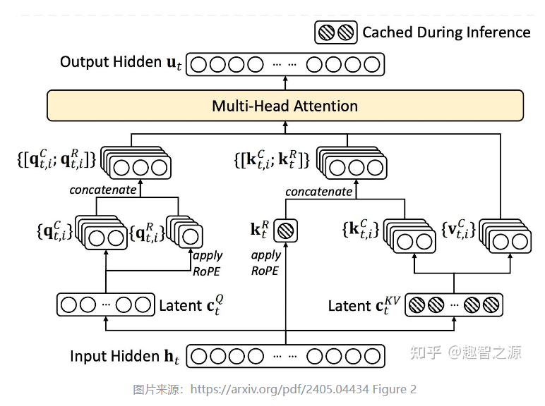

# 4. 注意力机制

## 概述

注意力机制是 Transformer 的核心，它让每个 token 能够"关注"序列中的其他 token，从而捕获长距离依赖关系。本章将介绍注意力机制的演进历程：

```
MHA → MQA → GQA → MLA → GQA + Sigmoid Gate (Qwen3.5 采用)
```

## 4.1 MHA：多头注意力

### 原理

Multi-Head Attention（MHA）是 Transformer 的原始注意力机制。核心思想：将注意力分成多个"头"，每个头独立学习不同的注意力模式。

$$\text{Attention}(Q, K, V) = \text{softmax}\left(\frac{QK^T}{\sqrt{d_k}}\right) V$$

$$\text{head}_i = \text{Attention}(XW_i^Q, XW_i^K, XW_i^V)$$

$$\text{MultiHead}(Q, K, V) = \text{Concat}(\text{head}_1, ..., \text{head}_h) W^O$$


其中：
- $W_i^Q, W_i^K, W_i^V \in \mathbb{R}^{d_{model} \times d_k}$：第 $i$ 个头的 Q/K/V 投影矩阵
- $W^O \in \mathbb{R}^{hd_k \times d_{model}}$：输出投影矩阵
- $h$：注意力头数
- $d_k = d_{model} / h$：每个头的维度

**直觉理解**：
- 不同的头可以关注不同类型的关系（如语法关系、语义关系、位置关系等）
- 多头并行计算，然后拼接，相当于从多个角度理解输入

### 代码实现
[代码文件](https://github.com/chuoer47/LinkQwen3.5/blob/master/reference/basic/attention/MHA.py)
```python
import torch
import torch.nn as nn


class MultiHeadAttention(nn.Module):
    def __init__(self, hidden_size, num_heads, dropout=0.):
        super().__init__()
        assert hidden_size % num_heads == 0

        self.hidden_size = hidden_size
        self.num_heads = num_heads
        self.head_dim = hidden_size // num_heads

        # Q, K, V 投影（每个头独立）
        self.query = nn.Linear(hidden_size, hidden_size)  # 输出 = num_heads × head_dim
        self.key = nn.Linear(hidden_size, hidden_size)
        self.value = nn.Linear(hidden_size, hidden_size)

        self.dropout = nn.Dropout(p=dropout)
        self.out_projection = nn.Linear(hidden_size, hidden_size)

    def forward(self, hidden_state, attention_mask=None):
        # hidden_state: (batch, seq_len, hidden_size)
        batch_size, seq_len, hidden_size = hidden_state.size()

        # 1. Q/K/V 投影
        query = self.query(hidden_state)  # (batch, seq_len, hidden_size)
        key = self.key(hidden_state)
        value = self.value(hidden_state)

        # 2. 拆分多头: (batch, seq_len, hidden) → (batch, num_heads, seq_len, head_dim)
        query = query.view(batch_size, seq_len, self.num_heads, self.head_dim).transpose(1, 2)
        key = key.view(batch_size, seq_len, self.num_heads, self.head_dim).transpose(1, 2)
        value = value.view(batch_size, seq_len, self.num_heads, self.head_dim).transpose(1, 2)

        # 3. 计算注意力权重: (batch, num_heads, seq_len, seq_len)
        attention_weight = torch.matmul(query, key.transpose(-2, -1)) / (self.head_dim ** 0.5)

        # 4. Mask（因果 mask 或 padding mask）
        if attention_mask is not None:
            attention_weight = attention_weight.masked_fill(
                attention_mask[:, None, None, :] == 0, float('-inf')
            )

        # 5. Softmax + Dropout
        attention_weight = torch.softmax(attention_weight, dim=-1)
        attention_weight = self.dropout(attention_weight)

        # 6. 加权求和
        context = torch.matmul(attention_weight, value)  # (batch, num_heads, seq_len, head_dim)

        # 7. 拼接多头
        context = context.transpose(1, 2).contiguous().view(batch_size, seq_len, hidden_size)

        # 8. 输出投影
        output = self.out_projection(context)
        return output
```

### MHA 的参数量分析

| 参数 | 形状 | 说明 |
|------|------|------|
| $W^Q$ | $(d_{model}, d_{model})$ | Q 投影 |
| $W^K$ | $(d_{model}, d_{model})$ | K 投影 |
| $W^V$ | $(d_{model}, d_{model})$ | V 投影 |
| $W^O$ | $(d_{model}, d_{model})$ | 输出投影 |
| **总计** | $4 \times d_{model}^2$ | — |

### MHA 的问题

MHA 中每个头都有独立的 K 和 V 投影，这意味着：
- **KV Cache 大**：推理时需要缓存所有头的 K 和 V，显存占用 = `batch × num_heads × seq_len × head_dim × 2`
- **推理速度慢**：KV Cache 大 → 内存带宽瓶颈 → 推理速度受限

## 4.2 MQA：多查询注意力

### 原理

Multi-Query Attention（MQA）由 Shazeer (2019) 提出，核心改进：**所有 Q 头共享一套 K/V 投影**。

```
MHA: 每个头有独立的 Q, K, V
     head_1: Q_1, K_1, V_1
     head_2: Q_2, K_2, V_2
     ...
     head_h: Q_h, K_h, V_h

MQA: 所有头共享 K, V，只有 Q 是独立的
     head_1: Q_1, K_shared, V_shared
     head_2: Q_2, K_shared, V_shared
     ...
     head_h: Q_h, K_shared, V_shared
```

### 代码实现
[代码文件](https://github.com/chuoer47/LinkQwen3.5/blob/master/reference/basic/attention/MQA.py)
```python
class MultiQueryAttention(nn.Module):
    def __init__(self, hidden_size, num_heads, dropout=0.0):
        super().__init__()
        assert hidden_size % num_heads == 0

        self.hidden_size = hidden_size
        self.num_heads = num_heads
        self.head_dim = hidden_size // num_heads

        # Q: 每个头独立 → 输出 hidden_size
        self.query = nn.Linear(hidden_size, hidden_size)
        # K: 所有头共享 → 输出 head_dim（而非 hidden_size！）
        self.key = nn.Linear(hidden_size, self.head_dim)
        # V: 所有头共享 → 输出 head_dim
        self.value = nn.Linear(hidden_size, self.head_dim)

        self.dropout = nn.Dropout(p=dropout)
        self.out_projection = nn.Linear(hidden_size, hidden_size)

    def forward(self, hidden_state, attention_mask=None):
        batch_size, seq_len, hidden_size = hidden_state.shape

        # Q/K/V 投影
        query = self.query(hidden_state)      # (batch, seq_len, hidden_size)
        key = self.key(hidden_state)           # (batch, seq_len, head_dim)
        value = self.value(hidden_state)       # (batch, seq_len, head_dim)

        # Q 拆分多头
        query = query.view(batch_size, seq_len, self.num_heads, self.head_dim).transpose(1, 2)

        # K/V 扩展到所有头（共享）
        key = key.unsqueeze(1).expand(-1, self.num_heads, -1, -1)    # (batch, num_heads, seq_len, head_dim)
        value = value.unsqueeze(1).expand(-1, self.num_heads, -1, -1)

        # 后续计算与 MHA 相同
        attention_weight = torch.matmul(query, key.transpose(-1, -2)) / (self.head_dim ** 0.5)
        if attention_mask is not None:
            attention_weight.masked_fill(attention_mask[:, None, None, :] == 0, float('-inf'))
        attention_weight = torch.softmax(attention_weight, dim=-1)
        attention_weight = self.dropout(attention_weight)

        context = torch.matmul(attention_weight, value)
        context = context.transpose(1, 2).contiguous().view(batch_size, seq_len, hidden_size)
        output = self.out_projection(context)
        return output
```

### MQA 的参数量和 KV Cache

| | MHA | MQA | 节省比例 |
|---|-----|-----|---------|
| K 参数 | $d_{model} \times d_{model}$ | $d_{model} \times d_k$ | $h$ 倍 |
| V 参数 | $d_{model} \times d_{model}$ | $d_{model} \times d_k$ | $h$ 倍 |
| KV Cache | `batch × h × seq × d_k × 2` | `batch × 1 × seq × d_k × 2` | $h$ 倍 |

**举例**：$d_{model}=256, h=8, d_k=32$
- MHA KV Cache: `8 × 32 × 2 = 512` 元素/token
- MQA KV Cache: `1 × 32 × 2 = 64` 元素/token
- **节省 8 倍！**

### MQA 的问题

MQA 过于激进地压缩 KV，可能导致质量下降。实验证明 MQA 在某些任务上比 MHA 差。

## 4.3 GQA：分组查询注意力（Qwen3.5 采用）

### 原理

Grouped-Query Attention（GQA）是 MHA 和 MQA 的折中方案（Ainslie et al., 2023）：**将 Q 头分成若干组，每组共享一套 K/V**。

```
MHA (h=8):  每个头独立 K/V → 8 个 KV 头
MQA (h=8):  所有头共享 K/V → 1 个 KV 头
GQA (h=8, g=2): 每 4 个 Q 头共享 1 个 KV 头 → 2 个 KV 头

分组方式:
  Group 1: Q_1, Q_2, Q_3, Q_4 → 共享 KV_1
  Group 2: Q_5, Q_6, Q_7, Q_8 → 共享 KV_2
```

### 代码实现
[代码文件](https://github.com/chuoer47/LinkQwen3.5/blob/master/reference/basic/attention/GQA.py)
```python
class GroupQueryAttention(nn.Module):
    def __init__(self, hidden_size, num_heads, group_size=2, dropout=0.):
        super().__init__()
        assert hidden_size % num_heads == 0
        assert num_heads % group_size == 0

        self.hidden_size = hidden_size
        self.num_heads = num_heads          # Q 头数 (如 8)
        self.group_size = group_size        # 每组 Q 头数 (如 2)
        self.head_dim = hidden_size // num_heads
        self.group_num = num_heads // group_size  # KV 头数 (如 4)

        # Q: 每个头独立
        self.query = nn.Linear(hidden_size, hidden_size)
        # K: 按组共享 → 输出 group_num × head_dim
        self.key = nn.Linear(hidden_size, self.head_dim * self.group_num)
        # V: 按组共享
        self.value = nn.Linear(hidden_size, self.head_dim * self.group_num)

        self.dropout = nn.Dropout(p=dropout)
        self.out_projection = nn.Linear(hidden_size, hidden_size)

    def forward(self, hidden_state, attention_mask=None):
        batch_size, seq_len, hidden_size = hidden_state.size()

        # Q/K/V 投影
        query = self.query(hidden_state)    # (batch, seq, hidden_size)
        key = self.key(hidden_state)        # (batch, seq, group_num × head_dim)
        value = self.value(hidden_state)    # (batch, seq, group_num × head_dim)

        # Q 拆分所有头
        query = query.view(batch_size, seq_len, self.num_heads, self.head_dim).transpose(1, 2)
        # (batch, num_heads, seq_len, head_dim)

        # K/V 拆分组
        key = key.view(batch_size, seq_len, self.group_num, self.head_dim).transpose(1, 2)
        # (batch, group_num, seq_len, head_dim)

        # K/V 扩展到组内每个头: (batch, group_num, 1, seq, head_dim) → (batch, num_heads, seq, head_dim)
        key = key.unsqueeze(2).expand(-1, -1, self.group_size, -1, -1)
        key = key.contiguous().view(batch_size, -1, seq_len, self.head_dim)

        value = value.view(batch_size, seq_len, self.group_num, self.head_dim).transpose(1, 2)
        value = value.unsqueeze(2).expand(-1, -1, self.group_size, -1, -1)
        value = value.contiguous().view(batch_size, -1, seq_len, self.head_dim)

        # 后续计算与 MHA 相同
        attention_weight = torch.matmul(query, key.transpose(-1, -2)) / (self.head_dim ** 0.5)
        if attention_mask is not None:
            attention_weight.masked_fill(attention_mask[:, None, None, :] == 0, float('-inf'))
        attention_weight = torch.softmax(attention_weight, dim=-1)
        attention_weight = self.dropout(attention_weight)

        context = torch.matmul(attention_weight, value)
        context = context.transpose(1, 2).contiguous().view(batch_size, seq_len, hidden_size)
        output = self.out_projection(context)
        return output
```

### GQA 的 KV 扩展机制

```python
# 以 group_num=2, group_size=4 为例
# K 原始形状: (batch, group_num=2, seq, head_dim)

# 步骤 1: 在第 2 维插入 group_size 维度
key = key.unsqueeze(2)
# (batch, 2, 1, seq, head_dim)

# 步骤 2: 扩展 group_size 次
key = key.expand(-1, -1, self.group_size, -1, -1)
# (batch, 2, 4, seq, head_dim)

# 步骤 3: 合并 group_num 和 group_size
key = key.contiguous().view(batch_size, -1, seq_len, self.head_dim)
# (batch, 8, seq, head_dim)  ← 与 Q 头数匹配
```

### MHA / MQA / GQA 对比

| | MHA | MQA | GQA |
|---|-----|-----|-----|
| Q 头数 | $h$ | $h$ | $h$ |
| KV 头数 | $h$ | 1 | $g$ (分组数) |
| 每组 Q 头数 | 1 | $h$ | $h/g$ |
| KV Cache | $h \times d_k$ | $d_k$ | $g \times d_k$ |
| 参数量 | 最多 | 最少 | 居中 |
| 质量 | 最好 | 较差 | 接近 MHA |
| 代表模型 | BERT, GPT-2 | PaLM | **Qwen3.5**, LLaMA |

**Qwen3.5 的配置**：`num_attention_heads=8, num_key_value_heads=2`，即 8 个 Q 头共享 2 个 KV 头，每组 4 个 Q 头。

## 4.4 MLA：多头潜在注意力

### 原理

Multi-Head Latent Attention（MLA）由 DeepSeek-V2 提出，核心思想：**用低秩投影压缩 KV 的维度**，进一步减少 KV Cache。

```
标准 MHA:
  K = x @ W_K    →  缓存 K (batch, num_heads, seq, head_dim)
  V = x @ W_V    →  缓存 V (batch, num_heads, seq, head_dim)

MLA:
  c_kv = x @ W_down     →  低维压缩向量 (batch, seq, down_dim)
  K = c_kv @ W_up_K      →  从压缩向量恢复 K
  V = c_kv @ W_up_V      →  从压缩向量恢复 V
  缓存 c_kv 而非 K, V    →  KV Cache 大幅减小
```



### 代码实现
[代码文件](https://github.com/chuoer47/LinkQwen3.5/blob/master/reference/basic/attention/MLA.py)
```python
class MultiHeadLatentAttention(nn.Module):
    def __init__(self, hidden_size=256, down_dim=64, up_dim=128, num_heads=8,
                 rope_head_dim=26, dropout_prob=0.):
        super().__init__()
        self.d_model = hidden_size
        self.down_dim = down_dim
        self.up_dim = up_dim
        self.num_heads = num_heads
        self.rope_head_dim = rope_head_dim
        self.head_dim = hidden_size // num_heads
        self.v_head_dim = up_dim // num_heads

        # 降维投影（压缩）
        self.down_proj_kv = nn.Linear(hidden_size, down_dim)     # 256 → 64
        self.down_proj_q = nn.Linear(hidden_size, down_dim)

        # 升维投影（恢复）
        self.up_proj_k = nn.Linear(down_dim, up_dim)             # 64 → 128
        self.up_proj_v = nn.Linear(down_dim, up_dim)
        self.up_proj_q = nn.Linear(down_dim, up_dim)

        # RoPE 专用投影
        self.proj_qr = nn.Linear(down_dim, rope_head_dim * num_heads)
        self.proj_kr = nn.Linear(hidden_size, rope_head_dim)

        self.rope_q = RotaryEmbedding(rope_head_dim * num_heads, num_heads)
        self.rope_k = RotaryEmbedding(rope_head_dim, 1)

        self.dropout = nn.Dropout(p=dropout_prob)
        self.fc = nn.Linear(up_dim, hidden_size)

    def forward(self, h, mask=None):
        batch_size, seq_len, d_model = h.size()

        # 1. 降维压缩
        c_t_kv = self.down_proj_kv(h)     # (batch, seq, down_dim=64)
        c_t_q = self.down_proj_q(h)       # (batch, seq, down_dim=64)

        # 2. 升维恢复
        k_t_c = self.up_proj_k(c_t_kv)    # (batch, seq, up_dim=128)
        v_t_c = self.up_proj_v(c_t_kv)    # (batch, seq, up_dim=128)
        q_t_c = self.up_proj_q(c_t_q)     # (batch, seq, up_dim=128)

        # 3. RoPE 分支（位置信息）
        q_t_r = self.proj_qr(c_t_q)       # (batch, seq, num_heads*rope_head_dim)
        q_t_r = q_t_r.view(batch_size, seq_len, self.num_heads, self.rope_head_dim).transpose(1, 2)
        q_t_r = self.rope_q(q_t_r)

        k_t_r = self.proj_kr(h)           # (batch, seq, rope_head_dim)
        k_t_r = k_t_r.unsqueeze(1)
        k_t_r = self.rope_k(k_t_r)

        # 4. 拼接语义部分和位置部分
        q_t_c = q_t_c.view(batch_size, seq_len, self.num_heads, -1).transpose(1, 2)
        q = torch.cat([q_t_c, q_t_r], dim=-1)    # (batch, heads, seq, up_dim/h + rope_dim)

        k_t_c = k_t_c.view(batch_size, seq_len, self.num_heads, -1).transpose(1, 2)
        k_t_r = k_t_r.expand(batch_size, self.num_heads, seq_len, -1)
        k = torch.cat([k_t_c, k_t_r], dim=-1)

        # 5. 注意力计算
        scores = torch.matmul(q, k.transpose(-1, -2))
        scores = scores / (self.head_dim ** 0.5 + self.rope_head_dim ** 0.5)

        if mask is not None:
            scores = scores.masked_fill(mask[:, None, None, :] == 0, float('-inf'))

        attn_weights = torch.softmax(scores, dim=-1)
        attn_weights = self.dropout(attn_weights)

        # 6. 加权求和（只用语义部分的 V）
        v_t_c = v_t_c.view(batch_size, seq_len, self.num_heads, self.v_head_dim).transpose(1, 2)
        context = torch.matmul(attn_weights, v_t_c)
        context = context.transpose(1, 2).contiguous().view(batch_size, seq_len, -1)

        output = self.fc(context)
        return output
```

### MLA 的 KV Cache 压缩

| | MHA | MLA |
|---|-----|-----|
| 缓存内容 | K, V | 低维压缩向量 $c_{kv}$ |
| Cache 大小 | $2 \times h \times d_k$ | $d_{down} + d_{rope}$ |
| 示例 | $2 \times 8 \times 32 = 512$ | $64 + 26 = 90$ |

## 4.5 Sigmoid Gate（Qwen3.5 的创新）

### 原理

Qwen3.5 的注意力机制还有一个重要创新：**Sigmoid Gate**。传统 Transformer 在注意力输出后直接做残差连接：

$$\text{output} = x + \text{Attention}(x)$$

Qwen3.5 引入一个门控信号，控制注意力输出的"强度"：

$$\text{output} = x + \text{Attention}(x) \odot \sigma(g)$$

其中 $g$ 是一个可学习的门控向量，$\sigma$ 是 sigmoid 函数。

### 实现方式

在 Qwen3.5 中，Q 投影的输出维度是 `2 × num_heads × head_dim`，一半用于 query，一半用于 gate：

```python
class GQAAttention(nn.Module):
    def __init__(self, config, layer_idx):
        # Q 投影: 输出 2 * head_dim（一半是 query，一半是 gate）
        self.q_proj = nn.Linear(
            config.hidden_size,
            config.num_attention_heads * config.head_dim * 2,  # 8 * 256 * 2
            bias=config.attention_bias,
        )

    def forward(self, hidden_states, ...):
        # Q 投影 + split 为 query 和 gate
        q_out = self.q_proj(hidden_states)  # (batch, seq, heads * head_dim * 2)
        q_out = q_out.view(batch_size, seq_len, self.num_heads, self.head_dim * 2)
        query_states, gate = q_out.chunk(2, dim=-1)  # 各 (batch, seq, heads, head_dim)
        gate = gate.reshape(batch_size, seq_len, self.num_heads * self.head_dim)

        # ... 标准注意力计算 ...

        # Sigmoid Gate
        attn_output = attn_output * torch.sigmoid(gate)

        # 输出投影
        attn_output = self.o_proj(attn_output)
```

### 为什么用 Sigmoid Gate？

1. **更灵活的残差连接**：传统残差连接的权重固定为 1，Sigmoid Gate 让模型学习"多少注意力信息应该被保留"
2. **训练稳定性**：sigmoid 将门控值限制在 (0, 1)，避免注意力输出过大
3. **与 SwiGLU 呼应**：SwiGLU 在 FFN 中使用了门控，Sigmoid Gate 在注意力中使用门控，形成一致的设计哲学

## 4.6 Q/K RMSNorm（Qwen3.5 的另一个细节）

Qwen3.5 在 Q/K 投影之后、RoPE 之前，对 Q 和 K 做 RMSNorm：

```python
# Q/K RMSNorm（post-norm，在 RoPE 之前）
self.q_norm = RMSNorm(config.head_dim, eps=config.rms_norm_eps)
self.k_norm = RMSNorm(config.head_dim, eps=config.rms_norm_eps)

# 在 forward 中
query_states = self.q_norm(query_states)  # (batch, seq, heads, head_dim)
key_states = self.k_norm(key_states)      # (batch, seq, kv_heads, head_dim)
```

**为什么这样做？**

1. **稳定注意力计算**：Q 和 K 的内积可能很大，导致 softmax 后过于"尖锐"（几乎只关注一个 token）。RMSNorm 将 Q 和 K 归一化到稳定范围
2. **与 RoPE 配合**：RoPE 之前做归一化，确保旋转后的向量长度一致

## 4.7 注意力机制对比总结

| 注意力类型 | Q 头 | KV 头 | KV Cache | 特点 | 代表模型 |
|-----------|------|-------|----------|------|----------|
| MHA | $h$ | $h$ | 最大 | 质量最好 | BERT, GPT-2 |
| MQA | $h$ | 1 | 最小 | 速度最快 | PaLM |
| GQA | $h$ | $g$ | 居中 | 平衡效率和质量 | **Qwen3.5**, LLaMA |
| MLA | $h$ | 压缩 | 极小 | 低秩压缩 | DeepSeek-V2 |

**Qwen3.5 的注意力机制总结**：
- 使用 GQA：8 个 Q 头共享 2 个 KV 头
- 使用 Partial RoPE：只对 head_dim 的前 64 维做 RoPE
- 使用 Sigmoid Gate：控制注意力输出的强度
- 使用 Q/K RMSNorm：在 RoPE 之前归一化 Q 和 K
- 输出公式：$\text{output} = W^O(\text{Attention}(Q, K, V) \odot \sigma(g))$

---

**上一章**：[3. 位置编码](./03-位置编码.md) | **下一章**：[5. 线性注意力](./05-线性注意力.md)
