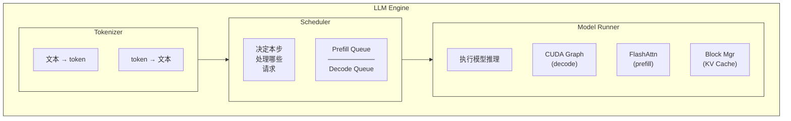

# 11. 推理加速（一）：vLLM 原理

## 概述

前面的章节完成了 MiniQwen 的搭建、预训练、权重适配和后训练（SFT/DPO/GRPO 等）。现在模型已经可以生成文本了，但推理速度很慢——朴素的自回归生成一次只能处理一个请求，GPU 利用率极低。

本章介绍 **vLLM**（取自论文 "Efficient Memory Management for Large Language Model Serving with PagedAttention"），它是当前最流行的 LLM 推理加速框架之一。我们不讲它的代码实现（那是第 12 章的事），只讲**核心思想**。

## 11.1 为什么需要推理加速？

### 朴素推理的问题

最简单的推理方式是**逐请求串行处理**：

```
请求1: [prefill 100 tokens] → [decode 1] → [decode 2] → ... → [decode 50] → 完成 → 请求2开始                                                                
请求2（等待请求1结束）: [prefill 80 tokens] → [decode 1] → ...
```

**问题**：
- 请求 2 必须等请求 1 完全结束才能开始
- GPU 在 decode 阶段只处理 1 个 token，计算量极小，大量算力浪费
- 每个请求独占一块 KV Cache 显存，无法共享

### 批处理的改进

将多个请求组成一个 batch 一起处理：

```
Batch 1:
  请求1: [decode step 1]
  请求2: [decode step 1]
  请求3: [decode step 1]
  → 一次 kernel 调用处理 3 个请求
```

**新问题**：
- **Static Batching**：batch 中所有请求必须同步。如果请求 1 先完成，其他请求要等它 "填 padding"
- **显存浪费**：每个请求按最大长度预分配 KV Cache，短请求浪费大量显存
- **无法动态加入**：batch 一旦组成，中途不能加入新请求

## 11.2 PagedAttention：KV Cache 的分页管理

### 传统 KV Cache 的问题

在标准 Transformer 推理中，每个请求需要缓存所有历史 token 的 K 和 V 向量（KV Cache）。传统做法是**连续分配**：

```
请求1 (max_len=2048):  [████████████████████████████████] ← 预分配 2048 个位置
请求2 (max_len=2048):  [████████████████████████████████]
请求3 (max_len=2048):  [████████████████████████████████]

实际使用:
请求1:  [██████░░░░░░░░░░░░░░░░░░░░░░░░░░] ← 只用了 6/2048
请求2:  [████████████████░░░░░░░░░░░░░░░░] ← 只用了 16/2048
请求3:  [██████████████████████████░░░░░░] ← 只用了 26/2048

░ = 浪费的显存
```

**三个问题**：
1. **内部碎片**：预分配过多，实际使用远小于分配量
2. **外部碎片**：不同长度的请求释放后，显存中出现不连续的空洞
3. **无法共享**：即使两个请求有相同的 prompt 前缀，KV Cache 也各存一份

### 分页思想

vLLM 借鉴操作系统的**虚拟内存分页**机制：

<table style="font-family: monospace; border-collapse: collapse; color: inherit;">
  <thead>
    <tr>
      <th style="text-align: left; font-weight: normal; padding-bottom: 8px;">逻辑视角（请求看到的）：</th>
      <th style="padding: 0 12px;"></th>
      <th style="text-align: left; font-weight: normal; padding-bottom: 8px;" colspan="2">物理视角（GPU 显存）：</th>
    </tr>
  </thead>
  <tbody>
    <tr>
      <td style="border: 1px solid currentColor; border-bottom: none; padding: 6px 16px; min-width: 200px;">Block 0 (tokens 0-15)</td>
      <td style="text-align: center;">───→</td>
      <td style="border: 1px solid currentColor; border-bottom: none; padding: 6px 16px; min-width: 180px;">Physical Block 7</td>
      <td></td>
    </tr>
    <tr>
      <td style="border-left: 1px solid currentColor; border-right: 1px solid currentColor; border-bottom: none; padding: 6px 16px;">Block 1 (tokens 16-31)</td>
      <td style="text-align: center;">───→</td>
      <td style="border-left: 1px solid currentColor; border-right: 1px solid currentColor; border-bottom: none; padding: 6px 16px;">Physical Block 2</td>
      <td></td>
    </tr>
    <tr>
      <td style="border-left: 1px solid currentColor; border-right: 1px solid currentColor; border-bottom: none; padding: 6px 16px;">Block 2 (tokens 32-47)</td>
      <td style="text-align: center;">───→</td>
      <td style="border-left: 1px solid currentColor; border-right: 1px solid currentColor; border-bottom: none; padding: 6px 16px;">Physical Block 11</td>
      <td></td>
    </tr>
    <tr>
      <td style="border-left: 1px solid currentColor; border-right: 1px solid currentColor; border-bottom: none; padding: 6px 16px;">Block 3 (未分配)</td>
      <td></td>
      <td style="border-left: 1px solid currentColor; border-right: 1px solid currentColor; border-bottom: none; padding: 6px 16px;">Physical Block 1</td>
      <td style="padding-left: 8px;">← 空闲</td>
    </tr>
    <tr>
      <td style="border: 1px solid currentColor; border-top: none; padding: 6px 16px;">...</td>
      <td></td>
      <td style="border-left: 1px solid currentColor; border-right: 1px solid currentColor; border-bottom: none; padding: 6px 16px;">Physical Block 3</td>
      <td style="padding-left: 8px;">← 空闲</td>
    </tr>
    <tr>
      <td></td>
      <td></td>
      <td style="border: 1px solid currentColor; border-top: none; padding: 6px 16px;">...</td>
      <td></td>
    </tr>
  </tbody>
</table>

**核心思想**：
- KV Cache 被切分成固定大小的 **Block**（如 16 或 256 个 token 一个 block）
- 每个请求维护一个 **Block Table**（页表），记录逻辑 block → 物理 block 的映射
- 物理 block 不需要连续，可以分散在显存各处
- 按需分配：只有当 token 真正填满一个 block 时，才分配下一个物理 block

**好处**：
- **消除内部碎片**：最后一个 block 可能不满，但浪费最多一个 block 的空间
- **消除外部碎片**：所有 block 大小相同，任意空闲 block 都可用
- **支持共享**：两个请求有相同前缀时，可以让它们的 block table 指向同一组物理 block（Copy-on-Write）

### Block Table 示例

```
请求 A (prompt: "你好世界")：
  Block Table: [3, 7, 11]

请求 B (prompt: "你好世界再见")：
  Block Table: [3, 7, 5]    ← Block 0,1 共享请求 A 的物理 Block 3,7
                               Block 2 分配新的物理 Block 5
```

当请求 B 的生成导致 Block 2（物理 Block 5）被写入新内容时，不影响 Block 0,1（它们是共享的只读块）。

## 11.3 Continuous Batching：动态批处理

### Static Batching 的缺陷

```
时间 →
请求1: [prefill][decode][decode][decode][done]───────────────────
请求2: [prefill][decode][decode][decode][decode][decode][done]──
请求3: [prefill][decode][done]───────────────────────────────────
```
我们开启下一批推理的瓶颈是**最长的请求**（例子中的请求2），中间存在大量的GPU闲置。

### Continuous Batching 的改进

Continuous Batching（也叫 Iteration-Level Scheduling）允许**每个 iteration 动态调整 batch 组成**：

```
时间 →
Step 1: [请求1 prefill][请求2 prefill][请求3 prefill]
Step 2: [请求1 decode ][请求2 decode ][请求3 decode ]
Step 3: [请求1 decode ][请求2 decode ][请求3 decode ]
Step 4: [请求1 decode ][请求2 decode ][请求3 done ]   ← 请求3 完成
Step 5: [请求1 decode ][请求2 decode ][请求4 prefill] ← 请求4 加入！
Step 6: [请求1 decode ][请求2 decode ][请求4 decode ]
Step 7: [请求1 done   ][请求2 decode ][请求4 decode ]   ← 请求1 完成
Step 8: [请求5 prefill][请求2 decode ][请求4 decode ]   ← 请求5 加入！
```

**核心机制**：
- 每个 iteration（一步 forward），调度器决定哪些请求参与计算
- 完成的请求立即释放资源，新请求可以立即加入
- Prefill 和 Decode 可以在同一个 batch 中混合执行（但通常分开调度）

### Prefill vs Decode 的差异

| | Prefill | Decode |
|---|---------|--------|
| 输入 | 整个 prompt（N 个 token） | 1 个 token |
| 计算量 | 大（处理 N 个 token） | 小（只处理 1 个 token） |
| 瓶颈 | 计算密集（compute-bound） | 访存密集（memory-bound） |
| 注意力 | FlashAttention (varlen) | PagedAttention (with_kvcache) |

调度器通常**优先处理 prefill**（因为等待中的请求越积越多越危险），但会控制单步 prefill 的 token 数量，避免一个长 prompt 阻塞其他请求的 decode。

## 11.4 Prefix Caching：前缀共享

### 思想

很多请求有相同的 system prompt 或 few-shot 示例。如果每个请求都独立计算这些 token 的 KV Cache，会浪费大量计算和显存。

```
请求 A: [System Prompt (200 tokens)] + [用户问题 A]
请求 B: [System Prompt (200 tokens)] + [用户问题 B]
请求 C: [System Prompt (200 tokens)] + [用户问题 C]
              ↑
         这 200 个 token 的 KV Cache 可以共享！
```

### 实现方式

vLLM 使用 **content-based hashing**：
- 对每个 block 的 token IDs 计算哈希值
- 如果两个 block 的哈希相同，说明它们包含相同的 token 序列
- 新请求分配 block 时，先检查是否有匹配的缓存 block
- 如果有，直接引用（ref_count++），不重新计算

```
Block Manager 的哈希表:
  hash([token_0, ..., token_15])  → physical_block_3
  hash([token_16, ..., token_31]) → physical_block_7
  hash([token_32, ..., token_47]) → physical_block_11

新请求的前 3 个 block 与已有请求相同 → 直接复用 block 3, 7, 11
只需 prefill 新增的 token
```

### 与 Continuous Batching 的配合

```
Step 1: [请求 A: prefill 200 + 50 tokens]
Step 2: [请求 A: decode] + [请求 B: prefill 50 tokens]  ← B 只需处理不同的 50 个！
Step 3: [请求 A: decode] + [请求 B: decode] + [请求 C: prefill 50 tokens]
```

## 11.5 CUDA Graph：减少 Kernel 启动开销

### 问题

LLM 推理的 decode 阶段，每个 step 只处理 1 个 token，计算量很小。但每次 forward 要启动几十个 CUDA kernel，**kernel 启动的 CPU 开销**反而成为瓶颈。

```
一个 decode step 的 kernel 调用序列:
  1. embedding lookup
  2. rmsnorm
  3. q_proj
  4. k_proj
  5. v_proj
  6. rotary_embedding
  7. flash_attention
  8. o_proj
  9. rmsnorm
  10. gate_up_proj
  11. silu_and_mul
  12. down_proj
  13. rmsnorm
  ... (×24 层)
  14. lm_head
  15. sampler
  → 100+ 次 kernel 启动，每次都有 CPU→GPU 的调度开销
```

### CUDA Graph 的解决方案

CUDA Graph 允许**预先录制**一组 kernel 调用，之后**重放**整个图，只需一次 CPU→GPU 调度：

```
录制阶段 (warmup):
  1. 用 dummy input 跑一次 forward
  2. 记录所有 kernel 调用及其参数
  3. 生成 CUDA Graph

重放阶段 (inference):
  1. 将真实输入拷贝到 graph 的 input buffer
  2. graph.replay()  ← 一次调用，所有 kernel 一起执行
  3. 从 graph 的 output buffer 读取结果
```

**限制**：CUDA Graph 要求输入形状固定。所以通常为几种常见的 batch size（1, 2, 4, 8, 16, ..., 512）分别录制 graph，运行时选择最接近的 graph 并 padding。

## 11.6 Tensor Parallelism：多卡并行

### 思想

单张 GPU 显存有限，放不下大模型。Tensor Parallelism 将**每一层的权重矩阵切分到多张 GPU**：

```
单卡:
  y = W @ x               # W: (output_dim, input_dim)

2 卡 Tensor Parallelism:
  GPU 0: y_0 = W_0 @ x    # W_0: (output_dim/2, input_dim)
  GPU 1: y_1 = W_1 @ x    # W_1: (output_dim/2, input_dim)
  y = all_gather(y_0, y_1) # 或 all_reduce
```

### Column Parallel vs Row Parallel

| 切分方式 | 权重切分 | 计算 | 通信 |
|---------|---------|------|------|
| **Column Parallel** | 按输出维度切分 | 每卡独立计算部分输出 | 无需通信（或 all_gather） |
| **Row Parallel** | 按输入维度切分 | 每卡计算部分内积 | 需要 all_reduce 求和 |

在 Transformer 中，通常 QKV 投影用 Column Parallel，O 投影用 Row Parallel，这样一层只需要一次 all_reduce。

## 11.7 推理引擎的整体架构

将以上技术组合起来，一个 LLM 推理引擎的架构如下：



核心技术：

| 技术 | 解决的问题 | 一句话总结 |
|------|-----------|-----------|
| **PagedAttention** | KV Cache 显存碎片 | 像 OS 虚拟内存一样管理 KV Cache |
| **Continuous Batching** | 请求等待时间长 | 每步动态调整 batch 组成 |
| **Prefix Caching** | 重复前缀浪费计算 | 相同 token 序列共享 KV Cache |
| **CUDA Graph** | decode kernel 启动开销 | 预录制 + 重放，一次调度 |
| **Tensor Parallelism** | 单卡放不下大模型 | 权重切分到多卡 |

---

**上一章**：[10. 后训练实战](./10-后训练实战.md) | **下一章**：[12. nano-vllm](./12-nano-vllm.md)
