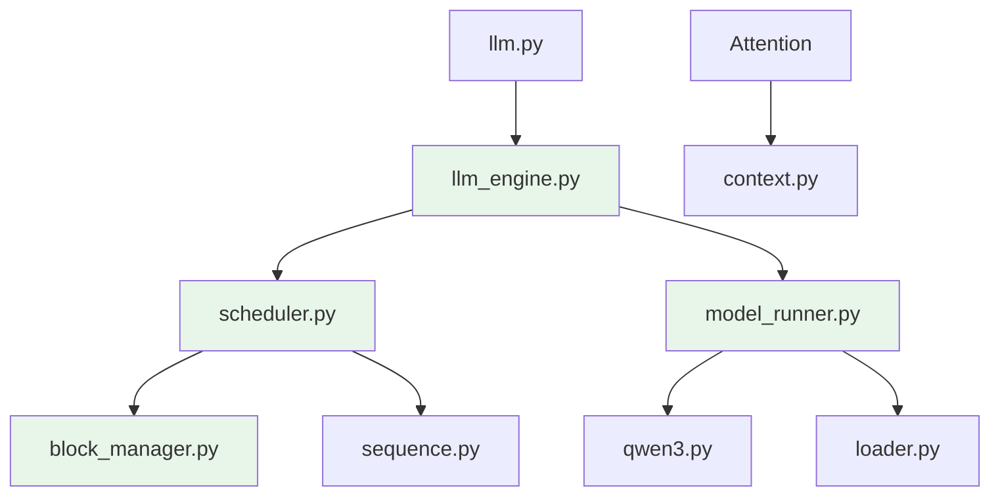
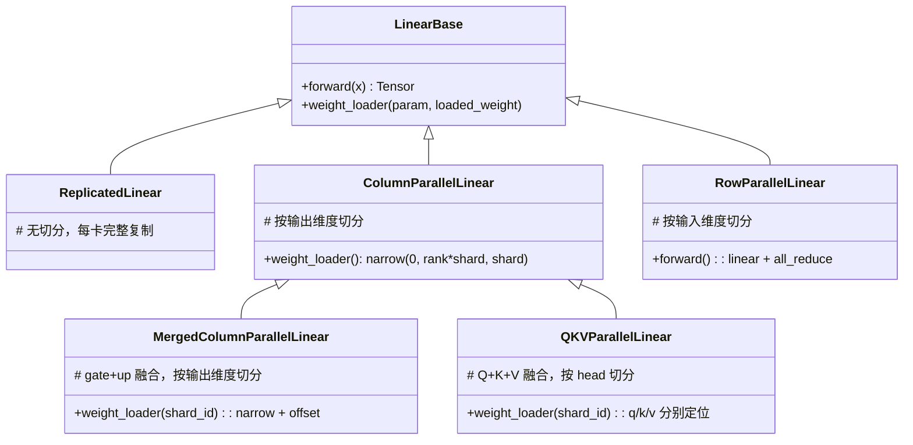
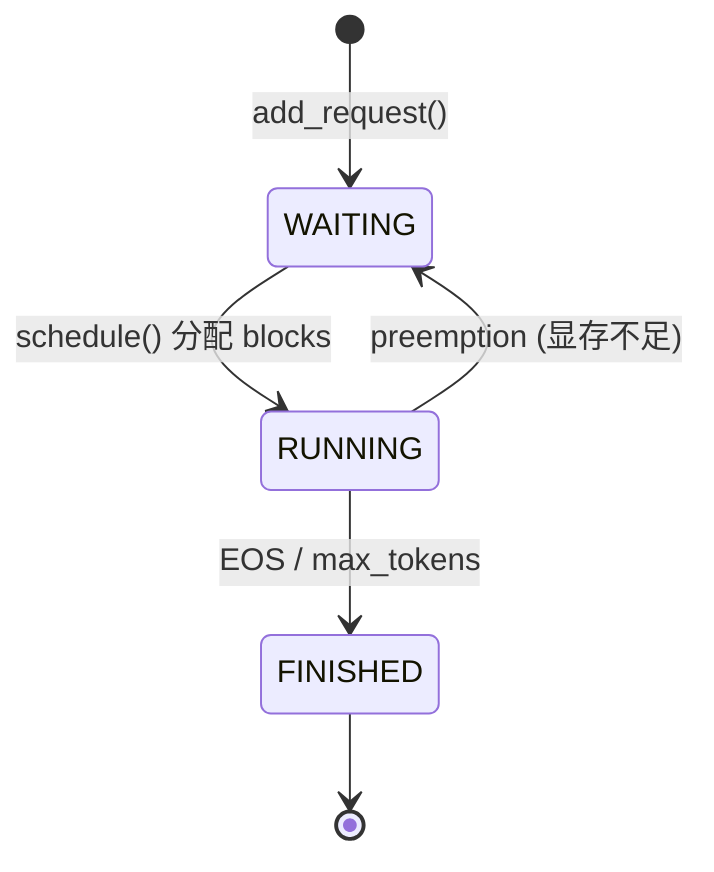
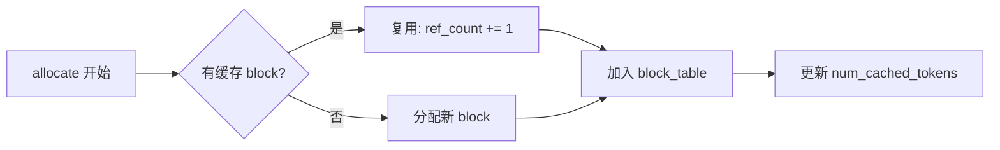
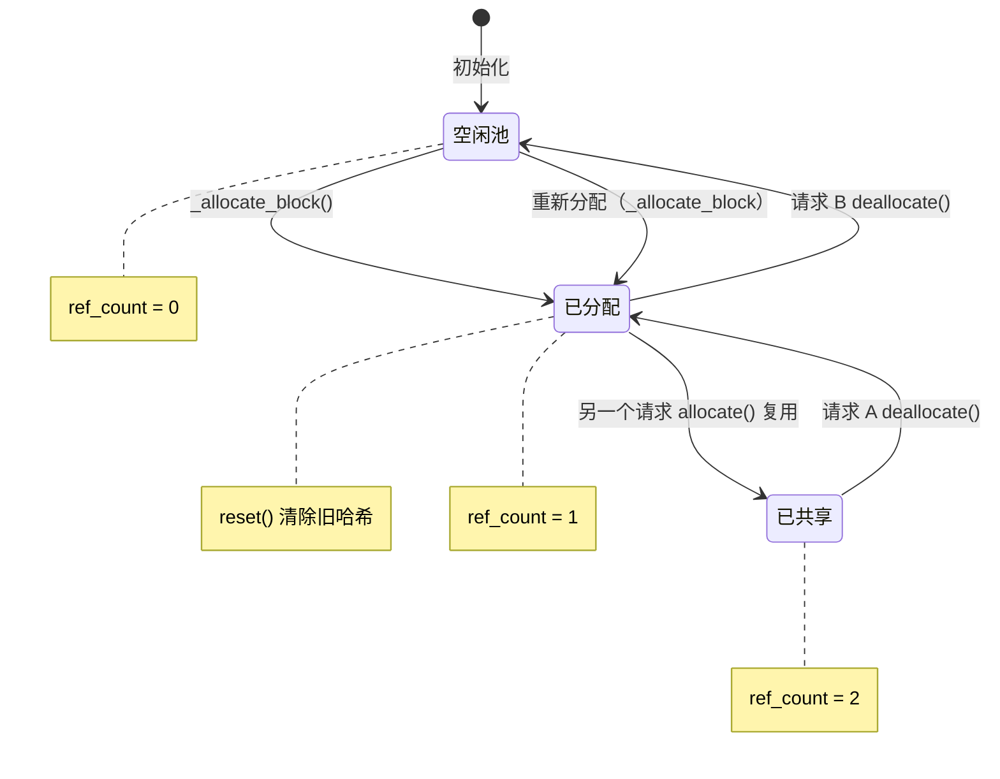
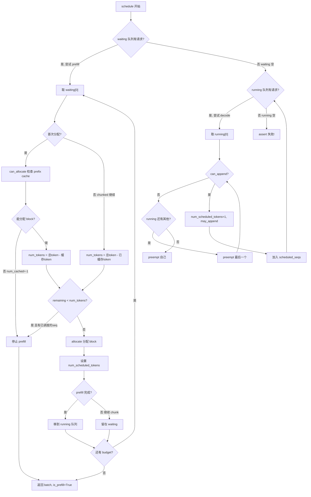
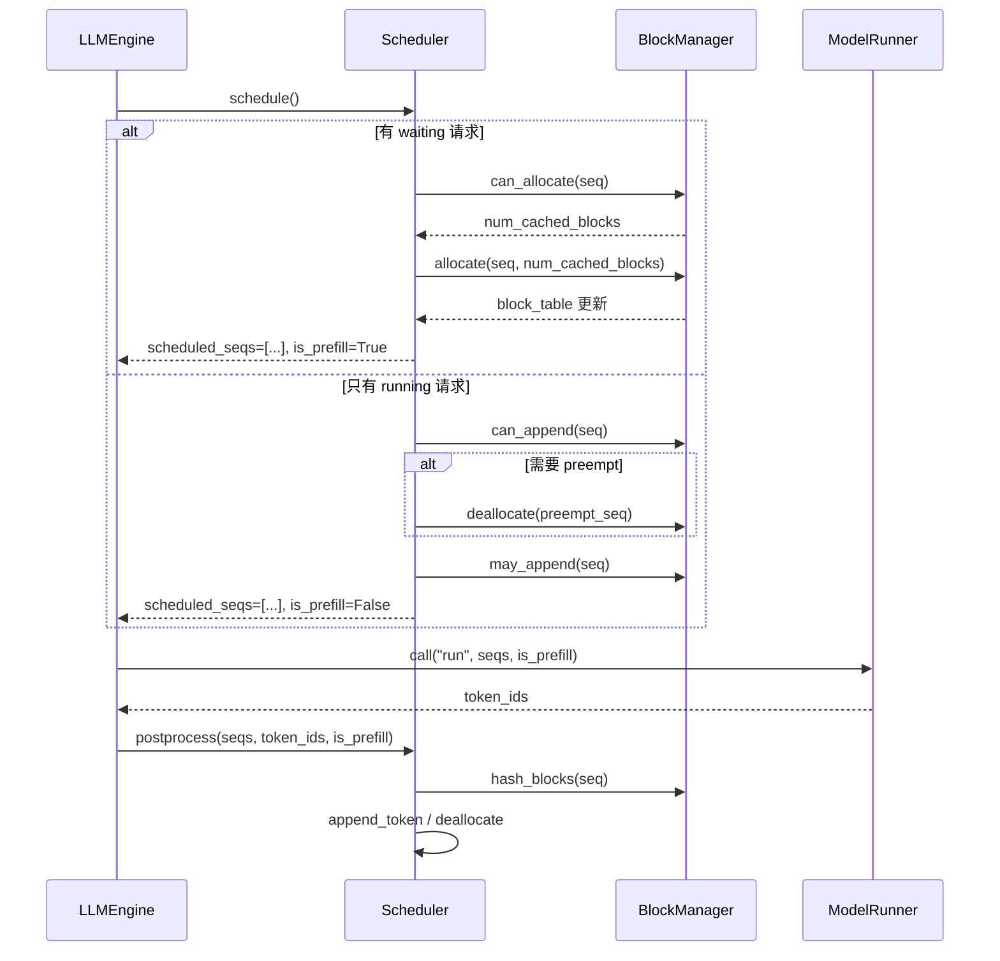
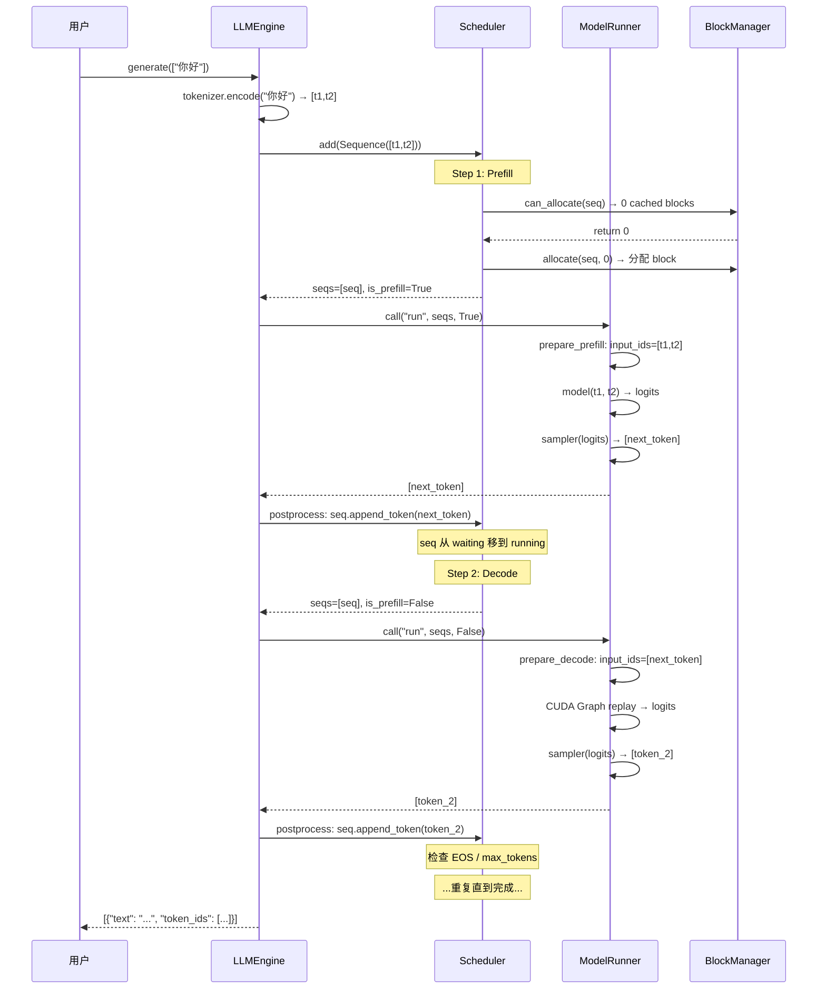

# 12. 推理加速（二）：nano-vllm — 1200 行手写 vLLM

[nano-vllm github链接](https://github.com/GeeeekExplorer/nano-vllm)

可下载放到`reference/nano-vllm`

## 概述

上一章介绍了 vLLM 的核心思想。本章用 **~1200 行 Python** 逐模块手写一个迷你 vLLM——**nano-vllm**。它只支持 Qwen3 模型，但包含了 vLLM 的所有核心机制：PagedAttention、Continuous Batching、Prefix Caching、CUDA Graph 和 Tensor Parallelism。

我们的讲解**按难度递增**，从最基础的数据结构开始，逐层向上构建完整的推理引擎。

> 本章节既是教程，也是笔者学习**nano-vllm**时候的学习笔记。本章节重点放在推理加速技巧，Block管理，调度等方向，Qwen3模型框架，项目环境等等方面不再详细阐述。

## 12.1 项目结构

```
nano-vllm/
│
├── llm.py                          # 用户入口（最外层接口）
├── config.py                       # 运行时配置
├── sampling_params.py              # 采样参数
│
├── utils/                          ── 工具层 ──
│   ├── context.py                  #   全局上下文（传递调度信息）
│   └── loader.py                   #   权重加载器
│
├── layers/                         ── 基础组件层 ──
│   ├── layernorm.py                #   RMSNorm
│   ├── activation.py               #   SiLU-and-Mul
│   ├── rotary_embedding.py         #   RoPE 旋转位置编码
│   ├── linear.py                   #   张量并行线性层
│   ├── embed_head.py               #   词嵌入 + LM Head
│   ├── sampler.py                  #   采样器
│   └── attention.py                #   Attention + paged KV cache
│
├── models/                         ── 模型层 ──
│   └── qwen3.py                    #   Qwen3 完整模型
│
└── engine/                         ── 引擎层（核心）
    ├── sequence.py                 #   序列状态管理
    ├── block_manager.py            #   分页 KV Cache + Prefix Caching
    ├── scheduler.py                #   调度器
    ├── model_runner.py             #   GPU 执行 + CUDA Graph
    └── llm_engine.py               #   顶层编排
```

### 依赖关系



下面开始讲解nano-vllm，会**先从简单的，方便理解的“外围”知识开始讲起，再一点点啃核心。**

## 12.2 采样器

### 采样参数及实现
[代码文件](https://github.com/chuoer47/LinkQwen3.5/blob/master/nano-vllm/nanovllm/sampling_params.py)

```python
@dataclass(slots=True)
class SamplingParams:
    temperature: float = 1.0
    max_tokens: int = 64
    ignore_eos: bool = False

    def __post_init__(self):
        assert self.temperature > 1e-10, "greedy sampling is not permitted"
```

为什么不允许 `temperature=0`（greedy）？因为后续的采样器使用 **Gumbel-max trick**，需要 `logits / temperature`，除以 0 会得到无穷大。实际调用各种现有LLM的API都是运行`temperature=0`，这里留意一下即可。

[代码文件](https://github.com/chuoer47/LinkQwen3.5/blob/master/nano-vllm/nanovllm/layers/sampler.py)

```python
class Sampler(nn.Module):
    @torch.compile
    def forward(self, logits, temperatures):
        logits = logits.float().div_(temperatures.unsqueeze(1))
        probs = torch.softmax(logits, dim=-1)
        # Gumbel-max trick
        sample_tokens = probs.div_(torch.empty_like(probs).exponential_(1)
                                   .clamp_min_(1e-10)).argmax(dim=-1)
        return sample_tokens
```

### Gumbel-max 原理

<details>
<summary> 原理推导 </summary>


从离散分布 \( p(x) \)（如分类分布或多项式分布）中采样，本质上等价于 Gumbel-Max 技巧。其标准数学形式为：

\[
x^* = \arg\max_{i} \left( \log p(x_i) + G_i \right), \quad G_i \sim \text{Gumbel}(0, 1)
\]

其中，\( G_i \) 为独立同分布的标准 Gumbel 噪声。该分布可通过逆变换法由均匀分布生成：

\[
G_i = -\log(-\log U_i), \quad U_i \sim \text{Uniform}(0,1)
\]

#### 1. 从标准形式到除法形式的推导

将 Gumbel 噪声的生成公式代入标准形式，对于每个候选类别 \( i \)，其比较得分为：

\[
S_i = \log p(x_i) - \log(-\log U_i)
\]

做变量替换，令 \( E_i = -\log U_i \)。根据概率论的基本变换，若 \( U_i \sim \text{Uniform}(0,1) \)，则 \( E_i \) 服从**参数为 1 的指数分布**，记作 \( E_i \sim \text{Exp}(1) \)。

代入上式并利用对数的商法则，可得：

\[
S_i = \log p(x_i) - \log(E_i) = \log\left(\frac{p(x_i)}{E_i}\right)
\]

由于 \( \log(\cdot) \) 函数在定义域内是严格单调递增的，取 \( \arg\max \) 时可以直接去掉外层对数，不影响最优下标的选择。因此，最终的等价形式化简为：

\[
\boxed{x^* = \arg\max_{i} \frac{p(x_i)}{E_i}}, \quad E_i \sim \text{Exp}(1)
\]

#### 2. 这种等价转换的工程意义

在实际代码实现（如 PyTorch、NumPy 或 JAX）中，采用除法形式而非标准对数加噪声形式，主要带来以下几方面的显著收益：

- **减少对数运算次数**：标准方法需要对概率取对数（\( \log p \)）并对均匀分布取两次对数（\( -\log(-\log U) \)），而除法形式仅需生成指数随机数并执行一次除法，在需要大规模采样（如 Transformer 序列解码或强化学习动作选择）时能有效降低计算开销。

- **提升数值稳定性**：当原始概率 \( p(x_i) \) 极端小（如 \( 10^{-30} \)）时，取对数会得到很大的负数（如 -69），再加上 Gumbel 噪声，可能会因浮点数精度导致有效位数丢失。而除法形式让数值始终保持在原始概率的尺度上（通常为 \( [0,1] \) 量级），对抗下溢（Underflow）更加鲁棒。

- **规避边界值风险**：标准 Gumbel 生成涉及 \( -\log(-\log U) \)，一旦 \( U \) 极其接近 0，数值结果会迅速趋向正无穷，引发计算异常。虽然指数分布生成 \( E = -\log U \) 同样面临 \( U \to 0 \) 的风险，但现代高效的指数分布随机数生成器（如 Ziggurat 算法）通常能妥善处理这一边界，或直接避免调用可能导致除零的原始均匀分布采样。

#### 3. 实现时的关键注意事项

在将其转化为代码时，务必严格遵守以下两条原则，否则算法将失效：

1. **严格独立采样**：对于每个下标 \( i \)，其对应的指数随机数 \( E_i \) 必须是**独立生成**的。绝不能只生成一个全局的指数随机数供所有类别共用，否则会彻底破坏采样的随机性。

2. **明确区分符号含义**：公式中的 \( \text{Exp}(1) \) **特指一个随机变量（从指数分布抽取的样本）**，而非数学常数欧拉数 \( e \approx 2.718 \)。若误写为除以常数 \( e \)，则 \( p(x_i)/e \) 的 \( \arg\max \) 永远只会选择概率最大的类别，使采样退化为确定性取最大值（Argmax），完全丧失了随机采样的意义。
</details>

**总结一句话：**

Gumbel 噪声在对数概率空间表现为**加法噪声**（\( \log p + G \)）；由于 Gumbel 噪声可等效为指数分布随机变量的负对数（\( G = -\log E \)），映射到原始概率空间后，加法噪声就巧妙地转化为了**除法噪声**（\( p / E \)）。这一变换使得采样代码更加简洁、数值更加稳定，同时保持了严格的数学等价性。

## 12.3 权重加载

有关权重加载的基本概念可以去[8_权重适配.md](./08-权重适配.md)查看。

nano-vllm对于权重加载的一个优化点就是**融合权重**，下面展开讲解：

### 核心挑战：权重融合

训练时 Q、K、V 是三个独立的 Linear：

$$Q = W_q \cdot x, \quad K = W_k \cdot x, \quad V = W_v \cdot x$$

推理时将它们**融合成一个 QKV Linear**，一次 kernel 调用完成（原先3次->融合后1次）：

$$QKV = W_{qkv} \cdot x, \quad W_{qkv} = [W_q; W_k; W_v]$$

这要求 loader 在加载 checkpoint 时，把 `q_proj.weight`、`k_proj.weight`、`v_proj.weight` 拼接到 `qkv_proj.weight` 的正确位置。

### packed_modules_mapping

[代码文件](https://github.com/chuoer47/LinkQwen3.5/blob/master/nano-vllm/nanovllm/models/qwen3.py)

```python
class Qwen3ForCausalLM(nn.Module):
    packed_modules_mapping = {
        "q_proj": ("qkv_proj", "q"),     # checkpoint 名 → (模型参数名, shard_id)
        "k_proj": ("qkv_proj", "k"),
        "v_proj": ("qkv_proj", "v"),
        "gate_proj": ("gate_up_proj", 0), # MLP gate/up 也融合
        "up_proj": ("gate_up_proj", 1),
    }
```

### 加载流程

该步骤就是将权重文件加载到自定义的Qwen模型上面。

```python
def load_model(model, path):
    packed_modules_mapping = getattr(model, "packed_modules_mapping", {})
    for file in glob(os.path.join(path, "*.safetensors")):
        with safe_open(file, "pt", "cpu") as f:
            for weight_name in f.keys():
                for k in packed_modules_mapping:
                    if k in weight_name:
                        v, shard_id = packed_modules_mapping[k]
                        param_name = weight_name.replace(k, v)  # 替换参数名
                        param = model.get_parameter(param_name)
                        weight_loader = getattr(param, "weight_loader", default_weight_loader)
                        weight_loader(param, f.get_tensor(weight_name), shard_id)
                        break
```

`weight_loader` 是每个参数上挂载的**自定义加载函数**，由 `linear.py` 的 `QKVParallelLinear` 或 `MergedColumnParallelLinear` 设置（后续会介绍这些linear）。它负责按 `shard_id` 把权重放到正确的位置，并处理 TP 分片。

### QKVParallelLinear 的 weight_loader

关键点就在offset的理解！

```python
def weight_loader(self, param, loaded_weight, loaded_shard_id):
    if loaded_shard_id == "q":
        shard_size = self.num_heads * self.head_size
        shard_offset = 0
    elif loaded_shard_id == "k":
        shard_size = self.num_kv_heads * self.head_size
        shard_offset = self.num_heads * self.head_size
    else:  # "v"
        shard_size = self.num_kv_heads * self.head_size
        shard_offset = self.num_heads * self.head_size + self.num_kv_heads * self.head_size
    param_data = param_data.narrow(self.tp_dim, shard_offset, shard_size)
    loaded_weight = loaded_weight.chunk(self.tp_size, self.tp_dim)[self.tp_rank]
    param_data.copy_(loaded_weight)
```

可视化：

```
qkv_proj.weight 的内存布局:
┌─────────────────────────────┬──────────────┬──────────────┐
│    q_proj (8 × 256 = 2048)  │ k (2 × 256)  │ v (2 × 256)  │
│          shard_id="q"       │ shard_id="k" │ shard_id="v" │
└─────────────────────────────┴──────────────┴──────────────┘
```

## 12.4 张量并行线性层

[代码文件](https://github.com/chuoer47/LinkQwen3.5/blob/master/nano-vllm/nanovllm/layers/linear.py)

nano-vllm 实现了 5 种线性层，**适配不同的切分需求**（不同并行策略需求）：



### 切分策略

| 层 | 切分方式 | 输入维度 | 输出维度 | 通信 |
|---|---------|---------|---------|------|
| `qkv_proj` | Column (head) | hidden_size | q_size + 2×kv_size | 无 |
| `o_proj` | Row | head_dim × num_heads | hidden_size | all_reduce |
| `gate_up_proj` | Column | hidden_size | 2 × intermediate_size | 无 |
| `down_proj` | Row | intermediate_size | hidden_size | all_reduce |

### VocabParallelEmbedding：词嵌入并行

Embedding层也进行切分。

原理：词表被切成 `tp_size` 片，每卡只存 `vocab_size / tp_size` 个 embedding。每个 token 只在对应的卡上有非零值，all_reduce 后等价于完整 embedding lookup。

```python
class VocabParallelEmbedding(nn.Module):
    def __init__(self, num_embeddings, embedding_dim):
        self.num_embeddings_per_partition = num_embeddings // tp_size
        self.weight = nn.Parameter(torch.empty(num_embeddings // tp_size, embedding_dim))

    def forward(self, x):
        if self.tp_size > 1:
            # 将超出本卡词表范围的 token ID 置零
            mask = (x >= self.vocab_start_idx) & (x < self.vocab_end_idx)
            x = mask * (x - self.vocab_start_idx)
        y = F.embedding(x, self.weight)
        if self.tp_size > 1:
            y = mask.unsqueeze(1) * y
            dist.all_reduce(y)  # 各卡结果求和
        return y
```


## 12.5 nano-vllm 配置类

前面讲述了采样器，权重加载和适应各类并行的线性层。后面的内容将继续深入各类推理加速技巧，但是在深入前，我们需要知道一些配置类。

### Config：运行时配置

[代码文件](https://github.com/chuoer47/LinkQwen3.5/blob/master/nano-vllm/nanovllm/config.py)

```python
@dataclass(slots=True)
class Config:
    model: str                                   # 模型路径
    max_num_batched_tokens: int = 16384          # 单步最多处理多少 token
    max_num_seqs: int = 512                      # 单步最多多少请求
    max_model_len: int = 4096                    # 最大序列长度
    gpu_memory_utilization: float = 0.9          # GPU 显存利用率
    tensor_parallel_size: int = 1                # 张量并行卡数
    enforce_eager: bool = False                  # 是否禁用 CUDA Graph
    kvcache_block_size: int = 256                # KV Cache block 大小
```

`max_num_batched_tokens` 控制调度器的**预算**：每个 prefill step 最多处理这么多 token。超过的用 chunked prefill 分步处理。

### Context：全局上下文

[代码文件](https://github.com/chuoer47/LinkQwen3.5/blob/master/nano-vllm/nanovllm/utils/context.py)

模型的每一层（Attention、LM Head）都需要知道当前是 prefill 还是 decode、KV Cache 的位置信息等。为了避免层层传递参数，使用一个**全局 Context 对象**：

```python
@dataclass(slots=True)
class Context:
    is_prefill: bool = False          # 当前是 prefill 还是 decode
    cu_seqlens_q: Tensor | None = None  # Q 的累积序列长度（FlashAttention varlen）
    cu_seqlens_k: Tensor | None = None  # K 的累积序列长度
    max_seqlen_q: int = 0             # 本 batch 最长 Q 序列
    max_seqlen_k: int = 0             # 本 batch 最长 K 序列
    slot_mapping: Tensor | None = None  # token → 物理 KV Cache 位置
    context_lens: Tensor | None = None  # 每个序列的总长度（decode 用）
    block_tables: Tensor | None = None  # 每个序列的 block table（decode 用）

_CONTEXT = Context()  # 全局单例
```

使用方式：`ModelRunner.run()` 在执行前调用 `set_context()`，执行后调用 `reset_context()`。模型的 `forward()` 内部通过 `get_context()` 读取。

### Sequence：序列状态（重点）

[代码文件](https://github.com/chuoer47/LinkQwen3.5/blob/master/nano-vllm/nanovllm/engine/sequence.py)

**每个用户请求**被封装为一个 `Sequence` 对象：

```python
class Sequence:
    block_size = 256
    counter = count()  # 全局自增 ID

    def __init__(self, token_ids, sampling_params):
        self.seq_id = next(Sequence.counter)
        self.status = SequenceStatus.WAITING
        self.token_ids = copy(token_ids)       # 完整 token 列表
        self.num_tokens = len(token_ids)        # 当前总长度
        self.num_prompt_tokens = len(token_ids) # prompt 长度
        self.num_cached_tokens = 0              # 已缓存到 KV Cache 的 token 数
        self.num_scheduled_tokens = 0           # 本步计划处理的 token 数
        self.block_table = []                   # 物理 block ID 列表
```

关键属性：

| 属性 | 含义 | 用途 |
|------|------|------|
| `num_tokens` | 当前总长度（prompt + 已生成） | 计算需要多少 block |
| `num_cached_tokens` | 已在 KV Cache 中的 token 数 | prefix cache 跳过 |
| `num_scheduled_tokens` | 本步要处理的 token 数 | 调度器设置 |
| `block_table` | 物理 block 映射表 | Attention 读写 KV Cache |

状态机：



> 跨进程序列化：nano-vllm 用 `SharedMemory` + `pickle` 做 TP 的进程间通信。`Sequence.__getstate__` 实现了高效序列化——decode 时只传 `last_token`（1 个 int），不传整个 `token_ids` 列表。

## 12.6 Attention 层：Paged KV Cache（重点）

[代码文件](https://github.com/chuoer47/LinkQwen3.5/blob/master/nano-vllm/nanovllm/layers/attention.py)

这是整个推理引擎最核心的组件。nano-vllm 没有自己对 Attention 计算进行加速，而是选择利用成熟的 FlashAttention 库加速。

### Prefill vs Decode的Attention计算

```python
def store_kvcache(key: torch.Tensor, value: torch.Tensor, k_cache: torch.Tensor, v_cache: torch.Tensor, slot_mapping: torch.Tensor):
    N, num_heads, head_dim = key.shape
    D = num_heads * head_dim
    assert key.stride(-1) == 1 and value.stride(-1) == 1
    assert key.stride(1) == head_dim and value.stride(1) == head_dim
    assert k_cache.stride(1) == D and v_cache.stride(1) == D
    assert slot_mapping.numel() == N
    store_kvcache_kernel[(N,)](key, key.stride(0), value, value.stride(0), k_cache, v_cache, slot_mapping, D)


class Attention(nn.Module):
    def forward(self, q, k, v):
        context = get_context() # 获取上下文/更新上下文
        k_cache, v_cache = self.k_cache, self.v_cache

        # 1. 将 K, V 写入 paged KV Cache
        if k_cache.numel():
            store_kvcache(k, v, k_cache, v_cache, context.slot_mapping)

        if context.is_prefill: # 计算密集
            # 2a. Prefill: FlashAttention varlen
            if context.block_tables is not None:  # prefix cache
                k, v = k_cache, v_cache  # 直接从 cache 读取
            o = flash_attn_varlen_func(q, k, v,
                cu_seqlens_q=context.cu_seqlens_q,
                cu_seqlens_k=context.cu_seqlens_k,
                max_seqlen_q=context.max_seqlen_q,
                max_seqlen_k=context.max_seqlen_k,
                softmax_scale=self.scale, causal=True,
                block_table=context.block_tables)
        else: # memory密集
            # 2b. Decode: FlashAttention with paged KV cache
            o = flash_attn_with_kvcache(q.unsqueeze(1), k_cache, v_cache,
                cache_seqlens=context.context_lens,
                block_table=context.block_tables,
                softmax_scale=self.scale, causal=True)
        return o
```

| | Prefill | Decode |
|---|---------|--------|
| Q 形状 | `[total_tokens, num_heads, head_dim]` | `[batch, 1, num_heads, head_dim]` |
| K/V 来源 | 直接传入 | 从 paged KV Cache 读取 |
| FlashAttn 函数 | `flash_attn_varlen_func` | `flash_attn_with_kvcache` |
| 为什么 | 处理变长序列 | 只处理 1 个 token，需要 paged 读取 |

<details>
<summary>📝 FlashAttention 函数参数速查</summary>

#### `flash_attn_varlen_func` — Prefill 用

```python
flash_attn_varlen_func(
    q, k, v,                          # Q, K, V: (total_tokens, num_heads, head_dim)
    cu_seqlens_q,                     # Q 的累积序列长度: [0, len_A, len_A+len_B, ...]
    cu_seqlens_k,                     # K 的累积序列长度（可以和 Q 不同）
    max_seqlen_q,                     # 本 batch 中 Q 的最大长度
    max_seqlen_k,                     # 本 batch 中 K 的最大长度
    softmax_scale,                    # 缩放因子 = 1/√head_dim
    causal=True,                      # 因果掩码
    block_table=None,                 # prefix cache 时传入页表
)
→ output: (total_tokens, num_heads, head_dim)
```

**核心思想**：多个不同长度的序列**拼接成一个 tensor**，通过 `cu_seqlens` 标记边界。每个序列内部独立做 causal attention，序列之间不交互。底层用 FlashAttention kernel 高效实现，避免 materialize 完整的 attention matrix。

#### `flash_attn_with_kvcache` — Decode 用

```python
flash_attn_with_kvcache(
    q,                                 # Q: (batch, 1, num_heads, head_dim)
    k_cache,                          # K 缓存: (num_layers, num_blocks, block_size, num_kv_heads, head_dim)
    v_cache,                          # V 缓存: (同上)
    cache_seqlens,                    # 每个序列的已缓存长度: (batch,)
    block_table,                      # 页表: (batch, max_num_blocks)
    softmax_scale,                    # 缩放因子
    causal=True,
)
→ output: (batch, 1, num_heads, head_dim)
```

**核心思想**：Q 只有 1 个 token（最后生成的），K/V 从 **paged KV Cache** 中按 `block_table` 读取。底层 kernel 根据 `block_table` 做间接寻址，把分散在不同物理 block 中的 K/V 拼接起来做 attention。

</details>

### FlashAttention varlen 的 cu_seqlens

`flash_attn_varlen_func` 在一个 batch 中处理**不同长度的序列**，通过 `cu_seqlens` 指定每个序列的边界：

```
3 个序列拼接成一个 batch:
  序列 A: [t1, t2, t3]           (长度 3)
  序列 B: [t4, t5, t6, t7, t8]  (长度 5)
  序列 C: [t9, t10]              (长度 2)

A+B+C:[t1, t2, t3, t4, t5, t6, t7, t8, t9, t10]   

cu_seqlens_q = [0, 3, 8, 10]
0：序列A的起点
3：序列A的终点，序列B起点
8：序列B的终点，序列C起点
10：序列C的终点
```

`cu_seqlens_q` 和 `cu_seqlens_k` 可以不同——当使用 prefix cache 时，Q 的有效长度（新 token）比 K 的有效长度（包含缓存）短。

### Triton KV Cache Store Kernel（选读）

```python
@triton.jit
def store_kvcache_kernel(key_ptr, key_stride, value_ptr, value_stride,
                         k_cache_ptr, v_cache_ptr, slot_mapping_ptr, D):
    idx = tl.program_id(0)              # 每个 program 处理 1 个 token
    slot = tl.load(slot_mapping_ptr + idx)
    if slot == -1:
        return                           # padding slot, skip

    # 读取该 token 的 K 和 V
    key = tl.load(key_ptr + idx * key_stride + tl.arange(0, D))
    value = tl.load(value_ptr + idx * value_stride + tl.arange(0, D))

    # 写入 KV Cache 的物理位置
    tl.store(k_cache_ptr + slot * D + tl.arange(0, D), key)
    tl.store(v_cache_ptr + slot * D + tl.arange(0, D), value)
```

`slot_mapping` 告诉每个 token 应该写入 KV Cache 的哪个物理位置：

$$\text{slot} = \text{block\_table}[\text{token\_idx} // \text{block\_size}] \times \text{block\_size} + \text{token\_idx} \% \text{block\_size}$$

`slot_mapping = -1` 是 padding 位置（CUDA Graph 对齐用），Triton kernel 会跳过。


## 12.7 ModelRunner：GPU 执行引擎

[代码文件](https://github.com/chuoer47/LinkQwen3.5/blob/master/nano-vllm/nanovllm/engine/model_runner.py)

### 初始化流程

1. init_process_group
2. 创建 Qwen3ForCausalLM
3. load_model 加载权重
4. warmup_model 测显存
5. allocate_kv_cache
6. enforce_eager
   - 否：capture_cudagraph
   - 是：完成

### KV Cache 分配

```python
def allocate_kv_cache(self):
    free, total = torch.cuda.mem_get_info()
    used = total - free
    peak = torch.cuda.memory_stats()["allocated_bytes.all.peak"]
    current = torch.cuda.memory_stats()["allocated_bytes.all.current"]

    # 每个 block 的字节数: 2(K+V) × num_layers × block_size × num_kv_heads × head_dim × dtype_bytes
    block_bytes = 2 * hf_config.num_hidden_layers * self.block_size * \
                  num_kv_heads * head_dim * hf_config.dtype.itemsize

    # 可用显存 = 总量 × 利用率 - 已用 - 峰值 + 当前
    config.num_kvcache_blocks = int(total * gpu_memory_utilization - used - peak + current) // block_bytes

    # 分配连续 tensor
    self.kv_cache = torch.empty(2, num_layers, num_blocks, block_size, num_kv_heads, head_dim)
    #   ↑ [0]=k_cache, [1]=v_cache

    # 将 view 分配给每个 Attention 模块
    layer_id = 0
    for module in self.model.modules():
        if hasattr(module, "k_cache"):
            module.k_cache = self.kv_cache[0, layer_id]
            module.v_cache = self.kv_cache[1, layer_id]
            layer_id += 1
```

### Prefill 输入构造

```python
def prepare_prefill(self, seqs):
    input_ids, positions = [], []
    cu_seqlens_q, cu_seqlens_k = [0], [0]
    slot_mapping = []

    for seq in seqs:
        start = seq.num_cached_tokens          # prefix cache 跳过
        end = start + seq.num_scheduled_tokens  # 本次范围
        input_ids.extend(seq[start:end])
        positions.extend(range(start, end))
        cu_seqlens_q.append(cu_seqlens_q[-1] + (end - start))
        cu_seqlens_k.append(cu_seqlens_k[-1] + end)

        # 计算每个 token 的物理位置
        for i in range(start_block, end_block):
            slot_start = seq.block_table[i] * block_size
            if i == start_block:
                slot_start += start % block_size
            if i != end_block - 1:
                slot_end = seq.block_table[i] * block_size + block_size
            else:
                slot_end = seq.block_table[i] * block_size + end - i * block_size
            slot_mapping.extend(range(slot_start, slot_end))

    set_context(True, cu_seqlens_q, cu_seqlens_k, ..., slot_mapping, block_tables)
```

`slot_mapping` 的作用：告诉 Triton kernel 每个 token 的 K/V 应该写入 KV Cache 的哪个物理 slot。

### Decode 输入构造

```python
def prepare_decode(self, seqs):
    for seq in seqs:
        input_ids.append(seq.last_token)       # 只取最后一个 token
        positions.append(len(seq) - 1)          # 位置 = 总长度 - 1
        context_lens.append(len(seq))           # 总长度（用于 flash_attn_with_kvcache）
        slot_mapping.append(seq.block_table[-1] * block_size + seq.last_block_num_tokens - 1)

    set_context(False, slot_mapping=slot_mapping, context_lens=context_lens, block_tables=block_tables)
```

### CUDA Graph 捕获与重放

```python
def capture_cudagraph(self):
    self.graph_bs = [1, 2, 4, 8] + list(range(16, max_bs + 1, 16))
    self.graphs = {}
    self.graph_pool = None

    for bs in reversed(self.graph_bs):
        graph = torch.cuda.CUDAGraph()
        # Warmup (在 graph 外执行一次)
        set_context(False, slot_mapping=slot_mapping[:bs], ...)
        outputs[:bs] = self.model(input_ids[:bs], positions[:bs])
        # Capture
        with torch.cuda.graph(graph, self.graph_pool):
            outputs[:bs] = self.model(input_ids[:bs], positions[:bs])
        if self.graph_pool is None:
            self.graph_pool = graph.pool()
        self.graphs[bs] = graph

def run_model(self, input_ids, positions, is_prefill):
    if is_prefill or self.enforce_eager:
        return self.model.compute_logits(self.model(input_ids, positions))
    else:
        bs = input_ids.size(0)
        graph = self.graphs[next(x for x in self.graph_bs if x >= bs)]
        # 拷贝输入到 graph buffer
        graph_vars["input_ids"][:bs] = input_ids
        graph_vars["positions"][:bs] = positions
        graph_vars["slot_mapping"].fill_(-1)  # 先清零
        graph_vars["slot_mapping"][:bs] = context.slot_mapping
        graph.replay()  # 一次调用，所有 kernel 一起执行
        return self.model.compute_logits(graph_vars["outputs"][:bs])
```

`graph_pool` 是共享的 CUDA memory pool，所有 batch size 的 graph 共用，避免重复分配显存。


## 12.8 BlockManager：分页 KV Cache + Prefix Caching（重点）

前面几个章节，讲解模型如何利用多卡推理加速，如何利用KV Cache完成推理。

但是，我们一直没有深入到 PagedAttention 的精髓。参考 OS 中的内存管理，vLLM 实现了**逻辑地址和物理地址分离**——每个请求看到的是连续的逻辑 block，但这些 block 在 GPU 显存中可以分散存储。这一小节，我们将逐方法讲解 BlockManager 的完整源码。

[代码文件](https://github.com/chuoer47/LinkQwen3.5/blob/master/nano-vllm/nanovllm/engine/block_manager.py)

### Block：物理存储的抽象

```python
class Block:
    def __init__(self, block_id):
        self.block_id = block_id      # 物理 block 编号（0, 1, 2, ...）
        self.ref_count = 0            # 引用计数
        self.hash = -1                # 内容哈希（-1 表示未计算）
        self.token_ids = []           # 该 block 存储的 token IDs
```

Block 是 KV Cache 的**最小分配单位**。一个 block 存储 `block_size` 个 token 的 K/V 向量。nano-vllm 中 `block_size = 256`，即每个 block 存 256 个 token 的 KV Cache。

类比 OS：

| OS 概念 | BlockManager 对应 |
|---------|------------------|
| 页帧 (Page Frame) | Block（物理 block） |
| 页表 (Page Table) | seq.block_table |
| 虚拟页号 | 逻辑 block 序号 |
| 物理页号 | block.block_id |
| 引用计数 | block.ref_count |

```python
def update(self, hash, token_ids):
    self.hash = hash
    self.token_ids = token_ids

def reset(self):
    self.ref_count = 1       # 新分配的 block 引用计数为 1
    self.hash = -1           # 清空哈希
    self.token_ids = []      # 清空 token_ids
```

`update()` 在 `hash_blocks()` 中调用，为已填满的 block 记录内容哈希和 token_ids。`reset()` 在分配新 block 时调用，初始化为"刚使用"状态。

### BlockManager：核心数据结构

```python
class BlockManager:
    def __init__(self, num_blocks, block_size):
        self.block_size = block_size
        self.blocks = [Block(i) for i in range(num_blocks)]  # 所有物理 block
        self.hash_to_block_id: dict[int, int] = {}           # 哈希 → block_id（prefix cache 索引）
        self.free_block_ids = deque(range(num_blocks))        # 空闲 block 池（双端队列）
        self.used_block_ids = set()                            # 已用 block 集合
```

三个关键数据结构的关系：

```
BlockManager 初始化后 (num_blocks=8):
┌─────────────────────────────────────────────────────────┐
│ blocks: [Block(0), Block(1), Block(2), ..., Block(7)]   │
│                                                         │
│ free_block_ids: deque([0, 1, 2, 3, 4, 5, 6, 7])         │
│ used_block_ids: set()                                   │
│ hash_to_block_id: {}                                    │
└─────────────────────────────────────────────────────────┘

分配 block 0, 1, 2 给请求 A 后:
┌─────────────────────────────────────────────────────────┐
│ free_block_ids: deque([3, 4, 5, 6, 7])                  │
│ used_block_ids: {0, 1, 2}                               │
│ hash_to_block_id: {H0: 0, H1: 1, H2: 2}                 │
└─────────────────────────────────────────────────────────┘

请求 B 复用 block 0, 1（prefix cache），分配新 block 3:
┌─────────────────────────────────────────────────────────┐
│ free_block_ids: deque([4, 5, 6, 7])                     │
│ used_block_ids: {0, 1, 2, 3}                            │
│ hash_to_block_id: {H0: 0, H1: 1, H2: 2, H2': 3}         │
│                                                         │
│ Block(0).ref_count = 2  ← 被 A 和 B 共享                │
│ Block(1).ref_count = 2  ← 被 A 和 B 共享                │
│ Block(2).ref_count = 1  ← 只有 A                        │
│ Block(3).ref_count = 1  ← 只有 B                        │
└─────────────────────────────────────────────────────────┘
```

### `compute_hash()`：链式哈希

```python
@classmethod
def compute_hash(cls, token_ids, prefix=-1):
    h = xxhash.xxh64()
    if prefix != -1:
        h.update(prefix.to_bytes(8, "little"))  # 把前一个 block 的哈希作为前缀
    h.update(np.array(token_ids).tobytes())     # 当前 block 的 token IDs
    return h.intdigest()
```

**为什么用链式哈希？** 如果只对当前 block 的 token_ids 哈希，那么两个内容相同的 block（不管位置在哪）都会命中缓存。但实际上，block 的内容必须**上下文一致**——前缀不同，即使 token 相同，KV Cache 也不同（因为 RoPE 位置编码不同）。

链式哈希保证：只有**前缀完全相同**的 block 才能复用。

$$H_i = \text{xxhash}(H_{i-1} \| \text{token\_ids}_i)$$

其中 $H_{-1} = -1$（常量），$\|$ 表示字节拼接。

```
请求 A: tokens = [t1,t2,t3, | t4,t5,t6, | t7,t8,t9, | t10,t11]
                 Block 0     Block 1        Block 2   Block 3
                 H0=xx(t1-3) H1=xx(H0,t4-6) H2=xx(H1,t7-9) H3=xx(H2,t10-11)

请求 B: tokens = [t1,t2,t3, | t4,t5,t6, | t12,t13,t14]
                  Block 0     Block 1     Block 2'
                  H0 相同!     H1 相同!    H2'=xx(H1,t12-14) ← 不同

Block 0, 1 可以共享！请求 B 只需 prefill Block 2' 的新内容。
```

### `_allocate_block()`：分配一个物理 block

```python
def _allocate_block(self) -> int:
    block_id = self.free_block_ids.popleft()   # 从空闲池取一个
    block = self.blocks[block_id]
    assert block.ref_count == 0                 # 断言：必须是空闲的
    if block.hash != -1 and self.hash_to_block_id.get(block.hash) == block_id:
        del self.hash_to_block_id[block.hash]  # 清除旧哈希索引
    block.reset()                              # 初始化：ref_count=1, hash=-1, token_ids=[]
    self.used_block_ids.add(block_id)
    return block_id
```

**关键细节**：为什么要清除旧哈希索引？

如果一个 block 被释放后重新分配，它的内容会被覆盖。旧的哈希索引会指向错误的内容，必须删除。否则后续 `can_allocate()` 查找哈希时会命中一个内容已变的 block。

```
时间线:
1. Block(5) 存储了 [t1,t2,t3,t4]，hash = H100
   hash_to_block_id[H100] = 5

2. Block(5) 被 deallocate（ref_count=0）
   free_block_ids: [..., 5]
   hash_to_block_id[H100] = 5  ← 还保留着！

3. Block(5) 被 _allocate_block() 重新分配
   如果不清除 → hash_to_block_id[H100] = 5
   但 Block(5) 的内容已经被新 token 覆盖！
   → 后续 can_allocate() 查到 H100 对应 block 5，但内容已变
   → 数据损坏！
```

### `_deallocate_block()`：释放一个物理 block

```python
def _deallocate_block(self, block_id):
    assert self.blocks[block_id].ref_count == 0  # 断言：引用计数必须为 0
    self.used_block_ids.remove(block_id)
    self.free_block_ids.append(block_id)         # 放回空闲池
```

注意：`_deallocate_block` **不清除 block 的 hash 和 token_ids**。这是不是存在和前面删除hash存在矛盾？并不是，这是有意为之。即使当前引用=0删除后，保留block 的 hash 和 token_ids，如果后续又有需要，只需要简单地通过hash给引用+1，就相当于恢复Block了，使得后续请求复用（prefix cache）。只有当 block 被 `_allocate_block()` 重新分配时，才会调用 `reset()` 清除。

### `can_allocate()`：检查能否分配

```python
def can_allocate(self, seq) -> int:
    h = -1
    num_cached_blocks = 0
    num_new_blocks = seq.num_blocks
    for i in range(seq.num_blocks - 1):      # 注意：跳过最后一个 block
        token_ids = seq.block(i)
        h = self.compute_hash(token_ids, h)
        block_id = self.hash_to_block_id.get(h, -1)
        if block_id == -1 or self.blocks[block_id].token_ids != token_ids:
            break                              # 哈希不匹配或内容不匹配
        num_cached_blocks += 1
        if block_id in self.used_block_ids:
            num_new_blocks -= 1                # 已被其他请求占用，共享即可
    if len(self.free_block_ids) < num_new_blocks:
        return -1                              # 空闲 block 不够
    return num_cached_blocks
```

**返回值含义**：
- `num_cached_blocks`：已有多少 block 可以通过 prefix cache 复用
- `-1`：空闲 block 不够，需要 preempt

**为什么跳过最后一个 block？**

最后一个 block 可能没填满（比如序列长度不是 block_size 的整数倍）。未填满的 block 不应该被缓存（内容不完整），所以不检查它的哈希。

**双重检查（哈希 + token_ids）**：

哈希碰撞是可能的——两个不同的 token_ids 序列可能产生相同的 xxhash 值。所以检查 `self.blocks[block_id].token_ids != token_ids` 做内容验证，确保不会因为哈希碰撞加载错误的数据。

**计算实际需要的新 block 数**：

```
请求 B 需要 3 个 block:
  Block 0: 哈希匹配 + 已被占用 → 共享，不需要新分配
  Block 1: 哈希匹配 + 已被占用 → 共享，不需要新分配
  Block 2: 哈希不匹配 → 需要新分配

num_cached_blocks = 2
num_new_blocks = 3 - 2 = 1  （实际只需 1 个新 block）
free_block_ids 有足够空间 → 返回 2
```

### `allocate()`：分配 block

```python
def allocate(self, seq, num_cached_blocks):
    assert not seq.block_table                 # 断言：序列还没有 block
    h = -1

    # 第一部分：复用已缓存的 block
    for i in range(num_cached_blocks):
        token_ids = seq.block(i)
        h = self.compute_hash(token_ids, h)
        block_id = self.hash_to_block_id[h]
        block = self.blocks[block_id]
        if block_id in self.used_block_ids:
            block.ref_count += 1               # 被共享：引用计数 +1
        else:
            block.ref_count = 1                # 之前空闲：设为 1
            self.free_block_ids.remove(block_id)
            self.used_block_ids.add(block_id)
        seq.block_table.append(block_id)        # 加入序列的 block table

    # 第二部分：分配新 block
    for i in range(num_cached_blocks, seq.num_blocks):
        seq.block_table.append(self._allocate_block())

    seq.num_cached_tokens = num_cached_blocks * self.block_size
```

**两阶段分配**：



**复用 vs 新分配的区别**：

| | 复用已缓存 block | 分配新 block |
|---|------------------|-------------|
| ref_count | +1（之前可能 >=0） | =1 |
| free_block_ids | 不变（或 remove） | popleft |
| used_block_ids | 不变 | add |
| hash_to_block_id | 不变 | 分配后可能被 hash_blocks 更新 |

### `deallocate()`：释放序列的所有 block

```python
def deallocate(self, seq):
    for block_id in reversed(seq.block_table):  # 逆序遍历
        block = self.blocks[block_id]
        block.ref_count -= 1
        if block.ref_count == 0:                 # 没有任何请求引用了
            self._deallocate_block(block_id)     # 回收到空闲池
    seq.num_cached_tokens = 0
    seq.block_table.clear()
```

**为什么逆序？** 其实顺序无所谓（每个 block 独立处理），但逆序是一种惯例，先释放后面分配的 block。

**引用计数的生命周期**：

```
初始状态: Block(5).ref_count = 0, 在 free_block_ids 中

分配给请求 A: ref_count = 1, 从 free_block_ids 移到 used_block_ids
共享给请求 B: ref_count = 2, 仍在 used_block_ids
请求 A 结束:  ref_count = 1, 仍在 used_block_ids
请求 B 结束:  ref_count = 0, 从 used_block_ids 移到 free_block_ids
```

### `can_append()`：decode 时能否追加 token

```python
def can_append(self, seq):
    return len(self.free_block_ids) >= (len(seq) % self.block_size == 1)
```

我个人不欣赏这种代码，没有任何的可读性，下面拆解：
1. `len(seq) % self.block_size == 1`：当序列长度对 block_size 取模等于 1 时，说明上一个 step 刚好填满了当前 block，这个 step 需要**新分配一个 block**。所以需要 1 个空闲 block。
2. `len(seq) % self.block_size == 1`转化为int，要么是0，要么是1。`len(self.free_block_ids)`表明当前空闲的block数量，然后和0或者1比较表明能否分配。

### `may_append()`：decode 时按需分配新 block

```python
def may_append(self, seq):
    if len(seq) % self.block_size == 1:
        seq.block_table.append(self._allocate_block())
```

与 `can_append()` 配对使用。`can_append()` 先检查是否有空间，`may_append()` 执行实际分配。

```
block_size = 256 的例子:
  seq.num_tokens = 256: 256 % 256 = 0 → 不需要新 block
  seq.num_tokens = 257: 257 % 256 = 1 → 需要新 block！
```

### `hash_blocks()`：为新填满的 block 计算哈希

```python
def hash_blocks(self, seq):
    start = seq.num_cached_tokens // self.block_size
    end = (seq.num_cached_tokens + seq.num_scheduled_tokens) // self.block_size
    if start == end:
        return  # 本步没有新填满的 block
    h = self.blocks[seq.block_table[start - 1]].hash if start > 0 else -1
    for i in range(start, end):
        block = self.blocks[seq.block_table[i]]
        token_ids = seq.block(i)
        h = self.compute_hash(token_ids, h)      # 链式哈希
        block.update(h, token_ids)               # 记录哈希和 token_ids
        self.hash_to_block_id[h] = block.block_id  # 注册到索引表
```

**什么时候调用？** 在 `scheduler.postprocess()` 中，每次 model forward 之后。

**计算范围**：只处理本步新填满的 block（`start` 到 `end`）。之前已经哈希过的 block 不重复计算。

**示例**：

```
seq.num_cached_tokens = 0, num_scheduled_tokens = 512
block_size = 256

start = 0 // 256 = 0
end = (0 + 512) // 256 = 2

→ 处理 block 0 和 block 1（本步填满了这两个 block）
→ 注册 H0 → block_id, H1 → block_id 到 hash_to_block_id
```

### 完整生命周期



### block_size = 256？

| block_size | 优点 | 缺点 |
|-----------|------|------|
| 小 | 碎片少，分配灵活 | block 多，block_table 开销大，管理复杂 |
| 大 | block 少，block_table 小，管理简单 | 最后一个 block 浪费最多 255 个 token |

个人猜测：nano-vllm 选择 256 而不是 vLLM 默认的 16的原因：

- 对于教学用途，256 更简单。
- 项目过程中很多算法都是O(block_table)，如果选择block_size = 256，时间开销很大。

## 12.9 Scheduler：调度器

我们刚刚完整的阐述了 BlockManager，虽然实际代码不多，但是背后的思想非常深刻。简单来说，nano-vllm 使用纯 Python 完成了物理 Block 管理。下面我们开始讲述从逻辑层面调用，即 Scheduler：调度器。

调度器是整个推理引擎的"大脑"——它决定**每一步该处理哪些请求、处理多少 token、是否需要驱逐**。

[代码文件](https://github.com/chuoer47/LinkQwen3.5/blob/master/nano-vllm/nanovllm/engine/scheduler.py)

### 核心数据结构

```python
class Scheduler:
    def __init__(self, config):
        self.max_num_seqs = config.max_num_seqs              # 单步最多多少请求
        self.max_num_batched_tokens = config.max_num_batched_tokens  # 单步最多 token 数（budget）
        self.eos = config.eos                                # EOS token id
        self.block_size = config.kvcache_block_size          # block 大小
        self.block_manager = BlockManager(...)               # block 管理器
        self.waiting: deque[Sequence] = deque()              # 等待 prefill 的序列
        self.running: deque[Sequence] = deque()              # 正在 decode 的序列
```

两个队列是调度的核心：

```
waiting: [seq_A, seq_B, seq_C]   ← 新请求在这里排队
running: [seq_D, seq_E]          ← 已 prefill 完成，正在逐 token 生成
```

### 方法总览

| 方法 | 作用 | 调用时机 |
|------|------|---------|
| `add()` | 将新请求加入 waiting 队列 | `LLMEngine.add_request()` |
| `schedule()` | 决定本步处理哪些序列 | `LLMEngine.step()` |
| `preempt()` | 驱逐一个序列，释放 block | `schedule()` 内部 |
| `postprocess()` | 处理模型输出：追加 token、检查终止 | `LLMEngine.step()` |
| `is_finished()` | 所有请求是否都完成 | `LLMEngine.generate()` 循环条件 |

### `add()`：加入请求

```python
def add(self, seq):
    self.waiting.append(seq)
```

所有新请求先进 `waiting` 队列。只有被 `schedule()` 选中并完成 prefill 后，才会移到 `running` 队列。

### `is_finished()`：检查是否完成

```python
def is_finished(self):
    return not self.waiting and not self.running
```

当两个队列都为空时，所有请求都已完成（FINISHED 状态）。

### `schedule()`：核心调度方法

<details>

<summary>📝  schedule()完整代码</summary>


```python
    def schedule(self) -> tuple[list[Sequence], bool]:
        scheduled_seqs = []
        num_batched_tokens = 0

        # prefill
        while self.waiting and len(scheduled_seqs) < self.max_num_seqs:
            seq = self.waiting[0]
            remaining = self.max_num_batched_tokens - num_batched_tokens
            if remaining == 0:
                break
            if not seq.block_table:
                num_cached_blocks = self.block_manager.can_allocate(seq)
                if num_cached_blocks == -1:
                    break
                num_tokens = seq.num_tokens - num_cached_blocks * self.block_size
            else:
                num_tokens = seq.num_tokens - seq.num_cached_tokens
            if remaining < num_tokens and scheduled_seqs:  # only allow chunked prefill for the first seq
                break
            if not seq.block_table:
                self.block_manager.allocate(seq, num_cached_blocks)
            seq.num_scheduled_tokens = min(num_tokens, remaining)
            num_batched_tokens += seq.num_scheduled_tokens
            if seq.num_cached_tokens + seq.num_scheduled_tokens == seq.num_tokens:
                seq.status = SequenceStatus.RUNNING
                self.waiting.popleft()
                self.running.append(seq)
            scheduled_seqs.append(seq)

        if scheduled_seqs:
            return scheduled_seqs, True

        # decode
        while self.running and len(scheduled_seqs) < self.max_num_seqs:
            seq = self.running.popleft()
            while not self.block_manager.can_append(seq):
                if self.running:
                    self.preempt(self.running.pop())
                else:
                    self.preempt(seq)
                    break
            else:
                seq.num_scheduled_tokens = 1
                seq.is_prefill = False
                self.block_manager.may_append(seq)
                scheduled_seqs.append(seq)
        assert scheduled_seqs
        self.running.extendleft(reversed(scheduled_seqs))
        return scheduled_seqs, False
```

</details>

这是整个调度器最关键的方法。每次调用返回 `(scheduled_seqs, is_prefill)`，告诉引擎本步该做什么。



#### Prefill 调度：逐行拆解

```python
def schedule(self):
    scheduled_seqs = []
    num_batched_tokens = 0  # 本步已调度的 token 总数

    # ========== Prefill 阶段 ==========
    while self.waiting and len(scheduled_seqs) < self.max_num_seqs:
        seq = self.waiting[0]  # 只看队首，不弹出
        remaining = self.max_num_batched_tokens - num_batched_tokens
```

**为什么是 `waiting[0]` 而不是 `popleft()`？** 因为可能这个 seq 放不下（空间不够或 budget 不够），需要留给下一个。只有确认能调度后才弹出。

**`remaining` 的含义**：调度器的"预算"。每处理一个 token 就扣减，归零时停止调度。

```python
        if remaining == 0:
            break  # 预算用完，停止 prefill
```

```python
        if not seq.block_table:
            # 首次分配：检查 prefix cache 能复用多少 block
            num_cached_blocks = self.block_manager.can_allocate(seq)
            if num_cached_blocks == -1:
                break  # 空闲 block 不够，停止
            # 实际需要处理的 token = 总数 - 已缓存的
            num_tokens = seq.num_tokens - num_cached_blocks * self.block_size
        else:
            # Chunked prefill 继续：上次没处理完的部分
            num_tokens = seq.num_tokens - seq.num_cached_tokens
```

> **`num_tokens` 的计算**：
例: seq 有 500 个 token, block_size=256
  prefix cache 复用了 1 个 block (256 token)
  num_cached_blocks = 1
  num_tokens = 500 - 1 * 256 = 244  ← 只需处理 244 个 token

```python
        if remaining < num_tokens and scheduled_seqs:
            break  # 放不下，但已有其他 seq 在 batch 中 → 停止
```

**为什么 `and scheduled_seqs`？**

先理解什么是 **chunked prefill**。假设 `max_num_batched_tokens = 1024`，但来了一个 3000 token 的长 prompt：

- **没有 chunked prefill**：必须一次性处理 3000 → 超过 budget → 调度失败，请求永远卡住
- **有 chunked prefill**：切成多步处理：
  ```
  Step 1: 处理前 1024 个 token   (num_cached_tokens: 0 → 1024)
  Step 2: 处理 1025-2048         (num_cached_tokens: 1024 → 2048)
  Step 3: 处理 2049-3000         (num_cached_tokens: 2048 → 3000, 完成)
  ```

现在看 `remaining < num_tokens and scheduled_seqs` 这个条件，四个组合：

| `remaining < num_tokens` | `scheduled_seqs` | 是否停止 | 含义 |
|:---:|:---:|:---:|------|
| True | True | 是 | 放不下 + batch 里已有 seq → 停止，让后面的 seq 在下一个 step 处理 |
| True | False | 否 | 放不下 + batch 为空 → 强制切分，至少要有一个 seq 进 batch |
| False | - | 否 | 放得下 → 正常调度 |

关键在第二行：**当 batch 里还没有任何 seq 时，即使放不下也不 break**。否则会出现：

```
waiting: [A(3000 token)]
remaining(1024) < num_tokens(3000) → True
如果没有 and scheduled_seqs:
  → break → batch 为空
  → 后续 assert scheduled_seqs 失败 → 崩溃!
```

加上 `and scheduled_seqs` 后，第一个 seq 即使超过 budget 也会被切分处理，保证 batch 不为空。后续的 seq 才可以因为"放不下"而跳过。

```python
        if not seq.block_table:
            self.block_manager.allocate(seq, num_cached_blocks)
        seq.num_scheduled_tokens = min(num_tokens, remaining)
        num_batched_tokens += seq.num_scheduled_tokens
```

**`min(num_tokens, remaining)`**：取实际需要处理的 token 数和剩余预算的较小值。如果 `remaining < num_tokens`，只处理 `remaining` 个 token（chunked prefill）。

```python
        if seq.num_cached_tokens + seq.num_scheduled_tokens == seq.num_tokens:
            seq.status = SequenceStatus.RUNNING
            self.waiting.popleft()   # 从 waiting 移除
            self.running.append(seq) # 加入 running
        scheduled_seqs.append(seq)

    if scheduled_seqs:
        return scheduled_seqs, True  # is_prefill = True
```

**判断 prefill 是否完成**：`num_cached_tokens + num_scheduled_tokens == num_tokens`。如果相等，说明所有 token 都已（或将被）处理完，序列可以进入 decode 阶段。

#### Prefill 调度的完整示例

```
初始状态:
  waiting: [A(512 token), B(200 token), C(3000 token)]
  running: []
  max_num_batched_tokens = 1024
  block_size = 256

Step 1: schedule()
  remaining = 1024
  seq A: can_allocate → 0 cached blocks, num_tokens = 512
         remaining(1024) >= 512 → 调度
         num_scheduled_tokens = 512
         512 == 512 → prefill 完成, A 移到 running
         remaining = 512

  seq B: can_allocate → 0 cached blocks, num_tokens = 200
         remaining(512) >= 200 → 调度
         num_scheduled_tokens = 200
         200 == 200 → prefill 完成, B 移到 running
         remaining = 312

  seq C: can_allocate → 0 cached blocks, num_tokens = 3000
         remaining(312) < 3000, 但 scheduled_seqs 非空 → 停止 prefill

  返回: ([A, B], is_prefill=True)

Step 2: schedule()
  waiting: [C(3000 token)], running: [A, B]
  remaining = 1024   ← 每次都重新算 budget

  C: 3000 token → remaining(1024) < 3000, scheduled_seqs 为空 → 不 break
     num_scheduled_tokens = min(3000, 1024) = 1024
     0 + 1024 ≠ 3000 → C 留在 waiting (chunked prefill)
     remaining = 0 → break

  返回: ([C], is_prefill=True)  ← C 的 chunked prefill!

Step 3: schedule()
  waiting: [C(还剩 1976 token)], running: [A, B]
  remaining = 1024

  C: 1976 token → num_scheduled_tokens = 1024
     1024 + 1024 = 2048 ≠ 3000 → C 留在 waiting
     remaining = 0 → break

  返回: ([C], is_prefill=True)  ← C 继续 chunked prefill

Step 4: schedule()
  waiting: [C(还剩 952 token)], running: [A, B]
  remaining = 1024

  C: 952 token → num_scheduled_tokens = 952
     2048 + 952 = 3000 == 3000 → C 移到 running ✓

  返回: ([C], is_prefill=True)  ← C prefill 完成

Step 5: schedule()
  waiting: [], running: [A, B, C]
  → waiting 空 → 进入 decode 阶段

  返回: ([A, B, C], is_prefill=False)  ← 终于所有请求一起 decode
```

> 看完这个Prefill，不知道大家是如何进行思考的？
> 其实确实存在很多优化的空间，或者更好的做法。
> nano-vllm的实现方式并非满分答案

#### Decode 调度 + Preemption

```python
    # ========== Decode 阶段 ==========
    while self.running and len(scheduled_seqs) < self.max_num_seqs:
        seq = self.running.popleft()  # 弹出队首
        while not self.block_manager.can_append(seq):
            if self.running:
                self.preempt(self.running.pop())  # 驱逐末尾的序列
            else:
                self.preempt(seq)  # 驱逐自己
                break
        else:
            seq.num_scheduled_tokens = 1  # decode 每步只处理 1 个 token
            seq.is_prefill = False
            self.block_manager.may_append(seq)  # 需要时分配新 block
            scheduled_seqs.append(seq)

    assert scheduled_seqs  # 至少要有一个序列，否则出错
    self.running.extendleft(reversed(scheduled_seqs))  # 放回 running
    return scheduled_seqs, False
```

**为什么用 `popleft()` 弹出再 `extendleft(reversed(...))` 放回？**

这是为了实现 **FIFO 顺序**：decode 时按先进先出的顺序处理。弹出后重新放回队首，保证每个 step 都从最早加入的序列开始处理。

```
running: [D, E, F]
popleft() → D, 处理 → extendleft([D]) → running: [D, E, F] (顺序不变)
```

**Preemption 的完整流程**：

```python
def preempt(self, seq):
    seq.status = SequenceStatus.WAITING
    seq.is_prefill = True
    self.block_manager.deallocate(seq)  # 释放所有 block
    self.waiting.appendleft(seq)        # 放回 waiting 队首（优先调度）
```

Preemption 发生在 decode 阶段，当 `can_append()` 返回 False（空闲 block 不够）时：

```
running: [D, E, F]
can_append(D) → False (空闲 block 不够)
  → preempt(F): 释放 F 的 block, F 移到 waiting
  → can_append(D) → False (还是不够)
  → preempt(E): 释放 E 的 block, E 移到 waiting
  → can_append(D) → True (够了!)
  → D 正常 decode
```

被驱逐的序列**从头开始**（`is_prefill = True`），需要重新 prefill。由于 prefix cache，已经计算过的 block 不需要重新计算，只需要处理新的部分。

#### Decode 调度的完整示例

```
初始状态:
  running: [A(已decode到token 300), B(已decode到token 150)]
  block_size = 256, A 当前占 2 个 block, B 占 1 个 block

Step: schedule() decode
  seq A: can_append(A) → True (有空闲 block)
         num_scheduled_tokens = 1
         may_append(A): 300 % 256 = 44 ≠ 1 → 不需要新 block
         A 继续 decode

  seq B: can_append(B) → False (空闲 block 不够)
         → preempt(B): B 的 block 被释放, B 移到 waiting
         → can_append(A) 已经通过, 不影响 A

  返回: ([A], is_prefill=False)
  running: [A]  (B 被驱逐)
```

### `postprocess()`：后处理

```python
def postprocess(self, seqs, token_ids, is_prefill):
    for seq, token_id in zip(seqs, token_ids):
        # 1. 为新填满的 block 计算哈希（用于 prefix cache）
        self.block_manager.hash_blocks(seq)

        # 2. 更新已缓存 token 数
        seq.num_cached_tokens += seq.num_scheduled_tokens

        # 3. 重置调度计数
        seq.num_scheduled_tokens = 0

        # 4. Chunked prefill 未完成 → 不生成 token
        if is_prefill and seq.num_cached_tokens < seq.num_tokens:
            continue

        # 5. 追加生成的 token
        seq.append_token(token_id)

        # 6. 检查终止条件
        if (not seq.ignore_eos and token_id == self.eos) or \
           seq.num_completion_tokens == seq.max_tokens:
            seq.status = SequenceStatus.FINISHED
            self.block_manager.deallocate(seq)  # 释放所有 block
            self.running.remove(seq)             # 从 running 移除
```

**逐行拆解**：

| 行 | 作用 | 为什么 |
|----|------|--------|
| `hash_blocks(seq)` | 为新填满的 block 计算哈希 | 后续请求可以通过 prefix cache 复用 |
| `num_cached_tokens += ...` | 更新已缓存计数 | 下次 schedule 时知道从哪里继续 |
| `num_scheduled_tokens = 0` | 重置调度计数 | 为下一个 step 做准备 |
| `continue` (chunked prefill) | 跳过 token 生成 | prefill 没完成时不应该生成 token |
| `append_token(token_id)` | 追加生成的 token | 更新序列长度和最后一个 token |
| `deallocate(seq)` | 释放 block | 序列完成，不再需要 KV Cache |
| `running.remove(seq)` | 从 running 移除 | 序列不再参与后续调度 |

**`continue` 条件的含义**：

```
Chunked prefill 场景:
  seq 有 3000 token, max_num_batched_tokens = 1024

  Step 1: num_scheduled_tokens = 1024, num_cached_tokens = 1024
          1024 < 3000 → continue (不生成 token, 下个 step 继续)

  Step 2: num_scheduled_tokens = 1024, num_cached_tokens = 2048
          2048 < 3000 → continue

  Step 3: num_scheduled_tokens = 952, num_cached_tokens = 3000
          3000 == 3000 → 不 continue, 生成 token
```

### 为什么 Prefill 优先于 Decode？

nano-vllm 的调度策略是**Prefill 优先**：只要 `waiting` 队列非空，就先处理 prefill，不处理 decode。

```
waiting: [新请求1, 新请求2]
running: [正在decode的请求A, 请求B]

→ 优先 prefill 新请求1, 新请求2
→ 然后才 decode A, B
```

**好处**：减少新请求的等待时间（首 token 延迟 TTFT）。
**代价**：正在 decode 的请求会被延迟（但影响不大，因为 decode 每步只处理 1 个 token）。

### 完整调度循环

将所有方法串联起来，一次完整的推理 step：

> 有些还没讲解，在后续展开



## 12.10 LLMEngine：顶层编排

[代码文件](https://github.com/chuoer47/LinkQwen3.5/blob/master/nano-vllm/nanovllm/engine/llm_engine.py)

```python
class LLMEngine:
    def __init__(self, model, **kwargs):
        config = Config(model, **kwargs)
        Sequence.block_size = config.kvcache_block_size

        # 启动 TP worker 进程
        ctx = mp.get_context("spawn")
        for i in range(1, config.tensor_parallel_size):
            event = ctx.Event()
            process = ctx.Process(target=ModelRunner, args=(config, i, event))
            process.start()

        self.model_runner = ModelRunner(config, 0, self.events)
        self.tokenizer = AutoTokenizer.from_pretrained(config.model)
        self.scheduler = Scheduler(config)
        atexit.register(self.exit)

    def generate(self, prompts, sampling_params):
        for prompt, sp in zip(prompts, sampling_params):
            self.add_request(prompt, sp)

        while not self.is_finished():
            output, num_tokens = self.step()

        return outputs

    def step(self):
        seqs, is_prefill = self.scheduler.schedule()
        token_ids = self.model_runner.call("run", seqs, is_prefill)
        self.scheduler.postprocess(seqs, token_ids, is_prefill)
        return outputs, num_tokens
```

## 12.11 总结

### 完整推理流程



### nano-vllm vs 完整 vLLM 

| 特性 | nano-vllm | 完整 vLLM |
|------|-----------|-----------|
| 代码量 | ~1200 行 | ~100K+ 行 |
| 模型支持 | 仅 Qwen3 | 几十种 |
| API | 离线 batch | 在线服务 + 流式 |
| 采样 | temperature | top-k, top-p, beam search, ... |
| Preemption | 仅 recompute | recompute + swap (to CPU) |
| TP 通信 | SharedMemory IPC | NCCL |
| Block size | 256 (固定) | 16 (可配置) |
| CUDA Graph | 2 的幂 + 16 步长 | 更灵活的尺寸管理 |

---

**上一章**：[11. vLLM 原理](./11-vllm.md) | **下一章**：[13. minivllm](./13-minivllm.md)
