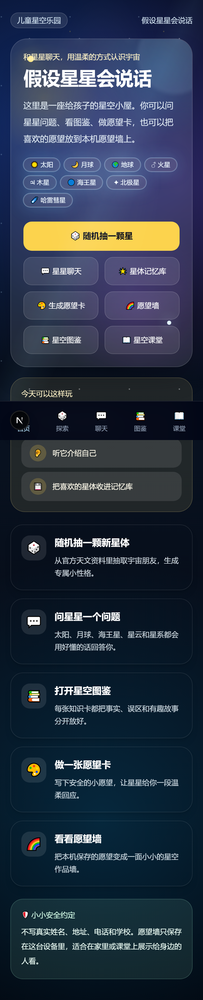
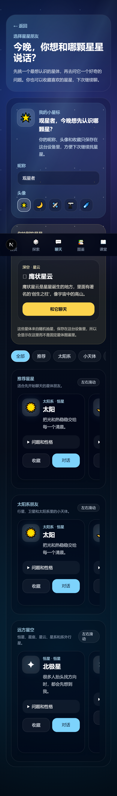
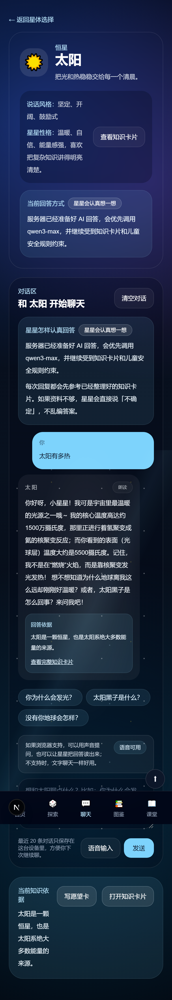
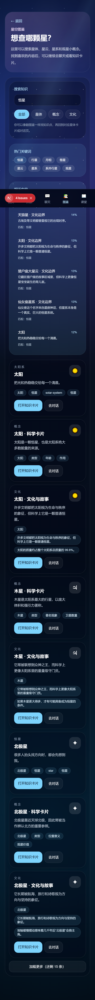
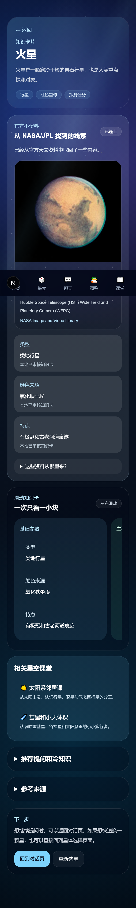
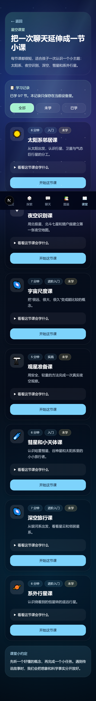
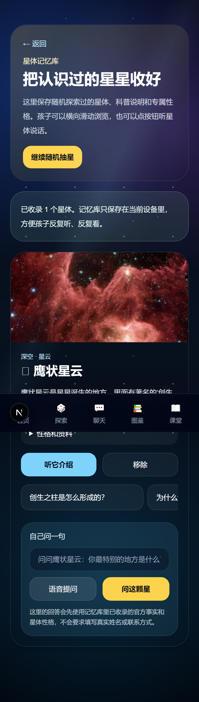
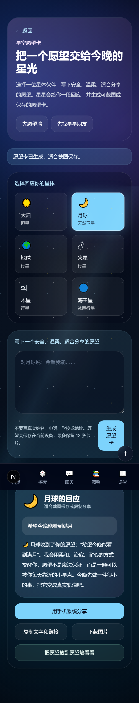

# 项目介绍

## 做了什么

"假设星星会说话"是一个面向 8-25 岁青少年及天文入门爱好者的**天文科普互动 Web App**。核心创意是把天文知识"拟人化":太阳、月球、行星、恒星、星座、深空天体和系外行星都成为可以聊天的角色,孩子以聊天方式主动提问、探索知识,而不是被动阅读图文。

这个项目获得了 **2026 年第九届中国天文学会天文创新作品大赛——天文创新作品——软件产品赛道——国家三等奖(国C)**。

传统天文科普内容以文字、图表、视频或讲座形式呈现,学习路径单向,容易让初学者产生距离感。这个产品以"假设星星会说话"为切入:用户与拟人化星体对话,通过温暖、治愈的表达方式建立情感连接,在互动中获得知识反馈。

## 界面全览

App 是移动优先设计,底部导航五个入口:首页、探索、聊天、图鉴、课堂。

### 首页

### 随机抽星(探索)

点击"随机探索",服务端调用 NASA 官方天文数据拿到真实天体信息和图片,再由大模型生成儿童可读的科普说明和星体性格:

### 星体聊天

选择一个星体进入对话。大模型驱动儿童友好回复,支持语音朗读:

### 星空图鉴

可搜索的知识卡片库,关键词一键检索,语义联想匹配:

知识卡片页面,每个天体一张卡:概要、关键事实、主要特征、常见误解、冷知识、文化故事:

### 星空课堂

短课程模块,本地记录已学/未学状态,支持反向修改:

### 本机记忆库

抽到的星体保存在浏览器本地,支持横向滑动浏览、语音播放和自由提问:

### 愿望卡与愿望墙

选择星体、写下安全愿望,生成可截图保存的星空愿望卡:

愿望墙展示本机保存的愿望卡片,自动过滤个人信息和危险内容:

## 核心能力一览

| 能力 | 说明 |
|------|------|
| 拟人化星体聊天 | 太阳、月球、行星、恒星、星座、深空天体、系外行星,大模型驱动儿童友好回复 |
| 随机抽星 | 服务端调用 NASA 官方天文数据,大模型生成儿童可读科普和星体性格 |
| 本机记忆库 | 抽到的星体保存在浏览器本地,横向滑动浏览、语音播放、自由提问 |
| 语音体验 | 浏览器语音输入、温柔中文女声朗读、可打断播放 |
| 星空图鉴 | 可搜索的知识卡片库,热门关键词一键检索,语义联想匹配 |
| 星空课堂 | 短课程模块,本地记录已学/未学状态,支持反向修改 |
| 愿望卡 | 选择星体、写下安全愿望,生成可截图保存的星空愿望卡 |
| 愿望墙 | 本机保存的愿望卡片展示,自动过滤个人信息和危险内容 |
| 儿童安全边界 | 个人信息、危险内容和不适合儿童的话题会被拦截或温柔引导 |

## 技术栈速览

- **Next.js 15 App Router** + TypeScript + Tailwind CSS
- **Vercel AI SDK**(OpenAI-compatible provider)
- **阿里云 DashScope(qwen3-max)/ OpenAI** 大模型
- **NASA API** 官方天文数据(图片检索、每日天文图片、系外行星档案)
- **localStorage** 本地优先的记忆/愿望/课程进度存储

架构与实现的细节在[下一篇](./02-技术架构.md)展开。
